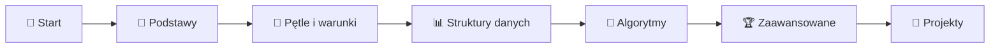

<div align="center">
<a href="https://github.com/djeada/Nauka-programowania/stargazers"></a>
<a href="https://github.com/djeada/Nauka-programowania/network"></a>
<a href="https://github.com/djeada/Nauka-programowania/blob/master/LICENSE"></a>
<a href=""></a>


</div>

# 🚀 Nauka Programowania

> **Witaj w świecie programowania!** 🎉 To kompletna ścieżka rozwoju, która przekształci Cię z początkującego w pewnego siebie programistę!


---

## 🎯 Dlaczego ten kurs?

### ✨ Co sprawia, że jesteśmy wyjątkowi?

```
🌟 200+ praktycznych zadań          📚 7 języków programowania
💡 Od podstaw do zaawansowanych     🎓 Struktura akademicka
🔄 Regularnie aktualizowane         🤝 Otwarta społeczność
✅ Przykładowe rozwiązania          🌍 Darmowy dostęp dla każdego
```

### 🎓 Dla kogo jest ten kurs?

<table>
<tr>
<td width="33%">

**🌱 Początkujący**
- Nigdy nie programowałeś?
- Zaczynasz od zera?
- Idealnie! Zaczynamy od podstaw.

</td>
<td width="33%">

**📈 Średniozaawansowani**
- Znasz podstawy?
- Chcesz uporządkować wiedzę?
- Znajdziesz tu wyzwania!

</td>
<td width="33%">

**🚀 Zaawansowani**
- Powtórka przed rozmową?
- Trening przed olimpiadą?
- Mamy trudne zadania!

</td>
</tr>
</table>

### 🎁 Co zyskasz?

| 💪 Umiejętność | 📝 Opis | 🎯 Zastosowanie |
|---------------|---------|-----------------|
| **Myślenie algorytmiczne** | Naucz się rozwiązywać problemy krok po kroku | Podstawa każdego programisty |
| **7 języków programowania** | Python, C++, Java, JavaScript, Rust, Haskell, Bash | Szeroka perspektywa technologiczna |
| **Struktury danych** | Listy, drzewa, grafy, słowniki | Efektywne rozwiązania |
| **Algorytmy** | Sortowanie, wyszukiwanie, rekurencja | Optymalizacja i wydajność |
| **Best practices** | Czysty kod, testowanie, debugging | Profesjonalne podejście |

---

## 🗺️ Twoja ścieżka nauki



### 📚 Struktura kursu (25 rozdziałów)

<details>
<summary>🟢 <strong>Poziom 1: Podstawy (Rozdziały 1-8)</strong> - Twoje pierwsze kroki</summary>

**Czego się nauczysz:**
- ✍️ Interakcja z konsolą (input/output)
- ❓ Instrukcje warunkowe (if/else)
- 📅 Praca z datami i czasem
- 🔁 Pętle (for, while)
- 🔢 Operacje na liczbach i cyfrach
- 📐 Funkcje - podstawy
- 🧮 Algorytmy matematyczne
- 🔄 Pętle zagnieżdżone

**Metoda weryfikacji:** Manualne testowanie przez konsolę

</details>

<details>
<summary>🟡 <strong>Poziom 2: Średniozaawansowany (Rozdziały 9-17)</strong> - Budujemy fundament</summary>

**Czego się nauczysz:**
- 📋 Listy i tablice
- 🔤 Operacje na napisach
- 🎭 Anagramy i palindromy
- 📊 Tablice dwuwymiarowe
- 📈 Wielomiany i funkcje matematyczne
- 🌀 Rekurencja
- 💾 System binarny
- 📖 Słowniki i hashmaps

**Metoda weryfikacji:** Automatyczne testy, edge cases

</details>

<details>
<summary>🔴 <strong>Poziom 3: Zaawansowany (Rozdziały 18-25)</strong> - Profesjonalne umiejętności</summary>

**Czego się nauczysz:**
- 🏗️ Klasy i obiekty (OOP)
- 👨‍👩‍👧 Dziedziczenie i polimorfizm
- 📁 Operacje na plikach
- 🔄 Algorytmy sortowania
- 🎯 Praktyczne sortowanie
- 🔍 Wyrażenia regularne
- 💪 Zaawansowane operacje na listach
- 🧵 Złożone operacje na napisach

**Metoda weryfikacji:** Kompleksowe testy, debugowanie, profiling

</details>

---

## 🛠️ Wsparcie dla 7 języków programowania

Każde zadanie jest dostępne w 7 popularnych językach! Wybierz swój ulubiony lub naucz się wszystkich:

<table>
<tr>
<td align="center" width="14.28%">
<br/>
<b>Python 3.10+</b><br/>
<sub>Prosty i czytelny</sub>
</td>
<td align="center" width="14.28%">
<br/>
<b>C++ 20</b><br/>
<sub>Wydajny i potężny</sub>
</td>
<td align="center" width="14.28%">
<br/>
<b>Java SE 18</b><br/>
<sub>Stabilny i uniwersalny</sub>
</td>
<td align="center" width="14.28%">
<br/>
<b>Node.js 20</b><br/>
<sub>Web i więcej</sub>
</td>
<td align="center" width="14.28%">
<br/>
<b>Rust 1.74</b><br/>
<sub>Bezpieczny i szybki</sub>
</td>
<td align="center" width="14.28%">
<br/>
<b>Haskell GHC 9.2</b><br/>
<sub>Funkcyjny i elegancki</sub>
</td>
<td align="center" width="14.28%">
<br/>
<b>Bash</b><br/>
<sub>Skrypty i automatyzacja</sub>
</td>
</tr>
</table>

### 💻 Szybki start z każdym językiem

<details>
<summary><b>🐍 Python</b> - Najlepszy dla początkujących</summary>

**Instalacja:**
```bash
# Linux/Mac (zwykle preinstalowany)
python3 --version

# Windows - pobierz z python.org
```

**Uruchomienie:**
```bash
python3 sciezka_do_zadania.py
```

**Formatowanie:**
```bash
pip install black
black sciezka_do_zadania.py
```

**Dlaczego Python?**
- ✅ Najprostsza składnia
- ✅ Ogromna społeczność
- ✅ Świetny do nauki
- ✅ Data Science, AI, Web

</details>

<details>
<summary><b>⚡ C++</b> - Dla ambitnych</summary>

**Instalacja:**
```bash
# Linux
sudo apt-get install g++

# Mac
xcode-select --install

# Windows - MinGW lub Visual Studio
```

**Kompilacja i uruchomienie:**
```bash
g++-10 -ggdb3 -O0 -std=c++20 -Wall -Wextra -pedantic -o program zadanie.cpp
./program
```

**Formatowanie:**
```bash
clang-format -i -style=file zadanie.cpp
```

**Dlaczego C++?**
- ✅ Najszybszy język
- ✅ Pełna kontrola
- ✅ Gry, systemy, embedded
- ✅ Olimpiady programistyczne

</details>

<details>
<summary><b>☕ Java</b> - Dla przyszłości enterprise</summary>

**Instalacja:**
```bash
# Sprawdź czy masz JDK
java -version
javac -version

# Pobierz JDK 18+ z oracle.com lub adoptium.net
```

**Kompilacja i uruchomienie:**
```bash
javac -d . zadanie.java
java NazwaKlasy
```

**Formatowanie:**
```bash
java -jar google-java-format-1.7-all-deps.jar zadanie.java
```

**Dlaczego Java?**
- ✅ Wieloplatformowość
- ✅ Duży rynek pracy
- ✅ Android, Backend
- ✅ Silne typowanie

</details>

<details>
<summary><b>🌐 JavaScript</b> - Król internetu</summary>

**Instalacja:**
```bash
# Zainstaluj Node.js z nodejs.org
node --version
npm --version
```

**Uruchomienie:**
```bash
node zadanie.js
```

**Formatowanie:**
```bash
npm install -g eslint
eslint --fix zadanie.js
```

**Dlaczego JavaScript?**
- ✅ Frontend i Backend
- ✅ Najpopularniejszy język web
- ✅ React, Vue, Angular
- ✅ Full-stack development

</details>

<details>
<summary><b>🦀 Rust</b> - Przyszłość system programming</summary>

**Instalacja:**
```bash
# Linux/Mac/Windows
curl --proto '=https' --tlsv1.2 -sSf https://sh.rustup.rs | sh
```

**Kompilacja i uruchomienie:**
```bash
rustc zadanie.rs
./zadanie
```

**Formatowanie:**
```bash
rustfmt zadanie.rs
```

**Dlaczego Rust?**
- ✅ Memory safety bez GC
- ✅ Rosnąca popularność
- ✅ WebAssembly, systemy
- ✅ Nowoczesne podejście

</details>

<details>
<summary><b>🎩 Haskell</b> - Elegancja funkcyjna</summary>

**Instalacja:**
```bash
# GHCup - uniwersalny instalator
curl --proto '=https' --tlsv1.2 -sSf https://get-ghcup.haskell.org | sh
```

**Kompilacja i uruchomienie:**
```bash
ghc -o program zadanie.hs
./program
```

**Formatowanie:**
```bash
ormolu --mode inplace zadanie.hs
```

**Dlaczego Haskell?**
- ✅ Programowanie funkcyjne
- ✅ Matematyczna elegancja
- ✅ Silny system typów
- ✅ Rozwój intelektualny

</details>

<details>
<summary><b>🐚 Bash</b> - Potęga skryptów</summary>

**Instalacja:**
```bash
# Linux/Mac - preinstalowany
bash --version

# Windows - WSL lub Git Bash
```

**Uruchomienie:**
```bash
bash zadanie.sh
# lub
chmod +x zadanie.sh
./zadanie.sh
```

**Dlaczego Bash?**
- ✅ Automatyzacja zadań
- ✅ DevOps i CI/CD
- ✅ Administracja systemami
- ✅ Szybkie skrypty

</details>

---

## 📖 Dodatkowe materiały do nauki

Oferujemy szeroki wybór dodatkowych materiałów edukacyjnych:

<table>
<tr>
<td width="50%">

### 🐍 Python - Kompletny kurs
[](https://github.com/djeada/Kurs-podstaw-Pythona)

**Co zawiera:**
- 📚 Kompletne notatki teoretyczne
- 💻 Przykłady praktyczne
- 🎯 Projekty końcowe
- 🔬 Data Science i AI

</td>
<td width="50%">

### ⚡ C++ - Od podstaw do eksperta
[](https://github.com/djeada/C-and-Cpp)

**Co zawiera:**
- 📖 Szczegółowe notatki
- 🎓 Od C do C++20
- 🚀 Zaawansowane tematy
- 🏗️ Wzorce projektowe

</td>
</tr>
</table>

---

## 🎯 Zbiór zadań - Serce kursu

<div align="center">

### 📊 Statystyki

| 📚 Rozdziały | 📝 Zadania | 💻 Języki | ⭐ Poziomy trudności | 🔄 Aktualizacje |
|:------------:|:----------:|:---------:|:--------------------:|:---------------:|
| **25** | **200+** | **7** | **3** | **Cotygodniowe** |

</div>

### 🌟 Jak korzystać z zadań?

```
1️⃣ Wybierz rozdział odpowiadający Twojemu poziomowi
2️⃣ Przeczytaj opis zadania w zbiorze zadań
3️⃣ Spróbuj rozwiązać samodzielnie
4️⃣ Sprawdź przykładowe rozwiązania w różnych językach
5️⃣ Porównaj podejścia i naucz się różnych perspektyw
```

### 📚 Dostęp do zadań

<table>
<tr>
<td width="50%" align="center">

**📂 Zbiór zadań (opisy)**

[](https://github.com/djeada/Nauka-Programowania/tree/master/zbior_zadan)

Szczegółowe opisy wszystkich zadań<br/>
z przykładami i wskazówkami

</td>
<td width="50%" align="center">

**💾 Rozwiązania (kod)**

[](https://github.com/djeada/Nauka-Programowania/tree/master/src)

Przykładowe implementacje<br/>
w 7 językach programowania

</td>
</tr>
</table>

### 🤝 Dodaj swoje rozwiązania!

Masz ciekawe rozwiązanie? Podziel się nim ze społecznością!

[](https://github.com/djeada/Nauka-Programowania/blob/master/CONTRIBUTING.md)

**Proces krok po kroku:**
1. 🍴 Fork repozytorium
2. 💻 Dodaj swoje rozwiązanie
3. ✅ Sprawdź czy działa
4. 📝 Stwórz Pull Request
5. 🎉 Dołącz do społeczności kontrybutorów!

---

## 🎓 O zadaniach - Szczegółowy przewodnik

### 📊 Poziomy trudności wyjaśnione

| Poziom | Symbol | Zakres | Czas | Umiejętności |
|--------|--------|--------|------|--------------|
| **Łatwy** | ★☆☆ | Rozdziały 1-8 | 5-15 min | Podstawowa składnia, proste algorytmy |
| **Średni** | ★★☆ | Rozdziały 9-17 | 15-45 min | Struktury danych, myślenie algorytmiczne |
| **Trudny** | ★★★ | Rozdziały 18-25 | 45+ min | Zaawansowane algorytmy, optymalizacja |

### 🎯 Szczegółowy breakdown poziomów

<details>
<summary><b>★☆☆ Poziom Podstawowy (Rozdziały 1-8)</b></summary>

**Charakterystyka:**
- 🎯 Zadania do 15 minut
- 📝 Jasno określone wymagania
- 💡 Jedno rozwiązanie na zadanie
- ✅ Testowanie manualne

**Przykładowe tematy:**
- Interakcja z konsolą (print, input)
- Proste operacje matematyczne
- Instrukcje warunkowe (if-else)
- Podstawowe pętle (for, while)
- Operacje na zmiennych
- Daty i czas

**Idealne dla:**
- Osób zaczynających przygodę z programowaniem
- Uczniów szkół podstawowych i średnich
- Wszystkich, którzy chcą poznać składnię języka

</details>

<details>
<summary><b>★★☆ Poziom Średniozaawansowany (Rozdziały 9-17)</b></summary>

**Charakterystyka:**
- ⏱️ Zadania 15-45 minut
- 🧩 Wymagają myślenia algorytmicznego
- 🔍 Należy uwzględnić edge cases
- ✅ Automatyczne testy

**Przykładowe tematy:**
- Listy i tablice (operacje, przeszukiwanie)
- Napisy (manipulacja, parsowanie)
- Anagramy i palindromy
- Tablice wielowymiarowe
- Funkcje matematyczne
- Rekurencja (podstawy)
- System binarny
- Słowniki i mapy

**Idealne dla:**
- Osób znających podstawy programowania
- Studentów informatyki (1-2 rok)
- Kandydatów na junior developera

</details>

<details>
<summary><b>★★★ Poziom Zaawansowany (Rozdziały 18-25)</b></summary>

**Charakterystyka:**
- 🕐 Zadania 45+ minut
- 🧠 Złożone algorytmy
- ⚡ Wymagana optymalizacja
- 🔧 Debugowanie i profiling
- ✅ Kompleksowe testy

**Przykładowe tematy:**
- Programowanie obiektowe (klasy, dziedziczenie)
- Operacje na plikach
- Algorytmy sortowania (bubble, quick, merge)
- Wyrażenia regularne
- Zaawansowane struktury danych
- Problemy optymalizacyjne
- Algorytmy z olimpiad programistycznych

**Idealne dla:**
- Programistów z doświadczeniem
- Studentów wyższych lat informatyki
- Kandydatów na stanowiska mid/senior
- Uczestników olimpiad programistycznych

</details>

### 💡 Przykładowe rozwiązania

**Dlaczego wiele rozwiązań?**

Dla większości zadań znajdziesz kilka różnych podejść:

| Podejście | Zalety | Przykład użycia |
|-----------|--------|-----------------|
| **Iteracyjne** | Prosty, czytelny | Początkujący, prosta logika |
| **Rekurencyjne** | Elegancki, matematyczny | Problemy dziel-i-zwyciężaj |
| **Funkcyjne** | Deklaratywny, zwięzły | Transformacje danych |
| **Optymalne** | Najszybszy, efektywny | Duże zbiory danych |

---

## 🚀 Jak zacząć? - Przewodnik krok po kroku

### 🌱 Dla absolutnych początkujących

```
Krok 1: Wybierz język 🎯
         ↓
         Python - najprostszy start!
         
Krok 2: Zainstaluj środowisko 💻
         ↓
         IDE: PyCharm Community / VS Code
         
Krok 3: Rozpocznij od Rozdziału 1 📚
         ↓
         01_interakcja_z_konsola
         
Krok 4: Rozwiązuj po kolei 📝
         ↓
         Nie przeskakuj zadań!
         
Krok 5: Sprawdź rozwiązania ✅
         ↓
         Porównaj ze swoim kodem
         
Krok 6: Eksperymentuj 🔬
         ↓
         Modyfikuj, testuj, ucz się!
```

### 📈 Dla średniozaawansowanych

<table>
<tr>
<td width="50%">

**🎯 Twój plan działania:**

1. **Oceń swoją wiedzę**
   - Przejrzyj rozdziały 1-8
   - Rozwiąż kilka zadań testowych
   - Określ swój poziom

2. **Wybierz punkt startowy**
   - Jeśli 80% jest łatwe → Start od r. 9
   - Jeśli są luki → Uzupełnij braki

3. **Ćwicz systematycznie**
   - Minimum 3 zadania dziennie
   - Różne poziomy trudności
   - Różne języki (opcjonalnie)

</td>
<td width="50%">

**💪 Wskazówki:**

- ✅ Nie czytaj rozwiązania od razu
- ✅ Próbuj kilku podejść
- ✅ Mierz czas rozwiązania
- ✅ Testuj edge cases
- ✅ Optymalizuj kod
- ✅ Dokumentuj rozwiązania
- ✅ Dziel się z innymi

</td>
</tr>
</table>

### 🏆 Dla zaawansowanych

**Wyzwania dla ekspertów:**

1. **Multi-język challenge** 🌍
   - Rozwiąż to samo zadanie w 3+ językach
   - Porównaj wydajność
   - Naucz się idiomów każdego języka

2. **Optymalizacja** ⚡
   - Znajdź najszybsze rozwiązanie
   - Zmierz złożoność czasową i pamięciową
   - Benchmark różnych podejść

3. **Code review** 👥
   - Recenzuj kod innych
   - Sugeruj usprawnienia
   - Dołącz do społeczności

4. **Kontrybuuj** 🤝
   - Dodaj nowe zadania
   - Popraw istniejące rozwiązania
   - Twórz tutoriale

---

## 🛠️ Narzędzia i środowisko pracy

### 💻 Zalecane IDE

<table>
<tr>
<td align="center" width="25%">

**VS Code**<br/>
<br/>
Uniwersalny, lekki<br/>
[Pobierz](https://code.visualstudio.com/)

</td>
<td align="center" width="25%">

**PyCharm**<br/>
<br/>
Najlepszy dla Python<br/>
[Pobierz](https://www.jetbrains.com/pycharm/)

</td>
<td align="center" width="25%">

**IntelliJ IDEA**<br/>
<br/>
Doskonały dla Java<br/>
[Pobierz](https://www.jetbrains.com/idea/)

</td>
<td align="center" width="25%">

**CLion**<br/>
<br/>
Profesjonalny dla C++<br/>
[Pobierz](https://www.jetbrains.com/clion/)

</td>
</tr>
</table>

### 🔧 Przydatne rozszerzenia (VS Code)

```javascript
// Python
- Python (Microsoft)
- Pylance
- Python Docstring Generator

// C++
- C/C++ (Microsoft)
- CMake Tools
- C++ Intellisense

// Java
- Language Support for Java
- Debugger for Java
- Maven for Java

// JavaScript
- ESLint
- Prettier
- JavaScript (ES6) code snippets

// Ogólne
- GitLens
- Live Share
- Error Lens
- Code Runner
```

### 🐛 Narzędzia do debugowania

| Język | Narzędzie | Zastosowanie |
|-------|-----------|--------------|
| Python | `pdb`, PyCharm Debugger | Breakpointy, step-through |
| C++ | `gdb`, `lldb` | Memory leaks, segfaults |
| Java | IntelliJ Debugger | Stack traces, profiling |
| JavaScript | Chrome DevTools, Node Inspector | Async debugging |

---

## 📊 Wspierane wersje języków - Szczegóły techniczne

<table>
<thead>
<tr>
<th width="12%">Język</th>
<th width="15%">Wersja</th>
<th width="35%">Kompilacja/Uruchomienie</th>
<th width="38%">Formatowanie</th>
</tr>
</thead>
<tbody>
<tr>
<td><b>🐍 Python</b></td>
<td><code>3.10+</code></td>
<td><code>python3 sciezka_do_zadania.py</code></td>
<td><code>black sciezka_do_zadania.py</code></td>
</tr>
<tr>
<td><b>⚡ C++</b></td>
<td><code>C++11/17/20</code></td>
<td><code>g++-10 -ggdb3 -O0 -std=c++20 -Wall -Wextra -pedantic -o plik.out zadanie.cpp</code></td>
<td><code>clang-format -i -style=file zadanie.cpp</code></td>
</tr>
<tr>
<td><b>☕ Java</b></td>
<td><code>SE 18+</code></td>
<td><code>javac -d . zadanie.java && java NazwaKlasy</code></td>
<td><code>java -jar google-java-format.jar zadanie.java</code></td>
</tr>
<tr>
<td><b>🌐 JavaScript</b></td>
<td><code>Node.js 20+</code></td>
<td><code>node sciezka_do_zadania.js</code></td>
<td><code>eslint --fix zadanie.js</code></td>
</tr>
<tr>
<td><b>🦀 Rust</b></td>
<td><code>1.74.0+</code></td>
<td><code>rustc zadanie.rs && ./zadanie</code></td>
<td><code>rustfmt zadanie.rs</code></td>
</tr>
<tr>
<td><b>🎩 Haskell</b></td>
<td><code>GHC 9.2.1+</code></td>
<td><code>ghc -o plik.out zadanie.hs && ./plik.out</code></td>
<td><code>ormolu --mode inplace zadanie.hs</code></td>
</tr>
<tr>
<td><b>🐚 Bash</b></td>
<td><code>4.0+</code></td>
<td><code>bash zadanie.sh</code> lub <code>./zadanie.sh</code></td>
<td><code>shfmt -w zadanie.sh</code></td>
</tr>
</tbody>
</table>

### ⚙️ Konfiguracja środowiska

<details>
<summary><b>🐧 Linux (Ubuntu/Debian)</b></summary>

```bash
# Zainstaluj wszystkie narzędzia jedną komendą
sudo apt update && sudo apt install -y \
    python3 python3-pip \
    g++ clang-format \
    default-jdk \
    nodejs npm \
    rustc cargo \
    ghc cabal-install \
    bash

# Python tools
pip3 install black pylint

# JavaScript tools
npm install -g eslint prettier

# Rust tools (alternatywnie przez rustup)
curl --proto '=https' --tlsv1.2 -sSf https://sh.rustup.rs | sh
```

</details>

<details>
<summary><b>🍎 macOS</b></summary>

```bash
# Użyj Homebrew
brew install python3 gcc node rust ghc cabal-install

# Python tools
pip3 install black pylint

# JavaScript tools
npm install -g eslint prettier

# Formatter tools
brew install clang-format
```

</details>

<details>
<summary><b>🪟 Windows</b></summary>

**Opcja 1: Menedżery pakietów**
```powershell
# Chocolatey
choco install python3 mingw nodejs rust ghc

# Lub Scoop
scoop install python gcc nodejs rust ghc
```

**Opcja 2: Manualna instalacja**
- Python: [python.org](https://www.python.org)
- MinGW: [mingw-w64.org](http://mingw-w64.org)
- Node.js: [nodejs.org](https://nodejs.org)
- Rust: [rustup.rs](https://rustup.rs)
- Haskell: [haskell.org](https://www.haskell.org/platform)

**Opcja 3: WSL (Zalecane!)**
```bash
# Zainstaluj WSL2 i Ubuntu, potem użyj instrukcji dla Linux
wsl --install
```

</details>

---

## ❓ FAQ - Najczęściej zadawane pytania

<details>
<summary><b>🤔 Od jakiego języka powinienem zacząć?</b></summary>

**Dla większości osób: Python** 🐍

**Dlaczego?**
- ✅ Najprostsza składnia
- ✅ Szybki feedback
- ✅ Ogromna społeczność
- ✅ Szeroka aplikacja (web, data science, AI)

**Alternatywy:**
- **JavaScript** - jeśli interesujesz się web developmentem
- **C++** - jeśli planujesz olimpiady lub rozwój gier
- **Java** - jeśli myślisz o Android lub enterprise

</details>

<details>
<summary><b>⏰ Ile czasu zajmie przejście kursu?</b></summary>

**To zależy od Twojego tempa:**

| Tempo | Czas dziennie | Całkowity czas | Poziom końcowy |
|-------|---------------|----------------|----------------|
| 🚀 Intensywne | 4-6h | 2-3 miesiące | Zaawansowany |
| 📚 Normalne | 2-3h | 4-6 miesięcy | Średniozaawansowany+ |
| 🐢 Spokojne | 1h | 8-12 miesięcy | Solidne podstawy |

**Pamiętaj:** Jakość > Ilość. Lepiej 1h dziennie przez rok niż 8h przez tydzień!

</details>

<details>
<summary><b>💰 Czy ten kurs jest darmowy?</b></summary>

**TAK! W 100% darmowy i otwarty! 🎉**

- ✅ Wszystkie zadania - FREE
- ✅ Wszystkie rozwiązania - FREE
- ✅ Dodatkowe materiały - FREE
- ✅ Wsparcie społeczności - FREE

**Licencja:** MIT - możesz używać, modyfikować i dzielić się!

</details>

<details>
<summary><b>🎓 Czy po tym kursie znajdę pracę?</b></summary>

**Ten kurs daje fundamenty, ale...**

**Co jeszcze potrzebujesz:**
1. **Portfolio** - 3-5 projektów pokazujących Twoje umiejętności
2. **Git/GitHub** - umiejętność pracy z kontrolą wersji
3. **Specjalizacja** - wybierz kierunek (web, mobile, data, etc.)
4. **Soft skills** - komunikacja, praca w zespole
5. **Praktyka** - staże, projekty open source

**Ten kurs:**
- ✅ Nauczy Cię programować
- ✅ Przygotuje do rozmów technicznych
- ✅ Da solidne podstawy algorytmiczne
- ⚠️ Ale nie zastąpi doświadczenia praktycznego

</details>

<details>
<summary><b>🤝 Jak mogę pomóc w rozwoju projektu?</b></summary>

**Wiele sposobów!**

1. **⭐ Gwiazdka na GitHubie** - pomaga w widoczności
2. **🐛 Zgłaszaj błędy** - znajdź i zgłoś issue
3. **💻 Dodaj rozwiązania** - w nowych językach lub lepsze podejścia
4. **📝 Popraw dokumentację** - literówki, wyjaśnienia
5. **🌍 Tłumaczenia** - pomóż w wersjach innych językach
6. **💬 Pomóż innym** - odpowiadaj na pytania w issues
7. **📣 Promuj projekt** - podziel się z znajomymi

[Zobacz CONTRIBUTING.md dla szczegółów](https://github.com/djeada/Nauka-Programowania/blob/master/CONTRIBUTING.md)

</details>

<details>
<summary><b>🆘 Utknąłem na zadaniu. Co robić?</b></summary>

**Krok po kroku:**

1. **Zrozum problem** 📖
   - Przeczytaj zadanie ponownie
   - Zapisz wymagania
   - Zrób przykłady na papierze

2. **Rozbij na części** 🧩
   - Podziel na mniejsze problemy
   - Rozwiąż najprostszą część
   - Buduj stopniowo

3. **Debuguj** 🔍
   - Użyj print/console.log
   - Sprawdź edge cases
   - Testuj krok po kroku

4. **Szukaj pomocy** 💬
   - Przejrzyj materiały dodatkowe
   - Sprawdź podobne zadania
   - Zapytaj społeczność (Issues)

5. **Zobacz rozwiązanie** 👀
   - Ale dopiero po próbach!
   - Zrozum, nie kopiuj
   - Spróbuj zaimplementować samodzielnie

</details>

<details>
<summary><b>🔄 Czy muszę rozwiązywać zadania po kolei?</b></summary>

**Zalecane: TAK, szczególnie dla początkujących**

**Dlaczego?**
- ✅ Progresywna trudność
- ✅ Każde zadanie buduje na poprzednich
- ✅ Unikniecie luk w wiedzy

**Kiedy możesz przeskakiwać?**
- ✓ Masz już doświadczenie
- ✓ Pracujesz nad konkretnymi lukami
- ✓ Chcesz powtórzyć konkretny temat

**Wskazówka:** Jeśli przeskakujesz, wróć później do pominiętych!

</details>

<details>
<summary><b>📱 Czy mogę programować na tablecie/telefonie?</b></summary>

**Możesz, ale...**

**✅ Możliwe na mobile:**
- Nauka teorii
- Przeglądanie kodu
- Proste zadania (Python, JavaScript)

**❌ Trudne na mobile:**
- Kompilacja (C++, Rust)
- Wieloplikowe projekty
- Debugowanie
- Dłuższe sesje

**Najlepsze aplikacje:**
- **Android:** Pydroid 3, Dcoder
- **iOS:** Pythonista, Swift Playgrounds
- **Universal:** Replit (przeglądarka)

**Rekomendacja:** Używaj jako uzupełnienie, nie główne narzędzie!

</details>

---

## 🌟 Społeczność i wsparcie

### 💬 Jak możemy Ci pomóc?

<table>
<tr>
<td width="33%" align="center">

**🐛 Znalazłeś błąd?**

[](https://github.com/djeada/Nauka-Programowania/issues)

Zgłoś go!<br/>
Naprawimy najszybciej jak to możliwe

</td>
<td width="33%" align="center">

**💡 Masz pytanie?**

[](https://github.com/djeada/Nauka-Programowania/discussions)

Zapytaj społeczność!<br/>
Chętnie pomożemy

</td>
<td width="33%" align="center">

**🤝 Chcesz pomóc?**

[](https://github.com/djeada/Nauka-Programowania/pulls)

Twój wkład jest ceniony!<br/>
Zobacz CONTRIBUTING.md

</td>
</tr>
</table>

### 👥 Społeczność

**Dołącz do naszej rosnącej społeczności programistów!**

- 🌟 **Ponad 1000+ gwiazdek** na GitHubie
- 👥 **Setki kontrybutorów** z całego świata
- 💻 **Tysiące rozwiązanych zadań**
- 🌍 **Globalna społeczność** programistów

### 🏆 Hall of Fame - Najlepsi Kontrybutorzy

Specjalne podziękowania dla osób, które wniosły największy wkład w rozwój projektu!

<!-- Lista kontrybutorów będzie automatycznie aktualizowana -->
[](https://github.com/djeada/Nauka-Programowania/graphs/contributors)

**Chcesz tu zobaczyć swoje zdjęcie? [Zacznij kontrybuować!](CONTRIBUTING.md)**

---

## 🎯 Roadmap - Co dalej po kursie?

### 🌱 Ścieżki rozwoju

Po ukończeniu tego kursu masz wiele opcji:

<table>
<tr>
<td width="50%">

### 🌐 Web Development

**Frontend:**
- HTML, CSS, JavaScript
- React / Vue / Angular
- Responsive design
- TypeScript

**Backend:**
- Node.js / Django / Spring
- REST APIs / GraphQL
- Bazy danych
- Authentication

**Zasoby:**
- [MDN Web Docs](https://developer.mozilla.org)
- [FreeCodeCamp](https://freecodecamp.org)

</td>
<td width="50%">

### 📊 Data Science & AI

**Fundamenty:**
- NumPy, Pandas
- Matplotlib, Seaborn
- Jupyter Notebooks
- Statystyka

**Machine Learning:**
- Scikit-learn
- TensorFlow / PyTorch
- Deep Learning
- NLP

**Zasoby:**
- [Kaggle](https://kaggle.com)
- [Fast.ai](https://fast.ai)

</td>
</tr>
<tr>
<td width="50%">

### 📱 Mobile Development

**Android:**
- Kotlin
- Android Studio
- Jetpack Compose
- Material Design

**iOS:**
- Swift
- Xcode
- SwiftUI
- UIKit

**Cross-platform:**
- React Native
- Flutter

</td>
<td width="50%">

### ⚙️ Systems & Low-Level

**Obszary:**
- Systemy operacyjne
- Embedded systems
- Programowanie sieciowe
- Kompilatory

**Języki:**
- C / C++
- Rust
- Assembly

**Zasoby:**
- [OSDev](https://osdev.org)
- [Rust Book](https://doc.rust-lang.org/book)

</td>
</tr>
</table>

### 📚 Polecane następne kroki

1. **Wybierz specjalizację** 🎯
   - Zastanów się co Cię interesuje
   - Zbadaj rynek pracy
   - Porozmawiaj z profesjonalistami

2. **Zbuduj portfolio** 💼
   - 3-5 solidnych projektów
   - GitHub profile
   - Personal website
   - Blog (opcjonalnie)

3. **Zdobądź doświadczenie** 💪
   - Open source contributions
   - Freelancing (Upwork, Fiverr)
   - Staże
   - Własne projekty

4. **Networking** 🤝
   - Meetupy i konferencje
   - LinkedIn
   - Twitter/X tech community
   - Discord servers

5. **Ciągła nauka** 📖
   - Śledź trendy
   - Czytaj dokumentację
   - Rozwiązuj nowe problemy
   - Ucz innych (najlepszy sposób nauki!)

---

## 📊 Statystyki projektu

<div align="center">


</div>

---

## 🎓 Nauka programowania to proces

> **"The only way to learn a new programming language is by writing programs in it."** - Dennis Ritchie

### 💡 Złote zasady

```
1. 🔥 Konsystencja > Intensywność
   Lepiej 1h dziennie niż 7h w weekend

2. 🧠 Zrozumienie > Zapamiętanie
   Rozumiej dlaczego, nie tylko jak

3. 🛠️ Praktyka > Teoria
   Pisz kod, dużo kodu

4. 🤝 Teach to learn
   Najlepiej uczymy się ucząc innych

5. 🔄 Błędy są ok
   Każdy błąd to lekcja

6. 🎯 Projekty > Tutoriale
   Buduj rzeczywiste projekty

7. 🌱 Nigdy nie przestawaj
   Programowanie to ciągła nauka
```

### 🚀 Motywacja

<table>
<tr>
<td width="50%">

**🎯 Stawiaj cele:**
- ✅ Krótkoterminowe (1 rozdział/tydzień)
- ✅ Średnioterminowe (cały kurs/3 miesiące)
- ✅ Długoterminowe (praca/1 rok)

**📊 Śledź postępy:**
- ✅ Prowadź dziennik nauki
- ✅ Celebrate small wins
- ✅ Review co tydzień

</td>
<td width="50%">

**💪 Radzenie z trudnościami:**
- ✅ Zrób przerwę gdy utkniesz
- ✅ Rozbij problem na części
- ✅ Pytaj o pomoc (nie ma głupich pytań!)
- ✅ Pamiętaj - każdy przez to przechodził

**🎉 Nagradzaj się:**
- ✅ Po każdym rozdziale
- ✅ Po trudnym zadaniu
- ✅ Za wytrwałość

</td>
</tr>
</table>

---

## 📚 Rozwiązania - Indeks wszystkich zadań

**Szybka nawigacja:** Kliknij w nazwę rozdziału aby przejść do szczegółów

<!--ts-->
   1. [Interakcja z konsolą](#Interakcja-z-konsolą)
   1. [Instrukcja warunkowa](#Instrukcja-warunkowa)
   1. [Daty](#Daty)
   1. [Pętla - wprowadzenie](#Pętla---wprowadzenie)
   1. [Pętla - wyznaczanie cyfr liczby](#Pętla---wyznaczanie-cyfr-liczby)
   1. [Funkcje - wprowadzenie](#Funkcje---wprowadzenie)
   1. [Pętla - algorytmy matematyczne](#Pętla---algorytmy-matematyczne)
   1. [Pętla - pętle zagnieżdżone](#Pętla---pętle-zagnieżdżone)
   1. [Listy - wprowadzenie](#Listy---wprowadzenie)
   1. [Listy - dwie listy](#Listy---dwie-listy)
   1. [Napisy - wprowadzenie](#Napisy---wprowadzenie)
   1. [Napisy - anagramy i palindromy](#Napisy---anagramy-i-palindromy)
   1. [Listy 2d](#Listy-2d)
   1. [Funkcje - wielomiany](#Funkcje---wielomiany)
   1. [Funkcje - rekurencja](#Funkcje---rekurencja)
   1. [System binarny](#System-binarny)
   1. [Słowniki](#Słowniki)
   1. [Klasy](#Klasy)
   1. [Dziedziczenie](#Dziedziczenie)
   1. [Operacje na plikach](#Operacje-na-plikach)
   1. [Sortowanie - algorytmy](#Sortowanie---algorytmy)
   1. [Sortowanie - praktyka](#Sortowanie---praktyka)
   1. [Wyrażenia regularne](#Wyrażenia-regularne)
   1. [Listy - trudne](#Listy---trudne)
   1. [Napisy - trudne](#Napisy---trudne)

<!--te-->

## Interakcja z konsolą

<table>
    <thead>
        <tr>
            <th>#</th>
            <th>Tytuł</th>
            <th colspan="7">Rozwiązania</th>
            <th>Poziom</th>
        </tr>
    </thead>
    <tbody>
        <tr>
            <td>1</td>
            <td>Wypisz na standardowe wyjście.</td>
            <td><a href="https://github.com/djeada/Nauka-programowania/blob/master/src/python/01_interakcja_z_konsola/zad01.py">Python</a></td>
            <td><a href="https://github.com/djeada/Nauka-programowania/blob/master/src/cpp/01_interakcja_z_konsola/zad01.cpp">Cpp</a></td>
            <td><a href="https://github.com/djeada/Nauka-programowania/blob/master/src/java/01_interakcja_z_konsola/zad1">Java</a></td>
            <td><a href="https://github.com/djeada/Nauka-programowania/blob/master/src/js/01_interakcja_z_konsola/zad01.js">JavaScript</a></td>
            <td><a href="https://github.com/djeada/Nauka-programowania/blob/master/src/bash/01_interakcja_z_konsola/zad01.sh">Bash</a></td>
            <td><a href="https://github.com/djeada/Nauka-programowania/blob/master/src/haskell/01_interakcja_z_konsola/zad01.hs">Haskell</a></td>
            <td><a href="https://github.com/djeada/Nauka-programowania/blob/master/src/rust/01_interakcja_z_konsola/zad01.rs">Rust</a></td>
            <td>★☆☆</td>
        </tr>
        <tr>
            <td>2</td>
            <td>Zamiana kolejności.</td>
            <td><a href="https://github.com/djeada/Nauka-programowania/blob/master/src/python/01_interakcja_z_konsola/zad02.py">Python</a></td>
            <td><a href="https://github.com/djeada/Nauka-programowania/blob/master/src/cpp/01_interakcja_z_konsola/zad02.cpp">Cpp</a></td>
            <td><a href="https://github.com/djeada/Nauka-programowania/blob/master/src/java/01_interakcja_z_konsola/zad2">Java</a></td>
            <td><a href="https://github.com/djeada/Nauka-programowania/blob/master/src/js/01_interakcja_z_konsola/zad02.js">JavaScript</a></td>
            <td><a href="https://github.com/djeada/Nauka-programowania/blob/master/src/bash/01_interakcja_z_konsola/zad02.sh">Bash</a></td>
            <td><a href="https://github.com/djeada/Nauka-programowania/blob/master/src/haskell/01_interakcja_z_konsola/zad02.hs">Haskell</a></td>
            <td><a href="https://github.com/djeada/Nauka-programowania/blob/master/src/rust/01_interakcja_z_konsola/zad02.rs">Rust</a></td>
            <td>★☆☆</td>
        </tr>
        <tr>
            <td>3</td>
            <td>Narysuj kształt.</td>
            <td><a href="https://github.com/djeada/Nauka-programowania/blob/master/src/python/01_interakcja_z_konsola/zad03.py">Python</a></td>
            <td><a href="https://github.com/djeada/Nauka-programowania/blob/master/src/cpp/01_interakcja_z_konsola/zad03.cpp">Cpp</a></td>
            <td><a href="https://github.com/djeada/Nauka-programowania/blob/master/src/java/01_interakcja_z_konsola/zad3">Java</a></td>
            <td><a href="https://github.com/djeada/Nauka-programowania/blob/master/src/js/01_interakcja_z_konsola/zad03.js">JavaScript</a></td>
            <td><a href="https://github.com/djeada/Nauka-programowania/blob/master/src/bash/01_interakcja_z_konsola/zad03.sh">Bash</a></td>
            <td><a href="https://github.com/djeada/Nauka-programowania/blob/master/src/haskell/01_interakcja_z_konsola/zad03.hs">Haskell</a></td>
            <td><a href="https://github.com/djeada/Nauka-programowania/blob/master/src/rust/01_interakcja_z_konsola/zad03.rs">Rust</a></td>
            <td>★☆☆</td>
        </tr>
        <tr>
            <td>4</td>
            <td>Operacje arytmetyczne.</td>
            <td><a href="https://github.com/djeada/Nauka-programowania/blob/master/src/python/01_interakcja_z_konsola/zad04.py">Python</a></td>
            <td><a href="https://github.com/djeada/Nauka-programowania/blob/master/src/cpp/01_interakcja_z_konsola/zad04.cpp">Cpp</a></td>
            <td><a href="https://github.com/djeada/Nauka-programowania/blob/master/src/java/01_interakcja_z_konsola/zad4">Java</a></td>
            <td><a href="https://github.com/djeada/Nauka-programowania/blob/master/src/js/01_interakcja_z_konsola/zad04.js">JavaScript</a></td>
            <td><a href="https://github.com/djeada/Nauka-programowania/blob/master/src/bash/01_interakcja_z_konsola/zad04.sh">Bash</a></td>
            <td><a href="https://github.com/djeada/Nauka-programowania/blob/master/src/haskell/01_interakcja_z_konsola/zad04.hs">Haskell</a></td>
            <td><a href="https://github.com/djeada/Nauka-programowania/blob/master/src/rust/01_interakcja_z_konsola/zad04.rs">Rust</a></td>
            <td>★☆☆</td>
        </tr>
        <tr>
            <td>5</td>
            <td>Wartość funkcji w punkcie.</td>
            <td><a href="https://github.com/djeada/Nauka-programowania/blob/master/src/python/01_interakcja_z_konsola/zad05.py">Python</a></td>
            <td><a href="https://github.com/djeada/Nauka-programowania/blob/master/src/cpp/01_interakcja_z_konsola/zad05.cpp">Cpp</a></td>
            <td><a href="https://github.com/djeada/Nauka-programowania/blob/master/src/java/01_interakcja_z_konsola/zad5">Java</a></td>
            <td><a href="https://github.com/djeada/Nauka-programowania/blob/master/src/js/01_interakcja_z_konsola/zad05.js">JavaScript</a></td>
            <td><a href="https://github.com/djeada/Nauka-programowania/blob/master/src/bash/01_interakcja_z_konsola/zad05.sh">Bash</a></td>
            <td><a href="https://github.com/djeada/Nauka-programowania/blob/master/src/haskell/01_interakcja_z_konsola/zad05.hs">Haskell</a></td>
            <td><a href="https://github.com/djeada/Nauka-programowania/blob/master/src/rust/01_interakcja_z_konsola/zad05.rs">Rust</a></td>
            <td>★☆☆</td>
        </tr>
        <tr>
            <td>6</td>
            <td>Zamiana jednostek.</td>
            <td><a href="https://github.com/djeada/Nauka-programowania/blob/master/src/python/01_interakcja_z_konsola/zad06.py">Python</a></td>
            <td><a href="https://github.com/djeada/Nauka-programowania/blob/master/src/cpp/01_interakcja_z_konsola/zad06.cpp">Cpp</a></td>
            <td><a href="https://github.com/djeada/Nauka-programowania/blob/master/src/java/01_interakcja_z_konsola/zad6">Java</a></td>
            <td><a href="https://github.com/djeada/Nauka-programowania/blob/master/src/js/01_interakcja_z_konsola/zad06.js">JavaScript</a></td>
            <td><a href="https://github.com/djeada/Nauka-programowania/blob/master/src/bash/01_interakcja_z_konsola/zad06.sh">Bash</a></td>
            <td><a href="https://github.com/djeada/Nauka-programowania/blob/master/src/haskell/01_interakcja_z_konsola/zad06.hs">Haskell</a></td>
            <td><a href="https://github.com/djeada/Nauka-programowania/blob/master/src/rust/01_interakcja_z_konsola/zad06.rs">Rust</a></td>
            <td>★☆☆</td>
        </tr>
        <tr>
            <td>7</td>
            <td>Pola figur i objętości brył.</td>
            <td><a href="https://github.com/djeada/Nauka-programowania/blob/master/src/python/01_interakcja_z_konsola/zad07.py">Python</a></td>
            <td><a href="https://github.com/djeada/Nauka-programowania/blob/master/src/cpp/01_interakcja_z_konsola/zad07.cpp">Cpp</a></td>
            <td><a href="https://github.com/djeada/Nauka-programowania/blob/master/src/java/01_interakcja_z_konsola/zad7">Java</a></td>
            <td><a href="https://github.com/djeada/Nauka-programowania/blob/master/src/js/01_interakcja_z_konsola/zad07.js">JavaScript</a></td>
            <td><a href="https://github.com/djeada/Nauka-programowania/blob/master/src/bash/01_interakcja_z_konsola/zad07.sh">Bash</a></td>
            <td><a href="https://github.com/djeada/Nauka-programowania/blob/master/src/haskell/01_interakcja_z_konsola/zad07.hs">Haskell</a></td>
            <td><a href="https://github.com/djeada/Nauka-programowania/blob/master/src/rust/01_interakcja_z_konsola/zad07.rs">Rust</a></td>
            <td>★☆☆</td>
        </tr>
        <tr>
            <td>8</td>
            <td>Cena podłogi.</td>
            <td><a href="https://github.com/djeada/Nauka-programowania/blob/master/src/python/01_interakcja_z_konsola/zad08.py">Python</a></td>
            <td><a href="https://github.com/djeada/Nauka-programowania/blob/master/src/cpp/01_interakcja_z_konsola/zad08.cpp">Cpp</a></td>
            <td><a href="https://github.com/djeada/Nauka-programowania/blob/master/src/java/01_interakcja_z_konsola/zad8">Java</a></td>
            <td><a href="https://github.com/djeada/Nauka-programowania/blob/master/src/js/01_interakcja_z_konsola/zad08.js">JavaScript</a></td>
            <td><a href="https://github.com/djeada/Nauka-programowania/blob/master/src/bash/01_interakcja_z_konsola/zad08.sh">Bash</a></td>
            <td><a href="https://github.com/djeada/Nauka-programowania/blob/master/src/haskell/01_interakcja_z_konsola/zad08.hs">Haskell</a></td>
            <td><a href="https://github.com/djeada/Nauka-programowania/blob/master/src/rust/01_interakcja_z_konsola/zad08.rs">Rust</a></td>
            <td>★☆☆</td>
        </tr>
        <tr>
            <td>9</td>
            <td>Kalkulator kredytowy.</td>
            <td><a href="https://github.com/djeada/Nauka-programowania/blob/master/src/python/01_interakcja_z_konsola/zad09.py">Python</a></td>
            <td><a href="https://github.com/djeada/Nauka-programowania/blob/master/src/cpp/01_interakcja_z_konsola/zad09.cpp">Cpp</a></td>
            <td><a href="https://github.com/djeada/Nauka-programowania/blob/master/src/java/01_interakcja_z_konsola/zad9">Java</a></td>
            <td><a href="https://github.com/djeada/Nauka-programowania/blob/master/src/js/01_interakcja_z_konsola/zad09.js">JavaScript</a></td>
            <td><a href="https://github.com/djeada/Nauka-programowania/blob/master/src/bash/01_interakcja_z_konsola/zad09.sh">Bash</a></td>
            <td><a href="https://github.com/djeada/Nauka-programowania/blob/master/src/haskell/01_interakcja_z_konsola/zad09.hs">Haskell</a></td>
            <td><a href="https://github.com/djeada/Nauka-programowania/blob/master/src/rust/01_interakcja_z_konsola/zad09.rs">Rust</a></td>
            <td>★☆☆</td>
        </tr>
    </tbody>
</table>

## Instrukcja warunkowa

<table>
    <thead>
        <tr>
            <th>#</th>
            <th>Tytuł</th>
            <th colspan="7">Rozwiązania</th>
            <th>Poziom</th>
        </tr>
    </thead>
    <tbody>
        <tr>
            <td>1</td>
            <td>Porównanie ze stałą.</td>
            <td><a href="https://github.com/djeada/Nauka-programowania/blob/master/src/python/02_instrukcja_warunkowa/zad01.py">Python</a></td>
            <td><a href="https://github.com/djeada/Nauka-programowania/blob/master/src/cpp/02_instrukcja_warunkowa/zad01.cpp">Cpp</a></td>
            <td><a href="https://github.com/djeada/Nauka-programowania/blob/master/src/java/02_instrukcja_warunkowa/zad1">Java</a></td>
            <td><a href="https://github.com/djeada/Nauka-programowania/blob/master/src/js/02_instrukcja_warunkowa/zad01.js">JavaScript</a></td>
            <td><a href="https://github.com/djeada/Nauka-programowania/blob/master/src/bash/02_instrukcja_warunkowa/zad01.sh">Bash</a></td>
            <td><a href="https://github.com/djeada/Nauka-programowania/blob/master/src/haskell/02_instrukcja_warunkowa/zad01.hs">Haskell</a></td>
            <td><a href="https://github.com/djeada/Nauka-programowania/blob/master/src/rust/02_instrukcja_warunkowa/zad01.rs">Rust</a></td>
            <td>★☆☆</td>
        </tr>
        <tr>
            <td>2</td>
            <td>Porównanie ze zmienną.</td>
            <td><a href="https://github.com/djeada/Nauka-programowania/blob/master/src/python/02_instrukcja_warunkowa/zad02.py">Python</a></td>
            <td><a href="https://github.com/djeada/Nauka-programowania/blob/master/src/cpp/02_instrukcja_warunkowa/zad02.cpp">Cpp</a></td>
            <td><a href="https://github.com/djeada/Nauka-programowania/blob/master/src/java/02_instrukcja_warunkowa/zad2">Java</a></td>
            <td><a href="https://github.com/djeada/Nauka-programowania/blob/master/src/js/02_instrukcja_warunkowa/zad02.js">JavaScript</a></td>
            <td><a href="https://github.com/djeada/Nauka-programowania/blob/master/src/bash/02_instrukcja_warunkowa/zad02.sh">Bash</a></td>
            <td><a href="https://github.com/djeada/Nauka-programowania/blob/master/src/haskell/02_instrukcja_warunkowa/zad02.hs">Haskell</a></td>
            <td><a href="https://github.com/djeada/Nauka-programowania/blob/master/src/rust/02_instrukcja_warunkowa/zad02.rs">Rust</a></td>
            <td>★☆☆</td>
        </tr>
        <tr>
            <td>3</td>
            <td>Znak liczby.</td>
            <td><a href="https://github.com/djeada/Nauka-programowania/blob/master/src/python/02_instrukcja_warunkowa/zad03.py">Python</a></td>
            <td><a href="https://github.com/djeada/Nauka-programowania/blob/master/src/cpp/02_instrukcja_warunkowa/zad03.cpp">Cpp</a></td>
            <td><a href="https://github.com/djeada/Nauka-programowania/blob/master/src/java/02_instrukcja_warunkowa/zad3">Java</a></td>
            <td><a href="https://github.com/djeada/Nauka-programowania/blob/master/src/js/02_instrukcja_warunkowa/zad03.js">JavaScript</a></td>
            <td><a href="https://github.com/djeada/Nauka-programowania/blob/master/src/bash/02_instrukcja_warunkowa/zad03.sh">Bash</a></td>
            <td><a href="https://github.com/djeada/Nauka-programowania/blob/master/src/haskell/02_instrukcja_warunkowa/zad03.hs">Haskell</a></td>
            <td><a href="https://github.com/djeada/Nauka-programowania/blob/master/src/rust/02_instrukcja_warunkowa/zad03.rs">Rust</a></td>
            <td>★☆☆</td>
        </tr>
        <tr>
            <td>4</td>
            <td>Maks/min dwóch liczb.</td>
            <td><a href="https://github.com/djeada/Nauka-programowania/blob/master/src/python/02_instrukcja_warunkowa/zad04.py">Python</a></td>
            <td><a href="https://github.com/djeada/Nauka-programowania/blob/master/src/cpp/02_instrukcja_warunkowa/zad04.cpp">Cpp</a></td>
            <td><a href="https://github.com/djeada/Nauka-programowania/blob/master/src/java/02_instrukcja_warunkowa/zad4">Java</a></td>
            <td><a href="https://github.com/djeada/Nauka-programowania/blob/master/src/js/02_instrukcja_warunkowa/zad04.js">JavaScript</a></td>
            <td><a href="https://github.com/djeada/Nauka-programowania/blob/master/src/bash/02_instrukcja_warunkowa/zad04.sh">Bash</a></td>
            <td><a href="https://github.com/djeada/Nauka-programowania/blob/master/src/haskell/02_instrukcja_warunkowa/zad04.hs">Haskell</a></td>
            <td><a href="https://github.com/djeada/Nauka-programowania/blob/master/src/rust/02_instrukcja_warunkowa/zad04.rs">Rust</a></td>
            <td>★☆☆</td>
        </tr>
        <tr>
            <td>5</td>
            <td>Sortowanie trzech liczb.</td>
            <td><a href="https://github.com/djeada/Nauka-programowania/blob/master/src/python/02_instrukcja_warunkowa/zad05.py">Python</a></td>
            <td><a href="https://github.com/djeada/Nauka-programowania/blob/master/src/cpp/02_instrukcja_warunkowa/zad05.cpp">Cpp</a></td>
            <td><a href="https://github.com/djeada/Nauka-programowania/blob/master/src/java/02_instrukcja_warunkowa/zad5">Java</a></td>
            <td><a href="https://github.com/djeada/Nauka-programowania/blob/master/src/js/02_instrukcja_warunkowa/zad05.js">JavaScript</a></td>
            <td><a href="https://github.com/djeada/Nauka-programowania/blob/master/src/bash/02_instrukcja_warunkowa/zad05.sh">Bash</a></td>
            <td><a href="https://github.com/djeada/Nauka-programowania/blob/master/src/haskell/02_instrukcja_warunkowa/zad05.hs">Haskell</a></td>
            <td><a href="https://github.com/djeada/Nauka-programowania/blob/master/src/rust/02_instrukcja_warunkowa/zad05.rs">Rust</a></td>
            <td>★☆☆</td>
        </tr>
        <tr>
            <td>6</td>
            <td>Maks czterech liczb.</td>
            <td><a href="https://github.com/djeada/Nauka-programowania/blob/master/src/python/02_instrukcja_warunkowa/zad06.py">Python</a></td>
            <td><a href="https://github.com/djeada/Nauka-programowania/blob/master/src/cpp/02_instrukcja_warunkowa/zad06.cpp">Cpp</a></td>
            <td><a href="https://github.com/djeada/Nauka-programowania/blob/master/src/java/02_instrukcja_warunkowa/zad6">Java</a></td>
            <td><a href="https://github.com/djeada/Nauka-programowania/blob/master/src/js/02_instrukcja_warunkowa/zad06.js">JavaScript</a></td>
            <td><a href="https://github.com/djeada/Nauka-programowania/blob/master/src/bash/02_instrukcja_warunkowa/zad06.sh">Bash</a></td>
            <td><a href="https://github.com/djeada/Nauka-programowania/blob/master/src/haskell/02_instrukcja_warunkowa/zad06.hs">Haskell</a></td>
            <td><a href="https://github.com/djeada/Nauka-programowania/blob/master/src/rust/02_instrukcja_warunkowa/zad06.rs">Rust</a></td>
            <td>★☆☆</td>
        </tr>
        <tr>
            <td>7</td>
            <td>Dowody praw logicznych.</td>
            <td><a href="https://github.com/djeada/Nauka-programowania/blob/master/src/python/02_instrukcja_warunkowa/zad07.py">Python</a></td>
            <td><a href="https://github.com/djeada/Nauka-programowania/blob/master/src/cpp/02_instrukcja_warunkowa/zad07.cpp">Cpp</a></td>
            <td><a href="https://github.com/djeada/Nauka-programowania/blob/master/src/java/02_instrukcja_warunkowa/zad7">Java</a></td>
            <td><a href="https://github.com/djeada/Nauka-programowania/blob/master/src/js/02_instrukcja_warunkowa/zad07.js">JavaScript</a></td>
            <td><a href="https://github.com/djeada/Nauka-programowania/blob/master/src/bash/02_instrukcja_warunkowa/zad07.sh">Bash</a></td>
            <td><a href="https://github.com/djeada/Nauka-programowania/blob/master/src/haskell/02_instrukcja_warunkowa/zad07.hs">Haskell</a></td>
            <td><a href="https://github.com/djeada/Nauka-programowania/blob/master/src/rust/02_instrukcja_warunkowa/zad07.rs">Rust</a></td>
            <td>★☆☆</td>
        </tr>
        <tr>
            <td>8</td>
            <td>Warunek trójkąta.</td>
            <td><a href="https://github.com/djeada/Nauka-programowania/blob/master/src/python/02_instrukcja_warunkowa/zad08.py">Python</a></td>
            <td><a href="https://github.com/djeada/Nauka-programowania/blob/master/src/cpp/02_instrukcja_warunkowa/zad08.cpp">Cpp</a></td>
            <td><a href="https://github.com/djeada/Nauka-programowania/blob/master/src/java/02_instrukcja_warunkowa/zad8">Java</a></td>
            <td><a href="https://github.com/djeada/Nauka-programowania/blob/master/src/js/02_instrukcja_warunkowa/zad08.js">JavaScript</a></td>
            <td><a href="https://github.com/djeada/Nauka-programowania/blob/master/src/bash/02_instrukcja_warunkowa/zad08.sh">Bash</a></td>
            <td><a href="https://github.com/djeada/Nauka-programowania/blob/master/src/haskell/02_instrukcja_warunkowa/zad08.hs">Haskell</a></td>
            <td><a href="https://github.com/djeada/Nauka-programowania/blob/master/src/rust/02_instrukcja_warunkowa/zad08.rs">Rust</a></td>
            <td>★☆☆</td>
        </tr>
    </tbody>
</table>

## Daty
<table>
    <thead>
        <tr>
            <th>#</th>
            <th>Tytuł</th>
            <th colspan="7">Rozwiązania</th>
            <th>Poziom</th>
        </tr>
    </thead>
    <tbody>
        <tr>
            <td>1</td>
            <td>Czy liczba jest poprawnym numerem?</td>
            <td><a href="https://github.com/djeada/Nauka-programowania/blob/master/src/python/03_daty/zad01.py">Python</a></td>
            <td><a href="https://github.com/djeada/Nauka-programowania/blob/master/src/cpp/03_daty/zad01.cpp">Cpp</a></td>
            <td><a href="https://github.com/djeada/Nauka-programowania/blob/master/src/java/03_daty/zad1/Main.java">Java</a></td>
            <td><a href="https://github.com/djeada/Nauka-programowania/blob/master/src/js/03_daty/zad01.js">JavaScript</a></td>
            <td><a href="https://github.com/djeada/Nauka-programowania/blob/master/src/bash/03_daty/zad01.sh">Bash</a></td>
            <td><a href="https://github.com/djeada/Nauka-programowania/blob/master/src/haskell/03_daty/zad01.hs">Haskell</a></td>
            <td><a href="https://github.com/djeada/Nauka-programowania/blob/master/src/rust/03_daty/zad01.rs">Rust</a></td>
            <td>★☆☆</td>
        </tr>
        <tr>
            <td>2</td>
            <td>Czy osoba jest pełnoletnia?</td>
            <td><a href="https://github.com/djeada/Nauka-programowania/blob/master/src/python/03_daty/zad02.py">Python</a></td>
            <td><a href="https://github.com/djeada/Nauka-programowania/blob/master/src/cpp/03_daty/zad02.cpp">Cpp</a></td>
            <td><a href="https://github.com/djeada/Nauka-programowania/blob/master/src/java/03_daty/zad2/Main.java">Java</a></td>
            <td><a href="https://github.com/djeada/Nauka-programowania/blob/master/src/js/03_daty/zad02.js">JavaScript</a></td>
            <td><a href="https://github.com/djeada/Nauka-programowania/blob/master/src/bash/03_daty/zad02.sh">Bash</a></td>
            <td><a href="https://github.com/djeada/Nauka-programowania/blob/master/src/haskell/03_daty/zad02.hs">Haskell</a></td>
            <td><a href="https://github.com/djeada/Nauka-programowania/blob/master/src/rust/03_daty/zad02.rs">Rust</a></td>
            <td>★☆☆</td>
        </tr>
        <tr>
            <td>3</td>
            <td>Rok przestępny.</td>
            <td><a href="https://github.com/djeada/Nauka-programowania/blob/master/src/python/03_daty/zad03.py">Python</a></td>
            <td><a href="https://github.com/djeada/Nauka-programowania/blob/master/src/cpp/03_daty/zad03.cpp">Cpp</a></td>
            <td><a href="https://github.com/djeada/Nauka-programowania/blob/master/src/java/03_daty/zad3/Main.java">Java</a></td>
            <td><a href="https://github.com/djeada/Nauka-programowania/blob/master/src/js/03_daty/zad03.js">JavaScript</a></td>
            <td><a href="https://github.com/djeada/Nauka-programowania/blob/master/src/bash/03_daty/zad03.sh">Bash</a></td>
            <td><a href="https://github.com/djeada/Nauka-programowania/blob/master/src/haskell/03_daty/zad03.hs">Haskell</a></td>
            <td><a href="https://github.com/djeada/Nauka-programowania/blob/master/src/rust/03_daty/zad03.rs">Rust</a></td>
            <td>★☆☆</td>
        </tr>
        <tr>
            <td>4</td>
            <td>Dzień tygodnia odpowiadający danej liczbie.</td>
            <td><a href="https://github.com/djeada/Nauka-programowania/blob/master/src/python/03_daty/zad04.py">Python</a></td>
            <td><a href="https://github.com/djeada/Nauka-programowania/blob/master/src/cpp/03_daty/zad04.cpp">Cpp</a></td>
            <td><a href="https://github.com/djeada/Nauka-programowania/blob/master/src/java/03_daty/zad4/Main.java">Java</a></td>
            <td><a href="https://github.com/djeada/Nauka-programowania/blob/master/src/js/03_daty/zad04.js">JavaScript</a></td>
            <td><a href="https://github.com/djeada/Nauka-programowania/blob/master/src/bash/03_daty/zad04.sh">Bash</a></td>
            <td><a href="https://github.com/djeada/Nauka-programowania/blob/master/src/haskell/03_daty/zad04.hs">Haskell</a></td>
            <td><a href="https://github.com/djeada/Nauka-programowania/blob/master/src/rust/03_daty/zad04.rs">Rust</a></td>
            <td>★☆☆</td>
        </tr>
        <tr>
            <td>5</td>
            <td>Ile dni ma miesiąc?</td>
            <td><a href="https://github.com/djeada/Nauka-programowania/blob/master/src/python/03_daty/zad05.py">Python</a></td>
            <td><a href="https://github.com/djeada/Nauka-programowania/blob/master/src/cpp/03_daty/zad05.cpp">Cpp</a></td>
            <td><a href="https://github.com/djeada/Nauka-programowania/blob/master/src/java/03_daty/zad5/Main.java">Java</a></td>
            <td><a href="https://github.com/djeada/Nauka-programowania/blob/master/src/js/03_daty/zad05.js">JavaScript</a></td>
            <td><a href="https://github.com/djeada/Nauka-programowania/blob/master/src/bash/03_daty/zad05.sh">Bash</a></td>
            <td><a href="https://github.com/djeada/Nauka-programowania/blob/master/src/haskell/03_daty/zad05.hs">Haskell</a></td>
            <td><a href="https://github.com/djeada/Nauka-programowania/blob/master/src/rust/03_daty/zad05.rs">Rust</a></td>
            <td>★☆☆</td>
        </tr>
        <tr>
            <td>6</td>
            <td>Poprawność daty.</td>
            <td><a href="https://github.com/djeada/Nauka-programowania/blob/master/src/python/03_daty/zad06.py">Python</a></td>
            <td><a href="https://github.com/djeada/Nauka-programowania/blob/master/src/cpp/03_daty/zad06.cpp">Cpp</a></td>
            <td><a href="https://github.com/djeada/Nauka-programowania/blob/master/src/java/03_daty/zad6/Main.java">Java</a></td>
            <td><a href="https://github.com/djeada/Nauka-programowania/blob/master/src/js/03_daty/zad06.js">JavaScript</a></td>
            <td><a href="https://github.com/djeada/Nauka-programowania/blob/master/src/bash/03_daty/zad06.sh">Bash</a></td>
            <td><a href="https://github.com/djeada/Nauka-programowania/blob/master/src/haskell/03_daty/zad06.hs">Haskell</a></td>
            <td><a href="https://github.com/djeada/Nauka-programowania/blob/master/src/rust/03_daty/zad06.rs">Rust</a></td>
            <td>★★☆</td>
        </tr>
        <tr>
            <td>7</td>
            <td>Ile dni minęło od początku roku?</td>
            <td><a href="https://github.com/djeada/Nauka-programowania/blob/master/src/python/03_daty/zad07.py">Python</a></td>
            <td><a href="https://github.com/djeada/Nauka-programowania/blob/master/src/cpp/03_daty/zad07.cpp">Cpp</a></td>
            <td><a href="https://github.com/djeada/Nauka-programowania/blob/master/src/java/03_daty/zad7/Main.java">Java</a></td>
            <td><a href="https://github.com/djeada/Nauka-programowania/blob/master/src/js/03_daty/zad07.js">JavaScript</a></td>
            <td><a href="https://github.com/djeada/Nauka-programowania/blob/master/src/bash/03_daty/zad07.sh">Bash</a></td>
            <td><a href="https://github.com/djeada/Nauka-programowania/blob/master/src/haskell/03_daty/zad07.hs">Haskell</a></td>
            <td><a href="https://github.com/djeada/Nauka-programowania/blob/master/src/rust/03_daty/zad07.rs">Rust</a></td>
            <td>★★☆</td>
        </tr>
        <tr>
            <td>8</td>
            <td>Jaki mamy dzień tygodnia?</td>
            <td><a href="https://github.com/djeada/Nauka-programowania/blob/master/src/python/03_daty/zad08.py">Python</a></td>
            <td><a href="https://github.com/djeada/Nauka-programowania/blob/master/src/cpp/03_daty/zad08.cpp">Cpp</a></td>
            <td><a href="https://github.com/djeada/Nauka-programowania/blob/master/src/java/03_daty/zad8/Main.java">Java</a></td>
            <td><a href="https://github.com/djeada/Nauka-programowania/blob/master/src/js/03_daty/zad08.js">JavaScript</a></td>
            <td><a href="https://github.com/djeada/Nauka-programowania/blob/master/src/bash/03_daty/zad08.sh">Bash</a></td>
            <td><a href="https://github.com/djeada/Nauka-programowania/blob/master/src/haskell/03_daty/zad08.hs">Haskell</a></td>
            <td><a href="https://github.com/djeada/Nauka-programowania/blob/master/src/rust/03_daty/zad08.rs">Rust</a></td>
            <td>★★☆</td>
        </tr>
    </tbody>
</table>

## Pętla - wprowadzenie
<table>
    <thead>
        <tr>
            <th>#</th>
            <th>Tytuł</th>
            <th colspan="7">Rozwiązania</th>
            <th>Poziom</th>
        </tr>
    </thead>
    <tbody>
        <tr>
            <td>1</td>
            <td>Warunek kończący pętlę.</td>
            <td><a href="https://github.com/djeada/Nauka-programowania/blob/master/src/python/04_petla_wprowadzenie/zad01.py">Python</a></td>
            <td><a href="https://github.com/djeada/Nauka-programowania/blob/master/src/cpp/04_petla_wprowadzenie/zad01.cpp">Cpp</a></td>
            <td><a href="https://github.com/djeada/Nauka-programowania/blob/master/src/java/04_petla_wprowadzenie/zad1">Java</a></td>
            <td><a href="https://github.com/djeada/Nauka-programowania/blob/master/src/js/04_petla_wprowadzenie/zad01.js">JavaScript</a></td>
            <td><a href="https://github.com/djeada/Nauka-programowania/blob/master/src/bash/04_petla_wprowadzenie/zad01.sh">Bash</a></td>
            <td><a href="https://github.com/djeada/Nauka-programowania/blob/master/src/haskell/04_petla_wprowadzenie/zad01.hs">Haskell</a></td>
            <td><a href="https://github.com/djeada/Nauka-programowania/blob/master/src/rust/04_petla_wprowadzenie/zad01.rs">Rust</a></td>
            <td>★☆☆</td>
        </tr>
        <tr>
            <td>2</td>
            <td>Liczby mniejsze od podanej liczby.</td>
            <td><a href="https://github.com/djeada/Nauka-programowania/blob/master/src/python/04_petla_wprowadzenie/zad02.py">Python</a></td>
            <td><a href="https://github.com/djeada/Nauka-programowania/blob/master/src/cpp/04_petla_wprowadzenie/zad02.cpp">Cpp</a></td>
            <td><a href="https://github.com/djeada/Nauka-programowania/blob/master/src/java/04_petla_wprowadzenie/zad2">Java</a></td>
            <td><a href="https://github.com/djeada/Nauka-programowania/blob/master/src/js/04_petla_wprowadzenie/zad02.js">JavaScript</a></td>
            <td><a href="https://github.com/djeada/Nauka-programowania/blob/master/src/bash/04_petla_wprowadzenie/zad02.sh">Bash</a></td>
            <td><a href="https://github.com/djeada/Nauka-programowania/blob/master/src/haskell/04_petla_wprowadzenie/zad02.hs">Haskell</a></td>
            <td><a href="https://github.com/djeada/Nauka-programowania/blob/master/src/rust/04_petla_wprowadzenie/zad02.rs">Rust</a></td>
            <td>★☆☆</td>
        </tr>
        <tr>
            <td>3</td>
            <td>Liczba *Pi*.</td>
            <td><a href="https://github.com/djeada/Nauka-programowania/blob/master/src/python/04_petla_wprowadzenie/zad03.py">Python</a></td>
            <td><a href="https://github.com/djeada/Nauka-programowania/blob/master/src/cpp/04_petla_wprowadzenie/zad03.cpp">Cpp</a></td>
            <td><a href="https://github.com/djeada/Nauka-programowania/blob/master/src/java/04_petla_wprowadzenie/zad3">Java</a></td>
            <td><a href="https://github.com/djeada/Nauka-programowania/blob/master/src/js/04_petla_wprowadzenie/zad03.js">JavaScript</a></td>
            <td><a href="https://github.com/djeada/Nauka-programowania/blob/master/src/bash/04_petla_wprowadzenie/zad03.sh">Bash</a></td>
            <td><a href="https://github.com/djeada/Nauka-programowania/blob/master/src/haskell/04_petla_wprowadzenie/zad03.hs">Haskell</a></td>
            <td><a href="https://github.com/djeada/Nauka-programowania/blob/master/src/rust/04_petla_wprowadzenie/zad03.rs">Rust</a></td>
            <td>★☆☆</td>
        </tr>
        <tr>
            <td>4</td>
            <td>Suma liczb mniejszych od liczby.</td>
            <td><a href="https://github.com/djeada/Nauka-programowania/blob/master/src/python/04_petla_wprowadzenie/zad04.py">Python</a></td>
            <td><a href="https://github.com/djeada/Nauka-programowania/blob/master/src/cpp/04_petla_wprowadzenie/zad04.cpp">Cpp</a></td>
            <td><a href="https://github.com/djeada/Nauka-programowania/blob/master/src/java/04_petla_wprowadzenie/zad4">Java</a></td>
            <td><a href="https://github.com/djeada/Nauka-programowania/blob/master/src/js/04_petla_wprowadzenie/zad04.js">JavaScript</a></td>
            <td><a href="https://github.com/djeada/Nauka-programowania/blob/master/src/bash/04_petla_wprowadzenie/zad04.sh">Bash</a></td>
            <td><a href="https://github.com/djeada/Nauka-programowania/blob/master/src/haskell/04_petla_wprowadzenie/zad04.hs">Haskell</a></td>
            <td><a href="https://github.com/djeada/Nauka-programowania/blob/master/src/rust/04_petla_wprowadzenie/zad04.rs">Rust</a></td>
            <td>★☆☆</td>
        </tr>
        <tr>
            <td>5</td>
            <td>Liczby z przedziału.</td>
            <td><a href="https://github.com/djeada/Nauka-programowania/blob/master/src/python/04_petla_wprowadzenie/zad05.py">Python</a></td>
            <td><a href="https://github.com/djeada/Nauka-programowania/blob/master/src/cpp/04_petla_wprowadzenie/zad05.cpp">Cpp</a></td>
            <td><a href="https://github.com/djeada/Nauka-programowania/blob/master/src/java/04_petla_wprowadzenie/zad5">Java</a></td>
            <td><a href="https://github.com/djeada/Nauka-programowania/blob/master/src/js/04_petla_wprowadzenie/zad05.js">JavaScript</a></td>
            <td><a href="https://github.com/djeada/Nauka-programowania/blob/master/src/bash/04_petla_wprowadzenie/zad05.sh">Bash</a></td>
            <td><a href="https://github.com/djeada/Nauka-programowania/blob/master/src/haskell/04_petla_wprowadzenie/zad05.hs">Haskell</a></td>
            <td><a href="https://github.com/djeada/Nauka-programowania/blob/master/src/rust/04_petla_wprowadzenie/zad05.rs">Rust</a></td>
            <td>★☆☆</td>
        </tr>
        <tr>
            <td>6</td>
            <td>Suma wyrazów ciągu.</td>
            <td><a href="https://github.com/djeada/Nauka-programowania/blob/master/src/python/04_petla_wprowadzenie/zad06.py">Python</a></td>
            <td><a href="https://github.com/djeada/Nauka-programowania/blob/master/src/cpp/04_petla_wprowadzenie/zad06.cpp">Cpp</a></td>
            <td><a href="https://github.com/djeada/Nauka-programowania/blob/master/src/java/04_petla_wprowadzenie/zad6">Java</a></td>
            <td><a href="https://github.com/djeada/Nauka-programowania/blob/master/src/js/04_petla_wprowadzenie/zad06.js">JavaScript</a></td>
            <td><a href="https://github.com/djeada/Nauka-programowania/blob/master/src/bash/04_petla_wprowadzenie/zad06.sh">Bash</a></td>
            <td><a href="https://github.com/djeada/Nauka-programowania/blob/master/src/haskell/04_petla_wprowadzenie/zad06.hs">Haskell</a></td>
            <td><a href="https://github.com/djeada/Nauka-programowania/blob/master/src/rust/04_petla_wprowadzenie/zad06.rs">Rust</a></td>
            <td>★☆☆</td>
        </tr>
        <tr>
            <td>7</td>
            <td>Liczba *Pi* podniesiona do potęgi.</td>
            <td><a href="https://github.com/djeada/Nauka-programowania/blob/master/src/python/04_petla_wprowadzenie/zad07.py">Python</a></td>
            <td><a href="https://github.com/djeada/Nauka-programowania/blob/master/src/cpp/04_petla_wprowadzenie/zad07.cpp">Cpp</a></td>
            <td><a href="https://github.com/djeada/Nauka-programowania/blob/master/src/java/04_petla_wprowadzenie/zad7">Java</a></td>
            <td><a href="https://github.com/djeada/Nauka-programowania/blob/master/src/js/04_petla_wprowadzenie/zad07.js">JavaScript</a></td>
            <td><a href="https://github.com/djeada/Nauka-programowania/blob/master/src/bash/04_petla_wprowadzenie/zad07.sh">Bash</a></td>
            <td><a href="https://github.com/djeada/Nauka-programowania/blob/master/src/haskell/04_petla_wprowadzenie/zad07.hs">Haskell</a></td>
            <td><a href="https://github.com/djeada/Nauka-programowania/blob/master/src/rust/04_petla_wprowadzenie/zad07.rs">Rust</a></td>
            <td>★☆☆</td>
        </tr>
        <tr>
            <td>8</td>
            <td>Znajdź liczbę kur oraz owieczek.</td>
            <td><a href="https://github.com/djeada/Nauka-programowania/blob/master/src/python/04_petla_wprowadzenie/zad08.py">Python</a></td>
            <td><a href="https://github.com/djeada/Nauka-programowania/blob/master/src/cpp/04_petla_wprowadzenie/zad08.cpp">Cpp</a></td>
            <td><a href="https://github.com/djeada/Nauka-programowania/blob/master/src/java/04_petla_wprowadzenie/zad8">Java</a></td>
            <td><a href="https://github.com/djeada/Nauka-programowania/blob/master/src/js/04_petla_wprowadzenie/zad08.js">JavaScript</a></td>
            <td><a href="https://github.com/djeada/Nauka-programowania/blob/master/src/bash/04_petla_wprowadzenie/zad08.sh">Bash</a></td>
            <td><a href="https://github.com/djeada/Nauka-programowania/blob/master/src/haskell/04_petla_wprowadzenie/zad08.hs">Haskell</a></td>
            <td><a href="https://github.com/djeada/Nauka-programowania/blob/master/src/rust/04_petla_wprowadzenie/zad08.rs">Rust</a></td>
            <td>★★☆</td>
        </tr>
    </tbody>
</table>

## Pętla - wyznaczanie cyfr liczby
<table>
    <thead>
        <tr>
            <th>#</th>
            <th>Tytuł</th>
            <th colspan="7">Rozwiązania</th>
            <th>Poziom</th>
        </tr>
    </thead>
    <tbody>
        <tr>
            <td>1</td>
            <td>Ile cyfr ma liczba?</td>
            <td><a href="https://github.com/djeada/Nauka-programowania/blob/master/src/python/05_petla_wyznaczanie_cyfr_liczby/zad01.py">Python</a></td>
            <td><a href="https://github.com/djeada/Nauka-programowania/blob/master/src/cpp/05_petla_wyznaczanie_cyfr_liczby/zad01.cpp">Cpp</a></td>
            <td><a href="https://github.com/djeada/Nauka-programowania/blob/master/src/java/05_petla_wyznaczanie_cyfr_liczby/zad1">Java</a></td>
            <td><a href="https://github.com/djeada/Nauka-programowania/blob/master/src/js/05_petla_wyznaczanie_cyfr_liczby/zad01.js">JavaScript</a></td>
            <td><a href="https://github.com/djeada/Nauka-programowania/blob/master/src/bash/05_petla_wyznaczanie_cyfr_liczby/zad01.sh">Bash</a></td>
            <td><a href="https://github.com/djeada/Nauka-programowania/blob/master/src/haskell/05_petla_wyznaczanie_cyfr_liczby/zad01.hs">Haskell</a></td>
            <td><a href="https://github.com/djeada/Nauka-programowania/blob/master/src/rust/05_petla_wyznaczanie_cyfr_liczby/zad01.rs">Rust</a></td>
            <td>★☆☆</td>
        </tr>
        <tr>
            <td>2</td>
            <td>Cyfry, z których składa się liczba.</td>
            <td><a href="https://github.com/djeada/Nauka-programowania/blob/master/src/python/05_petla_wyznaczanie_cyfr_liczby/zad02.py">Python</a></td>
            <td><a href="https://github.com/djeada/Nauka-programowania/blob/master/src/cpp/05_petla_wyznaczanie_cyfr_liczby/zad02.cpp">Cpp</a></td>
            <td><a href="https://github.com/djeada/Nauka-programowania/blob/master/src/java/05_petla_wyznaczanie_cyfr_liczby/zad2">Java</a></td>
            <td><a href="https://github.com/djeada/Nauka-programowania/blob/master/src/js/05_petla_wyznaczanie_cyfr_liczby/zad02.js">JavaScript</a></td>
            <td><a href="https://github.com/djeada/Nauka-programowania/blob/master/src/bash/05_petla_wyznaczanie_cyfr_liczby/zad02.sh">Bash</a></td>
            <td><a href="https://github.com/djeada/Nauka-programowania/blob/master/src/haskell/05_petla_wyznaczanie_cyfr_liczby/zad02.hs">Haskell</a></td>
            <td><a href="https://github.com/djeada/Nauka-programowania/blob/master/src/rust/05_petla_wyznaczanie_cyfr_liczby/zad02.rs">Rust</a></td>
            <td>★☆☆</td>
        </tr>
        <tr>
            <td>3</td>
            <td>Suma cyfr liczby.</td>
            <td><a href="https://github.com/djeada/Nauka-programowania/blob/master/src/python/05_petla_wyznaczanie_cyfr_liczby/zad03.py">Python</a></td>
            <td><a href="https://github.com/djeada/Nauka-programowania/blob/master/src/cpp/05_petla_wyznaczanie_cyfr_liczby/zad03.cpp">Cpp</a></td>
            <td><a href="https://github.com/djeada/Nauka-programowania/blob/master/src/java/05_petla_wyznaczanie_cyfr_liczby/zad3">Java</a></td>
            <td><a href="https://github.com/djeada/Nauka-programowania/blob/master/src/js/05_petla_wyznaczanie_cyfr_liczby/zad03.js">JavaScript</a></td>
            <td><a href="https://github.com/djeada/Nauka-programowania/blob/master/src/bash/05_petla_wyznaczanie_cyfr_liczby/zad03.sh">Bash</a></td>
            <td><a href="https://github.com/djeada/Nauka-programowania/blob/master/src/haskell/05_petla_wyznaczanie_cyfr_liczby/zad03.hs">Haskell</a></td>
            <td><a href="https://github.com/djeada/Nauka-programowania/blob/master/src/rust/05_petla_wyznaczanie_cyfr_liczby/zad03.rs">Rust</a></td>
            <td>★☆☆</td>
        </tr>
        <tr>
            <td>4</td>
            <td>Cyfry liczby spełniające warunek.</td>
            <td><a href="https://github.com/djeada/Nauka-programowania/blob/master/src/python/05_petla_wyznaczanie_cyfr_liczby/zad04.py">Python</a></td>
            <td><a href="https://github.com/djeada/Nauka-programowania/blob/master/src/cpp/05_petla_wyznaczanie_cyfr_liczby/zad04.cpp">Cpp</a></td>
            <td><a href="https://github.com/djeada/Nauka-programowania/blob/master/src/java/05_petla_wyznaczanie_cyfr_liczby/zad4">Java</a></td>
            <td><a href="https://github.com/djeada/Nauka-programowania/blob/master/src/js/05_petla_wyznaczanie_cyfr_liczby/zad04.js">JavaScript</a></td>
            <td><a href="https://github.com/djeada/Nauka-programowania/blob/master/src/bash/05_petla_wyznaczanie_cyfr_liczby/zad04.sh">Bash</a></td>
            <td><a href="https://github.com/djeada/Nauka-programowania/blob/master/src/haskell/05_petla_wyznaczanie_cyfr_liczby/zad04.hs">Haskell</a></td>
            <td><a href="https://github.com/djeada/Nauka-programowania/blob/master/src/rust/05_petla_wyznaczanie_cyfr_liczby/zad04.rs">Rust</a></td>
            <td>★☆☆</td>
        </tr>
        <tr>
            <td>5</td>
            <td>Czy liczba jest palindromem?</td>
            <td><a href="https://github.com/djeada/Nauka-programowania/blob/master/src/python/05_petla_wyznaczanie_cyfr_liczby/zad05.py">Python</a></td>
            <td><a href="https://github.com/djeada/Nauka-programowania/blob/master/src/cpp/05_petla_wyznaczanie_cyfr_liczby/zad05.cpp">Cpp</a></td>
            <td><a href="https://github.com/djeada/Nauka-programowania/blob/master/src/java/05_petla_wyznaczanie_cyfr_liczby/zad5">Java</a></td>
            <td><a href="https://github.com/djeada/Nauka-programowania/blob/master/src/js/05_petla_wyznaczanie_cyfr_liczby/zad05.js">JavaScript</a></td>
            <td><a href="https://github.com/djeada/Nauka-programowania/blob/master/src/bash/05_petla_wyznaczanie_cyfr_liczby/zad05.sh">Bash</a></td>
            <td><a href="https://github.com/djeada/Nauka-programowania/blob/master/src/haskell/05_petla_wyznaczanie_cyfr_liczby/zad05.hs">Haskell</a></td>
            <td><a href="https://github.com/djeada/Nauka-programowania/blob/master/src/rust/05_petla_wyznaczanie_cyfr_liczby/zad05.rs">Rust</a></td>
            <td>★★☆</td>
        </tr>
        <tr>
            <td>6</td>
            <td>Wszystkie liczby spełniające warunek.</td>
            <td><a href="https://github.com/djeada/Nauka-programowania/blob/master/src/python/05_petla_wyznaczanie_cyfr_liczby/zad06.py">Python</a></td>
            <td><a href="https://github.com/djeada/Nauka-programowania/blob/master/src/cpp/05_petla_wyznaczanie_cyfr_liczby/zad06.cpp">Cpp</a></td>
            <td><a href="https://github.com/djeada/Nauka-programowania/blob/master/src/java/05_petla_wyznaczanie_cyfr_liczby/zad6">Java</a></td>
            <td><a href="https://github.com/djeada/Nauka-programowania/blob/master/src/js/05_petla_wyznaczanie_cyfr_liczby/zad06.js">JavaScript</a></td>
            <td><a href="https://github.com/djeada/Nauka-programowania/blob/master/src/bash/05_petla_wyznaczanie_cyfr_liczby/zad06.sh">Bash</a></td>
            <td><a href="https://github.com/djeada/Nauka-programowania/blob/master/src/haskell/05_petla_wyznaczanie_cyfr_liczby/zad06.hs">Haskell</a></td>
            <td><a href="https://github.com/djeada/Nauka-programowania/blob/master/src/rust/05_petla_wyznaczanie_cyfr_liczby/zad06.rs">Rust</a></td>
            <td>★☆☆</td>
        </tr>
    </tbody>
</table>

## Funkcje - wprowadzenie
<table>
    <thead>
        <tr>
            <th>#</th>
            <th>Tytuł</th>
            <th colspan="7">Rozwiązania</th>
            <th>Poziom</th>
        </tr>
    </thead>
    <tbody>
        <tr>
            <td>1</td>
            <td>Zwróć stałą.</td>
            <td><a href="https://github.com/djeada/Nauka-programowania/blob/master/src/python/06_funkcje_wprowadzenie/zad01.py">Python</a></td>
            <td><a href="https://github.com/djeada/Nauka-programowania/blob/master/src/cpp/06_funkcje_wprowadzenie/zad01.cpp">Cpp</a></td>
            <td><a href="https://github.com/djeada/Nauka-programowania/blob/master/src/java/06_funkcje_wprowadzenie/zad1">Java</a></td>
            <td><a href="https://github.com/djeada/Nauka-programowania/blob/master/src/js/06_funkcje_wprowadzenie/zad01.js">JavaScript</a></td>
            <td><a href="https://github.com/djeada/Nauka-programowania/blob/master/src/bash/06_funkcje_wprowadzenie/zad01.sh">Bash</a></td>
            <td><a href="https://github.com/djeada/Nauka-programowania/blob/master/src/haskell/06_funkcje_wprowadzenie/zad01.hs">Haskell</a></td>
            <td><a href="https://github.com/djeada/Nauka-programowania/blob/master/src/rust/06_funkcje_wprowadzenie/zad01.rs">Rust</a></td>
            <td>★☆☆</td>
        </tr>
        <tr>
            <td>2</td>
            <td>Operacja arytmetyczna.</td>
            <td><a href="https://github.com/djeada/Nauka-programowania/blob/master/src/python/06_funkcje_wprowadzenie/zad02.py">Python</a></td>
            <td><a href="https://github.com/djeada/Nauka-programowania/blob/master/src/cpp/06_funkcje_wprowadzenie/zad02.cpp">Cpp</a></td>
            <td><a href="https://github.com/djeada/Nauka-programowania/blob/master/src/java/06_funkcje_wprowadzenie/zad2">Java</a></td>
            <td><a href="https://github.com/djeada/Nauka-programowania/blob/master/src/js/06_funkcje_wprowadzenie/zad02.js">JavaScript</a></td>
            <td><a href="https://github.com/djeada/Nauka-programowania/blob/master/src/bash/06_funkcje_wprowadzenie/zad02.sh">Bash</a></td>
            <td><a href="https://github.com/djeada/Nauka-programowania/blob/master/src/haskell/06_funkcje_wprowadzenie/zad02.hs">Haskell</a></td>
            <td><a href="https://github.com/djeada/Nauka-programowania/blob/master/src/rust/06_funkcje_wprowadzenie/zad02.rs">Rust</a></td>
            <td>★☆☆</td>
        </tr>
        <tr>
            <td>3</td>
            <td>Sprawdź warunek.</td>
            <td><a href="https://github.com/djeada/Nauka-programowania/blob/master/src/python/06_funkcje_wprowadzenie/zad03.py">Python</a></td>
            <td><a href="https://github.com/djeada/Nauka-programowania/blob/master/src/cpp/06_funkcje_wprowadzenie/zad03.cpp">Cpp</a></td>
            <td><a href="https://github.com/djeada/Nauka-programowania/blob/master/src/java/06_funkcje_wprowadzenie/zad3">Java</a></td>
            <td><a href="https://github.com/djeada/Nauka-programowania/blob/master/src/js/06_funkcje_wprowadzenie/zad03.js">JavaScript</a></td>
            <td><a href="https://github.com/djeada/Nauka-programowania/blob/master/src/bash/06_funkcje_wprowadzenie/zad03.sh">Bash</a></td>
            <td><a href="https://github.com/djeada/Nauka-programowania/blob/master/src/haskell/06_funkcje_wprowadzenie/zad03.hs">Haskell</a></td>
            <td><a href="https://github.com/djeada/Nauka-programowania/blob/master/src/rust/06_funkcje_wprowadzenie/zad03.rs">Rust</a></td>
            <td>★☆☆</td>
        </tr>
        <tr>
            <td>4</td>
            <td>Maks i min.</td>
            <td><a href="https://github.com/djeada/Nauka-programowania/blob/master/src/python/06_funkcje_wprowadzenie/zad04.py">Python</a></td>
            <td><a href="https://github.com/djeada/Nauka-programowania/blob/master/src/cpp/06_funkcje_wprowadzenie/zad04.cpp">Cpp</a></td>
            <td><a href="https://github.com/djeada/Nauka-programowania/blob/master/src/java/06_funkcje_wprowadzenie/zad4">Java</a></td>
            <td><a href="https://github.com/djeada/Nauka-programowania/blob/master/src/js/06_funkcje_wprowadzenie/zad04.js">JavaScript</a></td>
            <td><a href="https://github.com/djeada/Nauka-programowania/blob/master/src/bash/06_funkcje_wprowadzenie/zad04.sh">Bash</a></td>
            <td><a href="https://github.com/djeada/Nauka-programowania/blob/master/src/haskell/06_funkcje_wprowadzenie/zad04.hs">Haskell</a></td>
            <td><a href="https://github.com/djeada/Nauka-programowania/blob/master/src/rust/06_funkcje_wprowadzenie/zad04.rs">Rust</a></td>
            <td>★☆☆</td>
        </tr>
        <tr>
            <td>5</td>
            <td>Zamień wartości miejscami.</td>
            <td><a href="https://github.com/djeada/Nauka-programowania/blob/master/src/python/06_funkcje_wprowadzenie/zad05.py">Python</a></td>
            <td><a href="https://github.com/djeada/Nauka-programowania/blob/master/src/cpp/06_funkcje_wprowadzenie/zad05.cpp">Cpp</a></td>
            <td><a href="https://github.com/djeada/Nauka-programowania/blob/master/src/java/06_funkcje_wprowadzenie/zad5">Java</a></td>
            <td><a href="https://github.com/djeada/Nauka-programowania/blob/master/src/js/06_funkcje_wprowadzenie/zad05.js">JavaScript</a></td>
            <td><a href="https://github.com/djeada/Nauka-programowania/blob/master/src/bash/06_funkcje_wprowadzenie/zad05.sh">Bash</a></td>
            <td><a href="https://github.com/djeada/Nauka-programowania/blob/master/src/haskell/06_funkcje_wprowadzenie/zad05.hs">Haskell</a></td>
            <td><a href="https://github.com/djeada/Nauka-programowania/blob/master/src/rust/06_funkcje_wprowadzenie/zad05.rs">Rust</a></td>
            <td>★☆☆</td>
        </tr>
        <tr>
            <td>6</td>
            <td>Cyfry liczby.</td>
            <td><a href="https://github.com/djeada/Nauka-programowania/blob/master/src/python/06_funkcje_wprowadzenie/zad06.py">Python</a></td>
            <td><a href="https://github.com/djeada/Nauka-programowania/blob/master/src/cpp/06_funkcje_wprowadzenie/zad06.cpp">Cpp</a></td>
            <td><a href="https://github.com/djeada/Nauka-programowania/blob/master/src/java/06_funkcje_wprowadzenie/zad6">Java</a></td>
            <td><a href="https://github.com/djeada/Nauka-programowania/blob/master/src/js/06_funkcje_wprowadzenie/zad06.js">JavaScript</a></td>
            <td><a href="https://github.com/djeada/Nauka-programowania/blob/master/src/bash/06_funkcje_wprowadzenie/zad06.sh">Bash</a></td>
            <td><a href="https://github.com/djeada/Nauka-programowania/blob/master/src/haskell/06_funkcje_wprowadzenie/zad06.hs">Haskell</a></td>
            <td><a href="https://github.com/djeada/Nauka-programowania/blob/master/src/rust/06_funkcje_wprowadzenie/zad06.rs">Rust</a></td>
            <td>★☆☆</td>
        </tr>
        <tr>
            <td>7</td>
            <td>Hasło.</td>
            <td><a href="https://github.com/djeada/Nauka-programowania/blob/master/src/python/06_funkcje_wprowadzenie/zad07.py">Python</a></td>
            <td><a href="https://github.com/djeada/Nauka-programowania/blob/master/src/cpp/06_funkcje_wprowadzenie/zad07.cpp">Cpp</a></td>
            <td><a href="https://github.com/djeada/Nauka-programowania/blob/master/src/java/06_funkcje_wprowadzenie/zad7">Java</a></td>
            <td><a href="https://github.com/djeada/Nauka-programowania/blob/master/src/js/06_funkcje_wprowadzenie/zad07.js">JavaScript</a></td>
            <td><a href="https://github.com/djeada/Nauka-programowania/blob/master/src/bash/06_funkcje_wprowadzenie/zad07.sh">Bash</a></td>
            <td><a href="https://github.com/djeada/Nauka-programowania/blob/master/src/haskell/06_funkcje_wprowadzenie/zad07.hs">Haskell</a></td>
            <td><a href="https://github.com/djeada/Nauka-programowania/blob/master/src/rust/06_funkcje_wprowadzenie/zad07.rs">Rust</a></td>
            <td>★★☆</td>
        </tr>
        <tr>
            <td>8</td>
            <td>Zaokrąglanie w dół.</td>
            <td><a href="https://github.com/djeada/Nauka-programowania/blob/master/src/python/06_funkcje_wprowadzenie/zad08.py">Python</a></td>
            <td><a href="https://github.com/djeada/Nauka-programowania/blob/master/src/cpp/06_funkcje_wprowadzenie/zad08.cpp">Cpp</a></td>
            <td><a href="https://github.com/djeada/Nauka-programowania/blob/master/src/java/06_funkcje_wprowadzenie/zad8">Java</a></td>
            <td><a href="https://github.com/djeada/Nauka-programowania/blob/master/src/js/06_funkcje_wprowadzenie/zad08.js">JavaScript</a></td>
            <td><a href="https://github.com/djeada/Nauka-programowania/blob/master/src/bash/06_funkcje_wprowadzenie/zad08.sh">Bash</a></td>
            <td><a href="https://github.com/djeada/Nauka-programowania/blob/master/src/haskell/06_funkcje_wprowadzenie/zad08.hs">Haskell</a></td>
            <td><a href="https://github.com/djeada/Nauka-programowania/blob/master/src/rust/06_funkcje_wprowadzenie/zad08.rs">Rust</a></td>
            <td>★★☆</td>
        </tr>
    </tbody>
</table>

## Pętla - algorytmy matematyczne
<table>
    <thead>
        <tr>
            <th>#</th>
            <th>Tytuł</th>
            <th colspan="7">Rozwiązania</th>
            <th>Poziom</th>
        </tr>
    </thead>
    <tbody>
        <tr>
            <td>1</td>
            <td>Średnia z *n* liczb.</td>
            <td><a href="https://github.com/djeada/Nauka-programowania/blob/master/src/python/07_petla_algorytmy_matematyczne/zad01.py">Python</a></td>
            <td><a href="https://github.com/djeada/Nauka-programowania/blob/master/src/cpp/07_petla_algorytmy_matematyczne/zad01.cpp">Cpp</a></td>
            <td><a href="https://github.com/djeada/Nauka-programowania/blob/master/src/java/07_petla_algorytmy_matematyczne/zad1">Java</a></td>
            <td><a href="https://github.com/djeada/Nauka-programowania/blob/master/src/js/07_petla_algorytmy_matematyczne/zad01.js">JavaScript</a></td>
            <td><a href="https://github.com/djeada/Nauka-programowania/blob/master/src/bash/07_petla_algorytmy_matematyczne/zad01.sh">Bash</a></td>
            <td><a href="https://github.com/djeada/Nauka-programowania/blob/master/src/haskell/07_petla_algorytmy_matematyczne/zad01.hs">Haskell</a></td>
            <td><a href="https://github.com/djeada/Nauka-programowania/blob/master/src/rust/07_petla_algorytmy_matematyczne/zad01.rs">Rust</a></td>
            <td>★☆☆</td>
        </tr>
        <tr>
            <td>2</td>
            <td>Podnieś *a* do *b*.</td>
            <td><a href="https://github.com/djeada/Nauka-programowania/blob/master/src/python/07_petla_algorytmy_matematyczne/zad02.py">Python</a></td>
            <td><a href="https://github.com/djeada/Nauka-programowania/blob/master/src/cpp/07_petla_algorytmy_matematyczne/zad02.cpp">Cpp</a></td>
            <td><a href="https://github.com/djeada/Nauka-programowania/blob/master/src/java/07_petla_algorytmy_matematyczne/zad2">Java</a></td>
            <td><a href="https://github.com/djeada/Nauka-programowania/blob/master/src/js/07_petla_algorytmy_matematyczne/zad02.js">JavaScript</a></td>
            <td><a href="https://github.com/djeada/Nauka-programowania/blob/master/src/bash/07_petla_algorytmy_matematyczne/zad02.sh">Bash</a></td>
            <td><a href="https://github.com/djeada/Nauka-programowania/blob/master/src/haskell/07_petla_algorytmy_matematyczne/zad02.hs">Haskell</a></td>
            <td><a href="https://github.com/djeada/Nauka-programowania/blob/master/src/rust/07_petla_algorytmy_matematyczne/zad02.rs">Rust</a></td>
            <td>★☆☆</td>
        </tr>
        <tr>
            <td>3</td>
            <td>Mnożenie i dzielenie.</td>
            <td><a href="https://github.com/djeada/Nauka-programowania/blob/master/src/python/07_petla_algorytmy_matematyczne/zad03.py">Python</a></td>
            <td><a href="https://github.com/djeada/Nauka-programowania/blob/master/src/cpp/07_petla_algorytmy_matematyczne/zad03.cpp">Cpp</a></td>
            <td><a href="https://github.com/djeada/Nauka-programowania/blob/master/src/java/07_petla_algorytmy_matematyczne/zad3">Java</a></td>
            <td><a href="https://github.com/djeada/Nauka-programowania/blob/master/src/js/07_petla_algorytmy_matematyczne/zad03.js">JavaScript</a></td>
            <td><a href="https://github.com/djeada/Nauka-programowania/blob/master/src/bash/07_petla_algorytmy_matematyczne/zad03.sh">Bash</a></td>
            <td><a href="https://github.com/djeada/Nauka-programowania/blob/master/src/haskell/07_petla_algorytmy_matematyczne/zad03.hs">Haskell</a></td>
            <td><a href="https://github.com/djeada/Nauka-programowania/blob/master/src/rust/07_petla_algorytmy_matematyczne/zad03.rs">Rust</a></td>
            <td>★☆☆</td>
        </tr>
        <tr>
            <td>4</td>
            <td>Silnia.</td>
            <td><a href="https://github.com/djeada/Nauka-programowania/blob/master/src/python/07_petla_algorytmy_matematyczne/zad04.py">Python</a></td>
            <td><a href="https://github.com/djeada/Nauka-programowania/blob/master/src/cpp/07_petla_algorytmy_matematyczne/zad04.cpp">Cpp</a></td>
            <td><a href="https://github.com/djeada/Nauka-programowania/blob/master/src/java/07_petla_algorytmy_matematyczne/zad4">Java</a></td>
            <td><a href="https://github.com/djeada/Nauka-programowania/blob/master/src/js/07_petla_algorytmy_matematyczne/zad04.js">JavaScript</a></td>
            <td><a href="https://github.com/djeada/Nauka-programowania/blob/master/src/bash/07_petla_algorytmy_matematyczne/zad04.sh">Bash</a></td>
            <td><a href="https://github.com/djeada/Nauka-programowania/blob/master/src/haskell/07_petla_algorytmy_matematyczne/zad04.hs">Haskell</a></td>
            <td><a href="https://github.com/djeada/Nauka-programowania/blob/master/src/rust/07_petla_algorytmy_matematyczne/zad04.rs">Rust</a></td>
            <td>★☆☆</td>
        </tr>
        <tr>
            <td>5</td>
            <td>NWD.</td>
            <td><a href="https://github.com/djeada/Nauka-programowania/blob/master/src/python/07_petla_algorytmy_matematyczne/zad05.py">Python</a></td>
            <td><a href="https://github.com/djeada/Nauka-programowania/blob/master/src/cpp/07_petla_algorytmy_matematyczne/zad05.cpp">Cpp</a></td>
            <td><a href="https://github.com/djeada/Nauka-programowania/blob/master/src/java/07_petla_algorytmy_matematyczne/zad5">Java</a></td>
            <td><a href="https://github.com/djeada/Nauka-programowania/blob/master/src/js/07_petla_algorytmy_matematyczne/zad05.js">JavaScript</a></td>
            <td><a href="https://github.com/djeada/Nauka-programowania/blob/master/src/bash/07_petla_algorytmy_matematyczne/zad05.sh">Bash</a></td>
             <td><a href="https://github.com/djeada/Nauka-programowania/blob/master/src/haskell/07_petla_algorytmy_matematyczne/zad05.hs">Haskell</a></td>
            <td><a href="https://github.com/djeada/Nauka-programowania/blob/master/src/rust/07_petla_algorytmy_matematyczne/zad05.rs">Rust</a></td>
            <td>★☆☆</td>
        </tr>
        <tr>
            <td>6</td>
            <td>NWW.</td>
            <td><a href="https://github.com/djeada/Nauka-programowania/blob/master/src/python/07_petla_algorytmy_matematyczne/zad06.py">Python</a></td>
            <td><a href="https://github.com/djeada/Nauka-programowania/blob/master/src/cpp/07_petla_algorytmy_matematyczne/zad06.cpp">Cpp</a></td>
            <td><a href="https://github.com/djeada/Nauka-programowania/blob/master/src/java/07_petla_algorytmy_matematyczne/zad6">Java</a></td>
            <td><a href="https://github.com/djeada/Nauka-programowania/blob/master/src/js/07_petla_algorytmy_matematyczne/zad06.js">JavaScript</a></td>
            <td><a href="https://github.com/djeada/Nauka-programowania/blob/master/src/bash/07_petla_algorytmy_matematyczne/zad06.sh">Bash</a></td>
            <td><a href="https://github.com/djeada/Nauka-programowania/blob/master/src/haskell/07_petla_algorytmy_matematyczne/zad06.hs">Haskell</a></td>
            <td><a href="https://github.com/djeada/Nauka-programowania/blob/master/src/rust/07_petla_algorytmy_matematyczne/zad06.rs">Rust</a></td>
            <td>★☆☆</td>
        </tr>
        <tr>
            <td>7</td>
            <td>Pierwiastek metodą Newtona.</td>
            <td><a href="https://github.com/djeada/Nauka-programowania/blob/master/src/python/07_petla_algorytmy_matematyczne/zad07.py">Python</a></td>
            <td><a href="https://github.com/djeada/Nauka-programowania/blob/master/src/cpp/07_petla_algorytmy_matematyczne/zad07.cpp">Cpp</a></td>
            <td><a href="https://github.com/djeada/Nauka-programowania/blob/master/src/java/07_petla_algorytmy_matematyczne/zad7">Java</a></td>
            <td><a href="https://github.com/djeada/Nauka-programowania/blob/master/src/js/07_petla_algorytmy_matematyczne/zad07.js">JavaScript</a></td>
            <td><a href="https://github.com/djeada/Nauka-programowania/blob/master/src/bash/07_petla_algorytmy_matematyczne/zad07.sh">Bash</a></td>
            <td><a href="https://github.com/djeada/Nauka-programowania/blob/master/src/haskell/07_petla_algorytmy_matematyczne/zad07.hs">Haskell</a></td>
            <td><a href="https://github.com/djeada/Nauka-programowania/blob/master/src/rust/07_petla_algorytmy_matematyczne/zad07.rs">Rust</a></td>
            <td>★★☆</td>
        </tr>
        <tr>
            <td>8</td>
            <td>Naiwny test pierwszości.</td>
            <td><a href="https://github.com/djeada/Nauka-programowania/blob/master/src/python/07_petla_algorytmy_matematyczne/zad08.py">Python</a></td>
            <td><a href="https://github.com/djeada/Nauka-programowania/blob/master/src/cpp/07_petla_algorytmy_matematyczne/zad08.cpp">Cpp</a></td>
            <td><a href="https://github.com/djeada/Nauka-programowania/blob/master/src/java/07_petla_algorytmy_matematyczne/zad8">Java</a></td>
            <td><a href="https://github.com/djeada/Nauka-programowania/blob/master/src/js/07_petla_algorytmy_matematyczne/zad08.js">JavaScript</a></td>
            <td><a href="https://github.com/djeada/Nauka-programowania/blob/master/src/bash/07_petla_algorytmy_matematyczne/zad08.sh">Bash</a></td>
            <td><a href="https://github.com/djeada/Nauka-programowania/blob/master/src/haskell/07_petla_algorytmy_matematyczne/zad08.hs">Haskell</a></td>
            <td><a href="https://github.com/djeada/Nauka-programowania/blob/master/src/rust/07_petla_algorytmy_matematyczne/zad08.rs">Rust</a></td>
            <td>★★☆</td>
        </tr>
    </tbody>
</table>

## Pętla - pętle zagnieżdżone
<table>
    <thead>
        <tr>
            <th>#</th>
            <th>Tytuł</th>
            <th colspan="7">Rozwiązania</th>
            <th>Poziom</th>
        </tr>
    </thead>
    <tbody>
        <tr>
            <td>1</td>
            <td>Kwadrat.</td>
            <td><a href="https://github.com/djeada/Nauka-programowania/blob/master/src/python/08_petle_zagniezdzone/zad01.py">Python</a></td>
            <td><a href="https://github.com/djeada/Nauka-programowania/blob/master/src/cpp/08_petle_zagniezdzone/zad01.cpp">Cpp</a></td>
            <td><a href="https://github.com/djeada/Nauka-programowania/blob/master/src/java/08_petle_zagniezdzone/zad1">Java</a></td>
            <td><a href="https://github.com/djeada/Nauka-programowania/blob/master/src/js/08_petle_zagniezdzone/zad01.js">JavaScript</a></td>
            <td><a href="https://github.com/djeada/Nauka-programowania/blob/master/src/bash/08_petle_zagniezdzone/zad01.sh">Bash</a></td>
            <td><a href="https://github.com/djeada/Nauka-programowania/blob/master/src/haskell/08_petle_zagniezdzone/zad01.hs">Haskell</a></td>
            <td><a href="https://github.com/djeada/Nauka-programowania/blob/master/src/rust/08_petle_zagniezdzone/zad01.rs">Rust</a></td>
            <td>★☆☆</td>
        </tr>
        <tr>
            <td>2</td>
            <td>Trójkąt.</td>
            <td><a href="https://github.com/djeada/Nauka-programowania/blob/master/src/python/08_petle_zagniezdzone/zad02.py">Python</a></td>
            <td><a href="https://github.com/djeada/Nauka-programowania/blob/master/src/cpp/08_petle_zagniezdzone/zad02.cpp">Cpp</a></td>
            <td><a href="https://github.com/djeada/Nauka-programowania/blob/master/src/java/08_petle_zagniezdzone/zad2">Java</a></td>
            <td><a href="https://github.com/djeada/Nauka-programowania/blob/master/src/js/08_petle_zagniezdzone/zad02.js">JavaScript</a></td>
            <td><a href="https://github.com/djeada/Nauka-programowania/blob/master/src/bash/08_petle_zagniezdzone/zad02.sh">Bash</a></td>
            <td><a href="https://github.com/djeada/Nauka-programowania/blob/master/src/haskell/08_petle_zagniezdzone/zad02.hs">Haskell</a></td>
            <td><a href="https://github.com/djeada/Nauka-programowania/blob/master/src/rust/08_petle_zagniezdzone/zad02.rs">Rust</a></td>
            <td>★☆☆</td>
        </tr>
        <tr>
            <td>3</td>
            <td>Odwrócony trójkąt.</td>
            <td><a href="https://github.com/djeada/Nauka-programowania/blob/master/src/python/08_petle_zagniezdzone/zad03.py">Python</a></td>
            <td><a href="https://github.com/djeada/Nauka-programowania/blob/master/src/cpp/08_petle_zagniezdzone/zad03.cpp">Cpp</a></td>
            <td><a href="https://github.com/djeada/Nauka-programowania/blob/master/src/java/08_petle_zagniezdzone/zad3">Java</a></td>
            <td><a href="https://github.com/djeada/Nauka-programowania/blob/master/src/js/08_petle_zagniezdzone/zad03.js">JavaScript</a></td>
            <td><a href="https://github.com/djeada/Nauka-programowania/blob/master/src/bash/08_petle_zagniezdzone/zad03.sh">Bash</a></td>
            <td><a href="https://github.com/djeada/Nauka-programowania/blob/master/src/haskell/08_petle_zagniezdzone/zad03.hs">Haskell</a></td>
            <td><a href="https://github.com/djeada/Nauka-programowania/blob/master/src/rust/08_petle_zagniezdzone/zad03.rs">Rust</a></td>
            <td>★☆☆</td>
        </tr>
        <tr>
            <td>4</td>
            <td>Tabliczka mnożenia.</td>
            <td><a href="https://github.com/djeada/Nauka-programowania/blob/master/src/python/08_petle_zagniezdzone/zad04.py">Python</a></td>
            <td><a href="https://github.com/djeada/Nauka-programowania/blob/master/src/cpp/08_petle_zagniezdzone/zad04.cpp">Cpp</a></td>
            <td><a href="https://github.com/djeada/Nauka-programowania/blob/master/src/java/08_petle_zagniezdzone/zad4">Java</a></td>
            <td><a href="https://github.com/djeada/Nauka-programowania/blob/master/src/js/08_petle_zagniezdzone/zad04.js">JavaScript</a></td>
            <td><a href="https://github.com/djeada/Nauka-programowania/blob/master/src/bash/08_petle_zagniezdzone/zad04.sh">Bash</a></td>
            <td><a href="https://github.com/djeada/Nauka-programowania/blob/master/src/haskell/08_petle_zagniezdzone/zad04.hs">Haskell</a></td>
            <td><a href="https://github.com/djeada/Nauka-programowania/blob/master/src/rust/08_petle_zagniezdzone/zad04.rs">Rust</a></td>
            <td>★★☆</td>
        </tr>
        <tr>
            <td>5</td>
            <td>Litera *X*.</td>
            <td><a href="https://github.com/djeada/Nauka-programowania/blob/master/src/python/08_petle_zagniezdzone/zad05.py">Python</a></td>
            <td><a href="https://github.com/djeada/Nauka-programowania/blob/master/src/cpp/08_petle_zagniezdzone/zad05.cpp">Cpp</a></td>
            <td><a href="https://github.com/djeada/Nauka-programowania/blob/master/src/java/08_petle_zagniezdzone/zad5">Java</a></td>
            <td><a href="https://github.com/djeada/Nauka-programowania/blob/master/src/js/08_petle_zagniezdzone/zad05.js">JavaScript</a></td>
            <td><a href="https://github.com/djeada/Nauka-programowania/blob/master/src/bash/08_petle_zagniezdzone/zad05.sh">Bash</a></td>
            <td><a href="https://github.com/djeada/Nauka-programowania/blob/master/src/haskell/08_petle_zagniezdzone/zad05.hs">Haskell</a></td>
            <td><a href="https://github.com/djeada/Nauka-programowania/blob/master/src/rust/08_petle_zagniezdzone/zad05.rs">Rust</a></td>
            <td>★★☆</td>
        </tr>
        <tr>
            <td>6</td>
            <td>Litera *Z*.</td>
            <td><a href="https://github.com/djeada/Nauka-programowania/blob/master/src/python/08_petle_zagniezdzone/zad06.py">Python</a></td>
            <td><a href="https://github.com/djeada/Nauka-programowania/blob/master/src/cpp/08_petle_zagniezdzone/zad06.cpp">Cpp</a></td>
            <td><a href="https://github.com/djeada/Nauka-programowania/blob/master/src/java/08_petle_zagniezdzone/zad6">Java</a></td>
            <td><a href="https://github.com/djeada/Nauka-programowania/blob/master/src/js/08_petle_zagniezdzone/zad06.js">JavaScript</a></td>
            <td><a href="https://github.com/djeada/Nauka-programowania/blob/master/src/bash/08_petle_zagniezdzone/zad06.sh">Bash</a></td>
            <td><a href="https://github.com/djeada/Nauka-programowania/blob/master/src/haskell/08_petle_zagniezdzone/zad06.hs">Haskell</a></td>
            <td><a href="https://github.com/djeada/Nauka-programowania/blob/master/src/rust/08_petle_zagniezdzone/zad06.rs">Rust</a></td>
            <td>★★☆</td>
        </tr>
        <tr>
            <td>7</td>
            <td>Choinka.</td>
            <td><a href="https://github.com/djeada/Nauka-programowania/blob/master/src/python/08_petle_zagniezdzone/zad07.py">Python</a></td>
            <td><a href="https://github.com/djeada/Nauka-programowania/blob/master/src/cpp/08_petle_zagniezdzone/zad07.cpp">Cpp</a></td>
            <td><a href="https://github.com/djeada/Nauka-programowania/blob/master/src/java/08_petle_zagniezdzone/zad7">Java</a></td>
            <td><a href="https://github.com/djeada/Nauka-programowania/blob/master/src/js/08_petle_zagniezdzone/zad07.js">JavaScript</a></td>
            <td><a href="https://github.com/djeada/Nauka-programowania/blob/master/src/bash/08_petle_zagniezdzone/zad07.sh">Bash</a></td>
            <td><a href="https://github.com/djeada/Nauka-programowania/blob/master/src/haskell/08_petle_zagniezdzone/zad07.hs">Haskell</a></td>
            <td><a href="https://github.com/djeada/Nauka-programowania/blob/master/src/rust/08_petle_zagniezdzone/zad07.rs">Rust</a></td>
            <td>★★☆</td>
        </tr>
        <tr>
            <td>8</td>
            <td>Trójkąt Pascala.</td>
            <td><a href="https://github.com/djeada/Nauka-programowania/blob/master/src/python/08_petle_zagniezdzone/zad08.py">Python</a></td>
            <td><a href="https://github.com/djeada/Nauka-programowania/blob/master/src/cpp/08_petle_zagniezdzone/zad08.cpp">Cpp</a></td>
            <td><a href="https://github.com/djeada/Nauka-programowania/blob/master/src/java/08_petle_zagniezdzone/zad8">Java</a></td>
            <td><a href="https://github.com/djeada/Nauka-programowania/blob/master/src/js/08_petle_zagniezdzone/zad08.js">JavaScript</a></td>
            <td><a href="https://github.com/djeada/Nauka-programowania/blob/master/src/bash/08_petle_zagniezdzone/zad08.sh">Bash</a></td>
            <td><a href="https://github.com/djeada/Nauka-programowania/blob/master/src/haskell/08_petle_zagniezdzone/zad08.hs">Haskell</a></td>
            <td><a href="https://github.com/djeada/Nauka-programowania/blob/master/src/rust/08_petle_zagniezdzone/zad08.rs">Rust</a></td>
            <td>★★☆</td>
        </tr>
        <tr>
            <td>9</td>
            <td>*N* pierwszych liczb pierwszych.</td>
            <td><a href="https://github.com/djeada/Nauka-programowania/blob/master/src/python/08_petle_zagniezdzone/zad09.py">Python</a></td>
            <td><a href="https://github.com/djeada/Nauka-programowania/blob/master/src/cpp/08_petle_zagniezdzone/zad09.cpp">Cpp</a></td>
            <td><a href="https://github.com/djeada/Nauka-programowania/blob/master/src/java/08_petle_zagniezdzone/zad9">Java</a></td>
            <td><a href="https://github.com/djeada/Nauka-programowania/blob/master/src/js/08_petle_zagniezdzone/zad09.js">JavaScript</a></td>
            <td><a href="https://github.com/djeada/Nauka-programowania/blob/master/src/bash/08_petle_zagniezdzone/zad09.sh">Bash</a></td>
            <td><a href="https://github.com/djeada/Nauka-programowania/blob/master/src/haskell/08_petle_zagniezdzone/zad09.hs">Haskell</a></td>
            <td><a href="https://github.com/djeada/Nauka-programowania/blob/master/src/rust/08_petle_zagniezdzone/zad09.rs">Rust</a></td>
            <td>★☆☆</td>
        </tr>
    </tbody>
</table>

## Listy - wprowadzenie
<table>
    <thead>
        <tr>
            <th>#</th>
            <th>Tytuł</th>
            <th colspan="7">Rozwiązania</th>
            <th>Poziom</th>
        </tr>
    </thead>
    <tbody>
        <tr>
            <td>1</td>
            <td>Wczytaj i wypisz.</td>
            <td><a href="https://github.com/djeada/Nauka-programowania/blob/master/src/python/09_listy_wprowadzenie/zad01.py">Python</a></td>
            <td><a href="https://github.com/djeada/Nauka-programowania/blob/master/src/cpp/09_listy_wprowadzenie/zad01.cpp">Cpp</a></td>
            <td><a href="https://github.com/djeada/Nauka-programowania/blob/master/src/java/09_listy_wprowadzenie/zad1">Java</a></td>
            <td><a href="https://github.com/djeada/Nauka-programowania/blob/master/src/js/09_listy_wprowadzenie/zad01.js">JavaScript</a></td>
            <td><a href="https://github.com/djeada/Nauka-programowania/blob/master/src/bash/09_listy_wprowadzenie/zad01.sh">Bash</a></td>
            <td><a href="https://github.com/djeada/Nauka-programowania/blob/master/src/haskell/09_listy_wprowadzenie/zad01.hs">Haskell</a></td>
            <td><a href="https://github.com/djeada/Nauka-programowania/blob/master/src/rust/09_listy_wprowadzenie/zad01.rs">Rust</a></td>
            <td>★☆☆</td>
        </tr>
        <tr>
            <td>2</td>
            <td>Wczytaj, zmodyfikuj i wypisz.</td>
            <td><a href="https://github.com/djeada/Nauka-programowania/blob/master/src/python/09_listy_wprowadzenie/zad02.py">Python</a></td>
            <td><a href="https://github.com/djeada/Nauka-programowania/blob/master/src/cpp/09_listy_wprowadzenie/zad02.cpp">Cpp</a></td>
            <td><a href="https://github.com/djeada/Nauka-programowania/blob/master/src/java/09_listy_wprowadzenie/zad2">Java</a></td>
            <td><a href="https://github.com/djeada/Nauka-programowania/blob/master/src/js/09_listy_wprowadzenie/zad02.js">JavaScript</a></td>
            <td><a href="https://github.com/djeada/Nauka-programowania/blob/master/src/bash/09_listy_wprowadzenie/zad02.sh">Bash</a></td>
            <td><a href="https://github.com/djeada/Nauka-programowania/blob/master/src/haskell/09_listy_wprowadzenie/zad02.hs">Haskell</a></td>
            <td><a href="https://github.com/djeada/Nauka-programowania/blob/master/src/rust/09_listy_wprowadzenie/zad02.rs">Rust</a></td>
            <td>★☆☆</td>
        </tr>
        <tr>
            <td>3</td>
            <td>Pierwsze wystąpienie klucza.</td>
            <td><a href="https://github.com/djeada/Nauka-programowania/blob/master/src/python/09_listy_wprowadzenie/zad03.py">Python</a></td>
            <td><a href="https://github.com/djeada/Nauka-programowania/blob/master/src/cpp/09_listy_wprowadzenie/zad03.cpp">Cpp</a></td>
            <td><a href="https://github.com/djeada/Nauka-programowania/blob/master/src/java/09_listy_wprowadzenie/zad3">Java</a></td>
            <td><a href="https://github.com/djeada/Nauka-programowania/blob/master/src/js/09_listy_wprowadzenie/zad03.js">JavaScript</a></td>
            <td><a href="https://github.com/djeada/Nauka-programowania/blob/master/src/bash/09_listy_wprowadzenie/zad03.sh">Bash</a></td>
            <td><a href="https://github.com/djeada/Nauka-programowania/blob/master/src/haskell/09_listy_wprowadzenie/zad03.hs">Haskell</a></td>
            <td><a href="https://github.com/djeada/Nauka-programowania/blob/master/src/rust/09_listy_wprowadzenie/zad03.rs">Rust</a></td>
            <td>★☆☆</td>
        </tr>
        <tr>
            <td>4</td>
            <td>Minimum oraz maksimum.</td>
            <td><a href="https://github.com/djeada/Nauka-programowania/blob/master/src/python/09_listy_wprowadzenie/zad04.py">Python</a></td>
            <td><a href="https://github.com/djeada/Nauka-programowania/blob/master/src/cpp/09_listy_wprowadzenie/zad04.cpp">Cpp</a></td>
            <td><a href="https://github.com/djeada/Nauka-programowania/blob/master/src/java/09_listy_wprowadzenie/zad4">Java</a></td>
            <td><a href="https://github.com/djeada/Nauka-programowania/blob/master/src/js/09_listy_wprowadzenie/zad04.js">JavaScript</a></td>
            <td><a href="https://github.com/djeada/Nauka-programowania/blob/master/src/bash/09_listy_wprowadzenie/zad04.sh">Bash</a></td>
            <td><a href="https://github.com/djeada/Nauka-programowania/blob/master/src/haskell/09_listy_wprowadzenie/zad04.hs">Haskell</a></td>
            <td><a href="https://github.com/djeada/Nauka-programowania/blob/master/src/rust/09_listy_wprowadzenie/zad04.rs">Rust</a></td>
            <td>★☆☆</td>
        </tr>
        <tr>
            <td>5</td>
            <td>Zmodyfikuj elementy spełniające warunek.</td>
            <td><a href="https://github.com/djeada/Nauka-programowania/blob/master/src/python/09_listy_wprowadzenie/zad05.py">Python</a></td>
            <td><a href="https://github.com/djeada/Nauka-programowania/blob/master/src/cpp/09_listy_wprowadzenie/zad05.cpp">Cpp</a></td>
            <td><a href="https://github.com/djeada/Nauka-programowania/blob/master/src/java/09_listy_wprowadzenie/zad5">Java</a></td>
            <td><a href="https://github.com/djeada/Nauka-programowania/blob/master/src/js/09_listy_wprowadzenie/zad05.js">JavaScript</a></td>
            <td><a href="https://github.com/djeada/Nauka-programowania/blob/master/src/bash/09_listy_wprowadzenie/zad05.sh">Bash</a></td>
            <td><a href="https://github.com/djeada/Nauka-programowania/blob/master/src/haskell/09_listy_wprowadzenie/zad05.hs">Haskell</a></td>
            <td><a href="https://github.com/djeada/Nauka-programowania/blob/master/src/rust/09_listy_wprowadzenie/zad05.rs">Rust</a></td>
            <td>★☆☆</td>
        </tr>
        <tr>
            <td>6</td>
            <td>Czy średnia elementów znajduje się w liście?</td>
            <td><a href="https://github.com/djeada/Nauka-programowania/blob/master/src/python/09_listy_wprowadzenie/zad06.py">Python</a></td>
            <td><a href="https://github.com/djeada/Nauka-programowania/blob/master/src/cpp/09_listy_wprowadzenie/zad06.cpp">Cpp</a></td>
            <td><a href="https://github.com/djeada/Nauka-programowania/blob/master/src/java/09_listy_wprowadzenie/zad6">Java</a></td>
            <td><a href="https://github.com/djeada/Nauka-programowania/blob/master/src/js/09_listy_wprowadzenie/zad06.js">JavaScript</a></td>
            <td><a href="https://github.com/djeada/Nauka-programowania/blob/master/src/bash/09_listy_wprowadzenie/zad06.sh">Bash</a></td>
            <td><a href="https://github.com/djeada/Nauka-programowania/blob/master/src/haskell/09_listy_wprowadzenie/zad06.hs">Haskell</a></td>
            <td><a href="https://github.com/djeada/Nauka-programowania/blob/master/src/rust/09_listy_wprowadzenie/zad06.rs">Rust</a></td>
            <td>★☆☆</td>
        </tr>
        <tr>
            <td>7</td>
            <td>Liczba mniejsza od największej i większa od wszystkich pozostałych.</td>
            <td><a href="https://github.com/djeada/Nauka-programowania/blob/master/src/python/09_listy_wprowadzenie/zad07.py">Python</a></td>
            <td><a href="https://github.com/djeada/Nauka-programowania/blob/master/src/cpp/09_listy_wprowadzenie/zad07.cpp">Cpp</a></td>
            <td><a href="https://github.com/djeada/Nauka-programowania/blob/master/src/java/09_listy_wprowadzenie/zad7">Java</a></td>
            <td><a href="https://github.com/djeada/Nauka-programowania/blob/master/src/js/09_listy_wprowadzenie/zad07.js">JavaScript</a></td>
            <td><a href="https://github.com/djeada/Nauka-programowania/blob/master/src/bash/09_listy_wprowadzenie/zad07.sh">Bash</a></td>
            <td><a href="https://github.com/djeada/Nauka-programowania/blob/master/src/haskell/09_listy_wprowadzenie/zad07.hs">Haskell</a></td>
            <td><a href="https://github.com/djeada/Nauka-programowania/blob/master/src/rust/09_listy_wprowadzenie/zad07.rs">Rust</a></td>
            <td>★☆☆</td>
        </tr>
        <tr>
            <td>8</td>
            <td>Usuń klucz.</td>
            <td><a href="https://github.com/djeada/Nauka-programowania/blob/master/src/python/09_listy_wprowadzenie/zad08.py">Python</a></td>
            <td><a href="https://github.com/djeada/Nauka-programowania/blob/master/src/cpp/09_listy_wprowadzenie/zad08.cpp">Cpp</a></td>
            <td><a href="https://github.com/djeada/Nauka-programowania/blob/master/src/java/09_listy_wprowadzenie/zad8">Java</a></td>
            <td><a href="https://github.com/djeada/Nauka-programowania/blob/master/src/js/09_listy_wprowadzenie/zad08.js">JavaScript</a></td>
            <td><a href="https://github.com/djeada/Nauka-programowania/blob/master/src/bash/09_listy_wprowadzenie/zad08.sh">Bash</a></td>
            <td><a>Haskell</a></td>
            <td><a>Rust</a></td>
            <td>★☆☆</td>
        </tr>
        <tr>
            <td>9</td>
            <td href="https://github.com/djeada/Nauka-programowania/blob/master/src/python/09_listy_wprowadzenie/zad09.py">Usuń duplikaty.</td>
            <td><a href="https://github.com/djeada/Nauka-programowania/blob/master/src/python/09_listy_wprowadzenie/zad09.py">Python</a></td>
            <td><a href="https://github.com/djeada/Nauka-programowania/blob/master/src/cpp/09_listy_wprowadzenie/zad09.cpp">Cpp</a></td>
            <td><a href="https://github.com/djeada/Nauka-programowania/blob/master/src/java/09_listy_wprowadzenie/zad9">Java</a></td>
            <td><a href="https://github.com/djeada/Nauka-programowania/blob/master/src/js/09_listy_wprowadzenie/zad09.js">JavaScript</a></td>
            <td><a href="https://github.com/djeada/Nauka-programowania/blob/master/src/bash/09_listy_wprowadzenie/zad09.sh">Bash</a></td>
            <td><a href="https://github.com/djeada/Nauka-programowania/blob/master/src/haskell/09_listy_wprowadzenie/zad09.hs">Haskell</a></td>
            <td><a href="https://github.com/djeada/Nauka-programowania/blob/master/src/rust/09_listy_wprowadzenie/zad09.rs">Rust</a></td>
            <td>★☆☆</td>
        </tr>
        <tr>
            <td>10</td>
            <td>Czy punkty mogą stanowić wierzchołki trójkąta?</td>
            <td><a href="https://github.com/djeada/Nauka-programowania/blob/master/src/python/09_listy_wprowadzenie/zad10.py">Python</a></td>
            <td><a href="https://github.com/djeada/Nauka-programowania/blob/master/src/cpp/09_listy_wprowadzenie/zad10.cpp">Cpp</a></td>
            <td><a href="https://github.com/djeada/Nauka-programowania/blob/master/src/java/09_listy_wprowadzenie/zad10">Java</a></td>
            <td><a href="https://github.com/djeada/Nauka-programowania/blob/master/src/js/09_listy_wprowadzenie/zad10.js">JavaScript</a></td>
            <td><a href="https://github.com/djeada/Nauka-programowania/blob/master/src/bash/09_listy_wprowadzenie/zad10.sh">Bash</a></td>
            <td><a href="https://github.com/djeada/Nauka-programowania/blob/master/src/haskell/09_listy_wprowadzenie/zad10.hs">Haskell</a></td>
            <td><a href="https://github.com/djeada/Nauka-programowania/blob/master/src/rust/09_listy_wprowadzenie/zad10.rs">Rust</a></td>
            <td>★★☆</td>
        </tr>
        <tr>
            <td>11</td>
            <td>Samochody.</td>
            <td><a href="https://github.com/djeada/Nauka-programowania/blob/master/src/python/09_listy_wprowadzenie/zad11.py">Python</a></td>
            <td><a href="https://github.com/djeada/Nauka-programowania/blob/master/src/cpp/09_listy_wprowadzenie/zad11.cpp">Cpp</a></td>
            <td><a href="https://github.com/djeada/Nauka-programowania/blob/master/src/java/09_listy_wprowadzenie/zad11">Java</a></td>
            <td><a href="https://github.com/djeada/Nauka-programowania/blob/master/src/js/09_listy_wprowadzenie/zad11.js">JavaScript</a></td>
            <td><a href="https://github.com/djeada/Nauka-programowania/blob/master/src/bash/09_listy_wprowadzenie/zad11.sh">Bash</a></td>
            <td><a href="https://github.com/djeada/Nauka-programowania/blob/master/src/haskell/09_listy_wprowadzenie/zad11.hs">Haskell</a></td>
            <td><a href="https://github.com/djeada/Nauka-programowania/blob/master/src/rust/09_listy_wprowadzenie/zad11.rs">Rust</a></td>
            <td>★★☆</td>
        </tr>
        <tr>
            <td>12</td>
            <td>Rotacja w lewo/prawo.</td>
            <td><a href="https://github.com/djeada/Nauka-programowania/blob/master/src/python/09_listy_wprowadzenie/zad12.py">Python</a></td>
            <td><a href="https://github.com/djeada/Nauka-programowania/blob/master/src/cpp/09_listy_wprowadzenie/zad12.cpp">Cpp</a></td>
            <td><a href="https://github.com/djeada/Nauka-programowania/blob/master/src/java/09_listy_wprowadzenie/zad12">Java</a></td>
            <td><a href="https://github.com/djeada/Nauka-programowania/blob/master/src/js/09_listy_wprowadzenie/zad12.js">JavaScript</a></td>
            <td><a href="https://github.com/djeada/Nauka-programowania/blob/master/src/bash/09_listy_wprowadzenie/zad12.sh">Bash</a></td>
            <td><a href="https://github.com/djeada/Nauka-programowania/blob/master/src/haskell/09_listy_wprowadzenie/zad12.hs">Haskell</a></td>
            <td><a href="https://github.com/djeada/Nauka-programowania/blob/master/src/rust/09_listy_wprowadzenie/zad12.rs">Rust</a></td>
            <td>★★☆</td>
        </tr>
        <tr>
            <td>13</td>
            <td>Brakujący element w liście.</td>
            <td><a href="https://github.com/djeada/Nauka-programowania/blob/master/src/python/09_listy_wprowadzenie/zad13.py">Python</a></td>
            <td><a href="https://github.com/djeada/Nauka-programowania/blob/master/src/cpp/09_listy_wprowadzenie/zad13.cpp">Cpp</a></td>
            <td><a href="https://github.com/djeada/Nauka-programowania/blob/master/src/java/09_listy_wprowadzenie/zad13">Java</a></td>
            <td><a href="https://github.com/djeada/Nauka-programowania/blob/master/src/js/09_listy_wprowadzenie/zad13.js">JavaScript</a></td>
            <td><a href="https://github.com/djeada/Nauka-programowania/blob/master/src/bash/09_listy_wprowadzenie/zad13.sh">Bash</a></td>
            <td><a href="https://github.com/djeada/Nauka-programowania/blob/master/src/haskell/09_listy_wprowadzenie/zad13.hs">Haskell</a></td>
            <td><a href="https://github.com/djeada/Nauka-programowania/blob/master/src/rust/09_listy_wprowadzenie/zad13.rs">Rust</a></td>
            <td>★★☆</td>
        </tr>
        <tr>
            <td>14</td>
            <td>Element bez pary w liście.</td>
            <td><a href="https://github.com/djeada/Nauka-programowania/blob/master/src/python/09_listy_wprowadzenie/zad14.py">Python</a></td>
            <td><a href="https://github.com/djeada/Nauka-programowania/blob/master/src/cpp/09_listy_wprowadzenie/zad14.cpp">Cpp</a></td>
            <td><a href="https://github.com/djeada/Nauka-programowania/blob/master/src/java/09_listy_wprowadzenie/zad14">Java</a></td>
            <td><a href="https://github.com/djeada/Nauka-programowania/blob/master/src/js/09_listy_wprowadzenie/zad14.js">JavaScript</a></td>
            <td><a href="https://github.com/djeada/Nauka-programowania/blob/master/src/bash/09_listy_wprowadzenie/zad14.sh">Bash</a></td>
            <td><a href="https://github.com/djeada/Nauka-programowania/blob/master/src/haskell/09_listy_wprowadzenie/zad14.hs">Haskell</a></td>
            <td><a href="https://github.com/djeada/Nauka-programowania/blob/master/src/rust/09_listy_wprowadzenie/zad14.rs">Rust</a></td>
            <td>★★☆</td>
        </tr>
        <tr>
            <td>15</td>
            <td>Element dominujący.</td>
            <td><a href="https://github.com/djeada/Nauka-programowania/blob/master/src/python/09_listy_wprowadzenie/zad15.py">Python</a></td>
            <td><a href="https://github.com/djeada/Nauka-programowania/blob/master/src/cpp/09_listy_wprowadzenie/zad15.cpp">Cpp</a></td>
            <td><a href="https://github.com/djeada/Nauka-programowania/blob/master/src/java/09_listy_wprowadzenie/zad15">Java</a></td>
            <td><a href="https://github.com/djeada/Nauka-programowania/blob/master/src/js/09_listy_wprowadzenie/zad15.js">JavaScript</a></td>
            <td><a href="https://github.com/djeada/Nauka-programowania/blob/master/src/bash/09_listy_wprowadzenie/zad15.sh">Bash</a></td>
            <td><a href="https://github.com/djeada/Nauka-programowania/blob/master/src/haskell/09_listy_wprowadzenie/zad15.hs">Haskell</a></td>
            <td><a href="https://github.com/djeada/Nauka-programowania/blob/master/src/rust/09_listy_wprowadzenie/zad15.rs">Rust</a></td>
            <td>★★☆</td>
        </tr>
        <tr>
            <td>16</td>
            <td>Suma dwóch.</td>
            <td><a href="https://github.com/djeada/Nauka-programowania/blob/master/src/python/09_listy_wprowadzenie/zad16.py">Python</a></td>
            <td><a href="https://github.com/djeada/Nauka-programowania/blob/master/src/cpp/09_listy_wprowadzenie/zad16.cpp">Cpp</a></td>
            <td><a href="https://github.com/djeada/Nauka-programowania/blob/master/src/java/09_listy_wprowadzenie/zad16">Java</a></td>
            <td><a href="https://github.com/djeada/Nauka-programowania/blob/master/src/js/09_listy_wprowadzenie/zad16.js">JavaScript</a></td>
            <td><a href="https://github.com/djeada/Nauka-programowania/blob/master/src/bash/09_listy_wprowadzenie/zad16.sh">Bash</a></td>
            <td><a href="https://github.com/djeada/Nauka-programowania/blob/master/src/haskell/09_listy_wprowadzenie/zad16.hs">Haskell</a></td>
            <td><a href="https://github.com/djeada/Nauka-programowania/blob/master/src/rust/09_listy_wprowadzenie/zad16.rs">Rust</a></td>
            <td>★★☆</td>
        </tr>
        <tr>
            <td>17</td>
            <td>Pary, których suma jest równa liczbie.</td>
            <td><a href="https://github.com/djeada/Nauka-programowania/blob/master/src/python/09_listy_wprowadzenie/zad07.py">Python</a></td>
            <td><a href="https://github.com/djeada/Nauka-programowania/blob/master/src/cpp/09_listy_wprowadzenie/zad17.cpp">Cpp</a></td>
            <td><a href="https://github.com/djeada/Nauka-programowania/blob/master/src/java/09_listy_wprowadzenie/zad17">Java</a></td>
            <td><a href="https://github.com/djeada/Nauka-programowania/blob/master/src/js/09_listy_wprowadzenie/zad17.js">JavaScript</a></td>
            <td><a href="https://github.com/djeada/Nauka-programowania/blob/master/src/bash/09_listy_wprowadzenie/zad17.sh">Bash</a></td>
            <td><a href="https://github.com/djeada/Nauka-programowania/blob/master/src/haskell/09_listy_wprowadzenie/zad17.hs">Haskell</a></td>
            <td><a href="https://github.com/djeada/Nauka-programowania/blob/master/src/rust/09_listy_wprowadzenie/zad17.rs">Rust</a></td>
            <td>★★☆</td>
        </tr>
        <tr>
            <td>18</td>
            <td>Lista posortowane została przesunięta.</td>
            <td><a href="https://github.com/djeada/Nauka-programowania/blob/master/src/python/09_listy_wprowadzenie/zad18.py">Python</a></td>
            <td><a href="https://github.com/djeada/Nauka-programowania/blob/master/src/cpp/09_listy_wprowadzenie/zad18.cpp">Cpp</a></td>
            <td><a href="https://github.com/djeada/Nauka-programowania/blob/master/src/java/09_listy_wprowadzenie/zad18">Java</a></td>
            <td><a href="https://github.com/djeada/Nauka-programowania/blob/master/src/js/09_listy_wprowadzenie/zad18.js">JavaScript</a></td>
            <td><a href="https://github.com/djeada/Nauka-programowania/blob/master/src/bash/09_listy_wprowadzenie/zad18.sh">Bash</a></td>
            <td><a href="https://github.com/djeada/Nauka-programowania/blob/master/src/haskell/09_listy_wprowadzenie/zad18.hs">Haskell</a></td>
            <td><a href="https://github.com/djeada/Nauka-programowania/blob/master/src/rust/09_listy_wprowadzenie/zad18.rs">Rust</a></td>
            <td>★★☆</td>
        </tr>
    </tbody>
</table>

## Listy - dwie listy
<table>
    <thead>
        <tr>
            <th>#</th>
            <th>Tytuł</th>
            <th colspan="7">Rozwiązania</th>
            <th>Poziom</th>
        </tr>
    </thead>
    <tbody>
        <tr>
            <td>1</td>
            <td>Wypisz na przemian.</td>
            <td><a href="https://github.com/djeada/Nauka-programowania/blob/master/src/python/10_listy_dwie_listy/zad01.py">Python</a></td>
            <td><a href="https://github.com/djeada/Nauka-programowania/blob/master/src/cpp/10_listy_dwie_listy/zad01.cpp">Cpp</a></td>
            <td><a href="https://github.com/djeada/Nauka-programowania/blob/master/src/java/10_listy_dwie_listy/zad1">Java</a></td>
            <td><a href="https://github.com/djeada/Nauka-programowania/blob/master/src/js/10_listy_dwie_listy/zad01.js">JavaScript</a></td>
            <td><a href="https://github.com/djeada/Nauka-programowania/blob/master/src/bash/10_listy_dwie_listy/zad01.sh">Bash</a></td>
            <td><a href="https://github.com/djeada/Nauka-programowania/blob/master/src/haskell/10_listy_dwie_listy/zad01.hs">Haskell</a></td>
            <td><a href="https://github.com/djeada/Nauka-programowania/blob/master/src/rust/10_listy_dwie_listy/zad01.rs">Rust</a></td>
            <td>★☆☆</td>
        </tr>
        <tr>
            <td>2</td>
            <td>Połączenie list.</td>
            <td><a href="https://github.com/djeada/Nauka-programowania/blob/master/src/python/10_listy_dwie_listy/zad02.py">Python</a></td>
            <td><a href="https://github.com/djeada/Nauka-programowania/blob/master/src/cpp/10_listy_dwie_listy/zad02.cpp">Cpp</a></td>
            <td><a href="https://github.com/djeada/Nauka-programowania/blob/master/src/java/10_listy_dwie_listy/zad2">Java</a></td>
            <td><a href="https://github.com/djeada/Nauka-programowania/blob/master/src/js/10_listy_dwie_listy/zad02.js">JavaScript</a></td>
            <td><a href="https://github.com/djeada/Nauka-programowania/blob/master/src/bash/10_listy_dwie_listy/zad02.sh">Bash</a></td>
            <td><a href="https://github.com/djeada/Nauka-programowania/blob/master/src/haskell/10_listy_dwie_listy/zad02.hs">Haskell</a></td>
            <td><a href="https://github.com/djeada/Nauka-programowania/blob/master/src/rust/10_listy_dwie_listy/zad02.rs">Rust</a></td>
            <td>★☆☆</td>
        </tr>
        <tr>
            <td>3</td>
            <td>Suma list.</td>
            <td><a href="https://github.com/djeada/Nauka-programowania/blob/master/src/python/10_listy_dwie_listy/zad03.py">Python</a></td>
            <td><a href="https://github.com/djeada/Nauka-programowania/blob/master/src/cpp/10_listy_dwie_listy/zad03.cpp">Cpp</a></td>
            <td><a href="https://github.com/djeada/Nauka-programowania/blob/master/src/java/10_listy_dwie_listy/zad3">Java</a></td>
            <td><a href="https://github.com/djeada/Nauka-programowania/blob/master/src/js/10_listy_dwie_listy/zad03.js">JavaScript</a></td>
            <td><a href="https://github.com/djeada/Nauka-programowania/blob/master/src/bash/10_listy_dwie_listy/zad03.sh">Bash</a></td>
            <td><a href="https://github.com/djeada/Nauka-programowania/blob/master/src/haskell/10_listy_dwie_listy/zad03.hs">Haskell</a></td>
            <td><a href="https://github.com/djeada/Nauka-programowania/blob/master/src/rust/10_listy_dwie_listy/zad03.rs">Rust</a></td>
            <td>★☆☆</td>
        </tr>
        <tr>
            <td>4</td>
            <td>Mnożenie wektorowe.</td>
            <td><a href="https://github.com/djeada/Nauka-programowania/blob/master/src/python/10_listy_dwie_listy/zad04.py">Python</a></td>
            <td><a href="https://github.com/djeada/Nauka-programowania/blob/master/src/cpp/10_listy_dwie_listy/zad04.cpp">Cpp</a></td>
            <td><a href="https://github.com/djeada/Nauka-programowania/blob/master/src/java/10_listy_dwie_listy/zad4">Java</a></td>
            <td><a href="https://github.com/djeada/Nauka-programowania/blob/master/src/js/10_listy_dwie_listy/zad04.js">JavaScript</a></td>
            <td><a href="https://github.com/djeada/Nauka-programowania/blob/master/src/bash/10_listy_dwie_listy/zad04.sh">Bash</a></td>
            <td><a href="https://github.com/djeada/Nauka-programowania/blob/master/src/haskell/10_listy_dwie_listy/zad04.hs">Haskell</a></td>
            <td><a href="https://github.com/djeada/Nauka-programowania/blob/master/src/rust/10_listy_dwie_listy/zad04.rs">Rust</a></td>
            <td>★☆☆</td>
        </tr>
        <tr>
            <td>5</td>
            <td>Średnia ważona wartości.</td>
            <td><a href="https://github.com/djeada/Nauka-programowania/blob/master/src/python/10_listy_dwie_listy/zad05.py">Python</a></td>
            <td><a href="https://github.com/djeada/Nauka-programowania/blob/master/src/cpp/10_listy_dwie_listy/zad05.cpp">Cpp</a></td>
            <td><a href="https://github.com/djeada/Nauka-programowania/blob/master/src/java/10_listy_dwie_listy/zad5">Java</a></td>
            <td><a href="https://github.com/djeada/Nauka-programowania/blob/master/src/js/10_listy_dwie_listy/zad05.js">JavaScript</a></td>
            <td><a href="https://github.com/djeada/Nauka-programowania/blob/master/src/bash/10_listy_dwie_listy/zad05.sh">Bash</a></td>
            <td><a href="https://github.com/djeada/Nauka-programowania/blob/master/src/haskell/10_listy_dwie_listy/zad05.hs">Haskell</a></td>
            <td><a href="https://github.com/djeada/Nauka-programowania/blob/master/src/rust/10_listy_dwie_listy/zad05.rs">Rust</a></td>
            <td>★☆☆</td>
        </tr>
        <tr>
            <td>6</td>
            <td>Część wspólna dwóch list.</td>
            <td><a href="https://github.com/djeada/Nauka-programowania/blob/master/src/python/10_listy_dwie_listy/zad06.py">Python</a></td>
            <td><a href="https://github.com/djeada/Nauka-programowania/blob/master/src/cpp/10_listy_dwie_listy/zad06.cpp">Cpp</a></td>
            <td><a href="https://github.com/djeada/Nauka-programowania/blob/master/src/java/10_listy_dwie_listy/zad6">Java</a></td>
            <td><a href="https://github.com/djeada/Nauka-programowania/blob/master/src/js/10_listy_dwie_listy/zad06.js">JavaScript</a></td>
            <td><a href="https://github.com/djeada/Nauka-programowania/blob/master/src/bash/10_listy_dwie_listy/zad06.sh">Bash</a></td>
            <td><a href="https://github.com/djeada/Nauka-programowania/blob/master/src/haskell/10_listy_dwie_listy/zad06.hs">Haskell</a></td>
            <td><a href="https://github.com/djeada/Nauka-programowania/blob/master/src/rust/10_listy_dwie_listy/zad06.rs">Rust</a></td>
            <td>★☆☆</td>
        </tr>
        <tr>
            <td>7</td>
            <td>Różnica między dwoma listami.</td>
            <td><a href="https://github.com/djeada/Nauka-programowania/blob/master/src/python/10_listy_dwie_listy/zad07.py">Python</a></td>
            <td><a href="https://github.com/djeada/Nauka-programowania/blob/master/src/cpp/10_listy_dwie_listy/zad07.cpp">Cpp</a></td>
            <td><a href="https://github.com/djeada/Nauka-programowania/blob/master/src/java/10_listy_dwie_listy/zad7">Java</a></td>
            <td><a href="https://github.com/djeada/Nauka-programowania/blob/master/src/js/10_listy_dwie_listy/zad07.js">JavaScript</a></td>
            <td><a href="https://github.com/djeada/Nauka-programowania/blob/master/src/bash/10_listy_dwie_listy/zad07.sh">Bash</a></td>
            <td><a href="https://github.com/djeada/Nauka-programowania/blob/master/src/haskell/10_listy_dwie_listy/zad07.hs">Haskell</a></td>
            <td><a href="https://github.com/djeada/Nauka-programowania/blob/master/src/rust/10_listy_dwie_listy/zad07.rs">Rust</a></td>
            <td>★☆☆</td>
        </tr>
        <tr>
            <td>8</td>
            <td>Połącz posortowane listy w posortowaną listę.</td>
            <td><a href="https://github.com/djeada/Nauka-programowania/blob/master/src/python/10_listy_dwie_listy/zad08.py">Python</a></td>
            <td><a href="https://github.com/djeada/Nauka-programowania/blob/master/src/cpp/10_listy_dwie_listy/zad08.cpp">Cpp</a></td>
            <td><a href="https://github.com/djeada/Nauka-programowania/blob/master/src/java/10_listy_dwie_listy/zad8">Java</a></td>
            <td><a href="https://github.com/djeada/Nauka-programowania/blob/master/src/js/10_listy_dwie_listy/zad08.js">JavaScript</a></td>
            <td><a href="https://github.com/djeada/Nauka-programowania/blob/master/src/bash/10_listy_dwie_listy/zad08.sh">Bash</a></td>
            <td><a href="https://github.com/djeada/Nauka-programowania/blob/master/src/haskell/10_listy_dwie_listy/zad08.hs">Haskell</a></td>
            <td><a href="https://github.com/djeada/Nauka-programowania/blob/master/src/rust/10_listy_dwie_listy/zad08.rs">Rust</a></td>
            <td>★★☆</td>
        </tr>
        <tr>
            <td>9</td>
            <td>Usuń z pierwszej listy część wspólną obu list.</td>
            <td><a href="https://github.com/djeada/Nauka-programowania/blob/master/src/python/10_listy_dwie_listy/zad09.py">Python</a></td>
            <td><a href="https://github.com/djeada/Nauka-programowania/blob/master/src/cpp/10_listy_dwie_listy/zad09.cpp">Cpp</a></td>
            <td><a href="https://github.com/djeada/Nauka-programowania/blob/master/src/java/10_listy_dwie_listy/zad9">Java</a></td>
            <td><a href="https://github.com/djeada/Nauka-programowania/blob/master/src/js/10_listy_dwie_listy/zad09.js">JavaScript</a></td>
            <td><a href="https://github.com/djeada/Nauka-programowania/blob/master/src/bash/10_listy_dwie_listy/zad09.sh">Bash</a></td>
            <td><a href="https://github.com/djeada/Nauka-programowania/blob/master/src/haskell/10_listy_dwie_listy/zad09.hs">Haskell</a></td>
            <td><a href="https://github.com/djeada/Nauka-programowania/blob/master/src/rust/10_listy_dwie_listy/zad09.rs">Rust</a></td>
            <td>★★☆</td>
        </tr>
        <tr>
            <td>10</td>
            <td>Znajdź medianę dwóch posortowanych list.</td>
            <td><a href="https://github.com/djeada/Nauka-programowania/blob/master/src/python/10_listy_dwie_listy/zad10.py">Python</a></td>
            <td><a href="https://github.com/djeada/Nauka-programowania/blob/master/src/cpp/10_listy_dwie_listy/zad10.cpp">Cpp</a></td>
            <td><a href="https://github.com/djeada/Nauka-programowania/blob/master/src/java/10_listy_dwie_listy/zad10">Java</a></td>
            <td><a href="https://github.com/djeada/Nauka-programowania/blob/master/src/js/10_listy_dwie_listy/zad10.js">JavaScript</a></td>
            <td><a href="https://github.com/djeada/Nauka-programowania/blob/master/src/bash/10_listy_dwie_listy/zad10.sh">Bash</a></td>
            <td><a href="https://github.com/djeada/Nauka-programowania/blob/master/src/haskell/10_listy_dwie_listy/zad10.hs">Haskell</a></td>
            <td><a href="https://github.com/djeada/Nauka-programowania/blob/master/src/rust/10_listy_dwie_listy/zad10.rs">Rust</a></td>
            <td>★★☆</td>
        </tr>
    </tbody>
</table>

## Napisy - wprowadzenie
<table>
    <thead>
        <tr>
            <th>#</th>
            <th>Tytuł</th>
            <th colspan="7">Rozwiązania</th>
            <th>Poziom</th>
        </tr>
    </thead>
    <tbody>
        <tr>
            <td>1</td>
            <td>Odwróć napis.</td>
            <td><a href="https://github.com/djeada/Nauka-programowania/blob/master/src/python/11_napisy_wprowadzenie/zad01.py">Python</a></td>
            <td><a href="https://github.com/djeada/Nauka-programowania/blob/master/src/cpp/11_napisy_wprowadzenie/zad01.cpp">Cpp</a></td>
            <td><a href="https://github.com/djeada/Nauka-programowania/blob/master/src/java/11_napisy_wprowadzenie/zad1">Java</a></td>
            <td><a href="https://github.com/djeada/Nauka-programowania/blob/master/src/js/11_napisy_wprowadzenie/zad01.js">JavaScript</a></td>
            <td><a href="https://github.com/djeada/Nauka-programowania/blob/master/src/bash/11_napisy_wprowadzenie/zad01.sh">Bash</a></td>
            <td><a href="https://github.com/djeada/Nauka-programowania/blob/master/src/haskell/11_napisy_wprowadzenie/zad01.hs">Haskell</a></td>
            <td><a href="https://github.com/djeada/Nauka-programowania/blob/master/src/rust/11_napisy_wprowadzenie/zad01.rs">Rust</a></td>
            <td>★☆☆</td>
        </tr>
        <tr>
            <td>2</td>
            <td>Policz wystąpienia znaku.</td>
            <td><a href="https://github.com/djeada/Nauka-programowania/blob/master/src/python/11_napisy_wprowadzenie/zad02.py">Python</a></td>
            <td><a href="https://github.com/djeada/Nauka-programowania/blob/master/src/cpp/11_napisy_wprowadzenie/zad02.cpp">Cpp</a></td>
            <td><a href="https://github.com/djeada/Nauka-programowania/blob/master/src/java/11_napisy_wprowadzenie/zad2">Java</a></td>
            <td><a href="https://github.com/djeada/Nauka-programowania/blob/master/src/js/11_napisy_wprowadzenie/zad02.js">JavaScript</a></td>
            <td><a href="https://github.com/djeada/Nauka-programowania/blob/master/src/bash/11_napisy_wprowadzenie/zad02.sh">Bash</a></td>
            <td><a href="https://github.com/djeada/Nauka-programowania/blob/master/src/haskell/11_napisy_wprowadzenie/zad02.hs">Haskell</a></td>
            <td><a href="https://github.com/djeada/Nauka-programowania/blob/master/src/rust/11_napisy_wprowadzenie/zad02.rs">Rust</a></td>
            <td>★☆☆</td>
        </tr>
        <tr>
            <td>3</td>
            <td>Z ilu słów składa się zdanie?</td>
            <td><a href="https://github.com/djeada/Nauka-programowania/blob/master/src/python/11_napisy_wprowadzenie/zad03.py">Python</a></td>
            <td><a href="https://github.com/djeada/Nauka-programowania/blob/master/src/cpp/11_napisy_wprowadzenie/zad03.cpp">Cpp</a></td>
            <td><a href="https://github.com/djeada/Nauka-programowania/blob/master/src/java/11_napisy_wprowadzenie/zad3">Java</a></td>
            <td><a href="https://github.com/djea/Nauka-programowania/blob/master/src/js/11_napisy_wprowadzenie/zad03.js">JavaScript</a></td>
            <td><a href="https://github.com/djeada/Nauka-programowania/blob/master/src/bash/11_napisy_wprowadzenie/zad03.sh">Bash</a></td>
            <td><a href="https://github.com/djeada/Nauka-programowania/blob/master/src/haskell/11_napisy_wprowadzenie/zad03.hs">Haskell</a></td>
            <td><a href="https://github.com/djeada/Nauka-programowania/blob/master/src/rust/11_napisy_wprowadzenie/zad03.rs">Rust</a></td>
            <td>★☆☆</td>
        </tr>
        <tr>
            <td>4</td>
            <td>Zamień wszystkie małe litery na wielkie.</td>
            <td><a href="https://github.com/djeada/Nauka-programowania/blob/master/src/python/11_napisy_wprowadzenie/zad04.py">Python</a></td>
            <td><a href="https://github.com/djeada/Nauka-programowania/blob/master/src/cpp/11_napisy_wprowadzenie/zad04.cpp">Cpp</a></td>
            <td><a href="https://github.com/djeada/Nauka-programowania/blob/master/src/java/11_napisy_wprowadzenie/zad4">Java</a></td>
            <td><a href="https://github.com/djeada/Napisy_wprowadzenie/blob/master/src/js/11_napisy_wprowadzenie/zad04.js">JavaScript</a></td>
            <td><a href="https://github.com/djeada/Nauka-programowania/blob/master/src/bash/11_napisy_wprowadzenie/zad04.sh">Bash</a></td>
            <td><a href="https://github.com/djeada/Nauka-programowania/blob/master/src/haskell/11_napisy_wprowadzenie/zad04.hs">Haskell</a></td>
            <td><a href="https://github.com/djeada/Nauka-programowania/blob/master/src/rust/11_napisy_wprowadzenie/zad04.rs">Rust</a></td>
            <td>★☆☆</td>
        </tr>
        <tr>
            <td>5</td>
            <td>Wypisz poziomo i pionowo co *k*-ty znak napisu.</td>
            <td><a href="https://github.com/djeada/Nauka-programowania/blob/master/src/python/11_napisy_wprowadzenie/zad05.py">Python</a></td>
            <td><a href="https://github.com/djeada/Nauka-programowania/blob/master/src/cpp/11_napisy_wprowadzenie/zad05.cpp">Cpp</a></td>
            <td><a href="https://github.com/djeada/Nauka-programowania/blob/master/src/java/11_napisy_wprowadzenie/zad5">Java</a></td>
            <td><a href="https://github.com/djeada/Nauka-programowania/blob/master/src/js/11_napisy_wprowadzenie/zad05.js">JavaScript</a></td>
            <td><a href="https://github.com/djeada/Nauka-programowania/blob/master/src/bash/11_napisy_wprowadzenie/zad05.sh">Bash</a></td>
            <td><a href="https://github.com/djeada/Nauka-programowania/blob/master/src/haskell/11_napisy_wprowadzenie/zad05.hs">Haskell</a></td>
            <td><a href="https://github.com/djeada/Nauka-programowania/blob/master/src/rust/11_napisy_wprowadzenie/zad05.rs">Rust</a></td>
            <td>★☆☆</td>
        </tr>
        <tr>
            <td>6</td>
            <td>Zamień litery *a* na znaki zapytania.</td>
            <td><a href="https://github.com/djeada/Nauka-programowania/blob/master/src/python/11_napisy_wprowadzenie/zad06.py">Python</a></td>
            <td><a href="https://github.com/djeada/Nauka-programowania/blob/master/src/cpp/11_napisy_wprowadzenie/zad06.cpp">Cpp</a></td>
            <td><a href="https://github.com/djeada/Nauka-programowania/blob/master/src/java/11_napisy_wprowadzenie/zad6">Java</a></td>
            <td><a href="https://github.com/djeada/Nauka-programowania/blob/master/src/js/11_napisy_wprowadzenie/zad06.js">JavaScript</a></td>
            <td><a href="https://github.com/djeada/Nauka-programowania/blob/master/src/bash/11_napisy_wprowadzenie/zad06.sh">Bash</a></td>
            <td><a href="https://github.com/djeada/Nauka-programowania/blob/master/src/haskell/11_napisy_wprowadzenie/zad06.hs">Haskell</a></td>
            <td><a href="https://github.com/djeada/Nauka-programowania/blob/master/src/rust/11_napisy_wprowadzenie/zad06.rs">Rust</a></td>
            <td>★☆☆</td>
        </tr>
        <tr>
            <td>7</td>
            <td>Zamień znaki na numery ASCII.</td>
            <td><a href="https://github.com/djeada/Nauka-programowania/blob/master/src/python/11_napisy_wprowadzenie/zad07.py">Python</a></td>
            <td><a href="https://github.com/djeada/Nauka-programowania/blob/master/src/cpp/11_napisy_wprowadzenie/zad07.cpp">Cpp</a></td>
            <td><a href="https://github.com/djeada/Nauka-programowania/blob/master/src/java/11_napisy_wprowadzenie/zad7">Java</a></td>
            <td><a href="https://github.com/djeada/Nauka-programowania/blob/master/src/js/11_napisy_wprowadzenie/zad07.js">JavaScript</a></td>
            <td><a href="https://github.com/djeada/Nauka-programowania/blob/master/src/bash/11_napisy_wprowadzenie/zad07.sh">Bash</a></td>
            <td><a href="https://github.com/djeada/Nauka-programowania/blob/master/src/haskell/11_napisy_wprowadzenie/zad07.hs">Haskell</a></td>
            <td><a href="https://github.com/djeada/Nauka-programowania/blob/master/src/rust/11_napisy_wprowadzenie/zad07.rs">Rust</a></td>
            <td>★☆☆</td>
        </tr>
        <tr>
            <td>8</td>
            <td>Wypisz pionowo słowa, z których składa się zdanie.</td>
            <td><a href="https://github.com/djeada/Nauka-programowania/blob/master/src/python/11_napisy_wprowadzenie/zad08.py">Python</a></td>
            <td><a href="https://github.com/djeada/Nauka-programowania/blob/master/src/cpp/11_napisy_wprowadzenie/zad08.cpp">Cpp</a></td>
            <td><a href="https://github.com/djeada/Nauka-programowania/blob/master/src/java/11_napisy_wprowadzenie/zad8">Java</a></td>
            <td><a href="https://github.com/djea/Nauka-programowania/blob/master/src/js/11_napisy_wprowadzenie/zad08.js">JavaScript</a></td>
            <td><a href="https://github.com/djeada/Nauka-programowania/blob/master/src/bash/11_napisy_wprowadzenie/zad08.sh">Bash</a></td>
            <td><a href="https://github.com/djeada/Nauka-programowania/blob/master/src/haskell/11_napisy_wprowadzenie/zad08.hs">Haskell</a></td>
            <td><a href="https://github.com/djeada/Nauka-programowania/blob/master/src/rust/11_napisy_wprowadzenie/zad08.rs">Rust</a></td>
            <td>★☆☆</td>
        </tr>
        <tr>
            <td>9</td>
            <td>Wczytaj i rozdziel informacje o pracowniku.</td>
            <td><a href="https://github.com/djeada/Nauka-programowania/blob/master/src/python/11_napisy_wprowadzenie/zad09.py">Python</a></td>
            <td><a href="https://github.com/djeada/Nauka-programowania/blob/master/src/cpp/11_napisy_wprowadzenie/zad09.cpp">Cpp</a></td>
            <td><a href="https://github.com/djeada/Nauka-programowania/blob/master/src/java/11_napisy_wprowadzenie/zad9">Java</a></td>
            <td><a href="https://github.com/djeada/Nauka-programowania/blob/master/src/js/11_napisy_wprowadzenie/zad09.js">JavaScript</a></td>
            <td><a href="https://github.com/djeada/Nauka-programowania/blob/master/src/bash/11_napisy_wprowadzenie/zad09.sh">Bash</a></td>
            <td><a href="https://github.com/djeada/Nauka-programowania/blob/master/src/haskell/11_napisy_wprowadzenie/zad09.hs">Haskell</a></td>
            <td><a href="https://github.com/djeada/Nauka-programowania/blob/master/src/rust/11_napisy_wprowadzenie/zad09.rs">Rust</a></td>
            <td>★☆☆</td>
        </tr>
        <tr>
            <td>10</td>
            <td>Znajdź najdłuższe/najkrótsze słowo w zdaniu.</td>
            <td><a href="https://github.com/djeada/Nauka-programowania/blob/master/src/python/11_napisy_wprowadzenie/zad10.py">Python</a></td>
            <td><a href="https://github.com/djeada/Nauka-programowania/blob/master/src/cpp/11_napisy_wprowadzenie/zad10.cpp">Cpp</a></td>
            <td><a href="https://github.com/djeada/Nauka-programowania/blob/master/src/java/11_napisy_wprowadzenie/zad10">Java</a></td>
            <td><a href="https://github.com/djeada/Nauka-programowania/blob/master/src/js/11_napisy_wprowadzenie/zad10.js">JavaScript</a></td>
            <td><a href="https://github.com/djeada/Nauka-programowania/blob/master/src/bash/11_napisy_wprowadzenie/zad10.sh">Bash</a></td>
            <td><a href="https://github.com/djeada/Nauka-programowania/blob/master/src/haskell/11_napisy_wprowadzenie/zad10.hs">Haskell</a></td>
            <td><a href="https://github.com/djeada/Nauka-programowania/blob/master/src/rust/11_napisy_wprowadzenie/zad10.rs">Rust</a></td>
            <td>★☆☆</td>
        </tr>
        <tr>
            <td>11</td>
            <td>Średnia długość słów w zdaniu.</td>
            <td><a href="https://github.com/djeada/Nauka-programowania/blob/master/src/python/11_napisy_wprowadzenie/zad11.py">Python</a></td>
            <td><a href="https://github.com/djeada/Nauka-programowania/blob/master/src/cpp/11_napisy_wprowadzenie/zad11.cpp">Cpp</a></td>
            <td><a href="https://github.com/djeada/Nauka-programowania/blob/master/src/java/11_napisy_wprowadzenie/zad11">Java</a></td>
            <td><a href="https://github.com/djeada/Nauka-programowania/blob/master/src/js/11_napisy_wprowadzenie/zad11.js">JavaScript</a></td>
            <td><a href="https://github.com/djeada/Nauka-programowania/blob/master/src/bash/11_napisy_wprowadzenie/zad11.sh">Bash</a></td>
            <td><a href="https://github.com/djeada/Nauka-programowania/blob/master/src/haskell/11_napisy_wprowadzenie/zad11.hs">Haskell</a></td>
            <td><a href="https://github.com/djeada/Nauka-programowania/blob/master/src/rust/11_napisy_wprowadzenie/zad11.rs">Rust</a></td>
            <td>★☆☆</td>
        </tr>
        <tr>
            <td>12</td>
            <td>Usuń spacje ze zdania.</td>
            <td><a href="https://github.com/djeada/Nauka-programowania/blob/master/src/python/11_napisy_wprowadzenie/zad12.py">Python</a></td>
            <td><a href="https://github.com/djeada/Nauka-programowania/blob/master/src/cpp/11_napisy_wprowadzenie/zad12.cpp">Cpp</a></td>
            <td><a href="https://github.com/djeada/Nauka-programowania/blob/master/src/java/11_napisy_wprowadzenie/zad12">Java</a></td>
            <td><a href="https://github.com/djeada/Nauka-programowania/blob/master/src/js/11_napisy_wprowadzenie/zad12.js">JavaScript</a></td>
            <td><a href="https://github.com/djeada/Nauka-programowania/blob/master/src/bash/11_napisy_wprowadzenie/zad12.sh">Bash</a></td>
            <td><a href="https://github.com/djeada/Nauka-programowania/blob/master/src/haskell/11_napisy_wprowadzenie/zad12.hs">Haskell</a></td>
            <td><a href="https://github.com/djeada/Nauka-programowania/blob/master/src/rust/11_napisy_wprowadzenie/zad12.rs">Rust</a></td>
            <td>★☆☆</td>
        </tr>
        <tr>
            <td>13</td>
            <td>Znaki znajdujące się na pozycjach będących liczbami pierwszymi.</td>
            <td><a href="https://github.com/djeada/Nauka-programowania/blob/master/src/python/11_napisy_wprowadzenie/zad13.py">Python</a></td>
            <td><a href="https://github.com/djeada/Nauka-programowania/blob/master/src/cpp/13_napisy_wprowadzenie/zad01.cpp">Cpp</a></td>
            <td><a href="https://github.com/djeada/Nauka-programowania/blob/master/src/java/11_napisy_wprowadzenie/zad13">Java</a></td>
            <td><a href="https://github.com/djeada/Nauka-programowania/blob/master/src/js/11_napisy_wprowadzenie/zad13.js">JavaScript</a></td>
            <td><a href="https://github.com/djeada/Nauka-programowania/blob/master/src/bash/11_napisy_wprowadzenie/zad13.sh">Bash</a></td>
            <td><a href="https://github.com/djeada/Nauka-programowania/blob/master/src/haskell/11_napisy_wprowadzenie/zad13.hs">Haskell</a></td>
            <td><a href="https://github.com/djeada/Nauka-programowania/blob/master/src/rust/11_napisy_wprowadzenie/zad13.rs">Rust</a></td>
            <td>★☆☆</td>
        </tr>
        <tr>
            <td>14</td>
            <td>Napis składający się z liczb od 1 do *n*.</td>
            <td><a href="https://github.com/djeada/Nauka-programowania/blob/master/src/python/11_napisy_wprowadzenie/zad14.py">Python</a></td>
            <td><a href="https://github.com/djeada/Nauka-programowania/blob/master/src/cpp/11_napisy_wprowadzenie/zad14.cpp">Cpp</a></td>
            <td><a href="https://github.com/djeada/Nauka-programowania/blob/master/src/java/11_napisy_wprowadzenie/zad14">Java</a></td>
            <td><a href="https://github.com/djeada/Nauka-programowania/blob/master/src/js/11_napisy_wprowadzenie/zad14.js">JavaScript</a></td>
            <td><a href="https://github.com/djeada/Nauka-programowania/blob/master/src/bash/11_napisy_wprowadzenie/zad14.sh">Bash</a></td>
            <td><a href="https://github.com/djeada/Nauka-programowania/blob/master/src/haskell/11_napisy_wprowadzenie/zad14.hs">Haskell</a></td>
            <td><a href="https://github.com/djeada/Nauka-programowania/blob/master/src/rust/11_napisy_wprowadzenie/zad14.rs">Rust</a></td>
            <td>★☆☆</td>
        </tr>
        <tr>
            <td>15</td>
            <td>Słowa ze zdania jako osobne elementy listy.</td>
            <td><a href="https://github.com/djeada/Nauka-programowania/blob/master/src/python/11_napisy_wprowadzenie/zad15.py">Python</a></td>
            <td><a href="https://github.com/djeada/Nauka-programowania/blob/master/src/cpp/11_napisy_wprowadzenie/zad15.cpp">Cpp</a></td>
            <td><a href="https://github.com/djeada/Nauka-programowania/blob/master/src/java/11_napisy_wprowadzenie/zad15">Java</a></td>
            <td><a href="https://github.com/djeada/Nauka-programowania/blob/master/src/js/11_napisy_wprowadzenie/zad15.js">JavaScript</a></td>
            <td><a href="https://github.com/djeada/Nauka-programowania/blob/master/src/bash/11_napisy_wprowadzenie/zad15.sh">Bash</a></td>
            <td><a href="https://github.com/djeada/Nauka-programowania/blob/master/src/haskell/11_napisy_wprowadzenie/zad15.hs">Haskell</a></td>
            <td><a href="https://github.com/djeada/Nauka-programowania/blob/master/src/rust/11_napisy_wprowadzenie/zad15.rs">Rust</a></td>
            <td>★☆☆</td>
        </tr>
        <tr>
            <td>16</td>
            <td>Odległość Hamminga.</td>
            <td><a href="https://github.com/djeada/Nauka-programowania/blob/master/src/python/11_napisy_wprowadzenie/zad16.py">Python</a></td>
            <td><a href="https://github.com/djeada/Nauka-programowania/blob/master/src/cpp/11_napisy_wprowadzenie/zad16.cpp">Cpp</a></td>
            <td><a href="https://github.com/djeada/Nauka-programowania/blob/master/src/java/11_napisy_wprowadzenie/zad16">Java</a></td>
            <td><a href="https://github.com/djeada/Nauka-programowania/blob/master/src/js/11_napisy_wprowadzenie/zad16.js">JavaScript</a></td>
            <td><a href="https://github.com/djeada/Nauka-programowania/blob/master/src/bash/11_napisy_wprowadzenie/zad16.sh">Bash</a></td>
            <td><a href="https://github.com/djeada/Nauka-programowania/blob/master/src/haskell/11_napisy_wprowadzenie/zad16.hs">Haskell</a></td>
            <td><a href="https://github.com/djeada/Nauka-programowania/blob/master/src/rust/11_napisy_wprowadzenie/zad16.rs">Rust</a></td>
            <td>★★☆</td>
        </tr>
        <tr>
            <td>17</td>
            <td>Zamień listę na napis.</td>
            <td><a href="https://github.com/djeada/Nauka-programowania/blob/master/src/python/11_napisy_wprowadzenie/zad17.py">Python</a></td>
            <td><a href="https://github.com/djeada/Nauka-programowania/blob/master/src/cpp/11_napisy_wprowadzenie/zad17.cpp">Cpp</a></td>
            <td><a href="https://github.com/djeada/Nauka-programowania/blob/master/src/java/11_napisy_wprowadzenie/zad17">Java</a></td>
            <td><a href="https://github.com/djeada/Nauka-programowania/blob/master/src/js/11_napisy_wprowadzenie/zad17.js">JavaScript</a></td>
            <td><a href="https://github.com/djeada/Nauka-programowania/blob/master/src/bash/11_napisy_wprowadzenie/zad17.sh">Bash</a></td>
            <td><a href="https://github.com/djeada/Nauka-programowania/blob/master/src/haskell/11_napisy_wprowadzenie/zad17.hs">Haskell</a></td>
            <td><a href="https://github.com/djeada/Nauka-programowania/blob/master/src/rust/11_napisy_wprowadzenie/zad17.rs">Rust</a></td>
            <td>★★☆</td>
        </tr>
        <tr>
            <td>18</td>
            <td>Odwróć napisy w zdaniu.</td>
            <td><a href="https://github.com/djeada/Nauka-programowania/blob/master/src/python/11_napisy_wprowadzenie/zad18.py">Python</a></td>
            <td><a href="https://github.com/djeada/Nauka-programowania/blob/master/src/cpp/11_napisy_wprowadzenie/zad18.cpp">Cpp</a></td>
            <td><a href="https://github.com/djeada/Nauka-programowania/blob/master/src/java/11_napisy_wprowadzenie/zad18">Java</a></td>
            <td><a href="https://github.com/djeada/Nauka-programowania/blob/master/src/js/11_napisy_wprowadzenie/zad18.js">JavaScript</a></td>
            <td><a href="https://github.com/djeada/Nauka-programowania/blob/master/src/bash/11_napisy_wprowadzenie/zad18.sh">Bash</a></td>
            <td><a href="https://github.com/djeada/Nauka-programowania/blob/master/src/haskell/11_napisy_wprowadzenie/zad18.hs">Haskell</a></td>
            <td><a href="https://github.com/djeada/Nauka-programowania/blob/master/src/rust/11_napisy_wprowadzenie/zad18.rs">Rust</a></td>
            <td>★★☆</td>
        </tr>
    </tbody>
</table>

## Napisy - anagramy i palindromy
<table>
    <thead>
        <tr>
            <th>#</th>
            <th>Tytuł</th>
            <th colspan="7">Rozwiązania</th>
            <th>Poziom</th>
        </tr>
    </thead>
    <tbody>
        <tr>
            <td>1</td>
            <td>Czy słowo jest palindromem?</td>
            <td><a href="https://github.com/djeada/Nauka-programowania/blob/master/src/python/12_napisy_anagramy_i_palindromy/zad01.py">Python</a></td>
            <td><a href="https://github.com/djeada/Nauka-programowania/blob/master/src/cpp/12_napisy_anagramy_i_palindromy/zad01.cpp">Cpp</a></td>
            <td><a href="https://github.com/djeada/Nauka-programowania/blob/master/src/java/12_napisy_anagramy_i_palindromy/zad1">Java</a></td>
            <td><a href="https://github.com/djeada/Nauka-programowania/blob/master/src/js/12_napisy_anagramy_i_palindromy/zad01.js">JavaScript</a></td>
            <td><a href="https://github.com/djeada/Nauka-programowania/blob/master/src/bash/12_napisy_anagramy_i_palindromy/zad01.sh">Bash</a></td>
            <td><a href="https://github.com/djeada/Nauka-programowania/blob/master/src/haskell/12_napisy_anagramy_i_palindromy/zad01.hs">Haskell</a></td>
            <td><a href="https://github.com/djeada/Nauka-programowania/blob/master/src/rust/12_napisy_anagramy_i_palindromy/zad01.rs">Rust</a></td>
            <td>★☆☆</td>
        </tr>
        <tr>
            <td>2</td>
            <td>Wszystkie permutacje słowa.</td>
            <td><a href="https://github.com/djeada/Nauka-programowania/blob/master/src/python/12_napisy_anagramy_i_palindromy/zad02.py">Python</a></td>
            <td><a href="https://github.com/djeada/Nauka-programowania/blob/master/src/cpp/12_napisy_anagramy_i_palindromy/zad02.cpp">Cpp</a></td>
            <td><a href="https://github.com/djeada/Nauka-programowania/blob/master/src/java/12_napisy_anagramy_i_palindromy/zad2">Java</a></td>
            <td><a href="https://github.com/djeada/Nauka-programowania/blob/master/src/js/12_napisy_anagramy_i_palindromy/zad02.js">JavaScript</a></td>
            <td><a href="https://github.com/djeada/Nauka-programowania/blob/master/src/bash/12_napisy_anagramy_i_palindromy/zad02.sh">Bash</a></td>
            <td><a href="https://github.com/djeada/Nauka-programowania/blob/master/src/haskell/12_napisy_anagramy_i_palindromy/zad02.hs">Haskell</a></td>
            <td><a href="https://github.com/djeada/Nauka-programowania/blob/master/src/rust/12_napisy_anagramy_i_palindromy/zad02.rs">Rust</a></td>
            <td>★★☆</td>
        </tr>
        <tr>
            <td>3</td>
            <td>Czy słowa są swoimi anagramami?</td>
            <td><a href="https://github.com/djeada/Nauka-programowania/blob/master/src/python/12_napisy_anagramy_i_palindromy/zad03.py">Python</a></td>
            <td><a href="https://github.com/djeada/Nauka-programowania/blob/master/src/cpp/12_napisy_anagramy_i_palindromy/zad03.cpp">Cpp</a></td>
            <td><a href="https://github.com/djeada/Nauka-programowania/blob/master/src/java/12_napisy_anagramy_i_palindromy/zad3">Java</a></td>
            <td><a href="https://github.com/djeada/Nauka-programowania/blob/master/src/js/12_napisy_anagramy_i_palindromy/zad03.js">JavaScript</a></td>
            <td><a href="https://github.com/djeada/Nauka-programowania/blob/master/src/bash/12_napisy_anagramy_i_palindromy/zad03.sh">Bash</a></td>
            <td><a href="https://github.com/djeada/Nauka-programowania/blob/master/src/haskell/12_napisy_anagramy_i_palindromy/zad03.hs">Haskell</a></td>
            <td><a href="https://github.com/djeada/Nauka-programowania/blob/master/src/rust/12_napisy_anagramy_i_palindromy/zad03.rs">Rust</a></td>
            <td>★☆☆</td>
        </tr>
        <tr>
            <td>4</td>
            <td>Wszystkie palindromy w zdaniu.</td>
            <td><a href="https://github.com/djeada/Nauka-programowania/blob/master/src/python/12_napisy_anagramy_i_palindromy/zad04.py">Python</a></td>
            <td><a href="https://github.com/djeada/Nauka-programowania/blob/master/src/cpp/12_napisy_anagramy_i_palindromy/zad04.cpp">Cpp</a></td>
            <td><a href="https://github.com/djeada/Nauka-programowania/blob/master/src/java/12_napisy_anagramy_i_palindromy/zad4">Java</a></td>
            <td><a href="https://github.com/djeada/Nauka-programowania/blob/master/src/js/12_napisy_anagramy_i_palindromy/zad04.js">JavaScript</a></td>
            <td><a href="https://github.com/djeada/Nauka-programowania/blob/master/src/bash/12_napisy_anagramy_i_palindromy/zad04.sh">Bash</a></td>
            <td><a href="https://github.com/djeada/Nauka-programowania/blob/master/src/haskell/12_napisy_anagramy_i_palindromy/zad04.hs">Haskell</a></td>
            <td><a href="https://github.com/djeada/Nauka-programowania/blob/master/src/rust/12_napisy_anagramy_i_palindromy/zad04.rs">Rust</a></td>
            <td>★★☆</td>
        </tr>
        <tr>
            <td>5</td>
            <td>Znajdź anagramy w zdaniu.</td>
            <td><a href="https://github.com/djeada/Nauka-programowania/blob/master/src/python/12_napisy_anagramy_i_palindromy/zad05.py">Python</a></td>
            <td><a href="https://github.com/djeada/Nauka-programowania/blob/master/src/cpp/12_napisy_anagramy_i_palindromy/zad05.cpp">Cpp</a></td>
            <td><a href="https://github.com/djeada/Nauka-programowania/blob/master/src/java/12_napisy_anagramy_i_palindromy/zad5">Java</a></td>
            <td><a href="https://github.com/djeada/Nauka-programowania/blob/master/src/js/12_napisy_anagramy_i_palindromy/zad05.js">JavaScript</a></td>
            <td><a href="https://github.com/djeada/Nauka-programowania/blob/master/src/bash/12_napisy_anagramy_i_palindromy/zad05.sh">Bash</a></td>
            <td><a href="https://github.com/djeada/Nauka-programowania/blob/master/src/haskell/12_napisy_anagramy_i_palindromy/zad05.hs">Haskell</a></td>
            <td><a href="https://github.com/djeada/Nauka-programowania/blob/master/src/rust/12_napisy_anagramy_i_palindromy/zad05.rs">Rust</a></td>
            <td>★★☆</td>
        </tr>
        <tr>
            <td>6</td>
            <td>Permutacja będąca palindromem.</td>
            <td><a href="https://github.com/djeada/Nauka-programowania/blob/master/src/python/12_napisy_anagramy_i_palindromy/zad06.py">Python</a></td>
            <td><a href="https://github.com/djeada/Nauka-programowania/blob/master/src/cpp/12_napisy_anagramy_i_palindromy/zad06.cpp">Cpp</a></td>
            <td><a href="https://github.com/djeada/Nauka-programowania/blob/master/src/java/12_napisy_anagramy_i_palindromy/zad6">Java</a></td>
            <td><a href="https://github.com/djeada/Nauka-programowania/blob/master/src/js/12_napisy_anagramy_i_palindromy/zad06.js">JavaScript</a></td>
            <td><a href="https://github.com/djeada/Nauka-programowania/blob/master/src/bash/12_napisy_anagramy_i_palindromy/zad06.sh">Bash</a></td>
            <td><a href="https://github.com/djeada/Nauka-programowania/blob/master/src/haskell/12_napisy_anagramy_i_palindromy/zad06.hs">Haskell</a></td>
            <td><a href="https://github.com/djeada/Nauka-programowania/blob/master/src/rust/12_napisy_anagramy_i_palindromy/zad06.rs">Rust</a></td>
            <td>★★☆</td>
        </tr>
        <tr>
            <td>7</td>
            <td>Najmniej usunięć do anagramów</td>
            <td><a href="https://github.com/djeada/Nauka-programowania/blob/master/src/python/12_napisy_anagramy_i_palindromy/zad07.py">Python</a></td>
            <td><a href="https://github.com/djeada/Nauka-programowania/blob/master/src/cpp/12_napisy_anagramy_i_palindromy/zad07.cpp">Cpp</a></td>
            <td><a href="https://github.com/djeada/Nauka-programowania/blob/master/src/java/12_napisy_anagramy_i_palindromy/zad7">Java</a></td>
            <td><a href="https://github.com/djeada/Nauka-programowania/blob/master/src/js/12_napisy_anagramy_i_palindromy/zad07.js">JavaScript</a></td>
            <td><a href="https://github.com/djeada/Nauka-programowania/blob/master/src/bash/12_napisy_anagramy_i_palindromy/zad07.sh">Bash</a></td>
            <td><a href="https://github.com/djeada/Nauka-programowania/blob/master/src/haskell/12_napisy_anagramy_i_palindromy/zad07.hs">Haskell</a></td>
            <td><a href="https://github.com/djeada/Nauka-programowania/blob/master/src/rust/12_napisy_anagramy_i_palindromy/zad07.rs">Rust</a></td>
            <td>★★★</td>
        </tr>
        <tr>
            <td>8</td>
            <td>Wyjątkowe palindromy.</td>
            <td><a href="https://github.com/djeada/Nauka-programowania/blob/master/src/python/12_napisy_anagramy_i_palindromy/zad08.py">Python</a></td>
            <td><a href="https://github.com/djeada/Nauka-programowania/blob/master/src/cpp/12_napisy_anagramy_i_palindromy/zad08.cpp">Cpp</a></td>
            <td><a href="https://github.com/djeada/Nauka-programowania/blob/master/src/java/12_napisy_anagramy_i_palindromy/zad8">Java</a></td>
            <td><a href="https://github.com/djeada/Nauka-programowania/blob/master/src/js/12_napisy_anagramy_i_palindromy/zad08.js">JavaScript</a></td>
            <td><a href="https://github.com/djeada/Nauka-programowania/blob/master/src/bash/12_napisy_anagramy_i_palindromy/zad08.sh">Bash</a></td>
            <td><a href="https://github.com/djeada/Nauka-programowania/blob/master/src/haskell/12_napisy_anagramy_i_palindromy/zad08.hs">Haskell</a></td>
            <td><a href="https://github.com/djeada/Nauka-programowania/blob/master/src/rust/12_napisy_anagramy_i_palindromy/zad08.rs">Rust</a></td>
            <td>★★★</td>
        </tr>
    </tbody>
</table>

## Listy 2d
<table>
    <thead>
        <tr>
            <th>#</th>
            <th>Tytuł</th>
            <th colspan="7">Rozwiązania</th>
            <th>Poziom</th>
        </tr>
    </thead>
    <tbody>
        <tr>
            <td>1</td>
            <td>Macierz *a* identycznych wierszy składających się z liczb od 0 do *b*.</td>
            <td><a href="https://github.com/djeada/Nauka-programowania/blob/master/src/python/13_listy_2d/zad01.py">Python</a></td>
            <td><a href="https://github.com/djeada/Nauka-programowania/blob/master/src/cpp/13_listy_2d/zad01.cpp">Cpp</a></td>
            <td><a href="https://github.com/djeada/Nauka-programowania/blob/master/src/java/13_listy_2d/zad1">Java</a></td>
            <td><a href="https://github.com/djeada/Nauka-programowania/blob/master/src/js/13_listy_2d/zad01.js">JavaScript</a></td>
            <td><a href="https://github.com/djeada/Nauka-programowania/blob/master/src/bash/13_listy_2d/zad01.sh">Bash</a></td>
            <td><a href="https://github.com/djeada/Nauka-programowania/blob/master/src/haskell/13_listy_2d/zad01.hs">Haskell</a></td>
            <td><a href="https://github.com/djeada/Nauka-programowania/blob/master/src/rust/13_listy_2d/zad01.rs">Rust</a></td>
            <td>★☆☆</td>
        </tr>
        <tr>
            <td>2</td>
            <td>Każdy element jest iloczynem współrzędnych.</td>
            <td><a href="https://github.com/djeada/Nauka-programowania/blob/master/src/python/13_listy_2d/zad02.py">Python</a></td>
            <td><a href="https://github.com/djeada/Nauka-programowania/blob/master/src/cpp/13_listy_2d/zad02.cpp">Cpp</a></td>
            <td><a href="https://github.com/djeada/Nauka-programowania/blob/master/src/java/13_listy_2d/zad2">Java</a></td>
            <td><a href="https://github.com/djeada/Nauka-programowania/blob/master/src/js/13_listy_2d/zad02.js">JavaScript</a></td>
            <td><a href="https://github.com/djeada/Nauka-programowania/blob/master/src/bash/13_listy_2d/zad02.sh">Bash</a></td>
            <td><a href="https://github.com/djeada/Nauka-programowania/blob/master/src/haskell/13_listy_2d/zad02.hs">Haskell</a></td>
            <td><a href="https://github.com/djeada/Nauka-programowania/blob/master/src/rust/13_listy_2d/zad02.rs">Rust</a></td>
            <td>★☆☆</td>
        </tr>
        <tr>
            <td>3</td>
            <td>Macierz z par odpowiadających sobie elementów dwóch list.</td>
            <td><a href="https://github.com/djeada/Nauka-programowania/blob/master/src/python/13_listy_2d/zad03.py">Python</a></td>
            <td><a href="https://github.com/djeada/Nauka-programowania/blob/master/src/cpp/13_listy_2d/zad03.cpp">Cpp</a></td>
            <td><a href="https://github.com/djeada/Nauka-programowania/blob/master/src/java/13_listy_2d/zad3">Java</a></td>
            <td><a href="https://github.com/djeada/Nauka-programowania/blob/master/src/js/13_listy_2d/zad03.js">JavaScript</a></td>
            <td><a href="https://github.com/djeada/Nauka-programowania/blob/master/src/bash/13_listy_2d/zad03.sh">Bash</a></td>
            <td><a href="https://github.com/djeada/Nauka-programowania/blob/master/src/haskell/13_listy_2d/zad03.hs">Haskell</a></td>
            <td><a href="https://github.com/djeada/Nauka-programowania/blob/master/src/rust/13_listy_2d/zad03.rs">Rust</a></td>
            <td>★☆☆</td>
        </tr>
        <tr>
            <td>4</td>
            <td>Dodawanie/odejmowanie macierzy.</td>
            <td><a href="https://github.com/djeada/Nauka-programowania/blob/master/src/python/13_listy_2d/zad04.py">Python</a></td>
            <td><a href="https://github.com/djeada/Nauka-programowania/blob/master/src/cpp/13_listy_2d/zad04.cpp">Cpp</a></td>
            <td><a href="https://github.com/djeada/Nauka-programowania/blob/master/src/java/13_listy_2d/zad4">Java</a></td>
            <td><a href="https://github.com/djeada/Nauka-programowania/blob/master/src/js/13_listy_2d/zad04.js">JavaScript</a></td>
            <td><a href="https://github.com/djeada/Nauka-programowania/blob/master/src/bash/13_listy_2d/zad04.sh">Bash</a></td>
            <td><a href="https://github.com/djeada/Nauka-programowania/blob/master/src/haskell/13_listy_2d/zad04.hs">Haskell</a></td>
            <td><a href="https://github.com/djeada/Nauka-programowania/blob/master/src/rust/13_listy_2d/zad04.rs">Rust</a></td>
            <td>★☆☆</td>
        </tr>
        <tr>
            <td>5</td>
            <td>Magiczny kwadrat.</td>
            <td><a href="https://github.com/djeada/Nauka-programowania/blob/master/src/python/13_listy_2d/zad05.py">Python</a></td>
            <td><a href="https://github.com/djeada/Nauka-programowania/blob/master/src/cpp/13_listy_2d/zad05.cpp">Cpp</a></td>
            <td><a href="https://github.com/djeada/Nauka-programowania/blob/master/src/java/13_listy_2d/zad5">Java</a></td>
            <td><a href="https://github.com/djeada/Nauka-programowania/blob/master/src/js/13_listy_2d/zad05.js">JavaScript</a></td>
            <td><a href="https://github.com/djeada/Nauka-programowania/blob/master/src/bash/13_listy_2d/zad05.sh">Bash</a></td>
            <td><a href="https://github.com/djeada/Nauka-programowania/blob/master/src/haskell/13_listy_2d/zad05.hs">Haskell</a></td>
            <td><a href="https://github.com/djeada/Nauka-programowania/blob/master/src/rust/13_listy_2d/zad05.rs">Rust</a></td>
            <td>★★☆</td>
        </tr>
        <tr>
            <td>6</td>
            <td>Pokrywające się przedziały w liście przedziałów.</td>
            <td><a href="https://github.com/djeada/Nauka-programowania/blob/master/src/python/13_listy_2d/zad06.py">Python</a></td>
            <td><a href="https://github.com/djeada/Nauka-programowania/blob/master/src/cpp/13_listy_2d/zad06.cpp">Cpp</a></td>
            <td><a href="https://github.com/djeada/Nauka-programowania/blob/master/src/java/13_listy_2d/zad6">Java</a></td>
            <td><a href="https://github.com/djeada/Nauka-programowania/blob/master/src/js/13_listy_2d/zad06.js">JavaScript</a></td>
            <td><a href="https://github.com/djeada/Nauka-programowania/blob/master/src/bash/13_listy_2d/zad06.sh">Bash</a></td>
            <td><a href="https://github.com/djeada/Nauka-programowania/blob/master/src/haskell/13_listy_2d/zad06.hs">Haskell</a></td>
            <td><a href="https://github.com/djeada/Nauka-programowania/blob/master/src/rust/13_listy_2d/zad06.rs">Rust</a></td>
            <td>★★☆</td>
        </tr>
        <tr>
            <td>7</td>
            <td>Wyzeruj macierz.</td>
            <td><a href="https://github.com/djeada/Nauka-programowania/blob/master/src/python/13_listy_2d/zad07.py">Python</a></td>
            <td><a href="https://github.com/djeada/Nauka-programowania/blob/master/src/cpp/13_listy_2d/zad07.cpp">Cpp</a></td>
            <td><a href="https://github.com/djeada/Nauka-programowania/blob/master/src/java/13_listy_2d/zad7">Java</a></td>
            <td><a href="https://github.com/djeada/Nauka-programowania/blob/master/src/js/13_listy_2d/zad07.js">JavaScript</a></td>
            <td><a href="https://github.com/djeada/Nauka-programowania/blob/master/src/bash/13_listy_2d/zad07.sh">Bash</a></td>
            <td><a href="https://github.com/djeada/Nauka-programowania/blob/master/src/haskell/13_listy_2d/zad07.hs">Haskell</a></td>
            <td><a href="https://github.com/djeada/Nauka-programowania/blob/master/src/rust/13_listy_2d/zad07.rs">Rust</a></td>
            <td>★★☆</td>
        </tr>
        <tr>
            <td>8</td>
            <td>Wypisz spiralnie.</td>
            <td><a href="https://github.com/djeada/Nauka-programowania/blob/master/src/python/13_listy_2d/zad08.py">Python</a></td>
            <td><a href="https://github.com/djeada/Nauka-programowania/blob/master/src/cpp/13_listy_2d/zad08.cpp">Cpp</a></td>
            <td><a href="https://github.com/djeada/Nauka-programowania/blob/master/src/java/13_listy_2d/zad8">Java</a></td>
            <td><a href="https://github.com/djeada/Nauka-programowania/blob/master/src/js/13_listy_2d/zad08.js">JavaScript</a></td>
            <td><a href="https://github.com/djeada/Nauka-programowania/blob/master/src/bash/13_listy_2d/zad08.sh">Bash</a></td>
            <td><a href="https://github.com/djeada/Nauka-programowania/blob/master/src/haskell/13_listy_2d/zad08.hs">Haskell</a></td>
            <td><a href="https://github.com/djeada/Nauka-programowania/blob/master/src/rust/13_listy_2d/zad08.rs">Rust</a></td>
            <td>★★☆</td>
        </tr>
        <tr>
            <td>9</td>
            <td>Klepsydra o największej sumie.</td>
            <td><a href="https://github.com/djeada/Nauka-programowania/blob/master/src/python/13_listy_2d/zad09.py">Python</a></td>
            <td><a href="https://github.com/djeada/Nauka-programowania/blob/master/src/cpp/13_listy_2d/zad09.cpp">Cpp</a></td>
            <td><a href="https://github.com/djeada/Nauka-programowania/blob/master/src/java/13_listy_2d/zad9">Java</a></td>
            <td><a href="https://github.com/djeada/Nauka-programowania/blob/master/src/js/13_listy_2d/zad09.js">JavaScript</a></td>
            <td><a href="https://github.com/djeada/Nauka-programowania/blob/master/src/bash/13_listy_2d/zad09.sh">Bash</a></td>
            <td><a href="https://github.com/djeada/Nauka-programowania/blob/master/src/haskell/13_listy_2d/zad09.hs">Haskell</a></td>
            <td><a href="https://github.com/djeada/Nauka-programowania/blob/master/src/rust/13_listy_2d/zad09.rs">Rust</a></td>
            <td>★★☆</td>
        </tr>
        <tr>
            <td>10</td>
            <td>Obróć o 90 stopni.</td>
            <td><a href="https://github.com/djeada/Nauka-programowania/blob/master/src/python/13_listy_2d/zad10.py">Python</a></td>
            <td><a href="https://github.com/djeada/Nauka-programowania/blob/master/src/cpp/13_listy_2d/zad10.cpp">Cpp</a></td>
            <td><a href="https://github.com/djeada/Nauka-programowania/blob/master/src/java/13_listy_2d/zad10">Java</a></td>
            <td><a href="https://github.com/djeada/Nauka-programowania/blob/master/src/js/13_listy_2d/zad10.js">JavaScript</a></td>
            <td><a href="https://github.com/djeada/Nauka-programowania/blob/master/src/bash/13_listy_2d/zad10.sh">Bash</a></td>
            <td><a href="https://github.com/djeada/Nauka-programowania/blob/master/src/haskell/13_listy_2d/zad10.hs">Haskell</a></td>
            <td><a href="https://github.com/djeada/Nauka-programowania/blob/master/src/rust/13_listy_2d/zad10.rs">Rust</a></td>
            <td>★★☆</td>
        </tr>
        <tr>
            <td>11</td>
            <td>Gra w statki.</td>
            <td><a href="https://github.com/djeada/Nauka-programowania/blob/master/src/python/13_listy_2d/zad11.py">Python</a></td>
            <td><a href="https://github.com/djeada/Nauka-programowania/blob/master/src/cpp/13_listy_2d/zad11.cpp">Cpp</a></td>
            <td><a href="https://github.com/djeada/Nauka-programowania/blob/master/src/java/13_listy_2d/zad11">Java</a></td>
            <td><a href="https://github.com/djeada/Nauka-programowania/blob/master/src/js/13_listy_2d/zad11.js">JavaScript</a></td>
            <td><a href="https://github.com/djeada/Nauka-programowania/blob/master/src/bash/13_listy_2d/zad11.sh">Bash</a></td>
            <td><a href="https://github.com/djeada/Nauka-programowania/blob/master/src/haskell/13_listy_2d/zad11.hs">Haskell</a></td>
            <td><a href="https://github.com/djeada/Nauka-programowania/blob/master/src/rust/13_listy_2d/zad11.rs">Rust</a></td>
            <td>★★★</td>
        </tr>
    </tbody>
</table>

## Funkcje - wielomiany
<table>
    <thead>
        <tr>
            <th>#</th>
            <th>Tytuł</th>
            <th colspan="7">Rozwiązania</th>
            <th>Poziom</th>
        </tr>
    </thead>
    <tbody>
        <tr>
            <td>1</td>
            <td>Wartość wielomianu w punkcie.</td>
            <td><a href="https://github.com/djeada/Nauka-programowania/blob/master/src/python/14_funkcje_wielomiany/zad01.py">Python</a></td>
            <td><a href="https://github.com/djeada/Nauka-programowania/blob/master/src/cpp/14_funkcje_wielomiany/zad01.cpp">Cpp</a></td>
            <td><a href="https://github.com/djeada/Nauka-programowania/blob/master/src/java/14_funkcje_wielomiany/zad1">Java</a></td>
            <td><a href="https://github.com/djeada/Nauka-programowania/blob/master/src/js/14_funkcje_wielomiany/zad01.js">JavaScript</a></td>
            <td><a href="https://github.com/djeada/Nauka-programowania/blob/master/src/bash/14_funkcje_wielomiany/zad01.sh">Bash</a></td>
            <td><a href="https://github.com/djeada/Nauka-programowania/blob/master/src/haskell/14_funkcje_wielomiany/zad01.hs">Haskell</a></td>
            <td><a href="https://github.com/djeada/Nauka-programowania/blob/master/src/rust/14_funkcje_wielomiany/zad01.rs">Rust</a></td>
            <td>★☆☆</td>
        </tr>
        <tr>
            <td>2</td>
            <td>Iloczyn wielomianu przez skalar.</td>
            <td><a href="https://github.com/djeada/Nauka-programowania/blob/master/src/python/14_funkcje_wielomiany/zad02.py">Python</a></td>
            <td><a href="https://github.com/djeada/Nauka-programowania/blob/master/src/cpp/14_funkcje_wielomiany/zad02.cpp">Cpp</a></td>
            <td><a href="https://github.com/djeada/Nauka-programowania/blob/master/src/java/14_funkcje_wielomiany/zad2">Java</a></td>
            <td><a href="https://github.com/djeada/Nauka-programowania/blob/master/src/js/14_funkcje_wielomiany/zad02.js">JavaScript</a></td>
            <td><a href="https://github.com/djeada/Nauka-programowania/blob/master/src/bash/14_funkcje_wielomiany/zad02.sh">Bash</a></td>
            <td><a href="https://github.com/djeada/Nauka-programowania/blob/master/src/haskell/14_funkcje_wielomiany/zad02.hs">Haskell</a></td>
            <td><a href="https://github.com/djeada/Nauka-programowania/blob/master/src/rust/14_funkcje_wielomiany/zad02.rs">Rust</a></td>
            <td>★☆☆</td>
        </tr>
        <tr>
            <td>3</td>
            <td>Suma wielomianów.</td>
            <td><a href="https://github.com/djeada/Nauka-programowania/blob/master/src/python/14_funkcje_wielomiany/zad03.py">Python</a></td>
            <td><a href="https://github.com/djeada/Nauka-programowania/blob/master/src/cpp/14_funkcje_wielomiany/zad03.cpp">Cpp</a></td>
            <td><a href="https://github.com/djeada/Nauka-programowania/blob/master/src/java/14_funkcje_wielomiany/zad3">Java</a></td>
            <td><a href="https://github.com/djeada/Nauka-programowania/blob/master/src/js/14_funkcje_wielomiany/zad03.js">JavaScript</a></td>
            <td><a href="https://github.com/djeada/Nauka-programowania/blob/master/src/bash/14_funkcje_wielomiany/zad03.sh">Bash</a></td>
            <td><a href="https://github.com/djeada/Nauka-programowania/blob/master/src/haskell/14_funkcje_wielomiany/zad03.hs">Haskell</a></td>
            <td><a href="https://github.com/djeada/Nauka-programowania/blob/master/src/rust/14_funkcje_wielomiany/zad03.rs">Rust</a></td>
            <td>★☆☆</td>
        </tr>
        <tr>
            <td>4</td>
            <td>Mnożenie wielomianów.</td>
            <td><a href="https://github.com/djeada/Nauka-programowania/blob/master/src/python/14_funkcje_wielomiany/zad04.py">Python</a></td>
            <td><a href="https://github.com/djeada/Nauka-programowania/blob/master/src/cpp/14_funkcje_wielomiany/zad04.cpp">Cpp</a></td>
            <td><a href="https://github.com/djeada/Nauka-programowania/blob/master/src/java/14_funkcje_wielomiany/zad4">Java</a></td>
            <td><a href="https://github.com/djeada/Nauka-programowania/blob/master/src/js/14_funkcje_wielomiany/zad04.js">JavaScript</a></td>
            <td><a href="https://github.com/djeada/Nauka-programowania/blob/master/src/bash/14_funkcje_wielomiany/zad04.sh">Bash</a></td>
            <td><a href="https://github.com/djeada/Nauka-programowania/blob/master/src/haskell/14_funkcje_wielomiany/zad04.hs">Haskell</a></td>
            <td><a href="https://github.com/djeada/Nauka-programowania/blob/master/src/rust/14_funkcje_wielomiany/zad04.rs">Rust</a></td>
            <td>★★☆</td>
        </tr>
        <tr>
            <td>5</td>
            <td>N-ta pochodna wielomianu.</td>
            <td><a href="https://github.com/djeada/Nauka-programowania/blob/master/src/python/14_funkcje_wielomiany/zad05.py">Python</a></td>
            <td><a href="https://github.com/djeada/Nauka-programowania/blob/master/src/cpp/14_funkcje_wielomiany/zad05.cpp">Cpp</a></td>
            <td><a href="https://github.com/djeada/Nauka-programowania/blob/master/src/java/14_funkcje_wielomiany/zad5">Java</a></td>
            <td><a href="https://github.com/dje/Nauka-programowania/blob/master/src/js/14_funkcje_wielomiany/zad05.js">JavaScript</a></td>
            <td><a href="https://github.com/djeada/Nauka-programowania/blob/master/src/bash/14_funkcje_wielomiany/zad05.sh">Bash</a></td>
            <td><a href="https://github.com/djeada/Nauka-programowania/blob/master/src/haskell/14_funkcje_wielomiany/zad05.hs">Haskell</a></td>
            <td><a href="https://github.com/djeada/Nauka-programowania/blob/master/src/rust/14_funkcje_wielomiany/zad05.rs">Rust</a></td>
            <td>★★☆</td>
        </tr>
        <tr>
            <td>6</td>
            <td>Miejsce zerowe funkcji kwadratowej.</td>
            <td><a href="https://github.com/djeada/Nauka-programowania/blob/master/src/python/14_funkcje_wielomiany/zad06.py">Python</a></td>
            <td><a href="https://github.com/djeada/Nauka-programowania/blob/master/src/cpp/14_funkcje_wielomiany/zad06.cpp">Cpp</a></td>
            <td><a href="https://github.com/djeada/Nauka-programowania/blob/master/src/java/14_funkcje_wielomiany/zad6">Java</a></td>
            <td><a href="https://github.com/djeada/Nauka-programowania/blob/master/src/js/14_funkcje_wielomiany/zad06.js">JavaScript</a></td>
            <td><a href="https://github.com/djeada/Nauka-programowania/blob/master/src/bash/14_funkcje_wielomiany/zad06.sh">Bash</a></td>
            <td><a href="https://github.com/djeada/Nauka-programowania/blob/master/src/haskell/14_funkcje_wielomiany/zad06.hs">Haskell</a></td>
            <td><a href="https://github.com/djeada/Nauka-programowania/blob/master/src/rust/14_funkcje_wielomiany/zad06.rs">Rust</a></td>
            <td>★★☆</td>
        </tr>
    </tbody>
</table>

## Funkcje - rekurencja
<table>
    <thead>
        <tr>
            <th>#</th>
            <th>Tytuł</th>
            <th colspan="7">Rozwiązania</th>
            <th>Poziom</th>
        </tr>
    </thead>
    <tbody>
        <tr>
            <td>1</td>
            <td>Liczby naturalne mniejsze od *N*.</td>
            <td><a href="https://github.com/djeada/Nauka-programowania/blob/master/src/python/15_funkcje_rekurencja/zad01.py">Python</a></td>
            <td><a href="https://github.com/djeada/Nauka-programowania/blob/master/src/cpp/15_funkcje_rekurencja/zad01.cpp">Cpp</a></td>
            <td><a href="https://github.com/djeada/Nauka-programowania/blob/master/src/java/15_funkcje_rekurencja/zad1">Java</a></td>
            <td><a href="https://github.com/djeada/Nauka-programowania/blob/master/src/js/15_funkcje_rekurencja/zad01.js">JavaScript</a></td>
            <td><a href="https://github.com/djeada/Nauka-programowania/blob/master/src/bash/15_funkcje_rekurencja/zad01.sh">Bash</a></td>
            <td><a href="https://github.com/djeada/Nauka-programowania/blob/master/src/haskell/15_funkcje_rekurencja/zad01.hs">Haskell</a></td>
            <td><a href="https://github.com/djeada/Nauka-programowania/blob/master/src/rust/15_funkcje_rekurencja/zad01.rs">Rust</a></td>
            <td>★☆☆</td>
        </tr>
        <tr>
            <td>2</td>
            <td>Suma liczb naturalnych mniejszych od *N*.</td>
            <td><a href="https://github.com/djeada/Nauka-programowania/blob/master/src/python/15_funkcje_rekurencja/zad02.py">Python</a></td>
            <td><a href="https://github.com/djeada/Nauka-programowania/blob/master/src/cpp/15_funkcje_rekurencja/zad02.cpp">Cpp</a></td>
            <td><a href="https://github.com/djeada/Nauka-programowania/blob/master/src/java/15_funkcje_rekurencja/zad2">Java</a></td>
            <td><a href="https://github.com/djeada/Nauka-programowania/blob/master/src/js/15_funkcje_rekurencja/zad02.js">JavaScript</a></td>
            <td><a href="https://github.com/djeada/Nauka-programowania/blob/master/src/bash/15_funkcje_rekurencja/zad02.sh">Bash</a></td>
            <td><a href="https://github.com/djeada/Nauka-programowania/blob/master/src/haskell/15_funkcje_rekurencja/zad02.hs">Haskell</a></td>
            <td><a href="https://github.com/djeada/Nauka-programowania/blob/master/src/rust/15_funkcje_rekurencja/zad02.rs">Rust</a></td>
            <td>★☆☆</td>
        </tr>
        <tr>
            <td>3</td>
            <td>Potęgowanie.</td>
            <td><a href="https://github.com/djeada/Nauka-programowania/blob/master/src/python/15_funkcje_rekurencja/zad03.py">Python</a></td>
            <td><a href="https://github.com/djeada/Nauka-programowania/blob/master/src/cpp/15_funkcje_rekurencja/zad03.cpp">Cpp</a></td>
            <td><a href="https://github.com/djeada/Nauka-programowania/blob/master/src/java/15_funkcje_rekurencja/zad3">Java</a></td>
            <td><a href="https://github.com/djeada/Nauka-programowania/blob/master/src/js/15_funkcje_rekurencja/zad03.js">JavaScript</a></td>
            <td><a href="https://github.com/djeada/Nauka-programowania/blob/master/src/bash/15_funkcje_rekurencja/zad03.sh">Bash</a></td>
            <td><a href="https://github.com/djeada/Nauka-programowania/blob/master/src/haskell/15_funkcje_rekurencja/zad03.hs">Haskell</a></td>
            <td><a href="https://github.com/djeada/Nauka-programowania/blob/master/src/rust/15_funkcje_rekurencja/zad03.rs">Rust</a></td>
            <td>★☆☆</td>
        </tr>
        <tr>
            <td>4</td>
            <td>Silnia.</td>
            <td><a href="https://github.com/djeada/Nauka-programowania/blob/master/src/python/15_funkcje_rekurencja/zad04.py">Python</a></td>
            <td><a href="https://github.com/djeada/Nauka-programowania/blob/master/src/cpp/15_funkcje_rekurencja/zad04.cpp">Cpp</a></td>
            <td><a href="https://github.com/djeada/Nauka-programowania/blob/master/src/java/15_funkcje_rekurencja/zad4">Java</a></td>
            <td><a href="https://github.com/djeada/Nauka-programowania/blob/master/src/js/15_funkcje_rekurencja/zad04.js">JavaScript</a></td>
            <td><a href="https://github.com/djeada/Nauka-programowania/blob/master/src/bash/15_funkcje_rekurencja/zad04.sh">Bash</a></td>
            <td><a href="https://github.com/djeada/Nauka-programowania/blob/master/src/haskell/15_funkcje_rekurencja/zad04.hs">Haskell</a></td>
            <td><a href="https://github.com/djeada/Nauka-programowania/blob/master/src/rust/15_funkcje_rekurencja/zad04.rs">Rust</a></td>
            <td>★☆☆</td>
        </tr>
        <tr>
            <td>5</td>
            <td>Liczba Fibonacciego.</td>
            <td><a href="https://github.com/djeada/Nauka-programowania/blob/master/src/python/15_funkcje_rekurencja/zad05.py">Python</a></td>
            <td><a href="https://github.com/djeada/Nauka-programowania/blob/master/src/cpp/15_funkcje_rekurencja/zad05.cpp">Cpp</a></td>
            <td><a href="https://github.com/djeada/Nauka-programowania/blob/master/src/java/15_funkcje_rekurencja/zad5">Java</a></td>
            <td><a href="https://github.com/djeada/Nauka-programowania/blob/master/src/js/15_funkcje_rekurencja/zad05.js">JavaScript</a></td>
            <td><a href="https://github.com/djeada/Nauka-programowania/blob/master/src/bash/15_funkcje_rekurencja/zad05.sh">Bash</a></td>
            <td><a href="https://github.com/djeada/Nauka-programowania/blob/master/src/haskell/15_funkcje_rekurencja/zad05.hs">Haskell</a></td>
            <td><a href="https://github.com/djeada/Nauka-programowania/blob/master/src/rust/15_funkcje_rekurencja/zad05.rs">Rust</a></td>
            <td>★☆☆</td>
        </tr>
        <tr>
            <td>6</td>
            <td>*N*-ty wyraz ciągu danego wzorem rekurencyjnym.</td>
            <td><a href="https://github.com/djeada/Nauka-programowania/blob/master/src/python/15_funkcje_rekurencja/zad06.py">Python</a></td>
            <td><a href="https://github.com/djeada/Nauka-programowania/blob/master/src/cpp/15_funkcje_rekurencja/zad06.cpp">Cpp</a></td>
            <td><a href="https://github.com/djeada/Nauka-programowania/blob/master/src/java/15_funkcje_rekurencja/zad6">Java</a></td>
            <td><a href="https://github.com/djeada/Nauka-programowania/blob/master/src/js/15_funkcje_rekurencja/zad06.js">JavaScript</a></td>
            <td><a href="https://github.com/djeada/Nauka-programowania/blob/master/src/bash/15_funkcje_rekurencja/zad06.sh">Bash</a></td>
            <td><a href="https://github.com/djeada/Nauka-programowania/blob/master/src/haskell/15_funkcje_rekurencja/zad06.hs">Haskell</a></td>
            <td><a href="https://github.com/djeada/Nauka-programowania/blob/master/src/rust/15_funkcje_rekurencja/zad06.rs">Rust</a></td>
            <td>★☆☆</td>
        </tr>
        <tr>
            <td>7</td>
            <td>Wyszukiwanie liniowe rekurencyjnie.</td>
            <td><a href="https://github.com/djeada/Nauka-programowania/blob/master/src/python/15_funkcje_rekurencja/zad07.py">Python</a></td>
            <td><a href="https://github.com/djeada/Nauka-programowania/blob/master/src/cpp/15_funkcje_rekurencja/zad07.cpp">Cpp</a></td>
            <td><a href="https://github.com/djeada/Nauka-programowania/blob/master/src/java/15_funkcje_rekurencja/zad7">Java</a></td>
            <td><a href="https://github.com/djeada/Nauka-programowania/blob/master/src/js/15_funkcje_rekurencja/zad07.js">JavaScript</a></td>
            <td><a href="https://github.com/djeada/Nauka-programowania/blob/master/src/bash/15_funkcje_rekurencja/zad07.sh">Bash</a></td>
            <td><a href="https://github.com/djeada/Nauka-programowania/blob/master/src/haskell/15_funkcje_rekurencja/zad07.hs">Haskell</a></td>
            <td><a href="https://github.com/djeada/Nauka-programowania/blob/master/src/rust/15_funkcje_rekurencja/zad07.rs">Rust</a></td>
            <td>★★☆</td>
        </tr>
        <tr>
            <td>8</td>
            <td>Wieża Hanoi.</td>
            <td><a href="https://github.com/djeada/Nauka-programowania/blob/master/src/python/15_funkcje_rekurencja/zad08.py">Python</a></td>
            <td><a href="https://github.com/djeada/Nauka-programowania/blob/master/src/cpp/15_funkcje_rekurencja/zad08.cpp">Cpp</a></td>
            <td><a href="https://github.com/djeada/Nauka-programowania/blob/master/src/java/15_funkcje_rekurencja/zad8">Java</a></td>
            <td><a href="https://github.com/djeada/Nauka-programowania/blob/master/src/js/15_funkcje_rekurencja/zad08.js">JavaScript</a></td>
            <td><a href="https://github.com/djeada/Nauka-programowania/blob/master/src/bash/15_funkcje_rekurencja/zad08.sh">Bash</a></td>
            <td><a href="https://github.com/djeada/Nauka-programowania/blob/master/src/haskell/15_funkcje_rekurencja/zad08.hs">Haskell</a></td>
            <td><a href="https://github.com/djeada/Nauka-programowania/blob/master/src/rust/15_funkcje_rekurencja/zad08.rs">Rust</a></td>
            <td>★★☆</td>
        </tr>
        <tr>
            <td>9</td>
            <td>Słowa elfickie.</td>
            <td><a href="https://github.com/djeada/Nauka-programowania/blob/master/src/python/15_funkcje_rekurencja/zad09.py">Python</a></td>
            <td><a href="https://github.com/djeada/Nauka-programowania/blob/master/src/cpp/15_funkcje_rekurencja/zad09.cpp">Cpp</a></td>
            <td><a href="https://github.com/djeada/Nauka-programowania/blob/master/src/java/15_funkcje_rekurencja/zad9">Java</a></td>
            <td><a href="https://github.com/djeada/Nauka-programowania/blob/master/src/js/15_funkcje_rekurencja/zad09.js">JavaScript</a></td>
            <td><a href="https://github.com/djeada/Nauka-programowania/blob/master/src/bash/15_funkcje_rekurencja/zad09.sh">Bash</a></td>
            <td><a href="https://github.com/djeada/Nauka-programowania/blob/master/src/haskell/15_funkcje_rekurencja/zad09.hs">Haskell</a></td>
            <td><a href="https://github.com/djeada/Nauka-programowania/blob/master/src/rust/15_funkcje_rekurencja/zad09.rs">Rust</a></td>
            <td>★★☆</td>
        </tr>
        <tr>
            <td>10</td>
            <td>Gra.</td>
            <td><a href="https://github.com/djeada/Nauka-programowania/blob/master/src/python/15_funkcje_rekurencja/zad10.py">Python</a></td>
            <td><a href="https://github.com/djeada/Nauka-programowania/blob/master/src/cpp/15_funkcje_rekurencja/zad10.cpp">Cpp</a></td>
            <td><a href="https://github.com/djeada/Nauka-programowania/blob/master/src/java/15_funkcje_rekurencja/zad10">Java</a></td>
            <td><a href="https://github.com/djeada/Nauka-programowania/blob/master/src/js/15_funkcje_rekurencja/zad10.js">JavaScript</a></td>
            <td><a href="https://github.com/djeada/Nauka-programowania/blob/master/src/bash/15_funkcje_rekurencja/zad10.sh">Bash</a></td>
            <td><a href="https://github.com/djeada/Nauka-programowania/blob/master/src/haskell/15_funkcje_rekurencja/zad10.hs">Haskell</a></td>
            <td><a href="https://github.com/djeada/Nauka-programowania/blob/master/src/rust/15_funkcje_rekurencja/zad10.rs">Rust</a></td>
            <td>★★★</td>
        </tr>
    </tbody>
</table>

## System binarny
<table>
    <thead>
        <tr>
            <th>#</th>
            <th>Tytuł</th>
            <th colspan="7">Rozwiązania</th>
            <th>Poziom</th>
        </tr>
    </thead>
    <tbody>
        <tr>
            <td>1</td>
            <td>Konwersja między systemami binarnym i dziesiętnym.</td>
            <td><a href="https://github.com/djeada/Nauka-programowania/blob/master/src/python/16_system_binarny/zad01.py">Python</a></td>
            <td><a href="https://github.com/djeada/Nauka-programowania/blob/master/src/cpp/16_system_binarny/zad01.cpp">Cpp</a></td>
            <td><a href="https://github.com/djeada/Nauka-programowania/blob/master/src/java/16_system_binarny/zad1">Java</a></td>
            <td><a href="https://github.com/djeada/Nauka-programowania/blob/master/src/js/16_system_binarny/zad01.js">JavaScript</a></td>
            <td><a href="https://github.com/djeada/Nauka-programowania/blob/master/src/bash/16_system_binarny/zad01.sh">Bash</a></td>
            <td><a href="https://github.com/djeada/Nauka-programowania/blob/master/src/haskell/16_system_binarny/zad01.hs">Haskell</a></td>
            <td><a href="https://github.com/djeada/Nauka-programowania/blob/master/src/rust/16_system_binarny/zad01.rs">Rust</a></td>
            <td>★☆☆</td>
        </tr>
        <tr>
            <td>2</td>
            <td>Konwersja gdy spełniony jest warunek.</td>
            <td><a href="https://github.com/djeada/Nauka-programowania/blob/master/src/python/16_system_binarny/zad02.py">Python</a></td>
            <td><a href="https://github.com/djeada/Nauka-programowania/blob/master/src/cpp/16_system_binarny/zad02.cpp">Cpp</a></td>
            <td><a href="https://github.com/djeada/Nauka-programowania/blob/master/src/java/16_system_binarny/zad2">Java</a></td>
            <td><a href="https://github.com/djeada/Nauka-programowania/blob/master/src/js/16_system_binarny/zad02.js">JavaScript</a></td>
            <td><a href="https://github.com/djeada/Nauka-programowania/blob/master/src/bash/16_system_binarny/zad02.sh">Bash</a></td>
            <td><a href="https://github.com/djeada/Nauka-programowania/blob/master/src/haskell/16_system_binarny/zad02.hs">Haskell</a></td>
            <td><a href="https://github.com/djeada/Nauka-programowania/blob/master/src/rust/16_system_binarny/zad02.rs">Rust</a></td>
            <td>★☆☆</td>
        </tr>
        <tr>
            <td>3</td>
            <td>Operacje arytmetyczne.</td>
            <td><a href="https://github.com/djeada/Nauka-programowania/blob/master/src/python/16_system_binarny/zad03.py">Python</a></td>
            <td><a href="https://github.com/djeada/Nauka-programowania/blob/master/src/cpp/16_system_binarny/zad03.cpp">Cpp</a></td>
            <td><a href="https://github.com/djeada/Nauka-programowania/blob/master/src/java/16_system_binarny/zad3">Java</a></td>
            <td><a href="https://github.com/djeada/Nauka-programowania/blob/master/src/js/16_system_binarny/zad03.js">JavaScript</a></td>
            <td><a href="https://github.com/djeada/Nauka-programowania/blob/master/src/bash/16_system_binarny/zad03.sh">Bash</a></td>
            <td><a href="https://github.com/djeada/Nauka-programowania/blob/master/src/haskell/16_system_binarny/zad03.hs">Haskell</a></td>
            <td><a href="https://github.com/djeada/Nauka-programowania/blob/master/src/rust/16_system_binarny/zad03.rs">Rust</a></td>
            <td>★☆☆</td>
        </tr>
        <tr>
            <td>4</td>
            <td>Zera/jedynki w liczbie binarnej.</td>
            <td><a href="https://github.com/djeada/Nauka-programowania/blob/master/src/python/16_system_binarny/zad04.py">Python</a></td>
            <td><a href="https://github.com/djeada/Nauka-programowania/blob/master/src/cpp/16_system_binarny/zad04.cpp">Cpp</a></td>
            <td><a href="https://github.com/djeada/Nauka-programowania/blob/master/src/java/16_system_binarny/zad4">Java</a></td>
            <td><a href="https://github.com/djeada/Nauka-programowania/blob/master/src/js/16_system_binarny/zad04.js">JavaScript</a></td>
            <td><a href="https://github.com/djeada/Nauka-programowania/blob/master/src/bash/16_system_binarny/zad04.sh">Bash</a></td>
            <td><a href="https://github.com/djeada/Nauka-programowania/blob/master/src/haskell/16_system_binarny/zad04.hs">Haskell</a></td>
            <td><a href="https://github.com/djeada/Nauka-programowania/blob/master/src/rust/16_system_binarny/zad04.rs">Rust</a></td>
            <td>★☆☆</td>
        </tr>
        <tr>
            <td>5</td>
            <td>Min/maks z dwóch liczb.</td>
            <td><a href="https://github.com/djeada/Nauka-programowania/blob/master/src/python/16_system_binarny/zad05.py">Python</a></td>
            <td><a href="https://github.com/djeada/Nauka-programowania/blob/master/src/cpp/16_system_binarny/zad05.cpp">Cpp</a></td>
            <td><a href="https://github.com/djeada/Nauka-programowania/blob/master/src/java/16_system_binarny/zad5">Java</a></td>
            <td><a href="https://github.com/djeada/Nauka-programowania/blob/master/src/js/16_system_binarny/zad05.js">JavaScript</a></td>
            <td><a href="https://github.com/djeada/Nauka-programowania/blob/master/src/bash/16_system_binarny/zad05.sh">Bash</a></td>
            <td><a href="https://github.com/djeada/Nauka-programowania/blob/master/src/haskell/16_system_binarny/zad05.hs">Haskell</a></td>
            <td><a href="https://github.com/djeada/Nauka-programowania/blob/master/src/rust/16_system_binarny/zad05.rs">Rust</a></td>
            <td>★★☆</td>
        </tr>
        <tr>
            <td>6</td>
            <td>Konwersja między dowolnymi systemami.</td>
            <td><a href="https://github.com/djeada/Nauka-programowania/blob/master/src/python/16_system_binarny/zad06.py">Python</a></td>
            <td><a href="https://github.com/djeada/Nauka-programowania/blob/master/src/cpp/16_system_binarny/zad06.cpp">Cpp</a></td>
            <td><a href="https://github.com/djeada/Nauka-programowania/blob/master/src/java/16_system_binarny/zad6">Java</a></td>
            <td><a href="https://github.com/djeada/Nauka-programowania/blob/master/src/js/16_system_binarny/zad06.js">JavaScript</a></td>
            <td><a href="https://github.com/djeada/Nauka-programowania/blob/master/src/bash/16_system_binarny/zad06.sh">Bash</a></td>
            <td><a href="https://github.com/djeada/Nauka-programowania/blob/master/src/haskell/16_system_binarny/zad06.hs">Haskell</a></td>
            <td><a href="https://github.com/djeada/Nauka-programowania/blob/master/src/rust/16_system_binarny/zad06.rs">Rust</a></td>
            <td>★★☆</td>
        </tr>
        <tr>
            <td>7</td>
            <td>Zamiana sąsiadów.</td>
            <td><a href="https://github.com/djeada/Nauka-programowania/blob/master/src/python/16_system_binarny/zad07.py">Python</a></td>
            <td><a href="https://github.com/djeada/Nauka-programowania/blob/master/src/cpp/16_system_binarny/zad07.cpp">Cpp</a></td>
            <td><a href="https://github.com/djeada/Nauka-programowania/blob/master/src/java/16_system_binarny/zad7">Java</a></td>
            <td><a href="https://github.com/djeada/Nauka-programowania/blob/master/src/js/16_system_binarny/zad07.js">JavaScript</a></td>
            <td><a href="https://github.com/djeada/Nauka-programowania/blob/master/src/bash/16_system_binarny/zad07.sh">Bash</a></td>
            <td><a href="https://github.com/djeada/Nauka-programowania/blob/master/src/haskell/16_system_binarny/zad07.hs">Haskell</a></td>
            <td><a href="https://github.com/djeada/Nauka-programowania/blob/master/src/rust/16_system_binarny/zad07.rs">Rust</a></td>
            <td>★☆☆</td>
        </tr>
        <tr>
            <td>8</td>
            <td>Następna potęga dwójki.</td>
            <td><a href="https://github.com/djeada/Nauka-programowania/blob/master/src/python/16_system_binarny/zad08.py">Python</a></td>
            <td><a href="https://github.com/djeada/Nauka-programowania/blob/master/src/cpp/16_system_binarny/zad08.cpp">Cpp</a></td>
            <td><a href="https://github.com/djeada/Nauka-programowania/blob/master/src/java/16_system_binarny/zad8">Java</a></td>
            <td><a href="https://github.com/dje/Nauka-programowania/blob/master/src/js/16_system_binarny/zad08.js">JavaScript</a></td>
            <td><a href="https://github.com/djeada/Nauka-programowania/blob/master/src/bash/16_system_binarny/zad08.sh">Bash</a></td>
            <td><a href="https://github.com/djeada/Nauka-programowania/blob/master/src/haskell/16_system_binarny/zad08.hs">Haskell</a></td>
            <td><a href="https://github.com/djeada/Nauka-programowania/blob/master/src/rust/16_system_binarny/zad08.rs">Rust</a></td>
            <td>★☆☆</td>
        </tr>
        <tr>
            <td>9</td>
            <td>Zmiana wielkości liter.</td>
            <td><a href="https://github.com/djeada/Nauka-programowania/blob/master/src/python/16_system_binarny/zad09.py">Python</a></td>
            <td><a href="https://github.com/djeada/Nauka-programowania/blob/master/src/cpp/16_system_binarny/zad09.cpp">Cpp</a></td>
            <td><a href="https://github.com/djeada/Nauka-programowania/blob/master/src/java/16_system_binarny/zad9">Java</a></td>
            <td><a href="https://github.com/djeada/Nauka-programowania/blob/master/src/js/16_system_binarny/zad09.js">JavaScript</a></td>
            <td><a href="https://github.com/djeada/Nauka-programowania/blob/master/src/bash/16_system_binarny/zad09.sh">Bash</a></td>
            <td><a href="https://github.com/djeada/Nauka-programowania/blob/master/src/haskell/16_system_binarny/zad09.hs">Haskell</a></td>
            <td><a href="https://github.com/djeada/Nauka-programowania/blob/master/src/rust/16_system_binarny/zad09.rs">Rust</a></td>
            <td>★★☆</td>
        </tr>
        <tr>
            <td>10</td>
            <td>Zamień *A* w *B*.</td>
            <td><a href="https://github.com/djeada/Nauka-programowania/blob/master/src/python/16_system_binarny/zad10.py">Python</a></td>
            <td><a href="https://github.com/djeada/Nauka-programowania/blob/master/src/cpp/16_system_binarny/zad10.cpp">Cpp</a></td>
            <td><a href="https://github.com/djeada/Nauka-programowania/blob/master/src/java/16_system_binarny/zad10">Java</a></td>
            <td><a href="https://github.com/djeada/Nauka-programowania/blob/master/src/js/16_system_binarny/zad10.js">JavaScript</a></td>
            <td><a href="https://github.com/djeada/Nauka-programowania/blob/master/src/bash/16_system_binarny/zad10.sh">Bash</a></td>
            <td><a href="https://github.com/djeada/Nauka-programowania/blob/master/src/haskell/16_system_binarny/zad10.hs">Haskell</a></td>
            <td><a href="https://github.com/djeada/Nauka-programowania/blob/master/src/rust/16_system_binarny/zad10.rs">Rust</a></td>
            <td>★★☆</td>
        </tr>
        <tr>
            <td>11</td>
            <td>Czy liczba jest palindromem?</td>
            <td><a href="https://github.com/djeada/Nauka-programowania/blob/master/src/python/16_system_binarny/zad11.py">Python</a></td>
            <td><a href="https://github.com/djeada/Nauka-programowania/blob/master/src/cpp/16_system_binarny/zad11.cpp">Cpp</a></td>
            <td><a href="https://github.com/djeada/Nauka-programowania/blob/master/src/java/16_system_binarny/zad11">Java</a></td>
            <td><a href="https://github.com/djeada/Nauka-programowania/blob/master/src/js/16_system_binarny/zad11.js">JavaScript</a></td>
            <td><a href="https://github.com/djeada/Nauka-programowania/blob/master/src/bash/16_system_binarny/zad11.sh">Bash</a></td>
            <td><a href="https://github.com/djeada/Nauka-programowania/blob/master/src/haskell/16_system_binarny/zad11.hs">Haskell</a></td>
            <td><a href="https://github.com/djeada/Nauka-programowania/blob/master/src/rust/16_system_binarny/zad11.rs">Rust</a></td>
            <td>★★☆</td>
        </tr>
        <tr>
            <td>12</td>
            <td>Najdłuższy ciąg zer w liczbie binarnej.</td>
            <td><a href="https://github.com/djeada/Nauka-programowania/blob/master/src/python/16_system_binarny/zad12.py">Python</a></td>
            <td><a href="https://github.com/djeada/Nauka-programowania/blob/master/src/cpp/16_system_binarny/zad12.cpp">Cpp</a></td>
            <td><a href="https://github.com/djeada/Nauka-programowania/blob/master/src/java/16_system_binarny/zad12">Java</a></td>
            <td><a href="https://github.com/djeada/Nauka-programowania/blob/master/src/js/16_system_binarny/zad12.js">JavaScript</a></td>
            <td><a href="https://github.com/djeada/Nauka-programowania/blob/master/src/bash/16_system_binarny/zad12.sh">Bash</a></td>
            <td><a href="https://github.com/djeada/Nauka-programowania/blob/master/src/haskell/16_system_binarny/zad12.hs">Haskell</a></td>
            <td><a href="https://github.com/djeada/Nauka-programowania/blob/master/src/rust/16_system_binarny/zad12.rs">Rust</a></td>
            <td>★★★</td>
        </tr>
    </tbody>
</table>

## Słowniki
<table>
    <thead>
        <tr>
            <th>#</th>
            <th>Tytuł</th>
            <th colspan="7">Rozwiązania</th>
            <th>Poziom</th>
        </tr>
    </thead>
    <tbody>
        <tr>
            <td>1</td>
            <td>Kluczami są liczby, a wartościami ich kwadraty.</td>
            <td><a href="https://github.com/djeada/Nauka-programowania/blob/master/src/python/17_slowniki/zad01.py">Python</a></td>
            <td><a href="https://github.com/djeada/Nauka-programowania/blob/master/src/cpp/17_slowniki/zad01.cpp">Cpp</a></td>
            <td><a href="https://github.com/djeada/Nauka-programowania/blob/master/src/java/17_slowniki/zad1">Java</a></td>
            <td><a href="https://github.com/djeada/Nauka-programowania/blob/master/src/js/17_slowniki/zad01.js">JavaScript</a></td>
            <td><a href="https://github.com/djeada/Nauka-programowania/blob/master/src/bash/17_slowniki/zad01.sh">Bash</a></td>
            <td><a href="https://github.com/djeada/Nauka-programowania/blob/master/src/haskell/17_slowniki/zad01.hs">Haskell</a></td>
            <td><a href="https://github.com/djeada/Nauka-programowania/blob/master/src/rust/17_slowniki/zad01.rs">Rust</a></td>
            <td>★☆☆</td>
        </tr>
        <tr>
            <td>2</td>
            <td>Kluczami są elementy jednej listy, a wartościami elementy drugiej listy.</td>
            <td><a href="https://github.com/djeada/Nauka-programowania/blob/master/src/python/17_slowniki/zad02.py">Python</a></td>
            <td><a href="https://github.com/djeada/Nauka-programowania/blob/master/src/cpp/17_slowniki/zad02.cpp">Cpp</a></td>
            <td><a href="https://github.com/djeada/Nauka-programowania/blob/master/src/java/17_slowniki/zad2">Java</a></td>
            <td><a href="https://github.com/djeada/Nauka-programowania/blob/master/src/js/17_slowniki/zad02.js">JavaScript</a></td>
            <td><a href="https://github.com/djeada/Nauka-programowania/blob/master/src/bash/17_slowniki/zad02.sh">Bash</a></td>
            <td><a href="https://github.com/djeada/Nauka-programowania/blob/master/src/haskell/17_slowniki/zad02.hs">Haskell</a></td>
            <td><a href="https://github.com/djeada/Nauka-programowania/blob/master/src/rust/17_slowniki/zad02.rs">Rust</a></td>
            <td>★☆☆</td>
        </tr>
        <tr>
            <td>3</td>
            <td>Klucz to imię, wartość lista wypożyczonych książek.</td>
            <td><a href="https://github.com/djeada/Nauka-programowania/blob/master/src/python/17_slowniki/zad03.py">Python</a></td>
            <td><a href="https://github.com/djeada/Nauka-programowania/blob/master/src/cpp/17_slowniki/zad03.cpp">Cpp</a></td>
            <td><a href="https://github.com/djeada/Nauka-programowania/blob/master/src/java/17_slowniki/zad3">Java</a></td>
            <td><a href="https://github.com/djeada/Nauka-programowania/blob/master/src/js/17_slowniki/zad03.js">JavaScript</a></td>
            <td><a href="https://github.com/djeada/Nauka-programowania/blob/master/src/bash/17_slowniki/zad03.sh">Bash</a></td>
            <td><a href="https://github.com/djeada/Nauka-programowania/blob/master/src/haskell/17_slowniki/zad03.hs">Haskell</a></td>
            <td><a href="https://github.com/djeada/Nauka-programowania/blob/master/src/rust/17_slowniki/zad03.rs">Rust</a></td>
            <td>★☆☆</td>
        </tr>
        <tr>
            <td>4</td>
            <td>Usuń ze słownika.</td>
            <td><a href="https://github.com/djeada/Nauka-programowania/blob/master/src/python/17_slowniki/zad04.py">Python</a></td>
            <td><a href="https://github.com/djeada/Nauka-programowania/blob/master/src/cpp/17_slowniki/zad04.cpp">Cpp</a></td>
            <td><a href="https://github.com/djeada/Nauka-programowania/blob/master/src/java/17_slowniki/zad4">Java</a></td>
            <td><a href="https://github.com/djeada/Nauka-programowania/blob/master/src/js/17_slowniki/zad04.js">JavaScript</a></td>
            <td><a href="https://github.com/djeada/Nauka-programowania/blob/master/src/bash/17_slowniki/zad04.sh">Bash</a></td>
            <td><a href="https://github.com/djeada/Nauka-programowania/blob/master/src/haskell/17_slowniki/zad04.hs">Haskell</a></td>
            <td><a href="https://github.com/djeada/Nauka-programowania/blob/master/src/rust/17_slowniki/zad04.rs">Rust</a></td>
            <td>★☆☆</td>
        </tr>
        <tr>
            <td>5</td>
            <td>Lista pracowników.</td>
            <td><a href="https://github.com/djeada/Nauka-programowania/blob/master/src/python/17_slowniki/zad05.py">Python</a></td>
            <td><a href="https://github.com/djeada/Nauka-programowania/blob/master/src/cpp/17_slowniki/zad05.cpp">Cpp</a></td>
            <td><a href="https://github.com/djeada/Nauka-programowania/blob/master/src/java/17_slowniki/zad5">Java</a></td>
            <td><a href="https://github.com/djeada/Nauka-programowania/blob/master/src/js/17_slowniki/zad05.js">JavaScript</a></td>
            <td><a href="https://github.com/djeada/Nauka-programowania/blob/master/src/bash/17_slowniki/zad05.sh">Bash</a></td>
            <td><a href="https://github.com/djeada/Nauka-programowania/blob/master/src/haskell/17_slowniki/zad05.hs">Haskell</a></td>
            <td><a href="https://github.com/djeada/Nauka-programowania/blob/master/src/rust/17_slowniki/zad05.rs">Rust</a></td>
            <td>★☆☆</td>
        </tr>
        <tr>
            <td>6</td>
            <td>Histogram znaków w słowie.</td>
            <td><a href="https://github.com/djeada/Nauka-programowania/blob/master/src/python/17_slowniki/zad06.py">Python</a></td>
            <td><a href="https://github.com/djeada/Nauka-programowania/blob/master/src/cpp/17_slowniki/zad06.cpp">Cpp</a></td>
            <td><a href="https://github.com/djeada/Nauka-programowania/blob/master/src/java/17_slowniki/zad6">Java</a></td>
            <td><a href="https://github.com/djeada/Nauka-programowania/blob/master/src/js/17_slowniki/zad06.js">JavaScript</a></td>
            <td><a href="https://github.com/djeada/Nauka-programowania/blob/master/src/bash/17_slowniki/zad06.sh">Bash</a></td>
            <td><a href="https://github.com/djeada/Nauka-programowania/blob/master/src/haskell/17_slowniki/zad06.hs">Haskell</a></td>
            <td><a href="https://github.com/djeada/Nauka-programowania/blob/master/src/rust/17_slowniki/zad06.rs">Rust</a></td>
            <td>★☆☆</td>
        </tr>
        <tr>
            <td>7</td>
            <td>Histogram słów w tekście.</td>
            <td><a href="https://github.com/djeada/Nauka-programowania/blob/master/src/python/17_slowniki/zad07.py">Python</a></td>
            <td><a href="https://github.com/djeada/Nauka-programowania/blob/master/src/cpp/17_slowniki/zad07.cpp">Cpp</a></td>
            <td><a href="https://github.com/djeada/Nauka-programowania/blob/master/src/java/17_slowniki/zad7">Java</a></td>
            <td><a href="https://github.com/djeada/Nauka-programowania/blob/master/src/js/17_slowniki/zad07.js">JavaScript</a></td>
            <td><a href="https://github.com/djeada/Nauka-programowania/blob/master/src/bash/17_slowniki/zad07.sh">Bash</a></td>
            <td><a href="https://github.com/djeada/Nauka-programowania/blob/master/src/haskell/17_slowniki/zad07.hs">Haskell</a></td>
            <td><a href="https://github.com/djeada/Nauka-programowania/blob/master/src/rust/17_slowniki/zad07.rs">Rust</a></td>
            <td>★☆☆</td>
        </tr>
        <tr>
            <td>8</td>
            <td>Najczęściej występująca litera w zdaniu.</td>
            <td><a href="https://github.com/djeada/Nauka-programowania/blob/master/src/python/17_slowniki/zad08.py">Python</a></td>
            <td><a href="https://github.com/djeada/Nauka-programowania/blob/master/src/cpp/17_slowniki/zad08.cpp">Cpp</a></td>
            <td><a href="https://github.com/djeada/Nauka-programowania/blob/master/src/java/17_slowniki/zad8">Java</a></td>
            <td><a href="https://github.com/djeada/Nauka-programowania/blob/master/src/js/17_slowniki/zad08.js">JavaScript</a></td>
            <td><a href="https://github.com/djeada/Nauka-programowania/blob/master/src/bash/17_slowniki/zad08.sh">Bash</a></td>
            <td><a href="https://github.com/djeada/Nauka-programowania/blob/master/src/haskell/17_slowniki/zad08.hs">Haskell</a></td>
            <td><a href="https://github.com/djeada/Nauka-programowania/blob/master/src/rust/17_slowniki/zad08.rs">Rust</a></td>
            <td>★☆☆</td>
        </tr>
        <tr>
            <td>9</td>
            <td>Powtarzające się znaki.</td>
            <td><a href="https://github.com/djeada/Nauka-programowania/blob/master/src/python/17_slowniki/zad09.py">Python</a></td>
            <td><a href="https://github.com/djeada/Nauka-programowania/blob/master/src/cpp/17_slowniki/zad09.cpp">Cpp</a></td>
            <td><a href="https://github.com/djeada/Nauka-programowania/blob/master/src/java/17_slowniki/zad9">Java</a></td>
            <td><a href="https://github.com/djeada/Nauka-programowania/blob/master/src/js/17_slowniki/zad09.js">JavaScript</a></td>
            <td><a href="https://github.com/djeada/Nauka-programowania/blob/master/src/bash/17_slowniki/zad09.sh">Bash</a></td>
            <td><a href="https://github.com/djeada/Nauka-programowania/blob/master/src/haskell/17_slowniki/zad09.hs">Haskell</a></td>
            <td><a href="https://github.com/djeada/Nauka-programowania/blob/master/src/rust/17_slowniki/zad09.rs">Rust</a></td>
            <td>★☆☆</td>
        </tr>
        <tr>
            <td>10</td>
            <td>Anagramy w tekście.</td>
            <td><a href="https://github.com/djeada/Nauka-programowania/blob/master/src/python/17_slowniki/zad10.py">Python</a></td>
            <td><a href="https://github.com/djeada/Nauka-programowania/blob/master/src/cpp/17_slowniki/zad10.cpp">Cpp</a></td>
            <td><a href="https://github.com/djeada/Nauka-programowania/blob/master/src/java/17_slowniki/zad10">Java</a></td>
            <td><a href="https://github.com/djeada/Nauka-programowania/blob/master/src/js/17_slowniki/zad10.js">JavaScript</a></td>
            <td><a href="https://github.com/djeada/Nauka-programowania/blob/master/src/bash/17_slowniki/zad10.sh">Bash</a></td>
            <td><a href="https://github.com/djeada/Nauka-programowania/blob/master/src/haskell/17_slowniki/zad10.hs">Haskell</a></td>
            <td><a href="https://github.com/djeada/Nauka-programowania/blob/master/src/rust/17_slowniki/zad10.rs">Rust</a></td>
            <td>★★☆</td>
        </tr>
        <tr>
            <td>11</td>
            <td>Sortowanie względem kluczy/wartości.</td>
            <td><a href="https://github.com/djeada/Nauka-programowania/blob/master/src/python/17_slowniki/zad11.py">Python</a></td>
            <td><a href="https://github.com/djeada/Nauka-programowania/blob/master/src/cpp/17_slowniki/zad11.cpp">Cpp</a></td>
            <td><a href="https://github.com/djeada/Nauka-programowania/blob/master/src/java/17_slowniki/zad11">Java</a></td>
            <td><a href="https://github.com/djeada/Nauka-programowania/blob/master/src/js/17_slowniki/zad11.js">JavaScript</a></td>
            <td><a href="https://github.com/djeada/Nauka-programowania/blob/master/src/bash/17_slowniki/zad11.sh">Bash</a></td>
            <td><a href="https://github.com/djeada/Nauka-programowania/blob/master/src/haskell/17_slowniki/zad11.hs">Haskell</a></td>
            <td><a href="https://github.com/djeada/Nauka-programowania/blob/master/src/rust/17_slowniki/zad11.rs">Rust</a></td>
            <td>★☆☆</td>
        </tr>
        <tr>
            <td>12</td>
            <td>Czy słowniki są identyczne?</td>
            <td><a href="https://github.com/djeada/Nauka-programowania/blob/master/src/python/17_slowniki/zad12.py">Python</a></td>
            <td><a href="https://github.com/djeada/Nauka-programowania/blob/master/src/cpp/17_slowniki/zad12.cpp">Cpp</a></td>
            <td><a href="https://github.com/djeada/Nauka-programowania/blob/master/src/java/17_slowniki/zad12">Java</a></td>
            <td><a href="https://github.com/djeada/Nauka-programowania/blob/master/src/js/17_slowniki/zad12.js">JavaScript</a></td>
            <td><a href="https://github.com/djeada/Nauka-programowania/blob/master/src/bash/17_slowniki/zad12.sh">Bash</a></td>
            <td><a href="https://github.com/djeada/Nauka-programowania/blob/master/src/haskell/17_slowniki/zad12.hs">Haskell</a></td>
            <td><a href="https://github.com/djeada/Nauka-programowania/blob/master/src/rust/17_slowniki/zad12.rs">Rust</a></td>
            <td>★★☆</td>
        </tr>
    </tbody>
</table>

## Klasy
<table>
    <thead>
        <tr>
            <th>#</th>
            <th>Tytuł</th>
            <th colspan="7">Rozwiązania</th>
            <th>Poziom</th>
        </tr>
    </thead>
    <tbody>
        <tr>
            <td>1</td>
            <td>Zaprojektuj klasę *Koło*.</td>
            <td><a href="https://github.com/djeada/Nauka-programowania/blob/master/src/python/18_klasy/zad01.py">Python</a></td>
            <td><a href="https://github.com/djeada/Nauka-programowania/blob/master/src/cpp/18_klasy/zad01.cpp">Cpp</a></td>
            <td><a href="https://github.com/djeada/Nauka-programowania/blob/master/src/java/18_klasy/zad1">Java</a></td>
            <td><a href="https://github.com/djeada/Nauka-programowania/blob/master/src/js/18_klasy/zad01.js">JavaScript</a></td>
            <td><a>Bash</a></td>
            <td><a>Haskell</a></td>
            <td><a href="https://github.com/djeada/Nauka-programowania/blob/master/src/rust/18_klasy/zad01.rs">Rust</a></td>
            <td>★★☆</td>
        </tr>
        <tr>
            <td>2</td>
            <td>Zaprojektuj klasę *Punkt*.</td>
            <td><a href="https://github.com/djeada/Nauka-programowania/blob/master/src/python/18_klasy/zad02.py">Python</a></td>
            <td><a href="https://github.com/djeada/Nauka-programowania/blob/master/src/cpp/18_klasy/zad02.cpp">Cpp</a></td>
            <td><a href="https://github.com/djeada/Nauka-programowania/blob/master/src/java/18_klasy/zad2">Java</a></td>
            <td><a href="https://github.com/djeada/Nauka-programowania/blob/master/src/js/18_klasy/zad02.js">JavaScript</a></td>
            <td><a>Bash</a></td>
            <td><a>Haskell</a></td>
            <td><a href="https://github.com/djeada/Nauka-programowania/blob/master/src/rust/18_klasy/zad02.rs">Rust</a></td>
            <td>★★☆</td>
        </tr>
        <tr>
            <td>3</td>
            <td>Prostokąt powstały z nałożenia się dwóch prostokątów.</td>
            <td><a href="https://github.com/djeada/Nauka-programowania/blob/master/src/python/18_klasy/zad03.py">Python</a></td>
            <td><a href="https://github.com/djeada/Nauka-programowania/blob/master/src/cpp/18_klasy/zad03.cpp">Cpp</a></td>
            <td><a href="https://github.com/djeada/Nauka-programowania/blob/master/src/java/18_klasy/zad3">Java</a></td>
            <td><a href="https://github.com/djeada/Nauka-programowania/blob/master/src/js/18_klasy/zad03.js">JavaScript</a></td>
            <td><a>Bash</a></td>
            <td><a>Haskell</a></td>
            <td><a href="https://github.com/djeada/Nauka-programowania/blob/master/src/rust/18_klasy/zad03.rs">Rust</a></td>
            <td>★★☆</td>
        </tr>
        <tr>
            <td>4</td>
            <td>Zaprojektuj klasy *Wektor2d* oraz *Wektor3D*.</td>
            <td><a href="https://github.com/djeada/Nauka-programowania/blob/master/src/python/18_klasy/zad04.py">Python</a></td>
            <td><a href="https://github.com/djeada/Nauka-programowania/blob/master/src/cpp/18_klasy/zad04.cpp">Cpp</a></td>
            <td><a href="https://github.com/djeada/Nauka-programowania/blob/master/src/java/18_klasy/zad4">Java</a></td>
            <td><a href="https://github.com/djeada/Nauka-programowania/blob/master/src/js/18_klasy/zad04.js">JavaScript</a></td>
            <td><a>Bash</a></td>
            <td><a>Haskell</a></td>
            <td><a href="https://github.com/djeada/Nauka-programowania/blob/master/src/rust/18_klasy/zad04.rs">Rust</a></td>
            <td>★★☆</td>
        </tr>
        <tr>
            <td>5</td>
            <td>Zaprojektuj klasę *Zespolona*.</td>
            <td><a href="https://github.com/djeada/Nauka-programowania/blob/master/src/python/18_klasy/zad05.py">Python</a></td>
            <td><a href="https://github.com/djeada/Nauka-programowania/blob/master/src/cpp/18_klasy/zad05.cpp">Cpp</a></td>
            <td><a href="https://github.com/djeada/Nauka-programowania/blob/master/src/java/18_klasy/zad5">Java</a></td>
            <td><a href="https://github.com/djeada/Nauka-programowania/blob/master/src/js/18_klasy/zad05.js">JavaScript</a></td>
            <td><a>Bash</a></td>
            <td><a>Haskell</a></td>
            <td><a href="https://github.com/djeada/Nauka-programowania/blob/master/src/rust/18_klasy/zad05.rs">Rust</a></td>
            <td>★★☆</td>
        </tr>
        <tr>
            <td>6</td>
            <td>Zaprojektuj klasę *Macierz.*</td>
            <td><a href="https://github.com/djeada/Nauka-programowania/blob/master/src/python/18_klasy/zad06.py">Python</a></td>
            <td><a href="https://github.com/djeada/Nauka-programowania/blob/master/src/cpp/18_klasy/zad06.cpp">Cpp</a></td>
            <td><a href="https://github.com/djeada/Nauka-programowania/blob/master/src/java/18_klasy/zad6">Java</a></td>
            <td><a href="https://github.com/djeada/Nauka-programowania/blob/master/src/js/18_klasy/zad06.js">JavaScript</a></td>
            <td><a>Bash</a></td>
            <td><a>Haskell</a></td>
            <td><a href="https://github.com/djeada/Nauka-programowania/blob/master/src/rust/18_klasy/zad06.rs">Rust</a></td>
            <td>★★☆</td>
        </tr>
        <tr>
            <td>7</td>
            <td>Znajdź liczbę instancji klasy w programie.</td>
            <td><a href="https://github.com/djeada/Nauka-programowania/blob/master/src/python/18_klasy/zad07.py">Python</a></td>
            <td><a href="https://github.com/djeada/Nauka-programowania/blob/master/src/cpp/18_klasy/zad07.cpp">Cpp</a></td>
            <td><a href="https://github.com/djeada/Nauka-programowania/blob/master/src/java/18_klasy/zad7">Java</a></td>
            <td><a href="https://github.com/djeada/Nauka-programowania/blob/master/src/js/18_klasy/zad07.js">JavaScript</a></td>
            <td><a>Bash</a></td>
            <td><a>Haskell</a></td>
            <td><a href="https://github.com/djeada/Nauka-programowania/blob/master/src/rust/18_klasy/zad07.rs">Rust</a></td>
            <td>★☆☆</td>
        </tr>
    </tbody>
</table>

## Dziedziczenie
<table>
    <thead>
        <tr>
            <th>#</th>
            <th>Tytuł</th>
            <th colspan="7">Rozwiązania</th>
            <th>Poziom</th>
        </tr>
    </thead>
    <tbody>
        <tr>
            <td>1</td>
            <td>Wywołaj metodę klasy bazowej w klasie potomnej.</td>
            <td><a href="https://github.com/djeada/Nauka-programowania/blob/master/src/python/19_dziedziczenie/zad01.py">Python</a></td>
            <td><a href="https://github.com/djeada/Nauka-programowania/blob/master/src/cpp/19_dziedziczenie/zad01.cpp">Cpp</a></td>
            <td><a href="https://github.com/djeada/Nauka-programowania/blob/master/src/java/19_dziedziczenie/zad1">Java</a></td>
            <td><a href="https://github.com/djeada/Nauka-programowania/blob/master/src/js/19_dziedziczenie/zad01.js">JavaScript</a></td>
            <td><a>Bash</a></td>
            <td><a>Haskell</a></td>
            <td><a href="https://github.com/djeada/Nauka-programowania/blob/master/src/rust/19_dziedziczenie/zad01.rs">Rust</a></td>
            <td>★☆☆</td>
        </tr>
        <tr>
            <td>2</td>
            <td>Zaprojektuj klasę bazową *Kształt* oraz klasy potomne *Koło* i *Kwadrat*.</td>
            <td><a href="https://github.com/djeada/Nauka-programowania/blob/master/src/python/19_dziedziczenie/zad02.py">Python</a></td>
            <td><a href="https://github.com/djeada/Nauka-programowania/blob/master/src/cpp/19_dziedziczenie/zad02.cpp">Cpp</a></td>
            <td><a href="https://github.com/djeada/Nauka-programowania/blob/master/src/java/19_dziedziczenie/zad2">Java</a></td>
            <td><a href="https://github.com/djeada/Nauka-programowania/blob/master/src/js/19_dziedziczenie/zad02.js">JavaScript</a></td>
            <td><a>Bash</a></td>
            <td><a>Haskell</a></td>
            <td><a href="https://github.com/djeada/Nauka-programowania/blob/master/src/rust/19_dziedziczenie/zad02.rs">Rust</a></td>
            <td>★★☆</td>
        </tr>
        <tr>
            <td>3</td>
            <td>Polimorfizm.</td>
            <td><a href="https://github.com/djeada/Nauka-programowania/blob/master/src/python/19_dziedziczenie/zad03.py">Python</a></td>
            <td><a href="https://github.com/djeada/Nauka-programowania/blob/master/src/cpp/19_dziedziczenie/zad03.cpp">Cpp</a></td>
            <td><a href="https://github.com/djeada/Nauka-programowania/blob/master/src/java/19_dziedziczenie/zad3">Java</a></td>
            <td><a href="https://github.com/djeada/Nauka-programowania/blob/master/src/js/19_dziedziczenie/zad03.js">JavaScript</a></td>
            <td><a>Bash</a></td>
            <td><a>Haskell</a></td>
            <td><a href="https://github.com/djeada/Nauka-programowania/blob/master/src/rust/19_dziedziczenie/zad03.rs">Rust</a></td>
            <td>★★☆</td>
        </tr>
        <tr>
            <td>4</td>
            <td>Dziedziczenie wielopoziomowe.</td>
            <td><a href="https://github.com/djeada/Nauka-programowania/blob/master/src/python/19_dziedziczenie/zad04.py">Python</a></td>
            <td><a href="https://github.com/djeada/Nauka-programowania/blob/master/src/cpp/19_dziedziczenie/zad04.cpp">Cpp</a></td>
            <td><a href="https://github.com/djeada/Nauka-programowania/blob/master/src/java/19_dziedziczenie/zad4">Java</a></td>
            <td><a href="https://github.com/djeada/Nauka-programowania/blob/master/src/js/19_dziedziczenie/zad04.js">JavaScript</a></td>
            <td><a>Bash</a></td>
            <td><a>Haskell</a></td>
            <td><a href="https://github.com/djeada/Nauka-programowania/blob/master/src/rust/19_dziedziczenie/zad04.rs">Rust</a></td>
            <td>★★☆</td>
        </tr>
        <tr>
            <td>5</td>
            <td>Dziedziczenie wielokrotne.</td>
            <td><a href="https://github.com/djeada/Nauka-programowania/blob/master/src/python/19_dziedziczenie/zad05.py">Python</a></td>
            <td><a href="https://github.com/djeada/Nauka-programowania/blob/master/src/cpp/19_dziedziczenie/zad05.cpp">Cpp</a></td>
            <td><a href="https://github.com/djeada/Nauka-programowania/blob/master/src/java/19_dziedziczenie/zad5">Java</a></td>
            <td><a href="https://github.com/djeada/Nauka-programowania/blob/master/src/js/19_dziedziczenie/zad05.js">JavaScript</a></td>
            <td><a>Bash</a></td>
            <td><a>Haskell</a></td>
            <td><a href="https://github.com/djeada/Nauka-programowania/blob/master/src/rust/19_dziedziczenie/zad05.rs">Rust</a></td>
            <td>★★☆</td>
        </tr>
    </tbody>
</table>

## Operacje na plikach
<table>
    <thead>
        <tr>
            <th>#</th>
            <th>Tytuł</th>
            <th colspan="7">Rozwiązania</th>
            <th>Poziom</th>
        </tr>
    </thead>
    <tbody>
        <tr>
            <td>1</td>
            <td>Sprawdź, czy ścieżka należy do pliku/folderu.</td>
            <td><a href="https://github.com/djeada/Nauka-programowania/blob/master/src/python/20_operacje_na_plikach/zad01.py">Python</a></td>
            <td><a href="https://github.com/djeada/Nauka-programowania/blob/master/src/cpp/20_operacje_na_plikach/zad01.cpp">Cpp</a></td>
            <td><a href="https://github.com/djeada/Nauka-programowania/blob/master/src/java/20_operacje_na_plikach/zad1">Java</a></td>
            <td><a href="https://github.com/djeada/Nauka-programowania/blob/master/src/js/20_operacje_na_plikach/zad01.js">JavaScript</a></td>
            <td><a href="https://github.com/djeada/Nauka-programowania/blob/master/src/bash/20_operacje_na_plikach/zad01.sh">Bash</a></td>
            <td><a href="https://github.com/djeada/Nauka-programowania/blob/master/src/haskell/20_operacje_na_plikach/zad01.hs">Haskell</a></td>
            <td><a href="https://github.com/djeada/Nauka-programowania/blob/master/src/rust/20_operacje_na_plikach/zad01.rs">Rust</a></td>
            <td>★☆☆</td>
        </tr>
        <tr>
            <td>2</td>
            <td>Znajdź w folderze wszystkie pliki z danym rozszerzeniem.</td>
            <td><a href="https://github.com/djeada/Nauka-programowania/blob/master/src/python/20_operacje_na_plikach/zad02.py">Python</a></td>
            <td><a href="https://github.com/djeada/Nauka-programowania/blob/master/src/cpp/20_operacje_na_plikach/zad02.cpp">Cpp</a></td>
            <td><a href="https://github.com/djeada/Nauka-programowania/blob/master/src/java/20_operacje_na_plikach/zad2">Java</a></td>
            <td><a href="https://github.com/djeada/Nauka-programowania/blob/master/src/js/20_operacje_na_plikach/zad02.js">JavaScript</a></td>
            <td><a href="https://github.com/djeada/Nauka-programowania/blob/master/src/bash/20_operacje_na_plikach/zad02.sh">Bash</a></td>
            <td><a href="https://github.com/djeada/Nauka-programowania/blob/master/src/haskell/20_operacje_na_plikach/zad02.hs">Haskell</a></td>
            <td><a href="https://github.com/djeada/Nauka-programowania/blob/master/src/rust/20_operacje_na_plikach/zad02.rs">Rust</a></td>
            <td>★★☆</td>
        </tr>
        <tr>
            <td>3</td>
            <td>Znajdź ścieżkę pliku o danej nazwie.</td>
            <td><a href="https://github.com/djeada/Nauka-programowania/blob/master/src/python/20_operacje_na_plikach/zad02.py">Python</a></td>
            <td><a href="https://github.com/djeada/Nauka-programowania/blob/master/src/cpp/20_operacje_na_plikach/zad03.cpp">Cpp</a></td>
            <td><a href="https://github.com/djeada/Nauka-programowania/blob/master/src/java/20_operacje_na_plikach/zad3">Java</a></td>
            <td><a href="https://github.com/djeada/Nauka-programowania/blob/master/src/js/20_operacje_na_plikach/zad03.js">JavaScript</a></td>
            <td><a href="https://github.com/djeada/Nauka-programowania/blob/master/src/bash/20_operacje_na_plikach/zad03.sh">Bash</a></td>
            <td><a href="https://github.com/djeada/Nauka-programowania/blob/master/src/haskell/20_operacje_na_plikach/zad03.hs">Haskell</a></td>
            <td><a href="https://github.com/djeada/Nauka-programowania/blob/master/src/rust/20_operacje_na_plikach/zad03.rs">Rust</a></td>
            <td>★★☆</td>
        </tr>
        <tr>
            <td>4</td>
            <td>Wczytaj i wypisz treść pliku.</td>
            <td><a href="https://github.com/djeada/Nauka-programowania/blob/master/src/python/20_operacje_na_plikach/zad04.py">Python</a></td>
            <td><a href="https://github.com/djeada/Nauka-programowania/blob/master/src/cpp/20_operacje_na_plikach/zad04.cpp">Cpp</a></td>
            <td><a href="https://github.com/djeada/Nauka-programowania/blob/master/src/java/20_operacje_na_plikach/zad4">Java</a></td>
            <td><a href="https://github.com/djeada/Nauka-programowania/blob/master/src/js/20_operacje_na_plikach/zad04.js">JavaScript</a></td>
            <td><a href="https://github.com/djeada/Nauka-programowania/blob/master/src/bash/20_operacje_na_plikach/zad04.sh">Bash</a></td>
            <td><a href="https://github.com/djeada/Nauka-programowania/blob/master/src/haskell/20_operacje_na_plikach/zad04.hs">Haskell</a></td>
            <td><a href="https://github.com/djeada/Nauka-programowania/blob/master/src/rust/20_operacje_na_plikach/zad04.rs">Rust</a></td>
            <td>★☆☆</td>
        </tr>
        <tr>
            <td>5</td>
            <td>Plik z listą adresów ip.</td>
            <td><a href="https://github.com/djeada/Nauka-programowania/blob/master/src/python/20_operacje_na_plikach/zad05.py">Python</a></td>
            <td><a href="https://github.com/djeada/Nauka-programowania/blob/master/src/cpp/20_operacje_na_plikach/zad05.cpp">Cpp</a></td>
            <td><a href="https://github.com/djeada/Nauka-programowania/blob/master/src/java/20_operacje_na_plikach/zad5">Java</a></td>
            <td><a href="https://github.com/djeada/Nauka-programowania/blob/master/src/js/20_operacje_na_plikach/zad05.js">JavaScript</a></td>
            <td><a href="https://github.com/djeada/Nauka-programowania/blob/master/src/bash/20_operacje_na_plikach/zad05.sh">Bash</a></td>
            <td><a href="https://github.com/djeada/Nauka-programowania/blob/master/src/haskell/20_operacje_na_plikach/zad05.hs">Haskell</a></td>
            <td><a href="https://github.com/djeada/Nauka-programowania/blob/master/src/rust/20_operacje_na_plikach/zad05.rs">Rust</a></td>
            <td>★☆☆</td>
        </tr>
        <tr>
            <td>6</td>
            <td>Statystyki dla pliku tekstowego.</td>
            <td><a href="https://github.com/djeada/Nauka-programowania/blob/master/src/python/20_operacje_na_plikach/zad06.py">Python</a></td>
            <td><a href="https://github.com/djeada/Nauka-programowania/blob/master/src/cpp/20_operacje_na_plikach/zad06.cpp">Cpp</a></td>
            <td><a href="https://github.com/djeada/Nauka-programowania/blob/master/src/java/20_operacje_na_plikach/zad6">Java</a></td>
            <td><a href="https://github.com/djeada/Nauka-programowania/blob/master/src/js/20_operacje_na_plikach/zad06.js">JavaScript</a></td>
            <td><a href="https://github.com/djeada/Nauka-programowania/blob/master/src/bash/20_operacje_na_plikach/zad06.sh">Bash</a></td>
            <td><a href="https://github.com/djeada/Nauka-programowania/blob/master/src/haskell/20_operacje_na_plikach/zad06.hs">Haskell</a></td>
            <td><a href="https://github.com/djeada/Nauka-programowania/blob/master/src/rust/20_operacje_na_plikach/zad06.rs">Rust</a></td>
            <td>★★☆</td>
        </tr>
        <tr>
            <td>7</td>
            <td>Dodaj wiersz do pliku.</td>
            <td><a href="https://github.com/djeada/Nauka-programowania/blob/master/src/python/20_operacje_na_plikach/zad07.py">Python</a></td>
            <td><a href="https://github.com/djeada/Nauka-programowania/blob/master/src/cpp/20_operacje_na_plikach/zad07.cpp">Cpp</a></td>
            <td><a href="https://github.com/djeada/Nauka-programowania/blob/master/src/java/20_operacje_na_plikach/zad7">Java</a></td>
            <td><a href="https://github.com/djeada/Nauka-programowania/blob/master/src/js/20_operacje_na_plikach/zad07.js">JavaScript</a></td>
            <td><a href="https://github.com/djeada/Nauka-programowania/blob/master/src/bash/20_operacje_na_plikach/zad07.sh">Bash</a></td>
            <td><a href="https://github.com/djeada/Nauka-programowania/blob/master/src/haskell/20_operacje_na_plikach/zad07.hs">Haskell</a></td>
            <td><a href="https://github.com/djeada/Nauka-programowania/blob/master/src/rust/20_operacje_na_plikach/zad07.rs">Rust</a></td>
            <td>★☆☆</td>
        </tr>
        <tr>
            <td>8</td>
            <td>Znajdź i zmodyfikuj pliki spełniające warunek.</td>
            <td><a href="https://github.com/djeada/Nauka-programowania/blob/master/src/python/20_operacje_na_plikach/zad08.py">Python</a></td>
            <td><a href="https://github.com/djeada/Nauka-programowania/blob/master/src/cpp/20_operacje_na_plikach/zad08.cpp">Cpp</a></td>
            <td><a href="https://github.com/djeada/Nauka-programowania/blob/master/src/java/20_operacje_na_plikach/zad8">Java</a></td>
            <td><a href="https://github.com/djeada/Nauka-programowania/blob/master/src/js/20_operacje_na_plikach/zad08.js">JavaScript</a></td>
            <td><a href="https://github.com/djeada/Nauka-programowania/blob/master/src/bash/20_operacje_na_plikach/zad08.sh">Bash</a></td>
            <td><a href="https://github.com/djeada/Nauka-programowania/blob/master/src/haskell/20_operacje_na_plikach/zad08.hs">Haskell</a></td>
            <td><a href="https://github.com/djeada/Nauka-programowania/blob/master/src/rust/20_operacje_na_plikach/zad08.rs">Rust</a></td>
            <td>★★☆</td>
        </tr>
        <tr>
            <td>9</td>
            <td>Usuń pliki spełniające warunek.</td>
            <td><a href="https://github.com/djeada/Nauka-programowania/blob/master/src/python/20_operacje_na_plikach/zad09.py">Python</a></td>
            <td><a href="https://github.com/djeada/Nauka-programowania/blob/master/src/cpp/20_operacje_na_plikach/zad09.cpp">Cpp</a></td>
            <td><a href="https://github.com/djeada/Nauka-programowania/blob/master/src/java/20_operacje_na_plikach/zad9">Java</a></td>
            <td><a href="https://github.com/djeada/Nauka-programowania/blob/master/src/js/20_operacje_na_plikach/zad09.js">JavaScript</a></td>
            <td><a href="https://github.com/djeada/Nauka-programowania/blob/master/src/bash/20_operacje_na_plikach/zad09.sh">Bash</a></td>
            <td><a href="https://github.com/djeada/Nauka-programowania/blob/master/src/haskell/20_operacje_na_plikach/zad09.hs">Haskell</a></td>
            <td><a href="https://github.com/djeada/Nauka-programowania/blob/master/src/rust/20_operacje_na_plikach/zad09.rs">Rust</a></td>
            <td>★★☆</td>
        </tr>
        <tr>
            <td>10</td>
            <td>Skopiuj pliki.</td>
            <td><a href="https://github.com/djeada/Nauka-programowania/blob/master/src/python/20_operacje_na_plikach/zad10.py">Python</a></td>
            <td><a href="https://github.com/djeada/Nauka-programowania/blob/master/src/cpp/20_operacje_na_plikach/zad10.cpp">Cpp</a></td>
            <td><a href="https://github.com/djeada/Nauka-programowania/blob/master/src/java/20_operacje_na_plikach/zad10">Java</a></td>
            <td><a href="https://github.com/djeada/Nauka-programowania/blob/master/src/js/20_operacje_na_plikach/zad10.js">JavaScript</a></td>
            <td><a href="https://github.com/djeada/Nauka-programowania/blob/master/src/bash/20_operacje_na_plikach/zad10.sh">Bash</a></td>
            <td><a href="https://github.com/djeada/Nauka-programowania/blob/master/src/haskell/20_operacje_na_plikach/zad10.hs">Haskell</a></td>
            <td><a href="https://github.com/djeada/Nauka-programowania/blob/master/src/rust/20_operacje_na_plikach/zad10.rs">Rust</a></td>
            <td>★☆☆</td>
        </tr>
        <tr>
            <td>11</td>
            <td>Podmień treści.</td>
            <td><a href="https://github.com/djeada/Nauka-programowania/blob/master/src/python/20_operacje_na_plikach/zad11.py">Python</a></td>
            <td><a href="https://github.com/djeada/Nauka-programowania/blob/master/src/cpp/20_operacje_na_plikach/zad11.cpp">Cpp</a></td>
            <td><a href="https://github.com/djeada/Nauka-programowania/blob/master/src/java/20_operacje_na_plikach/zad11">Java</a></td>
            <td><a href="https://github.com/djeada/Nauka-programowania/blob/master/src/js/20_operacje_na_plikach/zad11.js">JavaScript</a></td>
            <td><a href="https://github.com/djeada/Nauka-programowania/blob/master/src/bash/20_operacje_na_plikach/zad11.sh">Bash</a></td>
            <td><a href="https://github.com/djeada/Nauka-programowania/blob/master/src/haskell/20_operacje_na_plikach/zad11.hs">Haskell</a></td>
            <td><a href="https://github.com/djeada/Nauka-programowania/blob/master/src/rust/20_operacje_na_plikach/zad11.rs">Rust</a></td>
            <td>★★☆</td>
        </tr>
        <tr>
            <td>12</td>
            <td>Przesuń wszystkie pliki csv do jednego folderu.</td>
            <td><a href="https://github.com/djeada/Nauka-programowania/blob/master/src/python/20_operacje_na_plikach/zad12.py">Python</a></td>
            <td><a href="https://github.com/djeada/Nauka-programowania/blob/master/src/cpp/20_operacje_na_plikach/zad12.cpp">Cpp</a></td>
            <td><a href="https://github.com/djeada/Nauka-programowania/blob/master/src/java/20_operacje_na_plikach/zad12">Java</a></td>
            <td><a href="https://github.com/djeada/Nauka-programowania/blob/master/src/js/20_operacje_na_plikach/zad12.js">JavaScript</a></td>
            <td><a href="https://github.com/djeada/Nauka-programowania/blob/master/src/bash/20_operacje_na_plikach/zad12.sh">Bash</a></td>
            <td><a href="https://github.com/djeada/Nauka-programowania/blob/master/src/haskell/20_operacje_na_plikach/zad12.hs">Haskell</a></td>
            <td><a href="https://github.com/djeada/Nauka-programowania/blob/master/src/rust/20_operacje_na_plikach/zad12.rs">Rust</a></td>
            <td>★★☆</td>
        </tr>
    </tbody>
</table>

## Sortowanie - algorytmy
<table>
    <thead>
        <tr>
            <th>#</th>
            <th>Tytuł</th>
            <th colspan="7">Rozwiązania</th>
            <th>Poziom</th>
        </tr>
    </thead>
    <tbody>
        <tr>
            <td>1</td>
            <td>Sortowanie bąbelkowe.</td>
            <td><a href="https://github.com/djeada/Nauka-programowania/blob/master/src/python/21_sortowanie_algorytmy/zad01.py">Python</a></td>
            <td><a href="https://github.com/djeada/Nauka-programowania/blob/master/src/cpp/21_sortowanie_algorytmy/zad01.cpp">Cpp</a></td>
            <td><a href="https://github.com/djeada/Nauka-programowania/blob/master/src/java/21_sortowanie_algorytmy/zad1">Java</a></td>
            <td><a href="https://github.com/djeada/Nauka-programowania/blob/master/src/js/21_sortowanie_algorytmy/zad01.js">JavaScript</a></td>
            <td><a href="https://github.com/djeada/Nauka-programowania/blob/master/src/bash/21_sortowanie_algorytmy/zad01.sh">Bash</a></td>
            <td><a href="https://github.com/djeada/Nauka-programowania/blob/master/src/haskell/21_sortowanie_algorytmy/zad01.hs">Haskell</a></td>
            <td><a href="https://github.com/djeada/Nauka-programowania/blob/master/src/rust/21_sortowanie_algorytmy/zad01.rs">Rust</a></td>
            <td>★☆☆</td>
        </tr>
        <tr>
            <td>2</td>
            <td>Sortowanie przez wybieranie.</td>
            <td><a href="https://github.com/djeada/Nauka-programowania/blob/master/src/python/21_sortowanie_algorytmy/zad02.py">Python</a></td>
            <td><a href="https://github.com/djeada/Nauka-programowania/blob/master/src/cpp/21_sortowanie_algorytmy/zad02.cpp">Cpp</a></td>
            <td><a href="https://github.com/djeada/Nauka-programowania/blob/master/src/java/21_sortowanie_algorytmy/zad2">Java</a></td>
            <td><a href="https://github.com/djeada/Nauka-programowania/blob/master/src/js/21_sortowanie_algorytmy/zad02.js">JavaScript</a></td>
            <td><a href="https://github.com/djeada/Nauka-programowania/blob/master/src/bash/21_sortowanie_algorytmy/zad02.sh">Bash</a></td>
            <td><a href="https://github.com/djeada/Nauka-programowania/blob/master/src/haskell/21_sortowanie_algorytmy/zad02.hs">Haskell</a></td>
            <td><a href="https://github.com/djeada/Nauka-programowania/blob/master/src/rust/21_sortowanie_algorytmy/zad02.rs">Rust</a></td>
            <td>★★☆</td>
        </tr>
        <tr>
            <td>3</td>
            <td>Sortowanie przez wstawianie.</td>
            <td><a href="https://github.com/djeada/Nauka-programowania/blob/master/src/python/21_sortowanie_algorytmy/zad03.py">Python</a></td>
            <td><a href="https://github.com/djeada/Nauka-programowania/blob/master/src/cpp/21_sortowanie_algorytmy/zad03.cpp">Cpp</a></td>
            <td><a href="https://github.com/djeada/Nauka-programowania/blob/master/src/java/21_sortowanie_algorytmy/zad3">Java</a></td>
            <td><a href="https://github.com/djeada/Nauka-programowania/blob/master/src/js/21_sortowanie_algorytmy/zad03.js">JavaScript</a></td>
            <td><a href="https://github.com/djeada/Nauka-programowania/blob/master/src/bash/21_sortowanie_algorytmy/zad03.sh">Bash</a></td>
            <td><a href="https://github.com/djeada/Nauka-programowania/blob/master/src/haskell/21_sortowanie_algorytmy/zad03.hs">Haskell</a></td>
            <td><a href="https://github.com/djeada/Nauka-programowania/blob/master/src/rust/21_sortowanie_algorytmy/zad03.rs">Rust</a></td>
            <td>★★☆</td>
        </tr>
        <tr>
            <td>4</td>
            <td>Sortowanie przez scalanie.</td>
            <td><a href="https://github.com/djeada/Nauka-programowania/blob/master/src/python/21_sortowanie_algorytmy/zad04.py">Python</a></td>
            <td><a href="https://github.com/djeada/Nauka-programowania/blob/master/src/cpp/21_sortowanie_algorytmy/zad04.cpp">Cpp</a></td>
            <td><a href="https://github.com/djeada/Nauka-programowania/blob/master/src/java/21_sortowanie_algorytmy/zad4">Java</a></td>
            <td><a href="https://github.com/djeada/Nauka-programowania/blob/master/src/js/21_sortowanie_algorytmy/zad04.js">JavaScript</a></td>
            <td><a href="https://github.com/djeada/Nauka-programowania/blob/master/src/bash/21_sortowanie_algorytmy/zad04.sh">Bash</a></td>
            <td><a href="https://github.com/djeada/Nauka-programowania/blob/master/src/haskell/21_sortowanie_algorytmy/zad04.hs">Haskell</a></td>
            <td><a href="https://github.com/djeada/Nauka-programowania/blob/master/src/rust/21_sortowanie_algorytmy/zad04.rs">Rust</a></td>
            <td>★★☆</td>
        </tr>
        <tr>
            <td>5</td>
            <td>Sortowanie szybkie.</td>
            <td><a href="https://github.com/djeada/Nauka-programowania/blob/master/src/python/21_sortowanie_algorytmy/zad05.py">Python</a></td>
            <td><a href="https://github.com/djeada/Nauka-programowania/blob/master/src/cpp/21_sortowanie_algorytmy/zad05.cpp">Cpp</a></td>
            <td><a href="https://github.com/djeada/Nauka-programowania/blob/master/src/java/21_sortowanie_algorytmy/zad5">Java</a></td>
            <td><a href="https://github.com/djeada/Nauka-programowania/blob/master/src/js/21_sortowanie_algorytmy/zad05.js">JavaScript</a></td>
            <td><a href="https://github.com/djeada/Nauka-programowania/blob/master/src/bash/21_sortowanie_algorytmy/zad05.sh">Bash</a></td>
            <td><a href="https://github.com/djeada/Nauka-programowania/blob/master/src/haskell/21_sortowanie_algorytmy/zad05.hs">Haskell</a></td>
            <td><a href="https://github.com/djeada/Nauka-programowania/blob/master/src/rust/21_sortowanie_algorytmy/zad05.rs">Rust</a></td>
            <td>★★☆</td>
        </tr>
    </tbody>
</table>

## Sortowanie - praktyka
<table>
    <thead>
        <tr>
            <th>#</th>
            <th>Tytuł</th>
            <th colspan="7">Rozwiązania</th>
            <th>Poziom</th>
        </tr>
    </thead>
    <tbody>
        <tr>
            <td>1</td>
            <td>Posortuj znaki w słowie.</td>
            <td><a href="https://github.com/djeada/Nauka-programowania/blob/master/src/python/22_sortowanie_praktyka/zad01.py">Python</a></td>
            <td><a href="https://github.com/djeada/Nauka-programowania/blob/master/src/cpp/22_sortowanie_praktyka/zad01.cpp">Cpp</a></td>
            <td><a href="https://github.com/djeada/Nauka-programowania/blob/master/src/java/22_sortowanie_praktyka/zad1">Java</a></td>
            <td><a href="https://github.com/djeada/Nauka-programowania/blob/master/src/js/22_sortowanie_praktyka/zad01.js">JavaScript</a></td>
            <td><a href="https://github.com/djeada/Nauka-programowania/blob/master/src/bash/22_sortowanie_praktyka/zad01.sh">Bash</a></td>
            <td><a href="https://github.com/djeada/Nauka-programowania/blob/master/src/haskell/22_sortowanie_praktyka/zad01.hs">Haskell</a></td>
            <td><a href="https://github.com/djeada/Nauka-programowania/blob/master/src/rust/22_sortowanie_praktyka/zad01.rs">Rust</a></td>
            <td>★☆☆</td>
        </tr>
        <tr>
            <td>2</td>
            <td>Posortuj słowa w zdaniu</td>
            <td><a href="https://github.com/djeada/Nauka-programowania/blob/master/src/python/22_sortowanie_praktyka/zad02.py">Python</a></td>
            <td><a href="https://github.com/djeada/Nauka-programowania/blob/master/src/cpp/22_sortowanie_praktyka/zad02.cpp">Cpp</a></td>
            <td><a href="https://github.com/djeada/Nauka-programowania/blob/master/src/java/22_sortowanie_praktyka/zad2">Java</a></td>
            <td><a href="https://github.com/djeada/Nauka-programowania/blob/master/src/js/22_sortowanie_praktyka/zad02.js">JavaScript</a></td>
            <td><a href="https://github.com/djeada/Nauka-programowania/blob/master/src/bash/22_sortowanie_praktyka/zad02.sh">Bash</a></td>
            <td><a href="https://github.com/djeada/Nauka-programowania/blob/master/src/haskell/22_sortowanie_praktyka/zad02.hs">Haskell</a></td>
            <td><a href="https://github.com/djeada/Nauka-programowania/blob/master/src/rust/22_sortowanie_praktyka/zad02.rs">Rust</a></td>
            <td>★★☆</td>
        </tr>
        <tr>
            <td>3</td>
            <td>Posortuj listę par względem jednej z kategorii.</td>
            <td><a href="https://github.com/djeada/Nauka-programowania/blob/master/src/python/22_sortowanie_praktyka/zad03.py">Python</a></td>
            <td><a href="https://github.com/djeada/Nauka-programowania/blob/master/src/cpp/22_sortowanie_praktyka/zad03.cpp">Cpp</a></td>
            <td><a href="https://github.com/djeada/Nauka-programowania/blob/master/src/java/22_sortowanie_praktyka/zad3">Java</a></td>
            <td><a href="https://github.com/djeada/Nauka-programowania/blob/master/src/js/22_sortowanie_praktyka/zad03.js">JavaScript</a></td>
            <td><a href="https://github.com/djeada/Nauka-programowania/blob/master/src/bash/22_sortowanie_praktyka/zad03.sh">Bash</a></td>
            <td><a href="https://github.com/djeada/Nauka-programowania/blob/master/src/haskell/22_sortowanie_praktyka/zad03.hs">Haskell</a></td>
            <td><a href="https://github.com/djeada/Nauka-programowania/blob/master/src/rust/22_sortowanie_praktyka/zad03.rs">Rust</a></td>
            <td>★☆☆</td>
        </tr>
        <tr>
            <td>4</td>
            <td>Posortuj względem długości napisy w liście.</td>
            <td><a href="https://github.com/djeada/Nauka-programowania/blob/master/src/python/22_sortowanie_praktyka/zad04.py">Python</a></td>
            <td><a href="https://github.com/djeada/Nauka-programowania/blob/master/src/cpp/22_sortowanie_praktyka/zad04.cpp">Cpp</a></td>
            <td><a href="https://github.com/djeada/Nauka-programowania/blob/master/src/java/22_sortowanie_praktyka/zad4">Java</a></td>
            <td><a href="https://github.com/djeada/Nauka-programowania/blob/master/src/js/22_sortowanie_praktyka/zad04.js">JavaScript</a></td>
            <td><a href="https://github.com/djeada/Nauka-programowania/blob/master/src/bash/22_sortowanie_praktyka/zad04.sh">Bash</a></td>
            <td><a href="https://github.com/djeada/Nauka-programowania/blob/master/src/haskell/22_sortowanie_praktyka/zad04.hs">Haskell</a></td>
            <td><a href="https://github.com/djeada/Nauka-programowania/blob/master/src/rust/22_sortowanie_praktyka/zad04.rs">Rust</a></td>
            <td>★☆☆</td>
        </tr>
        <tr>
            <td>5</td>
            <td>Sortowanie listy obiektów.</td>
            <td><a href="https://github.com/djeada/Nauka-programowania/blob/master/src/python/22_sortowanie_praktyka/zad05.py">Python</a></td>
            <td><a href="https://github.com/djeada/Nauka-programowania/blob/master/src/cpp/22_sortowanie_praktyka/zad05.cpp">Cpp</a></td>
            <td><a href="https://github.com/djeada/Nauka-programowania/blob/master/src/java/22_sortowanie_praktyka/zad05.sh">Java</a></td>
            <td><a href="https://github.com/djeada/Nauka-programowania/blob/master/src/js/22_sortowanie_praktyka/zad05.js">JavaScript</a></td>
            <td><a href="https://github.com/djeada/Nauka-programowania/blob/master/src/bash/22_sortowanie_praktyka/zad05.sh">Bash</a></td>
            <td><a href="https://github.com/djeada/Nauka-programowania/blob/master/src/haskell/22_sortowanie_praktyka/zad05.hs">Haskell</a></td>
            <td><a href="https://github.com/djeada/Nauka-programowania/blob/master/src/rust/22_sortowanie_praktyka/zad05.rs">Rust</a></td>
            <td>★☆☆</td>
        </tr>
        <tr>
            <td>6</td>
            <td>Tablica binarna.</td>
            <td><a href="https://github.com/djeada/Nauka-programowania/blob/master/src/python/22_sortowanie_praktyka/zad06.py">Python</a></td>
            <td><a href="https://github.com/djeada/Nauka-programowania/blob/master/src/cpp/22_sortowanie_praktyka/zad06.cpp">Cpp</a></td>
            <td><a href="https://github.com/djeada/Nauka-programowania/blob/master/src/java/22_sortowanie_praktyka/zad6">Java</a></td>
            <td><a href="https://github.com/djeada/Nauka-programowania/blob/master/src/js/22_sortowanie_praktyka/zad06.js">JavaScript</a></td>
            <td><a href="https://github.com/djeada/Nauka-programowania/blob/master/src/bash/22_sortowanie_praktyka/zad06.sh">Bash</a></td>
            <td><a href="https://github.com/djeada/Nauka-programowania/blob/master/src/haskell/22_sortowanie_praktyka/zad06.hs">Haskell</a></td>
            <td><a href="https://github.com/djeada/Nauka-programowania/blob/master/src/rust/22_sortowanie_praktyka/zad06.rs">Rust</a></td>
            <td>★★☆</td>
        </tr>
        <tr>
            <td>7</td>
            <td>Tablica składająca się wyłącznie z zer, jedynek i dwójek.</td>
            <td><a href="https://github.com/djeada/Nauka-programowania/blob/master/src/python/22_sortowanie_praktyka/zad07.py">Python</a></td>
            <td><a href="https://github.com/djeada/Nauka-programowania/blob/master/src/cpp/22_sortowanie_praktyka/zad07.cpp">Cpp</a></td>
            <td><a href="https://github.com/djeada/Nauka-programowania/blob/master/src/java/22_sortowanie_praktyka/zad7">Java</a></td>
            <td><a href="https://github.com/djeada/Nauka-programowania/blob/master/src/js/22_sortowanie_praktyka/zad07.js">JavaScript</a></td>
            <td><a href="https://github.com/djeada/Nauka-programowania/blob/master/src/bash/22_sortowanie_praktyka/zad07.sh">Bash</a></td>
            <td><a href="https://github.com/djeada/Nauka-programowania/blob/master/src/haskell/22_sortowanie_praktyka/zad07.hs">Haskell</a></td>
            <td><a href="https://github.com/djeada/Nauka-programowania/blob/master/src/rust/22_sortowanie_praktyka/zad07.rs">Rust</a></td>
            <td>★★☆</td>
        </tr>
        <tr>
            <td>8</td>
            <td>Tablica cykliczna.</td>
            <td><a href="https://github.com/djeada/Nauka-programowania/blob/master/src/python/22_sortowanie_praktyka/zad08.py">Python</a></td>
            <td><a href="https://github.com/djeada/Nauka-programowania/blob/master/src/cpp/22_sortowanie_praktyka/zad08.cpp">Cpp</a></td>
            <td><a href="https://github.com/djeada/Nauka-programowania/blob/master/src/java/22_sortowanie_praktyka/zad8">Java</a></td>
            <td><a href="https://github.com/djeada/Nauka-programowania/blob/master/src/js/22_sortowanie_praktyka/zad08.js">JavaScript</a></td>
            <td><a href="https://github.com/djeada/Nauka-programowania/blob/master/src/bash/22_sortowanie_praktyka/zad08.sh">Bash</a></td>
            <td><a href="https://github.com/djeada/Nauka-programowania/blob/master/src/haskell/22_sortowanie_praktyka/zad08.hs">Haskell</a></td>
            <td><a href="https://github.com/djeada/Nauka-programowania/blob/master/src/rust/22_sortowanie_praktyka/zad08.rs">Rust</a></td>
            <td>★★☆</td>
        </tr>
    </tbody>
</table>

## Wyrażenia regularne
<table>
    <thead>
        <tr>
            <th>#</th>
            <th>Tytuł</th>
            <th colspan="7">Rozwiązania</th>
            <th>Poziom</th>
        </tr>
    </thead>
    <tbody>
        <tr>
            <td>1</td>
            <td>Sprawdź poprawność adresu email.</td>
            <td><a href="https://github.com/djeada/Nauka-programowania/blob/master/src/python/23_wyrazenia_regularne/zad01.py">Python</a></td>
            <td><a href="https://github.com/djeada/Nauka-programowania/blob/master/src/cpp/23_wyrazenia_regularne/zad01.cpp">Cpp</a></td>
            <td><a href="https://github.com/djeada/Nauka-programowania/blob/master/src/java/23_wyrazenia_regularne/zad1">Java</a></td>
            <td><a href="https://github.com/djeada/Nauka-programowania/blob/master/src/js/23_wyrazenia_regularne/zad01.js">JavaScript</a></td>
            <td><a href="https://github.com/djeada/Nauka-programowania/blob/master/src/bash/23_wyrazenia_regularne/zad01.sh">Bash</a></td>
            <td><a href="https://github.com/djeada/Nauka-programowania/blob/master/src/haskell/23_wyrazenia_regularne/zad01.hs">Haskell</a></td>
            <td><a href="https://github.com/djeada/Nauka-programowania/blob/master/src/rust/23_wyrazenia_regularne/zad01.rs">Rust</a></td>
            <td>★★☆</td>
        </tr>
        <tr>
            <td>2</td>
            <td>Sprawdź poprawność hasła.</td>
            <td><a href="https://github.com/djeada/Nauka-programowania/blob/master/src/python/23_wyrazenia_regularne/zad02.py">Python</a></td>
            <td><a href="https://github.com/djeada/Nauka-programowania/blob/master/src/cpp/23_wyrazenia_regularne/zad02.cpp">Cpp</a></td>
            <td><a href="https://github.com/djeada/Nauka-programowania/blob/master/src/java/23_wyrazenia_regularne/zad2">Java</a></td>
            <td><a href="https://github.com/djeada/Nauka-programowania/blob/master/src/js/23_wyrazenia_regularne/zad02.js">JavaScript</a></td>
            <td><a href="https://github.com/djeada/Nauka-programowania/blob/master/src/bash/23_wyrazenia_regularne/zad02.sh">Bash</a></td>
            <td><a href="https://github.com/djeada/Nauka-programowania/blob/master/src/haskell/23_wyrazenia_regularne/zad02.hs">Haskell</a></td>
            <td><a href="https://github.com/djeada/Nauka-programowania/blob/master/src/rust/23_wyrazenia_regularne/zad02.rs">Rust</a></td>
            <td>★★☆</td>
        </tr>
        <tr>
            <td>3</td>
            <td>Czy napis składa się wyłącznie z cyfr?</td>
            <td><a href="https://github.com/djeada/Nauka-programowania/blob/master/src/python/23_wyrazenia_regularne/zad03.py">Python</a></td>
            <td><a href="https://github.com/djeada/Nauka-programowania/blob/master/src/cpp/23_wyrazenia_regularne/zad03.cpp">Cpp</a></td>
            <td><a href="https://github.com/djeada/Nauka-programowania/blob/master/src/java/23_wyrazenia_regularne/zad3">Java</a></td>
            <td><a href="https://github.com/djeada/Nauka-programowania/blob/master/src/js/23_wyrazenia_regularne/zad03.js">JavaScript</a></td>
            <td><a href="https://github.com/djeada/Nauka-programowania/blob/master/src/bash/23_wyrazenia_regularne/zad03.sh">Bash</a></td>
            <td><a href="https://github.com/djeada/Nauka-programowania/blob/master/src/haskell/23_wyrazenia_regularne/zad03.hs">Haskell</a></td>
            <td><a href="https://github.com/djeada/Nauka-programowania/blob/master/src/rust/23_wyrazenia_regularne/zad03.rs">Rust</a></td>
            <td>★☆☆</td>
        </tr>
        <tr>
            <td>4</td>
            <td>Czy słowo należy do zdania?</td>
            <td><a href="https://github.com/djeada/Nauka-programowania/blob/master/src/python/23_wyrazenia_regularne/zad04.py">Python</a></td>
            <td><a href="https://github.com/djeada/Nauka-programowania/blob/master/src/cpp/23_wyrazenia_regularne/zad04.cpp">Cpp</a></td>
            <td><a href="https://github.com/djeada/Nauka-programowania/blob/master/src/java/23_wyrazenia_regularne/zad4">Java</a></td>
            <td><a href="https://github.com/djeada/Nauka-programowania/blob/master/src/js/23_wyrazenia_regularne/zad04.js">JavaScript</a></td>
            <td><a href="https://github.com/djeada/Nauka-programowania/blob/master/src/bash/23_wyrazenia_regularne/zad04.sh">Bash</a></td>
            <td><a href="https://github.com/djeada/Nauka-programowania/blob/master/src/haskell/23_wyrazenia_regularne/zad04.hs">Haskell</a></td>
            <td><a href="https://github.com/djeada/Nauka-programowania/blob/master/src/rust/23_wyrazenia_regularne/zad04.rs">Rust</a></td>
            <td>★☆☆</td>
        </tr>
        <tr>
            <td>5</td>
            <td>Odfiltruj cyfry z tekstu.</td>
            <td><a href="https://github.com/djeada/Nauka-programowania/blob/master/src/python/23_wyrazenia_regularne/zad05.py">Python</a></td>
            <td><a href="https://github.com/djeada/Nauka-programowania/blob/master/src/cpp/23_wyrazenia_regularne/zad05.cpp">Cpp</a></td>
            <td><a href="https://github.com/djeada/Nauka-programowania/blob/master/src/java/23_wyrazenia_regularne/zad5">Java</a></td>
            <td><a href="https://github.com/djeada/Nauka-programowania/blob/master/src/js/23_wyrazenia_regularne/zad05.js">JavaScript</a></td>
            <td><a href="https://github.com/djeada/Nauka-programowania/blob/master/src/bash/23_wyrazenia_regularne/zad05.sh">Bash</a></td>
            <td><a href="https://github.com/djeada/Nauka-programowania/blob/master/src/haskell/23_wyrazenia_regularne/zad05.hs">Haskell</a></td>
            <td><a href="https://github.com/djeada/Nauka-programowania/blob/master/src/rust/23_wyrazenia_regularne/zad05.rs">Rust</a></td>
            <td>★☆☆</td>
        </tr>
        <tr>
            <td>6</td>
            <td>Wiersze kończące się napisem.</td>
            <td><a href="https://github.com/djeada/Nauka-programowania/blob/master/src/python/23_wyrazenia_regularne/zad06.py">Python</a></td>
            <td><a href="https://github.com/djeada/Nauka-programowania/blob/master/src/cpp/23_wyrazenia_regularne/zad06.cpp">Cpp</a></td>
            <td><a href="https://github.com/djeada/Nauka-programowania/blob/master/src/java/23_wyrazenia_regularne/zad6">Java</a></td>
            <td><a href="https://github.com/djeada/Nauka-programowania/blob/master/src/js/23_wyrazenia_regularne/zad06.js">JavaScript</a></td>
            <td><a href="https://github.com/djeada/Nauka-programowania/blob/master/src/bash/23_wyrazenia_regularne/zad06.sh">Bash</a></td>
            <td><a href="https://github.com/djeada/Nauka-programowania/blob/master/src/haskell/23_wyrazenia_regularne/zad06.hs">Haskell</a></td>
            <td><a href="https://github.com/djeada/Nauka-programowania/blob/master/src/rust/23_wyrazenia_regularne/zad06.rs">Rust</a></td>
            <td>★☆☆</td>
        </tr>
        <tr>
            <td>7</td>
            <td>Podziel względem znaków interpunkcyjnych.</td>
            <td><a href="https://github.com/djeada/Nauka-programowania/blob/master/src/python/23_wyrazenia_regularne/zad07.py">Python</a></td>
            <td><a href="https://github.com/djeada/Nauka-programowania/blob/master/src/cpp/23_wyrazenia_regularne/zad07.cpp">Cpp</a></td>
            <td><a href="https://github.com/djeada/Nauka-programowania/blob/master/src/java/23_wyrazenia_regularne/zad7">Java</a></td>
            <td><a href="https://github.com/djeada/Nauka-programowania/blob/master/src/js/23_wyrazenia_regularne/zad07.js">JavaScript</a></td>
            <td><a href="https://github.com/djeada/Nauka-programowania/blob/master/src/bash/23_wyrazenia_regularne/zad07.sh">Bash</a></td>
            <td><a href="https://github.com/djeada/Nauka-programowania/blob/master/src/haskell/23_wyrazenia_regularne/zad07.hs">Haskell</a></td>
            <td><a href="https://github.com/djeada/Nauka-programowania/blob/master/src/rust/23_wyrazenia_regularne/zad07.rs">Rust</a></td>
            <td>★☆☆</td>
        </tr>
        <tr>
            <td>8</td>
            <td>Cyfry będące częścią słów.</td>
            <td><a href="https://github.com/djeada/Nauka-programowania/blob/master/src/python/23_wyrazenia_regularne/zad08.py">Python</a></td>
            <td><a href="https://github.com/djeada/Nauka-programowania/blob/master/src/cpp/23_wyrazenia_regularne/zad08.cpp">Cpp</a></td>
            <td><a href="https://github.com/djeada/Nauka-programowania/blob/master/src/java/23_wyrazenia_regularne/zad8">Java</a></td>
            <td><a href="https://github.com/djeada/Nauka-programowania/blob/master/src/js/23_wyrazenia_regularne/zad08.js">JavaScript</a></td>
            <td><a href="https://github.com/djeada/Nauka-programowania/blob/master/src/bash/23_wyrazenia_regularne/zad08.sh">Bash</a></td>
            <td><a href="https://github.com/djeada/Nauka-programowania/blob/master/src/haskell/23_wyrazenia_regularne/zad08.hs">Haskell</a></td>
            <td><a href="https://github.com/djeada/Nauka-programowania/blob/master/src/rust/23_wyrazenia_regularne/zad08.rs">Rust</a></td>
            <td>★★☆</td>
        </tr>
        <tr>
            <td>9</td>
            <td>Usuń część wiersza.</td>
            <td><a href="https://github.com/djeada/Nauka-programowania/blob/master/src/python/23_wyrazenia_regularne/zad09.py">Python</a></td>
            <td><a href="https://github.com/djeada/Nauka-programowania/blob/master/src/cpp/23_wyrazenia_regularne/zad09.cpp">Cpp</a></td>
            <td><a href="https://github.com/djeada/Nauka-programowania/blob/master/src/java/23_wyrazenia_regularne/zad9">Java</a></td>
            <td><a href="https://github.com/djeada/Nauka-programowania/blob/master/src/js/23_wyrazenia_regularne/zad09.js">JavaScript</a></td>
            <td><a href="https://github.com/djeada/Nauka-programowania/blob/master/src/bash/23_wyrazenia_regularne/zad09.sh">Bash</a></td>
            <td><a href="https://github.com/djeada/Nauka-programowania/blob/master/src/haskell/23_wyrazenia_regularne/zad09.hs">Haskell</a></td>
            <td><a href="https://github.com/djeada/Nauka-programowania/blob/master/src/rust/23_wyrazenia_regularne/zad09.rs">Rust</a></td>
            <td>★★☆</td>
        </tr>
        <tr>
            <td>10</td>
            <td>Podmień napisy z listy *A* na napisy z listy *B*.</td>
            <td><a href="https://github.com/djeada/Nauka-programowania/blob/master/src/python/23_wyrazenia_regularne/zad10.py">Python</a></td>
            <td><a href="https://github.com/djeada/Nauka-programowania/blob/master/src/cpp/23_wyrazenia_regularne/zad10.cpp">Cpp</a></td>
            <td><a href="https://github.com/djeada/Nauka-programowania/blob/master/src/java/23_wyrazenia_regularne/zad10">Java</a></td>
            <td><a href="https://github.com/djeada/Nauka-programowania/blob/master/src/js/23_wyrazenia_regularne/zad10.js">JavaScript</a></td>
            <td><a href="https://github.com/djeada/Nauka-programowania/blob/master/src/bash/23_wyrazenia_regularne/zad10.sh">Bash</a></td>
            <td><a href="https://github.com/djeada/Nauka-programowania/blob/master/src/haskell/23_wyrazenia_regularne/zad10.hs">Haskell</a></td>
            <td><a href="https://github.com/djeada/Nauka-programowania/blob/master/src/rust/23_wyrazenia_regularne/zad10.rs">Rust</a></td>
            <td>★★☆</td>
        </tr>
        <tr>
            <td>11</td>
            <td>Nazwa pliku ze ścieżki.</td>
            <td><a href="https://github.com/djeada/Nauka-programowania/blob/master/src/python/23_wyrazenia_regularne/zad11.py">Python</a></td>
            <td><a href="https://github.com/djeada/Nauka-programowania/blob/master/src/cpp/23_wyrazenia_regularne/zad11.cpp">Cpp</a></td>
            <td><a href="https://github.com/djeada/Nauka-programowania/blob/master/src/java/23_wyrazenia_regularne/zad11">Java</a></td>
            <td><a href="https://github.com/djeada/Nauka-programowania/blob/master/src/js/23_wyrazenia_regularne/zad11.js">JavaScript</a></td>
            <td><a href="https://github.com/djeada/Nauka-programowania/blob/master/src/bash/23_wyrazenia_regularne/zad11.sh">Bash</a></td>
            <td><a href="https://github.com/djeada/Nauka-programowania/blob/master/src/haskell/23_wyrazenia_regularne/zad11.hs">Haskell</a></td>
            <td><a href="https://github.com/djeada/Nauka-programowania/blob/master/src/rust/23_wyrazenia_regularne/zad11.rs">Rust</a></td>
            <td>★★☆</td>
        </tr>
    </tbody>
</table>

## Listy - trudne
<table>
    <thead>
        <tr>
            <th>#</th>
            <th>Tytuł</th>
            <th colspan="7">Rozwiązania</th>
            <th>Poziom</th>
        </tr>
    </thead>
    <tbody>
        <tr>
            <td>1</td>
            <td>Najdłuższy nieprzerwany ciąg jedynek.</td>
            <td><a href="https://github.com/djeada/Nauka-programowania/blob/master/src/python/24_listy_trudne/zad01.py">Python</a></td>
            <td><a href="https://github.com/djeada/Nauka-programowania/blob/master/src/cpp/24_listy_trudne/zad01.cpp">Cpp</a></td>
            <td><a href="https://github.com/djeada/Nauka-programowania/blob/master/src/java/24_listy_trudne/zad1">Java</a></td>
            <td><a href="https://github.com/djeada/Nauka-programowania/blob/master/src/js/24_listy_trudne/zad01.js">JavaScript</a></td>
            <td><a href="https://github.com/djeada/Nauka-programowania/blob/master/src/bash/24_listy_trudne/zad01.sh">Bash</a></td>
            <td><a href="https://github.com/djeada/Nauka-programowania/blob/master/src/haskell/24_listy_trudne/zad01.hs">Haskell</a></td>
            <td><a href="https://github.com/djeada/Nauka-programowania/blob/master/src/rust/24_listy_trudne/zad01.rs">Rust</a></td>
            <td>★★☆</td>
        </tr>
        <tr>
            <td>2</td>
            <td>Przesuń zera.</td>
            <td><a href="https://github.com/djeada/Nauka-programowania/blob/master/src/python/24_listy_trudne/zad02.py">Python</a></td>
            <td><a href="https://github.com/djeada/Nauka-programowania/blob/master/src/cpp/24_listy_trudne/zad02.cpp">Cpp</a></td>
            <td><a href="https://github.com/djeada/Nauka-programowania/blob/master/src/java/24_listy_trudne/zad2">Java</a></td>
            <td><a href="https://github.com/djeada/Nauka-programowania/blob/master/src/js/24_listy_trudne/zad02.js">JavaScript</a></td>
            <td><a href="https://github.com/djeada/Nauka-programowania/blob/master/src/bash/24_listy_trudne/zad02.sh">Bash</a></td>
            <td><a href="https://github.com/djeada/Nauka-programowania/blob/master/src/haskell/24_listy_trudne/zad02.hs">Haskell</a></td>
            <td><a href="https://github.com/djeada/Nauka-programowania/blob/master/src/rust/24_listy_trudne/zad02.rs">Rust</a></td>
            <td>★★☆</td>
        </tr>
        <tr>
            <td>3</td>
            <td>Trójka o minimalnym iloczynie.</td>
            <td><a href="https://github.com/djeada/Nauka-programowania/blob/master/src/python/24_listy_trudne/zad03.py">Python</a></td>
            <td><a href="https://github.com/djeada/Nauka-programowania/blob/master/src/cpp/24_listy_trudne/zad03.cpp">Cpp</a></td>
            <td><a href="https://github.com/djeada/Nauka-programowania/blob/master/src/java/24_listy_trudne/zad3">Java</a></td>
            <td><a href="https://github.com/djeada/Nauka-programowania/blob/master/src/js/24_listy_trudne/zad03.js">JavaScript</a></td>
            <td><a href="https://github.com/djeada/Nauka-programowania/blob/master/src/bash/24_listy_trudne/zad03.sh">Bash</a></td>
            <td><a href="https://github.com/djeada/Nauka-programowania/blob/master/src/haskell/24_listy_trudne/zad03.hs">Haskell</a></td>
            <td><a href="https://github.com/djeada/Nauka-programowania/blob/master/src/rust/24_listy_trudne/zad03.rs">Rust</a></td>
            <td>★★☆</td>
        </tr>
        <tr>
            <td>4</td>
            <td>Wspólny podciąg o największej sumie.</td>
            <td><a href="https://github.com/djeada/Nauka-programowania/blob/master/src/python/24_listy_trudne/zad04.py">Python</a></td>
            <td><a href="https://github.com/djeada/Nauka-programowania/blob/master/src/cpp/24_listy_trudne/zad04.cpp">Cpp</a></td>
            <td><a href="https://github.com/djeada/Nauka-programowania/blob/master/src/java/24_listy_trudne/zad4">Java</a></td>
            <td><a href="https://github.com/djeada/Nauka-programowania/blob/master/src/js/24_listy_trudne/zad04.js">JavaScript</a></td>
            <td><a href="https://github.com/djeada/Nauka-programowania/blob/master/src/bash/24_listy_trudne/zad04.sh">Bash</a></td>
            <td><a href="https://github.com/djeada/Nauka-programowania/blob/master/src/haskell/24_listy_trudne/zad04.hs">Haskell</a></td>
            <td><a href="https://github.com/djeada/Nauka-programowania/blob/master/src/rust/24_listy_trudne/zad04.rs">Rust</a></td>
            <td>★★★</td>
        </tr>
        <tr>
            <td>5</td>
            <td>Zbiór potęgowy.</td>
            <td><a href="https://github.com/djeada/Nauka-programowania/blob/master/src/python/24_listy_trudne/zad05.py">Python</a></td>
            <td><a href="https://github.com/djeada/Nauka-programowania/blob/master/src/cpp/24_listy_trudne/zad05.cpp">Cpp</a></td>
            <td><a href="https://github.com/djeada/Nauka-programowania/blob/master/src/java/24_listy_trudne/zad5">Java</a></td>
            <td><a href="https://github.com/djeada/Nauka-programowania/blob/master/src/js/24_listy_trudne/zad05.js">JavaScript</a></td>
            <td><a href="https://github.com/djeada/Nauka-programowania/blob/master/src/bash/24_listy_trudne/zad05.sh">Bash</a></td>
            <td><a href="https://github.com/djeada/Nauka-programowania/blob/master/src/haskell/24_listy_trudne/zad05.hs">Haskell</a></td>
            <td><a href="https://github.com/djeada/Nauka-programowania/blob/master/src/rust/24_listy_trudne/zad05.rs">Rust</a></td>
            <td>★★☆</td>
        </tr>
        <tr>
            <td>6</td>
            <td>*M* posortowanych list.</td>
            <td><a href="https://github.com/djeada/Nauka-programowania/blob/master/src/python/24_listy_trudne/zad06.py">Python</a></td>
            <td><a href="https://github.com/djeada/Nauka-programowania/blob/master/src/cpp/24_listy_trudne/zad06.cpp">Cpp</a></td>
            <td><a href="https://github.com/djeada/Nauka-programowania/blob/master/src/java/24_listy_trudne/zad6">Java</a></td>
            <td><a href="https://github.com/djeada/Nauka-programowania/blob/master/src/js/24_listy_trudne/zad06.js">JavaScript</a></td>
            <td><a href="https://github.com/djeada/Nauka-programowania/blob/master/src/bash/24_listy_trudne/zad06.sh">Bash</a></td>
            <td><a href="https://github.com/djeada/Nauka-programowania/blob/master/src/haskell/24_listy_trudne/zad06.hs">Haskell</a></td>
            <td><a href="https://github.com/djeada/Nauka-programowania/blob/master/src/rust/24_listy_trudne/zad06.rs">Rust</a></td>
            <td>★★★</td>
        </tr>
        <tr>
            <td>7</td>
            <td>Woda.</td>
            <td><a href="https://github.com/djeada/Nauka-programowania/blob/master/src/python/24_listy_trudne/zad07.py">Python</a></td>
            <td><a href="https://github.com/djeada/Nauka-programowania/blob/master/src/cpp/24_listy_trudne/zad07.cpp">Cpp</a></td>
            <td><a href="https://github.com/djeada/Nauka-programowania/blob/master/src/java/24_listy_trudne/zad7">Java</a></td>
            <td><a href="https://github.com/djeada/Nauka-programowania/blob/master/src/js/24_listy_trudne/zad07.js">JavaScript</a></td>
            <td><a href="https://github.com/djeada/Nauka-programowania/blob/master/src/bash/24_listy_trudne/zad07.sh">Bash</a></td>
            <td><a href="https://github.com/djeada/Nauka-programowania/blob/master/src/haskell/24_listy_trudne/zad07.hs">Haskell</a></td>
            <td><a href="https://github.com/djeada/Nauka-programowania/blob/master/src/rust/24_listy_trudne/zad07.rs">Rust</a></td>
            <td>★★★</td>
        </tr>
        <tr>
            <td>8</td>
            <td>Sznurek.</td>
            <td><a href="https://github.com/djeada/Nauka-programowania/blob/master/src/python/24_listy_trudne/zad08.py">Python</a></td>
            <td><a href="https://github.com/djeada/Nauka-programowania/blob/master/src/cpp/24_listy_trudne/zad08.cpp">Cpp</a></td>
            <td><a href="https://github.com/djeada/Nauka-programowania/blob/master/src/java/24_listy_trudne/zad8">Java</a></td>
            <td><a href="https://github.com/djeada/Nauka-programowania/blob/master/src/js/24_listy_trudne/zad08.js">JavaScript</a></td>
            <td><a href="https://github.com/djeada/Nauka-programowania/blob/master/src/bash/24_listy_trudne/zad08.sh">Bash</a></td>
            <td><a href="https://github.com/djeada/Nauka-programowania/blob/master/src/haskell/24_listy_trudne/zad08.hs">Haskell</a></td>
            <td><a href="https://github.com/djeada/Nauka-programowania/blob/master/src/rust/24_listy_trudne/zad08.rs">Rust</a></td>
            <td>★★★</td>
        </tr>
        <tr>
            <td>9</td>
            <td>Najdłuższy naprzemienny podciąg.</td>
            <td><a href="https://github.com/djeada/Nauka-programowania/blob/master/src/python/24_listy_trudne/zad09.py">Python</a></td>
            <td><a href="https://github.com/djeada/Nauka-programowania/blob/master/src/cpp/24_listy_trudne/zad09.cpp">Cpp</a></td>
            <td><a href="https://github.com/djeada/Nauka-programowania/blob/master/src/java/24_listy_trudne/zad9">Java</a></td>
            <td><a href="https://github.com/djeada/Nauka-programowania/blob/master/src/js/24_listy_trudne/zad09.js">JavaScript</a></td>
            <td><a href="https://github.com/djeada/Nauka-programowania/blob/master/src/bash/24_listy_trudne/zad09.sh">Bash</a></td>
            <td><a href="https://github.com/djeada/Nauka-programowania/blob/master/src/haskell/24_listy_trudne/zad09.hs">Haskell</a></td>
            <td><a href="https://github.com/djeada/Nauka-programowania/blob/master/src/rust/24_listy_trudne/zad09.rs">Rust</a></td>
            <td>★★★</td>
        </tr>
    </tbody>
</table>

## Napisy - trudne
<table>
    <thead>
        <tr>
            <th>#</th>
            <th>Tytuł</th>
            <th colspan="7">Rozwiązania</th>
            <th>Poziom</th>
        </tr>
    </thead>
    <tbody>
        <tr>
            <td>1</td>
            <td>Podmiana wszystkich wystąpień słowa.</td>
            <td><a href="https://github.com/djeada/Nauka-programowania/blob/master/src/python/25_napisy_trudne/zad01.py">Python</a></td>
            <td><a href="https://github.com/djeada/Nauka-programowania/blob/master/src/cpp/25_napisy_trudne/zad01.cpp">Cpp</a></td>
            <td><a href="https://github.com/djeada/Nauka-programowania/blob/master/src/java/25_napisy_trudne/zad1">Java</a></td>
            <td><a href="https://github.com/djeada/Nauka-programowania/blob/master/src/js/25_napisy_trudne/zad01.js">JavaScript</a></td>
            <td><a href="https://github.com/djeada/Nauka-programowania/blob/master/src/bash/25_napisy_trudne/zad01.sh">Bash</a></td>
            <td><a href="https://github.com/djeada/Nauka-programowania/blob/master/src/haskell/25_napisy_trudne/zad01.hs">Haskell</a></td>
            <td><a href="https://github.com/djeada/Nauka-programowania/blob/master/src/rust/25_napisy_trudne/zad01.rs">Rust</a></td>
            <td>★★☆</td>
        </tr>
        <tr>
            <td>2</td>
            <td>Usuń wszystkie wystąpienia podnapisu.</td>
            <td><a href="https://github.com/djeada/Nauka-programowania/blob/master/src/python/25_napisy_trudne/zad02.py">Python</a></td>
            <td><a href="https://github.com/djeada/Nauka-programowania/blob/master/src/cpp/25_napisy_trudne/zad02.cpp">Cpp</a></td>
            <td><a href="https://github.com/djeada/Nauka-programowania/blob/master/src/java/25_napisy_trudne/zad2">Java</a></td>
            <td><a href="https://github.com/djeada/Nauka-programowania/blob/master/src/js/25_napisy_trudne/zad02.js">JavaScript</a></td>
            <td><a href="https://github.com/djeada/Nauka-programowania/blob/master/src/bash/25_napisy_trudne/zad02.sh">Bash</a></td>
            <td><a href="https://github.com/djeada/Nauka-programowania/blob/master/src/haskell/25_napisy_trudne/zad02.hs">Haskell</a></td>
            <td><a href="https://github.com/djeada/Nauka-programowania/blob/master/src/rust/25_napisy_trudne/zad02.rs">Rust</a></td>
            <td>★★☆</td>
        </tr>
        <tr>
            <td>3</td>
            <td>Czy napis *A* stanowi początek napisu *B*?</td>
            <td><a href="https://github.com/djeada/Nauka-programowania/blob/master/src/python/25_napisy_trudne/zad03.py">Python</a></td>
            <td><a href="https://github.com/djeada/Nauka-programowania/blob/master/src/cpp/25_napisy_trudne/zad03.cpp">Cpp</a></td>
            <td><a href="https://github.com/djeada/Nauka-programowania/blob/master/src/java/25_napisy_trudne/zad3">Java</a></td>
            <td><a href="https://github.com/djeada/Nauka-programowania/blob/master/src/js/25_napisy_trudne/zad03.js">JavaScript</a></td>
            <td><a href="https://github.com/djeada/Nauka-programowania/blob/master/src/bash/25_napisy_trudne/zad03.sh">Bash</a></td>
            <td><a href="https://github.com/djeada/Nauka-programowania/blob/master/src/haskell/25_napisy_trudne/zad03.hs">Haskell</a></td>
            <td><a href="https://github.com/djeada/Nauka-programowania/blob/master/src/rust/25_napisy_trudne/zad03.rs">Rust</a></td>
            <td>★★☆</td>
        </tr>
        <tr>
            <td>4</td>
            <td>Usuń powtórzenia z napisu.</td>
            <td><a href="https://github.com/djeada/Nauka-programowania/blob/master/src/python/25_napisy_trudne/zad04.py">Python</a></td>
            <td><a href="https://github.com/djeada/Nauka-programowania/blob/master/src/cpp/25_napisy_trudne/zad04.cpp">Cpp</a></td>
            <td><a href="https://github.com/djeada/Nauka-programowania/blob/master/src/java/25_napisy_trudne/zad4">Java</a></td>
            <td><a href="https://github.com/djeada/Nauka-programowania/blob/master/src/js/25_napisy_trudne/zad04.js">JavaScript</a></td>
            <td><a href="https://github.com/djeada/Nauka-programowania/blob/master/src/bash/25_napisy_trudne/zad04.sh">Bash</a></td>
            <td><a href="https://github.com/djeada/Nauka-programowania/blob/master/src/haskell/25_napisy_trudne/zad04.hs">Haskell</a></td>
            <td><a href="https://github.com/djeada/Nauka-programowania/blob/master/src/rust/25_napisy_trudne/zad04.rs">Rust</a></td>
            <td>★★★</td>
        </tr>
        <tr>
            <td>5</td>
            <td>Znaki stojące obok siebie nie mogą się powtarzać.</td>
            <td><a href="https://github.com/djeada/Nauka-programowania/blob/master/src/python/25_napisy_trudne/zad05.py">Python</a></td>
            <td><a href="https://github.com/djeada/Nauka-programowania/blob/master/src/cpp/25_napisy_trudne/zad05.cpp">Cpp</a></td>
            <td><a href="https://github.com/djeada/Nauka-programowania/blob/master/src/java/25_napisy_trudne/zad5">Java</a></td>
            <td><a href="https://github.com/djeada/Nauka-programowania/blob/master/src/js/25_napisy_trudne/zad05.js">JavaScript</a></td>
            <td><a href="https://github.com/djeada/Nauka-programowania/blob/master/src/bash/25_napisy_trudne/zad05.sh">Bash</a></td>
            <td><a href="https://github.com/djeada/Nauka-programowania/blob/master/src/haskell/25_napisy_trudne/zad05.hs">Haskell</a></td>
            <td><a href="https://github.com/djeada/Nauka-programowania/blob/master/src/rust/25_napisy_trudne/zad05.rs">Rust</a></td>
            <td>★★★</td>
        </tr>
        <tr>
            <td>6</td>
            <td>Czy napisy są swoimi rotacjami?</td>
            <td><a href="https://github.com/djeada/Nauka-programowania/blob/master/src/python/25_napisy_trudne/zad06.py">Python</a></td>
            <td><a href="https://github.com/djeada/Nauka-programowania/blob/master/src/cpp/25_napisy_trudne/zad06.cpp">Cpp</a></td>
            <td><a href="https://github.com/djeada/Nauka-programowania/blob/master/src/java/25_napisy_trudne/zad6">Java</a></td>
            <td><a href="https://github.com/djeada/Nauka-programowania/blob/master/src/js/25_napisy_trudne/zad06.js">JavaScript</a></td>
            <td><a href="https://github.com/djeada/Nauka-programowania/blob/master/src/bash/25_napisy_trudne/zad06.sh">Bash</a></td>
            <td><a href="https://github.com/djeada/Nauka-programowania/blob/master/src/haskell/25_napisy_trudne/zad06.hs">Haskell</a></td>
            <td><a href="https://github.com/djeada/Nauka-programowania/blob/master/src/rust/25_napisy_trudne/zad06.rs">Rust</a></td>
            <td>★★★</td>
        </tr>
        <tr>
            <td>7</td>
            <td>Znajdź powtórzenia.</td>
            <td><a href="https://github.com/djeada/Nauka-programowania/blob/master/src/python/25_napisy_trudne/zad07.py">Python</a></td>
            <td><a href="https://github.com/djeada/Nauka-programowania/blob/master/src/cpp/25_napisy_trudne/zad07.cpp">Cpp</a></td>
            <td><a href="https://github.com/djeada/Nauka-programowania/blob/master/src/java/25_napisy_trudne/zad7">Java</a></td>
            <td><a href="https://github.com/djeada/Nauka-programowania/blob/master/src/js/25_napisy_trudne/zad07.js">JavaScript</a></td>
            <td><a href="https://github.com/djeada/Nauka-programowania/blob/master/src/bash/25_napisy_trudne/zad07.sh">Bash</a></td>
            <td><a href="https://github.com/djeada/Nauka-programowania/blob/master/src/haskell/25_napisy_trudne/zad07.hs">Haskell</a></td>
            <td><a href="https://github.com/djeada/Nauka-programowania/blob/master/src/rust/25_napisy_trudne/zad07.rs">Rust</a></td>
            <td>★★★</td>
        </tr>
        <tr>
            <td>8</td>
            <td>Najdłuższy wspólny przedrostek.</td>
            <td><a href="https://github.com/djeada/Nauka-programowania/blob/master/src/python/25_napisy_trudne/zad08.py">Python</a></td>
            <td><a href="https://github.com/djeada/Nauka-programowania/blob/master/src/cpp/25_napisy_trudne/zad08.cpp">Cpp</a></td>
            <td><a href="https://github.com/djeada/Nauka-programowania/blob/master/src/java/25_napisy_trudne/zad8">Java</a></td>
            <td><a href="https://github.com/djeada/Nauka-programowania/blob/master/src/js/25_napisy_trudne/zad08.js">JavaScript</a></td>
            <td><a href="https://github.com/djeada/Nauka-programowania/blob/master/src/bash/25_napisy_trudne/zad08.sh">Bash</a></td>
            <td><a href="https://github.com/djeada/Nauka-programowania/blob/master/src/haskell/25_napisy_trudne/zad08.hs">Haskell</a></td>
            <td><a href="https://github.com/djeada/Nauka-programowania/blob/master/src/rust/25_napisy_trudne/zad08.rs">Rust</a></td>
            <td>★★★</td>
        </tr>
        <tr>
            <td>9</td>
            <td>Najdłuższy wspólny potomek.</td>
            <td><a href="https://github.com/djeada/Nauka-programowania/blob/master/src/python/25_napisy_trudne/zad09.py">Python</a></td>
            <td><a href="https://github.com/djeada/Nauka-programowania/blob/master/src/cpp/25_napisy_trudne/zad09.cpp">Cpp</a></td>
            <td><a href="https://github.com/djeada/Nauka-programowania/blob/master/src/java/25_napisy_trudne/zad9">Java</a></td>
            <td><a href="https://github.com/djeada/Nauka-programowania/blob/master/src/js/25_napisy_trudne/zad12.js">JavaScript</a></td>
            <td><a href="https://github.com/djeada/Nauka-programowania/blob/master/src/bash/25_napisy_trudne/zad09.sh">Bash</a></td>
            <td><a href="https://github.com/djeada/Nauka-programowania/blob/master/src/haskell/25_napisy_trudne/zad09.hs">Haskell</a></td>
            <td><a href="https://github.com/djeada/Nauka-programowania/blob/master/src/rust/25_napisy_trudne/zad09.rs">Rust</a></td>
            <td>★★★</td>
        </tr>
    </tbody>
</table>

## Literatura

* Thomas H. Cormen, Charles E. Leiserson, Ronald L. Rivest, Clifford Stein. "*Introduction to Algorithms, 3rd Edition (The MIT Press)*"
* Steven Halim "*Competitive Programming 3*" 
* Narasimha Karumanchi "*Data Structures and Algorithms Made Easy: Data Structures and Algorithmic Puzzles*" 
* Brian Kernighan, Dennis Ritchie "*The C Programming Language*" 
* Steven Skiena, Miguel Revilla "*Programming Challenges: The Programming Contest Training Manual*" 
* Antti Laaksonen "*  Guide to Competitive Programming: Learning and Improving Algorithms Through Contests (Undergraduate Topics in Computer Science) *" 
* Nite Nimajneb "*The Hitchhiker’s Guide to the Programming Contests*" 

## 📖 Literatura i zasoby dodatkowe

### 📚 Książki algorytmiczne

<table>
<tr>
<td width="50%">

**🏆 Podstawowe:**

1. **"Introduction to Algorithms"** (CLRS)
   - Autorzy: Cormen, Leiserson, Rivest, Stein
   - 📘 Biblia algorytmów
   - ⭐ Must-have dla każdego programisty

2. **"Data Structures and Algorithms Made Easy"**
   - Autor: Narasimha Karumanchi
   - 🎯 Przystępne wyjaśnienia
   - 💡 Mnóstwo przykładów

3. **"The C Programming Language"**
   - Autorzy: Kernighan, Ritchie
   - 📕 Klasyka dla C/C++
   - ✨ Napisane przez twórców języka

</td>
<td width="50%">

**🚀 Zawody i konkursy:**

1. **"Competitive Programming 3"**
   - Autor: Steven Halim
   - 🏅 Przygotowanie do olimpiad
   - 💪 Zaawansowane techniki

2. **"Programming Challenges"**
   - Autorzy: Skiena, Revilla
   - 🎯 Praktyczne zadania
   - 🔥 Contest training

3. **"Guide to Competitive Programming"**
   - Autor: Antti Laaksonen
   - 📈 Od podstaw do zaawansowanych
   - 🎓 Systematyczne podejście

</td>
</tr>
</table>

### 🌐 Platformy do ćwiczeń

| Platforma | Poziom | Specjalizacja | Link |
|-----------|--------|---------------|------|
| **LeetCode** | 🟡 Średni-Zaawansowany | Rozmowy kwalifikacyjne | [leetcode.com](https://leetcode.com) |
| **HackerRank** | 🟢 Początkujący-Średni | Ogólne programowanie | [hackerrank.com](https://hackerrank.com) |
| **Codeforces** | 🔴 Zaawansowany | Competitive programming | [codeforces.com](https://codeforces.com) |
| **CodeWars** | 🟢 Wszystkie | Kata programming | [codewars.com](https://codewars.com) |
| **Project Euler** | 🟡 Średni | Matematyka + programowanie | [projecteuler.net](https://projecteuler.net) |
| **Exercism** | 🟢 Początkujący | Mentorship | [exercism.io](https://exercism.io) |

---

## 🙏 Podziękowania

Ten projekt nie byłby możliwy bez:

- 💻 **Wszystkich kontrybutorów** - dziękujemy za kod, pomysły i feedback!
- 🌟 **Społeczności GitHub** - za gwiazdki, forki i wsparcie
- 📚 **Twórców materiałów edukacyjnych** - za inspirację
- 👥 **Użytkowników** - za zgłaszanie błędów i sugestie
- ❤️ **Open Source Community** - za narzędzia i biblioteki

### 🌟 Specjalne podziękowania

Dla wszystkich, którzy przyczynili się do rozwoju tego projektu poprzez:
- Dodawanie nowych rozwiązań
- Poprawianie błędów
- Ulepszanie dokumentacji
- Promowanie projektu
- Pomaganie innym w nauce

**Każdy wkład, nawet najmniejszy, jest ceniony!** 💚

---

## 📜 Licencja

Ten projekt jest udostępniony na licencji **MIT License**.

```
MIT License

Copyright (c) 2024 Adam Djellouli

Permission is hereby granted, free of charge, to any person obtaining a copy
of this software and associated documentation files (the "Software"), to deal
in the Software without restriction, including without limitation the rights
to use, copy, modify, merge, publish, distribute, sublicense, and/or sell
copies of the Software, and to permit persons to whom the Software is
furnished to do so, subject to the following conditions:

The above copyright notice and this permission notice shall be included in all
copies or substantial portions of the Software.
```

**Co to oznacza?**
- ✅ Możesz używać do celów osobistych i komercyjnych
- ✅ Możesz modyfikować kod
- ✅ Możesz dystrybuować
- ✅ Możesz tworzyć prace pochodne
- ⚠️ Bez gwarancji
- ⚠️ Autor nie ponosi odpowiedzialności

[Pełna treść licencji](LICENSE)

---

## 🚀 Ready to start?

<div align="center">

### Nie czekaj - zacznij dziś! 🎯

[](https://github.com/djeada/Nauka-Programowania/tree/master/zbior_zadan)
[](https://github.com/djeada/Nauka-Programowania/tree/master/src)
[](https://github.com/djeada/Nauka-Programowania/blob/master/CONTRIBUTING.md)

---

### 💬 Pamiętaj

**"Każdy ekspert był kiedyś początkującym."**

Twoja podróż programistyczna zaczyna się właśnie teraz. Nie martw się, jeśli na początku będzie trudno - to normalny proces nauki. Najważniejsze to nie poddawać się i programować regularnie!

---

### 📬 Kontakt

Masz pytania? Potrzebujesz pomocy? Chcesz się podzielić swoimi postępami?

[](https://github.com/djeada/Nauka-Programowania/issues)
[](https://github.com/djeada/Nauka-Programowania/discussions)

---

**Udanej nauki! 🎓 Powodzenia! 💪 Do zobaczenia w kodzie! 👨‍💻**

⭐ Jeśli ten projekt Ci pomógł, zostaw gwiazdkę! ⭐

</div>
