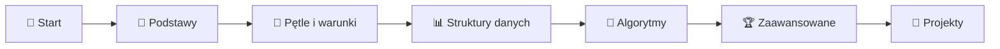

<div align="center">
<a href="https://github.com/djeada/Nauka-programowania/stargazers"></a>
<a href="https://github.com/djeada/Nauka-programowania/network"></a>
<a href="https://github.com/djeada/Nauka-programowania/blob/master/LICENSE"></a>
<a href=""></a>


<a href="https://github.com/djeada/Nauka-Programowania/actions/workflows/ci.yml"></a>
<a href="https://adamdjellouli.com/courses/kurs_podstaw_pythona/"></a>
</div>

# 🚀 Nauka Programowania

> **Witaj w świecie programowania!** 🎉 To kompletna ścieżka rozwoju, która przekształci Cię z początkującego w pewnego siebie programistę!


---

## 🎯 Dlaczego ten kurs?

### ✨ Co sprawia, że jesteśmy wyjątkowi?

```
🌟 319 praktycznych zadań           📚 7 języków programowania
💡 Od podstaw do zaawansowanych     🎓 Struktura akademicka
🧪 Testy automatyczne do zadań      🤝 Otwarta społeczność
▶️ Rozwiązywanie online z oceną     🔁 CI sprawdza każdą zmianę
✅ Przykładowe rozwiązania          🌍 Darmowy dostęp dla każdego
```

### 🎓 Dla kogo jest ten kurs?

<table>
<tr>
<td width="33%">

**🌱 Początkujący**
- Nigdy nie programowałeś?
- Zaczynasz od zera?
- Idealnie! Zaczynamy od podstaw.

</td>
<td width="33%">

**📈 Średniozaawansowani**
- Znasz podstawy?
- Chcesz uporządkować wiedzę?
- Znajdziesz tu wyzwania!

</td>
<td width="33%">

**🚀 Zaawansowani**
- Powtórka przed rozmową?
- Trening przed olimpiadą?
- Mamy trudne zadania!

</td>
</tr>
</table>

### 🎁 Co zyskasz?

| 💪 Umiejętność | 📝 Opis | 🎯 Zastosowanie |
|---------------|---------|-----------------|
| **Myślenie algorytmiczne** | Naucz się rozwiązywać problemy krok po kroku | Podstawa każdego programisty |
| **7 języków programowania** | Python, C++, Java, JavaScript, Rust, Haskell, Bash | Szeroka perspektywa technologiczna |
| **Struktury danych** | Listy, drzewa, grafy, słowniki | Efektywne rozwiązania |
| **Algorytmy** | Sortowanie, wyszukiwanie, rekurencja | Optymalizacja i wydajność |
| **Best practices** | Czysty kod, testowanie, debugging | Profesjonalne podejście |

---

## 🗺️ Twoja ścieżka nauki


```mermaid
graph LR
    A[🌱 Start] --> B[📝 Podstawy]
    B --> C[🔄 Pętle i warunki]
    C --> D[📊 Struktury danych]
    D --> E[🎯 Algorytmy]
    E --> F[🏆 Zaawansowane]
    F --> G[💼 Projekty]
```

### 📚 Struktura kursu (25 rozdziałów)

<details>
<summary>🟢 <strong>Poziom 1: Podstawy (Rozdziały 1-8)</strong> - Twoje pierwsze kroki</summary>

**Czego się nauczysz:**
- ✍️ Interakcja z konsolą (input/output)
- ❓ Instrukcje warunkowe (if/else)
- 📅 Praca z datami i czasem
- 🔁 Pętle (for, while)
- 🔢 Operacje na liczbach i cyfrach
- 📐 Funkcje - podstawy
- 🧮 Algorytmy matematyczne
- 🔄 Pętle zagnieżdżone

**Metoda weryfikacji:** Manualne testowanie przez konsolę

</details>

<details>
<summary>🟡 <strong>Poziom 2: Średniozaawansowany (Rozdziały 9-17)</strong> - Budujemy fundament</summary>

**Czego się nauczysz:**
- 📋 Listy i tablice
- 🔤 Operacje na napisach
- 🎭 Anagramy i palindromy
- 📊 Tablice dwuwymiarowe
- 📈 Wielomiany i funkcje matematyczne
- 🌀 Rekurencja
- 💾 System binarny
- 📖 Słowniki i hashmaps

**Metoda weryfikacji:** Automatyczne testy, edge cases

</details>

<details>
<summary>🔴 <strong>Poziom 3: Zaawansowany (Rozdziały 18-25)</strong> - Profesjonalne umiejętności</summary>

**Czego się nauczysz:**
- 🏗️ Klasy i obiekty (OOP)
- 👨‍👩‍👧 Dziedziczenie i polimorfizm
- 📁 Operacje na plikach
- 🔄 Algorytmy sortowania
- 🎯 Praktyczne sortowanie
- 🔍 Wyrażenia regularne
- 💪 Zaawansowane operacje na listach
- 🧵 Złożone operacje na napisach

**Metoda weryfikacji:** Kompleksowe testy, debugowanie, profiling

</details>

---

## 🛠️ Wsparcie dla 7 języków programowania

Każde zadanie jest dostępne w 7 popularnych językach! Wybierz swój ulubiony lub naucz się wszystkich:

<table>
<tr>
<td align="center" width="14.28%">
<br/>
<b>Python 3.10+</b><br/>
<sub>Prosty i czytelny</sub>
</td>
<td align="center" width="14.28%">
<br/>
<b>C++ 20</b><br/>
<sub>Wydajny i potężny</sub>
</td>
<td align="center" width="14.28%">
<br/>
<b>Java SE 18</b><br/>
<sub>Stabilny i uniwersalny</sub>
</td>
<td align="center" width="14.28%">
<br/>
<b>Node.js 20</b><br/>
<sub>Web i więcej</sub>
</td>
<td align="center" width="14.28%">
<br/>
<b>Rust 1.74</b><br/>
<sub>Bezpieczny i szybki</sub>
</td>
<td align="center" width="14.28%">
<br/>
<b>Haskell GHC 9.2</b><br/>
<sub>Funkcyjny i elegancki</sub>
</td>
<td align="center" width="14.28%">
<br/>
<b>Bash</b><br/>
<sub>Skrypty i automatyzacja</sub>
</td>
</tr>
</table>

### 💻 Szybki start z każdym językiem

<details>
<summary><b>🐍 Python</b> - Najlepszy dla początkujących</summary>

**Instalacja:**
```bash
# Linux/Mac (zwykle preinstalowany)
python3 --version

# Windows - pobierz z python.org
```

**Uruchomienie:**
```bash
python3 sciezka_do_zadania.py
```

**Formatowanie:**
```bash
pip install black
black sciezka_do_zadania.py
```

**Dlaczego Python?**
- ✅ Najprostsza składnia
- ✅ Ogromna społeczność
- ✅ Świetny do nauki
- ✅ Data Science, AI, Web

</details>

<details>
<summary><b>⚡ C++</b> - Dla ambitnych</summary>

**Instalacja:**
```bash
# Linux
sudo apt-get install g++

# Mac
xcode-select --install

# Windows - MinGW lub Visual Studio
```

**Kompilacja i uruchomienie:**
```bash
g++-10 -ggdb3 -O0 -std=c++20 -Wall -Wextra -pedantic -o program zadanie.cpp
./program
```

**Formatowanie:**
```bash
clang-format -i -style=file zadanie.cpp
```

**Dlaczego C++?**
- ✅ Najszybszy język
- ✅ Pełna kontrola
- ✅ Gry, systemy, embedded
- ✅ Olimpiady programistyczne

</details>

<details>
<summary><b>☕ Java</b> - Dla przyszłości enterprise</summary>

**Instalacja:**
```bash
# Sprawdź czy masz JDK
java -version
javac -version

# Pobierz JDK 18+ z oracle.com lub adoptium.net
```

**Kompilacja i uruchomienie:**
```bash
javac -d . zadanie.java
java NazwaKlasy
```

**Formatowanie:**
```bash
java -jar google-java-format-1.7-all-deps.jar zadanie.java
```

**Dlaczego Java?**
- ✅ Wieloplatformowość
- ✅ Duży rynek pracy
- ✅ Android, Backend
- ✅ Silne typowanie

</details>

<details>
<summary><b>🌐 JavaScript</b> - Król internetu</summary>

**Instalacja:**
```bash
# Zainstaluj Node.js z nodejs.org
node --version
npm --version
```

**Uruchomienie:**
```bash
node zadanie.js
```

**Formatowanie:**
```bash
npm install -g eslint
eslint --fix zadanie.js
```

**Dlaczego JavaScript?**
- ✅ Frontend i Backend
- ✅ Najpopularniejszy język web
- ✅ React, Vue, Angular
- ✅ Full-stack development

</details>

<details>
<summary><b>🦀 Rust</b> - Przyszłość system programming</summary>

**Instalacja:**
```bash
# Linux/Mac/Windows
curl --proto '=https' --tlsv1.2 -sSf https://sh.rustup.rs | sh
```

**Kompilacja i uruchomienie:**
```bash
rustc zadanie.rs
./zadanie
```

**Formatowanie:**
```bash
rustfmt zadanie.rs
```

**Dlaczego Rust?**
- ✅ Memory safety bez GC
- ✅ Rosnąca popularność
- ✅ WebAssembly, systemy
- ✅ Nowoczesne podejście

</details>

<details>
<summary><b>🎩 Haskell</b> - Elegancja funkcyjna</summary>

**Instalacja:**
```bash
# GHCup - uniwersalny instalator
curl --proto '=https' --tlsv1.2 -sSf https://get-ghcup.haskell.org | sh
```

**Kompilacja i uruchomienie:**
```bash
ghc -o program zadanie.hs
./program
```

**Formatowanie:**
```bash
ormolu --mode inplace zadanie.hs
```

**Dlaczego Haskell?**
- ✅ Programowanie funkcyjne
- ✅ Matematyczna elegancja
- ✅ Silny system typów
- ✅ Rozwój intelektualny

</details>

<details>
<summary><b>🐚 Bash</b> - Potęga skryptów</summary>

**Instalacja:**
```bash
# Linux/Mac - preinstalowany
bash --version

# Windows - WSL lub Git Bash
```

**Uruchomienie:**
```bash
bash zadanie.sh
# lub
chmod +x zadanie.sh
./zadanie.sh
```

**Dlaczego Bash?**
- ✅ Automatyzacja zadań
- ✅ DevOps i CI/CD
- ✅ Administracja systemami
- ✅ Szybkie skrypty

</details>

---

## 📖 Dodatkowe materiały do nauki

Oferujemy szeroki wybór dodatkowych materiałów edukacyjnych:

<table>
<tr>
<td width="50%">

### 🐍 Python - Kompletny kurs
[](https://github.com/djeada/Kurs-podstaw-Pythona)

**Co zawiera:**
- 📚 Kompletne notatki teoretyczne
- 💻 Przykłady praktyczne
- 🎯 Projekty końcowe
- 🔬 Data Science i AI

</td>
<td width="50%">

### ⚡ C++ - Od podstaw do eksperta
[](https://github.com/djeada/C-and-Cpp)

**Co zawiera:**
- 📖 Szczegółowe notatki
- 🎓 Od C do C++20
- 🚀 Zaawansowane tematy
- 🏗️ Wzorce projektowe

</td>
</tr>
</table>

---

## 🎯 Zbiór zadań - Serce kursu

<div align="center">

### 📊 Statystyki

<!-- STATYSTYKI:START -->
| 📚 Rozdziały | 📝 Zadania | 🧪 Testy automatyczne | 💻 Języki | ⭐ Poziomy trudności |
|:------------:|:----------:|:---------------------:|:---------:|:--------------------:|
| **25** | **319** | **1942** | **7** | **3** |
<!-- STATYSTYKI:END -->

</div>

### 🌟 Jak korzystać z zadań?

```
1️⃣ Wybierz rozdział odpowiadający Twojemu poziomowi
2️⃣ Przeczytaj opis zadania w zbiorze zadań
3️⃣ Spróbuj rozwiązać samodzielnie
4️⃣ Sprawdź przykładowe rozwiązania w różnych językach
5️⃣ Porównaj podejścia i naucz się różnych perspektyw
```

### 📚 Dostęp do zadań

<table>
<tr>
<td width="50%" align="center">

**📂 Zbiór zadań (opisy)**

[](https://github.com/djeada/Nauka-Programowania/tree/master/zbior_zadan)

Szczegółowe opisy wszystkich zadań<br/>
z przykładami i wskazówkami

</td>
<td width="50%" align="center">

**💾 Rozwiązania (kod)**

[](https://github.com/djeada/Nauka-Programowania/tree/master/src)

Przykładowe implementacje<br/>
w 7 językach programowania

</td>
</tr>
<tr>
<td colspan="2" align="center">

**▶️ Rozwiązuj online z automatyczną sprawdzarką**

[](https://adamdjellouli.com/courses/kurs_podstaw_pythona/)

Każde zadanie ze zbioru jako interaktywna strona: edytor, uruchamianie Pythona w przeglądarce<br/>
i te same testy, które sprawdzają rozwiązania wzorcowe w CI tego repozytorium

</td>
</tr>
</table>

### 🤝 Dodaj swoje rozwiązania!

Masz ciekawe rozwiązanie? Podziel się nim ze społecznością!

[](https://github.com/djeada/Nauka-Programowania/blob/master/CONTRIBUTING.md)

**Proces krok po kroku:**
1. 🍴 Fork repozytorium
2. 💻 Dodaj swoje rozwiązanie
3. ✅ Sprawdź czy działa
4. 📝 Stwórz Pull Request
5. 🎉 Dołącz do społeczności kontrybutorów!

---

## 🎓 O zadaniach - Szczegółowy przewodnik

### 📊 Poziomy trudności wyjaśnione

| Poziom | Symbol | Zakres | Czas | Umiejętności |
|--------|--------|--------|------|--------------|
| **Łatwy** | ★☆☆ | Rozdziały 1-8 | 5-15 min | Podstawowa składnia, proste algorytmy |
| **Średni** | ★★☆ | Rozdziały 9-17 | 15-45 min | Struktury danych, myślenie algorytmiczne |
| **Trudny** | ★★★ | Rozdziały 18-25 | 45+ min | Zaawansowane algorytmy, optymalizacja |

### 🎯 Szczegółowy breakdown poziomów

<details>
<summary><b>★☆☆ Poziom Podstawowy (Rozdziały 1-8)</b></summary>

**Charakterystyka:**
- 🎯 Zadania do 15 minut
- 📝 Jasno określone wymagania
- 💡 Jedno rozwiązanie na zadanie
- ✅ Testowanie manualne

**Przykładowe tematy:**
- Interakcja z konsolą (print, input)
- Proste operacje matematyczne
- Instrukcje warunkowe (if-else)
- Podstawowe pętle (for, while)
- Operacje na zmiennych
- Daty i czas

**Idealne dla:**
- Osób zaczynających przygodę z programowaniem
- Uczniów szkół podstawowych i średnich
- Wszystkich, którzy chcą poznać składnię języka

</details>

<details>
<summary><b>★★☆ Poziom Średniozaawansowany (Rozdziały 9-17)</b></summary>

**Charakterystyka:**
- ⏱️ Zadania 15-45 minut
- 🧩 Wymagają myślenia algorytmicznego
- 🔍 Należy uwzględnić edge cases
- ✅ Automatyczne testy

**Przykładowe tematy:**
- Listy i tablice (operacje, przeszukiwanie)
- Napisy (manipulacja, parsowanie)
- Anagramy i palindromy
- Tablice wielowymiarowe
- Funkcje matematyczne
- Rekurencja (podstawy)
- System binarny
- Słowniki i mapy

**Idealne dla:**
- Osób znających podstawy programowania
- Studentów informatyki (1-2 rok)
- Kandydatów na junior developera

</details>

<details>
<summary><b>★★★ Poziom Zaawansowany (Rozdziały 18-25)</b></summary>

**Charakterystyka:**
- 🕐 Zadania 45+ minut
- 🧠 Złożone algorytmy
- ⚡ Wymagana optymalizacja
- 🔧 Debugowanie i profiling
- ✅ Kompleksowe testy

**Przykładowe tematy:**
- Programowanie obiektowe (klasy, dziedziczenie)
- Operacje na plikach
- Algorytmy sortowania (bubble, quick, merge)
- Wyrażenia regularne
- Zaawansowane struktury danych
- Problemy optymalizacyjne
- Algorytmy z olimpiad programistycznych

**Idealne dla:**
- Programistów z doświadczeniem
- Studentów wyższych lat informatyki
- Kandydatów na stanowiska mid/senior
- Uczestników olimpiad programistycznych

</details>

### 💡 Przykładowe rozwiązania

**Dlaczego wiele rozwiązań?**

Dla większości zadań znajdziesz kilka różnych podejść:

| Podejście | Zalety | Przykład użycia |
|-----------|--------|-----------------|
| **Iteracyjne** | Prosty, czytelny | Początkujący, prosta logika |
| **Rekurencyjne** | Elegancki, matematyczny | Problemy dziel-i-zwyciężaj |
| **Funkcyjne** | Deklaratywny, zwięzły | Transformacje danych |
| **Optymalne** | Najszybszy, efektywny | Duże zbiory danych |

---

## 🚀 Jak zacząć? - Przewodnik krok po kroku

### 🌱 Dla absolutnych początkujących

```
Krok 1: Wybierz język 🎯
         ↓
         Python - najprostszy start!
         
Krok 2: Zainstaluj środowisko 💻
         ↓
         IDE: PyCharm Community / VS Code
         
Krok 3: Rozpocznij od Rozdziału 1 📚
         ↓
         01_interakcja_z_konsola
         
Krok 4: Rozwiązuj po kolei 📝
         ↓
         Nie przeskakuj zadań!
         
Krok 5: Sprawdź rozwiązania ✅
         ↓
         Porównaj ze swoim kodem
         
Krok 6: Eksperymentuj 🔬
         ↓
         Modyfikuj, testuj, ucz się!
```

### 📈 Dla średniozaawansowanych

<table>
<tr>
<td width="50%">

**🎯 Twój plan działania:**

1. **Oceń swoją wiedzę**
   - Przejrzyj rozdziały 1-8
   - Rozwiąż kilka zadań testowych
   - Określ swój poziom

2. **Wybierz punkt startowy**
   - Jeśli 80% jest łatwe → Start od r. 9
   - Jeśli są luki → Uzupełnij braki

3. **Ćwicz systematycznie**
   - Minimum 3 zadania dziennie
   - Różne poziomy trudności
   - Różne języki (opcjonalnie)

</td>
<td width="50%">

**💪 Wskazówki:**

- ✅ Nie czytaj rozwiązania od razu
- ✅ Próbuj kilku podejść
- ✅ Mierz czas rozwiązania
- ✅ Testuj edge cases
- ✅ Optymalizuj kod
- ✅ Dokumentuj rozwiązania
- ✅ Dziel się z innymi

</td>
</tr>
</table>

### 🏆 Dla zaawansowanych

**Wyzwania dla ekspertów:**

1. **Multi-język challenge** 🌍
   - Rozwiąż to samo zadanie w 3+ językach
   - Porównaj wydajność
   - Naucz się idiomów każdego języka

2. **Optymalizacja** ⚡
   - Znajdź najszybsze rozwiązanie
   - Zmierz złożoność czasową i pamięciową
   - Benchmark różnych podejść

3. **Code review** 👥
   - Recenzuj kod innych
   - Sugeruj usprawnienia
   - Dołącz do społeczności

4. **Kontrybuuj** 🤝
   - Dodaj nowe zadania
   - Popraw istniejące rozwiązania
   - Twórz tutoriale

---

## 🛠️ Narzędzia i środowisko pracy

### 💻 Zalecane IDE

<table>
<tr>
<td align="center" width="25%">

**VS Code**<br/>
<br/>
Uniwersalny, lekki<br/>
[Pobierz](https://code.visualstudio.com/)

</td>
<td align="center" width="25%">

**PyCharm**<br/>
<br/>
Najlepszy dla Python<br/>
[Pobierz](https://www.jetbrains.com/pycharm/)

</td>
<td align="center" width="25%">

**IntelliJ IDEA**<br/>
<br/>
Doskonały dla Java<br/>
[Pobierz](https://www.jetbrains.com/idea/)

</td>
<td align="center" width="25%">

**CLion**<br/>
<br/>
Profesjonalny dla C++<br/>
[Pobierz](https://www.jetbrains.com/clion/)

</td>
</tr>
</table>

### 🔧 Przydatne rozszerzenia (VS Code)

```javascript
// Python
- Python (Microsoft)
- Pylance
- Python Docstring Generator

// C++
- C/C++ (Microsoft)
- CMake Tools
- C++ Intellisense

// Java
- Language Support for Java
- Debugger for Java
- Maven for Java

// JavaScript
- ESLint
- Prettier
- JavaScript (ES6) code snippets

// Ogólne
- GitLens
- Live Share
- Error Lens
- Code Runner
```

### 🐛 Narzędzia do debugowania

| Język | Narzędzie | Zastosowanie |
|-------|-----------|--------------|
| Python | `pdb`, PyCharm Debugger | Breakpointy, step-through |
| C++ | `gdb`, `lldb` | Memory leaks, segfaults |
| Java | IntelliJ Debugger | Stack traces, profiling |
| JavaScript | Chrome DevTools, Node Inspector | Async debugging |

---

## 📊 Wspierane wersje języków - Szczegóły techniczne

<table>
<thead>
<tr>
<th width="12%">Język</th>
<th width="15%">Wersja</th>
<th width="35%">Kompilacja/Uruchomienie</th>
<th width="38%">Formatowanie</th>
</tr>
</thead>
<tbody>
<tr>
<td><b>🐍 Python</b></td>
<td><code>3.10+</code></td>
<td><code>python3 sciezka_do_zadania.py</code></td>
<td><code>black sciezka_do_zadania.py</code></td>
</tr>
<tr>
<td><b>⚡ C++</b></td>
<td><code>C++11/17/20</code></td>
<td><code>g++-10 -ggdb3 -O0 -std=c++20 -Wall -Wextra -pedantic -o plik.out zadanie.cpp</code></td>
<td><code>clang-format -i -style=file zadanie.cpp</code></td>
</tr>
<tr>
<td><b>☕ Java</b></td>
<td><code>SE 18+</code></td>
<td><code>javac -d . zadanie.java && java NazwaKlasy</code></td>
<td><code>java -jar google-java-format.jar zadanie.java</code></td>
</tr>
<tr>
<td><b>🌐 JavaScript</b></td>
<td><code>Node.js 20+</code></td>
<td><code>node sciezka_do_zadania.js</code></td>
<td><code>eslint --fix zadanie.js</code></td>
</tr>
<tr>
<td><b>🦀 Rust</b></td>
<td><code>1.74.0+</code></td>
<td><code>rustc zadanie.rs && ./zadanie</code></td>
<td><code>rustfmt zadanie.rs</code></td>
</tr>
<tr>
<td><b>🎩 Haskell</b></td>
<td><code>GHC 9.2.1+</code></td>
<td><code>ghc -o plik.out zadanie.hs && ./plik.out</code></td>
<td><code>ormolu --mode inplace zadanie.hs</code></td>
</tr>
<tr>
<td><b>🐚 Bash</b></td>
<td><code>4.0+</code></td>
<td><code>bash zadanie.sh</code> lub <code>./zadanie.sh</code></td>
<td><code>shfmt -w zadanie.sh</code></td>
</tr>
</tbody>
</table>

### ⚙️ Konfiguracja środowiska

<details>
<summary><b>🐧 Linux (Ubuntu/Debian)</b></summary>

```bash
# Zainstaluj wszystkie narzędzia jedną komendą
sudo apt update && sudo apt install -y \
    python3 python3-pip \
    g++ clang-format \
    default-jdk \
    nodejs npm \
    rustc cargo \
    ghc cabal-install \
    bash

# Python tools
pip3 install black pylint

# JavaScript tools
npm install -g eslint prettier

# Rust tools (alternatywnie przez rustup)
curl --proto '=https' --tlsv1.2 -sSf https://sh.rustup.rs | sh
```

</details>

<details>
<summary><b>🍎 macOS</b></summary>

```bash
# Użyj Homebrew
brew install python3 gcc node rust ghc cabal-install

# Python tools
pip3 install black pylint

# JavaScript tools
npm install -g eslint prettier

# Formatter tools
brew install clang-format
```

</details>

<details>
<summary><b>🪟 Windows</b></summary>

**Opcja 1: Menedżery pakietów**
```powershell
# Chocolatey
choco install python3 mingw nodejs rust ghc

# Lub Scoop
scoop install python gcc nodejs rust ghc
```

**Opcja 2: Manualna instalacja**
- Python: [python.org](https://www.python.org)
- MinGW: [mingw-w64.org](http://mingw-w64.org)
- Node.js: [nodejs.org](https://nodejs.org)
- Rust: [rustup.rs](https://rustup.rs)
- Haskell: [haskell.org](https://www.haskell.org/platform)

**Opcja 3: WSL (Zalecane!)**
```bash
# Zainstaluj WSL2 i Ubuntu, potem użyj instrukcji dla Linux
wsl --install
```

</details>

---

## ❓ FAQ - Najczęściej zadawane pytania

<details>
<summary><b>🤔 Od jakiego języka powinienem zacząć?</b></summary>

**Dla większości osób: Python** 🐍

**Dlaczego?**
- ✅ Najprostsza składnia
- ✅ Szybki feedback
- ✅ Ogromna społeczność
- ✅ Szeroka aplikacja (web, data science, AI)

**Alternatywy:**
- **JavaScript** - jeśli interesujesz się web developmentem
- **C++** - jeśli planujesz olimpiady lub rozwój gier
- **Java** - jeśli myślisz o Android lub enterprise

</details>

<details>
<summary><b>⏰ Ile czasu zajmie przejście kursu?</b></summary>

**To zależy od Twojego tempa:**

| Tempo | Czas dziennie | Całkowity czas | Poziom końcowy |
|-------|---------------|----------------|----------------|
| 🚀 Intensywne | 4-6h | 2-3 miesiące | Zaawansowany |
| 📚 Normalne | 2-3h | 4-6 miesięcy | Średniozaawansowany+ |
| 🐢 Spokojne | 1h | 8-12 miesięcy | Solidne podstawy |

**Pamiętaj:** Jakość > Ilość. Lepiej 1h dziennie przez rok niż 8h przez tydzień!

</details>

<details>
<summary><b>💰 Czy ten kurs jest darmowy?</b></summary>

**TAK! W 100% darmowy i otwarty! 🎉**

- ✅ Wszystkie zadania - FREE
- ✅ Wszystkie rozwiązania - FREE
- ✅ Dodatkowe materiały - FREE
- ✅ Wsparcie społeczności - FREE

**Licencja:** MIT - możesz używać, modyfikować i dzielić się!

</details>

<details>
<summary><b>🎓 Czy po tym kursie znajdę pracę?</b></summary>

**Ten kurs daje fundamenty, ale...**

**Co jeszcze potrzebujesz:**
1. **Portfolio** - 3-5 projektów pokazujących Twoje umiejętności
2. **Git/GitHub** - umiejętność pracy z kontrolą wersji
3. **Specjalizacja** - wybierz kierunek (web, mobile, data, etc.)
4. **Soft skills** - komunikacja, praca w zespole
5. **Praktyka** - staże, projekty open source

**Ten kurs:**
- ✅ Nauczy Cię programować
- ✅ Przygotuje do rozmów technicznych
- ✅ Da solidne podstawy algorytmiczne
- ⚠️ Ale nie zastąpi doświadczenia praktycznego

</details>

<details>
<summary><b>🤝 Jak mogę pomóc w rozwoju projektu?</b></summary>

**Wiele sposobów!**

1. **⭐ Gwiazdka na GitHubie** - pomaga w widoczności
2. **🐛 Zgłaszaj błędy** - znajdź i zgłoś issue
3. **💻 Dodaj rozwiązania** - w nowych językach lub lepsze podejścia
4. **📝 Popraw dokumentację** - literówki, wyjaśnienia
5. **🌍 Tłumaczenia** - pomóż w wersjach innych językach
6. **💬 Pomóż innym** - odpowiadaj na pytania w issues
7. **📣 Promuj projekt** - podziel się z znajomymi

[Zobacz CONTRIBUTING.md dla szczegółów](https://github.com/djeada/Nauka-Programowania/blob/master/CONTRIBUTING.md)

</details>

<details>
<summary><b>🆘 Utknąłem na zadaniu. Co robić?</b></summary>

**Krok po kroku:**

1. **Zrozum problem** 📖
   - Przeczytaj zadanie ponownie
   - Zapisz wymagania
   - Zrób przykłady na papierze

2. **Rozbij na części** 🧩
   - Podziel na mniejsze problemy
   - Rozwiąż najprostszą część
   - Buduj stopniowo

3. **Debuguj** 🔍
   - Użyj print/console.log
   - Sprawdź edge cases
   - Testuj krok po kroku

4. **Szukaj pomocy** 💬
   - Przejrzyj materiały dodatkowe
   - Sprawdź podobne zadania
   - Zapytaj społeczność (Issues)

5. **Zobacz rozwiązanie** 👀
   - Ale dopiero po próbach!
   - Zrozum, nie kopiuj
   - Spróbuj zaimplementować samodzielnie

</details>

<details>
<summary><b>🔄 Czy muszę rozwiązywać zadania po kolei?</b></summary>

**Zalecane: TAK, szczególnie dla początkujących**

**Dlaczego?**
- ✅ Progresywna trudność
- ✅ Każde zadanie buduje na poprzednich
- ✅ Unikniecie luk w wiedzy

**Kiedy możesz przeskakiwać?**
- ✓ Masz już doświadczenie
- ✓ Pracujesz nad konkretnymi lukami
- ✓ Chcesz powtórzyć konkretny temat

**Wskazówka:** Jeśli przeskakujesz, wróć później do pominiętych!

</details>

<details>
<summary><b>📱 Czy mogę programować na tablecie/telefonie?</b></summary>

**Możesz, ale...**

**✅ Możliwe na mobile:**
- Nauka teorii
- Przeglądanie kodu
- Proste zadania (Python, JavaScript)

**❌ Trudne na mobile:**
- Kompilacja (C++, Rust)
- Wieloplikowe projekty
- Debugowanie
- Dłuższe sesje

**Najlepsze aplikacje:**
- **Android:** Pydroid 3, Dcoder
- **iOS:** Pythonista, Swift Playgrounds
- **Universal:** Replit (przeglądarka)

**Rekomendacja:** Używaj jako uzupełnienie, nie główne narzędzie!

</details>

---

## 🌟 Społeczność i wsparcie

### 💬 Jak możemy Ci pomóc?

<table>
<tr>
<td width="33%" align="center">

**🐛 Znalazłeś błąd?**

[](https://github.com/djeada/Nauka-Programowania/issues)

Zgłoś go!<br/>
Naprawimy najszybciej jak to możliwe

</td>
<td width="33%" align="center">

**💡 Masz pytanie?**

[](https://github.com/djeada/Nauka-Programowania/discussions)

Zapytaj społeczność!<br/>
Chętnie pomożemy

</td>
<td width="33%" align="center">

**🤝 Chcesz pomóc?**

[](https://github.com/djeada/Nauka-Programowania/pulls)

Twój wkład jest ceniony!<br/>
Zobacz CONTRIBUTING.md

</td>
</tr>
</table>

### 👥 Społeczność

**Dołącz do naszej rosnącej społeczności programistów!**

- 🌟 **Ponad 1000+ gwiazdek** na GitHubie
- 👥 **Setki kontrybutorów** z całego świata
- 💻 **Tysiące rozwiązanych zadań**
- 🌍 **Globalna społeczność** programistów

### 🏆 Hall of Fame - Najlepsi Kontrybutorzy

Specjalne podziękowania dla osób, które wniosły największy wkład w rozwój projektu!

<!-- Lista kontrybutorów będzie automatycznie aktualizowana -->
[](https://github.com/djeada/Nauka-Programowania/graphs/contributors)

**Chcesz tu zobaczyć swoje zdjęcie? [Zacznij kontrybuować!](CONTRIBUTING.md)**

---

## 🎯 Roadmap - Co dalej po kursie?

### 🌱 Ścieżki rozwoju

Po ukończeniu tego kursu masz wiele opcji:

<table>
<tr>
<td width="50%">

### 🌐 Web Development

**Frontend:**
- HTML, CSS, JavaScript
- React / Vue / Angular
- Responsive design
- TypeScript

**Backend:**
- Node.js / Django / Spring
- REST APIs / GraphQL
- Bazy danych
- Authentication

**Zasoby:**
- [MDN Web Docs](https://developer.mozilla.org)
- [FreeCodeCamp](https://freecodecamp.org)

</td>
<td width="50%">

### 📊 Data Science & AI

**Fundamenty:**
- NumPy, Pandas
- Matplotlib, Seaborn
- Jupyter Notebooks
- Statystyka

**Machine Learning:**
- Scikit-learn
- TensorFlow / PyTorch
- Deep Learning
- NLP

**Zasoby:**
- [Kaggle](https://kaggle.com)
- [Fast.ai](https://fast.ai)

</td>
</tr>
<tr>
<td width="50%">

### 📱 Mobile Development

**Android:**
- Kotlin
- Android Studio
- Jetpack Compose
- Material Design

**iOS:**
- Swift
- Xcode
- SwiftUI
- UIKit

**Cross-platform:**
- React Native
- Flutter

</td>
<td width="50%">

### ⚙️ Systems & Low-Level

**Obszary:**
- Systemy operacyjne
- Embedded systems
- Programowanie sieciowe
- Kompilatory

**Języki:**
- C / C++
- Rust
- Assembly

**Zasoby:**
- [OSDev](https://osdev.org)
- [Rust Book](https://doc.rust-lang.org/book)

</td>
</tr>
</table>

### 📚 Polecane następne kroki

1. **Wybierz specjalizację** 🎯
   - Zastanów się co Cię interesuje
   - Zbadaj rynek pracy
   - Porozmawiaj z profesjonalistami

2. **Zbuduj portfolio** 💼
   - 3-5 solidnych projektów
   - GitHub profile
   - Personal website
   - Blog (opcjonalnie)

3. **Zdobądź doświadczenie** 💪
   - Open source contributions
   - Freelancing (Upwork, Fiverr)
   - Staże
   - Własne projekty

4. **Networking** 🤝
   - Meetupy i konferencje
   - LinkedIn
   - Twitter/X tech community
   - Discord servers

5. **Ciągła nauka** 📖
   - Śledź trendy
   - Czytaj dokumentację
   - Rozwiązuj nowe problemy
   - Ucz innych (najlepszy sposób nauki!)

---

## 📊 Statystyki projektu

<div align="center">


</div>

---

## 🎓 Nauka programowania to proces

> **"The only way to learn a new programming language is by writing programs in it."** - Dennis Ritchie

### 💡 Złote zasady

```
1. 🔥 Konsystencja > Intensywność
   Lepiej 1h dziennie niż 7h w weekend

2. 🧠 Zrozumienie > Zapamiętanie
   Rozumiej dlaczego, nie tylko jak

3. 🛠️ Praktyka > Teoria
   Pisz kod, dużo kodu

4. 🤝 Teach to learn
   Najlepiej uczymy się ucząc innych

5. 🔄 Błędy są ok
   Każdy błąd to lekcja

6. 🎯 Projekty > Tutoriale
   Buduj rzeczywiste projekty

7. 🌱 Nigdy nie przestawaj
   Programowanie to ciągła nauka
```

### 🚀 Motywacja

<table>
<tr>
<td width="50%">

**🎯 Stawiaj cele:**
- ✅ Krótkoterminowe (1 rozdział/tydzień)
- ✅ Średnioterminowe (cały kurs/3 miesiące)
- ✅ Długoterminowe (praca/1 rok)

**📊 Śledź postępy:**
- ✅ Prowadź dziennik nauki
- ✅ Celebrate small wins
- ✅ Review co tydzień

</td>
<td width="50%">

**💪 Radzenie z trudnościami:**
- ✅ Zrób przerwę gdy utkniesz
- ✅ Rozbij problem na części
- ✅ Pytaj o pomoc (nie ma głupich pytań!)
- ✅ Pamiętaj - każdy przez to przechodził

**🎉 Nagradzaj się:**
- ✅ Po każdym rozdziale
- ✅ Po trudnym zadaniu
- ✅ Za wytrwałość

</td>
</tr>
</table>

---

## 📚 Rozwiązania - Indeks wszystkich zadań

<!-- ZADANIA:START -->
<!-- Sekcja generowana przez scripts/generate_readme.py — nie edytuj jej ręcznie. -->

Każde zadanie możesz też **rozwiązać online w przeglądarce** z automatyczną sprawdzarką: [Kurs Podstaw Pythona](https://adamdjellouli.com/courses/kurs_podstaw_pythona/).

1. [Interakcja z konsolą](#rozdział-1-interakcja-z-konsolą) — 24 zadania
2. [Instrukcja warunkowa (if / else)](#rozdział-2-instrukcja-warunkowa-if--else) — 10 zadań
3. [Daty (warunki + kalendarz)](#rozdział-3-daty-warunki--kalendarz) — 9 zadań
4. [Pętle — wprowadzenie (while / for)](#rozdział-4-pętle--wprowadzenie-while--for) — 10 zadań
5. [Pętle — cyfry liczby (dzielenie przez 10, modulo)](#rozdział-5-pętle--cyfry-liczby-dzielenie-przez-10-modulo) — 13 zadań
6. [Funkcje — wprowadzenie](#rozdział-6-funkcje--wprowadzenie) — 20 zadań
7. [Pętle — algorytmy matematyczne](#rozdział-7-pętle--algorytmy-matematyczne) — 10 zadań
8. [Pętle — pętle zagnieżdżone](#rozdział-8-pętle--pętle-zagnieżdżone) — 9 zadań
9. [Listy — wprowadzenie](#rozdział-9-listy--wprowadzenie) — 21 zadań
10. [Dwie listy i zbiory](#rozdział-10-dwie-listy-i-zbiory) — 13 zadań
11. [Napisy — wprowadzenie](#rozdział-11-napisy--wprowadzenie) — 20 zadań
12. [Napisy — anagramy i palindromy](#rozdział-12-napisy--anagramy-i-palindromy) — 8 zadań
13. [Macierze i przedziały](#rozdział-13-macierze-i-przedziały) — 14 zadań
14. [Funkcje — wielomiany](#rozdział-14-funkcje--wielomiany) — 7 zadań
15. [Funkcje — rekurencja](#rozdział-15-funkcje--rekurencja) — 13 zadań
16. [Bity i systemy liczbowe](#rozdział-16-bity-i-systemy-liczbowe) — 20 zadań
17. [Słowniki](#rozdział-17-słowniki) — 15 zadań
18. [Klasy](#rozdział-18-klasy) — 11 zadań
19. [Dziedziczenie](#rozdział-19-dziedziczenie) — 7 zadań
20. [Operacje na plikach](#rozdział-20-operacje-na-plikach) — 15 zadań
21. [Sortowanie i wyszukiwanie — algorytmy](#rozdział-21-sortowanie-i-wyszukiwanie--algorytmy) — 7 zadań
22. [Sortowanie — praktyka](#rozdział-22-sortowanie--praktyka) — 10 zadań
23. [Wyrażenia regularne](#rozdział-23-wyrażenia-regularne) — 13 zadań
24. [Listy — zadania dodatkowe](#rozdział-24-listy--zadania-dodatkowe) — 10 zadań
25. [Napisy — zadania dodatkowe](#rozdział-25-napisy--zadania-dodatkowe) — 10 zadań

### Rozdział 1: Interakcja z konsolą

📄 [Treści zadań](zbior_zadan/01_interakcja_z_konsola.md) · 🧪 [Testy](zbior_zadan_tests/01_interakcja_z_konsola.json) · ▶️ [Rozwiąż online](https://adamdjellouli.com/courses/kurs_podstaw_pythona/#rozdzial-1)

<table>
    <thead>
        <tr><th>Nr</th><th>Zadanie</th><th>Rozwiązania</th><th>Poziom</th></tr>
    </thead>
    <tbody>
        <tr><td>01</td><td><a href="https://adamdjellouli.com/courses/kurs_podstaw_pythona/tasks/01_interakcja_z_konsola_zad_01.html">Wypisywanie tekstu na ekran</a></td><td><a href="src/python/01_interakcja_z_konsola/zad01.py">Python</a> · <a href="src/cpp/01_interakcja_z_konsola/zad01.cpp">C++</a> · <a href="src/java/01_interakcja_z_konsola/zad1/Main.java">Java</a> · <a href="src/js/01_interakcja_z_konsola/zad01.js">JavaScript</a> · <a href="src/bash/01_interakcja_z_konsola/zad01.sh">Bash</a> · <a href="src/haskell/01_interakcja_z_konsola/zad01.hs">Haskell</a> · <a href="src/rust/01_interakcja_z_konsola/zad01.rs">Rust</a></td><td>★☆☆</td></tr>
        <tr><td>02</td><td><a href="https://adamdjellouli.com/courses/kurs_podstaw_pythona/tasks/01_interakcja_z_konsola_zad_02.html">Zamiana kolejności liczb</a></td><td><a href="src/python/01_interakcja_z_konsola/zad02.py">Python</a> · <a href="src/cpp/01_interakcja_z_konsola/zad02.cpp">C++</a> · <a href="src/java/01_interakcja_z_konsola/zad2/Main.java">Java</a> · <a href="src/js/01_interakcja_z_konsola/zad02.js">JavaScript</a> · <a href="src/bash/01_interakcja_z_konsola/zad02.sh">Bash</a> · <a href="src/haskell/01_interakcja_z_konsola/zad02.hs">Haskell</a> · <a href="src/rust/01_interakcja_z_konsola/zad02.rs">Rust</a></td><td>★☆☆</td></tr>
        <tr><td>03</td><td><a href="https://adamdjellouli.com/courses/kurs_podstaw_pythona/tasks/01_interakcja_z_konsola_zad_03.html">Rysowanie kształtów znakami</a></td><td><a href="src/python/01_interakcja_z_konsola/zad03.py">Python</a> · <a href="src/cpp/01_interakcja_z_konsola/zad03.cpp">C++</a> · <a href="src/java/01_interakcja_z_konsola/zad3/Main.java">Java</a> · <a href="src/js/01_interakcja_z_konsola/zad03.js">JavaScript</a> · <a href="src/bash/01_interakcja_z_konsola/zad03.sh">Bash</a> · <a href="src/haskell/01_interakcja_z_konsola/zad03.hs">Haskell</a> · <a href="src/rust/01_interakcja_z_konsola/zad03.rs">Rust</a></td><td>★☆☆</td></tr>
        <tr><td>04</td><td><a href="https://adamdjellouli.com/courses/kurs_podstaw_pythona/tasks/01_interakcja_z_konsola_zad_04.html">Podstawowe operacje arytmetyczne</a></td><td><a href="src/python/01_interakcja_z_konsola/zad04.py">Python</a> · <a href="src/cpp/01_interakcja_z_konsola/zad04.cpp">C++</a> · <a href="src/java/01_interakcja_z_konsola/zad4/Main.java">Java</a> · <a href="src/js/01_interakcja_z_konsola/zad04.js">JavaScript</a> · <a href="src/bash/01_interakcja_z_konsola/zad04.sh">Bash</a> · <a href="src/haskell/01_interakcja_z_konsola/zad04.hs">Haskell</a> · <a href="src/rust/01_interakcja_z_konsola/zad04.rs">Rust</a></td><td>★☆☆</td></tr>
        <tr><td>05A</td><td><a href="https://adamdjellouli.com/courses/kurs_podstaw_pythona/tasks/01_interakcja_z_konsola_zad_05a.html">Funkcja liniowa: y = 3x + 10</a></td><td><a href="src/python/01_interakcja_z_konsola/zad05a.py">Python</a> · <a href="src/cpp/01_interakcja_z_konsola/zad05.cpp">C++</a> · <a href="src/java/01_interakcja_z_konsola/zad5/Main.java">Java</a> · <a href="src/js/01_interakcja_z_konsola/zad05.js">JavaScript</a> · <a href="src/bash/01_interakcja_z_konsola/zad05.sh">Bash</a> · <a href="src/haskell/01_interakcja_z_konsola/zad05.hs">Haskell</a> · <a href="src/rust/01_interakcja_z_konsola/zad05.rs">Rust</a></td><td>★☆☆</td></tr>
        <tr><td>05B</td><td><a href="https://adamdjellouli.com/courses/kurs_podstaw_pythona/tasks/01_interakcja_z_konsola_zad_05b.html">Funkcja liniowa: y = ax + b</a></td><td><a href="src/python/01_interakcja_z_konsola/zad05b.py">Python</a> · <a href="src/cpp/01_interakcja_z_konsola/zad05.cpp">C++</a> · <a href="src/java/01_interakcja_z_konsola/zad5/Main.java">Java</a> · <a href="src/js/01_interakcja_z_konsola/zad05.js">JavaScript</a> · <a href="src/bash/01_interakcja_z_konsola/zad05.sh">Bash</a> · <a href="src/haskell/01_interakcja_z_konsola/zad05.hs">Haskell</a> · <a href="src/rust/01_interakcja_z_konsola/zad05.rs">Rust</a></td><td>★☆☆</td></tr>
        <tr><td>05C</td><td><a href="https://adamdjellouli.com/courses/kurs_podstaw_pythona/tasks/01_interakcja_z_konsola_zad_05c.html">Funkcja sześcienna: y = x³ + 2</a></td><td><a href="src/python/01_interakcja_z_konsola/zad05c.py">Python</a> · <a href="src/cpp/01_interakcja_z_konsola/zad05.cpp">C++</a> · <a href="src/java/01_interakcja_z_konsola/zad5/Main.java">Java</a> · <a href="src/js/01_interakcja_z_konsola/zad05.js">JavaScript</a> · <a href="src/bash/01_interakcja_z_konsola/zad05.sh">Bash</a> · <a href="src/haskell/01_interakcja_z_konsola/zad05.hs">Haskell</a> · <a href="src/rust/01_interakcja_z_konsola/zad05.rs">Rust</a></td><td>★☆☆</td></tr>
        <tr><td>05D</td><td><a href="https://adamdjellouli.com/courses/kurs_podstaw_pythona/tasks/01_interakcja_z_konsola_zad_05d.html">Wielomian z potęgami: y = a·x^m + b·x^n + c − a</a></td><td><a href="src/python/01_interakcja_z_konsola/zad05d.py">Python</a> · <a href="src/cpp/01_interakcja_z_konsola/zad05.cpp">C++</a> · <a href="src/java/01_interakcja_z_konsola/zad5/Main.java">Java</a> · <a href="src/js/01_interakcja_z_konsola/zad05.js">JavaScript</a> · <a href="src/bash/01_interakcja_z_konsola/zad05.sh">Bash</a> · <a href="src/haskell/01_interakcja_z_konsola/zad05.hs">Haskell</a> · <a href="src/rust/01_interakcja_z_konsola/zad05.rs">Rust</a></td><td>★☆☆</td></tr>
        <tr><td>05E</td><td><a href="https://adamdjellouli.com/courses/kurs_podstaw_pythona/tasks/01_interakcja_z_konsola_zad_05e.html">Funkcja z trygonometrią, wykładniczą i logarytmem</a></td><td><a href="src/python/01_interakcja_z_konsola/zad05e.py">Python</a> · <a href="src/cpp/01_interakcja_z_konsola/zad05.cpp">C++</a> · <a href="src/java/01_interakcja_z_konsola/zad5/Main.java">Java</a> · <a href="src/js/01_interakcja_z_konsola/zad05.js">JavaScript</a> · <a href="src/bash/01_interakcja_z_konsola/zad05.sh">Bash</a> · <a href="src/haskell/01_interakcja_z_konsola/zad05.hs">Haskell</a> · <a href="src/rust/01_interakcja_z_konsola/zad05.rs">Rust</a></td><td>★★☆</td></tr>
        <tr><td>06A</td><td><a href="https://adamdjellouli.com/courses/kurs_podstaw_pythona/tasks/01_interakcja_z_konsola_zad_06a.html">Kilogramy → gramy</a></td><td><a href="src/python/01_interakcja_z_konsola/zad06a.py">Python</a> · <a href="src/cpp/01_interakcja_z_konsola/zad06.cpp">C++</a> · <a href="src/java/01_interakcja_z_konsola/zad6/Main.java">Java</a> · <a href="src/js/01_interakcja_z_konsola/zad06.js">JavaScript</a> · <a href="src/bash/01_interakcja_z_konsola/zad06.sh">Bash</a> · <a href="src/haskell/01_interakcja_z_konsola/zad06.hs">Haskell</a> · <a href="src/rust/01_interakcja_z_konsola/zad06.rs">Rust</a></td><td>★☆☆</td></tr>
        <tr><td>06B</td><td><a href="https://adamdjellouli.com/courses/kurs_podstaw_pythona/tasks/01_interakcja_z_konsola_zad_06b.html">Cale → centymetry</a></td><td><a href="src/python/01_interakcja_z_konsola/zad06b.py">Python</a> · <a href="src/cpp/01_interakcja_z_konsola/zad06.cpp">C++</a> · <a href="src/java/01_interakcja_z_konsola/zad6/Main.java">Java</a> · <a href="src/js/01_interakcja_z_konsola/zad06.js">JavaScript</a> · <a href="src/bash/01_interakcja_z_konsola/zad06.sh">Bash</a> · <a href="src/haskell/01_interakcja_z_konsola/zad06.hs">Haskell</a> · <a href="src/rust/01_interakcja_z_konsola/zad06.rs">Rust</a></td><td>★☆☆</td></tr>
        <tr><td>06C</td><td><a href="https://adamdjellouli.com/courses/kurs_podstaw_pythona/tasks/01_interakcja_z_konsola_zad_06c.html">Sekundy → pełne godziny</a></td><td><a href="src/python/01_interakcja_z_konsola/zad06c.py">Python</a> · <a href="src/cpp/01_interakcja_z_konsola/zad06.cpp">C++</a> · <a href="src/java/01_interakcja_z_konsola/zad6/Main.java">Java</a> · <a href="src/js/01_interakcja_z_konsola/zad06.js">JavaScript</a> · <a href="src/bash/01_interakcja_z_konsola/zad06.sh">Bash</a> · <a href="src/haskell/01_interakcja_z_konsola/zad06.hs">Haskell</a> · <a href="src/rust/01_interakcja_z_konsola/zad06.rs">Rust</a></td><td>★☆☆</td></tr>
        <tr><td>06D</td><td><a href="https://adamdjellouli.com/courses/kurs_podstaw_pythona/tasks/01_interakcja_z_konsola_zad_06d.html">Euro → złotówki (kurs stały)</a></td><td><a href="src/python/01_interakcja_z_konsola/zad06d.py">Python</a> · <a href="src/cpp/01_interakcja_z_konsola/zad06.cpp">C++</a> · <a href="src/java/01_interakcja_z_konsola/zad6/Main.java">Java</a> · <a href="src/js/01_interakcja_z_konsola/zad06.js">JavaScript</a> · <a href="src/bash/01_interakcja_z_konsola/zad06.sh">Bash</a> · <a href="src/haskell/01_interakcja_z_konsola/zad06.hs">Haskell</a> · <a href="src/rust/01_interakcja_z_konsola/zad06.rs">Rust</a></td><td>★☆☆</td></tr>
        <tr><td>06E</td><td><a href="https://adamdjellouli.com/courses/kurs_podstaw_pythona/tasks/01_interakcja_z_konsola_zad_06e.html">Stopnie → radiany</a></td><td><a href="src/python/01_interakcja_z_konsola/zad06e.py">Python</a> · <a href="src/cpp/01_interakcja_z_konsola/zad06.cpp">C++</a> · <a href="src/java/01_interakcja_z_konsola/zad6/Main.java">Java</a> · <a href="src/js/01_interakcja_z_konsola/zad06.js">JavaScript</a> · <a href="src/bash/01_interakcja_z_konsola/zad06.sh">Bash</a> · <a href="src/haskell/01_interakcja_z_konsola/zad06.hs">Haskell</a> · <a href="src/rust/01_interakcja_z_konsola/zad06.rs">Rust</a></td><td>★☆☆</td></tr>
        <tr><td>06F</td><td><a href="https://adamdjellouli.com/courses/kurs_podstaw_pythona/tasks/01_interakcja_z_konsola_zad_06f.html">Fahrenheit → Celsius i Kelviny</a></td><td><a href="src/python/01_interakcja_z_konsola/zad06f.py">Python</a> · <a href="src/cpp/01_interakcja_z_konsola/zad06.cpp">C++</a> · <a href="src/java/01_interakcja_z_konsola/zad6/Main.java">Java</a> · <a href="src/js/01_interakcja_z_konsola/zad06.js">JavaScript</a> · <a href="src/bash/01_interakcja_z_konsola/zad06.sh">Bash</a> · <a href="src/haskell/01_interakcja_z_konsola/zad06.hs">Haskell</a> · <a href="src/rust/01_interakcja_z_konsola/zad06.rs">Rust</a></td><td>★☆☆</td></tr>
        <tr><td>07A</td><td><a href="https://adamdjellouli.com/courses/kurs_podstaw_pythona/tasks/01_interakcja_z_konsola_zad_07a.html">Pole trójkąta</a></td><td><a href="src/python/01_interakcja_z_konsola/zad07a.py">Python</a> · <a href="src/cpp/01_interakcja_z_konsola/zad07.cpp">C++</a> · <a href="src/java/01_interakcja_z_konsola/zad7/Main.java">Java</a> · <a href="src/js/01_interakcja_z_konsola/zad07.js">JavaScript</a> · <a href="src/bash/01_interakcja_z_konsola/zad07.sh">Bash</a> · <a href="src/haskell/01_interakcja_z_konsola/zad07.hs">Haskell</a> · <a href="src/rust/01_interakcja_z_konsola/zad07.rs">Rust</a></td><td>★☆☆</td></tr>
        <tr><td>07B</td><td><a href="https://adamdjellouli.com/courses/kurs_podstaw_pythona/tasks/01_interakcja_z_konsola_zad_07b.html">Pole prostokąta</a></td><td><a href="src/python/01_interakcja_z_konsola/zad07b.py">Python</a> · <a href="src/cpp/01_interakcja_z_konsola/zad07.cpp">C++</a> · <a href="src/java/01_interakcja_z_konsola/zad7/Main.java">Java</a> · <a href="src/js/01_interakcja_z_konsola/zad07.js">JavaScript</a> · <a href="src/bash/01_interakcja_z_konsola/zad07.sh">Bash</a> · <a href="src/haskell/01_interakcja_z_konsola/zad07.hs">Haskell</a> · <a href="src/rust/01_interakcja_z_konsola/zad07.rs">Rust</a></td><td>★☆☆</td></tr>
        <tr><td>07C</td><td><a href="https://adamdjellouli.com/courses/kurs_podstaw_pythona/tasks/01_interakcja_z_konsola_zad_07c.html">Pole rombu</a></td><td><a href="src/python/01_interakcja_z_konsola/zad07c.py">Python</a> · <a href="src/cpp/01_interakcja_z_konsola/zad07.cpp">C++</a> · <a href="src/java/01_interakcja_z_konsola/zad7/Main.java">Java</a> · <a href="src/js/01_interakcja_z_konsola/zad07.js">JavaScript</a> · <a href="src/bash/01_interakcja_z_konsola/zad07.sh">Bash</a> · <a href="src/haskell/01_interakcja_z_konsola/zad07.hs">Haskell</a> · <a href="src/rust/01_interakcja_z_konsola/zad07.rs">Rust</a></td><td>★☆☆</td></tr>
        <tr><td>07D</td><td><a href="https://adamdjellouli.com/courses/kurs_podstaw_pythona/tasks/01_interakcja_z_konsola_zad_07d.html">Objętość kuli</a></td><td><a href="src/python/01_interakcja_z_konsola/zad07d.py">Python</a> · <a href="src/cpp/01_interakcja_z_konsola/zad07.cpp">C++</a> · <a href="src/java/01_interakcja_z_konsola/zad7/Main.java">Java</a> · <a href="src/js/01_interakcja_z_konsola/zad07.js">JavaScript</a> · <a href="src/bash/01_interakcja_z_konsola/zad07.sh">Bash</a> · <a href="src/haskell/01_interakcja_z_konsola/zad07.hs">Haskell</a> · <a href="src/rust/01_interakcja_z_konsola/zad07.rs">Rust</a></td><td>★☆☆</td></tr>
        <tr><td>07E</td><td><a href="https://adamdjellouli.com/courses/kurs_podstaw_pythona/tasks/01_interakcja_z_konsola_zad_07e.html">Objętość stożka</a></td><td><a href="src/python/01_interakcja_z_konsola/zad07e.py">Python</a> · <a href="src/cpp/01_interakcja_z_konsola/zad07.cpp">C++</a> · <a href="src/java/01_interakcja_z_konsola/zad7/Main.java">Java</a> · <a href="src/js/01_interakcja_z_konsola/zad07.js">JavaScript</a> · <a href="src/bash/01_interakcja_z_konsola/zad07.sh">Bash</a> · <a href="src/haskell/01_interakcja_z_konsola/zad07.hs">Haskell</a> · <a href="src/rust/01_interakcja_z_konsola/zad07.rs">Rust</a></td><td>★☆☆</td></tr>
        <tr><td>07F</td><td><a href="https://adamdjellouli.com/courses/kurs_podstaw_pythona/tasks/01_interakcja_z_konsola_zad_07f.html">Objętość prostopadłościanu</a></td><td><a href="src/python/01_interakcja_z_konsola/zad07f.py">Python</a> · <a href="src/cpp/01_interakcja_z_konsola/zad07.cpp">C++</a> · <a href="src/java/01_interakcja_z_konsola/zad7/Main.java">Java</a> · <a href="src/js/01_interakcja_z_konsola/zad07.js">JavaScript</a> · <a href="src/bash/01_interakcja_z_konsola/zad07.sh">Bash</a> · <a href="src/haskell/01_interakcja_z_konsola/zad07.hs">Haskell</a> · <a href="src/rust/01_interakcja_z_konsola/zad07.rs">Rust</a></td><td>★☆☆</td></tr>
        <tr><td>08</td><td><a href="https://adamdjellouli.com/courses/kurs_podstaw_pythona/tasks/01_interakcja_z_konsola_zad_08.html">Koszt pokrycia podłogi płytkami</a></td><td><a href="src/python/01_interakcja_z_konsola/zad08.py">Python</a> · <a href="src/cpp/01_interakcja_z_konsola/zad08.cpp">C++</a> · <a href="src/java/01_interakcja_z_konsola/zad8/Main.java">Java</a> · <a href="src/js/01_interakcja_z_konsola/zad08.js">JavaScript</a> · <a href="src/bash/01_interakcja_z_konsola/zad08.sh">Bash</a> · <a href="src/haskell/01_interakcja_z_konsola/zad08.hs">Haskell</a> · <a href="src/rust/01_interakcja_z_konsola/zad08.rs">Rust</a></td><td>★★☆</td></tr>
        <tr><td>09</td><td><a href="https://adamdjellouli.com/courses/kurs_podstaw_pythona/tasks/01_interakcja_z_konsola_zad_09.html">Kalkulator kredytowy</a></td><td><a href="src/python/01_interakcja_z_konsola/zad09.py">Python</a> · <a href="src/cpp/01_interakcja_z_konsola/zad09.cpp">C++</a> · <a href="src/java/01_interakcja_z_konsola/zad9/Main.java">Java</a> · <a href="src/js/01_interakcja_z_konsola/zad09.js">JavaScript</a> · <a href="src/bash/01_interakcja_z_konsola/zad09.sh">Bash</a> · <a href="src/haskell/01_interakcja_z_konsola/zad09.hs">Haskell</a> · <a href="src/rust/01_interakcja_z_konsola/zad09.rs">Rust</a></td><td>★★☆</td></tr>
        <tr><td>10</td><td><a href="https://adamdjellouli.com/courses/kurs_podstaw_pythona/tasks/01_interakcja_z_konsola_zad_10.html">Sekundy → format GG:MM:SS</a></td><td><a href="src/python/01_interakcja_z_konsola/zad10.py">Python</a></td><td>★☆☆</td></tr>
    </tbody>
</table>

### Rozdział 2: Instrukcja warunkowa (if / else)

📄 [Treści zadań](zbior_zadan/02_instrukcja_warunkowa.md) · 🧪 [Testy](zbior_zadan_tests/02_instrukcja_warunkowa.json) · ▶️ [Rozwiąż online](https://adamdjellouli.com/courses/kurs_podstaw_pythona/#rozdzial-2)

<table>
    <thead>
        <tr><th>Nr</th><th>Zadanie</th><th>Rozwiązania</th><th>Poziom</th></tr>
    </thead>
    <tbody>
        <tr><td>01</td><td><a href="https://adamdjellouli.com/courses/kurs_podstaw_pythona/tasks/02_instrukcja_warunkowa_zad_01.html">Liczba większa od 5</a></td><td><a href="src/python/02_instrukcja_warunkowa/zad01.py">Python</a> · <a href="src/cpp/02_instrukcja_warunkowa/zad01.cpp">C++</a> · <a href="src/java/02_instrukcja_warunkowa/zad1/Main.java">Java</a> · <a href="src/js/02_instrukcja_warunkowa/zad01.js">JavaScript</a> · <a href="src/bash/02_instrukcja_warunkowa/zad01.sh">Bash</a> · <a href="src/haskell/02_instrukcja_warunkowa/zad01.hs">Haskell</a> · <a href="src/rust/02_instrukcja_warunkowa/zad01.rs">Rust</a></td><td>★☆☆</td></tr>
        <tr><td>02</td><td><a href="https://adamdjellouli.com/courses/kurs_podstaw_pythona/tasks/02_instrukcja_warunkowa_zad_02.html">Porównanie dwóch liczb</a></td><td><a href="src/python/02_instrukcja_warunkowa/zad02.py">Python</a> · <a href="src/cpp/02_instrukcja_warunkowa/zad02.cpp">C++</a> · <a href="src/java/02_instrukcja_warunkowa/zad2/Main.java">Java</a> · <a href="src/js/02_instrukcja_warunkowa/zad02.js">JavaScript</a> · <a href="src/bash/02_instrukcja_warunkowa/zad02.sh">Bash</a> · <a href="src/haskell/02_instrukcja_warunkowa/zad02.hs">Haskell</a> · <a href="src/rust/02_instrukcja_warunkowa/zad02.rs">Rust</a></td><td>★☆☆</td></tr>
        <tr><td>03</td><td><a href="https://adamdjellouli.com/courses/kurs_podstaw_pythona/tasks/02_instrukcja_warunkowa_zad_03.html">Określanie znaku liczby</a></td><td><a href="src/python/02_instrukcja_warunkowa/zad03.py">Python</a> · <a href="src/cpp/02_instrukcja_warunkowa/zad03.cpp">C++</a> · <a href="src/java/02_instrukcja_warunkowa/zad3/Main.java">Java</a> · <a href="src/js/02_instrukcja_warunkowa/zad03.js">JavaScript</a> · <a href="src/bash/02_instrukcja_warunkowa/zad03.sh">Bash</a> · <a href="src/haskell/02_instrukcja_warunkowa/zad03.hs">Haskell</a> · <a href="src/rust/02_instrukcja_warunkowa/zad03.rs">Rust</a></td><td>★☆☆</td></tr>
        <tr><td>04</td><td><a href="https://adamdjellouli.com/courses/kurs_podstaw_pythona/tasks/02_instrukcja_warunkowa_zad_04.html">Maksimum i minimum z dwóch liczb</a></td><td><a href="src/python/02_instrukcja_warunkowa/zad04.py">Python</a> · <a href="src/cpp/02_instrukcja_warunkowa/zad04.cpp">C++</a> · <a href="src/java/02_instrukcja_warunkowa/zad4/Main.java">Java</a> · <a href="src/js/02_instrukcja_warunkowa/zad04.js">JavaScript</a> · <a href="src/bash/02_instrukcja_warunkowa/zad04.sh">Bash</a> · <a href="src/haskell/02_instrukcja_warunkowa/zad04.hs">Haskell</a> · <a href="src/rust/02_instrukcja_warunkowa/zad04.rs">Rust</a></td><td>★☆☆</td></tr>
        <tr><td>05</td><td><a href="https://adamdjellouli.com/courses/kurs_podstaw_pythona/tasks/02_instrukcja_warunkowa_zad_05.html">Sortowanie trzech liczb</a></td><td><a href="src/python/02_instrukcja_warunkowa/zad05.py">Python</a> · <a href="src/cpp/02_instrukcja_warunkowa/zad05.cpp">C++</a> · <a href="src/java/02_instrukcja_warunkowa/zad5/Main.java">Java</a> · <a href="src/js/02_instrukcja_warunkowa/zad05.js">JavaScript</a> · <a href="src/bash/02_instrukcja_warunkowa/zad05.sh">Bash</a> · <a href="src/haskell/02_instrukcja_warunkowa/zad05.hs">Haskell</a> · <a href="src/rust/02_instrukcja_warunkowa/zad05.rs">Rust</a></td><td>★★☆</td></tr>
        <tr><td>06</td><td><a href="https://adamdjellouli.com/courses/kurs_podstaw_pythona/tasks/02_instrukcja_warunkowa_zad_06.html">Maksimum z czterech liczb</a></td><td><a href="src/python/02_instrukcja_warunkowa/zad06.py">Python</a> · <a href="src/cpp/02_instrukcja_warunkowa/zad06.cpp">C++</a> · <a href="src/java/02_instrukcja_warunkowa/zad6/Main.java">Java</a> · <a href="src/js/02_instrukcja_warunkowa/zad06.js">JavaScript</a> · <a href="src/bash/02_instrukcja_warunkowa/zad06.sh">Bash</a> · <a href="src/haskell/02_instrukcja_warunkowa/zad06.hs">Haskell</a> · <a href="src/rust/02_instrukcja_warunkowa/zad06.rs">Rust</a></td><td>★☆☆</td></tr>
        <tr><td>07</td><td><a href="https://adamdjellouli.com/courses/kurs_podstaw_pythona/tasks/02_instrukcja_warunkowa_zad_07.html">Prawa logiki (p, q, r)</a></td><td><a href="src/python/02_instrukcja_warunkowa/zad07.py">Python</a> · <a href="src/cpp/02_instrukcja_warunkowa/zad07.cpp">C++</a> · <a href="src/java/02_instrukcja_warunkowa/zad7/Main.java">Java</a> · <a href="src/js/02_instrukcja_warunkowa/zad07.js">JavaScript</a> · <a href="src/bash/02_instrukcja_warunkowa/zad07.sh">Bash</a> · <a href="src/haskell/02_instrukcja_warunkowa/zad07.hs">Haskell</a> · <a href="src/rust/02_instrukcja_warunkowa/zad07.rs">Rust</a></td><td>★★☆</td></tr>
        <tr><td>08</td><td><a href="https://adamdjellouli.com/courses/kurs_podstaw_pythona/tasks/02_instrukcja_warunkowa_zad_08.html">Czy można zbudować trójkąt?</a></td><td><a href="src/python/02_instrukcja_warunkowa/zad08.py">Python</a> · <a href="src/cpp/02_instrukcja_warunkowa/zad08.cpp">C++</a> · <a href="src/java/02_instrukcja_warunkowa/zad8/Main.java">Java</a> · <a href="src/js/02_instrukcja_warunkowa/zad08.js">JavaScript</a> · <a href="src/bash/02_instrukcja_warunkowa/zad08.sh">Bash</a> · <a href="src/haskell/02_instrukcja_warunkowa/zad08.hs">Haskell</a> · <a href="src/rust/02_instrukcja_warunkowa/zad08.rs">Rust</a></td><td>★☆☆</td></tr>
        <tr><td>09</td><td><a href="https://adamdjellouli.com/courses/kurs_podstaw_pythona/tasks/02_instrukcja_warunkowa_zad_09.html">Ocena z punktów</a></td><td><a href="src/python/02_instrukcja_warunkowa/zad09.py">Python</a></td><td>★☆☆</td></tr>
        <tr><td>10</td><td><a href="https://adamdjellouli.com/courses/kurs_podstaw_pythona/tasks/02_instrukcja_warunkowa_zad_10.html">Prosty kalkulator</a></td><td><a href="src/python/02_instrukcja_warunkowa/zad10.py">Python</a></td><td>★★☆</td></tr>
    </tbody>
</table>

### Rozdział 3: Daty (warunki + kalendarz)

📄 [Treści zadań](zbior_zadan/03_daty.md) · 🧪 [Testy](zbior_zadan_tests/03_daty.json) · ▶️ [Rozwiąż online](https://adamdjellouli.com/courses/kurs_podstaw_pythona/#rozdzial-3)

<table>
    <thead>
        <tr><th>Nr</th><th>Zadanie</th><th>Rozwiązania</th><th>Poziom</th></tr>
    </thead>
    <tbody>
        <tr><td>01</td><td><a href="https://adamdjellouli.com/courses/kurs_podstaw_pythona/tasks/03_daty_zad_01.html">Numer dnia tygodnia lub miesiąca</a></td><td><a href="src/python/03_daty/zad01.py">Python</a> · <a href="src/cpp/03_daty/zad01.cpp">C++</a> · <a href="src/java/03_daty/zad1/Main.java">Java</a> · <a href="src/js/03_daty/zad01.js">JavaScript</a> · <a href="src/bash/03_daty/zad01.sh">Bash</a> · <a href="src/haskell/03_daty/zad01.hs">Haskell</a> · <a href="src/rust/03_daty/zad01.rs">Rust</a></td><td>★☆☆</td></tr>
        <tr><td>02</td><td><a href="https://adamdjellouli.com/courses/kurs_podstaw_pythona/tasks/03_daty_zad_02.html">Pełnoletność (18 lat)</a></td><td><a href="src/python/03_daty/zad02.py">Python</a> · <a href="src/cpp/03_daty/zad02.cpp">C++</a> · <a href="src/java/03_daty/zad2/Main.java">Java</a> · <a href="src/js/03_daty/zad02.js">JavaScript</a> · <a href="src/bash/03_daty/zad02.sh">Bash</a> · <a href="src/haskell/03_daty/zad02.hs">Haskell</a> · <a href="src/rust/03_daty/zad02.rs">Rust</a></td><td>★☆☆</td></tr>
        <tr><td>03</td><td><a href="https://adamdjellouli.com/courses/kurs_podstaw_pythona/tasks/03_daty_zad_03.html">Rok przestępny</a></td><td><a href="src/python/03_daty/zad03.py">Python</a> · <a href="src/cpp/03_daty/zad03.cpp">C++</a> · <a href="src/java/03_daty/zad3/Main.java">Java</a> · <a href="src/js/03_daty/zad03.js">JavaScript</a> · <a href="src/bash/03_daty/zad03.sh">Bash</a> · <a href="src/haskell/03_daty/zad03.hs">Haskell</a> · <a href="src/rust/03_daty/zad03.rs">Rust</a></td><td>★☆☆</td></tr>
        <tr><td>04</td><td><a href="https://adamdjellouli.com/courses/kurs_podstaw_pythona/tasks/03_daty_zad_04.html">Dzień tygodnia z numeru</a></td><td><a href="src/python/03_daty/zad04.py">Python</a> · <a href="src/cpp/03_daty/zad04.cpp">C++</a> · <a href="src/java/03_daty/zad4/Main.java">Java</a> · <a href="src/js/03_daty/zad04.js">JavaScript</a> · <a href="src/bash/03_daty/zad04.sh">Bash</a> · <a href="src/haskell/03_daty/zad04.hs">Haskell</a> · <a href="src/rust/03_daty/zad04.rs">Rust</a></td><td>★☆☆</td></tr>
        <tr><td>05</td><td><a href="https://adamdjellouli.com/courses/kurs_podstaw_pythona/tasks/03_daty_zad_05.html">Liczba dni w miesiącu (rok nieprzestępny)</a></td><td><a href="src/python/03_daty/zad05.py">Python</a> · <a href="src/cpp/03_daty/zad05.cpp">C++</a> · <a href="src/java/03_daty/zad5/Main.java">Java</a> · <a href="src/js/03_daty/zad05.js">JavaScript</a> · <a href="src/bash/03_daty/zad05.sh">Bash</a> · <a href="src/haskell/03_daty/zad05.hs">Haskell</a> · <a href="src/rust/03_daty/zad05.rs">Rust</a></td><td>★☆☆</td></tr>
        <tr><td>06</td><td><a href="https://adamdjellouli.com/courses/kurs_podstaw_pythona/tasks/03_daty_zad_06.html">Sprawdzanie poprawności daty</a></td><td><a href="src/python/03_daty/zad06.py">Python</a> · <a href="src/cpp/03_daty/zad06.cpp">C++</a> · <a href="src/java/03_daty/zad6/Main.java">Java</a> · <a href="src/js/03_daty/zad06.js">JavaScript</a> · <a href="src/bash/03_daty/zad06.sh">Bash</a> · <a href="src/haskell/03_daty/zad06.hs">Haskell</a> · <a href="src/rust/03_daty/zad06.rs">Rust</a></td><td>★★☆</td></tr>
        <tr><td>07</td><td><a href="https://adamdjellouli.com/courses/kurs_podstaw_pythona/tasks/03_daty_zad_07.html">Dzień roku (liczba dni od 1 stycznia, włącznie)</a></td><td><a href="src/python/03_daty/zad07.py">Python</a> · <a href="src/cpp/03_daty/zad07.cpp">C++</a> · <a href="src/java/03_daty/zad7/Main.java">Java</a> · <a href="src/js/03_daty/zad07.js">JavaScript</a> · <a href="src/bash/03_daty/zad07.sh">Bash</a> · <a href="src/haskell/03_daty/zad07.hs">Haskell</a> · <a href="src/rust/03_daty/zad07.rs">Rust</a></td><td>★★☆</td></tr>
        <tr><td>08</td><td><a href="https://adamdjellouli.com/courses/kurs_podstaw_pythona/tasks/03_daty_zad_08.html">Dzień tygodnia dla daty (Zeller)</a></td><td><a href="src/python/03_daty/zad08.py">Python</a> · <a href="src/cpp/03_daty/zad08.cpp">C++</a> · <a href="src/java/03_daty/zad8/Main.java">Java</a> · <a href="src/js/03_daty/zad08.js">JavaScript</a> · <a href="src/bash/03_daty/zad08.sh">Bash</a> · <a href="src/haskell/03_daty/zad08.hs">Haskell</a> · <a href="src/rust/03_daty/zad08.rs">Rust</a></td><td>★★☆</td></tr>
        <tr><td>09</td><td><a href="https://adamdjellouli.com/courses/kurs_podstaw_pythona/tasks/03_daty_zad_09.html">Dni między datami (moduł datetime)</a></td><td><a href="src/python/03_daty/zad09.py">Python</a></td><td>★★☆</td></tr>
    </tbody>
</table>

### Rozdział 4: Pętle — wprowadzenie (while / for)

📄 [Treści zadań](zbior_zadan/04_petla_wprowadzenie.md) · 🧪 [Testy](zbior_zadan_tests/04_petla_wprowadzenie.json) · ▶️ [Rozwiąż online](https://adamdjellouli.com/courses/kurs_podstaw_pythona/#rozdzial-4)

<table>
    <thead>
        <tr><th>Nr</th><th>Zadanie</th><th>Rozwiązania</th><th>Poziom</th></tr>
    </thead>
    <tbody>
        <tr><td>01</td><td><a href="https://adamdjellouli.com/courses/kurs_podstaw_pythona/tasks/04_petla_wprowadzenie_zad_01.html">Warunek kończący pętlę</a></td><td><a href="src/python/04_petla_wprowadzenie/zad01.py">Python</a> · <a href="src/cpp/04_petla_wprowadzenie/zad01.cpp">C++</a> · <a href="src/java/04_petla_wprowadzenie/zad1/Main.java">Java</a> · <a href="src/js/04_petla_wprowadzenie/zad01.js">JavaScript</a> · <a href="src/bash/04_petla_wprowadzenie/zad01.sh">Bash</a> · <a href="src/haskell/04_petla_wprowadzenie/zad01.hs">Haskell</a> · <a href="src/rust/04_petla_wprowadzenie/zad01.rs">Rust</a></td><td>★☆☆</td></tr>
        <tr><td>02</td><td><a href="https://adamdjellouli.com/courses/kurs_podstaw_pythona/tasks/04_petla_wprowadzenie_zad_02.html">Wypisywanie liczb mniejszych od podanej</a></td><td><a href="src/python/04_petla_wprowadzenie/zad02.py">Python</a> · <a href="src/cpp/04_petla_wprowadzenie/zad02.cpp">C++</a> · <a href="src/java/04_petla_wprowadzenie/zad2/Main.java">Java</a> · <a href="src/js/04_petla_wprowadzenie/zad02.js">JavaScript</a> · <a href="src/bash/04_petla_wprowadzenie/zad02.sh">Bash</a> · <a href="src/haskell/04_petla_wprowadzenie/zad02.hs">Haskell</a> · <a href="src/rust/04_petla_wprowadzenie/zad02.rs">Rust</a></td><td>★☆☆</td></tr>
        <tr><td>03</td><td><a href="https://adamdjellouli.com/courses/kurs_podstaw_pythona/tasks/04_petla_wprowadzenie_zad_03.html">Wypisywanie liczby π z rosnącą dokładnością</a></td><td><a href="src/python/04_petla_wprowadzenie/zad03.py">Python</a> · <a href="src/cpp/04_petla_wprowadzenie/zad03.cpp">C++</a> · <a href="src/java/04_petla_wprowadzenie/zad3/Main.java">Java</a> · <a href="src/js/04_petla_wprowadzenie/zad03.js">JavaScript</a> · <a href="src/bash/04_petla_wprowadzenie/zad03.sh">Bash</a> · <a href="src/haskell/04_petla_wprowadzenie/zad03.hs">Haskell</a> · <a href="src/rust/04_petla_wprowadzenie/zad03.rs">Rust</a></td><td>★☆☆</td></tr>
        <tr><td>04</td><td><a href="https://adamdjellouli.com/courses/kurs_podstaw_pythona/tasks/04_petla_wprowadzenie_zad_04.html">Sumowanie liczb mniejszych od podanej</a></td><td><a href="src/python/04_petla_wprowadzenie/zad04.py">Python</a> · <a href="src/cpp/04_petla_wprowadzenie/zad04.cpp">C++</a> · <a href="src/java/04_petla_wprowadzenie/zad4/Main.java">Java</a> · <a href="src/js/04_petla_wprowadzenie/zad04.js">JavaScript</a> · <a href="src/bash/04_petla_wprowadzenie/zad04.sh">Bash</a> · <a href="src/haskell/04_petla_wprowadzenie/zad04.hs">Haskell</a> · <a href="src/rust/04_petla_wprowadzenie/zad04.rs">Rust</a></td><td>★☆☆</td></tr>
        <tr><td>05</td><td><a href="https://adamdjellouli.com/courses/kurs_podstaw_pythona/tasks/04_petla_wprowadzenie_zad_05.html">Liczby z przedziału</a></td><td><a href="src/python/04_petla_wprowadzenie/zad05.py">Python</a> · <a href="src/cpp/04_petla_wprowadzenie/zad05.cpp">C++</a> · <a href="src/java/04_petla_wprowadzenie/zad5/Main.java">Java</a> · <a href="src/js/04_petla_wprowadzenie/zad05.js">JavaScript</a> · <a href="src/bash/04_petla_wprowadzenie/zad05.sh">Bash</a> · <a href="src/haskell/04_petla_wprowadzenie/zad05.hs">Haskell</a> · <a href="src/rust/04_petla_wprowadzenie/zad05.rs">Rust</a></td><td>★☆☆</td></tr>
        <tr><td>06</td><td><a href="https://adamdjellouli.com/courses/kurs_podstaw_pythona/tasks/04_petla_wprowadzenie_zad_06.html">Sumowanie elementów ciągu</a></td><td><a href="src/python/04_petla_wprowadzenie/zad06.py">Python</a> · <a href="src/cpp/04_petla_wprowadzenie/zad06.cpp">C++</a> · <a href="src/java/04_petla_wprowadzenie/zad6/Main.java">Java</a> · <a href="src/js/04_petla_wprowadzenie/zad06.js">JavaScript</a> · <a href="src/bash/04_petla_wprowadzenie/zad06.sh">Bash</a> · <a href="src/haskell/04_petla_wprowadzenie/zad06.hs">Haskell</a> · <a href="src/rust/04_petla_wprowadzenie/zad06.rs">Rust</a></td><td>★☆☆</td></tr>
        <tr><td>07</td><td><a href="https://adamdjellouli.com/courses/kurs_podstaw_pythona/tasks/04_petla_wprowadzenie_zad_07.html">Potęgowanie liczby π</a></td><td><a href="src/python/04_petla_wprowadzenie/zad07.py">Python</a> · <a href="src/cpp/04_petla_wprowadzenie/zad07.cpp">C++</a> · <a href="src/java/04_petla_wprowadzenie/zad7/Main.java">Java</a> · <a href="src/js/04_petla_wprowadzenie/zad07.js">JavaScript</a> · <a href="src/bash/04_petla_wprowadzenie/zad07.sh">Bash</a> · <a href="src/haskell/04_petla_wprowadzenie/zad07.hs">Haskell</a> · <a href="src/rust/04_petla_wprowadzenie/zad07.rs">Rust</a></td><td>★☆☆</td></tr>
        <tr><td>08</td><td><a href="https://adamdjellouli.com/courses/kurs_podstaw_pythona/tasks/04_petla_wprowadzenie_zad_08.html">Obliczanie liczby kur i owiec na farmie</a></td><td><a href="src/python/04_petla_wprowadzenie/zad08.py">Python</a> · <a href="src/cpp/04_petla_wprowadzenie/zad08.cpp">C++</a> · <a href="src/java/04_petla_wprowadzenie/zad8/Main.java">Java</a> · <a href="src/js/04_petla_wprowadzenie/zad08.js">JavaScript</a> · <a href="src/bash/04_petla_wprowadzenie/zad08.sh">Bash</a> · <a href="src/haskell/04_petla_wprowadzenie/zad08.hs">Haskell</a> · <a href="src/rust/04_petla_wprowadzenie/zad08.rs">Rust</a></td><td>★★☆</td></tr>
        <tr><td>09</td><td><a href="https://adamdjellouli.com/courses/kurs_podstaw_pythona/tasks/04_petla_wprowadzenie_zad_09.html">Ciąg Collatza</a></td><td><a href="src/python/04_petla_wprowadzenie/zad09.py">Python</a></td><td>★☆☆</td></tr>
        <tr><td>10</td><td><a href="https://adamdjellouli.com/courses/kurs_podstaw_pythona/tasks/04_petla_wprowadzenie_zad_10.html">Walidacja danych wejściowych</a></td><td><a href="src/python/04_petla_wprowadzenie/zad10.py">Python</a></td><td>★★☆</td></tr>
    </tbody>
</table>

### Rozdział 5: Pętle — cyfry liczby (dzielenie przez 10, modulo)

📄 [Treści zadań](zbior_zadan/05_petla_wyznaczanie_cyfr_liczby.md) · 🧪 [Testy](zbior_zadan_tests/05_petla_wyznaczanie_cyfr_liczby.json) · ▶️ [Rozwiąż online](https://adamdjellouli.com/courses/kurs_podstaw_pythona/#rozdzial-5)

<table>
    <thead>
        <tr><th>Nr</th><th>Zadanie</th><th>Rozwiązania</th><th>Poziom</th></tr>
    </thead>
    <tbody>
        <tr><td>01</td><td><a href="https://adamdjellouli.com/courses/kurs_podstaw_pythona/tasks/05_petla_wyznaczanie_cyfr_liczby_zad_01.html">Liczenie cyfr w liczbie</a></td><td><a href="src/python/05_petla_wyznaczanie_cyfr_liczby/zad01.py">Python</a> · <a href="src/cpp/05_petla_wyznaczanie_cyfr_liczby/zad01.cpp">C++</a> · <a href="src/java/05_petla_wyznaczanie_cyfr_liczby/zad1/Main.java">Java</a> · <a href="src/js/05_petla_wyznaczanie_cyfr_liczby/zad01.js">JavaScript</a> · <a href="src/bash/05_petla_wyznaczanie_cyfr_liczby/zad01.sh">Bash</a> · <a href="src/haskell/05_petla_wyznaczanie_cyfr_liczby/zad01.hs">Haskell</a> · <a href="src/rust/05_petla_wyznaczanie_cyfr_liczby/zad01.rs">Rust</a></td><td>★☆☆</td></tr>
        <tr><td>02</td><td><a href="https://adamdjellouli.com/courses/kurs_podstaw_pythona/tasks/05_petla_wyznaczanie_cyfr_liczby_zad_02.html">Wypisywanie cyfr liczby w odwrotnej kolejności</a></td><td><a href="src/python/05_petla_wyznaczanie_cyfr_liczby/zad02.py">Python</a> · <a href="src/cpp/05_petla_wyznaczanie_cyfr_liczby/zad02.cpp">C++</a> · <a href="src/java/05_petla_wyznaczanie_cyfr_liczby/zad2/Main.java">Java</a> · <a href="src/js/05_petla_wyznaczanie_cyfr_liczby/zad02.js">JavaScript</a> · <a href="src/bash/05_petla_wyznaczanie_cyfr_liczby/zad02.sh">Bash</a> · <a href="src/haskell/05_petla_wyznaczanie_cyfr_liczby/zad02.hs">Haskell</a> · <a href="src/rust/05_petla_wyznaczanie_cyfr_liczby/zad02.rs">Rust</a></td><td>★☆☆</td></tr>
        <tr><td>03</td><td><a href="https://adamdjellouli.com/courses/kurs_podstaw_pythona/tasks/05_petla_wyznaczanie_cyfr_liczby_zad_03.html">Sumowanie cyfr liczby</a></td><td><a href="src/python/05_petla_wyznaczanie_cyfr_liczby/zad03.py">Python</a> · <a href="src/cpp/05_petla_wyznaczanie_cyfr_liczby/zad03.cpp">C++</a> · <a href="src/java/05_petla_wyznaczanie_cyfr_liczby/zad3/Main.java">Java</a> · <a href="src/js/05_petla_wyznaczanie_cyfr_liczby/zad03.js">JavaScript</a> · <a href="src/bash/05_petla_wyznaczanie_cyfr_liczby/zad03.sh">Bash</a> · <a href="src/haskell/05_petla_wyznaczanie_cyfr_liczby/zad03.hs">Haskell</a> · <a href="src/rust/05_petla_wyznaczanie_cyfr_liczby/zad03.rs">Rust</a></td><td>★☆☆</td></tr>
        <tr><td>04A</td><td><a href="https://adamdjellouli.com/courses/kurs_podstaw_pythona/tasks/05_petla_wyznaczanie_cyfr_liczby_zad_04a.html">Cyfry parzyste</a></td><td><a href="src/python/05_petla_wyznaczanie_cyfr_liczby/zad04a.py">Python</a> · <a href="src/cpp/05_petla_wyznaczanie_cyfr_liczby/zad04.cpp">C++</a> · <a href="src/java/05_petla_wyznaczanie_cyfr_liczby/zad4/Main.java">Java</a> · <a href="src/js/05_petla_wyznaczanie_cyfr_liczby/zad04.js">JavaScript</a> · <a href="src/bash/05_petla_wyznaczanie_cyfr_liczby/zad04.sh">Bash</a> · <a href="src/haskell/05_petla_wyznaczanie_cyfr_liczby/zad04.hs">Haskell</a> · <a href="src/rust/05_petla_wyznaczanie_cyfr_liczby/zad04.rs">Rust</a></td><td>★☆☆</td></tr>
        <tr><td>04B</td><td><a href="https://adamdjellouli.com/courses/kurs_podstaw_pythona/tasks/05_petla_wyznaczanie_cyfr_liczby_zad_04b.html">Cyfry mniejsze niż 5</a></td><td><a href="src/python/05_petla_wyznaczanie_cyfr_liczby/zad04b.py">Python</a> · <a href="src/cpp/05_petla_wyznaczanie_cyfr_liczby/zad04.cpp">C++</a> · <a href="src/java/05_petla_wyznaczanie_cyfr_liczby/zad4/Main.java">Java</a> · <a href="src/js/05_petla_wyznaczanie_cyfr_liczby/zad04.js">JavaScript</a> · <a href="src/bash/05_petla_wyznaczanie_cyfr_liczby/zad04.sh">Bash</a> · <a href="src/haskell/05_petla_wyznaczanie_cyfr_liczby/zad04.hs">Haskell</a> · <a href="src/rust/05_petla_wyznaczanie_cyfr_liczby/zad04.rs">Rust</a></td><td>★☆☆</td></tr>
        <tr><td>04C</td><td><a href="https://adamdjellouli.com/courses/kurs_podstaw_pythona/tasks/05_petla_wyznaczanie_cyfr_liczby_zad_04c.html">Cyfry różne od zera</a></td><td><a href="src/python/05_petla_wyznaczanie_cyfr_liczby/zad04c.py">Python</a> · <a href="src/cpp/05_petla_wyznaczanie_cyfr_liczby/zad04.cpp">C++</a> · <a href="src/java/05_petla_wyznaczanie_cyfr_liczby/zad4/Main.java">Java</a> · <a href="src/js/05_petla_wyznaczanie_cyfr_liczby/zad04.js">JavaScript</a> · <a href="src/bash/05_petla_wyznaczanie_cyfr_liczby/zad04.sh">Bash</a> · <a href="src/haskell/05_petla_wyznaczanie_cyfr_liczby/zad04.hs">Haskell</a> · <a href="src/rust/05_petla_wyznaczanie_cyfr_liczby/zad04.rs">Rust</a></td><td>★☆☆</td></tr>
        <tr><td>05</td><td><a href="https://adamdjellouli.com/courses/kurs_podstaw_pythona/tasks/05_petla_wyznaczanie_cyfr_liczby_zad_05.html">Sprawdzanie, czy liczba jest palindromem</a></td><td><a href="src/python/05_petla_wyznaczanie_cyfr_liczby/zad05.py">Python</a> · <a href="src/cpp/05_petla_wyznaczanie_cyfr_liczby/zad05.cpp">C++</a> · <a href="src/java/05_petla_wyznaczanie_cyfr_liczby/zad5/Main.java">Java</a> · <a href="src/js/05_petla_wyznaczanie_cyfr_liczby/zad05.js">JavaScript</a> · <a href="src/bash/05_petla_wyznaczanie_cyfr_liczby/zad05.sh">Bash</a> · <a href="src/haskell/05_petla_wyznaczanie_cyfr_liczby/zad05.hs">Haskell</a> · <a href="src/rust/05_petla_wyznaczanie_cyfr_liczby/zad05.rs">Rust</a></td><td>★★☆</td></tr>
        <tr><td>06A</td><td><a href="https://adamdjellouli.com/courses/kurs_podstaw_pythona/tasks/05_petla_wyznaczanie_cyfr_liczby_zad_06a.html">Liczby mniejsze od n o sumie cyfr równej 10</a></td><td><a href="src/python/05_petla_wyznaczanie_cyfr_liczby/zad06a.py">Python</a> · <a href="src/cpp/05_petla_wyznaczanie_cyfr_liczby/zad06.cpp">C++</a> · <a href="src/java/05_petla_wyznaczanie_cyfr_liczby/zad6/Main.java">Java</a> · <a href="src/js/05_petla_wyznaczanie_cyfr_liczby/zad06.js">JavaScript</a> · <a href="src/bash/05_petla_wyznaczanie_cyfr_liczby/zad06.sh">Bash</a> · <a href="src/haskell/05_petla_wyznaczanie_cyfr_liczby/zad06.hs">Haskell</a> · <a href="src/rust/05_petla_wyznaczanie_cyfr_liczby/zad06.rs">Rust</a></td><td>★★☆</td></tr>
        <tr><td>06B</td><td><a href="https://adamdjellouli.com/courses/kurs_podstaw_pythona/tasks/05_petla_wyznaczanie_cyfr_liczby_zad_06b.html">Dwucyfrowe większe od n o różnych cyfrach</a></td><td><a href="src/python/05_petla_wyznaczanie_cyfr_liczby/zad06b.py">Python</a> · <a href="src/cpp/05_petla_wyznaczanie_cyfr_liczby/zad06.cpp">C++</a> · <a href="src/java/05_petla_wyznaczanie_cyfr_liczby/zad6/Main.java">Java</a> · <a href="src/js/05_petla_wyznaczanie_cyfr_liczby/zad06.js">JavaScript</a> · <a href="src/bash/05_petla_wyznaczanie_cyfr_liczby/zad06.sh">Bash</a> · <a href="src/haskell/05_petla_wyznaczanie_cyfr_liczby/zad06.hs">Haskell</a> · <a href="src/rust/05_petla_wyznaczanie_cyfr_liczby/zad06.rs">Rust</a></td><td>★★☆</td></tr>
        <tr><td>06C</td><td><a href="https://adamdjellouli.com/courses/kurs_podstaw_pythona/tasks/05_petla_wyznaczanie_cyfr_liczby_zad_06c.html">Trzycyfrowe o sumie cyfr równej n</a></td><td><a href="src/python/05_petla_wyznaczanie_cyfr_liczby/zad06c.py">Python</a> · <a href="src/cpp/05_petla_wyznaczanie_cyfr_liczby/zad06.cpp">C++</a> · <a href="src/java/05_petla_wyznaczanie_cyfr_liczby/zad6/Main.java">Java</a> · <a href="src/js/05_petla_wyznaczanie_cyfr_liczby/zad06.js">JavaScript</a> · <a href="src/bash/05_petla_wyznaczanie_cyfr_liczby/zad06.sh">Bash</a> · <a href="src/haskell/05_petla_wyznaczanie_cyfr_liczby/zad06.hs">Haskell</a> · <a href="src/rust/05_petla_wyznaczanie_cyfr_liczby/zad06.rs">Rust</a></td><td>★★☆</td></tr>
        <tr><td>06D</td><td><a href="https://adamdjellouli.com/courses/kurs_podstaw_pythona/tasks/05_petla_wyznaczanie_cyfr_liczby_zad_06d.html">Trzycyfrowe podzielne przez sumę cyfr liczby n</a></td><td><a href="src/python/05_petla_wyznaczanie_cyfr_liczby/zad06d.py">Python</a> · <a href="src/cpp/05_petla_wyznaczanie_cyfr_liczby/zad06.cpp">C++</a> · <a href="src/java/05_petla_wyznaczanie_cyfr_liczby/zad6/Main.java">Java</a> · <a href="src/js/05_petla_wyznaczanie_cyfr_liczby/zad06.js">JavaScript</a> · <a href="src/bash/05_petla_wyznaczanie_cyfr_liczby/zad06.sh">Bash</a> · <a href="src/haskell/05_petla_wyznaczanie_cyfr_liczby/zad06.hs">Haskell</a> · <a href="src/rust/05_petla_wyznaczanie_cyfr_liczby/zad06.rs">Rust</a></td><td>★★☆</td></tr>
        <tr><td>06E</td><td><a href="https://adamdjellouli.com/courses/kurs_podstaw_pythona/tasks/05_petla_wyznaczanie_cyfr_liczby_zad_06e.html">Mniejsze od n złożone wyłącznie z parzystych cyfr</a></td><td><a href="src/python/05_petla_wyznaczanie_cyfr_liczby/zad06e.py">Python</a> · <a href="src/cpp/05_petla_wyznaczanie_cyfr_liczby/zad06.cpp">C++</a> · <a href="src/java/05_petla_wyznaczanie_cyfr_liczby/zad6/Main.java">Java</a> · <a href="src/js/05_petla_wyznaczanie_cyfr_liczby/zad06.js">JavaScript</a> · <a href="src/bash/05_petla_wyznaczanie_cyfr_liczby/zad06.sh">Bash</a> · <a href="src/haskell/05_petla_wyznaczanie_cyfr_liczby/zad06.hs">Haskell</a> · <a href="src/rust/05_petla_wyznaczanie_cyfr_liczby/zad06.rs">Rust</a></td><td>★★☆</td></tr>
        <tr><td>07</td><td><a href="https://adamdjellouli.com/courses/kurs_podstaw_pythona/tasks/05_petla_wyznaczanie_cyfr_liczby_zad_07.html">Algorytm Luhna (numer karty)</a></td><td><a href="src/python/05_petla_wyznaczanie_cyfr_liczby/zad07.py">Python</a></td><td>★★☆</td></tr>
    </tbody>
</table>

### Rozdział 6: Funkcje — wprowadzenie

📄 [Treści zadań](zbior_zadan/06_funkcje_wprowadzenie.md) · 🧪 [Testy](zbior_zadan_tests/06_funkcje_wprowadzenie.json) · ▶️ [Rozwiąż online](https://adamdjellouli.com/courses/kurs_podstaw_pythona/#rozdzial-6)

<table>
    <thead>
        <tr><th>Nr</th><th>Zadanie</th><th>Rozwiązania</th><th>Poziom</th></tr>
    </thead>
    <tbody>
        <tr><td>01A</td><td><a href="https://adamdjellouli.com/courses/kurs_podstaw_pythona/tasks/06_funkcje_wprowadzenie_zad_01a.html">Zwracanie stałej wartości: liczba 3</a></td><td><a href="src/python/06_funkcje_wprowadzenie/zad01a.py">Python</a> · <a href="src/cpp/06_funkcje_wprowadzenie/zad01.cpp">C++</a> · <a href="src/java/06_funkcje_wprowadzenie/zad1/Main.java">Java</a> · <a href="src/js/06_funkcje_wprowadzenie/zad01.js">JavaScript</a> · <a href="src/bash/06_funkcje_wprowadzenie/zad01.sh">Bash</a> · <a href="src/haskell/06_funkcje_wprowadzenie/zad01.hs">Haskell</a> · <a href="src/rust/06_funkcje_wprowadzenie/zad01.rs">Rust</a></td><td>★☆☆</td></tr>
        <tr><td>01B</td><td><a href="https://adamdjellouli.com/courses/kurs_podstaw_pythona/tasks/06_funkcje_wprowadzenie_zad_01b.html">Zwracanie stałej wartości: napis „Tak”</a></td><td><a href="src/python/06_funkcje_wprowadzenie/zad01b.py">Python</a> · <a href="src/cpp/06_funkcje_wprowadzenie/zad01.cpp">C++</a> · <a href="src/java/06_funkcje_wprowadzenie/zad1/Main.java">Java</a> · <a href="src/js/06_funkcje_wprowadzenie/zad01.js">JavaScript</a> · <a href="src/bash/06_funkcje_wprowadzenie/zad01.sh">Bash</a> · <a href="src/haskell/06_funkcje_wprowadzenie/zad01.hs">Haskell</a> · <a href="src/rust/06_funkcje_wprowadzenie/zad01.rs">Rust</a></td><td>★☆☆</td></tr>
        <tr><td>01C</td><td><a href="https://adamdjellouli.com/courses/kurs_podstaw_pythona/tasks/06_funkcje_wprowadzenie_zad_01c.html">Zwracanie stałej wartości: True</a></td><td><a href="src/python/06_funkcje_wprowadzenie/zad01c.py">Python</a> · <a href="src/cpp/06_funkcje_wprowadzenie/zad01.cpp">C++</a> · <a href="src/java/06_funkcje_wprowadzenie/zad1/Main.java">Java</a> · <a href="src/js/06_funkcje_wprowadzenie/zad01.js">JavaScript</a> · <a href="src/bash/06_funkcje_wprowadzenie/zad01.sh">Bash</a> · <a href="src/haskell/06_funkcje_wprowadzenie/zad01.hs">Haskell</a> · <a href="src/rust/06_funkcje_wprowadzenie/zad01.rs">Rust</a></td><td>★☆☆</td></tr>
        <tr><td>02A</td><td><a href="https://adamdjellouli.com/courses/kurs_podstaw_pythona/tasks/06_funkcje_wprowadzenie_zad_02a.html">Suma dwóch liczb</a></td><td><a href="src/python/06_funkcje_wprowadzenie/zad02a.py">Python</a> · <a href="src/cpp/06_funkcje_wprowadzenie/zad02.cpp">C++</a> · <a href="src/java/06_funkcje_wprowadzenie/zad2/Main.java">Java</a> · <a href="src/js/06_funkcje_wprowadzenie/zad02.js">JavaScript</a> · <a href="src/bash/06_funkcje_wprowadzenie/zad02.sh">Bash</a> · <a href="src/haskell/06_funkcje_wprowadzenie/zad02.hs">Haskell</a> · <a href="src/rust/06_funkcje_wprowadzenie/zad02.rs">Rust</a></td><td>★☆☆</td></tr>
        <tr><td>02B</td><td><a href="https://adamdjellouli.com/courses/kurs_podstaw_pythona/tasks/06_funkcje_wprowadzenie_zad_02b.html">Różnica: b − a</a></td><td><a href="src/python/06_funkcje_wprowadzenie/zad02b.py">Python</a> · <a href="src/cpp/06_funkcje_wprowadzenie/zad02.cpp">C++</a> · <a href="src/java/06_funkcje_wprowadzenie/zad2/Main.java">Java</a> · <a href="src/js/06_funkcje_wprowadzenie/zad02.js">JavaScript</a> · <a href="src/bash/06_funkcje_wprowadzenie/zad02.sh">Bash</a> · <a href="src/haskell/06_funkcje_wprowadzenie/zad02.hs">Haskell</a> · <a href="src/rust/06_funkcje_wprowadzenie/zad02.rs">Rust</a></td><td>★☆☆</td></tr>
        <tr><td>02C</td><td><a href="https://adamdjellouli.com/courses/kurs_podstaw_pythona/tasks/06_funkcje_wprowadzenie_zad_02c.html">Iloczyn dwóch liczb</a></td><td><a href="src/python/06_funkcje_wprowadzenie/zad02c.py">Python</a> · <a href="src/cpp/06_funkcje_wprowadzenie/zad02.cpp">C++</a> · <a href="src/java/06_funkcje_wprowadzenie/zad2/Main.java">Java</a> · <a href="src/js/06_funkcje_wprowadzenie/zad02.js">JavaScript</a> · <a href="src/bash/06_funkcje_wprowadzenie/zad02.sh">Bash</a> · <a href="src/haskell/06_funkcje_wprowadzenie/zad02.hs">Haskell</a> · <a href="src/rust/06_funkcje_wprowadzenie/zad02.rs">Rust</a></td><td>★☆☆</td></tr>
        <tr><td>02D</td><td><a href="https://adamdjellouli.com/courses/kurs_podstaw_pythona/tasks/06_funkcje_wprowadzenie_zad_02d.html">Iloraz całkowity: a // b</a></td><td><a href="src/python/06_funkcje_wprowadzenie/zad02d.py">Python</a> · <a href="src/cpp/06_funkcje_wprowadzenie/zad02.cpp">C++</a> · <a href="src/java/06_funkcje_wprowadzenie/zad2/Main.java">Java</a> · <a href="src/js/06_funkcje_wprowadzenie/zad02.js">JavaScript</a> · <a href="src/bash/06_funkcje_wprowadzenie/zad02.sh">Bash</a> · <a href="src/haskell/06_funkcje_wprowadzenie/zad02.hs">Haskell</a> · <a href="src/rust/06_funkcje_wprowadzenie/zad02.rs">Rust</a></td><td>★☆☆</td></tr>
        <tr><td>02E</td><td><a href="https://adamdjellouli.com/courses/kurs_podstaw_pythona/tasks/06_funkcje_wprowadzenie_zad_02e.html">Reszta z dzielenia: a % b</a></td><td><a href="src/python/06_funkcje_wprowadzenie/zad02e.py">Python</a> · <a href="src/cpp/06_funkcje_wprowadzenie/zad02.cpp">C++</a> · <a href="src/java/06_funkcje_wprowadzenie/zad2/Main.java">Java</a> · <a href="src/js/06_funkcje_wprowadzenie/zad02.js">JavaScript</a> · <a href="src/bash/06_funkcje_wprowadzenie/zad02.sh">Bash</a> · <a href="src/haskell/06_funkcje_wprowadzenie/zad02.hs">Haskell</a> · <a href="src/rust/06_funkcje_wprowadzenie/zad02.rs">Rust</a></td><td>★☆☆</td></tr>
        <tr><td>03</td><td><a href="https://adamdjellouli.com/courses/kurs_podstaw_pythona/tasks/06_funkcje_wprowadzenie_zad_03.html">Sprawdzanie warunków logicznych</a></td><td><a href="src/python/06_funkcje_wprowadzenie/zad03.py">Python</a> · <a href="src/cpp/06_funkcje_wprowadzenie/zad03.cpp">C++</a> · <a href="src/java/06_funkcje_wprowadzenie/zad3/Main.java">Java</a> · <a href="src/js/06_funkcje_wprowadzenie/zad03.js">JavaScript</a> · <a href="src/bash/06_funkcje_wprowadzenie/zad03.sh">Bash</a> · <a href="src/haskell/06_funkcje_wprowadzenie/zad03.hs">Haskell</a> · <a href="src/rust/06_funkcje_wprowadzenie/zad03.rs">Rust</a></td><td>★☆☆</td></tr>
        <tr><td>04A</td><td><a href="https://adamdjellouli.com/courses/kurs_podstaw_pythona/tasks/06_funkcje_wprowadzenie_zad_04a.html">Minimum z dwóch liczb</a></td><td><a href="src/python/06_funkcje_wprowadzenie/zad04a.py">Python</a> · <a href="src/cpp/06_funkcje_wprowadzenie/zad04.cpp">C++</a> · <a href="src/java/06_funkcje_wprowadzenie/zad4/Main.java">Java</a> · <a href="src/js/06_funkcje_wprowadzenie/zad04.js">JavaScript</a> · <a href="src/bash/06_funkcje_wprowadzenie/zad04.sh">Bash</a> · <a href="src/haskell/06_funkcje_wprowadzenie/zad04.hs">Haskell</a> · <a href="src/rust/06_funkcje_wprowadzenie/zad04.rs">Rust</a></td><td>★☆☆</td></tr>
        <tr><td>04B</td><td><a href="https://adamdjellouli.com/courses/kurs_podstaw_pythona/tasks/06_funkcje_wprowadzenie_zad_04b.html">Ograniczenie liczby do przedziału</a></td><td><a href="src/python/06_funkcje_wprowadzenie/zad04b.py">Python</a> · <a href="src/cpp/06_funkcje_wprowadzenie/zad04.cpp">C++</a> · <a href="src/java/06_funkcje_wprowadzenie/zad4/Main.java">Java</a> · <a href="src/js/06_funkcje_wprowadzenie/zad04.js">JavaScript</a> · <a href="src/bash/06_funkcje_wprowadzenie/zad04.sh">Bash</a> · <a href="src/haskell/06_funkcje_wprowadzenie/zad04.hs">Haskell</a> · <a href="src/rust/06_funkcje_wprowadzenie/zad04.rs">Rust</a></td><td>★☆☆</td></tr>
        <tr><td>04C</td><td><a href="https://adamdjellouli.com/courses/kurs_podstaw_pythona/tasks/06_funkcje_wprowadzenie_zad_04c.html">Środkowa z trzech liczb</a></td><td><a href="src/python/06_funkcje_wprowadzenie/zad04c.py">Python</a> · <a href="src/cpp/06_funkcje_wprowadzenie/zad04.cpp">C++</a> · <a href="src/java/06_funkcje_wprowadzenie/zad4/Main.java">Java</a> · <a href="src/js/06_funkcje_wprowadzenie/zad04.js">JavaScript</a> · <a href="src/bash/06_funkcje_wprowadzenie/zad04.sh">Bash</a> · <a href="src/haskell/06_funkcje_wprowadzenie/zad04.hs">Haskell</a> · <a href="src/rust/06_funkcje_wprowadzenie/zad04.rs">Rust</a></td><td>★☆☆</td></tr>
        <tr><td>04D</td><td><a href="https://adamdjellouli.com/courses/kurs_podstaw_pythona/tasks/06_funkcje_wprowadzenie_zad_04d.html">Maksimum z trzech liczb</a></td><td><a href="src/python/06_funkcje_wprowadzenie/zad04d.py">Python</a> · <a href="src/cpp/06_funkcje_wprowadzenie/zad04.cpp">C++</a> · <a href="src/java/06_funkcje_wprowadzenie/zad4/Main.java">Java</a> · <a href="src/js/06_funkcje_wprowadzenie/zad04.js">JavaScript</a> · <a href="src/bash/06_funkcje_wprowadzenie/zad04.sh">Bash</a> · <a href="src/haskell/06_funkcje_wprowadzenie/zad04.hs">Haskell</a> · <a href="src/rust/06_funkcje_wprowadzenie/zad04.rs">Rust</a></td><td>★☆☆</td></tr>
        <tr><td>05</td><td><a href="https://adamdjellouli.com/courses/kurs_podstaw_pythona/tasks/06_funkcje_wprowadzenie_zad_05.html">Zamiana wartości miejscami</a></td><td><a href="src/python/06_funkcje_wprowadzenie/zad05.py">Python</a> · <a href="src/cpp/06_funkcje_wprowadzenie/zad05.cpp">C++</a> · <a href="src/java/06_funkcje_wprowadzenie/zad5/Main.java">Java</a> · <a href="src/js/06_funkcje_wprowadzenie/zad05.js">JavaScript</a> · <a href="src/bash/06_funkcje_wprowadzenie/zad05.sh">Bash</a> · <a href="src/haskell/06_funkcje_wprowadzenie/zad05.hs">Haskell</a> · <a href="src/rust/06_funkcje_wprowadzenie/zad05.rs">Rust</a></td><td>★☆☆</td></tr>
        <tr><td>06</td><td><a href="https://adamdjellouli.com/courses/kurs_podstaw_pythona/tasks/06_funkcje_wprowadzenie_zad_06.html">Suma cyfr liczby (funkcja)</a></td><td><a href="src/python/06_funkcje_wprowadzenie/zad06.py">Python</a> · <a href="src/cpp/06_funkcje_wprowadzenie/zad06.cpp">C++</a> · <a href="src/java/06_funkcje_wprowadzenie/zad6/Main.java">Java</a> · <a href="src/js/06_funkcje_wprowadzenie/zad06.js">JavaScript</a> · <a href="src/bash/06_funkcje_wprowadzenie/zad06.sh">Bash</a> · <a href="src/haskell/06_funkcje_wprowadzenie/zad06.hs">Haskell</a> · <a href="src/rust/06_funkcje_wprowadzenie/zad06.rs">Rust</a></td><td>★☆☆</td></tr>
        <tr><td>07</td><td><a href="https://adamdjellouli.com/courses/kurs_podstaw_pythona/tasks/06_funkcje_wprowadzenie_zad_07.html">Weryfikacja nazwy użytkownika i hasła</a></td><td><a href="src/python/06_funkcje_wprowadzenie/zad07.py">Python</a> · <a href="src/cpp/06_funkcje_wprowadzenie/zad07.cpp">C++</a> · <a href="src/java/06_funkcje_wprowadzenie/zad7/Main.java">Java</a> · <a href="src/js/06_funkcje_wprowadzenie/zad07.js">JavaScript</a> · <a href="src/bash/06_funkcje_wprowadzenie/zad07.sh">Bash</a> · <a href="src/haskell/06_funkcje_wprowadzenie/zad07.hs">Haskell</a> · <a href="src/rust/06_funkcje_wprowadzenie/zad07.rs">Rust</a></td><td>★★☆</td></tr>
        <tr><td>08</td><td><a href="https://adamdjellouli.com/courses/kurs_podstaw_pythona/tasks/06_funkcje_wprowadzenie_zad_08.html">Liczby doskonałe, obfite i deficytowe</a></td><td><a href="src/python/06_funkcje_wprowadzenie/zad08.py">Python</a> · <a href="src/cpp/06_funkcje_wprowadzenie/zad08.cpp">C++</a> · <a href="src/java/06_funkcje_wprowadzenie/zad8/Main.java">Java</a> · <a href="src/js/06_funkcje_wprowadzenie/zad08.js">JavaScript</a> · <a href="src/bash/06_funkcje_wprowadzenie/zad08.sh">Bash</a> · <a href="src/haskell/06_funkcje_wprowadzenie/zad08.hs">Haskell</a> · <a href="src/rust/06_funkcje_wprowadzenie/zad08.rs">Rust</a></td><td>★★☆</td></tr>
        <tr><td>09</td><td><a href="https://adamdjellouli.com/courses/kurs_podstaw_pythona/tasks/06_funkcje_wprowadzenie_zad_09.html">Cena końcowa (argumenty domyślne i nazwane)</a></td><td><a href="src/python/06_funkcje_wprowadzenie/zad09.py">Python</a></td><td>★☆☆</td></tr>
        <tr><td>10</td><td><a href="https://adamdjellouli.com/courses/kurs_podstaw_pythona/tasks/06_funkcje_wprowadzenie_zad_10.html">Średnia z dowolnej liczby argumentów</a></td><td><a href="src/python/06_funkcje_wprowadzenie/zad10.py">Python</a></td><td>★★☆</td></tr>
        <tr><td>11</td><td><a href="https://adamdjellouli.com/courses/kurs_podstaw_pythona/tasks/06_funkcje_wprowadzenie_zad_11.html">Funkcja sprawdzona testami (assert)</a></td><td><a href="src/python/06_funkcje_wprowadzenie/zad11.py">Python</a></td><td>★☆☆</td></tr>
    </tbody>
</table>

### Rozdział 7: Pętle — algorytmy matematyczne

📄 [Treści zadań](zbior_zadan/07_petla_algorytmy_matematyczne.md) · 🧪 [Testy](zbior_zadan_tests/07_petla_algorytmy_matematyczne.json) · ▶️ [Rozwiąż online](https://adamdjellouli.com/courses/kurs_podstaw_pythona/#rozdzial-7)

<table>
    <thead>
        <tr><th>Nr</th><th>Zadanie</th><th>Rozwiązania</th><th>Poziom</th></tr>
    </thead>
    <tbody>
        <tr><td>01</td><td><a href="https://adamdjellouli.com/courses/kurs_podstaw_pythona/tasks/07_petla_algorytmy_matematyczne_zad_01.html">Średnia, minimum i maksimum z n liczb</a></td><td><a href="src/python/07_petla_algorytmy_matematyczne/zad01.py">Python</a> · <a href="src/cpp/07_petla_algorytmy_matematyczne/zad01.cpp">C++</a> · <a href="src/java/07_petla_algorytmy_matematyczne/zad1/Main.java">Java</a> · <a href="src/js/07_petla_algorytmy_matematyczne/zad01.js">JavaScript</a> · <a href="src/bash/07_petla_algorytmy_matematyczne/zad01.sh">Bash</a> · <a href="src/haskell/07_petla_algorytmy_matematyczne/zad01.hs">Haskell</a> · <a href="src/rust/07_petla_algorytmy_matematyczne/zad01.rs">Rust</a></td><td>★☆☆</td></tr>
        <tr><td>02</td><td><a href="https://adamdjellouli.com/courses/kurs_podstaw_pythona/tasks/07_petla_algorytmy_matematyczne_zad_02.html">Potęgowanie liczby przy pomocy pętli</a></td><td><a href="src/python/07_petla_algorytmy_matematyczne/zad02.py">Python</a> · <a href="src/cpp/07_petla_algorytmy_matematyczne/zad02.cpp">C++</a> · <a href="src/java/07_petla_algorytmy_matematyczne/zad2/Main.java">Java</a> · <a href="src/js/07_petla_algorytmy_matematyczne/zad02.js">JavaScript</a> · <a href="src/bash/07_petla_algorytmy_matematyczne/zad02.sh">Bash</a> · <a href="src/haskell/07_petla_algorytmy_matematyczne/zad02.hs">Haskell</a> · <a href="src/rust/07_petla_algorytmy_matematyczne/zad02.rs">Rust</a></td><td>★☆☆</td></tr>
        <tr><td>03A</td><td><a href="https://adamdjellouli.com/courses/kurs_podstaw_pythona/tasks/07_petla_algorytmy_matematyczne_zad_03a.html">Mnożenie przy pomocy dodawania</a></td><td><a href="src/python/07_petla_algorytmy_matematyczne/zad03a.py">Python</a> · <a href="src/cpp/07_petla_algorytmy_matematyczne/zad03.cpp">C++</a> · <a href="src/java/07_petla_algorytmy_matematyczne/zad3/Main.java">Java</a> · <a href="src/js/07_petla_algorytmy_matematyczne/zad03.js">JavaScript</a> · <a href="src/bash/07_petla_algorytmy_matematyczne/zad03.sh">Bash</a> · <a href="src/haskell/07_petla_algorytmy_matematyczne/zad03.hs">Haskell</a> · <a href="src/rust/07_petla_algorytmy_matematyczne/zad03.rs">Rust</a></td><td>★☆☆</td></tr>
        <tr><td>03B</td><td><a href="https://adamdjellouli.com/courses/kurs_podstaw_pythona/tasks/07_petla_algorytmy_matematyczne_zad_03b.html">Dzielenie całkowite przy pomocy odejmowania</a></td><td><a href="src/python/07_petla_algorytmy_matematyczne/zad03b.py">Python</a> · <a href="src/cpp/07_petla_algorytmy_matematyczne/zad03.cpp">C++</a> · <a href="src/java/07_petla_algorytmy_matematyczne/zad3/Main.java">Java</a> · <a href="src/js/07_petla_algorytmy_matematyczne/zad03.js">JavaScript</a> · <a href="src/bash/07_petla_algorytmy_matematyczne/zad03.sh">Bash</a> · <a href="src/haskell/07_petla_algorytmy_matematyczne/zad03.hs">Haskell</a> · <a href="src/rust/07_petla_algorytmy_matematyczne/zad03.rs">Rust</a></td><td>★☆☆</td></tr>
        <tr><td>04</td><td><a href="https://adamdjellouli.com/courses/kurs_podstaw_pythona/tasks/07_petla_algorytmy_matematyczne_zad_04.html">Obliczanie silni liczby</a></td><td><a href="src/python/07_petla_algorytmy_matematyczne/zad04.py">Python</a> · <a href="src/cpp/07_petla_algorytmy_matematyczne/zad04.cpp">C++</a> · <a href="src/java/07_petla_algorytmy_matematyczne/zad4/Main.java">Java</a> · <a href="src/js/07_petla_algorytmy_matematyczne/zad04.js">JavaScript</a> · <a href="src/bash/07_petla_algorytmy_matematyczne/zad04.sh">Bash</a> · <a href="src/haskell/07_petla_algorytmy_matematyczne/zad04.hs">Haskell</a> · <a href="src/rust/07_petla_algorytmy_matematyczne/zad04.rs">Rust</a></td><td>★☆☆</td></tr>
        <tr><td>05</td><td><a href="https://adamdjellouli.com/courses/kurs_podstaw_pythona/tasks/07_petla_algorytmy_matematyczne_zad_05.html">Największy wspólny dzielnik (NWD)</a></td><td><a href="src/python/07_petla_algorytmy_matematyczne/zad05.py">Python</a> · <a href="src/cpp/07_petla_algorytmy_matematyczne/zad05.cpp">C++</a> · <a href="src/java/07_petla_algorytmy_matematyczne/zad5/Main.java">Java</a> · <a href="src/js/07_petla_algorytmy_matematyczne/zad05.js">JavaScript</a> · <a href="src/bash/07_petla_algorytmy_matematyczne/zad05.sh">Bash</a> · <a href="src/haskell/07_petla_algorytmy_matematyczne/zad05.hs">Haskell</a> · <a href="src/rust/07_petla_algorytmy_matematyczne/zad05.rs">Rust</a></td><td>★☆☆</td></tr>
        <tr><td>06</td><td><a href="https://adamdjellouli.com/courses/kurs_podstaw_pythona/tasks/07_petla_algorytmy_matematyczne_zad_06.html">Najmniejsza wspólna wielokrotność (NWW)</a></td><td><a href="src/python/07_petla_algorytmy_matematyczne/zad06.py">Python</a> · <a href="src/cpp/07_petla_algorytmy_matematyczne/zad06.cpp">C++</a> · <a href="src/java/07_petla_algorytmy_matematyczne/zad6/Main.java">Java</a> · <a href="src/js/07_petla_algorytmy_matematyczne/zad06.js">JavaScript</a> · <a href="src/bash/07_petla_algorytmy_matematyczne/zad06.sh">Bash</a> · <a href="src/haskell/07_petla_algorytmy_matematyczne/zad06.hs">Haskell</a> · <a href="src/rust/07_petla_algorytmy_matematyczne/zad06.rs">Rust</a></td><td>★☆☆</td></tr>
        <tr><td>07</td><td><a href="https://adamdjellouli.com/courses/kurs_podstaw_pythona/tasks/07_petla_algorytmy_matematyczne_zad_07.html">Pierwiastek metodą Newtona (Herona)</a></td><td><a href="src/python/07_petla_algorytmy_matematyczne/zad07.py">Python</a> · <a href="src/cpp/07_petla_algorytmy_matematyczne/zad07.cpp">C++</a> · <a href="src/java/07_petla_algorytmy_matematyczne/zad7/Main.java">Java</a> · <a href="src/js/07_petla_algorytmy_matematyczne/zad07.js">JavaScript</a> · <a href="src/bash/07_petla_algorytmy_matematyczne/zad07.sh">Bash</a> · <a href="src/haskell/07_petla_algorytmy_matematyczne/zad07.hs">Haskell</a> · <a href="src/rust/07_petla_algorytmy_matematyczne/zad07.rs">Rust</a></td><td>★★☆</td></tr>
        <tr><td>08</td><td><a href="https://adamdjellouli.com/courses/kurs_podstaw_pythona/tasks/07_petla_algorytmy_matematyczne_zad_08.html">Naiwny test pierwszości liczby</a></td><td><a href="src/python/07_petla_algorytmy_matematyczne/zad08.py">Python</a> · <a href="src/cpp/07_petla_algorytmy_matematyczne/zad08.cpp">C++</a> · <a href="src/java/07_petla_algorytmy_matematyczne/zad8/Main.java">Java</a> · <a href="src/js/07_petla_algorytmy_matematyczne/zad08.js">JavaScript</a> · <a href="src/bash/07_petla_algorytmy_matematyczne/zad08.sh">Bash</a> · <a href="src/haskell/07_petla_algorytmy_matematyczne/zad08.hs">Haskell</a> · <a href="src/rust/07_petla_algorytmy_matematyczne/zad08.rs">Rust</a></td><td>★★☆</td></tr>
        <tr><td>09</td><td><a href="https://adamdjellouli.com/courses/kurs_podstaw_pythona/tasks/07_petla_algorytmy_matematyczne_zad_09.html">Rozkład na czynniki pierwsze</a></td><td><a href="src/python/07_petla_algorytmy_matematyczne/zad09.py">Python</a></td><td>★★☆</td></tr>
    </tbody>
</table>

### Rozdział 8: Pętle — pętle zagnieżdżone

📄 [Treści zadań](zbior_zadan/08_petla_petle_zagniezdzone.md) · 🧪 [Testy](zbior_zadan_tests/08_petla_petle_zagniezdzone.json) · ▶️ [Rozwiąż online](https://adamdjellouli.com/courses/kurs_podstaw_pythona/#rozdzial-8)

<table>
    <thead>
        <tr><th>Nr</th><th>Zadanie</th><th>Rozwiązania</th><th>Poziom</th></tr>
    </thead>
    <tbody>
        <tr><td>01</td><td><a href="https://adamdjellouli.com/courses/kurs_podstaw_pythona/tasks/08_petla_petle_zagniezdzone_zad_01.html">Kwadrat</a></td><td><a href="src/python/08_petla_petle_zagniezdzone/zad01.py">Python</a> · <a href="src/cpp/08_petla_petle_zagniezdzone/zad01.cpp">C++</a> · <a href="src/java/08_petla_petle_zagniezdzone/zad1/Main.java">Java</a> · <a href="src/js/08_petla_petle_zagniezdzone/zad01.js">JavaScript</a> · <a href="src/bash/08_petla_petle_zagniezdzone/zad01.sh">Bash</a> · <a href="src/haskell/08_petla_petle_zagniezdzone/zad01.hs">Haskell</a> · <a href="src/rust/08_petla_petle_zagniezdzone/zad01.rs">Rust</a></td><td>★☆☆</td></tr>
        <tr><td>02</td><td><a href="https://adamdjellouli.com/courses/kurs_podstaw_pythona/tasks/08_petla_petle_zagniezdzone_zad_02.html">Trójkąt prostokątny (rosnący)</a></td><td><a href="src/python/08_petla_petle_zagniezdzone/zad02.py">Python</a> · <a href="src/cpp/08_petla_petle_zagniezdzone/zad02.cpp">C++</a> · <a href="src/java/08_petla_petle_zagniezdzone/zad2/Main.java">Java</a> · <a href="src/js/08_petla_petle_zagniezdzone/zad02.js">JavaScript</a> · <a href="src/bash/08_petla_petle_zagniezdzone/zad02.sh">Bash</a> · <a href="src/haskell/08_petla_petle_zagniezdzone/zad02.hs">Haskell</a> · <a href="src/rust/08_petla_petle_zagniezdzone/zad02.rs">Rust</a></td><td>★☆☆</td></tr>
        <tr><td>03</td><td><a href="https://adamdjellouli.com/courses/kurs_podstaw_pythona/tasks/08_petla_petle_zagniezdzone_zad_03.html">Trójkąt prostokątny (malejący)</a></td><td><a href="src/python/08_petla_petle_zagniezdzone/zad03.py">Python</a> · <a href="src/cpp/08_petla_petle_zagniezdzone/zad03.cpp">C++</a> · <a href="src/java/08_petla_petle_zagniezdzone/zad3/Main.java">Java</a> · <a href="src/js/08_petla_petle_zagniezdzone/zad03.js">JavaScript</a> · <a href="src/bash/08_petla_petle_zagniezdzone/zad03.sh">Bash</a> · <a href="src/haskell/08_petla_petle_zagniezdzone/zad03.hs">Haskell</a> · <a href="src/rust/08_petla_petle_zagniezdzone/zad03.rs">Rust</a></td><td>★☆☆</td></tr>
        <tr><td>04</td><td><a href="https://adamdjellouli.com/courses/kurs_podstaw_pythona/tasks/08_petla_petle_zagniezdzone_zad_04.html">Tabliczka mnożenia N × N</a></td><td><a href="src/python/08_petla_petle_zagniezdzone/zad04.py">Python</a> · <a href="src/cpp/08_petla_petle_zagniezdzone/zad04.cpp">C++</a> · <a href="src/java/08_petla_petle_zagniezdzone/zad4/Main.java">Java</a> · <a href="src/js/08_petla_petle_zagniezdzone/zad04.js">JavaScript</a> · <a href="src/bash/08_petla_petle_zagniezdzone/zad04.sh">Bash</a> · <a href="src/haskell/08_petla_petle_zagniezdzone/zad04.hs">Haskell</a> · <a href="src/rust/08_petla_petle_zagniezdzone/zad04.rs">Rust</a></td><td>★★☆</td></tr>
        <tr><td>05</td><td><a href="https://adamdjellouli.com/courses/kurs_podstaw_pythona/tasks/08_petla_petle_zagniezdzone_zad_05.html">Litera X</a></td><td><a href="src/python/08_petla_petle_zagniezdzone/zad05.py">Python</a> · <a href="src/cpp/08_petla_petle_zagniezdzone/zad05.cpp">C++</a> · <a href="src/java/08_petla_petle_zagniezdzone/zad5/Main.java">Java</a> · <a href="src/js/08_petla_petle_zagniezdzone/zad05.js">JavaScript</a> · <a href="src/bash/08_petla_petle_zagniezdzone/zad05.sh">Bash</a> · <a href="src/haskell/08_petla_petle_zagniezdzone/zad05.hs">Haskell</a> · <a href="src/rust/08_petla_petle_zagniezdzone/zad05.rs">Rust</a></td><td>★★☆</td></tr>
        <tr><td>06</td><td><a href="https://adamdjellouli.com/courses/kurs_podstaw_pythona/tasks/08_petla_petle_zagniezdzone_zad_06.html">Litera Z</a></td><td><a href="src/python/08_petla_petle_zagniezdzone/zad06.py">Python</a> · <a href="src/cpp/08_petla_petle_zagniezdzone/zad06.cpp">C++</a> · <a href="src/java/08_petla_petle_zagniezdzone/zad6/Main.java">Java</a> · <a href="src/js/08_petla_petle_zagniezdzone/zad06.js">JavaScript</a> · <a href="src/bash/08_petla_petle_zagniezdzone/zad06.sh">Bash</a> · <a href="src/haskell/08_petla_petle_zagniezdzone/zad06.hs">Haskell</a> · <a href="src/rust/08_petla_petle_zagniezdzone/zad06.rs">Rust</a></td><td>★★☆</td></tr>
        <tr><td>07</td><td><a href="https://adamdjellouli.com/courses/kurs_podstaw_pythona/tasks/08_petla_petle_zagniezdzone_zad_07.html">Choinka z N trójkątów</a></td><td><a href="src/python/08_petla_petle_zagniezdzone/zad07.py">Python</a> · <a href="src/cpp/08_petla_petle_zagniezdzone/zad07.cpp">C++</a> · <a href="src/java/08_petla_petle_zagniezdzone/zad7/Main.java">Java</a> · <a href="src/js/08_petla_petle_zagniezdzone/zad07.js">JavaScript</a> · <a href="src/bash/08_petla_petle_zagniezdzone/zad07.sh">Bash</a> · <a href="src/haskell/08_petla_petle_zagniezdzone/zad07.hs">Haskell</a> · <a href="src/rust/08_petla_petle_zagniezdzone/zad07.rs">Rust</a></td><td>★★☆</td></tr>
        <tr><td>08</td><td><a href="https://adamdjellouli.com/courses/kurs_podstaw_pythona/tasks/08_petla_petle_zagniezdzone_zad_08.html">Trójkąt Pascala</a></td><td><a href="src/python/08_petla_petle_zagniezdzone/zad08.py">Python</a> · <a href="src/cpp/08_petla_petle_zagniezdzone/zad08.cpp">C++</a> · <a href="src/java/08_petla_petle_zagniezdzone/zad8/Main.java">Java</a> · <a href="src/js/08_petla_petle_zagniezdzone/zad08.js">JavaScript</a> · <a href="src/bash/08_petla_petle_zagniezdzone/zad08.sh">Bash</a> · <a href="src/haskell/08_petla_petle_zagniezdzone/zad08.hs">Haskell</a> · <a href="src/rust/08_petla_petle_zagniezdzone/zad08.rs">Rust</a></td><td>★★☆</td></tr>
        <tr><td>09</td><td><a href="https://adamdjellouli.com/courses/kurs_podstaw_pythona/tasks/08_petla_petle_zagniezdzone_zad_09.html">N pierwszych liczb pierwszych</a></td><td><a href="src/python/08_petla_petle_zagniezdzone/zad09.py">Python</a> · <a href="src/cpp/08_petla_petle_zagniezdzone/zad09.cpp">C++</a> · <a href="src/java/08_petla_petle_zagniezdzone/zad9/Main.java">Java</a> · <a href="src/js/08_petla_petle_zagniezdzone/zad09.js">JavaScript</a> · <a href="src/bash/08_petla_petle_zagniezdzone/zad09.sh">Bash</a> · <a href="src/haskell/08_petla_petle_zagniezdzone/zad09.hs">Haskell</a> · <a href="src/rust/08_petla_petle_zagniezdzone/zad09.rs">Rust</a></td><td>★★☆</td></tr>
    </tbody>
</table>

### Rozdział 9: Listy — wprowadzenie

📄 [Treści zadań](zbior_zadan/09_listy_wprowadzenie.md) · 🧪 [Testy](zbior_zadan_tests/09_listy_wprowadzenie.json) · ▶️ [Rozwiąż online](https://adamdjellouli.com/courses/kurs_podstaw_pythona/#rozdzial-9)

<table>
    <thead>
        <tr><th>Nr</th><th>Zadanie</th><th>Rozwiązania</th><th>Poziom</th></tr>
    </thead>
    <tbody>
        <tr><td>01</td><td><a href="https://adamdjellouli.com/courses/kurs_podstaw_pythona/tasks/09_listy_wprowadzenie_zad_01.html">Wczytaj i wypisz</a></td><td><a href="src/python/09_listy_wprowadzenie/zad01.py">Python</a> · <a href="src/cpp/09_listy_wprowadzenie/zad01.cpp">C++</a> · <a href="src/java/09_listy_wprowadzenie/zad1/Main.java">Java</a> · <a href="src/js/09_listy_wprowadzenie/zad01.js">JavaScript</a> · <a href="src/bash/09_listy_wprowadzenie/zad01.sh">Bash</a> · <a href="src/haskell/09_listy_wprowadzenie/zad01.hs">Haskell</a> · <a href="src/rust/09_listy_wprowadzenie/zad01.rs">Rust</a></td><td>★☆☆</td></tr>
        <tr><td>02</td><td><a href="https://adamdjellouli.com/courses/kurs_podstaw_pythona/tasks/09_listy_wprowadzenie_zad_02.html">Wczytaj, zmodyfikuj i wypisz</a></td><td><a href="src/python/09_listy_wprowadzenie/zad02.py">Python</a> · <a href="src/cpp/09_listy_wprowadzenie/zad02.cpp">C++</a> · <a href="src/java/09_listy_wprowadzenie/zad2/Main.java">Java</a> · <a href="src/js/09_listy_wprowadzenie/zad02.js">JavaScript</a> · <a href="src/bash/09_listy_wprowadzenie/zad02.sh">Bash</a> · <a href="src/haskell/09_listy_wprowadzenie/zad02.hs">Haskell</a> · <a href="src/rust/09_listy_wprowadzenie/zad02.rs">Rust</a></td><td>★☆☆</td></tr>
        <tr><td>03</td><td><a href="https://adamdjellouli.com/courses/kurs_podstaw_pythona/tasks/09_listy_wprowadzenie_zad_03.html">Pierwsze wystąpienie klucza</a></td><td><a href="src/python/09_listy_wprowadzenie/zad03.py">Python</a> · <a href="src/cpp/09_listy_wprowadzenie/zad03.cpp">C++</a> · <a href="src/java/09_listy_wprowadzenie/zad3/Main.java">Java</a> · <a href="src/js/09_listy_wprowadzenie/zad03.js">JavaScript</a> · <a href="src/bash/09_listy_wprowadzenie/zad03.sh">Bash</a> · <a href="src/haskell/09_listy_wprowadzenie/zad03.hs">Haskell</a> · <a href="src/rust/09_listy_wprowadzenie/zad03.rs">Rust</a></td><td>★☆☆</td></tr>
        <tr><td>04</td><td><a href="https://adamdjellouli.com/courses/kurs_podstaw_pythona/tasks/09_listy_wprowadzenie_zad_04.html">Minimum oraz maksimum</a></td><td><a href="src/python/09_listy_wprowadzenie/zad04.py">Python</a> · <a href="src/cpp/09_listy_wprowadzenie/zad04.cpp">C++</a> · <a href="src/java/09_listy_wprowadzenie/zad4/Main.java">Java</a> · <a href="src/js/09_listy_wprowadzenie/zad04.js">JavaScript</a> · <a href="src/bash/09_listy_wprowadzenie/zad04.sh">Bash</a> · <a href="src/haskell/09_listy_wprowadzenie/zad04.hs">Haskell</a> · <a href="src/rust/09_listy_wprowadzenie/zad04.rs">Rust</a></td><td>★☆☆</td></tr>
        <tr><td>05</td><td><a href="https://adamdjellouli.com/courses/kurs_podstaw_pythona/tasks/09_listy_wprowadzenie_zad_05.html">Zmodyfikuj elementy spełniające warunek</a></td><td><a href="src/python/09_listy_wprowadzenie/zad05.py">Python</a> · <a href="src/cpp/09_listy_wprowadzenie/zad05.cpp">C++</a> · <a href="src/java/09_listy_wprowadzenie/zad5/Main.java">Java</a> · <a href="src/js/09_listy_wprowadzenie/zad05.js">JavaScript</a> · <a href="src/bash/09_listy_wprowadzenie/zad05.sh">Bash</a> · <a href="src/haskell/09_listy_wprowadzenie/zad05.hs">Haskell</a> · <a href="src/rust/09_listy_wprowadzenie/zad05.rs">Rust</a></td><td>★☆☆</td></tr>
        <tr><td>06</td><td><a href="https://adamdjellouli.com/courses/kurs_podstaw_pythona/tasks/09_listy_wprowadzenie_zad_06.html">Czy średnia elementów znajduje się w liście?</a></td><td><a href="src/python/09_listy_wprowadzenie/zad06.py">Python</a> · <a href="src/cpp/09_listy_wprowadzenie/zad06.cpp">C++</a> · <a href="src/java/09_listy_wprowadzenie/zad6/Main.java">Java</a> · <a href="src/js/09_listy_wprowadzenie/zad06.js">JavaScript</a> · <a href="src/bash/09_listy_wprowadzenie/zad06.sh">Bash</a> · <a href="src/haskell/09_listy_wprowadzenie/zad06.hs">Haskell</a> · <a href="src/rust/09_listy_wprowadzenie/zad06.rs">Rust</a></td><td>★☆☆</td></tr>
        <tr><td>07</td><td><a href="https://adamdjellouli.com/courses/kurs_podstaw_pythona/tasks/09_listy_wprowadzenie_zad_07.html">Średnia dwóch największych liczb</a></td><td><a href="src/python/09_listy_wprowadzenie/zad07.py">Python</a> · <a href="src/cpp/09_listy_wprowadzenie/zad07.cpp">C++</a> · <a href="src/java/09_listy_wprowadzenie/zad7/Main.java">Java</a> · <a href="src/js/09_listy_wprowadzenie/zad07.js">JavaScript</a> · <a href="src/bash/09_listy_wprowadzenie/zad07.sh">Bash</a> · <a href="src/haskell/09_listy_wprowadzenie/zad07.hs">Haskell</a> · <a href="src/rust/09_listy_wprowadzenie/zad07.rs">Rust</a></td><td>★☆☆</td></tr>
        <tr><td>08</td><td><a href="https://adamdjellouli.com/courses/kurs_podstaw_pythona/tasks/09_listy_wprowadzenie_zad_08.html">Usuń klucz</a></td><td><a href="src/python/09_listy_wprowadzenie/zad08.py">Python</a> · <a href="src/cpp/09_listy_wprowadzenie/zad08.cpp">C++</a> · <a href="src/java/09_listy_wprowadzenie/zad8/Main.java">Java</a> · <a href="src/js/09_listy_wprowadzenie/zad08.js">JavaScript</a> · <a href="src/bash/09_listy_wprowadzenie/zad08.sh">Bash</a> · <a href="src/haskell/09_listy_wprowadzenie/zad08.hs">Haskell</a> · <a href="src/rust/09_listy_wprowadzenie/zad08.rs">Rust</a></td><td>★☆☆</td></tr>
        <tr><td>09</td><td><a href="https://adamdjellouli.com/courses/kurs_podstaw_pythona/tasks/09_listy_wprowadzenie_zad_09.html">Usuń duplikaty (z zachowaniem kolejności)</a></td><td><a href="src/python/09_listy_wprowadzenie/zad09.py">Python</a> · <a href="src/cpp/09_listy_wprowadzenie/zad09.cpp">C++</a> · <a href="src/java/09_listy_wprowadzenie/zad9/Main.java">Java</a> · <a href="src/js/09_listy_wprowadzenie/zad09.js">JavaScript</a> · <a href="src/bash/09_listy_wprowadzenie/zad09.sh">Bash</a> · <a href="src/haskell/09_listy_wprowadzenie/zad09.hs">Haskell</a> · <a href="src/rust/09_listy_wprowadzenie/zad09.rs">Rust</a></td><td>★☆☆</td></tr>
        <tr><td>10</td><td><a href="https://adamdjellouli.com/courses/kurs_podstaw_pythona/tasks/09_listy_wprowadzenie_zad_10.html">Czy punkty mogą być wierzchołkami trójkąta?</a></td><td><a href="src/python/09_listy_wprowadzenie/zad10.py">Python</a> · <a href="src/cpp/09_listy_wprowadzenie/zad10.cpp">C++</a> · <a href="src/java/09_listy_wprowadzenie/zad10/Main.java">Java</a> · <a href="src/js/09_listy_wprowadzenie/zad10.js">JavaScript</a> · <a href="src/bash/09_listy_wprowadzenie/zad10.sh">Bash</a> · <a href="src/haskell/09_listy_wprowadzenie/zad10.hs">Haskell</a> · <a href="src/rust/09_listy_wprowadzenie/zad10.rs">Rust</a></td><td>★★☆</td></tr>
        <tr><td>11</td><td><a href="https://adamdjellouli.com/courses/kurs_podstaw_pythona/tasks/09_listy_wprowadzenie_zad_11.html">Samochody jadące w przeciwnych kierunkach</a></td><td><a href="src/python/09_listy_wprowadzenie/zad11.py">Python</a> · <a href="src/cpp/09_listy_wprowadzenie/zad11.cpp">C++</a> · <a href="src/java/09_listy_wprowadzenie/zad11/Main.java">Java</a> · <a href="src/js/09_listy_wprowadzenie/zad11.js">JavaScript</a> · <a href="src/bash/09_listy_wprowadzenie/zad11.sh">Bash</a> · <a href="src/haskell/09_listy_wprowadzenie/zad11.hs">Haskell</a> · <a href="src/rust/09_listy_wprowadzenie/zad11.rs">Rust</a></td><td>★★☆</td></tr>
        <tr><td>12</td><td><a href="https://adamdjellouli.com/courses/kurs_podstaw_pythona/tasks/09_listy_wprowadzenie_zad_12.html">Rotacja w lewo / prawo</a></td><td><a href="src/python/09_listy_wprowadzenie/zad12.py">Python</a> · <a href="src/cpp/09_listy_wprowadzenie/zad12.cpp">C++</a> · <a href="src/java/09_listy_wprowadzenie/zad12/Main.java">Java</a> · <a href="src/js/09_listy_wprowadzenie/zad12.js">JavaScript</a> · <a href="src/bash/09_listy_wprowadzenie/zad12.sh">Bash</a> · <a href="src/haskell/09_listy_wprowadzenie/zad12.hs">Haskell</a> · <a href="src/rust/09_listy_wprowadzenie/zad12.rs">Rust</a></td><td>★★☆</td></tr>
        <tr><td>13</td><td><a href="https://adamdjellouli.com/courses/kurs_podstaw_pythona/tasks/09_listy_wprowadzenie_zad_13.html">Brakujący element w ciągu arytmetycznym</a></td><td><a href="src/python/09_listy_wprowadzenie/zad13.py">Python</a> · <a href="src/cpp/09_listy_wprowadzenie/zad13.cpp">C++</a> · <a href="src/java/09_listy_wprowadzenie/zad13/Main.java">Java</a> · <a href="src/js/09_listy_wprowadzenie/zad13.js">JavaScript</a> · <a href="src/bash/09_listy_wprowadzenie/zad13.sh">Bash</a> · <a href="src/haskell/09_listy_wprowadzenie/zad13.hs">Haskell</a> · <a href="src/rust/09_listy_wprowadzenie/zad13.rs">Rust</a></td><td>★★☆</td></tr>
        <tr><td>14</td><td><a href="https://adamdjellouli.com/courses/kurs_podstaw_pythona/tasks/09_listy_wprowadzenie_zad_14.html">Element bez pary</a></td><td><a href="src/python/09_listy_wprowadzenie/zad14.py">Python</a> · <a href="src/cpp/09_listy_wprowadzenie/zad14.cpp">C++</a> · <a href="src/java/09_listy_wprowadzenie/zad14/Main.java">Java</a> · <a href="src/js/09_listy_wprowadzenie/zad14.js">JavaScript</a> · <a href="src/bash/09_listy_wprowadzenie/zad14.sh">Bash</a> · <a href="src/haskell/09_listy_wprowadzenie/zad14.hs">Haskell</a> · <a href="src/rust/09_listy_wprowadzenie/zad14.rs">Rust</a></td><td>★★☆</td></tr>
        <tr><td>15</td><td><a href="https://adamdjellouli.com/courses/kurs_podstaw_pythona/tasks/09_listy_wprowadzenie_zad_15.html">Element dominujący</a></td><td><a href="src/python/09_listy_wprowadzenie/zad15.py">Python</a> · <a href="src/cpp/09_listy_wprowadzenie/zad15.cpp">C++</a> · <a href="src/java/09_listy_wprowadzenie/zad15/Main.java">Java</a> · <a href="src/js/09_listy_wprowadzenie/zad15.js">JavaScript</a> · <a href="src/bash/09_listy_wprowadzenie/zad15.sh">Bash</a> · <a href="src/haskell/09_listy_wprowadzenie/zad15.hs">Haskell</a> · <a href="src/rust/09_listy_wprowadzenie/zad15.rs">Rust</a></td><td>★★☆</td></tr>
        <tr><td>16</td><td><a href="https://adamdjellouli.com/courses/kurs_podstaw_pythona/tasks/09_listy_wprowadzenie_zad_16.html">Indeksy pierwszej pary o sumie x</a></td><td><a href="src/python/09_listy_wprowadzenie/zad16.py">Python</a> · <a href="src/cpp/09_listy_wprowadzenie/zad16.cpp">C++</a> · <a href="src/java/09_listy_wprowadzenie/zad16/Main.java">Java</a> · <a href="src/js/09_listy_wprowadzenie/zad16.js">JavaScript</a> · <a href="src/bash/09_listy_wprowadzenie/zad16.sh">Bash</a> · <a href="src/haskell/09_listy_wprowadzenie/zad16.hs">Haskell</a> · <a href="src/rust/09_listy_wprowadzenie/zad16.rs">Rust</a></td><td>★★☆</td></tr>
        <tr><td>17</td><td><a href="https://adamdjellouli.com/courses/kurs_podstaw_pythona/tasks/09_listy_wprowadzenie_zad_17.html">Wszystkie pary o sumie x (wartości)</a></td><td><a href="src/python/09_listy_wprowadzenie/zad17.py">Python</a> · <a href="src/cpp/09_listy_wprowadzenie/zad17.cpp">C++</a> · <a href="src/java/09_listy_wprowadzenie/zad17/Main.java">Java</a> · <a href="src/js/09_listy_wprowadzenie/zad17.js">JavaScript</a> · <a href="src/bash/09_listy_wprowadzenie/zad17.sh">Bash</a> · <a href="src/haskell/09_listy_wprowadzenie/zad17.hs">Haskell</a> · <a href="src/rust/09_listy_wprowadzenie/zad17.rs">Rust</a></td><td>★★☆</td></tr>
        <tr><td>18</td><td><a href="https://adamdjellouli.com/courses/kurs_podstaw_pythona/tasks/09_listy_wprowadzenie_zad_18.html">Indeks najmniejszego elementu w przesuniętej liście</a></td><td><a href="src/python/09_listy_wprowadzenie/zad18.py">Python</a> · <a href="src/cpp/09_listy_wprowadzenie/zad18.cpp">C++</a> · <a href="src/java/09_listy_wprowadzenie/zad18/Main.java">Java</a> · <a href="src/js/09_listy_wprowadzenie/zad18.js">JavaScript</a> · <a href="src/bash/09_listy_wprowadzenie/zad18.sh">Bash</a> · <a href="src/haskell/09_listy_wprowadzenie/zad18.hs">Haskell</a> · <a href="src/rust/09_listy_wprowadzenie/zad18.rs">Rust</a></td><td>★★☆</td></tr>
        <tr><td>19</td><td><a href="https://adamdjellouli.com/courses/kurs_podstaw_pythona/tasks/09_listy_wprowadzenie_zad_19.html">Wycinki listy</a></td><td><a href="src/python/09_listy_wprowadzenie/zad19.py">Python</a></td><td>★☆☆</td></tr>
        <tr><td>20</td><td><a href="https://adamdjellouli.com/courses/kurs_podstaw_pythona/tasks/09_listy_wprowadzenie_zad_20.html">Wyrażenia listowe</a></td><td><a href="src/python/09_listy_wprowadzenie/zad20.py">Python</a></td><td>★☆☆</td></tr>
        <tr><td>21</td><td><a href="https://adamdjellouli.com/courses/kurs_podstaw_pythona/tasks/09_listy_wprowadzenie_zad_21.html">Rzuty kostką z ziarnem</a></td><td><a href="src/python/09_listy_wprowadzenie/zad21.py">Python</a></td><td>★☆☆</td></tr>
    </tbody>
</table>

### Rozdział 10: Dwie listy i zbiory

📄 [Treści zadań](zbior_zadan/10_listy_dwie_listy.md) · 🧪 [Testy](zbior_zadan_tests/10_listy_dwie_listy.json) · ▶️ [Rozwiąż online](https://adamdjellouli.com/courses/kurs_podstaw_pythona/#rozdzial-10)

<table>
    <thead>
        <tr><th>Nr</th><th>Zadanie</th><th>Rozwiązania</th><th>Poziom</th></tr>
    </thead>
    <tbody>
        <tr><td>01</td><td><a href="https://adamdjellouli.com/courses/kurs_podstaw_pythona/tasks/10_listy_dwie_listy_zad_01.html">Wypisanie elementów dwóch list na przemian</a></td><td><a href="src/python/10_listy_dwie_listy/zad01.py">Python</a> · <a href="src/cpp/10_listy_dwie_listy/zad01.cpp">C++</a> · <a href="src/java/10_listy_dwie_listy/zad1/Main.java">Java</a> · <a href="src/js/10_listy_dwie_listy/zad01.js">JavaScript</a> · <a href="src/bash/10_listy_dwie_listy/zad01.sh">Bash</a> · <a href="src/haskell/10_listy_dwie_listy/zad01.hs">Haskell</a> · <a href="src/rust/10_listy_dwie_listy/zad01.rs">Rust</a></td><td>★☆☆</td></tr>
        <tr><td>02</td><td><a href="https://adamdjellouli.com/courses/kurs_podstaw_pythona/tasks/10_listy_dwie_listy_zad_02.html">Połączenie dwóch list</a></td><td><a href="src/python/10_listy_dwie_listy/zad02.py">Python</a> · <a href="src/cpp/10_listy_dwie_listy/zad02.cpp">C++</a> · <a href="src/java/10_listy_dwie_listy/zad2/Main.java">Java</a> · <a href="src/js/10_listy_dwie_listy/zad02.js">JavaScript</a> · <a href="src/bash/10_listy_dwie_listy/zad02.sh">Bash</a> · <a href="src/haskell/10_listy_dwie_listy/zad02.hs">Haskell</a> · <a href="src/rust/10_listy_dwie_listy/zad02.rs">Rust</a></td><td>★☆☆</td></tr>
        <tr><td>03</td><td><a href="https://adamdjellouli.com/courses/kurs_podstaw_pythona/tasks/10_listy_dwie_listy_zad_03.html">Suma elementów dwóch list</a></td><td><a href="src/python/10_listy_dwie_listy/zad03.py">Python</a> · <a href="src/cpp/10_listy_dwie_listy/zad03.cpp">C++</a> · <a href="src/java/10_listy_dwie_listy/zad3/Main.java">Java</a> · <a href="src/js/10_listy_dwie_listy/zad03.js">JavaScript</a> · <a href="src/bash/10_listy_dwie_listy/zad03.sh">Bash</a> · <a href="src/haskell/10_listy_dwie_listy/zad03.hs">Haskell</a> · <a href="src/rust/10_listy_dwie_listy/zad03.rs">Rust</a></td><td>★☆☆</td></tr>
        <tr><td>04</td><td><a href="https://adamdjellouli.com/courses/kurs_podstaw_pythona/tasks/10_listy_dwie_listy_zad_04.html">Iloczyn skalarny dwóch wektorów 3D</a></td><td><a href="src/python/10_listy_dwie_listy/zad04.py">Python</a> · <a href="src/cpp/10_listy_dwie_listy/zad04.cpp">C++</a> · <a href="src/java/10_listy_dwie_listy/zad4/Main.java">Java</a> · <a href="src/js/10_listy_dwie_listy/zad04.js">JavaScript</a> · <a href="src/bash/10_listy_dwie_listy/zad04.sh">Bash</a> · <a href="src/haskell/10_listy_dwie_listy/zad04.hs">Haskell</a> · <a href="src/rust/10_listy_dwie_listy/zad04.rs">Rust</a></td><td>★☆☆</td></tr>
        <tr><td>05</td><td><a href="https://adamdjellouli.com/courses/kurs_podstaw_pythona/tasks/10_listy_dwie_listy_zad_05.html">Obliczenie średniej ważonej</a></td><td><a href="src/python/10_listy_dwie_listy/zad05.py">Python</a> · <a href="src/cpp/10_listy_dwie_listy/zad05.cpp">C++</a> · <a href="src/java/10_listy_dwie_listy/zad5/Main.java">Java</a> · <a href="src/js/10_listy_dwie_listy/zad05.js">JavaScript</a> · <a href="src/bash/10_listy_dwie_listy/zad05.sh">Bash</a> · <a href="src/haskell/10_listy_dwie_listy/zad05.hs">Haskell</a> · <a href="src/rust/10_listy_dwie_listy/zad05.rs">Rust</a></td><td>★☆☆</td></tr>
        <tr><td>06</td><td><a href="https://adamdjellouli.com/courses/kurs_podstaw_pythona/tasks/10_listy_dwie_listy_zad_06.html">Znalezienie elementów wspólnych dwóch list</a></td><td><a href="src/python/10_listy_dwie_listy/zad06.py">Python</a> · <a href="src/cpp/10_listy_dwie_listy/zad06.cpp">C++</a> · <a href="src/java/10_listy_dwie_listy/zad6/Main.java">Java</a> · <a href="src/js/10_listy_dwie_listy/zad06.js">JavaScript</a> · <a href="src/bash/10_listy_dwie_listy/zad06.sh">Bash</a> · <a href="src/haskell/10_listy_dwie_listy/zad06.hs">Haskell</a> · <a href="src/rust/10_listy_dwie_listy/zad06.rs">Rust</a></td><td>★☆☆</td></tr>
        <tr><td>07</td><td><a href="https://adamdjellouli.com/courses/kurs_podstaw_pythona/tasks/10_listy_dwie_listy_zad_07.html">Różnica między dwoma listami</a></td><td><a href="src/python/10_listy_dwie_listy/zad07.py">Python</a> · <a href="src/cpp/10_listy_dwie_listy/zad07.cpp">C++</a> · <a href="src/java/10_listy_dwie_listy/zad7/Main.java">Java</a> · <a href="src/js/10_listy_dwie_listy/zad07.js">JavaScript</a> · <a href="src/bash/10_listy_dwie_listy/zad07.sh">Bash</a> · <a href="src/haskell/10_listy_dwie_listy/zad07.hs">Haskell</a> · <a href="src/rust/10_listy_dwie_listy/zad07.rs">Rust</a></td><td>★☆☆</td></tr>
        <tr><td>08</td><td><a href="https://adamdjellouli.com/courses/kurs_podstaw_pythona/tasks/10_listy_dwie_listy_zad_08.html">Połącz posortowane listy w posortowaną listę bez duplikatów</a></td><td><a href="src/python/10_listy_dwie_listy/zad08.py">Python</a> · <a href="src/cpp/10_listy_dwie_listy/zad08.cpp">C++</a> · <a href="src/java/10_listy_dwie_listy/zad8/Main.java">Java</a> · <a href="src/js/10_listy_dwie_listy/zad08.js">JavaScript</a> · <a href="src/bash/10_listy_dwie_listy/zad08.sh">Bash</a> · <a href="src/haskell/10_listy_dwie_listy/zad08.hs">Haskell</a> · <a href="src/rust/10_listy_dwie_listy/zad08.rs">Rust</a></td><td>★★☆</td></tr>
        <tr><td>09</td><td><a href="https://adamdjellouli.com/courses/kurs_podstaw_pythona/tasks/10_listy_dwie_listy_zad_09.html">Usuń z pierwszej listy część wspólną obu list</a></td><td><a href="src/python/10_listy_dwie_listy/zad09.py">Python</a> · <a href="src/cpp/10_listy_dwie_listy/zad09.cpp">C++</a> · <a href="src/java/10_listy_dwie_listy/zad9/Main.java">Java</a> · <a href="src/js/10_listy_dwie_listy/zad09.js">JavaScript</a> · <a href="src/bash/10_listy_dwie_listy/zad09.sh">Bash</a> · <a href="src/haskell/10_listy_dwie_listy/zad09.hs">Haskell</a> · <a href="src/rust/10_listy_dwie_listy/zad09.rs">Rust</a></td><td>★★☆</td></tr>
        <tr><td>10</td><td><a href="https://adamdjellouli.com/courses/kurs_podstaw_pythona/tasks/10_listy_dwie_listy_zad_10.html">Mediana dwóch posortowanych list</a></td><td><a href="src/python/10_listy_dwie_listy/zad10.py">Python</a> · <a href="src/cpp/10_listy_dwie_listy/zad10.cpp">C++</a> · <a href="src/java/10_listy_dwie_listy/zad10/Main.java">Java</a> · <a href="src/js/10_listy_dwie_listy/zad10.js">JavaScript</a> · <a href="src/bash/10_listy_dwie_listy/zad10.sh">Bash</a> · <a href="src/haskell/10_listy_dwie_listy/zad10.hs">Haskell</a> · <a href="src/rust/10_listy_dwie_listy/zad10.rs">Rust</a></td><td>★★☆</td></tr>
        <tr><td>11</td><td><a href="https://adamdjellouli.com/courses/kurs_podstaw_pythona/tasks/10_listy_dwie_listy_zad_11.html">Operacje na zbiorach</a></td><td><a href="src/python/10_listy_dwie_listy/zad11.py">Python</a></td><td>★☆☆</td></tr>
        <tr><td>12</td><td><a href="https://adamdjellouli.com/courses/kurs_podstaw_pythona/tasks/10_listy_dwie_listy_zad_12.html">Sprawdzanie testu (zip, enumerate)</a></td><td><a href="src/python/10_listy_dwie_listy/zad12.py">Python</a></td><td>★☆☆</td></tr>
        <tr><td>13</td><td><a href="https://adamdjellouli.com/courses/kurs_podstaw_pythona/tasks/10_listy_dwie_listy_zad_13.html">Poprawność numeru PESEL</a></td><td><a href="src/python/10_listy_dwie_listy/zad13.py">Python</a></td><td>★★☆</td></tr>
    </tbody>
</table>

### Rozdział 11: Napisy — wprowadzenie

📄 [Treści zadań](zbior_zadan/11_napisy_wprowadzenie.md) · 🧪 [Testy](zbior_zadan_tests/11_napisy_wprowadzenie.json) · ▶️ [Rozwiąż online](https://adamdjellouli.com/courses/kurs_podstaw_pythona/#rozdzial-11)

<table>
    <thead>
        <tr><th>Nr</th><th>Zadanie</th><th>Rozwiązania</th><th>Poziom</th></tr>
    </thead>
    <tbody>
        <tr><td>01</td><td><a href="https://adamdjellouli.com/courses/kurs_podstaw_pythona/tasks/11_napisy_wprowadzenie_zad_01.html">Odwróć napis</a></td><td><a href="src/python/11_napisy_wprowadzenie/zad01.py">Python</a> · <a href="src/cpp/11_napisy_wprowadzenie/zad01.cpp">C++</a> · <a href="src/java/11_napisy_wprowadzenie/zad1/Main.java">Java</a> · <a href="src/js/11_napisy_wprowadzenie/zad01.js">JavaScript</a> · <a href="src/bash/11_napisy_wprowadzenie/zad01.sh">Bash</a> · <a href="src/haskell/11_napisy_wprowadzenie/zad01.hs">Haskell</a> · <a href="src/rust/11_napisy_wprowadzenie/zad01.rs">Rust</a></td><td>★☆☆</td></tr>
        <tr><td>02</td><td><a href="https://adamdjellouli.com/courses/kurs_podstaw_pythona/tasks/11_napisy_wprowadzenie_zad_02.html">Policz wystąpienia znaku</a></td><td><a href="src/python/11_napisy_wprowadzenie/zad02.py">Python</a> · <a href="src/cpp/11_napisy_wprowadzenie/zad02.cpp">C++</a> · <a href="src/java/11_napisy_wprowadzenie/zad2/Main.java">Java</a> · <a href="src/js/11_napisy_wprowadzenie/zad02.js">JavaScript</a> · <a href="src/bash/11_napisy_wprowadzenie/zad02.sh">Bash</a> · <a href="src/haskell/11_napisy_wprowadzenie/zad02.hs">Haskell</a> · <a href="src/rust/11_napisy_wprowadzenie/zad02.rs">Rust</a></td><td>★☆☆</td></tr>
        <tr><td>03</td><td><a href="https://adamdjellouli.com/courses/kurs_podstaw_pythona/tasks/11_napisy_wprowadzenie_zad_03.html">Z ilu słów składa się zdanie?</a></td><td><a href="src/python/11_napisy_wprowadzenie/zad03.py">Python</a> · <a href="src/cpp/11_napisy_wprowadzenie/zad03.cpp">C++</a> · <a href="src/java/11_napisy_wprowadzenie/zad3/Main.java">Java</a> · <a href="src/js/11_napisy_wprowadzenie/zad03.js">JavaScript</a> · <a href="src/bash/11_napisy_wprowadzenie/zad03.sh">Bash</a> · <a href="src/haskell/11_napisy_wprowadzenie/zad03.hs">Haskell</a> · <a href="src/rust/11_napisy_wprowadzenie/zad03.rs">Rust</a></td><td>★☆☆</td></tr>
        <tr><td>04</td><td><a href="https://adamdjellouli.com/courses/kurs_podstaw_pythona/tasks/11_napisy_wprowadzenie_zad_04.html">Zamień wszystkie małe litery na duże</a></td><td><a href="src/python/11_napisy_wprowadzenie/zad04.py">Python</a> · <a href="src/cpp/11_napisy_wprowadzenie/zad04.cpp">C++</a> · <a href="src/java/11_napisy_wprowadzenie/zad4/Main.java">Java</a> · <a href="src/js/11_napisy_wprowadzenie/zad04.js">JavaScript</a> · <a href="src/bash/11_napisy_wprowadzenie/zad04.sh">Bash</a> · <a href="src/haskell/11_napisy_wprowadzenie/zad04.hs">Haskell</a> · <a href="src/rust/11_napisy_wprowadzenie/zad04.rs">Rust</a></td><td>★☆☆</td></tr>
        <tr><td>05</td><td><a href="https://adamdjellouli.com/courses/kurs_podstaw_pythona/tasks/11_napisy_wprowadzenie_zad_05.html">Co k-ty znak poziomo i pionowo</a></td><td><a href="src/python/11_napisy_wprowadzenie/zad05.py">Python</a> · <a href="src/cpp/11_napisy_wprowadzenie/zad05.cpp">C++</a> · <a href="src/java/11_napisy_wprowadzenie/zad5/Main.java">Java</a> · <a href="src/js/11_napisy_wprowadzenie/zad05.js">JavaScript</a> · <a href="src/bash/11_napisy_wprowadzenie/zad05.sh">Bash</a> · <a href="src/haskell/11_napisy_wprowadzenie/zad05.hs">Haskell</a> · <a href="src/rust/11_napisy_wprowadzenie/zad05.rs">Rust</a></td><td>★☆☆</td></tr>
        <tr><td>06</td><td><a href="https://adamdjellouli.com/courses/kurs_podstaw_pythona/tasks/11_napisy_wprowadzenie_zad_06.html">Zamień litery „a” na „?”</a></td><td><a href="src/python/11_napisy_wprowadzenie/zad06.py">Python</a> · <a href="src/cpp/11_napisy_wprowadzenie/zad06.cpp">C++</a> · <a href="src/java/11_napisy_wprowadzenie/zad6/Main.java">Java</a> · <a href="src/js/11_napisy_wprowadzenie/zad06.js">JavaScript</a> · <a href="src/bash/11_napisy_wprowadzenie/zad06.sh">Bash</a> · <a href="src/haskell/11_napisy_wprowadzenie/zad06.hs">Haskell</a> · <a href="src/rust/11_napisy_wprowadzenie/zad06.rs">Rust</a></td><td>★☆☆</td></tr>
        <tr><td>07</td><td><a href="https://adamdjellouli.com/courses/kurs_podstaw_pythona/tasks/11_napisy_wprowadzenie_zad_07.html">Zamień znaki na kody ASCII</a></td><td><a href="src/python/11_napisy_wprowadzenie/zad07.py">Python</a> · <a href="src/cpp/11_napisy_wprowadzenie/zad07.cpp">C++</a> · <a href="src/java/11_napisy_wprowadzenie/zad7/Main.java">Java</a> · <a href="src/js/11_napisy_wprowadzenie/zad07.js">JavaScript</a> · <a href="src/bash/11_napisy_wprowadzenie/zad07.sh">Bash</a> · <a href="src/haskell/11_napisy_wprowadzenie/zad07.hs">Haskell</a> · <a href="src/rust/11_napisy_wprowadzenie/zad07.rs">Rust</a></td><td>★☆☆</td></tr>
        <tr><td>08</td><td><a href="https://adamdjellouli.com/courses/kurs_podstaw_pythona/tasks/11_napisy_wprowadzenie_zad_08.html">Wypisz pionowo słowa ze zdania</a></td><td><a href="src/python/11_napisy_wprowadzenie/zad08.py">Python</a> · <a href="src/cpp/11_napisy_wprowadzenie/zad08.cpp">C++</a> · <a href="src/java/11_napisy_wprowadzenie/zad8/Main.java">Java</a> · <a href="src/js/11_napisy_wprowadzenie/zad08.js">JavaScript</a> · <a href="src/bash/11_napisy_wprowadzenie/zad08.sh">Bash</a> · <a href="src/haskell/11_napisy_wprowadzenie/zad08.hs">Haskell</a> · <a href="src/rust/11_napisy_wprowadzenie/zad08.rs">Rust</a></td><td>★☆☆</td></tr>
        <tr><td>09</td><td><a href="https://adamdjellouli.com/courses/kurs_podstaw_pythona/tasks/11_napisy_wprowadzenie_zad_09.html">Rozdziel informacje o pracowniku</a></td><td><a href="src/python/11_napisy_wprowadzenie/zad09.py">Python</a> · <a href="src/cpp/11_napisy_wprowadzenie/zad09.cpp">C++</a> · <a href="src/java/11_napisy_wprowadzenie/zad9/Main.java">Java</a> · <a href="src/js/11_napisy_wprowadzenie/zad09.js">JavaScript</a> · <a href="src/bash/11_napisy_wprowadzenie/zad09.sh">Bash</a> · <a href="src/haskell/11_napisy_wprowadzenie/zad09.hs">Haskell</a> · <a href="src/rust/11_napisy_wprowadzenie/zad09.rs">Rust</a></td><td>★☆☆</td></tr>
        <tr><td>10</td><td><a href="https://adamdjellouli.com/courses/kurs_podstaw_pythona/tasks/11_napisy_wprowadzenie_zad_10.html">Najdłuższe i najkrótsze słowo</a></td><td><a href="src/python/11_napisy_wprowadzenie/zad10.py">Python</a> · <a href="src/cpp/11_napisy_wprowadzenie/zad10.cpp">C++</a> · <a href="src/java/11_napisy_wprowadzenie/zad10/Main.java">Java</a> · <a href="src/js/11_napisy_wprowadzenie/zad10.js">JavaScript</a> · <a href="src/bash/11_napisy_wprowadzenie/zad10.sh">Bash</a> · <a href="src/haskell/11_napisy_wprowadzenie/zad10.hs">Haskell</a> · <a href="src/rust/11_napisy_wprowadzenie/zad10.rs">Rust</a></td><td>★☆☆</td></tr>
        <tr><td>11</td><td><a href="https://adamdjellouli.com/courses/kurs_podstaw_pythona/tasks/11_napisy_wprowadzenie_zad_11.html">Średnia długość słów</a></td><td><a href="src/python/11_napisy_wprowadzenie/zad11.py">Python</a> · <a href="src/cpp/11_napisy_wprowadzenie/zad11.cpp">C++</a> · <a href="src/java/11_napisy_wprowadzenie/zad11/Main.java">Java</a> · <a href="src/js/11_napisy_wprowadzenie/zad11.js">JavaScript</a> · <a href="src/bash/11_napisy_wprowadzenie/zad11.sh">Bash</a> · <a href="src/haskell/11_napisy_wprowadzenie/zad11.hs">Haskell</a> · <a href="src/rust/11_napisy_wprowadzenie/zad11.rs">Rust</a></td><td>★☆☆</td></tr>
        <tr><td>12</td><td><a href="https://adamdjellouli.com/courses/kurs_podstaw_pythona/tasks/11_napisy_wprowadzenie_zad_12.html">Usuń spacje ze zdania</a></td><td><a href="src/python/11_napisy_wprowadzenie/zad12.py">Python</a> · <a href="src/cpp/11_napisy_wprowadzenie/zad12.cpp">C++</a> · <a href="src/java/11_napisy_wprowadzenie/zad12/Main.java">Java</a> · <a href="src/js/11_napisy_wprowadzenie/zad12.js">JavaScript</a> · <a href="src/bash/11_napisy_wprowadzenie/zad12.sh">Bash</a> · <a href="src/haskell/11_napisy_wprowadzenie/zad12.hs">Haskell</a> · <a href="src/rust/11_napisy_wprowadzenie/zad12.rs">Rust</a></td><td>★☆☆</td></tr>
        <tr><td>13</td><td><a href="https://adamdjellouli.com/courses/kurs_podstaw_pythona/tasks/11_napisy_wprowadzenie_zad_13.html">Znaki na indeksach będących liczbami pierwszymi</a></td><td><a href="src/python/11_napisy_wprowadzenie/zad13.py">Python</a> · <a href="src/cpp/11_napisy_wprowadzenie/zad13.cpp">C++</a> · <a href="src/java/11_napisy_wprowadzenie/zad13/Main.java">Java</a> · <a href="src/js/11_napisy_wprowadzenie/zad13.js">JavaScript</a> · <a href="src/bash/11_napisy_wprowadzenie/zad13.sh">Bash</a> · <a href="src/haskell/11_napisy_wprowadzenie/zad13.hs">Haskell</a> · <a href="src/rust/11_napisy_wprowadzenie/zad13.rs">Rust</a></td><td>★☆☆</td></tr>
        <tr><td>14</td><td><a href="https://adamdjellouli.com/courses/kurs_podstaw_pythona/tasks/11_napisy_wprowadzenie_zad_14.html">Napis z liczb od 1 do n</a></td><td><a href="src/python/11_napisy_wprowadzenie/zad14.py">Python</a> · <a href="src/cpp/11_napisy_wprowadzenie/zad14.cpp">C++</a> · <a href="src/java/11_napisy_wprowadzenie/zad14/Main.java">Java</a> · <a href="src/js/11_napisy_wprowadzenie/zad14.js">JavaScript</a> · <a href="src/bash/11_napisy_wprowadzenie/zad14.sh">Bash</a> · <a href="src/haskell/11_napisy_wprowadzenie/zad14.hs">Haskell</a> · <a href="src/rust/11_napisy_wprowadzenie/zad14.rs">Rust</a></td><td>★☆☆</td></tr>
        <tr><td>15</td><td><a href="https://adamdjellouli.com/courses/kurs_podstaw_pythona/tasks/11_napisy_wprowadzenie_zad_15.html">Akronim ze zdania</a></td><td><a href="src/python/11_napisy_wprowadzenie/zad15.py">Python</a> · <a href="src/cpp/11_napisy_wprowadzenie/zad15.cpp">C++</a> · <a href="src/java/11_napisy_wprowadzenie/zad15/Main.java">Java</a> · <a href="src/js/11_napisy_wprowadzenie/zad15.js">JavaScript</a> · <a href="src/bash/11_napisy_wprowadzenie/zad15.sh">Bash</a> · <a href="src/haskell/11_napisy_wprowadzenie/zad15.hs">Haskell</a> · <a href="src/rust/11_napisy_wprowadzenie/zad15.rs">Rust</a></td><td>★☆☆</td></tr>
        <tr><td>16</td><td><a href="https://adamdjellouli.com/courses/kurs_podstaw_pythona/tasks/11_napisy_wprowadzenie_zad_16.html">Odległość Hamminga</a></td><td><a href="src/python/11_napisy_wprowadzenie/zad16.py">Python</a> · <a href="src/cpp/11_napisy_wprowadzenie/zad16.cpp">C++</a> · <a href="src/java/11_napisy_wprowadzenie/zad16/Main.java">Java</a> · <a href="src/js/11_napisy_wprowadzenie/zad16.js">JavaScript</a> · <a href="src/bash/11_napisy_wprowadzenie/zad16.sh">Bash</a> · <a href="src/haskell/11_napisy_wprowadzenie/zad16.hs">Haskell</a> · <a href="src/rust/11_napisy_wprowadzenie/zad16.rs">Rust</a></td><td>★★☆</td></tr>
        <tr><td>17</td><td><a href="https://adamdjellouli.com/courses/kurs_podstaw_pythona/tasks/11_napisy_wprowadzenie_zad_17.html">Konwersja listy na napis</a></td><td><a href="src/python/11_napisy_wprowadzenie/zad17.py">Python</a> · <a href="src/cpp/11_napisy_wprowadzenie/zad17.cpp">C++</a> · <a href="src/java/11_napisy_wprowadzenie/zad17/Main.java">Java</a> · <a href="src/js/11_napisy_wprowadzenie/zad17.js">JavaScript</a> · <a href="src/bash/11_napisy_wprowadzenie/zad17.sh">Bash</a> · <a href="src/haskell/11_napisy_wprowadzenie/zad17.hs">Haskell</a> · <a href="src/rust/11_napisy_wprowadzenie/zad17.rs">Rust</a></td><td>★☆☆</td></tr>
        <tr><td>18</td><td><a href="https://adamdjellouli.com/courses/kurs_podstaw_pythona/tasks/11_napisy_wprowadzenie_zad_18.html">Odwróć słowa w zdaniu</a></td><td><a href="src/python/11_napisy_wprowadzenie/zad18.py">Python</a> · <a href="src/cpp/11_napisy_wprowadzenie/zad18.cpp">C++</a> · <a href="src/java/11_napisy_wprowadzenie/zad18/Main.java">Java</a> · <a href="src/js/11_napisy_wprowadzenie/zad18.js">JavaScript</a> · <a href="src/bash/11_napisy_wprowadzenie/zad18.sh">Bash</a> · <a href="src/haskell/11_napisy_wprowadzenie/zad18.hs">Haskell</a> · <a href="src/rust/11_napisy_wprowadzenie/zad18.rs">Rust</a></td><td>★★☆</td></tr>
        <tr><td>19</td><td><a href="https://adamdjellouli.com/courses/kurs_podstaw_pythona/tasks/11_napisy_wprowadzenie_zad_19.html">Szyfr Cezara</a></td><td><a href="src/python/11_napisy_wprowadzenie/zad19.py">Python</a></td><td>★★☆</td></tr>
        <tr><td>20</td><td><a href="https://adamdjellouli.com/courses/kurs_podstaw_pythona/tasks/11_napisy_wprowadzenie_zad_20.html">Numerowanie wierszy do końca danych</a></td><td><a href="src/python/11_napisy_wprowadzenie/zad20.py">Python</a></td><td>★☆☆</td></tr>
    </tbody>
</table>

### Rozdział 12: Napisy — anagramy i palindromy

📄 [Treści zadań](zbior_zadan/12_napisy_anagramy_i_palindromy.md) · 🧪 [Testy](zbior_zadan_tests/12_napisy_anagramy_i_palindromy.json) · ▶️ [Rozwiąż online](https://adamdjellouli.com/courses/kurs_podstaw_pythona/#rozdzial-12)

<table>
    <thead>
        <tr><th>Nr</th><th>Zadanie</th><th>Rozwiązania</th><th>Poziom</th></tr>
    </thead>
    <tbody>
        <tr><td>01</td><td><a href="https://adamdjellouli.com/courses/kurs_podstaw_pythona/tasks/12_napisy_anagramy_i_palindromy_zad_01.html">Czy słowo jest palindromem?</a></td><td><a href="src/python/12_napisy_anagramy_i_palindromy/zad01.py">Python</a> · <a href="src/cpp/12_napisy_anagramy_i_palindromy/zad01.cpp">C++</a> · <a href="src/java/12_napisy_anagramy_i_palindromy/zad1/Main.java">Java</a> · <a href="src/js/12_napisy_anagramy_i_palindromy/zad01.js">JavaScript</a> · <a href="src/bash/12_napisy_anagramy_i_palindromy/zad01.sh">Bash</a> · <a href="src/haskell/12_napisy_anagramy_i_palindromy/zad01.hs">Haskell</a> · <a href="src/rust/12_napisy_anagramy_i_palindromy/zad01.rs">Rust</a></td><td>★☆☆</td></tr>
        <tr><td>02</td><td><a href="https://adamdjellouli.com/courses/kurs_podstaw_pythona/tasks/12_napisy_anagramy_i_palindromy_zad_02.html">Wszystkie permutacje słowa</a></td><td><a href="src/python/12_napisy_anagramy_i_palindromy/zad02.py">Python</a> · <a href="src/cpp/12_napisy_anagramy_i_palindromy/zad02.cpp">C++</a> · <a href="src/java/12_napisy_anagramy_i_palindromy/zad2/Main.java">Java</a> · <a href="src/js/12_napisy_anagramy_i_palindromy/zad02.js">JavaScript</a> · <a href="src/bash/12_napisy_anagramy_i_palindromy/zad02.sh">Bash</a> · <a href="src/haskell/12_napisy_anagramy_i_palindromy/zad02.hs">Haskell</a> · <a href="src/rust/12_napisy_anagramy_i_palindromy/zad02.rs">Rust</a></td><td>★★☆</td></tr>
        <tr><td>03</td><td><a href="https://adamdjellouli.com/courses/kurs_podstaw_pythona/tasks/12_napisy_anagramy_i_palindromy_zad_03.html">Czy dwa słowa są anagramami?</a></td><td><a href="src/python/12_napisy_anagramy_i_palindromy/zad03.py">Python</a> · <a href="src/cpp/12_napisy_anagramy_i_palindromy/zad03.cpp">C++</a> · <a href="src/java/12_napisy_anagramy_i_palindromy/zad3/Main.java">Java</a> · <a href="src/js/12_napisy_anagramy_i_palindromy/zad03.js">JavaScript</a> · <a href="src/bash/12_napisy_anagramy_i_palindromy/zad03.sh">Bash</a> · <a href="src/haskell/12_napisy_anagramy_i_palindromy/zad03.hs">Haskell</a> · <a href="src/rust/12_napisy_anagramy_i_palindromy/zad03.rs">Rust</a></td><td>★☆☆</td></tr>
        <tr><td>04</td><td><a href="https://adamdjellouli.com/courses/kurs_podstaw_pythona/tasks/12_napisy_anagramy_i_palindromy_zad_04.html">Palindromy w zdaniu</a></td><td><a href="src/python/12_napisy_anagramy_i_palindromy/zad04.py">Python</a> · <a href="src/cpp/12_napisy_anagramy_i_palindromy/zad04.cpp">C++</a> · <a href="src/java/12_napisy_anagramy_i_palindromy/zad4/Main.java">Java</a> · <a href="src/js/12_napisy_anagramy_i_palindromy/zad04.js">JavaScript</a> · <a href="src/bash/12_napisy_anagramy_i_palindromy/zad04.sh">Bash</a> · <a href="src/haskell/12_napisy_anagramy_i_palindromy/zad04.hs">Haskell</a> · <a href="src/rust/12_napisy_anagramy_i_palindromy/zad04.rs">Rust</a></td><td>★★☆</td></tr>
        <tr><td>05</td><td><a href="https://adamdjellouli.com/courses/kurs_podstaw_pythona/tasks/12_napisy_anagramy_i_palindromy_zad_05.html">Anagramy słowa w zdaniu</a></td><td><a href="src/python/12_napisy_anagramy_i_palindromy/zad05.py">Python</a> · <a href="src/cpp/12_napisy_anagramy_i_palindromy/zad05.cpp">C++</a> · <a href="src/java/12_napisy_anagramy_i_palindromy/zad5/Main.java">Java</a> · <a href="src/js/12_napisy_anagramy_i_palindromy/zad05.js">JavaScript</a> · <a href="src/bash/12_napisy_anagramy_i_palindromy/zad05.sh">Bash</a> · <a href="src/haskell/12_napisy_anagramy_i_palindromy/zad05.hs">Haskell</a> · <a href="src/rust/12_napisy_anagramy_i_palindromy/zad05.rs">Rust</a></td><td>★★☆</td></tr>
        <tr><td>06</td><td><a href="https://adamdjellouli.com/courses/kurs_podstaw_pythona/tasks/12_napisy_anagramy_i_palindromy_zad_06.html">Permutacje słowa, które są palindromami</a></td><td><a href="src/python/12_napisy_anagramy_i_palindromy/zad06.py">Python</a> · <a href="src/cpp/12_napisy_anagramy_i_palindromy/zad06.cpp">C++</a> · <a href="src/java/12_napisy_anagramy_i_palindromy/zad6/Main.java">Java</a> · <a href="src/js/12_napisy_anagramy_i_palindromy/zad06.js">JavaScript</a> · <a href="src/bash/12_napisy_anagramy_i_palindromy/zad06.sh">Bash</a> · <a href="src/haskell/12_napisy_anagramy_i_palindromy/zad06.hs">Haskell</a> · <a href="src/rust/12_napisy_anagramy_i_palindromy/zad06.rs">Rust</a></td><td>★★☆</td></tr>
        <tr><td>07</td><td><a href="https://adamdjellouli.com/courses/kurs_podstaw_pythona/tasks/12_napisy_anagramy_i_palindromy_zad_07.html">Minimalna liczba usunięć, aby uzyskać anagramy</a></td><td><a href="src/python/12_napisy_anagramy_i_palindromy/zad07.py">Python</a> · <a href="src/cpp/12_napisy_anagramy_i_palindromy/zad07.cpp">C++</a> · <a href="src/java/12_napisy_anagramy_i_palindromy/zad7/Main.java">Java</a> · <a href="src/js/12_napisy_anagramy_i_palindromy/zad07.js">JavaScript</a> · <a href="src/bash/12_napisy_anagramy_i_palindromy/zad07.sh">Bash</a> · <a href="src/haskell/12_napisy_anagramy_i_palindromy/zad07.hs">Haskell</a> · <a href="src/rust/12_napisy_anagramy_i_palindromy/zad07.rs">Rust</a></td><td>★★☆</td></tr>
        <tr><td>08</td><td><a href="https://adamdjellouli.com/courses/kurs_podstaw_pythona/tasks/12_napisy_anagramy_i_palindromy_zad_08.html">Wyjątkowe palindromy (podciągi bez zmiany kolejności)</a></td><td><a href="src/python/12_napisy_anagramy_i_palindromy/zad08.py">Python</a> · <a href="src/cpp/12_napisy_anagramy_i_palindromy/zad08.cpp">C++</a> · <a href="src/java/12_napisy_anagramy_i_palindromy/zad8/Main.java">Java</a> · <a href="src/js/12_napisy_anagramy_i_palindromy/zad08.js">JavaScript</a> · <a href="src/bash/12_napisy_anagramy_i_palindromy/zad08.sh">Bash</a> · <a href="src/haskell/12_napisy_anagramy_i_palindromy/zad08.hs">Haskell</a> · <a href="src/rust/12_napisy_anagramy_i_palindromy/zad08.rs">Rust</a></td><td>★★★</td></tr>
    </tbody>
</table>

### Rozdział 13: Macierze i przedziały

📄 [Treści zadań](zbior_zadan/13_listy_2d.md) · 🧪 [Testy](zbior_zadan_tests/13_listy_2d.json) · ▶️ [Rozwiąż online](https://adamdjellouli.com/courses/kurs_podstaw_pythona/#rozdzial-13)

<table>
    <thead>
        <tr><th>Nr</th><th>Zadanie</th><th>Rozwiązania</th><th>Poziom</th></tr>
    </thead>
    <tbody>
        <tr><td>01</td><td><a href="https://adamdjellouli.com/courses/kurs_podstaw_pythona/tasks/13_listy_2d_zad_01.html">Macierz z identycznymi wierszami 0..b</a></td><td><a href="src/python/13_listy_2d/zad01.py">Python</a> · <a href="src/cpp/13_listy_2d/zad01.cpp">C++</a> · <a href="src/java/13_listy_2d/zad1/Main.java">Java</a> · <a href="src/js/13_listy_2d/zad01.js">JavaScript</a> · <a href="src/bash/13_listy_2d/zad01.sh">Bash</a> · <a href="src/haskell/13_listy_2d/zad01.hs">Haskell</a> · <a href="src/rust/13_listy_2d/zad01.rs">Rust</a></td><td>★☆☆</td></tr>
        <tr><td>02</td><td><a href="https://adamdjellouli.com/courses/kurs_podstaw_pythona/tasks/13_listy_2d_zad_02.html">Macierz n×n: iloczyn indeksów</a></td><td><a href="src/python/13_listy_2d/zad02.py">Python</a> · <a href="src/cpp/13_listy_2d/zad02.cpp">C++</a> · <a href="src/java/13_listy_2d/zad2/Main.java">Java</a> · <a href="src/js/13_listy_2d/zad02.js">JavaScript</a> · <a href="src/bash/13_listy_2d/zad02.sh">Bash</a> · <a href="src/haskell/13_listy_2d/zad02.hs">Haskell</a> · <a href="src/rust/13_listy_2d/zad02.rs">Rust</a></td><td>★☆☆</td></tr>
        <tr><td>03</td><td><a href="https://adamdjellouli.com/courses/kurs_podstaw_pythona/tasks/13_listy_2d_zad_03.html">Macierz 2-kolumnowa z dwóch list</a></td><td><a href="src/python/13_listy_2d/zad03.py">Python</a> · <a href="src/cpp/13_listy_2d/zad03.cpp">C++</a> · <a href="src/java/13_listy_2d/zad3/Main.java">Java</a> · <a href="src/js/13_listy_2d/zad03.js">JavaScript</a> · <a href="src/bash/13_listy_2d/zad03.sh">Bash</a> · <a href="src/haskell/13_listy_2d/zad03.hs">Haskell</a> · <a href="src/rust/13_listy_2d/zad03.rs">Rust</a></td><td>★☆☆</td></tr>
        <tr><td>04</td><td><a href="https://adamdjellouli.com/courses/kurs_podstaw_pythona/tasks/13_listy_2d_zad_04.html">Dodawanie i odejmowanie macierzy</a></td><td><a href="src/python/13_listy_2d/zad04.py">Python</a> · <a href="src/cpp/13_listy_2d/zad04.cpp">C++</a> · <a href="src/java/13_listy_2d/zad4/Main.java">Java</a> · <a href="src/js/13_listy_2d/zad04.js">JavaScript</a> · <a href="src/bash/13_listy_2d/zad04.sh">Bash</a> · <a href="src/haskell/13_listy_2d/zad04.hs">Haskell</a> · <a href="src/rust/13_listy_2d/zad04.rs">Rust</a></td><td>★☆☆</td></tr>
        <tr><td>05</td><td><a href="https://adamdjellouli.com/courses/kurs_podstaw_pythona/tasks/13_listy_2d_zad_05.html">Czy macierz jest magiczna?</a></td><td><a href="src/python/13_listy_2d/zad05.py">Python</a> · <a href="src/cpp/13_listy_2d/zad05.cpp">C++</a> · <a href="src/java/13_listy_2d/zad5/Main.java">Java</a> · <a href="src/js/13_listy_2d/zad05.js">JavaScript</a> · <a href="src/bash/13_listy_2d/zad05.sh">Bash</a> · <a href="src/haskell/13_listy_2d/zad05.hs">Haskell</a> · <a href="src/rust/13_listy_2d/zad05.rs">Rust</a></td><td>★★☆</td></tr>
        <tr><td>06</td><td><a href="https://adamdjellouli.com/courses/kurs_podstaw_pythona/tasks/13_listy_2d_zad_06.html">Scalanie przedziałów</a></td><td><a href="src/python/13_listy_2d/zad06.py">Python</a> · <a href="src/cpp/13_listy_2d/zad06.cpp">C++</a> · <a href="src/java/13_listy_2d/zad6/Main.java">Java</a> · <a href="src/js/13_listy_2d/zad06.js">JavaScript</a> · <a href="src/bash/13_listy_2d/zad06.sh">Bash</a> · <a href="src/haskell/13_listy_2d/zad06.hs">Haskell</a> · <a href="src/rust/13_listy_2d/zad06.rs">Rust</a></td><td>★★☆</td></tr>
        <tr><td>07</td><td><a href="https://adamdjellouli.com/courses/kurs_podstaw_pythona/tasks/13_listy_2d_zad_07.html">Zerowanie macierzy</a></td><td><a href="src/python/13_listy_2d/zad07.py">Python</a> · <a href="src/cpp/13_listy_2d/zad07.cpp">C++</a> · <a href="src/java/13_listy_2d/zad7/Main.java">Java</a> · <a href="src/js/13_listy_2d/zad07.js">JavaScript</a> · <a href="src/bash/13_listy_2d/zad07.sh">Bash</a> · <a href="src/haskell/13_listy_2d/zad07.hs">Haskell</a> · <a href="src/rust/13_listy_2d/zad07.rs">Rust</a></td><td>★★☆</td></tr>
        <tr><td>08</td><td><a href="https://adamdjellouli.com/courses/kurs_podstaw_pythona/tasks/13_listy_2d_zad_08.html">Wypisanie elementów macierzy spiralnie</a></td><td><a href="src/python/13_listy_2d/zad08.py">Python</a> · <a href="src/cpp/13_listy_2d/zad08.cpp">C++</a> · <a href="src/java/13_listy_2d/zad8/Main.java">Java</a> · <a href="src/js/13_listy_2d/zad08.js">JavaScript</a> · <a href="src/bash/13_listy_2d/zad08.sh">Bash</a> · <a href="src/haskell/13_listy_2d/zad08.hs">Haskell</a> · <a href="src/rust/13_listy_2d/zad08.rs">Rust</a></td><td>★★☆</td></tr>
        <tr><td>09</td><td><a href="https://adamdjellouli.com/courses/kurs_podstaw_pythona/tasks/13_listy_2d_zad_09.html">Klepsydra o największej sumie</a></td><td><a href="src/python/13_listy_2d/zad09.py">Python</a> · <a href="src/cpp/13_listy_2d/zad09.cpp">C++</a> · <a href="src/java/13_listy_2d/zad9/Main.java">Java</a> · <a href="src/js/13_listy_2d/zad09.js">JavaScript</a> · <a href="src/bash/13_listy_2d/zad09.sh">Bash</a> · <a href="src/haskell/13_listy_2d/zad09.hs">Haskell</a> · <a href="src/rust/13_listy_2d/zad09.rs">Rust</a></td><td>★★☆</td></tr>
        <tr><td>10</td><td><a href="https://adamdjellouli.com/courses/kurs_podstaw_pythona/tasks/13_listy_2d_zad_10.html">Obróć macierz o 90° w prawo</a></td><td><a href="src/python/13_listy_2d/zad10.py">Python</a> · <a href="src/cpp/13_listy_2d/zad10.cpp">C++</a> · <a href="src/java/13_listy_2d/zad10/Main.java">Java</a> · <a href="src/js/13_listy_2d/zad10.js">JavaScript</a> · <a href="src/bash/13_listy_2d/zad10.sh">Bash</a> · <a href="src/haskell/13_listy_2d/zad10.hs">Haskell</a> · <a href="src/rust/13_listy_2d/zad10.rs">Rust</a></td><td>★★☆</td></tr>
        <tr><td>11</td><td><a href="https://adamdjellouli.com/courses/kurs_podstaw_pythona/tasks/13_listy_2d_zad_11.html">Gra w statki</a></td><td><a href="src/python/13_listy_2d/zad11.py">Python</a> · <a href="src/cpp/13_listy_2d/zad11.cpp">C++</a> · <a href="src/java/13_listy_2d/zad11/Main.java">Java</a> · <a href="src/js/13_listy_2d/zad11.js">JavaScript</a> · <a href="src/bash/13_listy_2d/zad11.sh">Bash</a> · <a href="src/haskell/13_listy_2d/zad11.hs">Haskell</a> · <a href="src/rust/13_listy_2d/zad11.rs">Rust</a></td><td>★★★</td></tr>
        <tr><td>12</td><td><a href="https://adamdjellouli.com/courses/kurs_podstaw_pythona/tasks/13_listy_2d_zad_12.html">Transpozycja i mnożenie macierzy</a></td><td><a href="src/python/13_listy_2d/zad12.py">Python</a></td><td>★★☆</td></tr>
        <tr><td>13</td><td><a href="https://adamdjellouli.com/courses/kurs_podstaw_pythona/tasks/13_listy_2d_zad_13.html">Gra w życie: k pokoleń</a></td><td><a href="src/python/13_listy_2d/zad13.py">Python</a></td><td>★★☆</td></tr>
        <tr><td>14</td><td><a href="https://adamdjellouli.com/courses/kurs_podstaw_pythona/tasks/13_listy_2d_zad_14.html">Znajdź błąd: wspólne wiersze</a></td><td><a href="src/python/13_listy_2d/zad14.py">Python</a></td><td>★★☆</td></tr>
    </tbody>
</table>

### Rozdział 14: Funkcje — wielomiany

📄 [Treści zadań](zbior_zadan/14_funkcje_wielomiany.md) · 🧪 [Testy](zbior_zadan_tests/14_funkcje_wielomiany.json) · ▶️ [Rozwiąż online](https://adamdjellouli.com/courses/kurs_podstaw_pythona/#rozdzial-14)

<table>
    <thead>
        <tr><th>Nr</th><th>Zadanie</th><th>Rozwiązania</th><th>Poziom</th></tr>
    </thead>
    <tbody>
        <tr><td>01</td><td><a href="https://adamdjellouli.com/courses/kurs_podstaw_pythona/tasks/14_funkcje_wielomiany_zad_01.html">Wartość wielomianu w punkcie</a></td><td><a href="src/python/14_funkcje_wielomiany/zad01.py">Python</a> · <a href="src/cpp/14_funkcje_wielomiany/zad01.cpp">C++</a> · <a href="src/java/14_funkcje_wielomiany/zad1/Main.java">Java</a> · <a href="src/js/14_funkcje_wielomiany/zad01.js">JavaScript</a> · <a href="src/bash/14_funkcje_wielomiany/zad01.sh">Bash</a> · <a href="src/haskell/14_funkcje_wielomiany/zad01.hs">Haskell</a> · <a href="src/rust/14_funkcje_wielomiany/zad01.rs">Rust</a></td><td>★☆☆</td></tr>
        <tr><td>02</td><td><a href="https://adamdjellouli.com/courses/kurs_podstaw_pythona/tasks/14_funkcje_wielomiany_zad_02.html">Iloczyn wielomianu przez skalar</a></td><td><a href="src/python/14_funkcje_wielomiany/zad02.py">Python</a> · <a href="src/cpp/14_funkcje_wielomiany/zad02.cpp">C++</a> · <a href="src/java/14_funkcje_wielomiany/zad2/Main.java">Java</a> · <a href="src/js/14_funkcje_wielomiany/zad02.js">JavaScript</a> · <a href="src/bash/14_funkcje_wielomiany/zad02.sh">Bash</a> · <a href="src/haskell/14_funkcje_wielomiany/zad02.hs">Haskell</a> · <a href="src/rust/14_funkcje_wielomiany/zad02.rs">Rust</a></td><td>★☆☆</td></tr>
        <tr><td>03</td><td><a href="https://adamdjellouli.com/courses/kurs_podstaw_pythona/tasks/14_funkcje_wielomiany_zad_03.html">Suma wielomianów</a></td><td><a href="src/python/14_funkcje_wielomiany/zad03.py">Python</a> · <a href="src/cpp/14_funkcje_wielomiany/zad03.cpp">C++</a> · <a href="src/java/14_funkcje_wielomiany/zad3/Main.java">Java</a> · <a href="src/js/14_funkcje_wielomiany/zad03.js">JavaScript</a> · <a href="src/bash/14_funkcje_wielomiany/zad03.sh">Bash</a> · <a href="src/haskell/14_funkcje_wielomiany/zad03.hs">Haskell</a> · <a href="src/rust/14_funkcje_wielomiany/zad03.rs">Rust</a></td><td>★☆☆</td></tr>
        <tr><td>04</td><td><a href="https://adamdjellouli.com/courses/kurs_podstaw_pythona/tasks/14_funkcje_wielomiany_zad_04.html">Mnożenie wielomianów</a></td><td><a href="src/python/14_funkcje_wielomiany/zad04.py">Python</a> · <a href="src/cpp/14_funkcje_wielomiany/zad04.cpp">C++</a> · <a href="src/java/14_funkcje_wielomiany/zad4/Main.java">Java</a> · <a href="src/js/14_funkcje_wielomiany/zad04.js">JavaScript</a> · <a href="src/bash/14_funkcje_wielomiany/zad04.sh">Bash</a> · <a href="src/haskell/14_funkcje_wielomiany/zad04.hs">Haskell</a> · <a href="src/rust/14_funkcje_wielomiany/zad04.rs">Rust</a></td><td>★★☆</td></tr>
        <tr><td>05</td><td><a href="https://adamdjellouli.com/courses/kurs_podstaw_pythona/tasks/14_funkcje_wielomiany_zad_05.html">k-ta pochodna wielomianu</a></td><td><a href="src/python/14_funkcje_wielomiany/zad05.py">Python</a> · <a href="src/cpp/14_funkcje_wielomiany/zad05.cpp">C++</a> · <a href="src/java/14_funkcje_wielomiany/zad5/Main.java">Java</a> · <a href="src/js/14_funkcje_wielomiany/zad05.js">JavaScript</a> · <a href="src/bash/14_funkcje_wielomiany/zad05.sh">Bash</a> · <a href="src/haskell/14_funkcje_wielomiany/zad05.hs">Haskell</a> · <a href="src/rust/14_funkcje_wielomiany/zad05.rs">Rust</a></td><td>★★☆</td></tr>
        <tr><td>06</td><td><a href="https://adamdjellouli.com/courses/kurs_podstaw_pythona/tasks/14_funkcje_wielomiany_zad_06.html">Miejsca zerowe równania kwadratowego (rzeczywiste)</a></td><td><a href="src/python/14_funkcje_wielomiany/zad06.py">Python</a> · <a href="src/cpp/14_funkcje_wielomiany/zad06.cpp">C++</a> · <a href="src/java/14_funkcje_wielomiany/zad6/Main.java">Java</a> · <a href="src/js/14_funkcje_wielomiany/zad06.js">JavaScript</a> · <a href="src/bash/14_funkcje_wielomiany/zad06.sh">Bash</a> · <a href="src/haskell/14_funkcje_wielomiany/zad06.hs">Haskell</a> · <a href="src/rust/14_funkcje_wielomiany/zad06.rs">Rust</a></td><td>★★☆</td></tr>
        <tr><td>07</td><td><a href="https://adamdjellouli.com/courses/kurs_podstaw_pythona/tasks/14_funkcje_wielomiany_zad_07.html">Upraszczanie bez skutków ubocznych</a></td><td><a href="src/python/14_funkcje_wielomiany/zad07.py">Python</a></td><td>★☆☆</td></tr>
    </tbody>
</table>

### Rozdział 15: Funkcje — rekurencja

📄 [Treści zadań](zbior_zadan/15_funkcje_rekurencja.md) · 🧪 [Testy](zbior_zadan_tests/15_funkcje_rekurencja.json) · ▶️ [Rozwiąż online](https://adamdjellouli.com/courses/kurs_podstaw_pythona/#rozdzial-15)

<table>
    <thead>
        <tr><th>Nr</th><th>Zadanie</th><th>Rozwiązania</th><th>Poziom</th></tr>
    </thead>
    <tbody>
        <tr><td>01</td><td><a href="https://adamdjellouli.com/courses/kurs_podstaw_pythona/tasks/15_funkcje_rekurencja_zad_01.html">Liczby naturalne mniejsze od N</a></td><td><a href="src/python/15_funkcje_rekurencja/zad01.py">Python</a> · <a href="src/cpp/15_funkcje_rekurencja/zad01.cpp">C++</a> · <a href="src/java/15_funkcje_rekurencja/zad1/Main.java">Java</a> · <a href="src/js/15_funkcje_rekurencja/zad01.js">JavaScript</a> · <a href="src/bash/15_funkcje_rekurencja/zad01.sh">Bash</a> · <a href="src/haskell/15_funkcje_rekurencja/zad01.hs">Haskell</a> · <a href="src/rust/15_funkcje_rekurencja/zad01.rs">Rust</a></td><td>★☆☆</td></tr>
        <tr><td>02</td><td><a href="https://adamdjellouli.com/courses/kurs_podstaw_pythona/tasks/15_funkcje_rekurencja_zad_02.html">Suma liczb naturalnych mniejszych od N</a></td><td><a href="src/python/15_funkcje_rekurencja/zad02.py">Python</a> · <a href="src/cpp/15_funkcje_rekurencja/zad02.cpp">C++</a> · <a href="src/java/15_funkcje_rekurencja/zad2/Main.java">Java</a> · <a href="src/js/15_funkcje_rekurencja/zad02.js">JavaScript</a> · <a href="src/bash/15_funkcje_rekurencja/zad02.sh">Bash</a> · <a href="src/haskell/15_funkcje_rekurencja/zad02.hs">Haskell</a> · <a href="src/rust/15_funkcje_rekurencja/zad02.rs">Rust</a></td><td>★☆☆</td></tr>
        <tr><td>03</td><td><a href="https://adamdjellouli.com/courses/kurs_podstaw_pythona/tasks/15_funkcje_rekurencja_zad_03.html">Potęga</a></td><td><a href="src/python/15_funkcje_rekurencja/zad03.py">Python</a> · <a href="src/cpp/15_funkcje_rekurencja/zad03.cpp">C++</a> · <a href="src/java/15_funkcje_rekurencja/zad3/Main.java">Java</a> · <a href="src/js/15_funkcje_rekurencja/zad03.js">JavaScript</a> · <a href="src/bash/15_funkcje_rekurencja/zad03.sh">Bash</a> · <a href="src/haskell/15_funkcje_rekurencja/zad03.hs">Haskell</a> · <a href="src/rust/15_funkcje_rekurencja/zad03.rs">Rust</a></td><td>★☆☆</td></tr>
        <tr><td>04</td><td><a href="https://adamdjellouli.com/courses/kurs_podstaw_pythona/tasks/15_funkcje_rekurencja_zad_04.html">Silnia</a></td><td><a href="src/python/15_funkcje_rekurencja/zad04.py">Python</a> · <a href="src/cpp/15_funkcje_rekurencja/zad04.cpp">C++</a> · <a href="src/java/15_funkcje_rekurencja/zad4/Main.java">Java</a> · <a href="src/js/15_funkcje_rekurencja/zad04.js">JavaScript</a> · <a href="src/bash/15_funkcje_rekurencja/zad04.sh">Bash</a> · <a href="src/haskell/15_funkcje_rekurencja/zad04.hs">Haskell</a> · <a href="src/rust/15_funkcje_rekurencja/zad04.rs">Rust</a></td><td>★☆☆</td></tr>
        <tr><td>05</td><td><a href="https://adamdjellouli.com/courses/kurs_podstaw_pythona/tasks/15_funkcje_rekurencja_zad_05.html">Liczba Fibonacciego</a></td><td><a href="src/python/15_funkcje_rekurencja/zad05.py">Python</a> · <a href="src/cpp/15_funkcje_rekurencja/zad05.cpp">C++</a> · <a href="src/java/15_funkcje_rekurencja/zad5/Main.java">Java</a> · <a href="src/js/15_funkcje_rekurencja/zad05.js">JavaScript</a> · <a href="src/bash/15_funkcje_rekurencja/zad05.sh">Bash</a> · <a href="src/haskell/15_funkcje_rekurencja/zad05.hs">Haskell</a> · <a href="src/rust/15_funkcje_rekurencja/zad05.rs">Rust</a></td><td>★☆☆</td></tr>
        <tr><td>06</td><td><a href="https://adamdjellouli.com/courses/kurs_podstaw_pythona/tasks/15_funkcje_rekurencja_zad_06.html">N-ty wyraz ciągu danego wzorem rekurencyjnym</a></td><td><a href="src/python/15_funkcje_rekurencja/zad06.py">Python</a> · <a href="src/cpp/15_funkcje_rekurencja/zad06.cpp">C++</a> · <a href="src/java/15_funkcje_rekurencja/zad6/Main.java">Java</a> · <a href="src/js/15_funkcje_rekurencja/zad06.js">JavaScript</a> · <a href="src/bash/15_funkcje_rekurencja/zad06.sh">Bash</a> · <a href="src/haskell/15_funkcje_rekurencja/zad06.hs">Haskell</a> · <a href="src/rust/15_funkcje_rekurencja/zad06.rs">Rust</a></td><td>★☆☆</td></tr>
        <tr><td>07</td><td><a href="https://adamdjellouli.com/courses/kurs_podstaw_pythona/tasks/15_funkcje_rekurencja_zad_07.html">Wyszukiwanie liniowe rekurencyjnie</a></td><td><a href="src/python/15_funkcje_rekurencja/zad07.py">Python</a> · <a href="src/cpp/15_funkcje_rekurencja/zad07.cpp">C++</a> · <a href="src/java/15_funkcje_rekurencja/zad7/Main.java">Java</a> · <a href="src/js/15_funkcje_rekurencja/zad07.js">JavaScript</a> · <a href="src/bash/15_funkcje_rekurencja/zad07.sh">Bash</a> · <a href="src/haskell/15_funkcje_rekurencja/zad07.hs">Haskell</a> · <a href="src/rust/15_funkcje_rekurencja/zad07.rs">Rust</a></td><td>★★☆</td></tr>
        <tr><td>08</td><td><a href="https://adamdjellouli.com/courses/kurs_podstaw_pythona/tasks/15_funkcje_rekurencja_zad_08.html">Wieża Hanoi</a></td><td><a href="src/python/15_funkcje_rekurencja/zad08.py">Python</a> · <a href="src/cpp/15_funkcje_rekurencja/zad08.cpp">C++</a> · <a href="src/java/15_funkcje_rekurencja/zad8/Main.java">Java</a> · <a href="src/js/15_funkcje_rekurencja/zad08.js">JavaScript</a> · <a href="src/bash/15_funkcje_rekurencja/zad08.sh">Bash</a> · <a href="src/haskell/15_funkcje_rekurencja/zad08.hs">Haskell</a> · <a href="src/rust/15_funkcje_rekurencja/zad08.rs">Rust</a></td><td>★★☆</td></tr>
        <tr><td>09</td><td><a href="https://adamdjellouli.com/courses/kurs_podstaw_pythona/tasks/15_funkcje_rekurencja_zad_09.html">Słowa elfickie</a></td><td><a href="src/python/15_funkcje_rekurencja/zad09.py">Python</a> · <a href="src/cpp/15_funkcje_rekurencja/zad09.cpp">C++</a> · <a href="src/java/15_funkcje_rekurencja/zad9/Main.java">Java</a> · <a href="src/js/15_funkcje_rekurencja/zad09.js">JavaScript</a> · <a href="src/bash/15_funkcje_rekurencja/zad09.sh">Bash</a> · <a href="src/haskell/15_funkcje_rekurencja/zad09.hs">Haskell</a> · <a href="src/rust/15_funkcje_rekurencja/zad09.rs">Rust</a></td><td>★★☆</td></tr>
        <tr><td>10</td><td><a href="https://adamdjellouli.com/courses/kurs_podstaw_pythona/tasks/15_funkcje_rekurencja_zad_10.html">Gra</a></td><td><a href="src/python/15_funkcje_rekurencja/zad10.py">Python</a> · <a href="src/cpp/15_funkcje_rekurencja/zad10.cpp">C++</a> · <a href="src/java/15_funkcje_rekurencja/zad10/Main.java">Java</a> · <a href="src/js/15_funkcje_rekurencja/zad10.js">JavaScript</a> · <a href="src/bash/15_funkcje_rekurencja/zad10.sh">Bash</a> · <a href="src/haskell/15_funkcje_rekurencja/zad10.hs">Haskell</a> · <a href="src/rust/15_funkcje_rekurencja/zad10.rs">Rust</a></td><td>★★☆</td></tr>
        <tr><td>11</td><td><a href="https://adamdjellouli.com/courses/kurs_podstaw_pythona/tasks/15_funkcje_rekurencja_zad_11.html">Fibonacci z zapamiętywaniem</a></td><td><a href="src/python/15_funkcje_rekurencja/zad11.py">Python</a></td><td>★★☆</td></tr>
        <tr><td>12</td><td><a href="https://adamdjellouli.com/courses/kurs_podstaw_pythona/tasks/15_funkcje_rekurencja_zad_12.html">Szybkie potęgowanie modulo</a></td><td><a href="src/python/15_funkcje_rekurencja/zad12.py">Python</a></td><td>★★☆</td></tr>
        <tr><td>13</td><td><a href="https://adamdjellouli.com/courses/kurs_podstaw_pythona/tasks/15_funkcje_rekurencja_zad_13.html">Ciągi binarne bez sąsiednich jedynek</a></td><td><a href="src/python/15_funkcje_rekurencja/zad13.py">Python</a></td><td>★★☆</td></tr>
    </tbody>
</table>

### Rozdział 16: Bity i systemy liczbowe

📄 [Treści zadań](zbior_zadan/16_system_binarny.md) · 🧪 [Testy](zbior_zadan_tests/16_system_binarny.json) · ▶️ [Rozwiąż online](https://adamdjellouli.com/courses/kurs_podstaw_pythona/#rozdzial-16)

<table>
    <thead>
        <tr><th>Nr</th><th>Zadanie</th><th>Rozwiązania</th><th>Poziom</th></tr>
    </thead>
    <tbody>
        <tr><td>01A</td><td><a href="https://adamdjellouli.com/courses/kurs_podstaw_pythona/tasks/16_system_binarny_zad_01a.html">Dziesiętny → binarny</a></td><td><a href="src/python/16_system_binarny/zad01a.py">Python</a> · <a href="src/cpp/16_system_binarny/zad01.cpp">C++</a> · <a href="src/java/16_system_binarny/zad1/Main.java">Java</a> · <a href="src/js/16_system_binarny/zad01.js">JavaScript</a> · <a href="src/bash/16_system_binarny/zad01.sh">Bash</a> · <a href="src/haskell/16_system_binarny/zad01.hs">Haskell</a> · <a href="src/rust/16_system_binarny/zad01.rs">Rust</a></td><td>★☆☆</td></tr>
        <tr><td>01B</td><td><a href="https://adamdjellouli.com/courses/kurs_podstaw_pythona/tasks/16_system_binarny_zad_01b.html">Binarny → dziesiętny</a></td><td><a href="src/python/16_system_binarny/zad01b.py">Python</a> · <a href="src/cpp/16_system_binarny/zad01.cpp">C++</a> · <a href="src/java/16_system_binarny/zad1/Main.java">Java</a> · <a href="src/js/16_system_binarny/zad01.js">JavaScript</a> · <a href="src/bash/16_system_binarny/zad01.sh">Bash</a> · <a href="src/haskell/16_system_binarny/zad01.hs">Haskell</a> · <a href="src/rust/16_system_binarny/zad01.rs">Rust</a></td><td>★☆☆</td></tr>
        <tr><td>02</td><td><a href="https://adamdjellouli.com/courses/kurs_podstaw_pythona/tasks/16_system_binarny_zad_02.html">Operatory bitowe AND, OR i XOR</a></td><td><a href="src/python/16_system_binarny/zad02.py">Python</a> · <a href="src/cpp/16_system_binarny/zad02.cpp">C++</a> · <a href="src/java/16_system_binarny/zad2/Main.java">Java</a> · <a href="src/js/16_system_binarny/zad02.js">JavaScript</a> · <a href="src/bash/16_system_binarny/zad02.sh">Bash</a> · <a href="src/haskell/16_system_binarny/zad02.hs">Haskell</a> · <a href="src/rust/16_system_binarny/zad02.rs">Rust</a></td><td>★☆☆</td></tr>
        <tr><td>03A</td><td><a href="https://adamdjellouli.com/courses/kurs_podstaw_pythona/tasks/16_system_binarny_zad_03a.html">Dodawanie bitowe</a></td><td><a href="src/python/16_system_binarny/zad03a.py">Python</a> · <a href="src/cpp/16_system_binarny/zad03.cpp">C++</a> · <a href="src/java/16_system_binarny/zad3/Main.java">Java</a> · <a href="src/js/16_system_binarny/zad03.js">JavaScript</a> · <a href="src/bash/16_system_binarny/zad03.sh">Bash</a> · <a href="src/haskell/16_system_binarny/zad03.hs">Haskell</a> · <a href="src/rust/16_system_binarny/zad03.rs">Rust</a></td><td>★★☆</td></tr>
        <tr><td>03B</td><td><a href="https://adamdjellouli.com/courses/kurs_podstaw_pythona/tasks/16_system_binarny_zad_03b.html">Odejmowanie bitowe</a></td><td><a href="src/python/16_system_binarny/zad03b.py">Python</a> · <a href="src/cpp/16_system_binarny/zad03.cpp">C++</a> · <a href="src/java/16_system_binarny/zad3/Main.java">Java</a> · <a href="src/js/16_system_binarny/zad03.js">JavaScript</a> · <a href="src/bash/16_system_binarny/zad03.sh">Bash</a> · <a href="src/haskell/16_system_binarny/zad03.hs">Haskell</a> · <a href="src/rust/16_system_binarny/zad03.rs">Rust</a></td><td>★★☆</td></tr>
        <tr><td>03C</td><td><a href="https://adamdjellouli.com/courses/kurs_podstaw_pythona/tasks/16_system_binarny_zad_03c.html">Mnożenie bitowe</a></td><td><a href="src/python/16_system_binarny/zad03c.py">Python</a> · <a href="src/cpp/16_system_binarny/zad03.cpp">C++</a> · <a href="src/java/16_system_binarny/zad3/Main.java">Java</a> · <a href="src/js/16_system_binarny/zad03.js">JavaScript</a> · <a href="src/bash/16_system_binarny/zad03.sh">Bash</a> · <a href="src/haskell/16_system_binarny/zad03.hs">Haskell</a> · <a href="src/rust/16_system_binarny/zad03.rs">Rust</a></td><td>★★☆</td></tr>
        <tr><td>03D</td><td><a href="https://adamdjellouli.com/courses/kurs_podstaw_pythona/tasks/16_system_binarny_zad_03d.html">Dzielenie całkowite bitowe</a></td><td><a href="src/python/16_system_binarny/zad03d.py">Python</a> · <a href="src/cpp/16_system_binarny/zad03.cpp">C++</a> · <a href="src/java/16_system_binarny/zad3/Main.java">Java</a> · <a href="src/js/16_system_binarny/zad03.js">JavaScript</a> · <a href="src/bash/16_system_binarny/zad03.sh">Bash</a> · <a href="src/haskell/16_system_binarny/zad03.hs">Haskell</a> · <a href="src/rust/16_system_binarny/zad03.rs">Rust</a></td><td>★★★</td></tr>
        <tr><td>04A</td><td><a href="https://adamdjellouli.com/courses/kurs_podstaw_pythona/tasks/16_system_binarny_zad_04a.html">Liczba zer w zapisie binarnym</a></td><td><a href="src/python/16_system_binarny/zad04a.py">Python</a> · <a href="src/cpp/16_system_binarny/zad04.cpp">C++</a> · <a href="src/java/16_system_binarny/zad4/Main.java">Java</a> · <a href="src/js/16_system_binarny/zad04.js">JavaScript</a> · <a href="src/bash/16_system_binarny/zad04.sh">Bash</a> · <a href="src/haskell/16_system_binarny/zad04.hs">Haskell</a> · <a href="src/rust/16_system_binarny/zad04.rs">Rust</a></td><td>★☆☆</td></tr>
        <tr><td>04B</td><td><a href="https://adamdjellouli.com/courses/kurs_podstaw_pythona/tasks/16_system_binarny_zad_04b.html">Liczba jedynek w zapisie binarnym</a></td><td><a href="src/python/16_system_binarny/zad04b.py">Python</a> · <a href="src/cpp/16_system_binarny/zad04.cpp">C++</a> · <a href="src/java/16_system_binarny/zad4/Main.java">Java</a> · <a href="src/js/16_system_binarny/zad04.js">JavaScript</a> · <a href="src/bash/16_system_binarny/zad04.sh">Bash</a> · <a href="src/haskell/16_system_binarny/zad04.hs">Haskell</a> · <a href="src/rust/16_system_binarny/zad04.rs">Rust</a></td><td>★☆☆</td></tr>
        <tr><td>05A</td><td><a href="https://adamdjellouli.com/courses/kurs_podstaw_pythona/tasks/16_system_binarny_zad_05a.html">Minimum bez instrukcji warunkowych</a></td><td><a href="src/python/16_system_binarny/zad05a.py">Python</a> · <a href="src/cpp/16_system_binarny/zad05.cpp">C++</a> · <a href="src/java/16_system_binarny/zad5/Main.java">Java</a> · <a href="src/js/16_system_binarny/zad05.js">JavaScript</a> · <a href="src/bash/16_system_binarny/zad05.sh">Bash</a> · <a href="src/haskell/16_system_binarny/zad05.hs">Haskell</a> · <a href="src/rust/16_system_binarny/zad05.rs">Rust</a></td><td>★★☆</td></tr>
        <tr><td>05B</td><td><a href="https://adamdjellouli.com/courses/kurs_podstaw_pythona/tasks/16_system_binarny_zad_05b.html">Wartość bezwzględna bez instrukcji warunkowych</a></td><td><a href="src/python/16_system_binarny/zad05b.py">Python</a> · <a href="src/cpp/16_system_binarny/zad05.cpp">C++</a> · <a href="src/java/16_system_binarny/zad5/Main.java">Java</a> · <a href="src/js/16_system_binarny/zad05.js">JavaScript</a> · <a href="src/bash/16_system_binarny/zad05.sh">Bash</a> · <a href="src/haskell/16_system_binarny/zad05.hs">Haskell</a> · <a href="src/rust/16_system_binarny/zad05.rs">Rust</a></td><td>★★☆</td></tr>
        <tr><td>06</td><td><a href="https://adamdjellouli.com/courses/kurs_podstaw_pythona/tasks/16_system_binarny_zad_06.html">Konwersja między dowolnymi systemami (2..36)</a></td><td><a href="src/python/16_system_binarny/zad06.py">Python</a> · <a href="src/cpp/16_system_binarny/zad06.cpp">C++</a> · <a href="src/java/16_system_binarny/zad6/Main.java">Java</a> · <a href="src/js/16_system_binarny/zad06.js">JavaScript</a> · <a href="src/bash/16_system_binarny/zad06.sh">Bash</a> · <a href="src/haskell/16_system_binarny/zad06.hs">Haskell</a> · <a href="src/rust/16_system_binarny/zad06.rs">Rust</a></td><td>★★☆</td></tr>
        <tr><td>07</td><td><a href="https://adamdjellouli.com/courses/kurs_podstaw_pythona/tasks/16_system_binarny_zad_07.html">Zamiana sąsiadujących bitów</a></td><td><a href="src/python/16_system_binarny/zad07.py">Python</a> · <a href="src/cpp/16_system_binarny/zad07.cpp">C++</a> · <a href="src/java/16_system_binarny/zad7/Main.java">Java</a> · <a href="src/js/16_system_binarny/zad07.js">JavaScript</a> · <a href="src/bash/16_system_binarny/zad07.sh">Bash</a> · <a href="src/haskell/16_system_binarny/zad07.hs">Haskell</a> · <a href="src/rust/16_system_binarny/zad07.rs">Rust</a></td><td>★☆☆</td></tr>
        <tr><td>08</td><td><a href="https://adamdjellouli.com/courses/kurs_podstaw_pythona/tasks/16_system_binarny_zad_08.html">Najbliższa potęga dwójki (>= n)</a></td><td><a href="src/python/16_system_binarny/zad08.py">Python</a> · <a href="src/cpp/16_system_binarny/zad08.cpp">C++</a> · <a href="src/java/16_system_binarny/zad8/Main.java">Java</a> · <a href="src/js/16_system_binarny/zad08.js">JavaScript</a> · <a href="src/bash/16_system_binarny/zad08.sh">Bash</a> · <a href="src/haskell/16_system_binarny/zad08.hs">Haskell</a> · <a href="src/rust/16_system_binarny/zad08.rs">Rust</a></td><td>★☆☆</td></tr>
        <tr><td>09A</td><td><a href="https://adamdjellouli.com/courses/kurs_podstaw_pythona/tasks/16_system_binarny_zad_09a.html">Wielkie → małe (bitowo)</a></td><td><a href="src/python/16_system_binarny/zad09a.py">Python</a> · <a href="src/cpp/16_system_binarny/zad09.cpp">C++</a> · <a href="src/java/16_system_binarny/zad9/Main.java">Java</a> · <a href="src/js/16_system_binarny/zad09.js">JavaScript</a> · <a href="src/bash/16_system_binarny/zad09.sh">Bash</a> · <a href="src/haskell/16_system_binarny/zad09.hs">Haskell</a> · <a href="src/rust/16_system_binarny/zad09.rs">Rust</a></td><td>★★☆</td></tr>
        <tr><td>09B</td><td><a href="https://adamdjellouli.com/courses/kurs_podstaw_pythona/tasks/16_system_binarny_zad_09b.html">Numer litery w alfabecie (bitowo)</a></td><td><a href="src/python/16_system_binarny/zad09b.py">Python</a> · <a href="src/cpp/16_system_binarny/zad09.cpp">C++</a> · <a href="src/java/16_system_binarny/zad9/Main.java">Java</a> · <a href="src/js/16_system_binarny/zad09.js">JavaScript</a> · <a href="src/bash/16_system_binarny/zad09.sh">Bash</a> · <a href="src/haskell/16_system_binarny/zad09.hs">Haskell</a> · <a href="src/rust/16_system_binarny/zad09.rs">Rust</a></td><td>★★☆</td></tr>
        <tr><td>09C</td><td><a href="https://adamdjellouli.com/courses/kurs_podstaw_pythona/tasks/16_system_binarny_zad_09c.html">Odwróć wielkość liter (bitowo)</a></td><td><a href="src/python/16_system_binarny/zad09c.py">Python</a> · <a href="src/cpp/16_system_binarny/zad09.cpp">C++</a> · <a href="src/java/16_system_binarny/zad9/Main.java">Java</a> · <a href="src/js/16_system_binarny/zad09.js">JavaScript</a> · <a href="src/bash/16_system_binarny/zad09.sh">Bash</a> · <a href="src/haskell/16_system_binarny/zad09.hs">Haskell</a> · <a href="src/rust/16_system_binarny/zad09.rs">Rust</a></td><td>★★☆</td></tr>
        <tr><td>10</td><td><a href="https://adamdjellouli.com/courses/kurs_podstaw_pythona/tasks/16_system_binarny_zad_10.html">Ile bitów trzeba odwrócić (A → B)</a></td><td><a href="src/python/16_system_binarny/zad10.py">Python</a> · <a href="src/cpp/16_system_binarny/zad10.cpp">C++</a> · <a href="src/java/16_system_binarny/zad10/Main.java">Java</a> · <a href="src/js/16_system_binarny/zad10.js">JavaScript</a> · <a href="src/bash/16_system_binarny/zad10.sh">Bash</a> · <a href="src/haskell/16_system_binarny/zad10.hs">Haskell</a> · <a href="src/rust/16_system_binarny/zad10.rs">Rust</a></td><td>★★☆</td></tr>
        <tr><td>11</td><td><a href="https://adamdjellouli.com/courses/kurs_podstaw_pythona/tasks/16_system_binarny_zad_11.html">Palindrom w systemie binarnym</a></td><td><a href="src/python/16_system_binarny/zad11.py">Python</a> · <a href="src/cpp/16_system_binarny/zad11.cpp">C++</a> · <a href="src/java/16_system_binarny/zad11/Main.java">Java</a> · <a href="src/js/16_system_binarny/zad11.js">JavaScript</a> · <a href="src/bash/16_system_binarny/zad11.sh">Bash</a> · <a href="src/haskell/16_system_binarny/zad11.hs">Haskell</a> · <a href="src/rust/16_system_binarny/zad11.rs">Rust</a></td><td>★★☆</td></tr>
        <tr><td>12</td><td><a href="https://adamdjellouli.com/courses/kurs_podstaw_pythona/tasks/16_system_binarny_zad_12.html">Najdłuższy ciąg zer otoczony jedynkami</a></td><td><a href="src/python/16_system_binarny/zad12.py">Python</a> · <a href="src/cpp/16_system_binarny/zad12.cpp">C++</a> · <a href="src/java/16_system_binarny/zad12/Main.java">Java</a> · <a href="src/js/16_system_binarny/zad12.js">JavaScript</a> · <a href="src/bash/16_system_binarny/zad12.sh">Bash</a> · <a href="src/haskell/16_system_binarny/zad12.hs">Haskell</a> · <a href="src/rust/16_system_binarny/zad12.rs">Rust</a></td><td>★★★</td></tr>
    </tbody>
</table>

### Rozdział 17: Słowniki

📄 [Treści zadań](zbior_zadan/17_slowniki.md) · 🧪 [Testy](zbior_zadan_tests/17_slowniki.json) · ▶️ [Rozwiąż online](https://adamdjellouli.com/courses/kurs_podstaw_pythona/#rozdzial-17)

<table>
    <thead>
        <tr><th>Nr</th><th>Zadanie</th><th>Rozwiązania</th><th>Poziom</th></tr>
    </thead>
    <tbody>
        <tr><td>01</td><td><a href="https://adamdjellouli.com/courses/kurs_podstaw_pythona/tasks/17_slowniki_zad_01.html">Słownik: liczby i ich kwadraty</a></td><td><a href="src/python/17_slowniki/zad01.py">Python</a> · <a href="src/cpp/17_slowniki/zad01.cpp">C++</a> · <a href="src/java/17_slowniki/zad1/Main.java">Java</a> · <a href="src/js/17_slowniki/zad01.js">JavaScript</a> · <a href="src/bash/17_slowniki/zad01.sh">Bash</a> · <a href="src/haskell/17_slowniki/zad01.hs">Haskell</a> · <a href="src/rust/17_slowniki/zad01.rs">Rust</a></td><td>★☆☆</td></tr>
        <tr><td>02</td><td><a href="https://adamdjellouli.com/courses/kurs_podstaw_pythona/tasks/17_slowniki_zad_02.html">Słownik z dwóch list (klucze i wartości)</a></td><td><a href="src/python/17_slowniki/zad02.py">Python</a> · <a href="src/cpp/17_slowniki/zad02.cpp">C++</a> · <a href="src/java/17_slowniki/zad2/Main.java">Java</a> · <a href="src/js/17_slowniki/zad02.js">JavaScript</a> · <a href="src/bash/17_slowniki/zad02.sh">Bash</a> · <a href="src/haskell/17_slowniki/zad02.hs">Haskell</a> · <a href="src/rust/17_slowniki/zad02.rs">Rust</a></td><td>★☆☆</td></tr>
        <tr><td>03</td><td><a href="https://adamdjellouli.com/courses/kurs_podstaw_pythona/tasks/17_slowniki_zad_03.html">Biblioteka: baza wypożyczeń</a></td><td><a href="src/python/17_slowniki/zad03.py">Python</a> · <a href="src/cpp/17_slowniki/zad03.cpp">C++</a> · <a href="src/java/17_slowniki/zad3/Main.java">Java</a> · <a href="src/js/17_slowniki/zad03.js">JavaScript</a> · <a href="src/bash/17_slowniki/zad03.sh">Bash</a> · <a href="src/haskell/17_slowniki/zad03.hs">Haskell</a> · <a href="src/rust/17_slowniki/zad03.rs">Rust</a></td><td>★☆☆</td></tr>
        <tr><td>04</td><td><a href="https://adamdjellouli.com/courses/kurs_podstaw_pythona/tasks/17_slowniki_zad_04.html">Usuń pary ze słownika na podstawie wartości</a></td><td><a href="src/python/17_slowniki/zad04.py">Python</a> · <a href="src/cpp/17_slowniki/zad04.cpp">C++</a> · <a href="src/java/17_slowniki/zad4/Main.java">Java</a> · <a href="src/js/17_slowniki/zad04.js">JavaScript</a> · <a href="src/bash/17_slowniki/zad04.sh">Bash</a> · <a href="src/haskell/17_slowniki/zad04.hs">Haskell</a> · <a href="src/rust/17_slowniki/zad04.rs">Rust</a></td><td>★☆☆</td></tr>
        <tr><td>05</td><td><a href="https://adamdjellouli.com/courses/kurs_podstaw_pythona/tasks/17_slowniki_zad_05.html">Pracownik z największym sumarycznym zyskiem</a></td><td><a href="src/python/17_slowniki/zad05.py">Python</a> · <a href="src/cpp/17_slowniki/zad05.cpp">C++</a> · <a href="src/java/17_slowniki/zad5/Main.java">Java</a> · <a href="src/js/17_slowniki/zad05.js">JavaScript</a> · <a href="src/bash/17_slowniki/zad05.sh">Bash</a> · <a href="src/haskell/17_slowniki/zad05.hs">Haskell</a> · <a href="src/rust/17_slowniki/zad05.rs">Rust</a></td><td>★☆☆</td></tr>
        <tr><td>06</td><td><a href="https://adamdjellouli.com/courses/kurs_podstaw_pythona/tasks/17_slowniki_zad_06.html">Histogram znaków w słowie</a></td><td><a href="src/python/17_slowniki/zad06.py">Python</a> · <a href="src/cpp/17_slowniki/zad06.cpp">C++</a> · <a href="src/java/17_slowniki/zad6/Main.java">Java</a> · <a href="src/js/17_slowniki/zad06.js">JavaScript</a> · <a href="src/bash/17_slowniki/zad06.sh">Bash</a> · <a href="src/haskell/17_slowniki/zad06.hs">Haskell</a> · <a href="src/rust/17_slowniki/zad06.rs">Rust</a></td><td>★☆☆</td></tr>
        <tr><td>07</td><td><a href="https://adamdjellouli.com/courses/kurs_podstaw_pythona/tasks/17_slowniki_zad_07.html">Histogram słów w tekście (ignoruj wielkość liter)</a></td><td><a href="src/python/17_slowniki/zad07.py">Python</a> · <a href="src/cpp/17_slowniki/zad07.cpp">C++</a> · <a href="src/java/17_slowniki/zad7/Main.java">Java</a> · <a href="src/js/17_slowniki/zad07.js">JavaScript</a> · <a href="src/bash/17_slowniki/zad07.sh">Bash</a> · <a href="src/haskell/17_slowniki/zad07.hs">Haskell</a> · <a href="src/rust/17_slowniki/zad07.rs">Rust</a></td><td>★☆☆</td></tr>
        <tr><td>08</td><td><a href="https://adamdjellouli.com/courses/kurs_podstaw_pythona/tasks/17_slowniki_zad_08.html">Najczęstsza litera w zdaniu</a></td><td><a href="src/python/17_slowniki/zad08.py">Python</a> · <a href="src/cpp/17_slowniki/zad08.cpp">C++</a> · <a href="src/java/17_slowniki/zad8/Main.java">Java</a> · <a href="src/js/17_slowniki/zad08.js">JavaScript</a> · <a href="src/bash/17_slowniki/zad08.sh">Bash</a> · <a href="src/haskell/17_slowniki/zad08.hs">Haskell</a> · <a href="src/rust/17_slowniki/zad08.rs">Rust</a></td><td>★☆☆</td></tr>
        <tr><td>09</td><td><a href="https://adamdjellouli.com/courses/kurs_podstaw_pythona/tasks/17_slowniki_zad_09.html">Znaki występujące co najmniej dwa razy</a></td><td><a href="src/python/17_slowniki/zad09.py">Python</a> · <a href="src/cpp/17_slowniki/zad09.cpp">C++</a> · <a href="src/java/17_slowniki/zad9/Main.java">Java</a> · <a href="src/js/17_slowniki/zad09.js">JavaScript</a> · <a href="src/bash/17_slowniki/zad09.sh">Bash</a> · <a href="src/haskell/17_slowniki/zad09.hs">Haskell</a> · <a href="src/rust/17_slowniki/zad09.rs">Rust</a></td><td>★☆☆</td></tr>
        <tr><td>10</td><td><a href="https://adamdjellouli.com/courses/kurs_podstaw_pythona/tasks/17_slowniki_zad_10.html">Znalezienie anagramów w tekście (grupy)</a></td><td><a href="src/python/17_slowniki/zad10.py">Python</a> · <a href="src/cpp/17_slowniki/zad10.cpp">C++</a> · <a href="src/java/17_slowniki/zad10/Main.java">Java</a> · <a href="src/js/17_slowniki/zad10.js">JavaScript</a> · <a href="src/bash/17_slowniki/zad10.sh">Bash</a> · <a href="src/haskell/17_slowniki/zad10.hs">Haskell</a> · <a href="src/rust/17_slowniki/zad10.rs">Rust</a></td><td>★★☆</td></tr>
        <tr><td>11</td><td><a href="https://adamdjellouli.com/courses/kurs_podstaw_pythona/tasks/17_slowniki_zad_11.html">Sortowanie „słownika” po kluczach i po wartościach</a></td><td><a href="src/python/17_slowniki/zad11.py">Python</a> · <a href="src/cpp/17_slowniki/zad11.cpp">C++</a> · <a href="src/java/17_slowniki/zad11/Main.java">Java</a> · <a href="src/js/17_slowniki/zad11.js">JavaScript</a> · <a href="src/bash/17_slowniki/zad11.sh">Bash</a> · <a href="src/haskell/17_slowniki/zad11.hs">Haskell</a> · <a href="src/rust/17_slowniki/zad11.rs">Rust</a></td><td>★☆☆</td></tr>
        <tr><td>12</td><td><a href="https://adamdjellouli.com/courses/kurs_podstaw_pythona/tasks/17_slowniki_zad_12.html">Porównanie dwóch słowników z listami (kolejność list bez znaczenia)</a></td><td><a href="src/python/17_slowniki/zad12.py">Python</a> · <a href="src/cpp/17_slowniki/zad12.cpp">C++</a> · <a href="src/java/17_slowniki/zad12/Main.java">Java</a> · <a href="src/js/17_slowniki/zad12.js">JavaScript</a> · <a href="src/bash/17_slowniki/zad12.sh">Bash</a> · <a href="src/haskell/17_slowniki/zad12.hs">Haskell</a> · <a href="src/rust/17_slowniki/zad12.rs">Rust</a></td><td>★★☆</td></tr>
        <tr><td>13</td><td><a href="https://adamdjellouli.com/courses/kurs_podstaw_pythona/tasks/17_slowniki_zad_13.html">Odwrócenie słownika</a></td><td><a href="src/python/17_slowniki/zad13.py">Python</a></td><td>★☆☆</td></tr>
        <tr><td>14</td><td><a href="https://adamdjellouli.com/courses/kurs_podstaw_pythona/tasks/17_slowniki_zad_14.html">Para o danej sumie — szybko</a></td><td><a href="src/python/17_slowniki/zad14.py">Python</a></td><td>★★☆</td></tr>
        <tr><td>15</td><td><a href="https://adamdjellouli.com/courses/kurs_podstaw_pythona/tasks/17_slowniki_zad_15.html">Robot na siatce</a></td><td><a href="src/python/17_slowniki/zad15.py">Python</a></td><td>★★☆</td></tr>
    </tbody>
</table>

### Rozdział 18: Klasy

📄 [Treści zadań](zbior_zadan/18_klasy.md) · 🧪 [Testy](zbior_zadan_tests/18_klasy.json) · ▶️ [Rozwiąż online](https://adamdjellouli.com/courses/kurs_podstaw_pythona/#rozdzial-18)

<table>
    <thead>
        <tr><th>Nr</th><th>Zadanie</th><th>Rozwiązania</th><th>Poziom</th></tr>
    </thead>
    <tbody>
        <tr><td>01</td><td><a href="https://adamdjellouli.com/courses/kurs_podstaw_pythona/tasks/18_klasy_zad_01.html">Klasa Koło</a></td><td><a href="src/python/18_klasy/zad01.py">Python</a> · <a href="src/cpp/18_klasy/zad01.cpp">C++</a> · <a href="src/java/18_klasy/zad1/Main.java">Java</a> · <a href="src/js/18_klasy/zad01.js">JavaScript</a> · <a href="src/bash/18_klasy/zad01.sh">Bash</a> · <a href="src/haskell/18_klasy/zad01.hs">Haskell</a> · <a href="src/rust/18_klasy/zad01.rs">Rust</a></td><td>★☆☆</td></tr>
        <tr><td>02</td><td><a href="https://adamdjellouli.com/courses/kurs_podstaw_pythona/tasks/18_klasy_zad_02.html">Klasa Punkt</a></td><td><a href="src/python/18_klasy/zad02.py">Python</a> · <a href="src/cpp/18_klasy/zad02.cpp">C++</a> · <a href="src/java/18_klasy/zad2/Main.java">Java</a> · <a href="src/js/18_klasy/zad02.js">JavaScript</a> · <a href="src/bash/18_klasy/zad02.sh">Bash</a> · <a href="src/haskell/18_klasy/zad02.hs">Haskell</a> · <a href="src/rust/18_klasy/zad02.rs">Rust</a></td><td>★★☆</td></tr>
        <tr><td>03</td><td><a href="https://adamdjellouli.com/courses/kurs_podstaw_pythona/tasks/18_klasy_zad_03.html">Pole nałożenia się dwóch prostokątów</a></td><td><a href="src/python/18_klasy/zad03.py">Python</a> · <a href="src/cpp/18_klasy/zad03.cpp">C++</a> · <a href="src/java/18_klasy/zad3/Main.java">Java</a> · <a href="src/js/18_klasy/zad03.js">JavaScript</a> · <a href="src/bash/18_klasy/zad03.sh">Bash</a> · <a href="src/haskell/18_klasy/zad03.hs">Haskell</a> · <a href="src/rust/18_klasy/zad03.rs">Rust</a></td><td>★★☆</td></tr>
        <tr><td>04</td><td><a href="https://adamdjellouli.com/courses/kurs_podstaw_pythona/tasks/18_klasy_zad_04.html">Klasy Wektor2D i Wektor3D</a></td><td><a href="src/python/18_klasy/zad04.py">Python</a> · <a href="src/cpp/18_klasy/zad04.cpp">C++</a> · <a href="src/java/18_klasy/zad4/Main.java">Java</a> · <a href="src/js/18_klasy/zad04.js">JavaScript</a> · <a href="src/bash/18_klasy/zad04.sh">Bash</a> · <a href="src/haskell/18_klasy/zad04.hs">Haskell</a> · <a href="src/rust/18_klasy/zad04.rs">Rust</a></td><td>★★☆</td></tr>
        <tr><td>05</td><td><a href="https://adamdjellouli.com/courses/kurs_podstaw_pythona/tasks/18_klasy_zad_05.html">Klasa Macierz</a></td><td><a href="src/python/18_klasy/zad05.py">Python</a> · <a href="src/cpp/18_klasy/zad05.cpp">C++</a> · <a href="src/java/18_klasy/zad5/Main.java">Java</a> · <a href="src/js/18_klasy/zad05.js">JavaScript</a> · <a href="src/bash/18_klasy/zad05.sh">Bash</a> · <a href="src/haskell/18_klasy/zad05.hs">Haskell</a> · <a href="src/rust/18_klasy/zad05.rs">Rust</a></td><td>★★☆</td></tr>
        <tr><td>06</td><td><a href="https://adamdjellouli.com/courses/kurs_podstaw_pythona/tasks/18_klasy_zad_06.html">Klasa LiczbaZespolona</a></td><td><a href="src/python/18_klasy/zad06.py">Python</a> · <a href="src/cpp/18_klasy/zad06.cpp">C++</a> · <a href="src/java/18_klasy/zad6/Main.java">Java</a> · <a href="src/js/18_klasy/zad06.js">JavaScript</a> · <a href="src/bash/18_klasy/zad06.sh">Bash</a> · <a href="src/haskell/18_klasy/zad06.hs">Haskell</a> · <a href="src/rust/18_klasy/zad06.rs">Rust</a></td><td>★★☆</td></tr>
        <tr><td>07</td><td><a href="https://adamdjellouli.com/courses/kurs_podstaw_pythona/tasks/18_klasy_zad_07.html">Zliczanie instancji klasy</a></td><td><a href="src/python/18_klasy/zad07.py">Python</a> · <a href="src/cpp/18_klasy/zad07.cpp">C++</a> · <a href="src/java/18_klasy/zad7/Main.java">Java</a> · <a href="src/js/18_klasy/zad07.js">JavaScript</a> · <a href="src/bash/18_klasy/zad07.sh">Bash</a> · <a href="src/haskell/18_klasy/zad07.hs">Haskell</a> · <a href="src/rust/18_klasy/zad07.rs">Rust</a></td><td>★☆☆</td></tr>
        <tr><td>08</td><td><a href="https://adamdjellouli.com/courses/kurs_podstaw_pythona/tasks/18_klasy_zad_08.html">Konto bankowe</a></td><td><a href="src/python/18_klasy/zad08.py">Python</a></td><td>★★☆</td></tr>
        <tr><td>09</td><td><a href="https://adamdjellouli.com/courses/kurs_podstaw_pythona/tasks/18_klasy_zad_09.html">Klasa Ułamek</a></td><td><a href="src/python/18_klasy/zad09.py">Python</a></td><td>★★☆</td></tr>
        <tr><td>10</td><td><a href="https://adamdjellouli.com/courses/kurs_podstaw_pythona/tasks/18_klasy_zad_10.html">Koszyk zakupów (dataclass)</a></td><td><a href="src/python/18_klasy/zad10.py">Python</a></td><td>★★☆</td></tr>
        <tr><td>11</td><td><a href="https://adamdjellouli.com/courses/kurs_podstaw_pythona/tasks/18_klasy_zad_11.html">Własny zakres iterowalny</a></td><td><a href="src/python/18_klasy/zad11.py">Python</a></td><td>★★★</td></tr>
    </tbody>
</table>

### Rozdział 19: Dziedziczenie

📄 [Treści zadań](zbior_zadan/19_dziedziczenie.md) · 🧪 [Testy](zbior_zadan_tests/19_dziedziczenie.json) · ▶️ [Rozwiąż online](https://adamdjellouli.com/courses/kurs_podstaw_pythona/#rozdzial-19)

<table>
    <thead>
        <tr><th>Nr</th><th>Zadanie</th><th>Rozwiązania</th><th>Poziom</th></tr>
    </thead>
    <tbody>
        <tr><td>01</td><td><a href="https://adamdjellouli.com/courses/kurs_podstaw_pythona/tasks/19_dziedziczenie_zad_01.html">Wywołanie metody klasy bazowej w klasie potomnej</a></td><td><a href="src/python/19_dziedziczenie/zad01.py">Python</a> · <a href="src/cpp/19_dziedziczenie/zad01.cpp">C++</a> · <a href="src/java/19_dziedziczenie/zad1/Main.java">Java</a> · <a href="src/js/19_dziedziczenie/zad01.js">JavaScript</a> · <a href="src/bash/19_dziedziczenie/zad01.sh">Bash</a> · <a href="src/haskell/19_dziedziczenie/zad01.hs">Haskell</a> · <a href="src/rust/19_dziedziczenie/zad01.rs">Rust</a></td><td>★☆☆</td></tr>
        <tr><td>02</td><td><a href="https://adamdjellouli.com/courses/kurs_podstaw_pythona/tasks/19_dziedziczenie_zad_02.html">Klasa Kształt oraz klasy Koło i Kwadrat</a></td><td><a href="src/python/19_dziedziczenie/zad02.py">Python</a> · <a href="src/cpp/19_dziedziczenie/zad02.cpp">C++</a> · <a href="src/java/19_dziedziczenie/zad2/Main.java">Java</a> · <a href="src/js/19_dziedziczenie/zad02.js">JavaScript</a> · <a href="src/bash/19_dziedziczenie/zad02.sh">Bash</a> · <a href="src/haskell/19_dziedziczenie/zad02.hs">Haskell</a> · <a href="src/rust/19_dziedziczenie/zad02.rs">Rust</a></td><td>★★☆</td></tr>
        <tr><td>03</td><td><a href="https://adamdjellouli.com/courses/kurs_podstaw_pythona/tasks/19_dziedziczenie_zad_03.html">Polimorfizm: Zwierz, Pies i Kot</a></td><td><a href="src/python/19_dziedziczenie/zad03.py">Python</a> · <a href="src/cpp/19_dziedziczenie/zad03.cpp">C++</a> · <a href="src/java/19_dziedziczenie/zad3/Main.java">Java</a> · <a href="src/js/19_dziedziczenie/zad03.js">JavaScript</a> · <a href="src/bash/19_dziedziczenie/zad03.sh">Bash</a> · <a href="src/haskell/19_dziedziczenie/zad03.hs">Haskell</a> · <a href="src/rust/19_dziedziczenie/zad03.rs">Rust</a></td><td>★★☆</td></tr>
        <tr><td>04</td><td><a href="https://adamdjellouli.com/courses/kurs_podstaw_pythona/tasks/19_dziedziczenie_zad_04.html">Dziedziczenie wielopoziomowe: Człowiek → Student → StudentFizyki</a></td><td><a href="src/python/19_dziedziczenie/zad04.py">Python</a> · <a href="src/cpp/19_dziedziczenie/zad04.cpp">C++</a> · <a href="src/java/19_dziedziczenie/zad4/Main.java">Java</a> · <a href="src/js/19_dziedziczenie/zad04.js">JavaScript</a> · <a href="src/bash/19_dziedziczenie/zad04.sh">Bash</a> · <a href="src/haskell/19_dziedziczenie/zad04.hs">Haskell</a> · <a href="src/rust/19_dziedziczenie/zad04.rs">Rust</a></td><td>★★☆</td></tr>
        <tr><td>05</td><td><a href="https://adamdjellouli.com/courses/kurs_podstaw_pythona/tasks/19_dziedziczenie_zad_05.html">Dziedziczenie wielokrotne: Ptak</a></td><td><a href="src/python/19_dziedziczenie/zad05.py">Python</a> · <a href="src/cpp/19_dziedziczenie/zad05.cpp">C++</a> · <a href="src/java/19_dziedziczenie/zad5/Main.java">Java</a> · <a href="src/js/19_dziedziczenie/zad05.js">JavaScript</a> · <a href="src/bash/19_dziedziczenie/zad05.sh">Bash</a> · <a href="src/haskell/19_dziedziczenie/zad05.hs">Haskell</a> · <a href="src/rust/19_dziedziczenie/zad05.rs">Rust</a></td><td>★★☆</td></tr>
        <tr><td>06</td><td><a href="https://adamdjellouli.com/courses/kurs_podstaw_pythona/tasks/19_dziedziczenie_zad_06.html">Wypłaty pracowników</a></td><td><a href="src/python/19_dziedziczenie/zad06.py">Python</a></td><td>★★☆</td></tr>
        <tr><td>07</td><td><a href="https://adamdjellouli.com/courses/kurs_podstaw_pythona/tasks/19_dziedziczenie_zad_07.html">Hierarchia własnych wyjątków</a></td><td><a href="src/python/19_dziedziczenie/zad07.py">Python</a></td><td>★★☆</td></tr>
    </tbody>
</table>

### Rozdział 20: Operacje na plikach

📄 [Treści zadań](zbior_zadan/20_operacje_na_plikach.md) · 🧪 [Testy](zbior_zadan_tests/20_operacje_na_plikach.json) · ▶️ [Rozwiąż online](https://adamdjellouli.com/courses/kurs_podstaw_pythona/#rozdzial-20)

<table>
    <thead>
        <tr><th>Nr</th><th>Zadanie</th><th>Rozwiązania</th><th>Poziom</th></tr>
    </thead>
    <tbody>
        <tr><td>01</td><td><a href="https://adamdjellouli.com/courses/kurs_podstaw_pythona/tasks/20_operacje_na_plikach_zad_01.html">Czy ścieżka istnieje?</a></td><td><a href="src/python/20_operacje_na_plikach/zad01.py">Python</a> · <a href="src/cpp/20_operacje_na_plikach/zad01.cpp">C++</a> · <a href="src/java/20_operacje_na_plikach/zad1/Main.java">Java</a> · <a href="src/js/20_operacje_na_plikach/zad01.js">JavaScript</a> · <a href="src/bash/20_operacje_na_plikach/zad01.sh">Bash</a> · <a href="src/haskell/20_operacje_na_plikach/zad01.hs">Haskell</a> · <a href="src/rust/20_operacje_na_plikach/zad01.rs">Rust</a></td><td>★☆☆</td></tr>
        <tr><td>02</td><td><a href="https://adamdjellouli.com/courses/kurs_podstaw_pythona/tasks/20_operacje_na_plikach_zad_02.html">Pliki o danym rozszerzeniu w folderze (bez podfolderów)</a></td><td><a href="src/python/20_operacje_na_plikach/zad02.py">Python</a> · <a href="src/cpp/20_operacje_na_plikach/zad02.cpp">C++</a> · <a href="src/java/20_operacje_na_plikach/zad2/Main.java">Java</a> · <a href="src/js/20_operacje_na_plikach/zad02.js">JavaScript</a> · <a href="src/bash/20_operacje_na_plikach/zad02.sh">Bash</a> · <a href="src/haskell/20_operacje_na_plikach/zad02.hs">Haskell</a> · <a href="src/rust/20_operacje_na_plikach/zad02.rs">Rust</a></td><td>★★☆</td></tr>
        <tr><td>03</td><td><a href="https://adamdjellouli.com/courses/kurs_podstaw_pythona/tasks/20_operacje_na_plikach_zad_03.html">Znajdź wszystkie ścieżki plików o danej nazwie (rekurencyjnie)</a></td><td><a href="src/python/20_operacje_na_plikach/zad03.py">Python</a> · <a href="src/cpp/20_operacje_na_plikach/zad03.cpp">C++</a> · <a href="src/java/20_operacje_na_plikach/zad3/Main.java">Java</a> · <a href="src/js/20_operacje_na_plikach/zad03.js">JavaScript</a> · <a href="src/bash/20_operacje_na_plikach/zad03.sh">Bash</a> · <a href="src/haskell/20_operacje_na_plikach/zad03.hs">Haskell</a> · <a href="src/rust/20_operacje_na_plikach/zad03.rs">Rust</a></td><td>★★☆</td></tr>
        <tr><td>04</td><td><a href="https://adamdjellouli.com/courses/kurs_podstaw_pythona/tasks/20_operacje_na_plikach_zad_04.html">Wczytaj i wypisz treść pliku</a></td><td><a href="src/python/20_operacje_na_plikach/zad04.py">Python</a> · <a href="src/cpp/20_operacje_na_plikach/zad04.cpp">C++</a> · <a href="src/java/20_operacje_na_plikach/zad4/Main.java">Java</a> · <a href="src/js/20_operacje_na_plikach/zad04.js">JavaScript</a> · <a href="src/bash/20_operacje_na_plikach/zad04.sh">Bash</a> · <a href="src/haskell/20_operacje_na_plikach/zad04.hs">Haskell</a> · <a href="src/rust/20_operacje_na_plikach/zad04.rs">Rust</a></td><td>★☆☆</td></tr>
        <tr><td>05</td><td><a href="https://adamdjellouli.com/courses/kurs_podstaw_pythona/tasks/20_operacje_na_plikach_zad_05.html">Posortuj adresy IP z pliku</a></td><td><a href="src/python/20_operacje_na_plikach/zad05.py">Python</a> · <a href="src/cpp/20_operacje_na_plikach/zad05.cpp">C++</a> · <a href="src/java/20_operacje_na_plikach/zad5/Main.java">Java</a> · <a href="src/js/20_operacje_na_plikach/zad05.js">JavaScript</a> · <a href="src/bash/20_operacje_na_plikach/zad05.sh">Bash</a> · <a href="src/haskell/20_operacje_na_plikach/zad05.hs">Haskell</a> · <a href="src/rust/20_operacje_na_plikach/zad05.rs">Rust</a></td><td>★☆☆</td></tr>
        <tr><td>06</td><td><a href="https://adamdjellouli.com/courses/kurs_podstaw_pythona/tasks/20_operacje_na_plikach_zad_06.html">Statystyki pliku tekstowego</a></td><td><a href="src/python/20_operacje_na_plikach/zad06.py">Python</a> · <a href="src/cpp/20_operacje_na_plikach/zad06.cpp">C++</a> · <a href="src/java/20_operacje_na_plikach/zad6/Main.java">Java</a> · <a href="src/js/20_operacje_na_plikach/zad06.js">JavaScript</a> · <a href="src/bash/20_operacje_na_plikach/zad06.sh">Bash</a> · <a href="src/haskell/20_operacje_na_plikach/zad06.hs">Haskell</a> · <a href="src/rust/20_operacje_na_plikach/zad06.rs">Rust</a></td><td>★★☆</td></tr>
        <tr><td>07</td><td><a href="https://adamdjellouli.com/courses/kurs_podstaw_pythona/tasks/20_operacje_na_plikach_zad_07.html">Dodaj wiersz na początku pliku</a></td><td><a href="src/python/20_operacje_na_plikach/zad07.py">Python</a> · <a href="src/cpp/20_operacje_na_plikach/zad07.cpp">C++</a> · <a href="src/java/20_operacje_na_plikach/zad7/Main.java">Java</a> · <a href="src/js/20_operacje_na_plikach/zad07.js">JavaScript</a> · <a href="src/bash/20_operacje_na_plikach/zad07.sh">Bash</a> · <a href="src/haskell/20_operacje_na_plikach/zad07.hs">Haskell</a> · <a href="src/rust/20_operacje_na_plikach/zad07.rs">Rust</a></td><td>★☆☆</td></tr>
        <tr><td>08</td><td><a href="https://adamdjellouli.com/courses/kurs_podstaw_pythona/tasks/20_operacje_na_plikach_zad_08.html">Modyfikacja plików spełniających warunek (rekurencyjnie)</a></td><td><a href="src/python/20_operacje_na_plikach/zad08.py">Python</a> · <a href="src/cpp/20_operacje_na_plikach/zad08.cpp">C++</a> · <a href="src/java/20_operacje_na_plikach/zad8/Main.java">Java</a> · <a href="src/js/20_operacje_na_plikach/zad08.js">JavaScript</a> · <a href="src/bash/20_operacje_na_plikach/zad08.sh">Bash</a> · <a href="src/haskell/20_operacje_na_plikach/zad08.hs">Haskell</a> · <a href="src/rust/20_operacje_na_plikach/zad08.rs">Rust</a></td><td>★★☆</td></tr>
        <tr><td>09</td><td><a href="https://adamdjellouli.com/courses/kurs_podstaw_pythona/tasks/20_operacje_na_plikach_zad_09.html">Usuń pliki większe niż 10 kB (rekurencyjnie)</a></td><td><a href="src/python/20_operacje_na_plikach/zad09.py">Python</a> · <a href="src/cpp/20_operacje_na_plikach/zad09.cpp">C++</a> · <a href="src/java/20_operacje_na_plikach/zad9/Main.java">Java</a> · <a href="src/js/20_operacje_na_plikach/zad09.js">JavaScript</a> · <a href="src/bash/20_operacje_na_plikach/zad09.sh">Bash</a> · <a href="src/haskell/20_operacje_na_plikach/zad09.hs">Haskell</a> · <a href="src/rust/20_operacje_na_plikach/zad09.rs">Rust</a></td><td>★★☆</td></tr>
        <tr><td>10</td><td><a href="https://adamdjellouli.com/courses/kurs_podstaw_pythona/tasks/20_operacje_na_plikach_zad_10.html">Skopiuj pliki PNG do innego folderu (bez podfolderów)</a></td><td><a href="src/python/20_operacje_na_plikach/zad10.py">Python</a> · <a href="src/cpp/20_operacje_na_plikach/zad10.cpp">C++</a> · <a href="src/java/20_operacje_na_plikach/zad10/Main.java">Java</a> · <a href="src/js/20_operacje_na_plikach/zad10.js">JavaScript</a> · <a href="src/bash/20_operacje_na_plikach/zad10.sh">Bash</a> · <a href="src/haskell/20_operacje_na_plikach/zad10.hs">Haskell</a> · <a href="src/rust/20_operacje_na_plikach/zad10.rs">Rust</a></td><td>★☆☆</td></tr>
        <tr><td>11</td><td><a href="https://adamdjellouli.com/courses/kurs_podstaw_pythona/tasks/20_operacje_na_plikach_zad_11.html">Zamień miejscami treści dwóch plików</a></td><td><a href="src/python/20_operacje_na_plikach/zad11.py">Python</a> · <a href="src/cpp/20_operacje_na_plikach/zad11.cpp">C++</a> · <a href="src/java/20_operacje_na_plikach/zad11/Main.java">Java</a> · <a href="src/js/20_operacje_na_plikach/zad11.js">JavaScript</a> · <a href="src/bash/20_operacje_na_plikach/zad11.sh">Bash</a> · <a href="src/haskell/20_operacje_na_plikach/zad11.hs">Haskell</a> · <a href="src/rust/20_operacje_na_plikach/zad11.rs">Rust</a></td><td>★★☆</td></tr>
        <tr><td>12</td><td><a href="https://adamdjellouli.com/courses/kurs_podstaw_pythona/tasks/20_operacje_na_plikach_zad_12.html">Przenieś wszystkie pliki CSV do jednego folderu (rekurencyjnie)</a></td><td><a href="src/python/20_operacje_na_plikach/zad12.py">Python</a> · <a href="src/cpp/20_operacje_na_plikach/zad12.cpp">C++</a> · <a href="src/java/20_operacje_na_plikach/zad12/Main.java">Java</a> · <a href="src/js/20_operacje_na_plikach/zad12.js">JavaScript</a> · <a href="src/bash/20_operacje_na_plikach/zad12.sh">Bash</a> · <a href="src/haskell/20_operacje_na_plikach/zad12.hs">Haskell</a> · <a href="src/rust/20_operacje_na_plikach/zad12.rs">Rust</a></td><td>★★☆</td></tr>
        <tr><td>13</td><td><a href="https://adamdjellouli.com/courses/kurs_podstaw_pythona/tasks/20_operacje_na_plikach_zad_13.html">Raport z pliku CSV</a></td><td><a href="src/python/20_operacje_na_plikach/zad13.py">Python</a></td><td>★★☆</td></tr>
        <tr><td>14</td><td><a href="https://adamdjellouli.com/courses/kurs_podstaw_pythona/tasks/20_operacje_na_plikach_zad_14.html">Edycja konfiguracji JSON</a></td><td><a href="src/python/20_operacje_na_plikach/zad14.py">Python</a></td><td>★★☆</td></tr>
        <tr><td>15</td><td><a href="https://adamdjellouli.com/courses/kurs_podstaw_pythona/tasks/20_operacje_na_plikach_zad_15.html">Liczba wierszy z obsługą błędów</a></td><td><a href="src/python/20_operacje_na_plikach/zad15.py">Python</a></td><td>★☆☆</td></tr>
    </tbody>
</table>

### Rozdział 21: Sortowanie i wyszukiwanie — algorytmy

📄 [Treści zadań](zbior_zadan/21_sortowanie_algorytmy.md) · 🧪 [Testy](zbior_zadan_tests/21_sortowanie_algorytmy.json) · ▶️ [Rozwiąż online](https://adamdjellouli.com/courses/kurs_podstaw_pythona/#rozdzial-21)

<table>
    <thead>
        <tr><th>Nr</th><th>Zadanie</th><th>Rozwiązania</th><th>Poziom</th></tr>
    </thead>
    <tbody>
        <tr><td>01</td><td><a href="https://adamdjellouli.com/courses/kurs_podstaw_pythona/tasks/21_sortowanie_algorytmy_zad_01.html">Sortowanie bąbelkowe</a></td><td><a href="src/python/21_sortowanie_algorytmy/zad01.py">Python</a> · <a href="src/cpp/21_sortowanie_algorytmy/zad01.cpp">C++</a> · <a href="src/java/21_sortowanie_algorytmy/zad1/Main.java">Java</a> · <a href="src/js/21_sortowanie_algorytmy/zad01.js">JavaScript</a> · <a href="src/bash/21_sortowanie_algorytmy/zad01.sh">Bash</a> · <a href="src/haskell/21_sortowanie_algorytmy/zad01.hs">Haskell</a> · <a href="src/rust/21_sortowanie_algorytmy/zad01.rs">Rust</a></td><td>★☆☆</td></tr>
        <tr><td>02</td><td><a href="https://adamdjellouli.com/courses/kurs_podstaw_pythona/tasks/21_sortowanie_algorytmy_zad_02.html">Sortowanie przez wybieranie</a></td><td><a href="src/python/21_sortowanie_algorytmy/zad02.py">Python</a> · <a href="src/cpp/21_sortowanie_algorytmy/zad02.cpp">C++</a> · <a href="src/java/21_sortowanie_algorytmy/zad2/Main.java">Java</a> · <a href="src/js/21_sortowanie_algorytmy/zad02.js">JavaScript</a> · <a href="src/bash/21_sortowanie_algorytmy/zad02.sh">Bash</a> · <a href="src/haskell/21_sortowanie_algorytmy/zad02.hs">Haskell</a> · <a href="src/rust/21_sortowanie_algorytmy/zad02.rs">Rust</a></td><td>★★☆</td></tr>
        <tr><td>03</td><td><a href="https://adamdjellouli.com/courses/kurs_podstaw_pythona/tasks/21_sortowanie_algorytmy_zad_03.html">Sortowanie przez wstawianie</a></td><td><a href="src/python/21_sortowanie_algorytmy/zad03.py">Python</a> · <a href="src/cpp/21_sortowanie_algorytmy/zad03.cpp">C++</a> · <a href="src/java/21_sortowanie_algorytmy/zad3/Main.java">Java</a> · <a href="src/js/21_sortowanie_algorytmy/zad03.js">JavaScript</a> · <a href="src/bash/21_sortowanie_algorytmy/zad03.sh">Bash</a> · <a href="src/haskell/21_sortowanie_algorytmy/zad03.hs">Haskell</a> · <a href="src/rust/21_sortowanie_algorytmy/zad03.rs">Rust</a></td><td>★★☆</td></tr>
        <tr><td>04</td><td><a href="https://adamdjellouli.com/courses/kurs_podstaw_pythona/tasks/21_sortowanie_algorytmy_zad_04.html">Sortowanie przez scalanie</a></td><td><a href="src/python/21_sortowanie_algorytmy/zad04.py">Python</a> · <a href="src/cpp/21_sortowanie_algorytmy/zad04.cpp">C++</a> · <a href="src/java/21_sortowanie_algorytmy/zad4/Main.java">Java</a> · <a href="src/js/21_sortowanie_algorytmy/zad04.js">JavaScript</a> · <a href="src/bash/21_sortowanie_algorytmy/zad04.sh">Bash</a> · <a href="src/haskell/21_sortowanie_algorytmy/zad04.hs">Haskell</a> · <a href="src/rust/21_sortowanie_algorytmy/zad04.rs">Rust</a></td><td>★★☆</td></tr>
        <tr><td>05</td><td><a href="https://adamdjellouli.com/courses/kurs_podstaw_pythona/tasks/21_sortowanie_algorytmy_zad_05.html">Sortowanie szybkie</a></td><td><a href="src/python/21_sortowanie_algorytmy/zad05.py">Python</a> · <a href="src/cpp/21_sortowanie_algorytmy/zad05.cpp">C++</a> · <a href="src/java/21_sortowanie_algorytmy/zad5/Main.java">Java</a> · <a href="src/js/21_sortowanie_algorytmy/zad05.js">JavaScript</a> · <a href="src/bash/21_sortowanie_algorytmy/zad05.sh">Bash</a> · <a href="src/haskell/21_sortowanie_algorytmy/zad05.hs">Haskell</a> · <a href="src/rust/21_sortowanie_algorytmy/zad05.rs">Rust</a></td><td>★★☆</td></tr>
        <tr><td>06</td><td><a href="https://adamdjellouli.com/courses/kurs_podstaw_pythona/tasks/21_sortowanie_algorytmy_zad_06.html">Wyszukiwanie binarne</a></td><td><a href="src/python/21_sortowanie_algorytmy/zad06.py">Python</a></td><td>★★☆</td></tr>
        <tr><td>07</td><td><a href="https://adamdjellouli.com/courses/kurs_podstaw_pythona/tasks/21_sortowanie_algorytmy_zad_07.html">Sortowanie przez zliczanie</a></td><td><a href="src/python/21_sortowanie_algorytmy/zad07.py">Python</a></td><td>★☆☆</td></tr>
    </tbody>
</table>

### Rozdział 22: Sortowanie — praktyka

📄 [Treści zadań](zbior_zadan/22_sortowanie_praktyka.md) · 🧪 [Testy](zbior_zadan_tests/22_sortowanie_praktyka.json) · ▶️ [Rozwiąż online](https://adamdjellouli.com/courses/kurs_podstaw_pythona/#rozdzial-22)

<table>
    <thead>
        <tr><th>Nr</th><th>Zadanie</th><th>Rozwiązania</th><th>Poziom</th></tr>
    </thead>
    <tbody>
        <tr><td>01</td><td><a href="https://adamdjellouli.com/courses/kurs_podstaw_pythona/tasks/22_sortowanie_praktyka_zad_01.html">Sortowanie znaków w napisie</a></td><td><a href="src/python/22_sortowanie_praktyka/zad01.py">Python</a> · <a href="src/cpp/22_sortowanie_praktyka/zad01.cpp">C++</a> · <a href="src/java/22_sortowanie_praktyka/zad1/Main.java">Java</a> · <a href="src/js/22_sortowanie_praktyka/zad01.js">JavaScript</a> · <a href="src/bash/22_sortowanie_praktyka/zad01.sh">Bash</a> · <a href="src/haskell/22_sortowanie_praktyka/zad01.hs">Haskell</a> · <a href="src/rust/22_sortowanie_praktyka/zad01.rs">Rust</a></td><td>★☆☆</td></tr>
        <tr><td>02</td><td><a href="https://adamdjellouli.com/courses/kurs_podstaw_pythona/tasks/22_sortowanie_praktyka_zad_02.html">Sortowanie słów w zdaniu</a></td><td><a href="src/python/22_sortowanie_praktyka/zad02.py">Python</a> · <a href="src/cpp/22_sortowanie_praktyka/zad02.cpp">C++</a> · <a href="src/java/22_sortowanie_praktyka/zad2/Main.java">Java</a> · <a href="src/js/22_sortowanie_praktyka/zad02.js">JavaScript</a> · <a href="src/bash/22_sortowanie_praktyka/zad02.sh">Bash</a> · <a href="src/haskell/22_sortowanie_praktyka/zad02.hs">Haskell</a> · <a href="src/rust/22_sortowanie_praktyka/zad02.rs">Rust</a></td><td>★★☆</td></tr>
        <tr><td>03</td><td><a href="https://adamdjellouli.com/courses/kurs_podstaw_pythona/tasks/22_sortowanie_praktyka_zad_03.html">Sortowanie listy par względem kryterium</a></td><td><a href="src/python/22_sortowanie_praktyka/zad03.py">Python</a> · <a href="src/cpp/22_sortowanie_praktyka/zad03.cpp">C++</a> · <a href="src/java/22_sortowanie_praktyka/zad3/Main.java">Java</a> · <a href="src/js/22_sortowanie_praktyka/zad03.js">JavaScript</a> · <a href="src/bash/22_sortowanie_praktyka/zad03.sh">Bash</a> · <a href="src/haskell/22_sortowanie_praktyka/zad03.hs">Haskell</a> · <a href="src/rust/22_sortowanie_praktyka/zad03.rs">Rust</a></td><td>★☆☆</td></tr>
        <tr><td>04</td><td><a href="https://adamdjellouli.com/courses/kurs_podstaw_pythona/tasks/22_sortowanie_praktyka_zad_04.html">Sortowanie napisów według długości</a></td><td><a href="src/python/22_sortowanie_praktyka/zad04.py">Python</a> · <a href="src/cpp/22_sortowanie_praktyka/zad04.cpp">C++</a> · <a href="src/java/22_sortowanie_praktyka/zad4/Main.java">Java</a> · <a href="src/js/22_sortowanie_praktyka/zad04.js">JavaScript</a> · <a href="src/bash/22_sortowanie_praktyka/zad04.sh">Bash</a> · <a href="src/haskell/22_sortowanie_praktyka/zad04.hs">Haskell</a> · <a href="src/rust/22_sortowanie_praktyka/zad04.rs">Rust</a></td><td>★☆☆</td></tr>
        <tr><td>05</td><td><a href="https://adamdjellouli.com/courses/kurs_podstaw_pythona/tasks/22_sortowanie_praktyka_zad_05.html">Sortowanie listy miast</a></td><td><a href="src/python/22_sortowanie_praktyka/zad05.py">Python</a> · <a href="src/cpp/22_sortowanie_praktyka/zad05.cpp">C++</a> · <a href="src/java/22_sortowanie_praktyka/zad5/Main.java">Java</a> · <a href="src/js/22_sortowanie_praktyka/zad05.js">JavaScript</a> · <a href="src/bash/22_sortowanie_praktyka/zad05.sh">Bash</a> · <a href="src/haskell/22_sortowanie_praktyka/zad05.hs">Haskell</a> · <a href="src/rust/22_sortowanie_praktyka/zad05.rs">Rust</a></td><td>★☆☆</td></tr>
        <tr><td>06</td><td><a href="https://adamdjellouli.com/courses/kurs_podstaw_pythona/tasks/22_sortowanie_praktyka_zad_06.html">Scalanie nakładających się przedziałów</a></td><td><a href="src/python/22_sortowanie_praktyka/zad06.py">Python</a> · <a href="src/cpp/22_sortowanie_praktyka/zad06.cpp">C++</a> · <a href="src/java/22_sortowanie_praktyka/zad6/Main.java">Java</a> · <a href="src/js/22_sortowanie_praktyka/zad06.js">JavaScript</a> · <a href="src/bash/22_sortowanie_praktyka/zad06.sh">Bash</a> · <a href="src/haskell/22_sortowanie_praktyka/zad06.hs">Haskell</a> · <a href="src/rust/22_sortowanie_praktyka/zad06.rs">Rust</a></td><td>★★☆</td></tr>
        <tr><td>07</td><td><a href="https://adamdjellouli.com/courses/kurs_podstaw_pythona/tasks/22_sortowanie_praktyka_zad_07.html">Sortowanie listy 0/1/2</a></td><td><a href="src/python/22_sortowanie_praktyka/zad07.py">Python</a> · <a href="src/cpp/22_sortowanie_praktyka/zad07.cpp">C++</a> · <a href="src/java/22_sortowanie_praktyka/zad7/Main.java">Java</a> · <a href="src/js/22_sortowanie_praktyka/zad07.js">JavaScript</a> · <a href="src/bash/22_sortowanie_praktyka/zad07.sh">Bash</a> · <a href="src/haskell/22_sortowanie_praktyka/zad07.hs">Haskell</a> · <a href="src/rust/22_sortowanie_praktyka/zad07.rs">Rust</a></td><td>★★☆</td></tr>
        <tr><td>08</td><td><a href="https://adamdjellouli.com/courses/kurs_podstaw_pythona/tasks/22_sortowanie_praktyka_zad_08.html">Indeks klucza w cyklicznie posortowanej liście</a></td><td><a href="src/python/22_sortowanie_praktyka/zad08.py">Python</a> · <a href="src/cpp/22_sortowanie_praktyka/zad08.cpp">C++</a> · <a href="src/java/22_sortowanie_praktyka/zad8/Main.java">Java</a> · <a href="src/js/22_sortowanie_praktyka/zad08.js">JavaScript</a> · <a href="src/bash/22_sortowanie_praktyka/zad08.sh">Bash</a> · <a href="src/haskell/22_sortowanie_praktyka/zad08.hs">Haskell</a> · <a href="src/rust/22_sortowanie_praktyka/zad08.rs">Rust</a></td><td>★★☆</td></tr>
        <tr><td>09</td><td><a href="https://adamdjellouli.com/courses/kurs_podstaw_pythona/tasks/22_sortowanie_praktyka_zad_09.html">Ranking zawodników</a></td><td><a href="src/python/22_sortowanie_praktyka/zad09.py">Python</a></td><td>★★☆</td></tr>
        <tr><td>10</td><td><a href="https://adamdjellouli.com/courses/kurs_podstaw_pythona/tasks/22_sortowanie_praktyka_zad_10.html">k najczęstszych słów</a></td><td><a href="src/python/22_sortowanie_praktyka/zad10.py">Python</a></td><td>★★☆</td></tr>
    </tbody>
</table>

### Rozdział 23: Wyrażenia regularne

📄 [Treści zadań](zbior_zadan/23_wyrazenia_regularne.md) · 🧪 [Testy](zbior_zadan_tests/23_wyrazenia_regularne.json) · ▶️ [Rozwiąż online](https://adamdjellouli.com/courses/kurs_podstaw_pythona/#rozdzial-23)

<table>
    <thead>
        <tr><th>Nr</th><th>Zadanie</th><th>Rozwiązania</th><th>Poziom</th></tr>
    </thead>
    <tbody>
        <tr><td>01</td><td><a href="https://adamdjellouli.com/courses/kurs_podstaw_pythona/tasks/23_wyrazenia_regularne_zad_01.html">Sprawdź poprawność adresu e-mail</a></td><td><a href="src/python/23_wyrazenia_regularne/zad01.py">Python</a> · <a href="src/cpp/23_wyrazenia_regularne/zad01.cpp">C++</a> · <a href="src/java/23_wyrazenia_regularne/zad1/Main.java">Java</a> · <a href="src/js/23_wyrazenia_regularne/zad01.js">JavaScript</a> · <a href="src/bash/23_wyrazenia_regularne/zad01.sh">Bash</a> · <a href="src/haskell/23_wyrazenia_regularne/zad01.hs">Haskell</a> · <a href="src/rust/23_wyrazenia_regularne/zad01.rs">Rust</a></td><td>★★☆</td></tr>
        <tr><td>02</td><td><a href="https://adamdjellouli.com/courses/kurs_podstaw_pythona/tasks/23_wyrazenia_regularne_zad_02.html">Sprawdź poprawność hasła</a></td><td><a href="src/python/23_wyrazenia_regularne/zad02.py">Python</a> · <a href="src/cpp/23_wyrazenia_regularne/zad02.cpp">C++</a> · <a href="src/java/23_wyrazenia_regularne/zad2/Main.java">Java</a> · <a href="src/js/23_wyrazenia_regularne/zad02.js">JavaScript</a> · <a href="src/bash/23_wyrazenia_regularne/zad02.sh">Bash</a> · <a href="src/haskell/23_wyrazenia_regularne/zad02.hs">Haskell</a> · <a href="src/rust/23_wyrazenia_regularne/zad02.rs">Rust</a></td><td>★★☆</td></tr>
        <tr><td>03</td><td><a href="https://adamdjellouli.com/courses/kurs_podstaw_pythona/tasks/23_wyrazenia_regularne_zad_03.html">Sprawdź, czy napis składa się wyłącznie z cyfr</a></td><td><a href="src/python/23_wyrazenia_regularne/zad03.py">Python</a> · <a href="src/cpp/23_wyrazenia_regularne/zad03.cpp">C++</a> · <a href="src/java/23_wyrazenia_regularne/zad3/Main.java">Java</a> · <a href="src/js/23_wyrazenia_regularne/zad03.js">JavaScript</a> · <a href="src/bash/23_wyrazenia_regularne/zad03.sh">Bash</a> · <a href="src/haskell/23_wyrazenia_regularne/zad03.hs">Haskell</a> · <a href="src/rust/23_wyrazenia_regularne/zad03.rs">Rust</a></td><td>★☆☆</td></tr>
        <tr><td>04</td><td><a href="https://adamdjellouli.com/courses/kurs_podstaw_pythona/tasks/23_wyrazenia_regularne_zad_04.html">Sprawdź, czy słowo występuje w zdaniu jako osobne słowo</a></td><td><a href="src/python/23_wyrazenia_regularne/zad04.py">Python</a> · <a href="src/cpp/23_wyrazenia_regularne/zad04.cpp">C++</a> · <a href="src/java/23_wyrazenia_regularne/zad4/Main.java">Java</a> · <a href="src/js/23_wyrazenia_regularne/zad04.js">JavaScript</a> · <a href="src/bash/23_wyrazenia_regularne/zad04.sh">Bash</a> · <a href="src/haskell/23_wyrazenia_regularne/zad04.hs">Haskell</a> · <a href="src/rust/23_wyrazenia_regularne/zad04.rs">Rust</a></td><td>★☆☆</td></tr>
        <tr><td>05</td><td><a href="https://adamdjellouli.com/courses/kurs_podstaw_pythona/tasks/23_wyrazenia_regularne_zad_05.html">Wyodrębnij cyfry z tekstu</a></td><td><a href="src/python/23_wyrazenia_regularne/zad05.py">Python</a> · <a href="src/cpp/23_wyrazenia_regularne/zad05.cpp">C++</a> · <a href="src/java/23_wyrazenia_regularne/zad5/Main.java">Java</a> · <a href="src/js/23_wyrazenia_regularne/zad05.js">JavaScript</a> · <a href="src/bash/23_wyrazenia_regularne/zad05.sh">Bash</a> · <a href="src/haskell/23_wyrazenia_regularne/zad05.hs">Haskell</a> · <a href="src/rust/23_wyrazenia_regularne/zad05.rs">Rust</a></td><td>★☆☆</td></tr>
        <tr><td>06</td><td><a href="https://adamdjellouli.com/courses/kurs_podstaw_pythona/tasks/23_wyrazenia_regularne_zad_06.html">Wiersze kończące się określonym napisem</a></td><td><a href="src/python/23_wyrazenia_regularne/zad06.py">Python</a> · <a href="src/cpp/23_wyrazenia_regularne/zad06.cpp">C++</a> · <a href="src/java/23_wyrazenia_regularne/zad6/Main.java">Java</a> · <a href="src/js/23_wyrazenia_regularne/zad06.js">JavaScript</a> · <a href="src/bash/23_wyrazenia_regularne/zad06.sh">Bash</a> · <a href="src/haskell/23_wyrazenia_regularne/zad06.hs">Haskell</a> · <a href="src/rust/23_wyrazenia_regularne/zad06.rs">Rust</a></td><td>★☆☆</td></tr>
        <tr><td>07</td><td><a href="https://adamdjellouli.com/courses/kurs_podstaw_pythona/tasks/23_wyrazenia_regularne_zad_07.html">Podziel tekst względem znaków interpunkcyjnych</a></td><td><a href="src/python/23_wyrazenia_regularne/zad07.py">Python</a> · <a href="src/cpp/23_wyrazenia_regularne/zad07.cpp">C++</a> · <a href="src/java/23_wyrazenia_regularne/zad7/Main.java">Java</a> · <a href="src/js/23_wyrazenia_regularne/zad07.js">JavaScript</a> · <a href="src/bash/23_wyrazenia_regularne/zad07.sh">Bash</a> · <a href="src/haskell/23_wyrazenia_regularne/zad07.hs">Haskell</a> · <a href="src/rust/23_wyrazenia_regularne/zad07.rs">Rust</a></td><td>★☆☆</td></tr>
        <tr><td>08</td><td><a href="https://adamdjellouli.com/courses/kurs_podstaw_pythona/tasks/23_wyrazenia_regularne_zad_08.html">Cyfry w słowach</a></td><td><a href="src/python/23_wyrazenia_regularne/zad08.py">Python</a> · <a href="src/cpp/23_wyrazenia_regularne/zad08.cpp">C++</a> · <a href="src/java/23_wyrazenia_regularne/zad8/Main.java">Java</a> · <a href="src/js/23_wyrazenia_regularne/zad08.js">JavaScript</a> · <a href="src/bash/23_wyrazenia_regularne/zad08.sh">Bash</a> · <a href="src/haskell/23_wyrazenia_regularne/zad08.hs">Haskell</a> · <a href="src/rust/23_wyrazenia_regularne/zad08.rs">Rust</a></td><td>★★☆</td></tr>
        <tr><td>09</td><td><a href="https://adamdjellouli.com/courses/kurs_podstaw_pythona/tasks/23_wyrazenia_regularne_zad_09.html">Usuń fragment napisu od pierwszego wystąpienia słowa klucz</a></td><td><a href="src/python/23_wyrazenia_regularne/zad09.py">Python</a> · <a href="src/cpp/23_wyrazenia_regularne/zad09.cpp">C++</a> · <a href="src/java/23_wyrazenia_regularne/zad9/Main.java">Java</a> · <a href="src/js/23_wyrazenia_regularne/zad09.js">JavaScript</a> · <a href="src/bash/23_wyrazenia_regularne/zad09.sh">Bash</a> · <a href="src/haskell/23_wyrazenia_regularne/zad09.hs">Haskell</a> · <a href="src/rust/23_wyrazenia_regularne/zad09.rs">Rust</a></td><td>★★☆</td></tr>
        <tr><td>10</td><td><a href="https://adamdjellouli.com/courses/kurs_podstaw_pythona/tasks/23_wyrazenia_regularne_zad_10.html">Podmień napisy z listy A na napisy z listy B</a></td><td><a href="src/python/23_wyrazenia_regularne/zad10.py">Python</a> · <a href="src/cpp/23_wyrazenia_regularne/zad10.cpp">C++</a> · <a href="src/java/23_wyrazenia_regularne/zad10/Main.java">Java</a> · <a href="src/js/23_wyrazenia_regularne/zad10.js">JavaScript</a> · <a href="src/bash/23_wyrazenia_regularne/zad10.sh">Bash</a> · <a href="src/haskell/23_wyrazenia_regularne/zad10.hs">Haskell</a> · <a href="src/rust/23_wyrazenia_regularne/zad10.rs">Rust</a></td><td>★★☆</td></tr>
        <tr><td>11</td><td><a href="https://adamdjellouli.com/courses/kurs_podstaw_pythona/tasks/23_wyrazenia_regularne_zad_11.html">Nazwa pliku bez rozszerzenia</a></td><td><a href="src/python/23_wyrazenia_regularne/zad11.py">Python</a> · <a href="src/cpp/23_wyrazenia_regularne/zad11.cpp">C++</a> · <a href="src/java/23_wyrazenia_regularne/zad11/Main.java">Java</a> · <a href="src/js/23_wyrazenia_regularne/zad11.js">JavaScript</a> · <a href="src/bash/23_wyrazenia_regularne/zad11.sh">Bash</a> · <a href="src/haskell/23_wyrazenia_regularne/zad11.hs">Haskell</a> · <a href="src/rust/23_wyrazenia_regularne/zad11.rs">Rust</a></td><td>★★☆</td></tr>
        <tr><td>12</td><td><a href="https://adamdjellouli.com/courses/kurs_podstaw_pythona/tasks/23_wyrazenia_regularne_zad_12.html">Zamiana formatu dat</a></td><td><a href="src/python/23_wyrazenia_regularne/zad12.py">Python</a></td><td>★★☆</td></tr>
        <tr><td>13</td><td><a href="https://adamdjellouli.com/courses/kurs_podstaw_pythona/tasks/23_wyrazenia_regularne_zad_13.html">Analiza logów serwera</a></td><td><a href="src/python/23_wyrazenia_regularne/zad13.py">Python</a></td><td>★★☆</td></tr>
    </tbody>
</table>

### Rozdział 24: Listy — zadania dodatkowe

📄 [Treści zadań](zbior_zadan/24_listy_trudne.md) · 🧪 [Testy](zbior_zadan_tests/24_listy_trudne.json) · ▶️ [Rozwiąż online](https://adamdjellouli.com/courses/kurs_podstaw_pythona/#rozdzial-24)

<table>
    <thead>
        <tr><th>Nr</th><th>Zadanie</th><th>Rozwiązania</th><th>Poziom</th></tr>
    </thead>
    <tbody>
        <tr><td>01</td><td><a href="https://adamdjellouli.com/courses/kurs_podstaw_pythona/tasks/24_listy_trudne_zad_01.html">Najdłuższy ciąg jedynek</a></td><td><a href="src/python/24_listy_trudne/zad01.py">Python</a> · <a href="src/cpp/24_listy_trudne/zad01.cpp">C++</a> · <a href="src/java/24_listy_trudne/zad1/Main.java">Java</a> · <a href="src/js/24_listy_trudne/zad01.js">JavaScript</a> · <a href="src/bash/24_listy_trudne/zad01.sh">Bash</a> · <a href="src/haskell/24_listy_trudne/zad01.hs">Haskell</a> · <a href="src/rust/24_listy_trudne/zad01.rs">Rust</a></td><td>★★☆</td></tr>
        <tr><td>02</td><td><a href="https://adamdjellouli.com/courses/kurs_podstaw_pythona/tasks/24_listy_trudne_zad_02.html">Przesuń zera na koniec listy</a></td><td><a href="src/python/24_listy_trudne/zad02.py">Python</a> · <a href="src/cpp/24_listy_trudne/zad02.cpp">C++</a> · <a href="src/java/24_listy_trudne/zad2/Main.java">Java</a> · <a href="src/js/24_listy_trudne/zad02.js">JavaScript</a> · <a href="src/bash/24_listy_trudne/zad02.sh">Bash</a> · <a href="src/haskell/24_listy_trudne/zad02.hs">Haskell</a> · <a href="src/rust/24_listy_trudne/zad02.rs">Rust</a></td><td>★★☆</td></tr>
        <tr><td>03</td><td><a href="https://adamdjellouli.com/courses/kurs_podstaw_pythona/tasks/24_listy_trudne_zad_03.html">Minimalny iloczyn trzech liczb</a></td><td><a href="src/python/24_listy_trudne/zad03.py">Python</a> · <a href="src/cpp/24_listy_trudne/zad03.cpp">C++</a> · <a href="src/java/24_listy_trudne/zad3/Main.java">Java</a> · <a href="src/js/24_listy_trudne/zad03.js">JavaScript</a> · <a href="src/bash/24_listy_trudne/zad03.sh">Bash</a> · <a href="src/haskell/24_listy_trudne/zad03.hs">Haskell</a> · <a href="src/rust/24_listy_trudne/zad03.rs">Rust</a></td><td>★★☆</td></tr>
        <tr><td>04</td><td><a href="https://adamdjellouli.com/courses/kurs_podstaw_pythona/tasks/24_listy_trudne_zad_04.html">Najdłuższy fragment o równych sumach</a></td><td><a href="src/python/24_listy_trudne/zad04.py">Python</a> · <a href="src/cpp/24_listy_trudne/zad04.cpp">C++</a> · <a href="src/java/24_listy_trudne/zad4/Main.java">Java</a> · <a href="src/js/24_listy_trudne/zad04.js">JavaScript</a> · <a href="src/bash/24_listy_trudne/zad04.sh">Bash</a> · <a href="src/haskell/24_listy_trudne/zad04.hs">Haskell</a> · <a href="src/rust/24_listy_trudne/zad04.rs">Rust</a></td><td>★★★</td></tr>
        <tr><td>05</td><td><a href="https://adamdjellouli.com/courses/kurs_podstaw_pythona/tasks/24_listy_trudne_zad_05.html">Zbiór potęgowy listy</a></td><td><a href="src/python/24_listy_trudne/zad05.py">Python</a> · <a href="src/cpp/24_listy_trudne/zad05.cpp">C++</a> · <a href="src/java/24_listy_trudne/zad5/Main.java">Java</a> · <a href="src/js/24_listy_trudne/zad05.js">JavaScript</a> · <a href="src/bash/24_listy_trudne/zad05.sh">Bash</a> · <a href="src/haskell/24_listy_trudne/zad05.hs">Haskell</a> · <a href="src/rust/24_listy_trudne/zad05.rs">Rust</a></td><td>★★★</td></tr>
        <tr><td>06</td><td><a href="https://adamdjellouli.com/courses/kurs_podstaw_pythona/tasks/24_listy_trudne_zad_06.html">Połączenie posortowanych list (bez powtórzeń)</a></td><td><a href="src/python/24_listy_trudne/zad06.py">Python</a> · <a href="src/cpp/24_listy_trudne/zad06.cpp">C++</a> · <a href="src/java/24_listy_trudne/zad6/Main.java">Java</a> · <a href="src/js/24_listy_trudne/zad06.js">JavaScript</a> · <a href="src/bash/24_listy_trudne/zad06.sh">Bash</a> · <a href="src/haskell/24_listy_trudne/zad06.hs">Haskell</a> · <a href="src/rust/24_listy_trudne/zad06.rs">Rust</a></td><td>★★★</td></tr>
        <tr><td>07</td><td><a href="https://adamdjellouli.com/courses/kurs_podstaw_pythona/tasks/24_listy_trudne_zad_07.html">Pojemność wody między słupkami</a></td><td><a href="src/python/24_listy_trudne/zad07.py">Python</a> · <a href="src/cpp/24_listy_trudne/zad07.cpp">C++</a> · <a href="src/java/24_listy_trudne/zad7/Main.java">Java</a> · <a href="src/js/24_listy_trudne/zad07.js">JavaScript</a> · <a href="src/bash/24_listy_trudne/zad07.sh">Bash</a> · <a href="src/haskell/24_listy_trudne/zad07.hs">Haskell</a> · <a href="src/rust/24_listy_trudne/zad07.rs">Rust</a></td><td>★★★</td></tr>
        <tr><td>08</td><td><a href="https://adamdjellouli.com/courses/kurs_podstaw_pythona/tasks/24_listy_trudne_zad_08.html">Maksymalny zysk ze sprzedaży sznurka</a></td><td><a href="src/python/24_listy_trudne/zad08.py">Python</a> · <a href="src/cpp/24_listy_trudne/zad08.cpp">C++</a> · <a href="src/java/24_listy_trudne/zad8/Main.java">Java</a> · <a href="src/js/24_listy_trudne/zad08.js">JavaScript</a> · <a href="src/bash/24_listy_trudne/zad08.sh">Bash</a> · <a href="src/haskell/24_listy_trudne/zad08.hs">Haskell</a> · <a href="src/rust/24_listy_trudne/zad08.rs">Rust</a></td><td>★★★</td></tr>
        <tr><td>09</td><td><a href="https://adamdjellouli.com/courses/kurs_podstaw_pythona/tasks/24_listy_trudne_zad_09.html">Najdłuższy naprzemienny podciąg</a></td><td><a href="src/python/24_listy_trudne/zad09.py">Python</a> · <a href="src/cpp/24_listy_trudne/zad09.cpp">C++</a> · <a href="src/java/24_listy_trudne/zad9/Main.java">Java</a> · <a href="src/js/24_listy_trudne/zad09.js">JavaScript</a> · <a href="src/bash/24_listy_trudne/zad09.sh">Bash</a> · <a href="src/haskell/24_listy_trudne/zad09.hs">Haskell</a> · <a href="src/rust/24_listy_trudne/zad09.rs">Rust</a></td><td>★★★</td></tr>
        <tr><td>10</td><td><a href="https://adamdjellouli.com/courses/kurs_podstaw_pythona/tasks/24_listy_trudne_zad_10.html">Maksymalna suma spójnego fragmentu (algorytm Kadane'a)</a></td><td><a href="src/python/24_listy_trudne/zad10.py">Python</a></td><td>★★☆</td></tr>
    </tbody>
</table>

### Rozdział 25: Napisy — zadania dodatkowe

📄 [Treści zadań](zbior_zadan/25_napisy_trudne.md) · 🧪 [Testy](zbior_zadan_tests/25_napisy_trudne.json) · ▶️ [Rozwiąż online](https://adamdjellouli.com/courses/kurs_podstaw_pythona/#rozdzial-25)

<table>
    <thead>
        <tr><th>Nr</th><th>Zadanie</th><th>Rozwiązania</th><th>Poziom</th></tr>
    </thead>
    <tbody>
        <tr><td>01</td><td><a href="https://adamdjellouli.com/courses/kurs_podstaw_pythona/tasks/25_napisy_trudne_zad_01.html">Podmiana słowa w zdaniu</a></td><td><a href="src/python/25_napisy_trudne/zad01.py">Python</a> · <a href="src/cpp/25_napisy_trudne/zad01.cpp">C++</a> · <a href="src/java/25_napisy_trudne/zad1/Main.java">Java</a> · <a href="src/js/25_napisy_trudne/zad01.js">JavaScript</a> · <a href="src/bash/25_napisy_trudne/zad01.sh">Bash</a> · <a href="src/haskell/25_napisy_trudne/zad01.hs">Haskell</a> · <a href="src/rust/25_napisy_trudne/zad01.rs">Rust</a></td><td>★★☆</td></tr>
        <tr><td>02</td><td><a href="https://adamdjellouli.com/courses/kurs_podstaw_pythona/tasks/25_napisy_trudne_zad_02.html">Usuń podnapis</a></td><td><a href="src/python/25_napisy_trudne/zad02.py">Python</a> · <a href="src/cpp/25_napisy_trudne/zad02.cpp">C++</a> · <a href="src/java/25_napisy_trudne/zad2/Main.java">Java</a> · <a href="src/js/25_napisy_trudne/zad02.js">JavaScript</a> · <a href="src/bash/25_napisy_trudne/zad02.sh">Bash</a> · <a href="src/haskell/25_napisy_trudne/zad02.hs">Haskell</a> · <a href="src/rust/25_napisy_trudne/zad02.rs">Rust</a></td><td>★★☆</td></tr>
        <tr><td>03</td><td><a href="https://adamdjellouli.com/courses/kurs_podstaw_pythona/tasks/25_napisy_trudne_zad_03.html">Czy napis A jest początkiem napisu B?</a></td><td><a href="src/python/25_napisy_trudne/zad03.py">Python</a> · <a href="src/cpp/25_napisy_trudne/zad03.cpp">C++</a> · <a href="src/java/25_napisy_trudne/zad3/Main.java">Java</a> · <a href="src/js/25_napisy_trudne/zad03.js">JavaScript</a> · <a href="src/bash/25_napisy_trudne/zad03.sh">Bash</a> · <a href="src/haskell/25_napisy_trudne/zad03.hs">Haskell</a> · <a href="src/rust/25_napisy_trudne/zad03.rs">Rust</a></td><td>★☆☆</td></tr>
        <tr><td>04</td><td><a href="https://adamdjellouli.com/courses/kurs_podstaw_pythona/tasks/25_napisy_trudne_zad_04.html">Wszystkie wystąpienia podnapisu</a></td><td><a href="src/python/25_napisy_trudne/zad04.py">Python</a> · <a href="src/cpp/25_napisy_trudne/zad04.cpp">C++</a> · <a href="src/java/25_napisy_trudne/zad4/Main.java">Java</a> · <a href="src/js/25_napisy_trudne/zad04.js">JavaScript</a> · <a href="src/bash/25_napisy_trudne/zad04.sh">Bash</a> · <a href="src/haskell/25_napisy_trudne/zad04.hs">Haskell</a> · <a href="src/rust/25_napisy_trudne/zad04.rs">Rust</a></td><td>★★☆</td></tr>
        <tr><td>05</td><td><a href="https://adamdjellouli.com/courses/kurs_podstaw_pythona/tasks/25_napisy_trudne_zad_05.html">Kodowanie długości serii (RLE)</a></td><td><a href="src/python/25_napisy_trudne/zad05.py">Python</a> · <a href="src/cpp/25_napisy_trudne/zad05.cpp">C++</a> · <a href="src/java/25_napisy_trudne/zad5/Main.java">Java</a> · <a href="src/js/25_napisy_trudne/zad05.js">JavaScript</a> · <a href="src/bash/25_napisy_trudne/zad05.sh">Bash</a> · <a href="src/haskell/25_napisy_trudne/zad05.hs">Haskell</a> · <a href="src/rust/25_napisy_trudne/zad05.rs">Rust</a></td><td>★★☆</td></tr>
        <tr><td>06</td><td><a href="https://adamdjellouli.com/courses/kurs_podstaw_pythona/tasks/25_napisy_trudne_zad_06.html">Rotacje napisów</a></td><td><a href="src/python/25_napisy_trudne/zad06.py">Python</a> · <a href="src/cpp/25_napisy_trudne/zad06.cpp">C++</a> · <a href="src/java/25_napisy_trudne/zad6/Main.java">Java</a> · <a href="src/js/25_napisy_trudne/zad06.js">JavaScript</a> · <a href="src/bash/25_napisy_trudne/zad06.sh">Bash</a> · <a href="src/haskell/25_napisy_trudne/zad06.hs">Haskell</a> · <a href="src/rust/25_napisy_trudne/zad06.rs">Rust</a></td><td>★★☆</td></tr>
        <tr><td>07</td><td><a href="https://adamdjellouli.com/courses/kurs_podstaw_pythona/tasks/25_napisy_trudne_zad_07.html">Najdłuższy powtarzający się podnapis</a></td><td><a href="src/python/25_napisy_trudne/zad07.py">Python</a> · <a href="src/cpp/25_napisy_trudne/zad07.cpp">C++</a> · <a href="src/java/25_napisy_trudne/zad7/Main.java">Java</a> · <a href="src/js/25_napisy_trudne/zad07.js">JavaScript</a> · <a href="src/bash/25_napisy_trudne/zad07.sh">Bash</a> · <a href="src/haskell/25_napisy_trudne/zad07.hs">Haskell</a> · <a href="src/rust/25_napisy_trudne/zad07.rs">Rust</a></td><td>★★★</td></tr>
        <tr><td>08</td><td><a href="https://adamdjellouli.com/courses/kurs_podstaw_pythona/tasks/25_napisy_trudne_zad_08.html">Najdłuższy wspólny przedrostek</a></td><td><a href="src/python/25_napisy_trudne/zad08.py">Python</a> · <a href="src/cpp/25_napisy_trudne/zad08.cpp">C++</a> · <a href="src/java/25_napisy_trudne/zad8/Main.java">Java</a> · <a href="src/js/25_napisy_trudne/zad08.js">JavaScript</a> · <a href="src/bash/25_napisy_trudne/zad08.sh">Bash</a> · <a href="src/haskell/25_napisy_trudne/zad08.hs">Haskell</a> · <a href="src/rust/25_napisy_trudne/zad08.rs">Rust</a></td><td>★★★</td></tr>
        <tr><td>09</td><td><a href="https://adamdjellouli.com/courses/kurs_podstaw_pythona/tasks/25_napisy_trudne_zad_09.html">Najdłuższy wspólny podnapis</a></td><td><a href="src/python/25_napisy_trudne/zad09.py">Python</a> · <a href="src/cpp/25_napisy_trudne/zad09.cpp">C++</a> · <a href="src/java/25_napisy_trudne/zad9/Main.java">Java</a> · <a href="src/js/25_napisy_trudne/zad09.js">JavaScript</a> · <a href="src/bash/25_napisy_trudne/zad09.sh">Bash</a> · <a href="src/haskell/25_napisy_trudne/zad09.hs">Haskell</a> · <a href="src/rust/25_napisy_trudne/zad09.rs">Rust</a></td><td>★★★</td></tr>
        <tr><td>10</td><td><a href="https://adamdjellouli.com/courses/kurs_podstaw_pythona/tasks/25_napisy_trudne_zad_10.html">Poprawność nawiasów</a></td><td><a href="src/python/25_napisy_trudne/zad10.py">Python</a></td><td>★★☆</td></tr>
    </tbody>
</table>

<!-- ZADANIA:END -->

## Literatura

* Thomas H. Cormen, Charles E. Leiserson, Ronald L. Rivest, Clifford Stein. "*Introduction to Algorithms, 3rd Edition (The MIT Press)*"
* Steven Halim "*Competitive Programming 3*" 
* Narasimha Karumanchi "*Data Structures and Algorithms Made Easy: Data Structures and Algorithmic Puzzles*" 
* Brian Kernighan, Dennis Ritchie "*The C Programming Language*" 
* Steven Skiena, Miguel Revilla "*Programming Challenges: The Programming Contest Training Manual*" 
* Antti Laaksonen "*  Guide to Competitive Programming: Learning and Improving Algorithms Through Contests (Undergraduate Topics in Computer Science) *" 
* Nite Nimajneb "*The Hitchhiker’s Guide to the Programming Contests*" 

## 📖 Literatura i zasoby dodatkowe

### 📚 Książki algorytmiczne

<table>
<tr>
<td width="50%">

**🏆 Podstawowe:**

1. **"Introduction to Algorithms"** (CLRS)
   - Autorzy: Cormen, Leiserson, Rivest, Stein
   - 📘 Biblia algorytmów
   - ⭐ Must-have dla każdego programisty

2. **"Data Structures and Algorithms Made Easy"**
   - Autor: Narasimha Karumanchi
   - 🎯 Przystępne wyjaśnienia
   - 💡 Mnóstwo przykładów

3. **"The C Programming Language"**
   - Autorzy: Kernighan, Ritchie
   - 📕 Klasyka dla C/C++
   - ✨ Napisane przez twórców języka

</td>
<td width="50%">

**🚀 Zawody i konkursy:**

1. **"Competitive Programming 3"**
   - Autor: Steven Halim
   - 🏅 Przygotowanie do olimpiad
   - 💪 Zaawansowane techniki

2. **"Programming Challenges"**
   - Autorzy: Skiena, Revilla
   - 🎯 Praktyczne zadania
   - 🔥 Contest training

3. **"Guide to Competitive Programming"**
   - Autor: Antti Laaksonen
   - 📈 Od podstaw do zaawansowanych
   - 🎓 Systematyczne podejście

</td>
</tr>
</table>

### 🌐 Platformy do ćwiczeń

| Platforma | Poziom | Specjalizacja | Link |
|-----------|--------|---------------|------|
| **LeetCode** | 🟡 Średni-Zaawansowany | Rozmowy kwalifikacyjne | [leetcode.com](https://leetcode.com) |
| **HackerRank** | 🟢 Początkujący-Średni | Ogólne programowanie | [hackerrank.com](https://hackerrank.com) |
| **Codeforces** | 🔴 Zaawansowany | Competitive programming | [codeforces.com](https://codeforces.com) |
| **CodeWars** | 🟢 Wszystkie | Kata programming | [codewars.com](https://codewars.com) |
| **Project Euler** | 🟡 Średni | Matematyka + programowanie | [projecteuler.net](https://projecteuler.net) |
| **Exercism** | 🟢 Początkujący | Mentorship | [exercism.io](https://exercism.io) |

---

## 🙏 Podziękowania

Ten projekt nie byłby możliwy bez:

- 💻 **Wszystkich kontrybutorów** - dziękujemy za kod, pomysły i feedback!
- 🌟 **Społeczności GitHub** - za gwiazdki, forki i wsparcie
- 📚 **Twórców materiałów edukacyjnych** - za inspirację
- 👥 **Użytkowników** - za zgłaszanie błędów i sugestie
- ❤️ **Open Source Community** - za narzędzia i biblioteki

### 🌟 Specjalne podziękowania

Dla wszystkich, którzy przyczynili się do rozwoju tego projektu poprzez:
- Dodawanie nowych rozwiązań
- Poprawianie błędów
- Ulepszanie dokumentacji
- Promowanie projektu
- Pomaganie innym w nauce

**Każdy wkład, nawet najmniejszy, jest ceniony!** 💚

---

## 📜 Licencja

Ten projekt jest udostępniony na licencji **MIT License**.

```
MIT License

Copyright (c) 2024 Adam Djellouli

Permission is hereby granted, free of charge, to any person obtaining a copy
of this software and associated documentation files (the "Software"), to deal
in the Software without restriction, including without limitation the rights
to use, copy, modify, merge, publish, distribute, sublicense, and/or sell
copies of the Software, and to permit persons to whom the Software is
furnished to do so, subject to the following conditions:

The above copyright notice and this permission notice shall be included in all
copies or substantial portions of the Software.
```

**Co to oznacza?**
- ✅ Możesz używać do celów osobistych i komercyjnych
- ✅ Możesz modyfikować kod
- ✅ Możesz dystrybuować
- ✅ Możesz tworzyć prace pochodne
- ⚠️ Bez gwarancji
- ⚠️ Autor nie ponosi odpowiedzialności

[Pełna treść licencji](LICENSE)

---

## 🚀 Ready to start?

<div align="center">

### Nie czekaj - zacznij dziś! 🎯

[](https://github.com/djeada/Nauka-Programowania/tree/master/zbior_zadan)
[](https://github.com/djeada/Nauka-Programowania/tree/master/src)
[](https://github.com/djeada/Nauka-Programowania/blob/master/CONTRIBUTING.md)

---

### 💬 Pamiętaj

**"Każdy ekspert był kiedyś początkującym."**

Twoja podróż programistyczna zaczyna się właśnie teraz. Nie martw się, jeśli na początku będzie trudno - to normalny proces nauki. Najważniejsze to nie poddawać się i programować regularnie!

---

### 📬 Kontakt

Masz pytania? Potrzebujesz pomocy? Chcesz się podzielić swoimi postępami?

[](https://github.com/djeada/Nauka-Programowania/issues)
[](https://github.com/djeada/Nauka-Programowania/discussions)

---

**Udanej nauki! 🎓 Powodzenia! 💪 Do zobaczenia w kodzie! 👨‍💻**

⭐ Jeśli ten projekt Ci pomógł, zostaw gwiazdkę! ⭐

</div>
