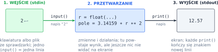
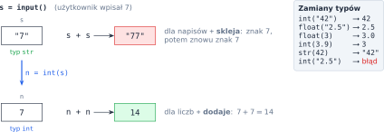
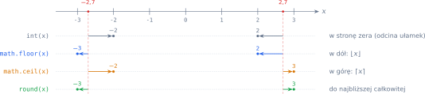
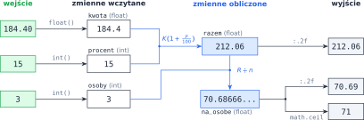

# Rozdział 1: Interakcja z konsolą — wprowadzenie

## Czego się nauczysz

* patrzeć na program jak na drogę **wejście → przetwarzanie → wyjście**,
* przechowywać dane w **zmiennych** i rozróżniać typy `int`, `float` i `str`,
* zamieniać napis z `input()` na liczbę i liczyć operatorami `+ - * / // % **`,
* korzystać z modułu `math` (pierwiastki, $\pi$, zaokrąglanie w górę i w dół),
* wypisywać wyniki z dokładnie zadaną liczbą miejsc po przecinku (f-stringi).

## Program: wejście, przetwarzanie, wyjście

Każdy program z tego rozdziału ma ten sam kształt. Najpierw **wczytuje** dane ze standardowego
wejścia (klawiatura albo plik podany przez sprawdzarkę), potem coś z nimi **liczy**, a na końcu
**wypisuje** wynik na standardowe wyjście (ekran). Za wczytanie jednej linii odpowiada funkcja
`input()`, za wypisanie — `print()`:

```python
r = float(input())          # wejście: jedna linia, np. "2"
pole = 3.14159 * r ** 2     # przetwarzanie
print(f"{pole:.2f}")        # wyjście: 12.57
```



> **Pamiętaj:** każde wywołanie `input()` zabiera z wejścia **jedną całą linię**. Jeśli dane
> to trzy liczby w trzech liniach, potrzebujesz trzech wywołań `input()` — w tej samej kolejności,
> w jakiej podano dane.

## Zmienne i typy danych

**Zmienna** to nazwana „szufladka” na wartość. Instrukcja przypisania `x = 5` oblicza prawą
stronę i wkłada wynik do zmiennej `x`; kolejne przypisanie podmienia zawartość. Każda wartość ma
**typ**, który decyduje o tym, co można z nią zrobić:

| Typ | Co przechowuje | Przykłady | Zamiana na ten typ |
|---|---|---|---|
| `int` | liczby całkowite $\ldots, -1, 0, 1, \ldots$ | `42`, `-7` | `int("42")`, `int(3.9)` → `3` |
| `float` | liczby zmiennoprzecinkowe (rzeczywiste) | `2.5`, `-0.1`, `1e6` | `float("2.5")`, `float(3)` → `3.0` |
| `str` | napisy (tekst) | `"Ala"`, `"42"` | `str(42)` → `"42"` |

Najważniejsza rzecz w tym rozdziale: **`input()` zawsze zwraca napis**. Nawet gdy użytkownik
wpisze `7`, dostajesz tekst `"7"`, a dla napisów `+` oznacza sklejanie: `"7" + "7"` daje `"77"`.
Żeby liczyć, trzeba napis najpierw zamienić na liczbę.



> **Uwaga:** `int("2.5")` kończy się błędem `ValueError` — funkcja `int` przyjmuje tylko napisy
> wyglądające jak liczba całkowita. Jeśli dane mogą mieć część ułamkową, wczytuj je przez `float()`.

## Działania arytmetyczne

| Działanie | Matematyka | Python | Przykład | Wynik |
|---|---|---|---|---|
| dodawanie, odejmowanie | $a + b$, $a - b$ | `a + b`, `a - b` | `7 - 10` | `-3` |
| mnożenie | $a \cdot b$ | `a * b` | `6 * 7` | `42` |
| dzielenie | $\frac{a}{b}$ | `a / b` | `17 / 5` | `3.4` |
| dzielenie całkowite | $\left\lfloor \frac{a}{b} \right\rfloor$ | `a // b` | `17 // 5` | `3` |
| reszta z dzielenia | $a \bmod b$ | `a % b` | `17 % 5` | `2` |
| potęgowanie | $a^b$ | `a ** b` | `2 ** 10` | `1024` |

Operator `/` **zawsze** daje `float` (także `6 / 3` to `2.0`). Dzielenie całkowite i reszta są ze
sobą związane: dla $b > 0$ liczby $q = a \,//\, b$ oraz $r = a \,\%\, b$ spełniają

$$a = b \cdot q + r, \qquad 0 \le r < b.$$

Na przykład $17 = 5 \cdot 3 + 2$. Python zaokrągla iloraz całkowity **w dół**, więc także
$-17 = 5 \cdot (-4) + 3$, czyli `-17 // 5` to `-4`, a `-17 % 5` to `3`.

Kolejność działań jest taka jak w matematyce: najpierw `**`, potem `*`, `/`, `//`, `%`, na końcu
`+` i `-`. Wyrażenie `2 + 3 * 4 ** 2` to $2 + 3 \cdot 16 = 50$. W razie wątpliwości dopisz
nawiasy — nie kosztują nic, a zwiększają czytelność.

Bardziej złożone funkcje matematyczne są w module `math`, który dołączasz instrukcją
`import math`: `math.sqrt(x)` to $\sqrt{x}$, `math.pi` to $\pi \approx 3.14159$, `math.sin`,
`math.cos`, `math.exp(x)` to $e^x$, a `math.log(x)` to logarytm naturalny $\ln x$. Kąty w funkcjach
trygonometrycznych podaje się w **radianach**.

## Zaokrąglanie i formatowanie wyniku

Liczbę rzeczywistą możesz „uciąć” do całkowitej na kilka sposobów, a każdy daje czasem inny wynik:

* `int(x)` odrzuca część ułamkową, czyli zaokrągla **w stronę zera**,
* `math.floor(x)` zaokrągla **w dół**: $\lfloor x \rfloor$ to największa liczba całkowita $\le x$,
* `math.ceil(x)` zaokrągla **w górę**: $\lceil x \rceil$ to najmniejsza liczba całkowita $\ge x$,
* `round(x)` zaokrągla do **najbliższej** liczby całkowitej.



Do wypisywania wyników służą **f-stringi**: napis z literą `f` przed cudzysłowem, w którym
wyrażenie w nawiasach klamrowych zostaje zastąpione jego wartością. Po dwukropku podajesz format:

| Kod | Wynik | Znaczenie |
|---|---|---|
| `f"{2/3:.3f}"` | `0.667` | dokładnie 3 cyfry po kropce (z zaokrągleniem) |
| `f"{19:.3f}"` | `19.000` | liczba całkowita też dostaje zera po kropce |
| `f"{7:02d}"` | `07` | liczba całkowita na 2 pozycjach, z zerem wiodącym |
| `f"{x} cm"` | `2.5 cm` | wartość zmiennej (tu `x = 2.5`) wstawiona w tekst |

Funkcja `print` przyjmuje kilka argumentów i oddziela je spacją; separator zmienisz argumentem
`sep`, a znak końca linii — argumentem `end`: `print("a", "b", sep="-", end="!\n")` wypisze `a-b!`.

> **Pułapka:** komputer przechowuje liczby `float` w systemie dwójkowym, więc większość ułamków
> dziesiętnych jest zapisana z malutkim błędem: `0.1 + 0.2` daje `0.30000000000000004`.
> Dlatego licz zawsze na pełnej dokładności, a zaokrąglaj **dopiero przy wypisywaniu**.

## Przykład rozwiązany: podział rachunku

**Zadanie.** Wczytaj kwotę rachunku w restauracji (liczba rzeczywista), napiwek w procentach
(liczba całkowita) i liczbę osób. Wypisz w osobnych liniach: kwotę razem z napiwkiem i kwotę na
osobę — obie z dokładnością do 2 miejsc po przecinku — oraz kwotę na osobę zaokrągloną w górę do
pełnych złotych (tyle każdy wyjmie z portfela).

**Analiza.** Napiwek $p\%$ zwiększa kwotę $K$ do

$$R = K \cdot \left(1 + \frac{p}{100}\right),$$

a każda z $n$ osób płaci $\frac{R}{n}$. Kwotę „do portfela” daje $\left\lceil \frac{R}{n} \right\rceil$,
czyli `math.ceil`. Zwykłe `round` byłoby błędem: przy 70,49 zł dałoby 70 zł, a wtedy zabrakłoby
pieniędzy.

```python
import math

kwota = float(input())     # rachunek w zł
procent = int(input())     # napiwek w procentach
osoby = int(input())       # liczba osób

razem = kwota * (1 + procent / 100)
na_osobe = razem / osoby

print(f"{razem:.2f}")
print(f"{na_osobe:.2f}")
print(math.ceil(na_osobe))
```

**Sprawdzenie** dla wejścia `184.40`, `15`, `3` — prześledź, jaka wartość i jakiego typu trafia
do każdej zmiennej:



Na wyjściu pojawiają się trzy linie: `212.06`, `70.69` i `71`. Zauważ, że zmienna `na_osobe`
przechowuje pełną wartość 70,68666… — zaokrąglamy ją tylko w napisie wypisywanym na ekran,
a `math.ceil` dostaje wartość niezaokrągloną.

## Typowe błędy

* **Liczenie na napisach.** `a = input()` i `b = input()`, a potem `a + b` dla danych `2` i `3`
  daje `"23"`, a nie `5`. Zamieniaj dane od razu przy wczytaniu: `a = int(input())`.
* **`int` zamiast `float`.** Gdy dane mogą mieć kropkę dziesiętną, `int(input())` zgłosi
  `ValueError`. Sprawdzaj w treści zadania, czy liczba jest całkowita, czy rzeczywista.
* **Zaokrąglanie w środku obliczeń.** Jeśli wynik pośredni zaokrąglisz (np. do 2 miejsc), a potem
  na nim liczysz dalej, błąd się kumuluje. Formatuj dopiero w `print`.
* **`round` lub `int` zamiast `math.ceil`.** „Ile płytek kupić”, „ile autobusów zamówić” — to
  zaokrąglenie w górę. `int(6.1)` daje `6`, a potrzebujesz `7`.
* **Brak nawiasów.** Wzór $\frac{a + b}{2}$ trzeba zapisać `(a + b) / 2`, bo `a + b / 2` to
  $a + \frac{b}{2}$. Podobnie $\frac{1}{2h}$ to `1 / (2 * h)`, a nie `1 / 2 * h`.
* **Dodatkowy tekst na wyjściu.** Sprawdzarka porównuje wyjście znak po znaku: `input("Podaj x: ")`
  jest ignorowane, ale `print("Wynik:", y)` już nie. Wypisuj dokładnie to, czego wymaga zadanie.
