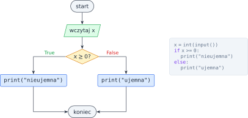
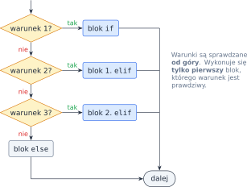
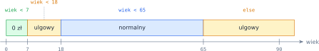

# Rozdział 2: Instrukcja warunkowa — wprowadzenie

## Czego się nauczysz

* zapisywać **warunki** — wyrażenia, które są prawdziwe (`True`) albo fałszywe (`False`),
* wybierać jedną z dwóch dróg instrukcją `if` / `else`,
* rozpatrywać wiele przypadków łańcuchem `if` / `elif` / `else`,
* łączyć warunki operatorami logicznymi `and`, `or`, `not`.

## Warunek: prawda albo fałsz

Program nie zawsze wykonuje te same instrukcje. Często musi **zdecydować**: wypisać jeden komunikat
albo drugi, policzyć coś na jeden sposób albo inny. Decyzję podejmuje na podstawie **warunku** —
wyrażenia, którego wartością jest `True` (prawda) albo `False` (fałsz). Najczęściej jest to
porównanie:

| Matematyka | Python | Przykład | Wartość |
|---|---|---|---|
| $a = b$ | `a == b` | `3 == 3` | `True` |
| $a \ne b$ | `a != b` | `3 != 3` | `False` |
| $a < b$, $a > b$ | `a < b`, `a > b` | `2 < 5` | `True` |
| $a \le b$, $a \ge b$ | `a <= b`, `a >= b` | `7 >= 9` | `False` |
| $a \le x < b$ | `a <= x < b` | `0 <= 4 < 10` | `True` |

> **Uwaga:** pojedynczy znak `=` to **przypisanie** (`x = 5` wkłada 5 do zmiennej `x`), a podwójny
> `==` to **porównanie** (`x == 5` pyta, czy `x` jest równe 5).

## Dwie drogi: `if` i `else`

Instrukcja `if` sprawdza warunek. Gdy jest prawdziwy, wykonuje blok kodu pod spodem; gdy fałszywy —
blok pod `else`. Blok to linie **wcięte** o 4 spacje: tak Python wie, które instrukcje należą do
której gałęzi. Część `else` można pominąć — wtedy przy fałszywym warunku program po prostu idzie dalej.



## Wiele przypadków: `elif`

Gdy możliwości jest więcej niż dwie, dopisujemy kolejne gałęzie `elif` („else if”). Python sprawdza
warunki po kolei i wykonuje **tylko pierwszą** gałąź, której warunek jest prawdziwy. Pozostałych
nawet nie sprawdza. Jeśli żaden warunek nie jest spełniony, wykonuje się `else`.



Dzięki temu w kolejnych warunkach nie trzeba powtarzać tego, co już wiadomo. Jeśli program doszedł do
`elif x > 0`, to warunek `x < 0` z poprzedniej gałęzi na pewno był fałszywy.

## Łączenie warunków

Operatory logiczne budują warunki złożone. Oznaczmy przez $p$ i $q$ dwa warunki:

| $p$ | $q$ | `p and q` ($p \land q$) | `p or q` ($p \lor q$) | `not p` ($\neg p$) |
|---|---|---|---|---|
| `True` | `True` | `True` | `True` | `False` |
| `True` | `False` | `False` | `True` | `False` |
| `False` | `True` | `False` | `True` | `True` |
| `False` | `False` | `False` | `False` | `True` |

* `and` jest prawdziwe tylko wtedy, gdy **oba** warunki są prawdziwe,
* `or` jest prawdziwe, gdy **co najmniej jeden** warunek jest prawdziwy,
* `not` odwraca wartość.

Przydają się prawa De Morgana — pozwalają „wnieść” zaprzeczenie do środka nawiasu:

$$\neg(p \land q) = \neg p \lor \neg q \qquad \neg(p \lor q) = \neg p \land \neg q$$

Na przykład warunek „liczba **nie** należy do przedziału $[1, 10]$” można zapisać jako
`not (1 <= x and x <= 10)` albo równoważnie `x < 1 or x > 10`.

## Przykład rozwiązany: cena biletu

**Zadanie.** Wczytaj wiek osoby i wypisz rodzaj biletu: dzieci poniżej 7 lat jadą za darmo,
młodzież poniżej 18 lat i seniorzy od 65 lat kupują bilet ulgowy, pozostali — normalny.

Najpierw warto narysować przedziały na osi liczbowej. Od razu widać, że są cztery przypadki
i że granice ($7$, $18$, $65$) należą do przedziału **po prawej** stronie:



Przypadki sprawdzamy od lewej do prawej. Każdy kolejny `elif` wie, że poprzednie warunki były
fałszywe, więc wystarczy podać tylko górną granicę:

```python
wiek = int(input())
if wiek < 7:
    print("bezpłatny")
elif wiek < 18:           # tu na pewno wiek >= 7
    print("ulgowy")
elif wiek < 65:           # tu na pewno wiek >= 18
    print("normalny")
else:                     # zostało: wiek >= 65
    print("ulgowy")
```

Sprawdźmy program na granicach przedziałów, bo tam najłatwiej o błąd:

| `wiek` | `wiek < 7` | `wiek < 18` | `wiek < 65` | Wynik |
|---|---|---|---|---|
| 6 | `True` | — | — | bezpłatny |
| 7 | `False` | `True` | — | ulgowy |
| 18 | `False` | `False` | `True` | normalny |
| 65 | `False` | `False` | `False` | ulgowy (`else`) |

Kreska „—” oznacza, że warunek nie był już sprawdzany.

## Typowe błędy

* **`=` zamiast `==`** w warunku — Python zgłosi błąd składni.
* **Zła kolejność gałęzi.** Gdyby pierwszym warunkiem było `wiek < 65`, każde dziecko dostałoby
  bilet normalny — dalsze gałęzie nigdy by się nie wykonały. Zaczynaj od przypadków najwęższych.
* **Brak dwukropka albo wcięcia** po `if`, `elif`, `else`.
* **Porównywanie liczb rzeczywistych przez `==`**: `0.1 + 0.2 == 0.3` daje `False`, bo liczby
  zmiennoprzecinkowe są przechowywane z małym błędem. Sprawdzaj raczej, czy
  $|a - b| < \varepsilon$ dla małego $\varepsilon$, np. `abs(a - b) < 1e-9`.
* **Porównywanie napisu z liczbą**: `input()` zwraca napis, więc `input() > 5` to błąd —
  najpierw zamień napis na liczbę: `int(input())`.
