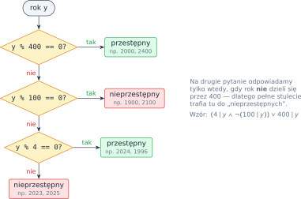
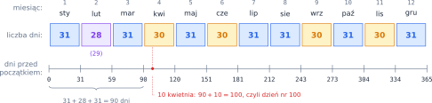
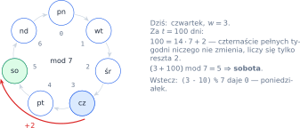
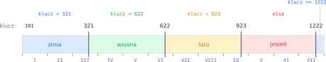

# Rozdział 3: Daty — wprowadzenie

## Czego się nauczysz

* sprawdzać podzielność operatorem `%` i zapisywać regułę roku przestępnego jako warunek złożony,
* ustalać, ile dni ma dany miesiąc,
* porównywać daty — najpierw rok, potem miesiąc, na końcu dzień,
* liczyć numer dnia w roku i dzień tygodnia za pomocą arytmetyki reszt (modulo 7).

## Podzielność i rok przestępny

Liczba $a$ jest **podzielna** przez $b$ (piszemy $b \mid a$), gdy dzielenie nie daje reszty:

$$b \mid a \iff a \bmod b = 0.$$

W Pythonie sprawdzasz to warunkiem `a % b == 0`. Na przykład `2024 % 4 == 0` to `True`, a
`1900 % 400 == 0` to `False`, bo $1900 = 4 \cdot 400 + 300$.

Kalendarz gregoriański dodaje 29 lutego w latach przestępnych. Rok $y$ jest przestępny, gdy

$$(4 \mid y \;\land\; \neg(100 \mid y)) \;\lor\; 400 \mid y.$$

Słownie: co cztery lata, ale bez pełnych stuleci — chyba że stulecie dzieli się przez 400. Regułę
najłatwiej zrozumieć jako drzewo decyzji, w którym najpierw sprawdza się warunek **najwęższy**:



Rok ma więc $365$ albo $366$ dni. W ciągu 400 lat jest $100 - 4 + 1 = 97$ lat przestępnych, więc
średnia długość roku to $365 + \frac{97}{400} = 365{,}2425$ dnia — bardzo blisko roku słonecznego.

> **Pułapka:** sama podzielność przez 4 nie wystarcza. Lata 1900 i 2100 dzielą się przez 4, ale
> **nie** są przestępne. Zawsze testuj swój warunek na czterech latach: 2024 (tak), 2023 (nie),
> 1900 (nie), 2000 (tak).

## Ile dni ma miesiąc?

Miesiące dzielą się na trzy grupy: siedem ma 31 dni, cztery mają 30 dni, a luty — 28 albo 29.
Grupę 30-dniową łatwo zapamiętać: kwiecień, czerwiec, wrzesień, listopad (4, 6, 9, 11). Wszystko
inne poza lutym ma 31 dni.



Warunek „miesiąc należy do grupy 30-dniowej” to alternatywa czterech porównań:
`m == 4 or m == 6 or m == 9 or m == 11`. Przypadek lutego musisz rozbić dodatkowo według tego,
czy rok jest przestępny. Zwróć uwagę na **kolejność** w łańcuchu `if`/`elif`: jeśli najpierw
obsłużysz luty i miesiące 30-dniowe, w gałęzi `else` zostają same miesiące 31-dniowe.

Dolny wiersz rysunku to **sumy częściowe** długości miesięcy. Jeśli $\text{dni}(i)$ oznacza
długość $i$-tego miesiąca, to numer dnia $d$ w miesiącu $m$ liczony od początku roku wynosi

$$\text{nr} = \sum_{i=1}^{m-1} \text{dni}(i) + d.$$

Na przykład 10 kwietnia to dzień $31 + 28 + 31 + 10 = 100$ (w roku przestępnym $101$, bo luty
jest o dzień dłuższy — dotyczy to tylko dat od 1 marca).

## Porównywanie dat

Daty porównuje się jak słowa w słowniku: najpierw rok; jeśli lata są równe — miesiąc; jeśli i
miesiące są równe — dzień. Można to zapisać łańcuchem warunków, ale jest prostszy sposób. Zamień
datę na jedną liczbę, w której rok stoi na najstarszych cyfrach:

$$k = 10\,000 \cdot y + 100 \cdot m + d.$$

Data 5.12.1999 daje $k = 19\,991\,205$, a 20.11.2020 daje $k = 20\,201\,120$. Ponieważ $m \le 12$
i $d \le 31$, miesiąc i dzień nigdy nie „przeleją się” na cyfry roku, więc **wcześniejsza data
ma zawsze mniejszy klucz**. Porównanie dat sprowadza się do porównania dwóch liczb całkowitych.

| Data | $y$ | $m$ | $d$ | Klucz $k$ |
|---|---|---|---|---|
| 31.01.2024 | 2024 | 1 | 31 | `20240131` |
| 1.02.2024 | 2024 | 2 | 1 | `20240201` |
| 1.01.2025 | 2025 | 1 | 1 | `20250101` |

Gdy rok nie ma znaczenia (urodziny, święta, pory roku), wystarczy klucz $100 \cdot m + d$.

## Dni tygodnia i arytmetyka modulo 7

Dni tygodnia powtarzają się co 7 dni, więc liczy się je **resztami z dzielenia przez 7**.
Ponumeruj dni od zera: poniedziałek $= 0$, wtorek $= 1$, …, niedziela $= 6$. Jeśli dziś jest dzień
numer $w$, to za $t$ dni będzie dzień numer

$$(w + t) \bmod 7.$$



Przykład: 8 października 2026 to czwartek ($w = 3$). Za 100 dni wypadnie
$(3 + 100) \bmod 7 = 103 \bmod 7 = 5$, czyli sobota. Operator `%` w Pythonie zawsze daje wynik
z zakresu $0$–$6$ (dla dzielnika 7), także gdy liczysz wstecz: `(3 - 10) % 7` to `0` —
poniedziałek. Na tej samej zasadzie działa wzór Zellera: dodaje „przesunięcia” wynikające
z dnia, miesiąca, roku i stulecia, a na końcu bierze resztę z dzielenia przez 7.

> **Wskazówka:** biblioteka standardowa ma moduł `datetime`, który zna kalendarz gregoriański.
> Gdy rozwiążesz zadanie samodzielnie, możesz porównać swój wynik z tym, co zwraca
> `datetime` — to dobry sposób na znalezienie błędu.

## Przykład rozwiązany: pora roku

**Zadanie.** Wczytaj dzień `d` i miesiąc `m` (poprawnej daty) i wypisz porę roku. Przyjmij
uproszczone daty astronomiczne: wiosna trwa od 21 marca, lato od 22 czerwca, jesień od 23
września, a zima od 22 grudnia (i trwa do 20 marca następnego roku).

**Analiza.** Rok nie ma tu znaczenia, więc zamieniamy datę na klucz $k = 100m + d$. Każdy
początek pory roku to też klucz: $321$, $622$, $923$, $1222$. Rysujemy je na osi:



Zima „zawija się” przez Nowy Rok — składa się z dwóch kawałków osi: $k < 321$ **lub**
$k \ge 1222$. Sprawdzamy ją więc pierwszą, warunkiem z `or`. Pozostałe pory roku to kolejne
przedziały, więc wystarczy łańcuch `elif` z samymi górnymi granicami (jak w rozdziale 2):

```python
d = int(input())
m = int(input())

klucz = 100 * m + d      # np. 21 marca -> 321

if klucz < 321 or klucz >= 1222:
    print("zima")
elif klucz < 622:
    print("wiosna")
elif klucz < 923:
    print("lato")
else:
    print("jesień")
```

**Sprawdzenie** na granicach — każdy dzień graniczny i dzień przed nim:

| Data | Klucz | Pierwszy prawdziwy warunek | Wynik |
|---|---|---|---|
| 20.03 | 320 | `klucz < 321` | zima |
| 21.03 | 321 | `klucz < 622` | wiosna |
| 21.06 | 621 | `klucz < 622` | wiosna |
| 22.06 | 622 | `klucz < 923` | lato |
| 22.09 | 922 | `klucz < 923` | lato |
| 23.09 | 923 | `else` | jesień |
| 21.12 | 1221 | `else` | jesień |
| 22.12 | 1222 | `klucz >= 1222` | zima |

## Typowe błędy

* **Niepełna reguła roku przestępnego.** Warunek `y % 4 == 0` myli się dla lat 1900, 2100, 2200.
  Pamiętaj o wszystkich trzech częściach reguły i o nawiasach: `and` wiąże mocniej niż `or`,
  ale jawne nawiasy chronią przed pomyłką.
* **`or` zamiast `and` (i odwrotnie).** „Dzień jest poprawny” to `1 <= d and d <= dni` — oba
  warunki naraz. `d >= 1 or d <= dni` jest prawdziwe dla każdej liczby.
* **Skrócone porównanie w łańcuchu.** `m == 4 or 6 or 9` **nie** sprawdza, czy `m` jest jedną
  z tych liczb: Python czyta to jako `(m == 4) or 6 or 9`, a `6` jest traktowane jak prawda.
  Każde porównanie zapisuj w całości: `m == 4 or m == 6 or m == 9`.
* **Porównywanie dat „po kawałku”.** Warunek `d1 <= d2 and m1 <= m2 and y1 <= y2` jest błędny:
  1.12.2019 jest wcześniej niż 5.01.2020, a mimo to $12 > 1$. Porównuj leksykograficznie albo
  przez klucz $10\,000y + 100m + d$.
* **Luty w roku przestępnym przy liczeniu dnia roku.** Dodatkowy dzień dodajesz tylko dla dat
  **od 1 marca** — 15 lutego to dzień 46 w każdym roku.
