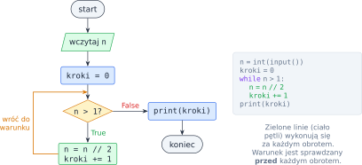
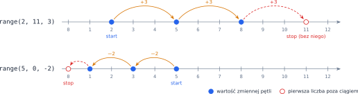
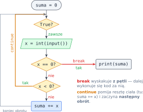
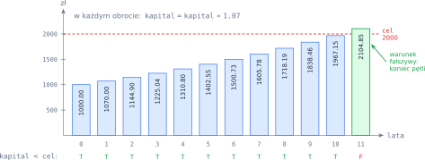

# Rozdział 4: Pętle — wprowadzenie

## Czego się nauczysz

* powtarzać instrukcje pętlą `while`, dopóki warunek jest prawdziwy,
* przechodzić po ciągu liczb pętlą `for` i funkcją `range(start, stop, krok)`,
* zbierać wynik w **akumulatorze** (suma, licznik, iloczyn) i śledzić pętlę w tabeli stanu,
* przerywać pętlę instrukcją `break` i pomijać obrót instrukcją `continue`.

## Pętla `while`: powtarzaj, dopóki…

Pętla `while` to „`if`, który się powtarza”. Python sprawdza warunek; jeśli jest prawdziwy,
wykonuje wcięty blok (**ciało pętli**), po czym **wraca** do warunku. Pętla kończy się dopiero
wtedy, gdy warunek okaże się fałszywy — może więc wykonać się wiele razy, raz albo ani razu.

```python
n = int(input())      # np. 100
kroki = 0
while n > 1:
    n = n // 2
    kroki += 1        # skrót od: kroki = kroki + 1
print(kroki)          # 6, bo 100 → 50 → 25 → 12 → 6 → 3 → 1
```



Ten program liczy, ile razy można podzielić $n$ przez 2, zanim dojdzie się do 1 — matematycznie
jest to $\lfloor \log_2 n \rfloor$. Nie wiadomo z góry, ile obrotów wykona pętla, i właśnie wtedy
`while` jest najlepszym wyborem.

> **Pamiętaj:** ciało pętli `while` musi **zmieniać** coś, od czego zależy warunek (tu: `n`).
> Inaczej warunek zostanie prawdziwy na zawsze i program nigdy się nie skończy.

## Pętla `for` i funkcja `range`

Gdy z góry wiadomo, po jakich liczbach chcesz przejść, wygodniejsza jest pętla `for`. Zmienna
pętli dostaje po kolei każdą wartość z ciągu wygenerowanego przez `range`:

| Wywołanie | Wartości | Opis |
|---|---|---|
| `range(4)` | `0, 1, 2, 3` | od 0 do 3 — liczba 4 **nie** należy do ciągu |
| `range(1, n + 1)` | `1, 2, …, n` | typowe „od 1 do $n$ włącznie” |
| `range(2, 11, 3)` | `2, 5, 8` | co trzecia liczba, od 2, mniejsza od 11 |
| `range(5, 0, -2)` | `5, 3, 1` | krok ujemny — odliczanie w dół, większa od 0 |
| `range(3, 3)` | brak | pusty ciąg: pętla nie wykona się ani razu |

`range(start, stop, krok)` daje liczby $\text{start},\ \text{start} + \text{krok},\ \text{start} + 2\,\text{krok}, \ldots$
dopóki nie dojdzie do `stop` — sam `stop` **nigdy** nie należy do ciągu. Dla dodatniego kroku
wyrazów jest

$$\max\left(0, \left\lceil \frac{\text{stop} - \text{start}}{\text{krok}} \right\rceil\right).$$



Każdą pętlę `for` da się zapisać jako `while`: `for i in range(a, b):` robi to samo co
`i = a`, a potem `while i < b:` z `i += 1` na końcu ciała. Pętla `for` po prostu pilnuje
licznika za Ciebie.

## Akumulator i tabela stanu

Bardzo częsty schemat: przed pętlą tworzysz zmienną na wynik (**akumulator**), a w każdym obrocie
ją aktualizujesz. Wartość początkowa to element **neutralny** działania:

| Akumulator | Początek | Aktualizacja | Wynik |
|---|---|---|---|
| suma | `suma = 0` | `suma += x` | $\sum x$ |
| licznik | `ile = 0` | `ile += 1` (gdy warunek spełniony) | liczba elementów |
| iloczyn | `iloczyn = 1` | `iloczyn *= x` | $\prod x$ |

Zsumujmy kolejne liczby nieparzyste: $1 + 3 + 5 + \ldots + (2n - 1) = \sum_{k=1}^{n} (2k - 1)$.

```python
n = int(input())
suma = 0
for k in range(1, n + 1):
    suma += 2 * k - 1
print(suma)
```

Najlepszy sposób, żeby zrozumieć (albo znaleźć błąd w) pętli, to **tabela stanu**: wiersz na
każdy obrót, kolumna na każdą zmienną. Dla $n = 4$:

| Obrót | `k` | `2 * k - 1` | `suma` po obrocie |
|---|---|---|---|
| przed pętlą | — | — | 0 |
| 1 | 1 | 1 | 1 |
| 2 | 2 | 3 | 4 |
| 3 | 3 | 5 | 9 |
| 4 | 4 | 7 | 16 |

Kolumna `suma` to kolejne kwadraty — rzeczywiście $\sum_{k=1}^{n} (2k - 1) = n^2$. Taka obserwacja
to dobry test: wynik pętli możesz porównać ze wzorem.

## Przerywanie pętli: `break` i `continue`

* `break` natychmiast **kończy** całą pętlę — program przechodzi do pierwszej instrukcji za nią,
* `continue` kończy tylko **bieżący obrót** i wraca do sprawdzenia warunku (w `for` — do
  następnej wartości).

Razem z pętlą `while True:` (warunek zawsze prawdziwy) pozwalają wczytywać dane, dopóki nie
pojawi się wartość kończąca. Poniższy program sumuje liczby dodatnie aż do zera, pomijając ujemne:

```python
suma = 0
while True:
    x = int(input())
    if x == 0:
        break          # koniec danych
    if x < 0:
        continue       # pomiń ten obrót
    suma += x
print(suma)            # dla 5, -3, 2, 0 wypisze 7
```



## Przykład rozwiązany: podwojenie oszczędności

**Zadanie.** Wpłacasz na lokatę kwotę $K_0$ oprocentowaną $p\%$ rocznie; odsetki co roku
dopisywane są do kapitału. Wczytaj $K_0$ i $p$ (liczby rzeczywiste, $p > 0$) i wypisz, po ilu
pełnych latach kapitał po raz pierwszy co najmniej się podwoi, a w drugiej linii — kapitał
w tym momencie (do 2 miejsc po przecinku).

**Analiza.** Po każdym roku kapitał mnoży się przez $1 + \frac{p}{100}$, więc po $n$ latach

$$K_n = K_0 \cdot \left(1 + \frac{p}{100}\right)^n.$$

Szukamy najmniejszego $n$, dla którego $K_n \ge 2K_0$. Nie wiemy z góry, ile to lat — to zadanie
dla `while`. Warunek pętli to **zaprzeczenie** warunku końca: kręcimy się, **dopóki**
$K < 2K_0$. Licznik lat to akumulator zaczynający od zera.

```python
kapital = float(input())   # wpłata początkowa, np. 1000
procent = float(input())   # oprocentowanie roczne, np. 7

cel = 2 * kapital
lata = 0
while kapital < cel:
    kapital = kapital * (1 + procent / 100)
    lata += 1

print(lata)
print(f"{kapital:.2f}")
```

**Sprawdzenie** dla $K_0 = 1000$, $p = 7$. Każdy słupek to stan zmiennej `kapital` po kolejnym
obrocie; pętla zatrzymuje się na pierwszym słupku, który sięga linii celu:



| `lata` | 0 | 1 | 2 | … | 9 | 10 | 11 |
|---|---|---|---|---|---|---|---|
| `kapital` | 1000.00 | 1070.00 | 1144.90 | … | 1838.46 | 1967.15 | 2104.85 |
| `kapital < cel` | `True` | `True` | `True` | … | `True` | `True` | `False` |

Program wypisuje `11` i `2104.85`. Szybki test „na oko” daje reguła 72: kapitał podwaja się po
mniej więcej $\frac{72}{p} = \frac{72}{7} \approx 10{,}3$ roku — zgadza się.

## Typowe błędy

* **Pętla nieskończona.** Warunek nigdy nie staje się fałszywy, bo ciało nie zmienia zmiennych
  z warunku — albo zmienia je w złą stronę. W przykładzie z lokatą dla $p = 0$ kapitał nigdy nie
  rośnie; dlatego zadanie zakłada $p > 0$. Gdy program „wisi”, przerwij go klawiszami Ctrl+C.
* **Pomyłka o jeden (off-by-one).** `range(1, n)` kończy się na $n - 1$, a nie na $n$. Zanim
  uruchomisz program, sprawdź w głowie **pierwszy i ostatni** obrót.
* **Akumulator zerowany w pętli.** `suma = 0` musi stać **przed** pętlą. Wpisane do środka zeruje
  wynik w każdym obrocie.
* **Iloczyn zaczynany od zera.** Akumulator mnożenia zaczyna się od `1` — zero „pochłonie”
  każdy kolejny czynnik.
* **Zły warunek `while`.** Pętla kręci się, **dopóki** warunek jest prawdziwy. Jeśli w treści
  jest „aż do osiągnięcia celu”, warunek pętli to zaprzeczenie: `while kapital < cel`, a nie
  `while kapital >= cel`.
* **Złe wcięcie.** Instrukcja wcięta pod pętlą wykona się wiele razy; ta sama instrukcja bez
  wcięcia — raz, po pętli. `print(suma)` wewnątrz pętli wypisze wszystkie sumy częściowe.
