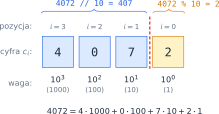
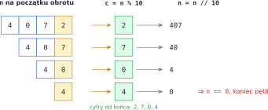
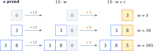
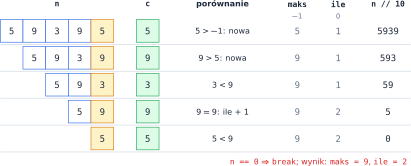

# Rozdział 5: Pętle — cyfry liczby — wprowadzenie

## Czego się nauczysz

* rozumieć **zapis pozycyjny** — dlaczego cyfry liczby to współczynniki przy potęgach 10,
* odcinać ostatnią cyfrę operatorami `% 10` i `// 10` i powtarzać to w pętli,
* wydobywać cyfrę z dowolnej pozycji i składać liczbę z kolejnych cyfr,
* łączyć pętlę po cyfrach z pętlą po wielu liczbach, nie niszcząc badanej liczby.

## Zapis pozycyjny

Cyfra w zapisie dziesiętnym znaczy tym więcej, im dalej stoi od prawego końca: każda pozycja
w lewo to dziesięć razy większa **waga**. Liczba $n$ o cyfrach $c_{k-1} \ldots c_1 c_0$ (od
lewej do prawej) to

$$n = c_{k-1} \cdot 10^{k-1} + \ldots + c_1 \cdot 10 + c_0 = \sum_{i=0}^{k-1} c_i \cdot 10^i, \qquad 0 \le c_i \le 9.$$

Na przykład $4072 = 4 \cdot 1000 + 0 \cdot 100 + 7 \cdot 10 + 2$. Cyfra jedności $c_0$ ma
wagę $10^0 = 1$, a cyfra stojąca na pozycji $i$ — wagę $10^i$.



Ze wzoru od razu widać, jak oddzielić ostatnią cyfrę. Wszystkie składniki oprócz $c_0$ dzielą
się przez 10, więc

$$n \bmod 10 = c_0, \qquad \left\lfloor \frac{n}{10} \right\rfloor = c_{k-1} \cdot 10^{k-2} + \ldots + c_1.$$

W Pythonie: `4072 % 10` to `2` (ostatnia cyfra), a `4072 // 10` to `407` (liczba bez ostatniej
cyfry). Dzielenie całkowite przez 10 **przesuwa** wszystkie cyfry o jedną pozycję w prawo,
a cyfra jedności „wypada”.

## Pętla po cyfrach

Jeśli powtarzasz te dwa kroki, dopóki liczba nie stanie się zerem, odwiedzisz wszystkie cyfry —
**od końca**, czyli od cyfry jedności:

```python
n = int(input())
while n > 0:
    c = n % 10      # ostatnia cyfra
    # ... tu zrób coś z cyfrą c ...
    n = n // 10     # usuń ostatnią cyfrę
```



Każdy obrót skraca liczbę o jedną cyfrę, więc pętla wykona się tyle razy, ile cyfr ma $n$,
czyli $\lfloor \log_{10} n \rfloor + 1$ razy (dla $n \ge 1$). Nawet dla liczby z 18 cyframi to
tylko 18 obrotów.

> **Uwaga:** dla $n = 0$ warunek `n > 0` jest fałszywy od razu i pętla nie wykona się ani razu,
> choć liczba 0 ma jedną cyfrę: `0`. Zawsze sprawdź osobno, co Twój program robi dla zera.
> Jeden ze sposobów pokazuje przykład rozwiązany na końcu rozdziału.

## Cyfra z wybranej pozycji i składanie liczby

Żeby dostać cyfrę z pozycji $i$ (licząc od zera od prawej), najpierw przesuń liczbę o $i$ pozycji
w prawo, a potem weź ostatnią cyfrę:

$$c_i = \left\lfloor \frac{n}{10^i} \right\rfloor \bmod 10.$$

Dla $4072$ i $i = 1$: `(4072 // 10) % 10` to `407 % 10`, czyli `7` — cyfra dziesiątek.
W szczególności dla liczby dwucyfrowej $x$ cyfra dziesiątek to `x // 10`, a jedności — `x % 10`.

Działanie odwrotne — **dopisanie cyfry na końcu** liczby — to przesunięcie w lewo i dodanie:

$$w \leftarrow 10 \cdot w + c.$$

Zaczynając od $w = 0$ i dopisując cyfry $3$, $8$, $5$, dostajesz kolejno $3$, $38$, $385$.
Ten schemat przyda się zawsze, gdy z cyfr trzeba zbudować nową liczbę.



## Badanie wielu liczb

W części zadań trzeba sprawdzić cyfry **każdej** liczby z pewnego zakresu. To dwie pętle: zewnętrzna
`for` wybiera liczbę, a wewnętrzna `while` rozbiera ją na cyfry. Pętla po cyfrach **niszczy**
zmienną (na końcu jest w niej zero), więc rozbieraj **kopię**, a oryginał zostaw do wypisania:

```python
for liczba in range(100, 200):
    x = liczba               # kopia — tę będziemy niszczyć
    iloczyn = 1
    while x > 0:
        iloczyn *= x % 10
        x //= 10
    if iloczyn == 12:
        print(liczba)        # 126, 134, 143, 162
```

Ten program wypisuje liczby od 100 do 199, których iloczyn cyfr wynosi 12. Zauważ, że
akumulator `iloczyn = 1` jest zerowany **wewnątrz** pętli `for`, a przed pętlą `while` — każda
liczba ma swój własny iloczyn.

## Przykład rozwiązany: największa cyfra

**Zadanie.** Wczytaj liczbę naturalną $n \ge 0$ i wypisz jej największą cyfrę, a w drugiej linii —
ile razy ta cyfra występuje w zapisie $n$. Dla $n = 59395$ odpowiedź to `9` i `2`.

**Analiza.** Przeglądamy cyfry od końca i pamiętamy dwie rzeczy: największą dotąd cyfrę `maks`
i liczbę jej wystąpień `ile`. Dla każdej cyfry $c$ są trzy możliwości:

* $c > \text{maks}$ — znaleźliśmy nową, większą cyfrę: `maks = c`, a licznik zaczynamy od nowa (`ile = 1`),
* $c = \text{maks}$ — kolejne wystąpienie największej cyfry: `ile += 1`,
* $c < \text{maks}$ — nic się nie zmienia.

Na początek ustawiamy `maks = -1` — mniej niż każda cyfra, więc pierwsza cyfra na pewno ją
zastąpi. Pozostaje liczba $0$: zwykła pętla `while n > 0` nie obejrzałaby żadnej cyfry. Dlatego
warunek sprawdzamy **na końcu** obrotu — pętla `while True` z `break`, gdy liczba się skończy.
Taka pętla zawsze wykona co najmniej jeden obrót.

```python
n = int(input())

maks = -1          # mniejsze od każdej cyfry
ile = 0
while True:
    c = n % 10
    if c > maks:       # nowa największa cyfra
        maks = c
        ile = 1
    elif c == maks:    # kolejne wystąpienie największej
        ile += 1
    n = n // 10
    if n == 0:
        break

print(maks)
print(ile)
```

**Sprawdzenie** dla $n = 59395$ — każdy wiersz to jeden obrót pętli; wyróżniona jest cyfra,
którą właśnie bada program:



Dla $n = 0$ pętla wykona jeden obrót: $c = 0 > -1$, więc `maks = 0`, `ile = 1`, a potem
`n // 10` daje 0 i `break` kończy pętlę. Program wypisze poprawnie `0` i `1`.

## Typowe błędy

* **Zapominanie o zerze.** `while n > 0` dla $n = 0$ nie robi nic. Jeśli zero ma jedną cyfrę,
  obsłuż je osobno albo użyj pętli z warunkiem na końcu (jak w przykładzie).
* **Zniszczona liczba.** Po pętli po cyfrach w zmiennej jest `0`. Jeśli potem chcesz wypisać albo
  porównać oryginał, rozbieraj kopię.
* **`/` zamiast `//`.** `4072 / 10` to `407.2` (float), więc `n % 10` daje potem ułamki
  w rodzaju `7.19999…` zamiast cyfr, a pętla `while n > 0` dla $n = 4072$ wykonuje aż 328 obrotów,
  zanim liczba zmaleje do zera. Do odcinania cyfr używaj wyłącznie `//`.
* **Kolejność kroków w obrocie.** Najpierw weź cyfrę (`n % 10`), potem ją usuń (`n //= 10`).
  Odwrotna kolejność pominie cyfrę jedności, a na końcu doda nieistniejące zero.
* **Akumulator w złym miejscu.** Gdy badasz wiele liczb, suma lub iloczyn cyfr musi być
  zerowany przed pętlą po cyfrach **każdej** liczby, a nie raz na początku programu.
