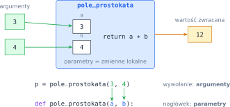
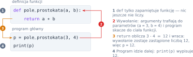
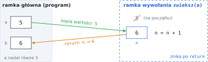
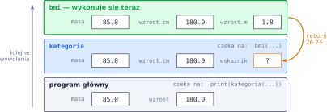

# Rozdział 6: Funkcje — wprowadzenie

## Czego się nauczysz

* definiować funkcje instrukcją `def` i zwracać wynik instrukcją `return`,
* odróżniać **parametry** (nazwy w nagłówku) od **argumentów** (wartości przy wywołaniu),
* śledzić, jak program „skacze” do funkcji i z niej wraca, także gdy funkcja wywołuje funkcję,
* rozumieć, że zmienne utworzone w funkcji są **lokalne**,
* używać argumentów domyślnych i nazwanych, zwracać kilka wartości i testować funkcje `assert`-em.

## Funkcja jako czarna skrzynka

Funkcja to nazwany kawałek kodu, który dostaje dane **na wejściu** (argumenty), coś z nimi robi
i oddaje **jeden wynik** (wartość zwracaną). Tak samo jak funkcja w matematyce:
$f(a, b) = a \cdot b$ przyporządkowuje parze liczb ich iloczyn.

```python
def pole_prostokata(a, b):     # nagłówek: nazwa i parametry
    return a * b               # ciało: oblicz i zwróć wynik

p = pole_prostokata(3, 4)      # wywołanie z argumentami 3 i 4
print(p)                       # 12
print(pole_prostokata(2, 5) + 1)   # 11 — wywołanie to zwykłe wyrażenie
```



Przy wywołaniu argumenty trafiają do parametrów **po kolei**: pierwszy argument do pierwszego
parametru, drugi do drugiego. Kto wywołuje funkcję, nie musi wiedzieć, jak jest napisana — wystarczy
mu nazwa, lista parametrów i opis wyniku. To właśnie czyni funkcje użytecznymi: raz napisaną
i sprawdzoną funkcję wywołujesz wiele razy, w różnych miejscach programu.

## Wywołanie i powrót

Instrukcja `def` niczego nie oblicza — tylko **zapamiętuje** funkcję pod podaną nazwą. Ciało
wykona się dopiero przy wywołaniu. Wtedy program:

1. oblicza wartości argumentów,
2. przypisuje je parametrom i **skacze** do pierwszej linii ciała funkcji,
3. wykonuje ciało aż do instrukcji `return` (albo do końca ciała),
4. **wraca** w miejsce wywołania, a całe wywołanie zostaje zastąpione wartością zwróconą.



`return` natychmiast kończy funkcję — instrukcje za nim (w tej samej gałęzi) się nie wykonają.
Funkcja, która nie wykonała żadnego `return`, zwraca specjalną wartość `None` („nic”).
Dlatego **wypisanie** wyniku w funkcji to nie to samo co jego **zwrócenie**:

```python
def podwoj_zle(x):
    print(2 * x)        # tylko wypisuje

def podwoj(x):
    return 2 * x        # oddaje wynik

w = podwoj_zle(5)       # na ekranie pojawia się 10...
print(w)                # ...ale w zmiennej w jest None
print(podwoj(5) + 1)    # 11 — zwróconą wartością można dalej liczyć
```

## Zmienne lokalne

Parametry i zmienne utworzone w ciele funkcji są **lokalne**: powstają przy każdym wywołaniu
w osobnej „ramce” i znikają, gdy funkcja się kończy. Nie widać ich na zewnątrz, a ich nazwy nie
kolidują z nazwami w reszcie programu.

```python
def zwieksz(n):
    n = n + 1           # zmienia tylko lokalne n
    return n

a = 5
b = zwieksz(a)
print(a, b)             # 5 6 — zmienna a się nie zmieniła
```



Przy wywołaniu `zwieksz(a)` parametr `n` dostaje **wartość** zmiennej `a`, czyli 5. Zmiana `n`
w funkcji nie dotyka `a`. Jedyny kanał, którym funkcja oddaje wynik, to `return`. Funkcja może
**odczytać** zmienną zdefiniowaną poza nią (tzw. globalną), ale dobrą praktyką jest przekazywanie
wszystkiego, czego potrzebuje, przez parametry.

## Więcej o parametrach i wyniku

| Konstrukcja | Przykład | Znaczenie |
|---|---|---|
| kilka wyników | `return a // b, a % b` | zwraca **krotkę**; odbierasz ją: `q, r = dziel(17, 5)` |
| argument domyślny | `def powitanie(imie, jezyk="pl"):` | `powitanie("Ola")` użyje `jezyk="pl"` |
| argument nazwany | `powitanie(jezyk="en", imie="Tom")` | kolejność nie ma znaczenia, liczy się nazwa |
| dowolna liczba argumentów | `def suma(*liczby):` | wszystkie argumenty trafiają do krotki `liczby` |
| test | `assert dziel(17, 5) == (3, 2)` | zatrzymuje program, gdy warunek jest fałszywy |

Parametry z wartością domyślną muszą stać w nagłówku **za** parametrami bez niej. Argumenty bez
nazw (pozycyjne) podaje się przy wywołaniu **przed** nazwanymi.

> **Wskazówka:** zaraz pod definicją funkcji dopisz kilka linii `assert` z przypadkami, których
> wynik znasz — zwłaszcza **brzegowymi** (zero, liczby równe, granica przedziału). Jeśli po
> poprawce w funkcji któryś test przestanie przechodzić, program od razu się zatrzyma i pokaże,
> który.

## Przykład rozwiązany: wskaźnik BMI

**Zadanie.** Wskaźnik masy ciała to $\text{BMI} = \frac{m}{h^2}$, gdzie $m$ to masa w kilogramach,
a $h$ — wzrost w **metrach**. Napisz funkcję `bmi(masa, wzrost_cm)` zwracającą wskaźnik oraz
funkcję `kategoria(masa, wzrost_cm)`, która zwraca `"niedowaga"` dla $\text{BMI} < 18{,}5$,
`"norma"` dla $18{,}5 \le \text{BMI} < 25$ i `"nadwaga"` w pozostałych przypadkach. Program
wczytuje masę i wzrost w centymetrach i wypisuje BMI (1 miejsce po przecinku) oraz kategorię.

**Analiza.** Obliczenie wskaźnika potrzebne jest dwa razy: do wypisania i do wyboru kategorii.
Zamiast powtarzać wzór, piszemy go raz, w funkcji `bmi`, a `kategoria` ją **wywołuje**. Każda
funkcja robi jedną rzecz, więc łatwo ją sprawdzić osobno. Testy `assert` sprawdzają po jednym
przypadku z każdej kategorii.

```python
def bmi(masa, wzrost_cm):
    wzrost_m = wzrost_cm / 100
    return masa / wzrost_m ** 2


def kategoria(masa, wzrost_cm):
    wskaznik = bmi(masa, wzrost_cm)
    if wskaznik < 18.5:
        return "niedowaga"
    elif wskaznik < 25:
        return "norma"
    else:
        return "nadwaga"


assert kategoria(50, 180) == "niedowaga"    # BMI ≈ 15,4
assert kategoria(70, 175) == "norma"        # BMI ≈ 22,9
assert kategoria(90, 170) == "nadwaga"      # BMI ≈ 31,1

masa = float(input())
wzrost = float(input())
print(f"{bmi(masa, wzrost):.1f}")
print(kategoria(masa, wzrost))
```

**Sprawdzenie** dla wejścia `85` i `180`. Rysunek pokazuje chwilę, w której wykonuje się `bmi`
wywołane z wnętrza `kategoria` — w pamięci są naraz trzy ramki, ułożone jedna na drugiej
(**stos wywołań**). Każda ma własne zmienne `masa` i `wzrost_cm`:



Funkcja `bmi` zwraca $\frac{85}{1{,}8^2} \approx 26{,}23$; jej ramka znika, a wartość trafia do
zmiennej `wskaznik` w ramce `kategoria`. Warunki `wskaznik < 18.5` i `wskaznik < 25` są fałszywe,
więc `kategoria` zwraca `"nadwaga"`. Program wypisuje `26.2` i `nadwaga`.

## Typowe błędy

* **`print` zamiast `return`.** Funkcja wypisuje wynik, ale zwraca `None` — a program główny
  wypisuje jeszcze raz, więc na ekranie pojawia się dodatkowa linia `None`.
* **Brak `return` w jednej z gałęzi.** Jeśli `return` stoi tylko pod `if`, a warunek jest
  fałszywy, funkcja zwróci `None`. Sprawdź, czy **każda** ścieżka przez funkcję kończy się `return`.
* **Funkcja zdefiniowana, ale niewywołana** (albo wywołana bez nawiasów: `wynik = suma` zamiast
  `wynik = suma(a, b)`). Sama definicja niczego nie oblicza.
* **Używanie zmiennej lokalnej poza funkcją.** Po wykonaniu `bmi` zmienna `wzrost_m` nie istnieje:
  `print(wzrost_m)` w programie głównym zgłosi `NameError`. Wynik wyprowadzaj przez `return`.
* **Wczytywanie danych w funkcji, która ma je dostać przez parametry.** Jeśli treść każe napisać
  `suma(a, b)`, funkcja **nie** wywołuje `input()` — korzysta z `a` i `b`.
* **Zła kolejność argumentów.** `roznica(b, a)` to nie to samo co `roznica(a, b)`. Argumenty
  pozycyjne trafiają do parametrów po kolei; w razie wątpliwości użyj argumentów nazwanych.
