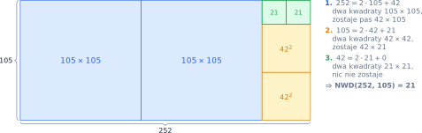
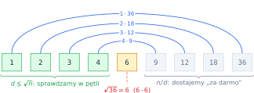
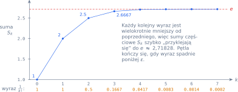
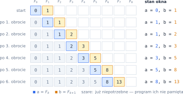

# Rozdział 7: Pętle — algorytmy matematyczne — wprowadzenie

## Czego się nauczysz

* zapisywać sumy, iloczyny, minima i maksima jako **akumulatory** aktualizowane w pętli,
* rozumieć, dlaczego **algorytm Euklidesa** działa i jak szybko kończy pracę,
* szukać dzielników tylko do $\sqrt{n}$ i oceniać koszt algorytmu notacją $O(\ldots)$,
* liczyć przybliżenia w pętli, aż osiągną zadaną **dokładność** $\varepsilon$,
* przenosić w pętli kilka zmiennych naraz instrukcją `a, b = b, a + b`.

## Akumulatory: suma, iloczyn, minimum, maksimum

Wiele wzorów matematycznych to „działanie powtórzone $n$ razy”. Każdy taki wzór zamieniasz na
pętlę z akumulatorem, który zaczyna od **elementu neutralnego** działania:

| Wzór | Start | Krok pętli | Uwagi |
|---|---|---|---|
| $S = \sum_{k=1}^{n} x_k$ | $S = 0$ | $S \leftarrow S + x_k$ | $0$ nie zmienia sumy |
| $P = \prod_{k=1}^{n} x_k$ | $P = 1$ | $P \leftarrow P \cdot x_k$ | $1$ nie zmienia iloczynu; pusty iloczyn to $1$ |
| $m = \min(x_1, \ldots, x_n)$ | $m = x_1$ | $m \leftarrow \min(m, x_k)$ | start od pierwszego elementu, nie od $0$ |
| $M = \max(x_1, \ldots, x_n)$ | $M = x_1$ | $M \leftarrow \max(M, x_k)$ | jak wyżej |

Dlaczego minimum nie zaczyna od zera? Bo dla liczb $5, 8, 3$ wynik byłby $0$ — liczba, której
w danych nie ma. Pierwszy element jest zawsze bezpiecznym startem. Z tej samej tabeli wynika,
dlaczego przyjmuje się $a^0 = 1$ i $0! = 1$: to puste iloczyny, czyli akumulator, który nie
wykonał ani jednego kroku.

## Algorytm Euklidesa

Największy wspólny dzielnik liczb $a \ge b > 0$ nie zmienia się, gdy $a$ zastąpimy resztą
z dzielenia przez $b$:

$$\text{NWD}(a, b) = \text{NWD}(b,\ a \bmod b), \qquad \text{NWD}(a, 0) = a.$$

Dlaczego? Skoro $a = q \cdot b + r$, to każda liczba dzieląca $a$ i $b$ dzieli też
$r = a - q \cdot b$, a każda dzieląca $b$ i $r$ dzieli też $a$. Pary $(a, b)$ i $(b, r)$ mają więc
**te same** wspólne dzielniki — a zatem ten sam największy. Para szybko maleje, a gdy reszta
spadnie do zera, odpowiedź stoi w pierwszej liczbie. Dla $a = 252$, $b = 105$:

| Krok | $a$ | $b$ | $a = q \cdot b + r$ | $r = a \bmod b$ |
|---|---|---|---|---|
| 1 | 252 | 105 | $252 = 2 \cdot 105 + 42$ | 42 |
| 2 | 105 | 42 | $105 = 2 \cdot 42 + 21$ | 21 |
| 3 | 42 | 21 | $42 = 2 \cdot 21 + 0$ | 0 |
| koniec | 21 | 0 | | $\text{NWD} = 21$ |

Ten sam rachunek ma piękną interpretację geometryczną: z prostokąta $252 \times 105$ odcinamy
największe możliwe kwadraty, a z reszty — znowu kwadraty. Bok najmniejszego kwadratu, który
wypełnia resztę bez luki, to właśnie NWD.



Algorytm jest bardzo szybki: co dwa kroki mniejsza z liczb maleje co najmniej o połowę, więc
liczba kroków to $O(\log b)$. Nawet dla liczb rzędu $10^{18}$ wystarcza mniej niż sto obrotów pętli.

## Dzielniki w parach i granica $\sqrt{n}$

Dzielniki liczby występują w **parach**: jeśli $d \mid n$, to także $\frac{n}{d} \mid n$.
W każdej parze mniejszy element jest nie większy niż $\sqrt{n}$, bo gdyby oba były większe, to
$d \cdot \frac{n}{d} > \sqrt{n} \cdot \sqrt{n} = n$ — sprzeczność.



Wystarczy więc sprawdzać kandydatów $d$ spełniających $d \cdot d \le n$. Każdy znaleziony
dzielnik $d$ od razu daje drugi, $n \,//\, d$ — chyba że $d \cdot d = n$, wtedy para ma jeden
element. Tak można policzyć wszystkie dzielniki:

```python
n = int(input())
ile = 0
d = 1
while d * d <= n:          # zamiast d <= math.sqrt(n): same liczby całkowite
    if n % d == 0:
        if d * d == n:
            ile += 1       # d == n // d — para z jednym elementem
        else:
            ile += 2       # d oraz n // d
    d += 1
print(ile)                 # dla 36: 9
```

Różnica w czasie działania jest ogromna. Pętla „aż do $n$” wykonuje około $n$ obrotów — mówimy, że
ma **złożoność** $O(n)$. Pętla do $\sqrt{n}$ ma złożoność $O(\sqrt{n})$:

| $n$ | obrotów przy $O(n)$ | obrotów przy $O(\sqrt{n})$ |
|---|---|---|
| $10^4$ | $10^4$ | $10^2$ |
| $10^{10}$ | $10^{10}$ (wiele minut) | $10^5$ (ułamek sekundy) |
| $10^{16}$ | $10^{16}$ (lata) | $10^8$ (kilkadziesiąt sekund) |

## Przybliżenia z zadaną dokładnością

Niektóre wielkości liczy się jako **granicę** coraz lepszych przybliżeń. Przykład: liczba Eulera
jest sumą nieskończonego szeregu

$$e = \sum_{k=0}^{\infty} \frac{1}{k!} = 1 + 1 + \frac{1}{2} + \frac{1}{6} + \frac{1}{24} + \ldots \approx 2{,}718281828.$$

Nie da się dodać nieskończenie wielu wyrazów, więc pętla kończy się, gdy kolejny wyraz jest
mniejszy niż wybrana dokładność $\varepsilon$ — dalsze wyrazy niewiele już zmienią. Każdy wyraz
liczymy z **poprzedniego**: $\frac{1}{k!} = \frac{1}{(k-1)!} \cdot \frac{1}{k}$, zamiast za każdym
razem liczyć silnię od nowa.

```python
eps = 1e-10            # 10 do potęgi -10
wyraz = 1.0            # 1/0!
suma = 0.0
k = 0
while wyraz >= eps:
    suma += wyraz
    k += 1
    wyraz = wyraz / k  # z 1/(k-1)! robi 1/k!
print(k, suma)         # 14 2.7182818284467594
```



Ten sam schemat — „licz kolejne przybliżenie $x_{k+1}$ z poprzedniego $x_k$, dopóki
$|x_{k+1} - x_k| \ge \varepsilon$” — działa w wielu metodach numerycznych, m.in. w metodzie
Newtona liczenia pierwiastka.

> **Pułapka:** liczby `float` mają skończoną precyzję (ok. 16 cyfr znaczących). Warunek
> zakończenia `x == granica` może nigdy nie być spełniony — zawsze porównuj różnicę z $\varepsilon$.

## Przykład rozwiązany: ciąg Fibonacciego

**Zadanie.** Ciąg Fibonacciego to $F_0 = 0$, $F_1 = 1$ oraz $F_n = F_{n-1} + F_{n-2}$ dla
$n \ge 2$, czyli $0, 1, 1, 2, 3, 5, 8, 13, \ldots$ Napisz funkcję `fibonacci(n)`, która zwraca
$F_n$ obliczone w pętli. Program wczytuje $n$ i wypisuje wynik.

**Analiza.** Każdy wyraz zależy od **dwóch** poprzednich, więc trzymamy w pamięci parę sąsiednich
wyrazów — „okno” $(a, b) = (F_k, F_{k+1})$. Jeden krok pętli przesuwa okno o jedną pozycję:

$$(F_k,\ F_{k+1}) \to (F_{k+1},\ F_k + F_{k+1}).$$

Zaczynamy od $(F_0, F_1) = (0, 1)$; po $n$ krokach w `a` jest $F_n$. Kluczowe jest **jednoczesne**
przypisanie `a, b = b, a + b`: Python najpierw oblicza obie wartości po prawej stronie (ze
**starych** `a` i `b`), a dopiero potem przypisuje je zmiennym.

```python
def fibonacci(n):
    a, b = 0, 1          # F(0), F(1)
    for _ in range(n):
        a, b = b, a + b  # przesuń okno o jeden wyraz
    return a


n = int(input())
print(fibonacci(n))
```

Zmienna pętli nazywa się `_`, bo nie jest nam potrzebna — liczy się tylko liczba obrotów.

**Sprawdzenie** dla $n = 6$. Każdy wiersz to stan okna po kolejnym obrocie:



Po 6 obrotach `a = 8`, więc funkcja zwraca $F_6 = 8$. Dla $n = 0$ pętla nie wykona się ani razu
i funkcja zwróci $F_0 = 0$. Pętla wykonuje $n$ obrotów, więc złożoność to $O(n)$; dla $n = 90$
wynik $2\,880\,067\,194\,370\,816\,120$ pojawia się natychmiast (Python liczy na dowolnie dużych
liczbach całkowitych).

## Typowe błędy

* **Zły start akumulatora.** Iloczyn od `0` daje zawsze `0`; minimum od `0` zwraca `0` dla
  samych dodatnich danych. Iloczyn startuje od `1`, minimum i maksimum od pierwszego elementu.
* **Przypisania po kolei zamiast jednocześnie.** `a = b` i potem `b = a + b` liczy `b` z **nowego**
  `a`, czyli $2b$ zamiast $a + b$. Użyj `a, b = b, a + b` albo zmiennej pomocniczej.
* **Granica pierwiastka liczona na `float`.** `d <= math.sqrt(n)` dla ogromnych $n$ bywa
  niedokładne. Warunek `d * d <= n` używa tylko liczb całkowitych i jest zawsze dokładny.
* **Pomyłka o jeden w granicy.** Dla $n = 49$ pętla `while d * d < n` pominie dzielnik $7$.
  Zastanów się, czy granica ma być włączona (`<=`), i sprawdź program na kwadracie liczby pierwszej.
* **Zbyt mała dokładność $\varepsilon$.** Liczby `float` mają ok. 16 cyfr znaczących. Jeśli przy
  wynikach rzędu 1000 zażądasz $\varepsilon = 10^{-20}$, różnica kolejnych przybliżeń utknie na
  najmniejszym możliwym kroku (ok. $10^{-13}$) i pętla nigdy się nie skończy.
* **Przypadki brzegowe.** $0! = 1$, $a^0 = 1$, $1$ nie jest liczbą pierwszą, $\text{NWD}(a, a) = a$
  — sprawdzaj je osobno, zanim uznasz program za gotowy.
