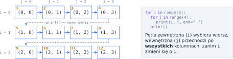
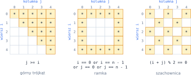
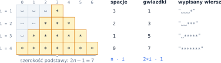

# Rozdział 8: Pętle zagnieżdżone — wprowadzenie

## Czego się nauczysz

* umieszczać jedną pętlę wewnątrz drugiej i przewidywać, w jakiej kolejności się wykonują,
* rysować figury ze znaków **wiersz po wierszu** (`print(…, end="")` i `print()`),
* uzależniać pętlę wewnętrzną od numeru wiersza i wypisywany znak od pary $(i, j)$,
* liczyć, ile razy wykona się wnętrze pętli zagnieżdżonych.

## Pętla w pętli

Ciało pętli może zawierać dowolne instrukcje — także drugą pętlę. Mówimy wtedy o pętli
**zewnętrznej** i **wewnętrznej**. Najważniejsza zasada: przy **każdym** obrocie pętli zewnętrznej
pętla wewnętrzna wykonuje się **od początku do końca**.

```python
for i in range(3):
    for j in range(4):
        print(i, j, end="  ")
    print()
```

```
0 0  0 1  0 2  0 3
1 0  1 1  1 2  1 3
2 0  2 1  2 2  2 3
```

Pary $(i, j)$ najlepiej wyobrazić sobie jako pola tabeli: `i` to numer wiersza, `j` — numer
kolumny. Program odwiedza je wiersz po wierszu, od lewej do prawej:



Zwróć uwagę na dwa różne `print`:

* `print(x, end="")` wypisuje `x`, ale **nie przechodzi** do nowej linii (domyślnie `end="\n"`),
  więc kolejne znaki trafiają do tego samego wiersza,
* samo `print()` stoi **po** pętli wewnętrznej, ale wewnątrz zewnętrznej — kończy bieżący wiersz.
  Wcięcie decyduje o tym, czy `print()` wykona się raz na wiersz, raz na pole, czy raz na cały program.

Jeśli pętla zewnętrzna ma $n$ obrotów, a wewnętrzna $m$, to wnętrze wykona się

$$m + m + \ldots + m = n \cdot m$$

razy (po $m$ obrotów wewnętrznej pętli dla każdego z $n$ wierszy). Dla $n = m$ to $n^2$ — mówimy, że program ma złożoność $O(n^2)$: dwa razy większe $n$
oznacza około cztery razy więcej pracy.

> **Wskazówka:** zanim zaczniesz pisać kod figury, narysuj ją na kratkowanym papierze
> i podpisz wiersze ($i$) oraz kolumny ($j$). Kod jest wtedy tylko przepisaniem tego, co widać.

## Wiersz zależny od numeru wiersza

Pętla wewnętrzna nie musi mieć zawsze tej samej długości. Gdy jej zakres zależy od `i`, każdy wiersz
może mieć inną liczbę znaków:

```python
n = 4
for i in range(1, n + 1):
    for j in range(1, i + 1):   # w wierszu i: liczby od 1 do i
        print(j, end=" ")
    print()
```

```
1
1 2
1 2 3
1 2 3 4
```

Teraz wnętrze wykonuje się $1 + 2 + \ldots + n$ razy, czyli

$$\sum_{i=1}^{n} i = \frac{n(n+1)}{2} \qquad \text{(dla } n = 4\text{: } \frac{4 \cdot 5}{2} = 10\text{)}.$$

Przy rysowaniu figur dobrze jest zrobić tabelkę: numer wiersza $i$ → ile spacji, ile znaków.
Szukasz wzoru, który dla każdego $i$ daje właściwą liczbę — zwykle jest to coś w rodzaju $i$,
$n - i$, $n - i + 1$ albo $2i - 1$. Sprawdź wzór na pierwszym i ostatnim wierszu.

> **Ciekawostka:** napis można powielić mnożeniem: `"*" * 3` to `"***"`, a `" " * 0` to pusty
> napis `""`. Zamiast pętli wewnętrznej wystarczy wtedy `print(" " * a + "*" * b)`. Warto jednak
> umieć zapisać to pętlą — w trudniejszych figurach znak zależy od pozycji i mnożenie napisu nie wystarczy.

## Znak zależny od pozycji $(i, j)$

Wiele figur najprościej opisać **warunkiem** na współrzędnych pola: pętle przechodzą po całym
kwadracie $n \times n$, a dla każdego pola `if` decyduje, czy wypisać znak, czy spację.



Przydatne „mapy” kwadratu $n \times n$ (indeksy od $0$ do $n - 1$):

| Warunek | Które pola |
|---|---|
| $j = i$ | przekątna z lewego górnego do prawego dolnego rogu |
| $i + j = n - 1$ | druga przekątna (z prawego górnego do lewego dolnego rogu) |
| $j > i$ / $j < i$ | pola nad / pod przekątną |
| $i = 0$, $i = n - 1$ | pierwszy / ostatni wiersz |
| $(i + j) \bmod 2 = 0$ | „białe” pola szachownicy |

Na przykład ramkę z rysunku wypisuje taki program (wnętrze ramki zaznaczamy kropkami, żeby było
je widać):

```python
n = int(input())
for i in range(n):
    for j in range(n):
        if i == 0 or i == n - 1 or j == 0 or j == n - 1:
            print("#", end="")
        else:
            print(".", end="")
    print()
```

Dla `n = 5` wypisze `#####`, trzy wiersze `#...#` i znów `#####`.

> **Uwaga:** instrukcja `break` w pętli wewnętrznej przerywa **tylko tę pętlę** — zewnętrzna
> działa dalej.

Poniżej `break` kończy wiersz wcześniej, ale `print()` i kolejne wiersze wykonują się normalnie:

```python
for i in range(1, 4):
    for j in range(1, 4):
        if j > i:
            break               # przerywa tylko pętlę po j
        print(i * j, end=" ")
    print()                     # to wykonuje się zawsze
```

Wynik: `1`, `2 4`, `3 6 9` — każdy w osobnej linii.

Ten sam schemat — pętla zewnętrzna po kandydatach, wewnętrzna sprawdza jakąś własność i przerywa,
gdy wynik jest już przesądzony — przyda się przy szukaniu liczb o szczególnych własnościach.

## Przykład rozwiązany: piramida

**Zadanie.** Wczytaj $n$ i wypisz wyśrodkowaną piramidę z gwiazdek o wysokości $n$: w górnym
wierszu jest 1 gwiazdka, w każdym kolejnym o 2 więcej, a podstawa zaczyna się przy lewym brzegu.

**Analiza.** Rysujemy piramidę dla $n = 4$ na kratkach i dla każdego wiersza liczymy spacje
z lewej oraz gwiazdki:



Z tabeli odczytujemy wzory: w wierszu $i$ (od $1$ do $n$) jest $n - i$ spacji i $2i - 1$
gwiazdek. Sprawdzenie na brzegach: dla $i = 1$ mamy $n - 1$ spacji i $1$ gwiazdkę, dla $i = n$ mamy
$0$ spacji i $2n - 1$ gwiazdek, czyli tyle, ile szeroka jest podstawa. Spacji **po** gwiazdkach nie
wypisujemy wcale. Program potrzebuje więc w każdym wierszu dwóch pętli wewnętrznych, jednej po drugiej:

```python
n = int(input())
for i in range(1, n + 1):
    for _ in range(n - i):          # spacje z lewej
        print(" ", end="")
    for _ in range(2 * i - 1):      # gwiazdki
        print("*", end="")
    print()                         # koniec wiersza
```

Zmienna `_` to zwyczajowa nazwa licznika, którego wartość nie jest potrzebna — liczy się tylko
liczba obrotów.

**Sprawdzenie.** Dla `n = 4`:

| `i` | `n - i` (spacje) | `2*i - 1` (gwiazdki) | Wypisany wiersz |
|---|---|---|---|
| 1 | 3 | 1 | `␣␣␣*` |
| 2 | 2 | 3 | `␣␣***` |
| 3 | 1 | 5 | `␣*****` |
| 4 | 0 | 7 | `*******` |

Znak `␣` oznacza tu spację.

Łącznie program wypisze $\sum_{i=1}^{n} (2i - 1) = n^2$ gwiazdek — dla $n = 4$ to $1 + 3 + 5 + 7 = 16$.
To nie przypadek: $(2i - 1)$ to dokładnie tyle pól, ile trzeba dołożyć (w kształcie litery L)
do kwadratu $(i-1) \times (i-1)$, żeby powstał kwadrat $i \times i$, bo $i^2 - (i-1)^2 = 2i - 1$.

## Typowe błędy

* **`print()` z niewłaściwym wcięciem.** Wcięte o jeden poziom za głęboko trafia do pętli
  wewnętrznej (każdy znak w osobnej linii); za płytko — wykona się tylko raz, na samym końcu.
* **Zapomniane `end=""`.** Każdy znak ląduje w nowej linii. Pamiętaj też, że `print("*", "*")`
  wstawia między argumenty spację.
* **Pomylone `i` z `j`.** Ustal raz na zawsze: `i` — wiersz (pętla zewnętrzna), `j` — kolumna
  (pętla wewnętrzna) — i nazywaj tak zmienne w każdym programie.
* **Błąd o jeden w zakresie.** `range(1, n)` daje $n - 1$ obrotów. Sprawdź swój wzór na pierwszym
  i ostatnim wierszu, a cały program na najmniejszym dozwolonym $n$.
* **Ta sama nazwa licznika w obu pętlach** (`for i …: for i …:`) — pętla wewnętrzna nadpisuje
  licznik zewnętrznej i wynik jest bez sensu.
* **Spacje na końcu wierszy w figurach.** Zwykle nie są potrzebne; wypisuj tylko spacje stojące
  **przed** znakami i między nimi.
