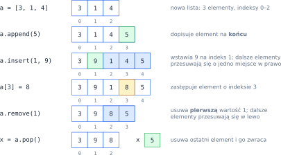
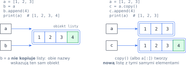
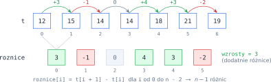

# Rozdział 9: Listy — wprowadzenie

## Czego się nauczysz

* przechowywać wiele wartości w jednej zmiennej — **liście** — i sięgać do nich przez **indeksy**,
* wczytywać listę z jednej linii i przechodzić po niej pętlą (po wartościach albo po indeksach),
* zmieniać listę: dopisywać, wstawiać, zastępować i usuwać elementy,
* wycinać fragmenty listy i budować nowe listy wyrażeniem listowym,
* rozumieć, że zmienna **wskazuje** listę — i kiedy dwie nazwy oznaczają tę samą listę.

## Lista i indeksy

Lista to uporządkowany ciąg wartości zapisany w nawiasach kwadratowych: `[7, 3, 9, 4, 6]`. Pusta
lista to `[]`, a liczbę elementów podaje funkcja `len`. Każdy element ma swój **indeks** — numer
pozycji liczony **od zera**. Lista o długości $n$ ma więc indeksy $0, 1, \ldots, n - 1$.
Python pozwala też liczyć od końca: indeks $-1$ to ostatni element, $-2$ — przedostatni, czyli

$$\texttt{lista[-k]} \;=\; \texttt{lista[n - k]} \qquad \text{dla } 1 \le k \le n.$$

![Indeksy dodatnie (od początku) i ujemne (od końca) oraz wycinek lista[1:4]](diagramy/svg/09_indeksy.svg)

```python
lista = [7, 3, 9, 4, 6]
print(len(lista), lista[0], lista[-1], lista[1:4])   # 5 7 6 [3, 9, 4]
```

**Wycinek** `lista[a:b]` to nowa lista z elementami o indeksach od $a$ do $b - 1$ — ma $b - a$
elementów (indeks `b` **nie** wchodzi). Pominięte `a` oznacza „od początku”, pominięte `b` — „do
końca”, a trzecia liczba to krok: `lista[::2]` to co drugi element, `lista[::-1]` — lista odwrócona.
Wycinek nigdy nie zmienia oryginału. Sięgnięcie po nieistniejący indeks, np. `lista[5]` dla listy
pięcioelementowej, kończy program błędem `IndexError` (wycinek poza zakresem błędu nie zgłasza —
po prostu daje mniej elementów).

## Wczytywanie i przechodzenie po liście

W zadaniach lista przychodzi zwykle w jednej linii, np. `4 -2 0 7 -1`. Metoda `split()` tnie linię
na napisy, a wyrażenie listowe zamienia każdy z nich na liczbę:

```python
n = int(input())
lista = [int(x) for x in input().split()]
```

Po liście przechodzisz pętlą `for` na dwa sposoby:

* `for x in lista:` — po **wartościach**; wygodne, gdy pozycja nie jest potrzebna,
* `for i in range(len(lista)):` — po **indeksach**; potrzebne, gdy liczy się pozycja elementu,
  porównujesz sąsiadów albo chcesz element **zmienić** (`lista[i] = …`).

```python
suma = 0
dodatnie = 0
for x in lista:                 # po wartościach: tylko odczyt
    suma += x
    if x > 0:
        dodatnie += 1
print(suma, dodatnie)           # dla 4 -2 0 7 -1: 8 2

for i in range(len(lista)):     # po indeksach: można zmieniać
    if lista[i] < 0:
        lista[i] = 0
print(lista)                    # [4, 0, 0, 7, 0]
```

Suma i licznik to **akumulatory**: zmienne z wartością początkową ($0$ dla sumy, $1$ dla
iloczynu), aktualizowane w każdym obrocie pętli — po pętli $\texttt{suma} = \sum_{i=0}^{n-1} \texttt{lista[i]}$.

Nową listę z istniejącej najkrócej zbudujesz **wyrażeniem listowym**: `[2 * x for x in lista]`
przekształca każdy element, a `[x for x in lista if x % 2 == 0]` zostawia tylko pasujące.

## Zmienianie listy

Lista — w odróżnieniu od liczby czy napisu — może się zmieniać „w miejscu”. Najważniejsze operacje:

| Operacja | Działanie | Koszt |
|---|---|---|
| `a.append(x)` | dopisuje `x` na końcu | $O(1)$ |
| `a.insert(i, x)` | wstawia `x` pod indeks `i`, dalsze elementy przesuwa w prawo | $O(n)$ |
| `a[i] = x` | zastępuje element o indeksie `i` | $O(1)$ |
| `a.remove(x)` | usuwa **pierwsze** wystąpienie wartości `x` (błąd, gdy go nie ma) | $O(n)$ |
| `a.pop()` / `a.pop(i)` | usuwa i zwraca ostatni element / element o indeksie `i` | $O(1)$ / $O(n)$ |
| `x in a` | `True`, jeśli `x` jest w liście | $O(n)$ |
| `a.index(x)`, `a.count(x)` | indeks pierwszego wystąpienia (błąd, gdy brak) / liczba wystąpień | $O(n)$ |
| `[0] * n` | nowa lista $n$ zer | $O(n)$ |

$O(n)$ oznacza, że czas rośnie z długością listy: wstawienie na początek wymaga przesunięcia
wszystkich elementów o jedno miejsce. Oto ta sama lista po kolejnych operacjach:



## Lista to obiekt, zmienna to strzałka

Zmienna nie „zawiera” listy, tylko **wskazuje** obiekt listy w pamięci. Przypisanie `b = a` nie tworzy
kopii — daje temu samemu obiektowi drugą nazwę. Zmiana wykonana przez `b` jest więc widoczna przez `a`:



Gdy potrzebujesz niezależnej kopii, użyj `a.copy()` albo `a[:]`. To samo dotyczy funkcji: lista
przekazana jako argument to ten sam obiekt, więc `lista.append(…)` wewnątrz funkcji zmienia listę
wywołującego.

> **Zapamiętaj:** `=` nigdy nie kopiuje listy. Wycinek, `copy()`, wyrażenie listowe i `sorted(…)`
> zawsze tworzą **nową** listę; `append`, `insert`, `remove`, `pop`, `sort()` i `a[i] = …` zmieniają
> **istniejącą**.

## Przykład rozwiązany: zmiany temperatury

**Zadanie.** Wczytaj liczbę dni $n \ge 2$ i listę temperatur z kolejnych dni. Wypisz listę zmian
temperatury z dnia na dzień oraz liczbę dni, w których było cieplej niż dzień wcześniej.

**Analiza.** Zmiana między dniem $i$ a $i + 1$ to $d_i = t_{i+1} - t_i$. Z $n$ dni powstaje
$n - 1$ par sąsiednich dni, więc $i$ przebiega $0, 1, \ldots, n - 2$ — w Pythonie `range(n - 1)`.
Gdyby pętla szła do `n - 1` włącznie, `t[i + 1]` wyszłoby poza listę.



```python
n = int(input())
t = [int(x) for x in input().split()]

roznice = []
for i in range(n - 1):
    roznice.append(t[i + 1] - t[i])

wzrosty = 0
for r in roznice:
    if r > 0:
        wzrosty += 1

print(roznice)
print(wzrosty)
```

**Sprawdzenie** dla wejścia `7` i `12 15 14 14 18 21 19`:

| `i` | `t[i]` | `t[i + 1]` | różnica | `wzrosty` po kroku |
|---|---|---|---|---|
| 0 | 12 | 15 | 3 | 1 |
| 1 | 15 | 14 | −1 | 1 |
| 2 | 14 | 14 | 0 | 1 |
| 3 | 14 | 18 | 4 | 2 |
| 4 | 18 | 21 | 3 | 3 |
| 5 | 21 | 19 | −2 | 3 |

Program wypisze `[3, -1, 0, 4, 3, -2]` i `3`. Zauważ, że suma różnic to $t_{n-1} - t_0 = 19 - 12 = 7$
(wyrazy „skracają się” parami) — dobry test, czy różnice są policzone poprawnie.

## Typowe błędy

* **Błąd o jeden.** Ostatni indeks to `len(lista) - 1`, a nie `len(lista)`. Gdy w pętli sięgasz
  po `lista[i + 1]`, pętla musi kończyć się o jeden obrót wcześniej.
* **`lista = lista.append(x)`.** Metody zmieniające listę zwracają `None` — po takim przypisaniu
  zmienna nie wskazuje już listy. Pisz po prostu `lista.append(x)`.
* **Zmiana zmiennej pętli zamiast elementu.** W `for x in lista: x = 0` zmienia się tylko `x`,
  lista zostaje bez zmian. Do modyfikacji użyj indeksów: `lista[i] = 0`.
* **Usuwanie elementów podczas przechodzenia pętlą `for`.** Po usunięciu elementy przesuwają się
  w lewo i pętla „przeskakuje” następny element: dla `[2, 2, 3]` usuwanie każdej dwójki w pętli
  zostawi `[2, 3]`. Bezpieczniej zbudować nową listę z elementów, które mają zostać.
* **Zapomniane `int`.** `input().split()` daje listę **napisów**: `"10" < "9"` jest prawdą, bo napisy
  porównuje się znak po znaku.
