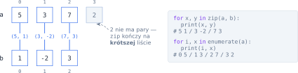
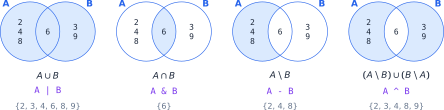

# Rozdział 10: Dwie listy i zbiory — wprowadzenie

## Czego się nauczysz

* przechodzić jednocześnie po dwóch listach — także o różnych długościach,
* łączyć elementy w pary funkcją `zip` i numerować je funkcją `enumerate`,
* korzystać z **dwóch wskaźników**, gdy obie listy są posortowane,
* używać **zbiorów** (`set`) i działań $\cup$, $\cap$, $\setminus$ do porównywania kolekcji.

## Wspólny indeks

Najprostszy sposób pracy na dwóch listach to jeden indeks `i`, którym sięgasz do obu: `a[i]` i `b[i]`.
Trzeba tylko uważać, żeby indeks istniał w **obu** listach — pętla idzie więc do długości krótszej
z nich, a resztę dłuższej listy obsługujesz osobno:

```python
a = [4, 8, 1, 6]
b = [5, 2, 3]
k = min(len(a), len(b))       # tyle par indeksów istnieje w obu listach
wieksze = 0
for i in range(k):
    if a[i] > b[i]:
        wieksze += 1
print(wieksze)                # 1  (tylko 8 > 2)
print(a[k:], b[k:])           # [6] []  — reszta dłuższej listy
print(a + b)                  # [4, 8, 1, 6, 5, 2, 3]
```

Operator `+` skleja dwie listy w **nową** listę; `a.extend(b)` dokleja elementy `b` do istniejącej
listy `a`. Wycinek `a[k:]` dla `k` równego długości listy daje po prostu pustą listę — nie trzeba
sprawdzać, która lista jest dłuższa.

## `zip` i `enumerate`

Gdy potrzebujesz par elementów o tych samych indeksach, a nie samych indeksów, użyj `zip`. Dla
list $a = [a_0, a_1, \ldots]$ i $b = [b_0, b_1, \ldots]$ daje on kolejne pary
$(a_0, b_0), (a_1, b_1), \ldots$ — dokładnie $\min(|a|, |b|)$ par:



`enumerate(lista)` daje pary (indeks, element), a `enumerate(lista, start=1)` numeruje od 1. Oba działają
też na napisach, bo napis to ciąg znaków: `zip("kot", "koc")` daje pary `('k', 'k')`, `('o', 'o')`,
`('t', 'c')`. Zapis `for x, y in …` od razu „rozpakowuje” każdą parę do dwóch zmiennych.

> **Pułapka:** `zip` **po cichu** pomija nadmiarowe elementy dłuższej listy. Jeśli zadanie ich
> wymaga, dopisz je osobno (np. wycinkiem, jak w poprzedniej sekcji).

Sprawdzenie, czy element jednej listy występuje w drugiej, to `x in b`. Dla listy Python przegląda
ją element po elemencie, więc dla każdego z $n$ elementów listy `a` wykonuje do $m$ porównań —
razem $O(n \cdot m)$. Przy dużych listach to wolno; zbiory (niżej) robią to samo prawie natychmiast.

## Zbiory

**Zbiór** (`set`) to kolekcja, w której każda wartość występuje **co najwyżej raz** i która **nie
pamięta kolejności**. Tworzysz go z listy funkcją `set(…)` albo zapisem `{3, 6, 9}` (uwaga: `{}`
to nie pusty zbiór, tylko pusty słownik — pusty zbiór to `set()`). Sprawdzenie `x in zbior` działa
w czasie $O(1)$, niezależnie od rozmiaru zbioru.

Działania na zbiorach odpowiadają tym z matematyki:

$$A \cup B = \{x : x \in A \lor x \in B\} \qquad A \cap B = \{x : x \in A \land x \in B\} \qquad A \setminus B = \{x : x \in A \land x \notin B\}$$



| Matematyka | Python | Znaczenie |
|---|---|---|
| $A \cup B$ | `A \| B` | suma: elementy z $A$ lub z $B$ |
| $A \cap B$ | `A & B` | część wspólna: elementy z $A$ i z $B$ |
| $A \setminus B$ | `A - B` | różnica: elementy $A$, których nie ma w $B$ |
| $(A \setminus B) \cup (B \setminus A)$ | `A ^ B` | różnica symetryczna: dokładnie w jednym ze zbiorów |
| $A \subseteq B$ | `A <= B` | czy każdy element $A$ jest w $B$ |
| $x \in A$, $\lvert A \rvert$ | `x in A`, `len(A)` | przynależność, liczba elementów |

```python
A = set([2, 4, 6, 8, 4])      # powtórzona 4 znika
B = {3, 6, 9}
print(sorted(A | B))          # [2, 3, 4, 6, 8, 9]
print(sorted(A & B))          # [6]
print(sorted(A - B))          # [2, 4, 8]
print(sorted(A ^ B))          # [2, 3, 4, 8, 9]
print(6 in A, A <= B, len(A)) # True False 4
```

Ponieważ zbiór nie ma kolejności, przed wypisaniem zamień go na posortowaną listę: `sorted(zbior)`.
Przydatny jest też wzór włączeń i wyłączeń: $|A \cup B| = |A| + |B| - |A \cap B|$ — tu
$6 = 4 + 3 - 1$.

> **Uwaga:** zbiór gubi **kolejność** i **powtórzenia**. Jeśli zadanie wymaga zachowania kolejności
> z listy wejściowej, przejdź pętlą po liście, a zbioru użyj tylko do szybkiego sprawdzania `in`.

## Przykład rozwiązany: najbliższa para

**Zadanie.** Wczytaj dwie listy liczb całkowitych, każdą posortowaną rosnąco. Wybierz po jednej
liczbie z każdej listy tak, aby różnica między nimi była jak najmniejsza, i wypisz tę różnicę.

**Analiza.** Można sprawdzić wszystkie pary dwiema zagnieżdżonymi pętlami — to $n \cdot m$ par.
Posortowanie list pozwala zrobić to szybciej, **dwoma wskaźnikami**: `i` wskazuje bieżący element
listy `a`, `j` — listy `b`. W każdym kroku liczymy różnicę bieżącej pary i przesuwamy wskaźnik
stojący przy **mniejszej** liczbie. Dlaczego wolno? Jeśli $a_i < b_j$, to dla każdego dalszego
$b_k$ (czyli $k \ge j$) mamy $b_k \ge b_j > a_i$, więc

$$|a_i - b_k| = b_k - a_i \ge b_j - a_i = |a_i - b_j|.$$

Element $a_i$ nie utworzy już lepszej pary — można go pominąć. Tak samo, gdy mniejsze jest $b_j$.

![Kolejne kroki dla a = [1, 7, 12] i b = [4, 9, 13]](diagramy/svg/10_wskazniki.svg)

```python
a = [int(x) for x in input().split()]
b = [int(x) for x in input().split()]

i, j = 0, 0
najlepsza = abs(a[0] - b[0])
while i < len(a) and j < len(b):
    roznica = abs(a[i] - b[j])
    if roznica < najlepsza:
        najlepsza = roznica
    if a[i] < b[j]:
        i += 1            # a[i] nie da już lepszej pary
    else:
        j += 1            # b[j] nie da już lepszej pary
print(najlepsza)
```

**Sprawdzenie.** Dla wejścia `1 7 12` i `4 9 13` program przechodzi przez pary
$(1, 4), (7, 4), (7, 9), (12, 9), (12, 13)$ i wypisuje `1` (para $12, 13$). W każdym kroku jeden
wskaźnik idzie naprzód, więc kroków jest najwyżej $n + m$ — złożoność $O(n + m)$ zamiast $O(n \cdot m)$.
Dla list po $1000$ elementów to około $2000$ kroków zamiast miliona.

Ten sam schemat — dwa wskaźniki idące po posortowanych listach i przesuwanie tego przy mniejszym
elemencie — przyda się wszędzie tam, gdzie łączysz albo porównujesz dwie posortowane listy.

## Typowe błędy

* **Indeks spoza krótszej listy.** Pętla `for i in range(len(a))` sięga po `b[i]`, którego może nie
  być. Ograniczaj pętlę do `min(len(a), len(b))` albo używaj `zip`.
* **Zgubiona reszta dłuższej listy** po `zip` lub po pętli z dwoma wskaźnikami — zawsze zadaj sobie
  pytanie, co stanie się z elementami, które zostały.
* **Wypisywanie zbioru bez sortowania.** Kolejność elementów zbioru nie jest określona; użyj `sorted`.
* **`{}` jako pusty zbiór** — to pusty słownik. Pusty zbiór to `set()`.
* **Zbiór tam, gdzie liczą się powtórzenia lub kolejność.** `set([3, 1, 3])` to $\{1, 3\}$ — informacja,
  że 3 wystąpiło dwa razy i było pierwsze, przepada.
* **Pętla `while` z dwoma wskaźnikami bez warunku na obie listy.** Warunek musi brzmieć
  `i < len(a) and j < len(b)` — inaczej któryś indeks wyjdzie poza listę.
