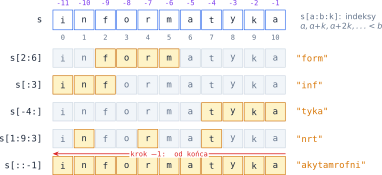
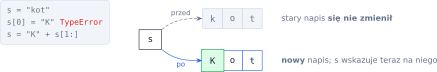
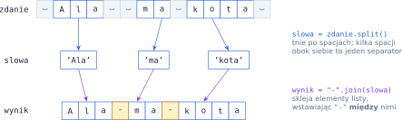
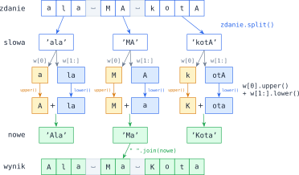

# Rozdział 11: Napisy — wprowadzenie

## Czego się nauczysz

* traktować napis jak ciąg znaków: indeksować go, przechodzić po nim pętlą i wycinać fragmenty,
* rozumieć, że napisy są **niezmienne** — każda „zmiana” tworzy nowy napis,
* korzystać z najważniejszych metod napisów (`upper`, `replace`, `count`, `strip`, …) oraz `ord` i `chr`,
* dzielić zdanie na słowa metodą `split` i sklejać części metodą `join`.

## Napis jako ciąg znaków

Napis (`str`) to ciąg znaków — liter, cyfr, spacji, znaków interpunkcyjnych. Działa na nim prawie
wszystko, co znasz z list: `len(s)` to liczba znaków, `s[i]` to znak o indeksie `i` (od zera,
ujemne liczą od końca), `for znak in s:` przechodzi po kolejnych znakach, a `"ma" in s` sprawdza,
czy `"ma"` jest **fragmentem** napisu.

**Wycinek** `s[a:b:k]` bierze znaki o indeksach $a, a + k, a + 2k, \ldots$ mniejszych od $b$.
Dla dodatniego kroku ma on

$$\left\lceil \frac{b - a}{k} \right\rceil \text{ znaków (gdy } a < b\text{)},$$

np. `s[1:9:3]` ma $\lceil 8/3 \rceil = 3$ znaki. Pominięte `a` i `b` oznaczają „od początku” i „do
końca”, a ujemny krok idzie od końca — stąd `s[::-1]` to napis odwrócony.



Pozycje liczone „po ludzku” (od 1) przelicza się na indeksy, odejmując 1: $k$-ty znak napisu to
`s[k - 1]`, a znaki na pozycjach $k, 2k, 3k, \ldots$ mają indeksy $k - 1, 2k - 1, \ldots$

## Napisy są niezmienne

Listy można zmieniać w miejscu, napisów — **nie**. Przypisanie `s[0] = "K"` kończy się błędem
`TypeError`. Zamiast zmieniać napis, budujesz **nowy** i przypisujesz go do zmiennej:



Dlatego każda metoda „zmieniająca” napis w rzeczywistości **zwraca nowy napis**, a oryginał zostaje
bez zmian. Samo `s.upper()` nic nie da — trzeba zapisać wynik: `s = s.upper()`.

Nowy napis często buduje się w pętli, doklejając kolejne kawałki operatorem `+` (a `*` powiela napis):

```python
wynik = ""
for znak in "kot":
    wynik += znak * 2
print(wynik)          # kkoott
```

## Najważniejsze metody i funkcje

| Wyrażenie (dla `t = "Ala ma kota"`) | Wynik | Działanie |
|---|---|---|
| `t.upper()`, `t.lower()` | `'ALA MA KOTA'`, `'ala ma kota'` | wielkie / małe litery (także `ą` → `Ą`) |
| `t.replace("a", "*")` | `'Al* m* kot*'` | zamienia **każde** wystąpienie fragmentu |
| `t.count("a")` | `3` | liczba wystąpień (wielkość liter ma znaczenie) |
| `t.find("ma")` | `4` | indeks pierwszego wystąpienia albo `-1` |
| `"  kot  ".strip()` | `'kot'` | usuwa spacje z obu brzegów |
| `"kota,".strip(string.punctuation)` | `'kota'` | usuwa z brzegów podane znaki |
| `"7".isdigit()`, `"ż".isalpha()` | `True`, `True` | czy same cyfry / same litery |
| `ord("a")`, `chr(65)` | `97`, `'A'` | kod znaku / znak o danym kodzie |

(`string.punctuation` to napis ze wszystkimi znakami interpunkcyjnymi ASCII; wymaga `import string`.)

Kody liter `a`–`z` są **kolejnymi** liczbami ($97, 98, \ldots, 122$), podobnie `A`–`Z`
($65, \ldots, 90$). Dzięki temu numer małej litery w alfabecie to `ord(znak) - ord("a")`, a napisy
porównuje się „słownikowo”, znak po znaku według kodów: `"a" < "b"`, ale też `"Z" < "a"`, bo
$90 < 97$.

## Słowa: `split` i `join`

`zdanie.split()` (bez argumentu) tnie napis po **białych znakach** i zwraca listę słów —
kilka spacji obok siebie, a także spacje na brzegach, nie tworzą pustych słów. `separator.join(lista)`
działa odwrotnie: skleja listę napisów, wstawiając separator **między** elementami.



Z argumentem `split` tnie dokładnie po podanym napisie, więc puste kawałki **zostają**:
`"a;b;;c;".split(";")` daje `['a', 'b', '', 'c', '']`. Interpunkcję przyklejoną do słów usuniesz
z brzegów każdego słowa metodą `strip(string.punctuation)`.

> **Pamiętaj:** `join` skleja wyłącznie napisy. Listę liczb trzeba najpierw zamienić na napisy,
> inaczej Python zgłosi `TypeError`.

## Przykład rozwiązany: wielkie litery na początku słów

**Zadanie.** Wczytaj zdanie i wypisz je tak, aby każde słowo zaczynało się wielką literą, a pozostałe
litery słowa były małe. Słowa w wyniku oddziel pojedynczymi spacjami.

**Analiza.** Problem rozpada się na trzy kroki: (1) podziel zdanie na słowa — `split()`, który przy
okazji pozbędzie się nadmiarowych spacji; (2) każde słowo `w` zamień na `w[0].upper() + w[1:].lower()`;
(3) sklej nowe słowa spacjami — `" ".join(…)`. Ponieważ napisy są niezmienne, nowe słowa zbieramy
w nowej liście.



```python
zdanie = input()
nowe = []
for w in zdanie.split():
    nowe.append(w[0].upper() + w[1:].lower())
print(" ".join(nowe))
```

**Sprawdzenie.** Dla wejścia `ala MA kotA`:

| `w` | `w[0].upper()` | `w[1:].lower()` | nowe słowo |
|---|---|---|---|
| `'ala'` | `'A'` | `'la'` | `'Ala'` |
| `'MA'` | `'M'` | `'a'` | `'Ma'` |
| `'kotA'` | `'K'` | `'ota'` | `'Kota'` |

Wynik: `Ala Ma Kota`. Przypadki brzegowe też działają: dla słowa jednoliterowego `w[1:]` jest pustym
napisem (wycinek poza zakresem nie zgłasza błędu), a dla wejścia `"  a   żÓŁW "` program wypisze
`A Żółw` — polskie litery `upper` i `lower` obsługują poprawnie.

> **Ciekawostka:** Python ma gotową metodę `title()`, ale traktuje każdy znak niebędący literą jako
> początek nowego słowa: `"żółw-ninja".title()` daje `'Żółw-Ninja'`. Własna pętla daje pełną kontrolę
> nad tym, co uznajesz za słowo.

## Typowe błędy

* **Próba zmiany znaku** `s[i] = …` — napisy są niezmienne. Zbuduj nowy napis (wycinki, `+`, `replace`)
  albo zamień napis na listę znaków `list(s)`, zmień ją i sklej z powrotem `"".join(…)`.
* **Wywołanie metody bez zapisania wyniku**: `s.replace("a", "?")` nie zmienia `s`. Pisz
  `s = s.replace("a", "?")`.
* **`split(" ")` zamiast `split()`.** Z argumentem `" "` każda dodatkowa spacja daje pusty napis
  w liście; `split()` bez argumentu je pomija.
* **Pozycja od 1 a indeks od 0.** „Trzeci znak” to `s[2]`; pomyłka o jeden przesuwa cały wynik.
* **`join` na liście liczb** — `"".join([1, 2])` to błąd; najpierw zamień liczby na napisy.
