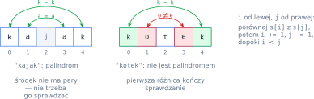
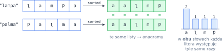
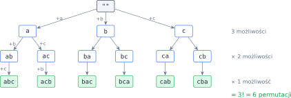
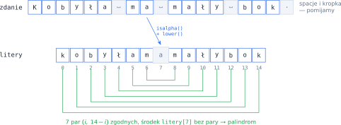

# Rozdział 12: Anagramy i palindromy — wprowadzenie

## Czego się nauczysz

* sprawdzać, czy napis jest **palindromem** — odwracając go albo porównując znaki z obu końców,
* sprawdzać, czy dwa słowa są **anagramami** — przez sortowanie liter albo zliczanie ich wystąpień,
* liczyć i generować **permutacje** liter słowa (`itertools.permutations`),
* przygotowywać napis do porównań: ujednolicać wielkość liter i pomijać znaki, które się nie liczą.

## Palindromy

**Palindrom** to napis, który czytany od końca jest taki sam: `kajak`, `oko`, `potop`. Dla napisu
$s = s_0 s_1 \ldots s_{n-1}$ oznacza to, że każdy znak jest równy swojemu „lustrzanemu odbiciu”:

$$s_i = s_{n-1-i} \qquad \text{dla każdego } i = 0, 1, \ldots, n - 1.$$

Wystarczy sprawdzić pierwszą połowę — par do porównania jest $\lfloor n/2 \rfloor$, a środkowy
znak słowa o nieparzystej długości nie ma pary.



W Pythonie najkrócej porównać napis z jego odwróceniem `s[::-1]`. Ponieważ `"K"` i `"k"` to różne
znaki, najpierw ujednolij wielkość liter: `"Kajak"[::-1]` to `"kajaK"`, ale po `lower()` oba napisy
to `"kajak"`.

Odwracanie zawsze buduje cały nowy napis. Porównywanie „z dwóch końców” (indeks `i` od lewej, `j` od
prawej) może się zakończyć już przy pierwszej różnicy — tak działa przykład rozwiązany na końcu rozdziału.

## Anagramy

Dwa słowa są **anagramami**, jeśli składają się z tych samych liter, w tej samej liczbie, tylko w innej
kolejności: `lampa` i `palma`, `ramka` i `marka`. Są dwa naturalne sposoby sprawdzania:

1. **Posortuj litery** obu słów i porównaj wyniki. Kolejność przestaje mieć znaczenie, więc anagramy
   dają identyczne listy.
2. **Policz wystąpienia** każdej litery: słowa są anagramami wtedy i tylko wtedy, gdy dla każdej litery
   $c$ liczba wystąpień $c$ w obu słowach jest taka sama.



```python
s1, s2 = "lampa", "palma"
print(sorted(s1) == sorted(s2))   # True
print("".join(sorted(s1)))        # aalmp — „podpis” wspólny dla wszystkich anagramów
for litera in sorted(set(s1)):
    print(litera, s1.count(litera), s2.count(litera))   # a 2 2, l 1 1, m 1 1, p 1 1
```

`sorted(napis)` zwraca **listę** znaków; `"".join(…)` skleja ją z powrotem w napis. Napis z posortowanymi
literami to wygodny „podpis” słowa: wszystkie anagramy mają ten sam podpis. Słowa o różnej długości
nigdy nie są anagramami — to szybki test na początek.

> **Pamiętaj:** przed porównaniem doprowadź oba napisy do tej samej postaci, np. `lower()`, i usuń to,
> czego zadanie nie liczy (spacje, interpunkcję). `"Lampa"` i `"palma"` mają różne posortowane litery,
> dopóki nie zamienisz `L` na `l`.

## Permutacje

**Permutacja** słowa to dowolne ustawienie wszystkich jego liter. Liczbę permutacji słowa o $n$ różnych
literach wyznacza **reguła mnożenia**: na pierwsze miejsce wybierasz jedną z $n$ liter, na drugie —
jedną z $n - 1$ pozostałych i tak dalej:

$$n \cdot (n-1) \cdot \ldots \cdot 2 \cdot 1 = n!$$



Silnia rośnie bardzo szybko: $6! = 720$, ale $10! = 3\,628\,800$. Jeśli litery się powtarzają, część
ustawień jest identyczna. Gdy słowo ma $n$ liter, z czego kolejne litery
powtarzają się $k_1, k_2, \ldots, k_r$ razy, różnych permutacji jest

$$\frac{n!}{k_1! \cdot k_2! \cdot \ldots \cdot k_r!}, \qquad \text{np. dla } \texttt{aab}\text{: } \frac{3!}{2! \cdot 1!} = 3.$$

Permutacje wygeneruje funkcja `permutations` z modułu `itertools`. Zwraca ona **krotki** liter (krotka
to niezmienna lista w nawiasach okrągłych), które sklejasz przez `join`; powtórzenia usuwa zbiór:

```python
from itertools import permutations
print(list(permutations("ab")))                   # [('a', 'b'), ('b', 'a')]
wszystkie = ["".join(p) for p in permutations("aab")]
print(len(wszystkie), sorted(set(wszystkie)))     # 6 ['aab', 'aba', 'baa']
```

## Przykład rozwiązany: zdanie-palindrom

**Zadanie.** Wczytaj zdanie i sprawdź, czy jest palindromem, gdy pominie się wszystko poza literami
i nie rozróżnia wielkości liter. Wypisz `Tak` albo `Nie`. Przykład: `Kobyła ma mały bok.`

**Analiza.** (1) Przejdź po zdaniu i zbierz same litery (`znak.isalpha()`), zamienione na małe.
(2) Sprawdź palindrom dwoma indeksami: `i` startuje z początku, `j` z końca; dopóki `i < j`,
porównuj `litery[i]` z `litery[j]` i przesuwaj indeksy do środka. Pierwsza różnica przesądza
o odpowiedzi `Nie` — dalej nie trzeba sprawdzać.



```python
zdanie = input()
litery = ""
for znak in zdanie:
    if znak.isalpha():
        litery += znak.lower()

i, j = 0, len(litery) - 1
palindrom = True
while i < j:
    if litery[i] != litery[j]:
        palindrom = False
        break
    i += 1
    j -= 1
print("Tak" if palindrom else "Nie")
```

**Sprawdzenie.** Dla `Kobyła ma mały bok.` napis `litery` to `kobyłamamałybok` ($15$ liter). Pętla
porównuje pary $(0, 14), (1, 13), \ldots, (6, 8)$ — wszystkie zgodne — i kończy się, gdy
$i = j = 7$. Wynik: `Tak`. Dla `Ala ma kota`:

| `i` | `j` | `litery[i]` | `litery[j]` | wynik porównania |
|---|---|---|---|---|
| 0 | 8 | `a` | `a` | zgodne, idziemy dalej |
| 1 | 7 | `l` | `t` | różne → `palindrom = False`, `break` |

Wynik: `Nie`. Program wykonuje co najwyżej $\lfloor m/2 \rfloor$ porównań, gdzie $m$ to liczba liter.

## Typowe błędy

* **Pominięta zamiana wielkości liter.** `"Kajak"[::-1]` to `"kajaK"` — bez `lower()` palindrom nie
  zostanie rozpoznany.
* **Interpunkcja przyklejona do słowa.** `"oko."` to nie palindrom, ale `"oko"` — tak. Usuń znaki
  z brzegów słowa (`strip(string.punctuation)`) przed sprawdzeniem.
* **Porównanie list z napisem.** `sorted(s1) == s2` jest zawsze fałszem — `sorted` zwraca listę.
  Porównuj `sorted(s1) == sorted(s2)` albo sklej listę przez `"".join(…)`.
* **Zbiór liter zamiast liczników.** `set("aab") == set("abb")` jest prawdą, choć słowa nie są
  anagramami — zbiór gubi liczbę wystąpień.
* **Generowanie wszystkich permutacji zbyt długiego słowa.** Dla $n = 12$ to prawie pół miliarda
  napisów. Gdy wystarczy sprawdzić własność (np. anagram), nie generuj permutacji.
