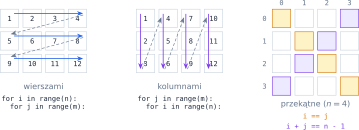
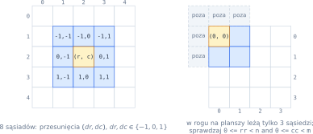
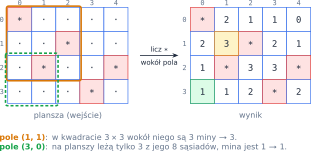

# Rozdział 13: Macierze i przedziały — wprowadzenie

## Czego się nauczysz

* przechowywać tabelę liczb jako **listę list** i sięgać do pola zapisem `A[i][j]`,
* tworzyć, wczytywać i wypisywać macierze,
* przechodzić po macierzy wierszami, kolumnami i po przekątnych,
* odwiedzać **sąsiadów** pola, nie wychodząc poza planszę.

## Macierz jako lista list

**Macierz** o wymiarach $n \times m$ to tabela z $n$ wierszami i $m$ kolumnami. W matematyce element
w wierszu $i$ i kolumnie $j$ zapisuje się $A_{ij}$; w Pythonie macierz to **lista wierszy**, a każdy
wiersz to zwykła lista liczb. `A[i]` to cały wiersz $i$, a `A[i][j]` — jego element o indeksie $j$:
najpierw wybierasz wiersz, potem kolumnę.

![Macierz 3 × 4 jako tabela i jako lista list; wyróżniony wiersz A[1] i element A[1][2]](diagramy/svg/13_macierz.svg)

```python
A = [[5, 1, 8, 2],
     [3, 9, 4, 7],
     [6, 0, 2, 1]]
print(A[1], A[1][2], len(A), len(A[0]))   # [3, 9, 4, 7] 4 3 4
```

Liczba wierszy to `len(A)`, a liczba kolumn — długość dowolnego wiersza, np. `len(A[0])`. Macierz
**kwadratowa** ma $n = m$. Indeksy, jak w każdej liście, liczymy od zera: $0 \le i \le n - 1$,
$0 \le j \le m - 1$.

## Tworzenie, wczytywanie i wypisywanie

Macierz wczytasz wyrażeniem listowym zagnieżdżonym w drugim: zewnętrzne powtarza się $n$ razy
(po jednym razie na wiersz), wewnętrzne zamienia jedną linię wejścia na listę liczb. Pustą macierz
(np. samych zer) tworzysz tak samo — każdy obrót zewnętrznego wyrażenia buduje **nową** listę-wiersz:

```python
n, m = [int(x) for x in input().split()]
A = [[int(x) for x in input().split()] for _ in range(n)]

Z = [[0] * m for _ in range(n)]     # n wierszy po m zer, każdy osobną listą
Z[0][1] = 7
print(Z)                            # [[0, 7, 0], [0, 0, 0]]

for wiersz in A:
    print(*wiersz)                  # elementy wiersza oddzielone spacją
```

`print(*wiersz)` „rozpakowuje” listę: wypisuje jej elementy jako osobne argumenty, czyli oddzielone
spacjami. To samo da `print(" ".join(str(x) for x in wiersz))`. Pole planszy złożonej ze znaków
(np. `#` i `.`) odczytasz wprost z napisu: wczytane linie tworzą listę napisów, a `plansza[r][c]` to
znak w wierszu `r` i kolumnie `c`. Gdy pola trzeba zmieniać, zamień linię na listę znaków: `list(input())`.

Macierz o dwóch kolumnach to też wygodny sposób przechowywania **par**, np. przedziałów $[a, b]$
jako listy `[[23, 67], [10, 22], [23, 53]]`. Funkcja `sorted` porządkuje taką listę list
„słownikowo”: najpierw według pierwszych elementów, a przy remisie według drugich —
`[[10, 22], [23, 53], [23, 67]]`.

> **Pamiętaj:** wiersze muszą być **osobnymi** obiektami. Przypomnij sobie z rozdziału 9, że `=`
> nie kopiuje listy — jeśli dwa wiersze to ten sam obiekt, zmiana jednego pola „pojawi się” w obu.

## Przechodzenie po macierzy

Dwie zagnieżdżone pętle odwiedzają wszystkie $n \cdot m$ pól. Kolejność zależy od tego, która pętla
jest zewnętrzna: `i` na zewnątrz — **wierszami**, `j` na zewnątrz — **kolumnami**.



```python
n, m = len(A), len(A[0])
najwieksze = []
for j in range(m):                  # kolumnami: dla każdej kolumny…
    mx = A[0][j]
    for i in range(1, n):           # …przejdź po jej wierszach
        if A[i][j] > mx:
            mx = A[i][j]
    najwieksze.append(mx)
print(najwieksze)                   # [6, 9, 8, 7] dla macierzy z rysunku 13.1
```

W macierzy kwadratowej $n \times n$ wyróżnia się dwie przekątne. **Główna** to pola, w których
$i = j$; **druga** (z prawego górnego do lewego dolnego rogu) — pola, w których $i + j = n - 1$, czyli
$j = n - 1 - i$. Po każdej z nich wystarczy jedna pętla, np. suma elementów drugiej przekątnej to

$$\sum_{i=0}^{n-1} A_{i,\,n-1-i}.$$

Inna ważna operacja to **transpozycja** — zamiana wierszy z kolumnami. Macierz transponowana $A^T$
ma wymiary $m \times n$, a jej elementy to $A^T_{ji} = A_{ij}$: pierwszy wiersz $A^T$ to pierwsza
kolumna $A$ itd.

## Sąsiedzi pola

W grach planszowych i symulacjach często trzeba obejrzeć pola stykające się z polem $(r, c)$. Ich
współrzędne to $(r + dr,\; c + dc)$, gdzie przesunięcia $dr, dc \in \{-1, 0, 1\}$: wszystkie
$3 \cdot 3 - 1 = 8$ kombinacji poza $(0, 0)$ (sąsiedzi „po rogach” i „po bokach”). Jeśli liczą się
tylko sąsiedzi po bokach, zostają cztery: $(-1, 0), (1, 0), (0, -1), (0, 1)$.



Przy brzegu planszy część sąsiadów nie istnieje. Każdego kandydata trzeba więc sprawdzić warunkiem

$$0 \le r + dr < n \quad \land \quad 0 \le c + dc < m.$$

> **Pułapka:** indeks `-1` nie zgłasza błędu — w Pythonie oznacza **ostatni** element. Bez sprawdzenia
> zakresu pole w lewym górnym rogu „widziałoby” jako sąsiadów pola z prawego i dolnego brzegu planszy.

## Przykład rozwiązany: saper

**Zadanie.** Wczytaj wymiary `n m` i planszę gry w sapera: `n` linii po `m` znaków, gdzie `*` to mina,
a `.` — puste pole. Wypisz planszę, w której każde puste pole zastąpiono liczbą min wśród jego
(maksymalnie ośmiu) sąsiadów. Miny pozostają gwiazdkami.

**Analiza.** Dla każdego pola $(r, c)$ — dwie pętle po planszy — sprawdzamy, czy to mina. Jeśli nie,
przeglądamy kwadrat $3 \times 3$ wokół niego (dwie kolejne pętle po $dr$ i $dc$ od $-1$ do $1$)
i liczymy gwiazdki, pomijając pola spoza planszy. Środek kwadratu to samo pole $(r, c)$, ale nie jest
miną, więc nie zaburza wyniku. Wynikowy wiersz budujemy jako napis i wypisujemy po zakończeniu wiersza.



```python
n, m = [int(x) for x in input().split()]
plansza = [input() for _ in range(n)]

for r in range(n):
    wiersz = ""
    for c in range(m):
        if plansza[r][c] == "*":
            wiersz += "*"
        else:
            miny = 0
            for dr in range(-1, 2):
                for dc in range(-1, 2):
                    rr, cc = r + dr, c + dc
                    if 0 <= rr < n and 0 <= cc < m and plansza[rr][cc] == "*":
                        miny += 1
            wiersz += str(miny)
    print(wiersz)
```

**Sprawdzenie.** Dla planszy z rysunku (`4 5`, potem `*....`, `..*..`, `.*..*`, `...*.`) program
wypisze `*2110`, `23*21`, `1*33*`, `112*2`. Pole $(1, 1)$: wśród sąsiadów $(0, 0)$, $(1, 2)$ i $(2, 1)$
to miny — wynik `3`. Pole $(3, 0)$ leży w rogu: z ośmiu kandydatów na planszy są tylko $(2, 0)$,
$(2, 1)$ i $(3, 1)$, mina jest jedna — wynik `1`. Kolejność warunków w `if` ma znaczenie: `plansza[rr][cc]`
jest sprawdzane dopiero wtedy, gdy wiadomo, że indeksy mieszczą się w planszy.

Program wykonuje dla każdego z $n \cdot m$ pól co najwyżej $9$ sprawdzeń, więc działa w czasie
$O(n \cdot m)$.

## Typowe błędy

* **Pomylona kolejność indeksów.** `A[i][j]` to wiersz `i`, kolumna `j`. Zapis `A[j][i]` dla macierzy
  niekwadratowej szybko kończy się `IndexError`.
* **`len(A)` jako liczba kolumn.** To liczba **wierszy**; kolumn jest `len(A[0])`.
* **Wiersze będące tym samym obiektem.** Gdy zmiana jednego pola zmienia całą kolumnę, sprawdź, jak
  powstała macierz — każdy wiersz musi być osobną listą.
* **Brak sprawdzenia granic** przy sąsiadach albo poleganie na indeksie `-1` jako „poza planszą”.
* **Zmienianie macierzy w trakcie jej przeglądania**, gdy nowe wartości zależą od starych. Wyniki
  zapisuj do **nowej** macierzy (albo, jak w przykładzie, wypisuj na bieżąco), żeby kolejne pola
  liczyły się ze stanu początkowego.
* **Wypisywanie macierzy przez `print(A)`** — dostaniesz nawiasy i przecinki zamiast tabeli. Wypisuj
  wiersz po wierszu.
