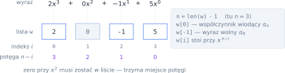
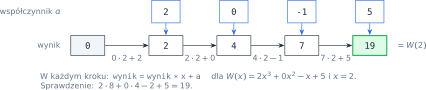
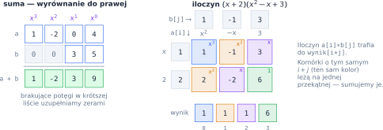

# Rozdział 14: Funkcje — wielomiany — wprowadzenie

## Czego się nauczysz

* zapisywać wielomian jako **listę współczynników** i przechodzić od indeksu w liście do potęgi $x$,
* obliczać wartość wielomianu **schematem Hornera** i rozumieć, dlaczego jest szybszy od liczenia potęg,
* dodawać i mnożyć wielomiany, operując tylko na listach liczb,
* liczyć pochodną wielomianu i pierwiastki trójmianu kwadratowego,
* pisać funkcje **czyste** — takie, które nie psują list otrzymanych w argumentach.

## Wielomian jako lista liczb

Wielomian stopnia $n$ to wyrażenie

$$W(x) = a_n x^n + a_{n-1} x^{n-1} + \dots + a_1 x + a_0 = \sum_{k=0}^{n} a_k x^k, \qquad a_n \ne 0.$$

Cała informacja o wielomianie siedzi we współczynnikach $a_n, \dots, a_0$ — sama litera $x$ niczego
nie wnosi. Dlatego w programie wielomian to po prostu **lista współczynników**, w tym zbiorze zawsze
**od najwyższej potęgi do wyrazu wolnego**. Wielomian $2x^3 - x + 5$ zapisujemy jako `[2, 0, -1, 5]`:



Zapamiętaj trzy zależności, z których korzystają wszystkie zadania:

* lista ma $n + 1$ elementów, więc stopień to `len(w) - 1`,
* element `w[i]` stoi przy $x^{n-i}$ (indeks rośnie, potęga maleje),
* brakujące potęgi zapisujemy **zerami** — bez zera przy $x^2$ lista `[2, -1, 5]` oznaczałaby zupełnie
  inny wielomian, $2x^2 - x + 5$.

## Wartość w punkcie: schemat Hornera

Najprostszy sposób obliczenia $W(x)$ to policzenie każdej potęgi osobno. Wyraz $a_k x^k$ wymaga wtedy
$k$ mnożeń, a cały wielomian — około $n + (n-1) + \dots + 1 = \frac{n(n+1)}{2}$ mnożeń. Można
sprytniej: wystarczy wyłączać $x$ przed nawias, aż nawiasy „zjedzą” wszystkie potęgi:

$$2x^3 + 0x^2 - x + 5 = \left(\left(2 \cdot x + 0\right) \cdot x - 1\right) \cdot x + 5.$$

Wyrażenie liczymy od najgłębszego nawiasu: bierzemy współczynniki po kolei, od $a_n$ do $a_0$,
i za każdym razem mnożymy dotychczasowy wynik przez $x$ i dodajemy kolejny współczynnik. To jest
**schemat Hornera**:



Każdy krok to jedno mnożenie i jedno dodawanie, więc cały schemat wykonuje tylko $n$ mnożeń —
mówimy, że ma złożoność $O(n)$, a metoda „potęga po potędze” $O(n^2)$. Dla $n = 10$ to $10$ zamiast
$55$ mnożeń. Przy okazji nie trzeba w ogóle znać $n$: wystarczy przejść po liście od lewej do prawej.

> **Wskazówka:** dwie wartości sprawdzisz w pamięci: $W(0) = a_0$ (ostatni element listy) oraz
> $W(1) = a_n + \dots + a_0$ (suma wszystkich współczynników). To szybki test każdej funkcji
> liczącej wartość wielomianu.

## Dodawanie i mnożenie wielomianów

**Dodawanie** to dodawanie współczynników przy **tych samych potęgach**. Gdy stopnie są różne,
listy trzeba wyrównać do prawej, bo to tam stoją wyrazy wolne: krótszą listę uzupełniamy z przodu
zerami. Stopień sumy wynosi co najwyżej $\max(n, m)$.

**Mnożenie** wymaga pomnożenia każdego wyrazu pierwszego wielomianu przez każdy wyraz drugiego:
$a_i x^i \cdot b_j x^j = a_i b_j \, x^{i+j}$ — potęgi się dodają. Iloczyn wielomianów stopni $n$ i $m$
ma stopień $n + m$, czyli $n + m + 1$ współczynników, a współczynnik przy $x^k$ jest sumą wszystkich
iloczynów, w których potęgi dają razem $k$:

$$c_k = \sum_{i + j = k} a_i b_j.$$

W listach „od najwyższej potęgi” działa to tak samo: iloczyn elementów `a[i]` i `b[j]` trafia na pozycję
`i + j` wyniku. Najwygodniej zobaczyć to w tabelce „każdy z każdym”:



Wypełnienie tabelki to $(n+1)(m+1)$ mnożeń, czyli złożoność $O(n \cdot m)$.

## Pochodna i miejsca zerowe

Pochodną wielomianu liczymy wyraz po wyrazie ze wzoru $\left(a x^d\right)' = d \cdot a \, x^{d-1}$;
pochodna stałej to $0$. Na przykład

$$\left(2x^3 - x + 5\right)' = 6x^2 - 1, \qquad \left(6x^2 - 1\right)' = 12x.$$

W listach: `[2, 0, -1, 5]` → `[6, 0, -1]` → `[12, 0]`. Każdy współczynnik mnożymy przez potęgę,
przy której stoi, a wyraz wolny znika — lista **skraca się o jeden**. Po $k$ różniczkowaniach stopień
spada do $n - k$, a gdy $k > n$, zostaje wielomian zerowy.

Dla trójmianu kwadratowego $ax^2 + bx + c$ ($a \ne 0$) miejsca zerowe zależą od znaku wyróżnika
$\Delta = b^2 - 4ac$:

| Wyróżnik | Liczba pierwiastków rzeczywistych | Wzór |
|---|---|---|
| $\Delta < 0$ | brak | — |
| $\Delta = 0$ | jeden (podwójny) | $x_0 = \frac{-b}{2a}$ |
| $\Delta > 0$ | dwa | $x_{1,2} = \frac{-b \pm \sqrt{\Delta}}{2a}$ |

Pierwiastek kwadratowy daje `math.sqrt(delta)` (po `import math`). Funkcji nie wolno wywołać dla
$\Delta < 0$ — zgłosi błąd `ValueError: math domain error`, więc najpierw sprawdź znak $\Delta$.

## Funkcje czyste i skutki uboczne

Lista przekazana do funkcji **nie jest kopiowana**: parametr i zmienna wywołującego to dwie nazwy
**tej samej** listy. Funkcja, która zmienia taką listę, ma **skutek uboczny** — psuje dane, których
wywołujący wcale nie chciał zmieniać. Funkcja **czysta** tylko oblicza i zwraca nowy wynik:

```python
def dodaj_stala_zle(w, c):
    w[-1] += c          # zmienia listę wywołującego!
    return w

def dodaj_stala(w, c):
    nowa = w[:]         # wycinek = nowa lista (kopia)
    nowa[-1] += c
    return nowa

p = [2, 0, -1, 5]
q = dodaj_stala(p, 10)
print(p, q)             # [2, 0, -1, 5] [2, 0, -1, 15]
r = dodaj_stala_zle(p, 10)
print(p, r)             # [2, 0, -1, 15] [2, 0, -1, 15]
```

Po wywołaniu `dodaj_stala_zle` lista `p` jest zmieniona, a `p` i `r` to wręcz ta sama lista
(`p is r` daje `True`). Wycinek `w[:]`, wyrażenie listowe i operator `+` na listach zawsze tworzą
**nową** listę — z nich buduj wyniki funkcji.

## Przykład rozwiązany: wielomian jako czytelny napis

**Zadanie.** Napisz funkcję `na_napis(w)`, która zamienia listę współczynników na zapis taki, jak
w zeszycie, np. `[-1, 4, 0, 1, -7]` na `-x^4 + 4x^3 + x - 7`. Wielomian zerowy to `0`.

**Analiza.** Przechodzimy po liście indeksem $i$ i dla każdego współczynnika $a$ wyznaczamy potęgę
$k = n - i$. Trzeba uwzględnić kilka reguł zapisu:

1. wyrazy z $a = 0$ pomijamy,
2. znak: przed pierwszym wypisanym wyrazem stoi tylko `-` (albo nic), przed kolejnymi ` + ` lub ` - `,
3. jednomian zapisujemy bez znaku: dla $k = 0$ sama liczba $|a|$, dla $k = 1$ `x`, dalej `x^k`,
   a współczynnik $|a| = 1$ przy $x$ pomijamy (piszemy `x`, a nie `1x`),
4. jeśli nic nie wypisaliśmy, wielomian jest zerowy.

![Budowanie napisu dla w = [-1, 4, 0, 1, -7]: każdy niezerowy współczynnik daje znak i jednomian](diagramy/svg/14_napis.svg)

Regułę 3 warto wydzielić do osobnej funkcji pomocniczej — wtedy główna pętla zajmuje się tylko
znakami:

```python
def jednomian(a, k):
    """Zapis |a|·x^k bez znaku, np. (4, 3) -> '4x^3', (-1, 1) -> 'x'."""
    a = abs(a)
    if k == 0:
        return str(a)
    wsp = "" if a == 1 else str(a)
    if k == 1:
        return wsp + "x"
    return wsp + "x^" + str(k)


def na_napis(w):
    n = len(w) - 1
    napis = ""
    for i in range(len(w)):
        a = w[i]
        if a == 0:
            continue                      # zerowe wyrazy pomijamy
        k = n - i                         # potęga przy w[i]
        if napis == "":                   # pierwszy wypisywany wyraz
            znak = "-" if a < 0 else ""
        else:
            znak = " - " if a < 0 else " + "
        napis += znak + jednomian(a, k)
    if napis == "":
        return "0"                        # wielomian zerowy
    return napis


print(na_napis([-1, 4, 0, 1, -7]))   # -x^4 + 4x^3 + x - 7
```

**Sprawdzenie** na przypadkach brzegowych:

| `w` | Wynik | Co sprawdza |
|---|---|---|
| `[2, 0, -1, 5]` | `2x^3 - x + 5` | zero w środku, współczynnik $-1$ |
| `[3, 1, 0]` | `3x^2 + x` | brak wyrazu wolnego |
| `[1]` | `1` | stała $1$ — tu jedynki **nie** pomijamy |
| `[-1, 0]` | `-x` | minus na początku, bez spacji |
| `[0, 0]` | `0` | wielomian zerowy |

Zauważ, że funkcja jest czysta: tylko czyta listę `w` i buduje nowy napis.

## Typowe błędy

* **Mylenie indeksu z potęgą.** `w[i]` stoi przy $x^{n-i}$, a nie przy $x^i$. Gdy masz wątpliwości,
  sprawdź na `w[0]` (najwyższa potęga) i `w[-1]` (wyraz wolny).
* **Usuwanie zer ze środka listy.** Zera trzymają miejsca potęg; usunąć wolno tylko zera
  **wiodące** (z początku).
* **Horner od złej strony.** Schemat zaczyna od $a_n$, czyli od `w[0]`. Przejście od wyrazu wolnego
  liczy w rzeczywistości wielomian o odwróconej liście — wyłapie to test $W(0) = a_0$ (test $W(1)$
  nie wystarczy, bo suma współczynników nie zależy od kolejności).
* **Dodawanie list wyrównanych do lewej.** Suma `[1, 2, 3]` i `[5, 6]` to $(x^2 + 2x + 3) + (5x + 6)$, czyli
  `[1, 7, 9]`, a nie `[6, 8, 3]`.
* **Zła długość wyniku mnożenia.** Iloczyn ma $n + m + 1$ współczynników — tyle zer przygotuj na
  początku (`[0] * (n + m + 1)`), a potem tylko **dodawaj** do kolejnych pozycji.
* **Pierwiastek z ujemnej delty** (`math.sqrt` zgłosi błąd) albo zła kolejność pierwiastków: gdy
  $a < 0$, wzór z „$+$” daje **mniejszy** pierwiastek, więc wynik posortuj.
