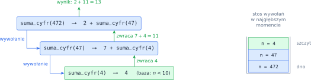
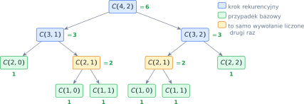
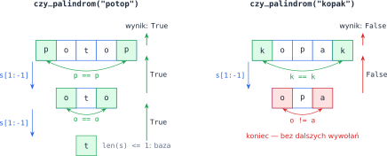

# Rozdział 15: Funkcje — rekurencja — wprowadzenie

## Czego się nauczysz

* rozpoznawać w problemie **przypadek bazowy** i **krok rekurencyjny** i zapisywać je jako funkcję,
* zamieniać wzór rekurencyjny (np. $a_n = f(a_{n-1})$) na kod w Pythonie,
* śledzić, co dzieje się na **stosie wywołań** i jak wyniki „wracają w górę”,
* rysować **drzewo wywołań** i zauważać powtarzające się obliczenia,
* stosować rekurencję do napisów i list, zmniejszając je wycinkami.

## Funkcja, która wywołuje samą siebie

**Rekurencja** polega na rozwiązaniu problemu przez sprowadzenie go do **mniejszej wersji tego samego
problemu**. Funkcja rekurencyjna zawsze składa się z dwóch części:

* **przypadku bazowego** — dane są tak małe, że odpowiedź znamy od razu i zwracamy ją bez wywołań,
* **kroku rekurencyjnego** — wywołujemy funkcję dla mniejszych danych i z jej wyniku budujemy
  odpowiedź.

Przykład: suma cyfr liczby naturalnej. Jeśli $n < 10$, liczba ma jedną cyfrę i suma cyfr to samo $n$.
W przeciwnym razie suma cyfr to ostatnia cyfra plus suma cyfr liczby bez ostatniej cyfry:

$$s(n) = n \quad \text{dla } n < 10, \qquad s(n) = (n \bmod 10) + s\left(\left\lfloor \frac{n}{10} \right\rfloor\right) \quad \text{dla } n \ge 10.$$

Wzór przepisujemy na kod niemal słowo w słowo:

```python
def suma_cyfr(n):
    if n < 10:                          # przypadek bazowy: jedna cyfra
        return n
    return n % 10 + suma_cyfr(n // 10)  # krok rekurencyjny

print(suma_cyfr(472))   # 13
```

> **Wskazówka:** pisząc krok rekurencyjny, **załóż, że wywołanie dla mniejszych danych już działa**,
> i zastanów się tylko, jak z jego wyniku zbudować odpowiedź. To ta sama idea co w indukcji
> matematycznej: jeśli twierdzenie zachodzi dla przypadku bazowego i z prawdziwości dla $n-1$ wynika
> prawdziwość dla $n$, to zachodzi dla wszystkich $n$.

Każde wywołanie musi **przybliżać** dane do przypadku bazowego (tu: liczba traci cyfrę). Inaczej
funkcja wywoływałaby się w nieskończoność.

## Stos wywołań

Co się dzieje po wywołaniu `suma_cyfr(472)`? Funkcja nie zna jeszcze wyniku, bo potrzebuje
`suma_cyfr(47)`. Python **wstrzymuje** bieżące wywołanie (pamiętając, że trzeba jeszcze dodać $2$)
i uruchamia nowe — z własną, osobną zmienną `n`. Wstrzymane wywołania leżą jedno na drugim na
**stosie wywołań**. Dopiero przypadek bazowy zwraca wynik od razu; wtedy wywołania kończą się
w odwrotnej kolejności i każde przekazuje swój wynik temu, które je wywołało:



Każde wywołanie zajmuje miejsce na stosie, dlatego Python ogranicza jego wysokość — domyślnie do
około $1000$ (`sys.getrecursionlimit()`). Funkcja bez przypadku bazowego albo taka, która nigdy do
niego nie dochodzi, kończy się błędem:

```
RecursionError: maximum recursion depth exceeded
```

Głębokość rekurencji to liczba wywołań leżących naraz na stosie. Dla `suma_cyfr(n)` jest równa liczbie
cyfr, czyli około $\log_{10} n$. Funkcja, która zmniejsza $n$ tylko o $1$, ma głębokość $n$ — dlatego
w zadaniach dane są małe.

## Kilka wywołań naraz: drzewo wywołań

Krok rekurencyjny może wywoływać funkcję **więcej niż raz**. Tak jest np. ze współczynnikiem
dwumianowym $C(n, k) = \binom{n}{k}$ — liczbą sposobów wybrania $k$ elementów z $n$. Albo wybieramy
ostatni element (i dobieramy $k-1$ spośród pozostałych $n-1$), albo go nie wybieramy (i dobieramy $k$
spośród $n-1$):

$$\binom{n}{k} = \binom{n-1}{k-1} + \binom{n-1}{k}, \qquad \binom{n}{0} = \binom{n}{n} = 1.$$

```python
def dwumian(n, k):
    if k == 0 or k == n:                # przypadki bazowe
        return 1
    return dwumian(n - 1, k - 1) + dwumian(n - 1, k)

print(dwumian(4, 2))    # 6
```

Wywołania tworzą teraz **drzewo**: każdy węzeł to jedno wywołanie, jego dzieci to wywołania, które
wykonuje, a liczby obok to zwracane wartości. Wynik węzła jest sumą wyników jego dzieci:



Zauważ, że $C(2, 1)$ liczymy **dwa razy**. W małym drzewie to drobiazg (11 wywołań), ale drzewa
rosną bardzo szybko: `dwumian(20, 10)` wykonuje już $369\,511$ wywołań, choć różnych par $(n, k)$ jest
tylko około $100$. Tak samo zachowuje się rekurencyjny ciąg Fibonacciego — liczba wywołań rośnie
**wykładniczo**. Ratunkiem jest **zapamiętywanie** (memoizacja): wynik każdego wywołania zapisujemy
i przy kolejnej prośbie o to samo zwracamy gotową wartość.

## Rekurencja na napisach i listach

Napis albo listę też można zmniejszać: `s[1:]` to napis bez pierwszego znaku, `s[:-1]` — bez
ostatniego, a `s[1:-1]` — bez obu skrajnych. Przypadkiem bazowym jest zwykle napis (lista) pusty albo
jednoelementowy. Przykład — odwrócenie napisu: odwrócony napis to odwrócona reszta, a za nią pierwszy
znak:

```python
def odwroc(s):
    if s == "":
        return ""
    return odwroc(s[1:]) + s[0]

print(odwroc("rekurencja"))   # ajcneruker
```

Zamiast tworzyć wycinki, można też przekazywać w dodatkowym parametrze **indeks**, od którego
zaczyna się „reszta” danych, np. `f(lista, i)` → `f(lista, i + 1)`. Dla parametru można podać wartość
domyślną (`i=0`), żeby pierwsze wywołanie wyglądało zwyczajnie: `f(lista)`.

## Przykład rozwiązany: palindrom rekurencyjnie

**Zadanie.** Napisz rekurencyjną funkcję `czy_palindrom(s)`, która sprawdza, czy napis czytany od
końca jest taki sam (np. `potop`, `kajak`).

**Analiza.** Napis jest palindromem wtedy i tylko wtedy, gdy jego **skrajne znaki są równe** i **środek
też jest palindromem**:

$$P(s) \iff s_0 = s_{n-1} \;\land\; P(s_1 s_2 \dots s_{n-2}).$$

* Przypadek bazowy: napis pusty albo jednoznakowy jest palindromem.
* Jeśli skrajne znaki się różnią, od razu wiemy, że nie jest — kolejne wywołania są zbędne.
* W przeciwnym razie odpowiedź daje wywołanie dla środka napisu, `s[1:-1]`.



```python
def czy_palindrom(s):
    if len(s) <= 1:                     # pusty napis albo jeden znak
        return True
    if s[0] != s[-1]:                   # skrajne znaki różne — koniec
        return False
    return czy_palindrom(s[1:-1])       # sprawdź środek napisu

print(czy_palindrom("potop"))   # True
print(czy_palindrom("kopak"))   # False
```

**Sprawdzenie.**

| Wywołanie | `s[0]`, `s[-1]` | Co się dzieje | Zwraca |
|---|---|---|---|
| `czy_palindrom("potop")` | `p`, `p` | równe → wywołanie dla `"oto"` | `True` |
| `czy_palindrom("oto")` | `o`, `o` | równe → wywołanie dla `"t"` | `True` |
| `czy_palindrom("t")` | — | przypadek bazowy | `True` |
| `czy_palindrom("kopak")` | `k`, `k` | równe → wywołanie dla `"opa"` | `False` |
| `czy_palindrom("opa")` | `o`, `a` | różne → koniec bez wywołań | `False` |

Dla napisu długości $n$ funkcja wykona co najwyżej $\left\lfloor \frac{n}{2} \right\rfloor + 1$ wywołań.
Warunek `len(s) <= 1` (a nie `== 1`) jest ważny: palindromy o parzystej długości kończą się
napisem pustym, np. `"abba"` → `"bb"` → `""`.

## Typowe błędy

* **Brak przypadku bazowego albo przypadek, do którego nie da się dojść**, np. `n - 2` dla
  nieparzystego $n$ „przeskakuje” warunek `n == 0`. Skutek: `RecursionError`. Sprawdź, czy każde
  wywołanie zbliża dane do bazy dla **wszystkich** dozwolonych danych.
* **Brak `return` przed wywołaniem rekurencyjnym.** Linia `n % 10 + suma_cyfr(n // 10)` bez `return`
  oblicza wynik i go wyrzuca — funkcja zwraca `None`, a wywołanie piętro wyżej kończy się błędem
  `TypeError: unsupported operand type(s) for +: 'int' and 'NoneType'`.
* **`print` zamiast `return`.** Funkcja, która wypisuje wynik, nie przekaże go wywołaniu piętro wyżej.
  Wypisuj dopiero w programie głównym (chyba że zadanie wprost każe wypisywać, jak w wieży Hanoi).
* **Dwa wywołania tam, gdzie wystarczy jedno.** `f(n // 2) * f(n // 2)` liczy to samo dwa razy —
  zapisz wynik w zmiennej: `x = f(n // 2)`, potem `x * x`.
* **Za duża głębokość.** Rekurencja zmniejszająca dane o $1$ nie poradzi sobie z $n = 10^5$ — tu
  potrzebna jest pętla albo algorytm, który zmniejsza dane szybciej (np. o połowę).
