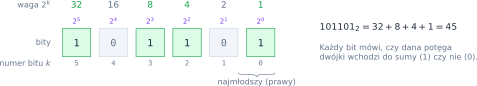
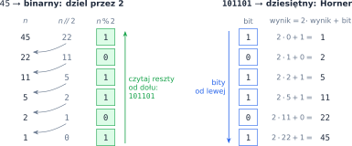
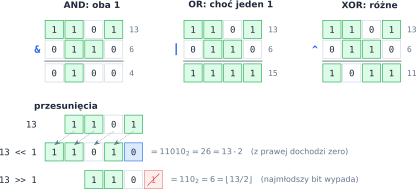
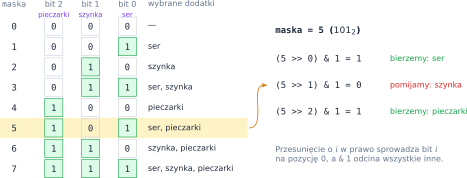

# Rozdział 16: Bity i systemy liczbowe — wprowadzenie

## Czego się nauczysz

* rozumieć **system pozycyjny** o dowolnej podstawie, w szczególności dwójkowy (binarny),
* zamieniać liczby między systemami: dzieleniem z resztą i schematem Hornera,
* używać operatorów bitowych `&`, `|`, `^`, `~` oraz przesunięć `<<` i `>>`,
* sprawdzać, ustawiać i zerować pojedyncze bity za pomocą **masek**,
* traktować liczbę jak zestaw przełączników „tak/nie”.

## System pozycyjny

W zapisie $472$ każda cyfra ma **wagę** zależną od pozycji: $472 = 4 \cdot 10^2 + 7 \cdot 10^1 + 2 \cdot 10^0$.
Tak samo działa każdy system pozycyjny o podstawie $p$: liczba zapisana cyframi $c_{k-1} \dots c_1 c_0$
(każda cyfra od $0$ do $p - 1$) ma wartość

$$\left(c_{k-1} \dots c_1 c_0\right)_p = \sum_{i=0}^{k-1} c_i \cdot p^i.$$

W systemie **dwójkowym** ($p = 2$) cyfry to tylko $0$ i $1$ — nazywamy je **bitami** — a wagi to kolejne
potęgi dwójki. Bity numerujemy od prawej, od zera: bit $k$ ma wagę $2^k$.



Liczba $n \ge 1$ ma w zapisie binarnym $\lfloor \log_2 n \rfloor + 1$ bitów, np. $45$ ma ich $6$, bo
$2^5 \le 45 < 2^6$. W systemach o podstawie większej niż $10$ brakuje cyfr, więc używa się liter:
$A = 10$, $B = 11$, …, $Z = 35$. Popularny jest system szesnastkowy: $45 = 2 \cdot 16 + 13 = 2D_{16}$.

Python zna te zapisy: `0b101101` i `0x2D` to literały liczby 45, `bin(45)` daje napis `'0b101101'`,
a `int("101101", 2)` i `int("2D", 16)` zamieniają napis na liczbę. W zadaniach spróbuj jednak
przeprowadzić zamiany samodzielnie.

## Zamiana między systemami

**Z dziesiętnego na system $p$.** Ostatnia cyfra liczby $n$ w systemie $p$ to reszta $n \bmod p$, a po
jej „odcięciu” zostaje $\lfloor n / p \rfloor$. Dzielimy więc liczbę przez $p$ tak długo, aż dojdziemy do
zera, i zbieramy reszty. Uwaga: reszty powstają **od najmłodszej cyfry**, więc czytamy je od końca.

**Z systemu $p$ na dziesiętny.** Ze wzoru na wartość można wyłączać $p$ przed nawias tak samo jak
w schemacie Hornera z rozdziału o wielomianach:
$(c_{k-1} \dots c_0)_p = (\dots(c_{k-1} \cdot p + c_{k-2}) \cdot p + \dots) \cdot p + c_0$. Idziemy po cyfrach
od lewej i za każdym razem mnożymy wynik przez $p$ i dodajemy cyfrę.



Cyfry zapisane znakami (`'0'`–`'9'`, `'A'`–`'Z'`) wygodnie trzymać w napisie
`CYFRY = "0123456789ABCDEFGHIJKLMNOPQRSTUVWXYZ"`: `CYFRY[c]` to znak cyfry o wartości $c$,
a `CYFRY.index(znak)` — wartość cyfry zapisanej znakiem `znak`.

## Operatory bitowe

Operatory bitowe działają **osobno na każdej pozycji** zapisu binarnego (krótszą liczbę uzupełniamy
z lewej zerami):

| $x$ | $y$ | `x & y` (AND) | `x \| y` (OR) | `x ^ y` (XOR) |
|---|---|---|---|---|
| 0 | 0 | 0 | 0 | 0 |
| 0 | 1 | 0 | 1 | 1 |
| 1 | 0 | 0 | 1 | 1 |
| 1 | 1 | 1 | 1 | 0 |

**Przesunięcie** `n << k` dopisuje $k$ zer z prawej, czyli mnoży przez $2^k$, a `n >> k` usuwa $k$
najmłodszych bitów, czyli dzieli całkowicie: `n >> k` $= \lfloor n / 2^k \rfloor$.



Przydatne tożsamości: $x \oplus x = 0$, $x \oplus 0 = x$, $(x \oplus y) \oplus y = x$ (XOR to „odwracalne
przełączanie”), a także `x & 1` — najmłodszy bit, czyli `1` dla liczb nieparzystych.

**Negacja** `~x` odwraca wszystkie bity. Ponieważ liczby całkowite w Pythonie nie mają ustalonej liczby
bitów, a ujemne zapisuje się w tzw. kodzie uzupełnień do dwóch (z nieskończenie wieloma jedynkami
z lewej), zawsze zachodzi `~x == -x - 1`, np. `~13 == -14`. Z tego samego powodu przesunięcie
liczby ujemnej w prawo „wsuwa” jedynki: `-8 >> 1 == -4`, a `-1 >> 5 == -1`.

## Maski: praca z pojedynczym bitem

**Maska** to liczba, której jedynki wskazują interesujące nas pozycje. Maskę z jedną jedynką na
pozycji $k$ daje `1 << k` (czyli $2^k$). Z nią każda operacja na bicie to jedna linijka:

| Operacja na bicie $k$ liczby `n` | Wyrażenie | Przykład dla $n = 45 = 101101_2$ |
|---|---|---|
| odczytaj bit (0 albo 1) | `(n >> k) & 1` | $k = 3$: `1` |
| ustaw bit na 1 | `n \| (1 << k)` | $k = 1$: $101111_2 = 47$ |
| wyzeruj bit | `n & ~(1 << k)` | $k = 2$: $101001_2 = 41$ |
| odwróć bit | `n ^ (1 << k)` | $k = 0$: $101100_2 = 44$ |

Maska może mieć więcej jedynek: `n & 0b1111` zostawia tylko cztery najmłodsze bity (to samo co
`n % 16`), a `(1 << k) - 1` to maska złożona z $k$ jedynek.

## Przykład rozwiązany: wszystkie pizze z trzech dodatków

**Zadanie.** Mamy listę dodatków `["ser", "szynka", "pieczarki"]`. Wypisz wszystkie możliwe zestawy
dodatków (także pusty), czyli wszystkie **podzbiory** tej listy.

**Analiza.** Każdy zestaw to $n$ decyzji „bierzemy / nie bierzemy” — tyle samo informacji co w $n$
bitach. Umówmy się, że bit $i$ odpowiada dodatkowi `dodatki[i]`. Wtedy każda liczba od $0$ do
$2^n - 1$ (**maska**) opisuje dokładnie jeden zestaw, a różnym liczbom odpowiadają różne zestawy.
Podzbiorów zbioru $n$-elementowego jest więc $2^n$ — tu $2^3 = 8$.



Wystarczą dwie pętle: zewnętrzna po wszystkich maskach (`range(1 << n)` to liczby $0, 1, \dots, 2^n - 1$),
wewnętrzna po numerach bitów; bit $i$ odczytujemy wyrażeniem `(maska >> i) & 1`:

```python
dodatki = ["ser", "szynka", "pieczarki"]
n = len(dodatki)
for maska in range(1 << n):          # 0, 1, ..., 2^n - 1
    wybrane = []
    for i in range(n):
        if (maska >> i) & 1:          # czy bit i jest ustawiony?
            wybrane.append(dodatki[i])
    print(f"{maska:0{n}b}", wybrane)
```

Specyfikacja formatu `0{n}b` wypisuje maskę binarnie, uzupełnioną zerami do $n$ znaków. Wynik:

```
000 []
001 ['ser']
010 ['szynka']
011 ['ser', 'szynka']
100 ['pieczarki']
101 ['ser', 'pieczarki']
110 ['szynka', 'pieczarki']
111 ['ser', 'szynka', 'pieczarki']
```

Program wykonuje $2^n \cdot n$ kroków. To dużo, ale nie da się szybciej — samych podzbiorów jest $2^n$.
Dla $n = 20$ to około miliona zestawów, a dla $n = 40$ już ponad bilion.

## Typowe błędy

* **`^` to nie potęga!** W Pythonie `2 ^ 3` to XOR i daje `1`; potęgę zapisuje się `2 ** 3`.
* **Kolejność działań.** Dodawanie wiąże mocniej niż przesunięcie: `1 << k - 1` znaczy `1 << (k - 1)`,
  a `a + b << 1` znaczy `(a + b) << 1`. Gdy mieszasz operatory bitowe z arytmetycznymi, stawiaj nawiasy.
* **Reszty w złej kolejności.** Dzielenie przez 2 daje bity od najmłodszego — trzeba je odwrócić
  (albo doklejać każdą nową cyfrę na **początek** napisu).
* **Liczba zero.** Pętla `while n > 0` dla $n = 0$ nie wykona się ani razu i zwróci pusty napis, a zapis
  binarny zera to `0`. Ten przypadek obsłuż osobno.
* **Prefiks `0b`.** `bin(5)` to `'0b101'`, a nie `'101'` — jeśli już używasz `bin`, odetnij dwa pierwsze
  znaki: `bin(5)[2:]`.
* **`~n` zamiast odwrócenia „widocznych” bitów.** `~5` to `-6`, a nie `2` (`101` → `010`). Aby odwrócić
  tylko $k$ najmłodszych bitów, użyj maski: `n ^ ((1 << k) - 1)`.
