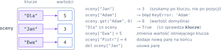
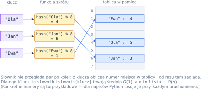
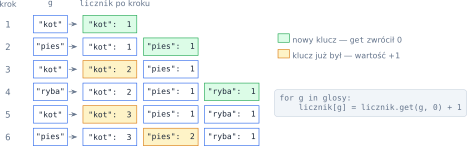
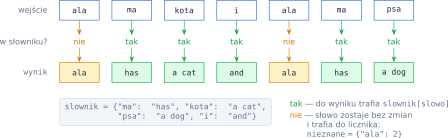

# Rozdział 17: Słowniki — wprowadzenie

## Czego się nauczysz

* przechowywać dane jako pary **klucz → wartość** w słowniku (`dict`),
* odczytywać, dodawać, zmieniać i usuwać pary oraz bezpiecznie pytać o brakujące klucze,
* rozumieć, dlaczego wyszukiwanie w słowniku jest tak szybkie i jakie obiekty mogą być kluczami,
* przechodzić po słowniku pętlą i sortować jego zawartość,
* stosować dwa najważniejsze wzorce: **zliczanie** i **grupowanie**.

## Słownik: klucze i wartości

Lista numeruje elementy kolejnymi liczbami $0, 1, 2, \dots$ Słownik pozwala samemu wybrać „etykiety”:
każda wartość jest przypisana do **klucza**, np. imienia ucznia. Słownik zapisujemy w nawiasach
klamrowych jako pary `klucz: wartość`:

```python
oceny = {"Ola": 5, "Jan": 3, "Ewa": 4}
print(oceny["Jan"])          # 3
oceny["Ewa"] = 5             # zmiana wartości
oceny["Piotr"] = 4           # nowa para (na końcu)
del oceny["Jan"]             # usunięcie pary
print(oceny)                 # {'Ola': 5, 'Ewa': 5, 'Piotr': 4}
print(len(oceny))            # 3
```



Matematycznie słownik to **funkcja** ze zbioru kluczy $K$ w zbiór wartości: każdemu kluczowi
$k \in K$ odpowiada dokładnie jedna wartość. Dlatego klucze się **nie powtarzają** — przypisanie do
istniejącego klucza zastępuje starą wartość. Wartości mogą się powtarzać i mogą być dowolne, także
listami albo innymi słownikami.

Odczyt brakującego klucza nawiasami kwadratowymi kończy się błędem `KeyError`. Są dwa sposoby, żeby go
uniknąć: zapytać wcześniej (`if klucz in slownik:`) albo użyć metody `get`, która dla brakującego klucza
zwraca wartość domyślną: `oceny.get("Adam")` daje `None`, a `oceny.get("Adam", 0)` daje `0`.

## Jak słownik znajduje klucz tak szybko?

Sprawdzenie `x in lista` wymaga przejrzenia listy element po elemencie — w najgorszym razie $n$
porównań, czyli $O(n)$. Słownik działa inaczej: z klucza oblicza liczbę zwaną **skrótem** (ang. *hash*,
funkcja `hash()`), a z niej numer miejsca w wewnętrznej tablicy. Po klucz sięga od razu tam, bez
przeglądania pozostałych:



Dlatego odczyt, zapis i sprawdzenie `klucz in slownik` trwają średnio $O(1)$ — niezależnie od tego, czy
słownik ma 10, czy milion par. Jeśli w pętli wielokrotnie sprawdzasz, czy coś „już było”, słownik
(albo zbiór `set`, który działa na tej samej zasadzie) zamienia algorytm $O(n^2)$ w $O(n)$.

Ma to jedną konsekwencję: skrót klucza nie może się zmienić, więc klucz musi być **niezmienny**.
Kluczami mogą być liczby, napisy i krotki (np. `(x, y)`), ale nie listy:

```python
d = {[1, 2]: "x"}            # TypeError: unhashable type: 'list'
d = {(1, 2): "x"}            # tak można — krotka jest niezmienna
```

## Przechodzenie po słowniku

Pętla `for` po słowniku przechodzi po **kluczach**. Pary otrzymasz metodą `items()`, same wartości —
metodą `values()`. Kolejność to kolejność **dodawania** kluczy:

```python
for imie, ocena in oceny.items():
    print(imie, ocena)       # Ola 5, potem Ewa 5, potem Piotr 4
```

Kilka przydatnych narzędzi:

* `sorted(slownik)` — posortowana lista kluczy, `sorted(slownik.items())` — pary posortowane po kluczu,
* `max(slownik.values())` — największa wartość, `sum(slownik.values())` — suma wartości,
* **wyrażenie słownikowe** buduje słownik w jednej linii, podobnie jak wyrażenie listowe:
  `{s: len(s) for s in ["kot", "pies"]}` daje `{'kot': 3, 'pies': 4}`.

> **Pułapka:** w trakcie pętli po słowniku nie wolno dodawać ani usuwać kluczy — Python przerwie program
> błędem `RuntimeError: dictionary changed size during iteration`. Przechodź wtedy po kopii kluczy
> (`for k in list(slownik):`) albo zbuduj nowy słownik.

## Zliczanie i grupowanie

Najczęstsze zastosowanie słownika to **zliczanie**: klucz to „co”, wartość to „ile razy”. Za każdym razem
zwiększamy licznik o 1, a `get(klucz, 0)` załatwia przypadek, gdy klucz pojawia się pierwszy raz:

```python
glosy = ["kot", "pies", "kot", "ryba", "kot", "pies"]
licznik = {}
for g in glosy:
    licznik[g] = licznik.get(g, 0) + 1
print(licznik)               # {'kot': 3, 'pies': 2, 'ryba': 1}
```



Zliczanie $n$ elementów trwa $O(n)$ — każdy element to jedna operacja na słowniku. Gotowe narzędzie do
zliczania to klasa `Counter` z modułu `collections`: `Counter(glosy)` daje ten sam wynik.

**Grupowanie** to zbieranie elementów o wspólnej cesze w listy: klucz to cecha, wartość — lista
elementów. Metoda `setdefault(klucz, [])` zwraca listę spod klucza, a gdy klucza nie ma, najpierw
wstawia pustą listę:

```python
wg_dlugosci = {}
for slowo in ["kot", "pies", "mysz", "lis", "ryba"]:
    wg_dlugosci.setdefault(len(slowo), []).append(slowo)
print(wg_dlugosci)           # {3: ['kot', 'lis'], 4: ['pies', 'mysz', 'ryba']}
```

## Przykład rozwiązany: tłumacz słowo po słowie

**Zadanie.** Mamy mały słownik polsko-angielski. Wczytaj zdanie (słowa oddzielone spacjami)
i przetłumacz je słowo po słowie. Słowa, których nie ma w słowniku, zostaw bez zmian, a na koniec
wypisz, ile razy wystąpiło każde nieznane słowo.

**Analiza.** Słownik tłumaczeń to gotowa funkcja „słowo polskie → słowo angielskie”. Dla każdego słowa
pytamy `slowo in slownik` — średnio w czasie $O(1)$, więc całe tłumaczenie zdania z $n$ słów trwa
$O(n)$. Nieznane słowa zliczamy drugim słownikiem, tak jak głosy w poprzedniej sekcji.



```python
slownik = {"ma": "has", "kota": "a cat", "psa": "a dog", "i": "and"}
wynik = []
nieznane = {}
for slowo in input().split():
    if slowo in slownik:
        wynik.append(slownik[slowo])
    else:
        wynik.append(slowo)                          # zostawiamy bez zmian
        nieznane[slowo] = nieznane.get(slowo, 0) + 1
print(" ".join(wynik))
print("nieznane:", nieznane)
```

Dla wejścia `ala ma kota i ala ma psa` program wypisze:

```
ala has a cat and ala has a dog
nieznane: {'ala': 2}
```

Gdyby nie trzeba było zliczać nieznanych słów, całe `if` / `else` dałoby się zastąpić jedną linią
`wynik.append(slownik.get(slowo, slowo))` — wartością domyślną jest wtedy samo słowo.

## Typowe błędy

* **`KeyError` przy pierwszym wystąpieniu klucza.** `licznik[g] += 1` nie zadziała, gdy klucza `g`
  jeszcze nie ma — użyj `licznik.get(g, 0) + 1` albo sprawdź najpierw `g in licznik`.
* **`in` sprawdza klucze, nie wartości.** `5 in oceny` to `False`, choć ktoś ma piątkę; wartości
  sprawdzisz przez `5 in oceny.values()` (ale to już $O(n)$).
* **Zmiana rozmiaru słownika w pętli po nim** — `RuntimeError`. Usuwaj pary w pętli po `list(slownik)`.
* **Lista jako klucz** — `TypeError: unhashable type: 'list'`. Zamień ją na krotkę: `tuple(lista)`.
* **`{}` to pusty słownik, a nie pusty zbiór.** Pusty zbiór tworzy się przez `set()`.
* **Zgubione powtórzenia.** Przypisanie do istniejącego klucza nadpisuje wartość — jeśli jeden klucz ma
  mieć wiele wartości, trzymaj pod nim listę (grupowanie).
