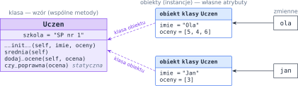
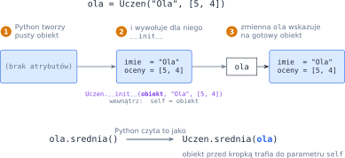
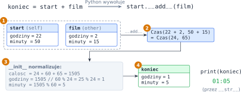

# Rozdział 18: Klasy — wprowadzenie

## Czego się nauczysz

* definiować własne **klasy** i tworzyć ich **obiekty**,
* pisać konstruktor `__init__` i rozumieć, czym jest parametr `self`,
* odróżniać atrybuty obiektu od atrybutów klasy i pisać metody statyczne,
* uczyć obiekty współpracy z operatorami i funkcjami Pythona przez **metody specjalne**
  (`__str__`, `__eq__`, `__lt__`, `__add__`, …),
* zgłaszać błędy z metod instrukcją `raise`.

## Klasa i obiekt

Do tej pory dane i funkcje, które na nich działały, żyły osobno: lista ocen w jednej zmiennej, imię
w drugiej, funkcja licząca średnią — gdzieś obok. **Klasa** łączy je w całość. Opisuje nowy typ danych:
jakie **atrybuty** (dane) ma każdy jego egzemplarz i jakie **metody** (funkcje) można na nim wywołać.
Egzemplarze klasy to **obiekty** (inaczej **instancje**). Klasa jest jak formularz, a obiekty — jak
wypełnione formularze: wzór jest jeden, a każdy egzemplarz ma własne wpisy.

```python
class Uczen:
    def __init__(self, imie, oceny):
        self.imie = imie               # atrybuty obiektu
        self.oceny = oceny

    def srednia(self):
        return sum(self.oceny) / len(self.oceny)

    def dodaj_ocene(self, ocena):
        self.oceny.append(ocena)


ola = Uczen("Ola", [5, 4])
jan = Uczen("Jan", [3])
ola.dodaj_ocene(6)
print(ola.imie, ola.oceny, ola.srednia())   # Ola [5, 4, 6] 5.0
print(jan.imie, jan.oceny, jan.srednia())   # Jan [3] 3.0
```

Nazwy klas piszemy wielką literą (`Uczen`, `KontoBankowe`). Obiekt tworzymy, wywołując klasę jak
funkcję, a do atrybutów i metod sięgamy przez kropkę: `ola.imie`, `ola.srednia()`.



## Konstruktor i `self`

Metoda `__init__` to **konstruktor**: Python wywołuje ją automatycznie przy tworzeniu obiektu, żeby
nadać mu początkowe atrybuty. Jej pierwszy parametr, `self`, to **tworzony właśnie obiekt**; zapis
`self.imie = imie` znaczy „zapisz w tym obiekcie atrybut `imie`”.



Tak samo działa każda metoda: zapis `ola.srednia()` Python wykonuje jako `Uczen.srednia(ola)`, czyli
obiekt sprzed kropki trafia do parametru `self`. Dlatego:

* każda zwykła metoda ma `self` jako **pierwszy** parametr, choć przy wywołaniu go nie podajemy,
* wewnątrz metody do atrybutów i innych metod obiektu sięgamy **zawsze** przez `self.`
  (`self.oceny`, `self.srednia()`); samo `oceny` byłoby zwykłą zmienną lokalną.

Parametry konstruktora mogą mieć wartości domyślne, np. `def __init__(self, imie, oceny=None)`.

> **Pułapka:** nie dawaj listy jako wartości domyślnej (`oceny=[]`). Taka lista powstaje **raz**, przy
> definicji metody, i byłaby wspólna dla wszystkich obiektów utworzonych bez tego argumentu. Użyj
> `oceny=None` i w konstruktorze: `self.oceny = [] if oceny is None else oceny`.

## Atrybuty klasy i metody statyczne

Atrybut przypisany w ciele klasy (poza metodami) należy do **klasy** i jest **wspólny** dla wszystkich
obiektów. Metoda oznaczona dekoratorem `@staticmethod` nie dostaje `self` — to zwykła funkcja
„schowana” w klasie, bo tematycznie do niej pasuje:

```python
class Uczen:
    szkola = "SP nr 1"                 # atrybut klasy — wspólny

    def __init__(self, imie, oceny):
        self.imie = imie
        self.oceny = oceny

    @staticmethod
    def czy_poprawna(ocena):           # bez self
        return 1 <= ocena <= 6

    def dodaj_ocene(self, ocena):
        if not Uczen.czy_poprawna(ocena):
            raise ValueError(f"Niepoprawna ocena: {ocena}")
        self.oceny.append(ocena)
```

Atrybut klasy odczytasz przez obiekt (`ola.szkola`) albo przez klasę (`Uczen.szkola`), ale **zmieniaj**
go tylko przez klasę: `Uczen.szkola = "SP nr 2"`. Przypisanie `self.szkola = …` utworzyłoby nowy atrybut
w jednym obiekcie, który zasłoniłby wspólny.

Metoda `dodaj_ocene` pokazuje też, jak klasa zgłasza błąd: `raise ValueError(...)` natychmiast przerywa
metodę. O tym, co zrobić z błędem, decyduje kod wywołujący — w bloku `try` / `except`:

```python
try:
    jan.dodaj_ocene(7)
except ValueError as e:
    print("Błąd:", e)                  # Błąd: Niepoprawna ocena: 7
```

## Metody specjalne

`print(ola)` wypisze na razie coś w rodzaju `<__main__.Uczen object at 0x7ec6…>`, a `a == b` dla dwóch
obiektów o tych samych danych da `False` (porównuje, czy to **ten sam** obiekt). Możemy to zmienić:
Python tłumaczy operatory i niektóre funkcje wbudowane na wywołania metod o nazwach z podwójnymi
podkreśleniami. Wystarczy je zdefiniować w klasie:

| Zapis | Python wywołuje | Uwagi |
|---|---|---|
| `str(a)`, `print(a)`, f-string | `a.__str__()` | musi **zwrócić** napis |
| `a == b` | `a.__eq__(b)` | `a != b` Python wyznaczy sam jako zaprzeczenie |
| `a < b` | `a.__lt__(b)` | wystarczy do `sorted()`, `min()`, `max()` |
| `a + b`, `a - b` | `a.__add__(b)`, `a.__sub__(b)` | zwykle zwraca **nowy** obiekt |
| `a * b`, `a / b` | `a.__mul__(b)`, `a.__truediv__(b)` | jak wyżej |

W każdej z tych metod `self` to obiekt **z lewej** strony operatora, a drugi parametr (zwyczajowo
`other`) — obiekt z prawej. Metody działające jak operatory arytmetyczne nie powinny zmieniać żadnego
z argumentów: `a + b` nie zmienia przecież ani `a`, ani `b`.

## Przykład rozwiązany: klasa `Czas`

**Zadanie.** Napisz klasę `Czas` przechowującą godzinę zegarową (godziny $0$–$23$, minuty $0$–$59$).
Obiekty mają się wypisywać w postaci `HH:MM`, dać się dodawać (`start + film` to godzina końca filmu),
porównywać i sortować.

**Analiza.** Najważniejsza decyzja: niech **konstruktor sam normalizuje** dane. Jeśli dostanie np.
$24$ godziny i $65$ minut, zamieni wszystko na minuty i rozłoży z powrotem:

$$c = 60g + m, \qquad g' = \left\lfloor \frac{c}{60} \right\rfloor \bmod 24, \qquad m' = c \bmod 60.$$

Wtedy każdy obiekt jest zawsze poprawny, a `__add__` może po prostu dodać godziny do godzin i minuty
do minut — przeniesienia i „przejście przez północ” załatwi konstruktor nowego obiektu.



```python
class Czas:
    def __init__(self, godziny=0, minuty=0):
        calosc = godziny * 60 + minuty        # wszystko w minutach
        self.godziny = calosc // 60 % 24      # doba ma 24 godziny
        self.minuty = calosc % 60

    def __str__(self):
        return f"{self.godziny:02d}:{self.minuty:02d}"

    def __add__(self, other):
        return Czas(self.godziny + other.godziny, self.minuty + other.minuty)

    def __eq__(self, other):
        return self.godziny == other.godziny and self.minuty == other.minuty

    def __lt__(self, other):
        return (self.godziny, self.minuty) < (other.godziny, other.minuty)


start = Czas(22, 50)
film = Czas(2, 15)
koniec = start + film
print(start, "+", film, "=", koniec)      # 22:50 + 02:15 = 01:05
print(Czas(0, 75) == Czas(1, 15))         # True
print(koniec < start)                     # True
plan = sorted([Czas(12, 0), Czas(8, 30), Czas(9, 5)])
print(*plan)                              # 08:30 09:05 12:00
```

**Sprawdzenie.** Format `:02d` dopisuje zero z przodu (`2` → `02`). W `__lt__` porównujemy krotki — są
porównywane element po elemencie, więc najpierw liczą się godziny, a przy równych godzinach minuty.
`Czas(0, 75) == Czas(1, 15)` daje `True`, bo oba obiekty po normalizacji mają $1$ godzinę i $15$ minut.
Funkcja `sorted` sama wywołuje `__lt__`, a `print(*plan)` wypisuje każdy obiekt przez `__str__`.

## Typowe błędy

* **Brak `self` w definicji metody.** `def srednia():` kończy się przy wywołaniu błędem
  `TypeError: Uczen.srednia() takes 0 positional arguments but 1 was given` — Python zawsze przekazuje
  obiekt jako pierwszy argument.
* **Brak `self.` przed atrybutem.** `oceny.append(x)` zamiast `self.oceny.append(x)` szuka zmiennej
  `oceny`, której nie ma (`NameError`), a `imie = imie` w konstruktorze niczego nie zapisuje w obiekcie.
* **`print` w `__str__`.** Metoda `__str__` ma **zwrócić** napis (`return`); jeśli tylko wypisuje,
  `print(obiekt)` zgłosi `TypeError: __str__ returned non-string`.
* **Metoda bez nawiasów.** `ola.srednia` to sama metoda (obiekt funkcji), a nie jej wynik — wywołanie to
  `ola.srednia()`.
* **Zmiana argumentu w `__add__`.** Jeśli `__add__` zmienia `self` zamiast zwrócić nowy obiekt,
  `c = a + b` po cichu zmieni także `a`.
* **Porównywanie obiektów bez `__eq__`.** Domyślnie `==` sprawdza, czy to ten sam obiekt w pamięci, więc
  dwa obiekty o identycznych danych są „różne”.
