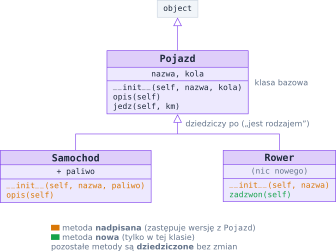
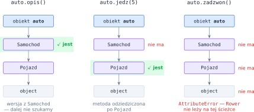
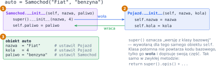
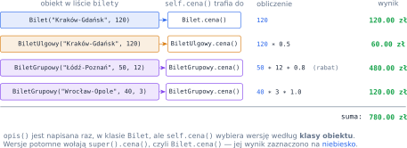

# Rozdział 19: Dziedziczenie — wprowadzenie

## Czego się nauczysz

* tworzyć **klasy potomne**, które przejmują atrybuty i metody klasy bazowej,
* **nadpisywać** metody i rozumieć, jak Python szuka metody wywołanej na obiekcie,
* rozszerzać konstruktor i metody klasy bazowej przez `super()`,
* korzystać z **polimorfizmu**: jeden kod działa dla obiektów wielu klas,
* rozpoznawać dziedziczenie w wyjątkach i przy dziedziczeniu wielokrotnym.

## Klasa bazowa i klasy potomne

Często kilka klas ma wspólną część: samochód i rower mają nazwę i liczbę kół, oba można opisać i oba
jeżdżą. Zamiast pisać ten sam kod dwa razy, umieszczamy go w **klasie bazowej** `Pojazd`, a klasy
**potomne** `Samochod` i `Rower` go **dziedziczą**. Klasę bazową podajemy w nawiasie po nazwie:

```python
class Pojazd:
    def __init__(self, nazwa, kola):
        self.nazwa = nazwa
        self.kola = kola

    def opis(self):
        return f"{self.nazwa}, kół: {self.kola}"

    def jedz(self, km):
        return f"{self.nazwa} przejeżdża {km} km"


class Samochod(Pojazd):
    def __init__(self, nazwa, paliwo):
        super().__init__(nazwa, 4)     # część wspólną ustawia Pojazd
        self.paliwo = paliwo           # nowy atrybut

    def opis(self):                    # nadpisanie z rozszerzeniem
        return super().opis() + f", paliwo: {self.paliwo}"


class Rower(Pojazd):
    def __init__(self, nazwa):
        super().__init__(nazwa, 2)

    def zadzwon(self):                 # nowa metoda
        return "dzyń dzyń!"
```



Dziedziczenie wyraża relację **„jest rodzajem”**: samochód jest pojazdem, więc wszędzie, gdzie
potrzebny jest pojazd, można użyć samochodu. W języku zbiorów: obiekty klasy potomnej tworzą
**podzbiór** obiektów klasy bazowej. Sprawdzają to funkcje `isinstance(obiekt, Klasa)` oraz
`issubclass(Potomna, Bazowa)`:

```python
auto = Samochod("Fiat", "benzyna")
rower = Rower("Romet")
print(isinstance(auto, Pojazd), isinstance(auto, Rower))   # True False
print(issubclass(Rower, Pojazd))                           # True
```

Każda klasa w Pythonie dziedziczy (bezpośrednio albo pośrednio) po wbudowanej klasie `object`.

## Nadpisywanie i wyszukiwanie metod

Klasa potomna może **nadpisać** metodę bazową — zdefiniować metodę o tej samej nazwie. Skąd Python wie,
którą wersję uruchomić? Przy wywołaniu `obiekt.metoda()` szuka jej **po kolei**: najpierw w klasie
obiektu, potem w jej klasie bazowej, potem w bazowej bazowej… aż do `object`. Wykonuje **pierwszą
znalezioną** wersję. Tę kolejność klas nazywamy **MRO** (*method resolution order*), a pokazuje ją
`Samochod.__mro__`: `Samochod` → `Pojazd` → `object`.



```python
print(auto.opis())       # Fiat, kół: 4, paliwo: benzyna   (wersja z Samochod)
print(auto.jedz(5))      # Fiat przejeżdża 5 km            (odziedziczona z Pojazd)
print(rower.opis())      # Romet, kół: 2                   (wersja z Pojazd)
print(rower.zadzwon())   # dzyń dzyń!
auto.zadzwon()           # AttributeError: 'Samochod' object has no attribute 'zadzwon'
```

Ważna konsekwencja: wyszukiwanie zaczyna się **zawsze od klasy obiektu**, także wtedy, gdy wywołanie
`self.metoda()` stoi w kodzie klasy bazowej. Metoda bazowa, która woła `self.opis()`, dla samochodu
uruchomi `Samochod.opis`. Dzięki temu w klasie bazowej można napisać ogólny „szkielet” działania,
a klasom potomnym zostawić tylko szczegóły.

## `super()`: rozszerzanie zamiast przepisywania

Nadpisana metoda często nie chce **zastąpić** wersji bazowej, tylko ją **uzupełnić**. Wywołanie
`super().metoda(...)` uruchamia wersję z klasy bazowej — dla tego samego obiektu `self`. Najczęściej
robimy tak w konstruktorze: klasa potomna przekazuje wspólne dane do konstruktora bazowego i dopisuje
tylko swoje atrybuty.



> **Pamiętaj:** jeśli klasa potomna definiuje własny `__init__`, konstruktor bazowy **nie** wykona się
> sam — trzeba go wywołać przez `super().__init__(...)`. Jeśli klasa potomna w ogóle nie ma `__init__`,
> dziedziczy go w całości (jak każdą inną metodę).

Przy **dziedziczeniu wielokrotnym** (`class Amfibia(Samochod, Lodz):`) klasa ma kilka klas bazowych,
a MRO przegląda je w kolejności podanej w nawiasie. Konstruktory baz najprościej wywołać wtedy
jawnie po nazwie klasy: `Samochod.__init__(self, ...)` i `Lodz.__init__(self, ...)`.

## Polimorfizm

**Polimorfizm** (wielopostaciowość) to możliwość traktowania obiektów różnych klas w ten sam sposób.
Pętla poniżej nie sprawdza, jakiego typu jest pojazd — po prostu woła `opis()`, a każdy obiekt sam
„wie”, którą wersję wykonać:

```python
for p in [auto, rower]:
    print(p.opis())      # Fiat, kół: 4, paliwo: benzyna / Romet, kół: 2
```

Gdy klasa bazowa jest tylko wspólnym „interfejsem” i nie ma sensownej własnej wersji metody, zapisujemy
w niej `raise NotImplementedError` — to umowny znak, że każda klasa potomna **musi** tę metodę nadpisać.

Hierarchię klas spotkasz też w **wyjątkach**: `ZeroDivisionError` dziedziczy po `ArithmeticError`,
a ten po `Exception`. Klauzula `except Klasa:` łapie wyjątki tej klasy **i wszystkich jej klas
potomnych**, dlatego `except Exception:` przechwyci prawie każdy błąd. Własny wyjątek to po prostu klasa
dziedzicząca po `Exception`.

## Przykład rozwiązany: cennik biletów

**Zadanie.** Bilet ma trasę i cenę bazową. Bilet ulgowy kosztuje połowę ceny bazowej, a grupowy —
cenę bazową razy liczba osób, z rabatem $20\%$ dla grup od $10$ osób. Wypisz opis każdego biletu
z listy i łączną kwotę.

**Analiza.** Cenę biletu każdego rodzaju liczymy inaczej, ale opis i sumowanie są wspólne. Zapiszmy
reguły cen jako wzory ($c$ — cena bazowa, $n$ — liczba osób):

$$c_{\text{normalny}} = c, \qquad c_{\text{ulgowy}} = 0.5 \cdot c, \qquad c_{\text{grupowy}} = c \cdot n \cdot r,$$

gdzie $r = 0.8$ dla $n \ge 10$, a w przeciwnym razie $r = 1$.

Każdy wzór zaczyna się od $c$ — ceny normalnej. Dlatego:

* klasa bazowa `Bilet` ma metodę `cena()` (zwraca $c$) i metodę `opis()`, która korzysta z `self.cena()`,
* `BiletUlgowy` i `BiletGrupowy` nadpisują tylko `cena()`, a cenę bazową biorą z `super().cena()`,
* `BiletGrupowy` potrzebuje dodatkowego atrybutu `osoby`, więc rozszerza konstruktor przez `super()`.

```python
class Bilet:
    def __init__(self, trasa, cena_bazowa):
        self.trasa = trasa
        self.cena_bazowa = cena_bazowa

    def cena(self):
        return self.cena_bazowa

    def opis(self):                       # tylko tutaj — wspólna dla wszystkich
        return f"{self.trasa}: {self.cena():.2f} zł"


class BiletUlgowy(Bilet):
    def cena(self):
        return super().cena() * 0.5       # połowa ceny bazowej


class BiletGrupowy(Bilet):
    def __init__(self, trasa, cena_bazowa, osoby):
        super().__init__(trasa, cena_bazowa)
        self.osoby = osoby

    def cena(self):
        rabat = 0.8 if self.osoby >= 10 else 1.0
        return super().cena() * self.osoby * rabat


bilety = [
    Bilet("Kraków-Gdańsk", 120),
    BiletUlgowy("Kraków-Gdańsk", 120),
    BiletGrupowy("Łódź-Poznań", 50, 12),
    BiletGrupowy("Wrocław-Opole", 40, 3),
]
suma = 0
for b in bilety:
    print(b.opis())
    suma += b.cena()
print(f"Razem: {suma:.2f} zł")
```

**Sprawdzenie.** Dla każdego obiektu `opis()` z klasy `Bilet` woła `self.cena()`, a Python wybiera
wersję według klasy obiektu:



```
Kraków-Gdańsk: 120.00 zł
Kraków-Gdańsk: 60.00 zł
Łódź-Poznań: 480.00 zł
Wrocław-Opole: 120.00 zł
Razem: 780.00 zł
```

Dodanie nowego rodzaju biletu (np. rodzinnego) wymaga tylko nowej klasy z własną metodą `cena()` — ani
`opis()`, ani pętla sumująca nie zmieniają się.

## Typowe błędy

* **Brak wywołania `super().__init__(...)`** w konstruktorze klasy potomnej. Atrybuty ustawiane przez
  klasę bazową wtedy nie powstaną, a pierwsza metoda, która ich użyje, zgłosi `AttributeError`.
* **Kopiowanie kodu bazowego zamiast `super()`.** Przepisany ręcznie fragment trzeba potem poprawiać
  w dwóch miejscach. Wołaj wersję bazową i dopisuj tylko to, co nowe.
* **Literówka w nazwie nadpisywanej metody.** `def cen(self):` nie nadpisuje `cena()` — tworzy nową
  metodę, a `self.cena()` dalej uruchamia wersję bazową. Nazwy i parametry muszą się zgadzać.
* **Sprawdzanie typu zamiast polimorfizmu.** Łańcuch `if type(b) == BiletUlgowy: … elif …` trzeba
  rozbudowywać przy każdej nowej klasie. Lepiej przenieść różnicę do nadpisanej metody.
* **Zła kolejność klauzul `except`.** `except Exception:` postawione przed `except ValueError:` przechwyci
  wszystko i druga klauzula nigdy się nie wykona — klasy potomne wyjątków wymieniaj **przed** bazowymi.
