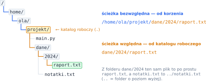
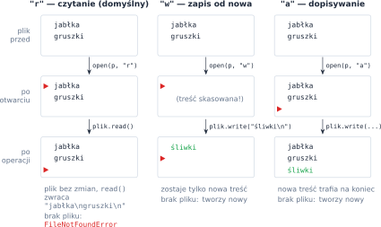
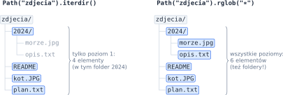
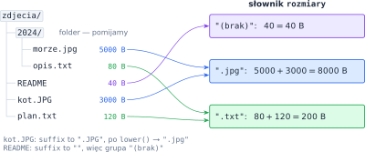

# Rozdział 20: Operacje na plikach — wprowadzenie

## Czego się nauczysz

* rozróżniać **ścieżki względne** i **bezwzględne** oraz posługiwać się modułem `pathlib`,
* otwierać pliki w trybach `"r"`, `"w"`, `"a"` i czytać je wiersz po wierszu,
* przeglądać zawartość folderu — tylko jeden poziom albo całe drzewo podfolderów,
* kopiować, przenosić i usuwać pliki oraz sprawdzać ich rozmiar.

## Ścieżki: względne i bezwzględne

Pliki i foldery tworzą **drzewo**: każdy folder może zawierać pliki i kolejne foldery. Położenie
pliku opisuje **ścieżka** — nazwy kolejnych folderów oddzielone separatorem `/`. Ścieżka
**bezwzględna** zaczyna się od korzenia drzewa (`/` w Linuksie i macOS, np. `C:\` w Windowsie).
Ścieżka **względna** zaczyna się od **katalogu roboczego** — folderu, w którym uruchomiono program.
Zapis `.` oznacza sam katalog roboczy, a `..` — folder o poziom wyżej.



Wygodnie pracuje się na ścieżkach z modułem `pathlib`. Obiekt `Path` „rozumie” budowę ścieżki,
a operator `/` dokleja do niej kolejne części:

```python
from pathlib import Path

p = Path("dane/2024/raport.txt")
print(p.name)                               # raport.txt
print(p.stem, p.suffix)                     # raport .txt
print(p.parent)                             # dane/2024
print(p.relative_to("dane").as_posix())     # 2024/raport.txt
print(Path("dane") / "2024" / "raport.txt") # dane/2024/raport.txt
print(p.exists(), p.is_file(), p.is_dir())  # True True False (gdy plik jest)
```

`suffix` to końcówka od **ostatniej** kropki (`Path("a.tar.gz").suffix` to `".gz"`), a dla nazwy
bez kropki — napis pusty. Metoda `as_posix()` zamienia ścieżkę na napis z separatorem `/` także
w Windowsie, gdzie separatorem jest `\`.

## Otwieranie, czytanie i zapisywanie

Plik otwiera funkcja `open(sciezka, tryb, encoding="utf-8")`. Tryb mówi, co zamierzasz zrobić
z plikiem i co stanie się z jego dotychczasową treścią:



Instrukcja `with` zamyka plik automatycznie, gdy skończy się wcięty blok — nawet jeśli w środku
wystąpi błąd (np. **wyjątek** `FileNotFoundError`, który można przechwycić blokiem `try` / `except`). Metoda `write()` **nie** dodaje znaku nowej linii, więc wpisujesz go sam (`"\n"`).
Pętla `for` po otwartym pliku daje kolejne wiersze **razem** z kończącym je znakiem `"\n"`:

```python
with open("zakupy.txt", "w", encoding="utf-8") as plik:   # nowy, pusty plik
    plik.write("jabłka\n")
    plik.write("gruszki\n")

with open("zakupy.txt", "a", encoding="utf-8") as plik:   # dopisywanie na końcu
    plik.write("śliwki\n")

with open("zakupy.txt", encoding="utf-8") as plik:        # tryb "r" — czytanie
    for numer, wiersz in enumerate(plik, start=1):
        print(numer, wiersz.rstrip("\n"))                 # 1 jabłka / 2 gruszki / 3 śliwki
```

Cały plik naraz wczytuje `plik.read()`. Na wiersze najlepiej podzielić go metodą `splitlines()`:
plik o treści `"ala\nma\n\nkota\n"` ma 4 wiersze, bo `"\n"` na samym końcu **kończy** ostatni
wiersz, a nie zaczyna nowego. Dla porównania `split("\n")` dałoby 5 elementów, z pustym napisem
na końcu. Plik z $w$ wierszami, z których każdy kończy się znakiem nowej linii, zawiera więc
dokładnie $w$ znaków `"\n"`.

> **Pamiętaj:** rozmiar pliku liczymy w **bajtach**, a nie w znakach. W kodowaniu UTF-8 litery
> łacińskie zajmują 1 bajt, a polskie litery — 2: `len("ąb")` to 2, ale `len("ąb".encode("utf-8"))`
> to 3. W zadaniach $1\,\text{kB} = 2^{10}\,\text{B} = 1024\,\text{B}$.

## Przeglądanie folderów i operacje na plikach

`Path(folder).iterdir()` zwraca tylko to, co leży **bezpośrednio** w folderze. Metoda
`rglob("*")` schodzi rekurencyjnie do wszystkich podfolderów, na dowolną głębokość (to samo
potrafi `os.walk()`). Obie zwracają zarówno pliki, jak i foldery, więc zwykle filtrujesz je
metodą `is_file()`. Kolejność zwracanych elementów zależy od systemu — jeśli wynik ma być
uporządkowany, posortuj go `sorted()`.



| Operacja | Kod |
|---|---|
| rozmiar w bajtach / usunięcie pliku | `p.stat().st_size` / `p.unlink()` (albo `os.path.getsize`, `os.remove`) |
| kopiowanie / przeniesienie pliku | `shutil.copy(zrodlo, cel)` / `shutil.move(zrodlo, cel)` |
| folder razem z nadrzędnymi | `os.makedirs(p, exist_ok=True)` |

> **Wskazówka:** jeśli w pętli zmieniasz, przenosisz albo usuwasz pliki, najpierw zbierz pełną listę
> ścieżek (`sorted(folder.rglob("*"))`), a dopiero potem po niej przechodź — zmienianie drzewa
> w trakcie przeglądania może sprawić, że któryś plik zostanie pominięty.

## Przykład rozwiązany: ile miejsca zajmuje każdy typ plików

**Zadanie.** Wczytaj ścieżkę folderu. Dla każdego rozszerzenia (bez względu na wielkość liter)
policz łączny rozmiar wszystkich plików z tym rozszerzeniem w folderze **i jego podfolderach**.
Pliki bez rozszerzenia zalicz do grupy `(brak)`. Wypisz wyniki posortowane według rozszerzenia,
w postaci `rozszerzenie: suma B`.

Potrzebujemy wszystkich plików z całego drzewa, więc użyjemy `rglob("*")`. Sumy trzymamy
w słowniku $\text{rozszerzenie} \to \text{bajty}$: dla każdego pliku $f$ dodajemy jego rozmiar
$|f|$ do sumy jego grupy, czyli dla grupy $g$ liczymy
$$S_g = \sum_{f \,\in\, g} |f|.$$



```python
from pathlib import Path

folder = Path(input())
if not folder.is_dir():
    print("Folder nie istnieje.")
else:
    rozmiary = {}                               # rozszerzenie -> suma bajtów
    for sciezka in folder.rglob("*"):           # wszystkie poziomy drzewa
        if sciezka.is_file():
            rozszerzenie = sciezka.suffix.lower() or "(brak)"
            rozmiar = sciezka.stat().st_size
            rozmiary[rozszerzenie] = rozmiary.get(rozszerzenie, 0) + rozmiar
    if not rozmiary:
        print("Brak plików.")
    for rozszerzenie in sorted(rozmiary):
        print(f"{rozszerzenie}: {rozmiary[rozszerzenie]} B")
```

Wyrażenie `sciezka.suffix.lower() or "(brak)"` daje `"(brak)"`, gdy rozszerzenie jest napisem
pustym (pusty napis działa w warunku jak `False`). Dla folderu z rysunku program wypisuje:

| Wyjście | Skąd się wzięło |
|---|---|
| `(brak): 40 B` | `README` (znak `(` ma mniejszy kod niż `.`, więc ta grupa jest pierwsza) |
| `.jpg: 8000 B` | `kot.JPG` (3000) + `2024/morze.jpg` (5000) |
| `.txt: 200 B` | `plan.txt` (120) + `2024/opis.txt` (80) |

## Typowe błędy

* **Otwarcie istniejącego pliku w trybie `"w"`**, gdy chcesz tylko coś dopisać — treść znika już
  w chwili otwarcia. Do dopisywania na końcu służy `"a"`; żeby dopisać coś na początku, wczytaj
  całość i zapisz plik od nowa.
* **Brak `encoding="utf-8"`.** Bez niego Python używa kodowania systemu (w Windowsie często innego)
  i polskie litery zamieniają się w „krzaczki” albo program zgłasza błąd.
* **Zapominanie o `"\n"`** przy `write()` — wszystkie wiersze sklejają się w jeden. W drugą stronę:
  wiersz wczytany pętlą `for` ma `"\n"` na końcu, więc `print(wiersz)` dołoży pustą linię; użyj
  `rstrip("\n")`.
* **Porównywanie rozszerzeń bez `lower()`** — `"zdjęcie.PNG"` ma rozszerzenie `".PNG"`, a nie `".png"`.
* **Traktowanie folderu jak pliku.** `rglob("*")` zwraca też foldery, a folder może się nazywać
  np. `stare.txt`. Sprawdzaj `is_file()`, a ścieżki wypisuj przez `relative_to(...)` i `as_posix()`.
