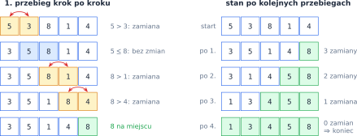
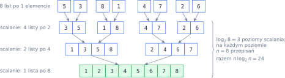
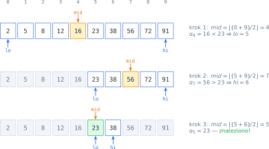
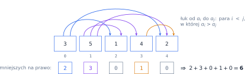

# Rozdział 21: Sortowanie i wyszukiwanie — algorytmy — wprowadzenie

## Czego się nauczysz

* jak działają proste algorytmy sortowania: **bąbelkowe**, **przez wybieranie** i **przez wstawianie**,
* na czym polega zasada **dziel i zwyciężaj** w sortowaniu przez scalanie i sortowaniu szybkim,
* jak sortować bez porównań — przez **zliczanie**,
* jak w posortowanej liście znaleźć element w $O(\log n)$ krokach — **wyszukiwanie binarne**,
* jak porównywać algorytmy za pomocą **złożoności** $O(\ldots)$.

## Proste sortowania: zamiany sąsiadów, wybieranie, wstawianie

**Sortowanie bąbelkowe** przechodzi po liście i porównuje sąsiednie elementy `a[j]` i `a[j + 1]`.
Jeśli stoją w złej kolejności, zamienia je miejscami — w Pythonie jedną instrukcją
`a[j], a[j + 1] = a[j + 1], a[j]`. Jedno takie przejście to **przebieg**. Największy element
„wypływa” w nim jak bąbelek na koniec listy i już tam zostaje:



Każdy algorytm sortowania ma swój **niezmiennik** — zdanie, które jest prawdziwe po każdym kroku:

| Algorytm | Krok | Niezmiennik po kroku $k$ |
|---|---|---|
| bąbelkowe | przebieg z zamianami sąsiadów | ostatnie $k$ elementów to $k$ największych, na swoich miejscach |
| przez wybieranie | wybierz minimum z `a[k:]`, zamień z `a[k]` | `a[0..k]` to $k + 1$ najmniejszych elementów, posortowane |
| przez wstawianie | wstaw `a[k]` w posortowany fragment po lewej | `a[0..k]` jest posortowany (choć to jeszcze nie ostateczne miejsca) |

Wszystkie trzy w najgorszym przypadku porównują prawie każdą parę elementów. W pierwszym
przebiegu jest $n - 1$ porównań, w drugim $n - 2$ i tak dalej, czyli razem
$$(n-1) + (n-2) + \ldots + 1 = \sum_{k=1}^{n-1} k = \frac{n(n-1)}{2} \approx \frac{n^2}{2}.$$
Mówimy, że mają **złożoność** $O(n^2)$: dwa razy dłuższa lista oznacza mniej więcej cztery razy
więcej pracy.

## Dziel i zwyciężaj: scalanie i sortowanie szybkie

Szybsze algorytmy dzielą problem na mniejsze części, rozwiązują je **rekurencyjnie** i składają
wynik. **Sortowanie przez scalanie** dzieli listę na pół, aż zostaną listy jednoelementowe (te są
posortowane), a potem **scala** pary posortowanych list. Scalanie jest tanie: wystarczy
porównywać najmniejsze jeszcze niewzięte elementy obu list, bo to one są na ich początkach.



Jeśli $T(n)$ to czas sortowania $n$ elementów, to
$$T(n) = 2\,T\!\left(\frac{n}{2}\right) + n, \qquad T(1) = 1.$$
Dzielenie na pół kończy się po $\log_2 n$ poziomach, a na każdym poziomie scalanie kosztuje
łącznie $n$ — stąd $T(n) \approx n\,\log_2 n$, czyli $O(n\,\log n)$.

**Sortowanie szybkie** (*quicksort*) dzieli inaczej: wybiera element **osiowy** (*pivot*)
i rozdziela pozostałe na mniejsze i większe od niego. Potem sortuje obie grupy rekurencyjnie
i skleja wynik. Gdy pivot dzieli listę mniej więcej na pół, czas wynosi $O(n\,\log n)$. Gdy pivot
jest zawsze najmniejszy (np. pierwszy element listy już posortowanej), jedna z grup jest pusta
i $T(n) = T(n-1) + n$, co daje znowu $O(n^2)$.

**Sortowanie przez zliczanie** w ogóle nie porównuje elementów. Gdy liczby są całkowite z małego
przedziału $[0, k]$, wystarczy policzyć, ile razy wystąpiła każda wartość, i wypisać je po kolei.
Kosztuje to $O(n + k)$ — dla małego $k$ mniej niż $O(n\,\log n)$.

## Wyszukiwanie binarne

W liście **posortowanej** nie trzeba przeglądać elementów po kolei. Porównujemy szukany klucz
$x$ z elementem środkowym `a[mid]`. Jeśli `a[mid] < x`, klucz może leżeć tylko na prawo od środka;
jeśli `a[mid] > x` — tylko na lewo. Każde porównanie **odrzuca połowę** przeszukiwanego fragmentu
`a[lo..hi]`:



Po $k$ porównaniach zostaje co najwyżej $\frac{n}{2^k}$ kandydatów. Fragment staje się pusty, gdy
$\frac{n}{2^k} < 1$, czyli $k > \log_2 n$ — dlatego porównań jest najwyżej
$\lfloor \log_2 n \rfloor + 1$. Dla miliona elementów to 20 porównań zamiast miliona.

| $n$ | $\log_2 n$ | $n\,\log_2 n$ | $n^2$ |
|---|---|---|---|
| $10$ | $\approx 3{,}3$ | $\approx 33$ | $100$ |
| $1000$ | $\approx 10$ | $\approx 10^4$ | $10^6$ |
| $10^6$ | $\approx 20$ | $\approx 2 \cdot 10^7$ | $10^{12}$ |

> **Ciekawostka:** żaden algorytm, który sortuje wyłącznie przez porównywanie par elementów, nie
> może być w najgorszym przypadku szybszy niż $O(n\,\log n)$: musi odróżnić wszystkie $n!$ ustawień
> listy, a $\log_2 (n!) \approx n\,\log_2 n$. Sortowanie przez zliczanie omija to ograniczenie, bo nie
> porównuje.

## Przykład rozwiązany: liczba inwersji

**Zadanie.** Wczytaj $n$ i listę $n$ liczb całkowitych. Wypisz liczbę **inwersji**, czyli par
indeksów $(i, j)$, w których większy element stoi przed mniejszym:
$$\text{inw}(a) = \left|\{(i, j) : i < j \land a_i > a_j\}\right|.$$

Liczba inwersji mierzy, „jak bardzo” lista jest nieposortowana: lista rosnąca ma ich $0$,
a malejąca — najwięcej, $\binom{n}{2} = \frac{n(n-1)}{2}$. Co więcej, **każda zamiana sąsiadów
w sortowaniu bąbelkowym usuwa dokładnie jedną inwersję**, więc liczba inwersji to dokładnie liczba
zamian, które wykona to sortowanie.

Narysujmy wszystkie inwersje listy `[3, 5, 1, 4, 2]` jako łuki:



Dla każdego elementu $a_i$ liczymy, ile elementów na prawo od niego jest mniejszych, i sumujemy:
$$\text{inw}(a) = \sum_{i=0}^{n-1} \left|\{j > i : a_j < a_i\}\right| = 2 + 3 + 0 + 1 + 0 = 6.$$

```python
n = int(input())
a = [int(x) for x in input().split()]
inwersje = 0
for i in range(n):
    for j in range(i + 1, n):     # tylko pary z j > i
        if a[i] > a[j]:
            inwersje += 1
print(inwersje)
```

Dla wejścia `5` / `3 5 1 4 2` program wypisuje `6`. Pętla wewnętrzna wykonuje się
$\frac{n(n-1)}{2}$ razy, więc to rozwiązanie $O(n^2)$. (Da się to zrobić w $O(n\,\log n)$: inwersje
można zliczać przy okazji sortowania przez scalanie.)

## Typowe błędy

* **Wyjście poza listę** przy porównywaniu sąsiadów: w pętli po `j` z `a[j + 1]` ostatnim
  indeksem może być `n - 2`, więc pętla to `range(n - 1)` (albo krótsza), a nie `range(n)`.
* **Gubienie elementu przy zamianie** — `a[j] = a[j + 1]` i potem `a[j + 1] = a[j]` daje dwa razy
  ten sam element. Używaj zamiany krotką albo zmiennej pomocniczej.
* **Brak warunku końca rekurencji** w scalaniu i sortowaniu szybkim — lista o długości $0$ lub $1$
  jest już posortowana i trzeba ją po prostu zwrócić.
* **Wyszukiwanie binarne na nieposortowanej liście** — wynik jest wtedy przypadkowy.
* **Złe granice w wyszukiwaniu binarnym**: `lo = mid` zamiast `lo = mid + 1` może zapętlić program,
  a warunek `lo < hi` zamiast `lo <= hi` pomija sprawdzenie fragmentu jednoelementowego.
