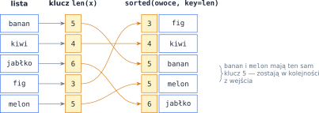
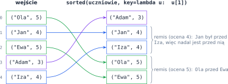
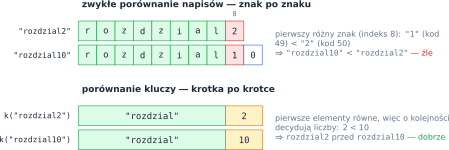

# Rozdział 22: Sortowanie — praktyka — wprowadzenie

## Czego się nauczysz

* czym różnią się `sorted()` i `list.sort()` oraz jak sortować malejąco (`reverse=True`),
* jak Python porównuje napisy — według **kodów Unicode**,
* jak sortować według własnego kryterium: parametr `key=` i funkcje `lambda`,
* jak sortować według kilku kryteriów naraz za pomocą **krotek**,
* co to znaczy, że sortowanie jest **stabilne**, i jak z tego korzystać.

## `sorted()` i `list.sort()`

Python ma dwa narzędzia do sortowania. Funkcja `sorted()` przyjmuje dowolny ciąg (listę, napis,
klucze słownika) i zwraca **nową** posortowaną listę. Metoda `lista.sort()` sortuje listę
**w miejscu** i zwraca `None`. Obie przyjmują parametr `reverse=True` — porządek malejący.

```python
liczby = [5, 2, 9, 1]
print(sorted(liczby))                 # [1, 2, 5, 9] — nowa lista
print(liczby)                         # [5, 2, 9, 1] — bez zmian
print(liczby.sort(reverse=True))      # None — sort() zmienia listę w miejscu
print(liczby)                         # [9, 5, 2, 1]
print(sorted(["kot", "Ala", "ćma", "zebra"]))   # ['Ala', 'kot', 'zebra', 'ćma']
print(ord("A"), ord("a"), ord("z"), ord("ć"))   # 65 97 122 263
```

Napisy są porównywane **znak po znaku** według kodów, które zwraca `ord()`. Decyduje pierwsza
pozycja, na której napisy się różnią, a jeśli jeden napis jest początkiem drugiego, krótszy jest
mniejszy. Dlatego `"Ala" < "kot"` (bo $65 < 107$), `"zebra" < "ćma"` (bo $122 < 263$),
a `"kot" < "kota"`. Spacja ma kod $32$, cyfry $48$–$57$, wielkie litery $65$–$90$, małe $97$–$122$,
a polskie litery jeszcze więcej.

Sortowanie wbudowane działa w czasie $O(n\,\log n)$. Po posortowaniu elementy równe albo bliskie
sobie stoją **obok siebie** — wiele zadań rozwiązuje się więc schematem „posortuj, a potem przejdź
raz po liście i porównuj sąsiadów”.

## Własne kryterium: parametr `key`

Parametr `key` to **funkcja**, która dla każdego elementu $x$ wylicza jego **klucz** $k(x)$.
Python porównuje klucze, a nie same elementy, i ustawia elementy tak, żeby
$$k(x_0) \le k(x_1) \le \ldots \le k(x_{n-1}).$$
Każdy klucz jest liczony tylko raz, na początku sortowania.



```python
owoce = ["banan", "kiwi", "jabłko", "fig", "melon"]
print(sorted(owoce, key=len))                # ['fig', 'kiwi', 'banan', 'melon', 'jabłko']
print(sorted(["b", "A", "c"], key=str.lower))  # ['A', 'b', 'c']
print(sorted(owoce, key=lambda s: s[-1]))    # według ostatniej litery
```

Jako klucz można podać gotową funkcję (`len`, `str.lower`, `abs`) albo funkcję napisaną samodzielnie
przez `def`. Krótkie funkcje wygodnie zapisać jako **lambdę**: `lambda s: s[-1]` to funkcja bez nazwy,
która dla argumentu `s` zwraca `s[-1]`. Tak samo sortujesz obiekty — np.
`sorted(miasta, key=lambda m: m.nazwa)`.

## Kilka kryteriów: krotki i stabilność

Krotki są porównywane **leksykograficznie**: najpierw pierwsze elementy, a przy remisie kolejne.
Dla par oznacza to
$$(a_1, a_2) < (b_1, b_2) \iff a_1 < b_1 \lor (a_1 = b_1 \land a_2 < b_2).$$
Jeśli więc klucz zwraca krotkę, pierwszy jej element jest kryterium głównym, a następne
rozstrzygają remisy. Gdy kryterium liczbowe ma być **malejące**, wystarczy zanegować liczbę,
bo $a < b \iff -a > -b$:

```python
uczniowie = [("Ola", 5), ("Jan", 4), ("Ewa", 5), ("Adam", 3), ("Iza", 4)]
print(sorted(uczniowie, key=lambda u: (-u[1], u[0])))
# [('Ewa', 5), ('Ola', 5), ('Iza', 4), ('Jan', 4), ('Adam', 3)] — ocena malejąco, imię rosnąco
```

Sortowanie w Pythonie jest **stabilne**: elementy o równych kluczach zostają w tej kolejności,
w jakiej były na wejściu. Nie trzeba więc dopisywać do klucza „numeru na wejściu” — remisy
rozstrzygają się same.



> **Wskazówka:** dzięki stabilności można sortować kilka razy, **od kryterium najmniej ważnego do
> najważniejszego**: jeśli `imie` i `ocena` to funkcje-klucze, `sorted(sorted(u, key=imie), key=ocena)`
> daje to samo, co klucz-krotka `(ocena, imie)`. Stabilność zachowuje też `reverse=True` — elementy równe nie zamieniają się
> wtedy miejscami.

## Przykład rozwiązany: sortowanie naturalne nazw plików

**Zadanie.** Wczytaj $n$ i $n$ nazw. Każda nazwa to litery, po których następuje liczba, np.
`rozdzial10`. Wypisz nazwy w porządku **naturalnym**: najpierw według części literowej, a przy
równej części literowej — według **wartości** liczby.

Zwykłe `sorted()` porównuje znaki, więc `"rozdzial10" < "rozdzial2"` (bo `"1" < "2"`) —
rozdział 10 wypada przed rozdziałem 2. Rozwiązaniem jest klucz, który dzieli nazwę na dwie części
i zamienia drugą na liczbę: $k(\texttt{rozdzial10}) = (\texttt{"rozdzial"}, 10)$. Krotki porównają
najpierw napisy, a potem liczby — jako liczby.



```python
def klucz(nazwa):
    i = len(nazwa)
    while i > 0 and nazwa[i - 1].isdigit():   # cofamy się po cyfrach z końca
        i -= 1
    return (nazwa[:i], int(nazwa[i:]))


n = int(input())
nazwy = [input() for _ in range(n)]
for nazwa in sorted(nazwy, key=klucz):
    print(nazwa)
```

Indeks `i` cofa się od końca nazwy, dopóki stoją tam cyfry, więc `nazwa[:i]` to część literowa,
a `nazwa[i:]` — liczba. Sprawdźmy program na sześciu nazwach:

| Wejście | Klucz | Zwykłe `sorted()` | `sorted(…, key=klucz)` |
|---|---|---|---|
| `rozdzial10` | `('rozdzial', 10)` | `aneks1` | `aneks1` |
| `rozdzial2` | `('rozdzial', 2)` | `aneks12` | `aneks3` |
| `aneks1` | `('aneks', 1)` | `aneks3` | `aneks12` |
| `rozdzial1` | `('rozdzial', 1)` | `rozdzial1` | `rozdzial1` |
| `aneks12` | `('aneks', 12)` | `rozdzial10` | `rozdzial2` |
| `aneks3` | `('aneks', 3)` | `rozdzial2` | `rozdzial10` |

## Typowe błędy

* **`lista = lista.sort()`** — metoda `sort()` zwraca `None`, więc tracisz listę. Pisz albo
  `lista.sort()`, albo `lista = sorted(lista)`.
* **Wywołanie funkcji w `key`**: `key=len()` albo `key=klucz(x)` to błąd — podajesz samą funkcję,
  bez nawiasów: `key=len`, `key=klucz`.
* **Liczby zapisane jako napisy** sortują się „po znakach”: `sorted(["10", "9", "100"])` daje
  `['10', '100', '9']`. Zamień je na `int` przed sortowaniem albo w kluczu.
* **Negowanie napisu** w kluczu (`-imie`) — to błąd, bo napisów nie da się zanegować. Gdy malejąco
  ma być sortowany napis, posortuj dwa razy (stabilność!) z `reverse=True` w odpowiednim kroku.
* **Zapominanie o wielkości liter** — `"Zosia" < "adam"`, bo wielkie litery mają mniejsze kody.
  Jeśli wielkość liter nie ma znaczenia, użyj `key=str.lower`.
