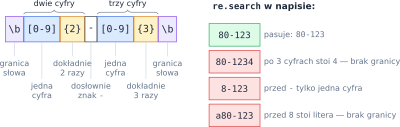
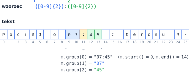
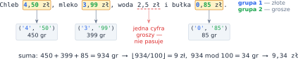

# Rozdział 23: Wyrażenia regularne — wprowadzenie

## Czego się nauczysz

* czytać i budować **wzorce**: klasy znaków, kwantyfikatory, kotwice i granice słów,
* używać funkcji modułu `re`: `search`, `fullmatch`, `findall`, `sub`, `split`,
* wyciągać fragmenty dopasowania za pomocą **grup** `( )` i odwoływać się do nich przy zamianie,
* unikać typowych pułapek: zachłanności, znaków specjalnych w danych, `\d` z cyframi spoza `0–9`.

## Wzorzec opisuje zbiór napisów

**Wyrażenie regularne** (wzorzec) to napis, który opisuje cały **zbiór** napisów. Wzorzec `kot`
pasuje tylko do napisu `kot`, ale `k.t` pasuje do `kot`, `kit`, `k9t` — kropka oznacza dowolny znak.
Wzorce zapisujemy jako **surowe napisy** `r"..."`, żeby Python nie interpretował po swojemu
ukośników, np. w `r"\b"`.

Każdy element wzorca dopasowuje **jeden znak** — chyba że stoi za nim **kwantyfikator**, który
mówi, ile razy element ma się powtórzyć:

| Zapis | Znaczenie | Zapis | Liczba powtórzeń $k$ |
|---|---|---|---|
| `.` | dowolny znak (oprócz `\n`) | `X*` | $k \ge 0$ |
| `[abc]`, `[a-z]` | jeden znak z listy / z zakresu | `X+` | $k \ge 1$ |
| `[^0-9]` | jeden znak **spoza** klasy | `X?` | $k \in \{0, 1\}$ |
| `\d`, `\w`, `\s` | cyfra, znak słowa (litera, cyfra, `_`), biały znak | `X{m}` | $k = m$ |
| `\D`, `\W`, `\S` | dowolny znak **oprócz** cyfry / znaku słowa / białego | `X{m,n}` | $m \le k \le n$ |
| `^`, `$` | początek / koniec napisu | `X{m,}` | $k \ge m$ |

Do tego: `A|B` to **alternatywa** („A albo B”), a `\b` oznacza **granicę słowa** — miejsce między
znakiem słowa a znakiem, który nim nie jest (albo początkiem lub końcem napisu). `\b` nie zjada
żadnego znaku, tylko sprawdza położenie. Znaki o specjalnym znaczeniu (`. * + ? ( ) [ ] { } | \ ^ $`)
poprzedzasz `\`, gdy chcesz je dopasować dosłownie: `\.` to kropka.



## Funkcje modułu `re`

```python
import re

tekst = "Ul. Długa 12, 80-123 Gdańsk"
print(re.search(r"[0-9]+", tekst).group())   # 12 — pierwsze dopasowanie
print(re.findall(r"[0-9]+", tekst))          # ['12', '80', '123'] — wszystkie
print(re.fullmatch(r"[0-9]+", tekst))        # None — cały napis to nie same cyfry
print(re.sub(r"[0-9]", "#", tekst))          # Ul. Długa ##, ##-### Gdańsk
print(re.split(r",\s*", tekst))              # ['Ul. Długa 12', '80-123 Gdańsk']
```

* `re.search(w, t)` szuka **pierwszego** miejsca w `t`, gdzie pasuje wzorzec, i zwraca obiekt
  dopasowania (albo `None`). `m.group()` to dopasowany tekst, a `m.start()` i `m.end()` — jego
  granice: dopasowanie zajmuje `t[m.start():m.end()]`.
* `re.fullmatch(w, t)` sprawdza, czy pasuje **cały** napis — to narzędzie do walidacji
  (czy to jest poprawny e-mail, PESEL, data…). `re.match` sprawdza tylko **początek** napisu.
* `re.findall(w, t)` zwraca listę **wszystkich** dopasowań. Szukanie idzie od lewej do prawej,
  a kolejne dopasowanie zaczyna się dopiero **za** poprzednim — dopasowania na siebie nie nachodzą.
* `re.sub(w, zamiennik, t)` zamienia każde dopasowanie; `re.split(w, t)` dzieli napis w miejscach
  dopasowań.

Kwantyfikatory są **zachłanne**: biorą tyle znaków, ile się da. Dlatego `[0-9]+` w `"123"`
dopasowuje całe `123`, a nie samo `1`.

## Grupy

Nawiasy `( )` tworzą **grupę**. Grupy są numerowane od 1 w kolejności **nawiasów otwierających**,
a grupa 0 to całe dopasowanie. Dzięki nim z jednego dopasowania wyciągasz kilka części naraz:



```python
m = re.search(r"([0-9]{2}):([0-9]{2})", "Pociąg o 07:45 z peronu 3.")
print(m.group(0), m.group(1), m.group(2))    # 07:45 07 45
print(re.findall(r"([0-9]{2}):([0-9]{2})", "07:45 i 18:05"))   # [('07', '45'), ('18', '05')]
print(re.sub(r"([0-9]{2}):([0-9]{2})", r"\1.\2", "07:45 i 18:05"))  # 07.45 i 18.05
```

Gdy wzorzec ma grupy, `findall` zwraca **krotki** grup, a nie całe dopasowania. W napisie
zastępczym `re.sub` fragment grupy wstawiasz zapisem `\1`, `\2`… (albo `\g<1>`, `\g<2>`…). Grupę można też
nazwać: `(?P<godz>[0-9]{2})` i odczytać przez `m.group("godz")`.

> **Pułapka:** jeśli wzorzec budujesz z danych wczytanych od użytkownika, przepuść je przez
> `re.escape()`. Inaczej słowo `c++` albo `a.b` zostanie potraktowane jak wzorzec (`+` i `.` mają
> specjalne znaczenie).

## Przykład rozwiązany: suma kwot w tekście

**Zadanie.** Wczytaj linię tekstu i zsumuj wszystkie kwoty zapisane w postaci `Z,GG zł`: liczba
złotych, przecinek, **dokładnie dwie** cyfry groszy, spacja i `zł`. Wypisz sumę w tej samej postaci.

**Wzorzec.** Złote to co najmniej jedna cyfra: `[0-9]+`; grosze — dokładnie dwie: `[0-9]{2}`. Obie
części ujmujemy w grupy, żeby osobno je odczytać, a przed złotymi stawiamy `\b`, żeby kwota nie
zaczynała się w środku słowa. Cały wzorzec to `\b([0-9]+),([0-9]{2}) zł`.



**Obliczenia.** Liczby z przecinkiem łatwo zsumować z błędem zaokrągleń (w Pythonie
`0.1 + 0.2` to `0.30000000000000004`), dlatego liczymy w **groszach**, na liczbach całkowitych:
kwota $Z{,}GG$ to $100 \cdot Z + GG$ groszy. Sumę $S$ zamieniamy z powrotem na złote i grosze
dzieleniem z resztą: $Z = \lfloor S / 100 \rfloor$, $GG = S \bmod 100$.

```python
import re

tekst = input()
suma = 0                                          # w groszach
for zlote, grosze in re.findall(r"\b([0-9]+),([0-9]{2}) zł", tekst):
    suma += int(zlote) * 100 + int(grosze)
print(f"{suma // 100},{suma % 100:02d} zł")
```

| Dopasowanie | `zlote`, `grosze` | Grosze | `suma` |
|---|---|---|---|
| `4,50 zł` | `'4'`, `'50'` | $450$ | $450$ |
| `3,99 zł` | `'3'`, `'99'` | $399$ | $849$ |
| `0,85 zł` | `'0'`, `'85'` | $85$ | $934$ |

Program wypisuje `9,34 zł`. Format `:02d` dopisuje zero z przodu, gdy groszy jest mniej niż 10
(np. `5,07 zł`, a nie `5,7 zł`).

## Typowe błędy

* **`re.search` albo `re.match` zamiast `re.fullmatch` przy walidacji** — `re.search(r"[0-9]+", "12a")`
  znajduje `12` i „przepuszcza” napis z literą.
* **Brak `r` przed wzorcem.** W zwykłym napisie `"\b"` to znak cofnięcia (backspace), a nie granica
  słowa. Pisz zawsze `r"\b"`.
* **`\d` zamiast `[0-9]`.** W Pythonie `\d` pasuje też do cyfr innych pism (np. `٣`). Gdy dozwolone
  są tylko cyfry `0–9`, użyj klasy `[0-9]`.
* **Zachłanność.** `<.+>` w napisie `<a><b>` dopasowuje całe `<a><b>`. Kwantyfikator z `?` (`<.+?>`)
  bierze jak najmniej znaków i daje osobno `<a>` i `<b>`.
* **Myślnik w środku klasy** — `[+-/]` to zakres od `+` do `/`, a nie trzy znaki. Myślnik stawiaj na
  końcu klasy: `[+/-]`.
* **Oczekiwanie całych dopasowań z `findall`**, gdy wzorzec ma grupy — dostaniesz krotki grup.
  Grupę, której nie chcesz zapamiętywać, zapisz jako `(?:...)`.
