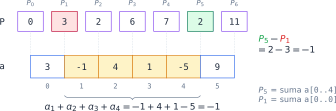
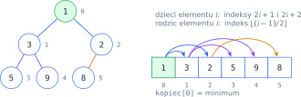
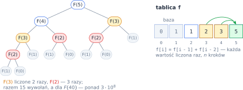
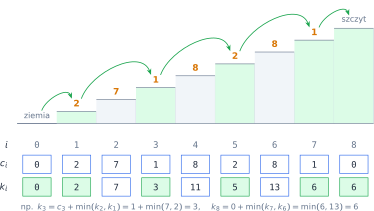

# Rozdział 24: Listy — zadania dodatkowe — wprowadzenie

## Czego się nauczysz

* szacować, czy algorytm zdąży się wykonać — porównywać $O(n)$, $O(n\,\log n)$, $O(n^2)$ i $O(2^n)$,
* liczyć sumy dowolnych fragmentów listy w czasie $O(1)$ dzięki **sumom prefiksowym**,
* przekształcać listę **w miejscu** techniką **dwóch wskaźników**,
* korzystać z **kopca** (`heapq`), gdy wielokrotnie potrzebujesz najmniejszego elementu,
* rozwiązywać problemy **programowaniem dynamicznym**: zapamiętywać wyniki mniejszych podproblemów.

## Sumy prefiksowe

W zadaniach z tego rozdziału listy mają nawet $10^5$ elementów. Algorytm $O(n^2)$ wykonałby wtedy
około $10^{10}$ kroków — o wiele za dużo, bo Python robi ich rzędu $10^7$ na sekundę. Trzeba więc
unikać liczenia tego samego wiele razy.

Typowy przykład: suma fragmentu `a[i..j]`. Liczona pętlą kosztuje $O(n)$, a przy wielu fragmentach
— $O(n^2)$. Zamiast tego raz liczymy **sumy prefiksowe** — sumy początkowych fragmentów listy:
$$P_0 = 0, \qquad P_{i+1} = P_i + a_i, \qquad \text{czyli} \qquad P_i = \sum_{k=0}^{i-1} a_k.$$
$P_i$ to suma elementów **przed** indeksem $i$. Suma fragmentu to różnica dwóch prefiksów — dłuższy
prefiks minus krótszy:
$$\sum_{k=i}^{j} a_k = P_{j+1} - P_i.$$



```python
a = [3, -1, 4, 1, -5, 9]
P = [0]
for x in a:
    P.append(P[-1] + x)
print(P)                     # [0, 3, 2, 6, 7, 2, 11]
i, j = 1, 4
print(P[j + 1] - P[i])       # -1 = suma a[1] + ... + a[4]
```

Ta sama idea działa dla innych działań: **maksima prefiksowe** $L_i = \max(L_{i-1}, a_i)$ dają
w jednym przejściu największy element na lewo od każdej pozycji. Przydatna jest też obserwacja:
jeśli $P_i = P_j$ dla $i < j$, to fragment `a[i..j-1]` ma sumę $0$.

## Dwa wskaźniki i zmiany w miejscu

Wiele przekształceń da się zrobić bez tworzenia nowej listy — dwoma indeksami, które przesuwają się
po liście. Indeksy mogą iść **naprzeciw siebie** (od obu końców) albo **w tę samą stronę** (jeden
czyta, drugi zapisuje). Każdy z nich przechodzi listę raz, więc całość kosztuje $O(n)$:

```python
a = [1, 2, 3, 4, 5]
l, p = 0, len(a) - 1         # wskaźniki na oba końce
while l < p:
    a[l], a[p] = a[p], a[l]
    l += 1
    p -= 1
print(a)                     # [5, 4, 3, 2, 1]
```

## Kopiec: zawsze pod ręką najmniejszy element

**Kopiec** (ang. *heap*) to lista ułożona tak, że każdy element jest nie większy od swoich
„dzieci”. Element o indeksie $i$ ma dzieci o indeksach $2i + 1$ i $2i + 2$, a rodzica
o indeksie $\lfloor (i-1)/2 \rfloor$. Warunek kopca to
$$a_i \le a_{2i+1} \quad \text{oraz} \quad a_i \le a_{2i+2},$$
więc najmniejszy element leży zawsze na pozycji $0$. Kopiec nie jest posortowany — uporządkowane
są tylko pary rodzic–dziecko.



Moduł `heapq` pilnuje warunku kopca za Ciebie: `heapq.heappush(kopiec, x)` dokłada element,
a `heapq.heappop(kopiec)` zdejmuje najmniejszy. Obie operacje kosztują $O(\log n)$, bo element
wędruje w górę lub w dół drzewa o wysokości $\lfloor \log_2 n \rfloor$. Na przykład po dołożeniu
kolejno `5, 3, 8, 1, 9, 2` lista ma postać `[1, 3, 2, 5, 9, 8]` (jak na rysunku), a `heappop`
zwraca `1` i zostawia `[2, 3, 8, 5, 9]`. Do kopca można też wkładać krotki — porównywane są wtedy
ich pierwsze elementy.

## Programowanie dynamiczne

Wiele problemów rozkłada się na mniejsze podproblemy **tego samego rodzaju**. Rekurencja wprost
z definicji bywa jednak bardzo wolna, bo te same podproblemy rozwiązuje wiele razy. Liczby
Fibonacciego $F_n = F_{n-1} + F_{n-2}$ liczone rekurencyjnie wymagają wykładniczo wielu wywołań:



**Programowanie dynamiczne** zapamiętuje wynik każdego podproblemu w tablicy i liczy go tylko
raz. Projektując takie rozwiązanie, odpowiadasz na cztery pytania:

1. **Stan:** co oznacza `t[i]`? (np. „najlepszy wynik dla pierwszych $i$ elementów”),
2. **Przejście:** jak policzyć `t[i]` z wcześniejszych wartości? (wzór rekurencyjny),
3. **Przypadki bazowe:** które wartości znamy od razu?
4. **Kolejność:** w jakiej kolejności wypełniać tablicę, żeby potrzebne wartości były już gotowe?

## Przykład rozwiązany: najtańsze wejście po schodach

**Zadanie.** Schody mają $n$ stopni; wejście na stopień $i$ kosztuje $c_i$ (dla $i = 1, \ldots, n$).
Zaczynasz na ziemi i w każdym ruchu wchodzisz o **jeden albo dwa** stopnie w górę. Płacisz za każdy
stopień, na którym stanąłeś. Ile najmniej zapłacisz, żeby wejść na szczyt (ponad stopień $n$)?

Ścieżek jest bardzo dużo (tyle, ile wynosi liczba Fibonacciego $F_{n+2}$), więc nie sprawdzamy
wszystkich. Zauważ, że na stopień $i$ można wejść **tylko** ze stopnia $i - 1$ albo $i - 2$.
Oznaczmy ziemię jako stopień $0$, szczyt jako stopień $n + 1$ i przyjmijmy $c_0 = c_{n+1} = 0$.

* **Stan:** $k_i$ — najmniejszy koszt dojścia na stopień $i$ (razem z opłatą za ten stopień).
* **Przejście:** $k_i = c_i + \min(k_{i-1},\, k_{i-2})$ dla $i \ge 2$.
* **Przypadki bazowe:** $k_0 = 0$, $k_1 = c_1$.
* **Kolejność:** rosnąco po $i$; wynikiem jest $k_{n+1}$.



```python
n = int(input())
c = [0] + [int(x) for x in input().split()] + [0]   # ziemia i szczyt nic nie kosztują
k = [0] * (n + 2)            # k[i] — najmniejszy koszt dojścia na stopień i
k[1] = c[1]
for i in range(2, n + 2):
    k[i] = c[i] + min(k[i - 1], k[i - 2])
print(k[n + 1])
```

Dla wejścia `7` / `2 7 1 8 2 8 1` program wypisuje `6` — tablica `k` jest na rysunku. Najtańsza
droga to stopnie $1 \to 3 \to 5 \to 7 \to$ szczyt, czyli $2 + 1 + 2 + 1 = 6$. Program wykonuje jedną
pętlę, więc działa w czasie $O(n)$ zamiast wykładniczego.

## Typowe błędy

* **Przesunięcie o jeden w sumach prefiksowych.** Lista `P` ma $n + 1$ elementów, a suma `a[i..j]`
  to `P[j + 1] - P[i]`, a nie `P[j] - P[i]`. Sprawdzaj wzór na fragmencie jednoelementowym ($i = j$).
* **Rozwiązanie „na próbę wszystkich możliwości”** — dla $n = 1000$ trójek jest ponad $10^8$,
  a podzbiorów $2^{1000}$. Zanim zaczniesz pisać, oszacuj liczbę kroków.
* **Usuwanie elementów z listy w trakcie pętli po niej** — pętla pomija wtedy elementy. Przepisuj
  elementy na nowe pozycje (dwa wskaźniki) albo buduj nową listę.
* **Oczekiwanie, że kopiec jest posortowany.** Tylko `kopiec[0]` jest najmniejszy; kolejne
  najmniejsze elementy zdejmuj przez `heappop`.
* **Zła kolejność wypełniania tablicy DP** albo brak przypadków bazowych — wtedy `k[i - 2]` dla
  `i = 1` to `k[-1]`, czyli **ostatni** element listy, a nie błąd.
