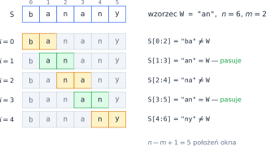
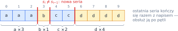
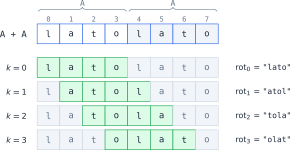
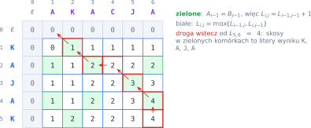

# Rozdział 25: Napisy — zadania dodatkowe — wprowadzenie

## Czego się nauczysz

* przeszukiwać napis „oknem” — porównywać wzorzec z kolejnymi wycinkami `S[i:i + m]`,
* wykrywać **serie** jednakowych znaków i granice między nimi,
* opisywać **rotacje** napisu wzorem i znajdować je w napisie `A + A`,
* rozwiązywać problemy na dwóch napisach **programowaniem dynamicznym** na tablicy dwuwymiarowej.

## Okno przesuwane po napisie

Wiele zadań na napisach sprowadza się do pytania: czy w miejscu $i$ napisu $S$ zaczyna się wzorzec $W$?
Jeśli $|S| = n$ i $|W| = m$, to sprawdzamy, czy $S_{i+t} = W_t$ dla wszystkich $t = 0, 1, \ldots, m-1$ —
w Pythonie krótko: `S[i:i + m] == W`. Takie „okno” długości $m$ przesuwamy po napisie. Możliwych
położeń początku jest $n - m + 1$ (od $i = 0$ do $i = n - m$); gdy $m > n$, nie ma żadnego.



Jedno porównanie okna kosztuje do $m$ porównań znaków, więc sprawdzenie wszystkich położeń zajmuje
$O((n - m + 1) \cdot m)$, czyli najwyżej $O(n \cdot m)$. Po znalezieniu wzorca możesz albo przejść do
pozycji $i + 1$ (wtedy znajdziesz też wystąpienia nachodzące na siebie, jak `ana` w `banana`), albo
**przeskoczyć** całe wystąpienie, do pozycji $i + m$ (wtedy wystąpienia się nie nakładają — tak działa
zamiana i usuwanie). Wybór zależy od treści zadania.

> **Uwaga:** wycinek nie zgłasza błędu, gdy wychodzi poza napis — `"abc"[2:5]` to po prostu `"c"`.
> Za to indeks już tak: `"abc"[5]` kończy program błędem `IndexError`. Porównując znak po znaku,
> najpierw sprawdź, czy długości na to pozwalają.

## Serie znaków

**Seria** to najdłuższy ciąg jednakowych znaków stojących obok siebie. Napis `aaabccdddd` składa się
z czterech serii. Nowa seria zaczyna się na pozycji $i > 0$ wtedy i tylko wtedy, gdy $s_i \ne s_{i-1}$,
a seria kończy się na pozycji $i$, gdy $i = n - 1$ albo $s_i \ne s_{i+1}$.



```python
s = "aaabccdddd"
serie = 1
for i in range(1, len(s)):
    if s[i] != s[i - 1]:      # na pozycji i zaczyna się nowa seria
        serie += 1
print(serie)                  # 4
```

Licznik serii to dopiero początek: w tej samej pętli możesz pamiętać długość bieżącej serii, jej
znak albo najdłuższą serię. Uważaj tylko na **ostatnią serię** — po niej nie ma już znaku „innego niż
poprzedni”, więc trzeba ją obsłużyć po zakończeniu pętli.

## Rotacje

**Rotacja** (przesunięcie cykliczne) o $k$ przenosi pierwsze $k$ znaków na koniec:
$$\text{rot}_k(A) = A[k{:}] + A[{:}k], \qquad k = 0, 1, \ldots, |A| - 1.$$
Napis długości $n$ ma więc co najwyżej $n$ różnych rotacji. Jeśli skleisz napis z samym sobą,
w napisie $A + A$ każda rotacja pojawi się jako okno długości $n$ zaczynające się na pozycji $k$:



```python
A = "lato"
for k in range(len(A)):
    print(A[k:] + A[:k])      # lato, atol, tola, olat
```

## Przykład rozwiązany: najdłuższy wspólny podciąg

**Zadanie.** Wczytaj napisy $A$ i $B$ i wypisz długość ich **najdłuższego wspólnego podciągu**.
Podciąg powstaje przez usunięcie niektórych znaków — pozostałe zachowują kolejność, ale **nie muszą
sąsiadować**. Na przykład `KAJA` jest podciągiem zarówno napisu `KAJAK`, jak i `AKACJA`.

> **Uwaga:** podciąg to co innego niż **podnapis** (ciągły fragment). `KJA` jest podciągiem napisu
> `KAJAK`, ale nie jego podnapisem.

Sprawdzanie wszystkich $2^{|A|}$ podciągów jest wykluczone. Rozpatrujemy więc **przedrostki** obu
napisów. Niech $L_{i,j}$ oznacza długość najdłuższego wspólnego podciągu przedrostków $A[{:}i]$
i $B[{:}j]$. Patrzymy na ostatnie znaki tych przedrostków, $A_{i-1}$ i $B_{j-1}$:

* jeśli są **równe**, to opłaca się dołączyć ten znak do wspólnego podciągu krótszych przedrostków,
* jeśli są **różne**, to któryś z nich nie należy do wspólnego podciągu — odrzucamy go i bierzemy
  lepszą z dwóch możliwości.

Daje to wzór (dla $i, j \ge 1$, przy $L_{0,j} = L_{i,0} = 0$):
$$L_{i,j} = L_{i-1,\,j-1} + 1 \quad \text{gdy } A_{i-1} = B_{j-1}, \qquad L_{i,j} = \max(L_{i-1,\,j},\; L_{i,\,j-1}) \quad \text{w przeciwnym razie}.$$
Każda komórka zależy od komórek **powyżej**, **na lewo** i **na skos w górę**, więc tablicę wypełniamy
wierszami, od lewej do prawej. Wynikiem jest $L_{|A|,|B|}$ — prawy dolny róg.



```python
A = input()
B = input()
n, m = len(A), len(B)
L = [[0] * (m + 1) for _ in range(n + 1)]   # L[i][j] — wynik dla A[:i] i B[:j]
for i in range(1, n + 1):
    for j in range(1, m + 1):
        if A[i - 1] == B[j - 1]:
            L[i][j] = L[i - 1][j - 1] + 1
        else:
            L[i][j] = max(L[i - 1][j], L[i][j - 1])
print(L[n][m])
```

Dla `KAJAK` i `AKACJA` program wypisuje `4`. Tablica ma $(n + 1) \cdot (m + 1)$ komórek, a każdą
liczymy w stałym czasie, więc algorytm działa w czasie $O(n \cdot m)$. Sam podciąg odtworzysz,
idąc od prawego dolnego rogu: przy równych znakach skośnie w górę (ten znak należy do wyniku),
a w przeciwnym razie — do sąsiada o większej wartości.

## Typowe błędy

* **Wyjście poza napis** przy porównywaniu znak po znaku — pętla po początkach okna kończy się na
  $n - m$, czyli `range(len(S) - len(W) + 1)`.
* **Zgubiona ostatnia seria** — po pętli trzeba jeszcze dopisać lub policzyć serię, która trwała do
  końca napisu.
* **`strip()` przy wczytywaniu**, gdy spacje są ważnymi znakami napisu. W tym rozdziale wczytuj
  napis samym `input()`.
* **Tablica 2D tworzona przez `[[0] * (m + 1)] * (n + 1)`** — wszystkie wiersze są wtedy **tą samą**
  listą i zmiana jednej komórki zmienia całą kolumnę. Twórz wiersze w pętli (listą składaną).
* **Pomylenie indeksów tablicy i napisu.** Wiersz $i$ tablicy odpowiada przedrostkowi $A[{:}i]$,
  więc jego ostatni znak to `A[i - 1]`, a nie `A[i]`.
* **Mylenie podciągu z podnapisem** — to różne problemy i mają różne wzory.
